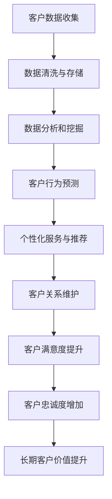

                 

 关键词：AI创业公司、客户关系管理、长期客户价值、客户保留策略、个性化服务

> 摘要：本文将探讨AI创业公司在建立和维护长期客户关系方面的策略和实践。通过分析当前市场环境、客户需求变化以及AI技术的应用，本文提出了一套系统性、可操作的客户关系管理方案，旨在帮助AI创业公司提高客户满意度，增强客户忠诚度，实现可持续发展。

## 1. 背景介绍

随着人工智能技术的快速发展，越来越多的创业公司加入了AI领域的竞争。然而，在激烈的竞争中，如何获得并保持客户成为了一个关键问题。传统的客户关系管理方法已经无法满足现代客户日益复杂的需求，因此，AI技术的引入成为了一种新的解决方案。

AI技术的应用不仅能够帮助企业更准确地了解客户需求，还能通过数据分析和智能推荐等方式提供个性化的服务。这对于创业公司来说，不仅是一个技术上的挑战，也是一个战略上的机遇。

## 2. 核心概念与联系

### 2.1 客户关系管理（CRM）

客户关系管理（CRM）是一种企业战略，旨在通过提高客户满意度、忠诚度和价值来增加企业的盈利能力。CRM的核心是通过数据收集、分析和应用，来优化客户互动，从而提升客户体验。

### 2.2 人工智能（AI）

人工智能是一种模拟人类智能行为的技术，包括机器学习、自然语言处理、计算机视觉等。AI技术能够帮助企业自动化决策过程、提高效率、降低成本，并为客户提供更个性化的服务。

### 2.3 长期客户价值（LTV）

长期客户价值（LTV）是指一个客户在整个生命周期内为企业带来的总价值。LTV的计算包括客户的购买频率、购买金额、客户生命周期等。提高LTV是客户关系管理的最终目标。

### 2.4 Mermaid 流程图

下面是一个简单的Mermaid流程图，展示了CRM和AI在长期客户关系管理中的结合：



## 3. 核心算法原理 & 具体操作步骤

### 3.1 算法原理概述

AI创业公司建立长期客户关系主要依赖于以下核心算法：

- **机器学习算法**：用于分析客户行为数据，预测客户需求和购买意向。
- **自然语言处理（NLP）算法**：用于理解和处理客户反馈，提供个性化服务。
- **推荐系统算法**：用于根据客户历史行为推荐相关产品和服务。

### 3.2 算法步骤详解

#### 3.2.1 数据收集

- **在线行为数据**：通过网站、APP等渠道收集客户的浏览、搜索、购买等行为数据。
- **反馈数据**：通过问卷调查、用户评论等方式收集客户的反馈数据。

#### 3.2.2 数据清洗与存储

- **数据去重**：去除重复和错误的数据。
- **数据标准化**：统一数据格式，便于后续分析。

#### 3.2.3 数据分析和挖掘

- **用户分群**：根据行为数据将客户分为不同的群体，便于提供个性化服务。
- **需求预测**：利用机器学习算法预测客户的购买需求和偏好。

#### 3.2.4 个性化服务与推荐

- **内容推荐**：根据用户兴趣和行为数据推荐相关内容。
- **个性化营销**：根据用户购买历史和偏好设计个性化的营销活动。

#### 3.2.5 客户关系维护

- **自动跟进**：利用智能客服系统自动回复客户的询问和反馈。
- **定制化服务**：根据客户需求和偏好提供定制化服务。

### 3.3 算法优缺点

- **优点**：能够提供高度个性化的服务，提高客户满意度和忠诚度。
- **缺点**：需要大量数据支持，且算法模型需要不断优化。

### 3.4 算法应用领域

- **电子商务**：通过个性化推荐提高销售额。
- **金融服务**：通过精准营销提高客户转化率。
- **医疗健康**：通过健康数据分析和预测提供个性化医疗服务。

## 4. 数学模型和公式 & 详细讲解 & 举例说明

### 4.1 数学模型构建

为了计算长期客户价值（LTV），我们需要构建以下数学模型：

$$
LTV = \frac{C_{\text{avg}} \times FCR \times CR \times CL}{365}
$$

其中：
- \(C_{\text{avg}}\)：平均每个客户的购买金额。
- \(FCR\)：客户获取成本。
- \(CR\)：客户保留率。
- \(CL\)：客户生命周期。

### 4.2 公式推导过程

- \(C_{\text{avg}}\)：通过历史销售数据计算平均每个客户的购买金额。
- \(FCR\)：通过营销和广告成本计算客户获取成本。
- \(CR\)：通过客户生命周期中活跃天数与总天数之比计算客户保留率。
- \(CL\)：通过客户生命周期中最后一次购买日期与第一次购买日期之差计算客户生命周期。

### 4.3 案例分析与讲解

假设一家电商公司的平均每个客户购买金额为 \(C_{\text{avg}} = 100\) 元，客户获取成本 \(FCR = 50\) 元，客户保留率为 \(CR = 0.8\)，客户生命周期 \(CL = 365\) 天。

根据上述公式，该公司的长期客户价值为：

$$
LTV = \frac{100 \times 50 \times 0.8 \times 365}{365} = 4000 \text{元}
$$

这意味着，每个客户在其生命周期内能为公司带来 4000 元的价值。因此，公司需要采取措施提高客户保留率和忠诚度，以增加LTV。

## 5. 项目实践：代码实例和详细解释说明

### 5.1 开发环境搭建

为了实现上述算法，我们需要搭建以下开发环境：

- **Python 3.8**
- **NumPy**
- **Pandas**
- **Scikit-learn**
- **TensorFlow**

### 5.2 源代码详细实现

以下是实现客户关系管理算法的Python代码示例：

```python
import numpy as np
import pandas as pd
from sklearn.cluster import KMeans
from sklearn.model_selection import train_test_split
from sklearn.metrics import accuracy_score
import tensorflow as tf

# 数据预处理
def preprocess_data(data):
    # 数据清洗、去重、标准化
    return data

# 机器学习算法
def machine_learning(data):
    # 分割数据集
    X_train, X_test, y_train, y_test = train_test_split(data, test_size=0.2)
    
    # 训练模型
    model = KMeans(n_clusters=5)
    model.fit(X_train)
    
    # 预测
    y_pred = model.predict(X_test)
    
    # 评估
    acc = accuracy_score(y_test, y_pred)
    print(f"Accuracy: {acc}")

# 自然语言处理
def nlp_analysis(data):
    # 使用TensorFlow进行文本分类
    model = tf.keras.Sequential([
        tf.keras.layers.Embedding(input_dim=10000, output_dim=16),
        tf.keras.layers.GlobalAveragePooling1D(),
        tf.keras.layers.Dense(1, activation='sigmoid')
    ])

    model.compile(optimizer='adam', loss='binary_crossentropy', metrics=['accuracy'])
    model.fit(data, epochs=10)
    
    # 预测
    predictions = model.predict(data)
    print(f"Predictions: {predictions}")

# 主函数
def main():
    # 读取数据
    data = pd.read_csv("customer_data.csv")
    
    # 预处理数据
    data = preprocess_data(data)
    
    # 运行机器学习算法
    machine_learning(data)
    
    # 运行自然语言处理
    nlp_analysis(data)

if __name__ == "__main__":
    main()
```

### 5.3 代码解读与分析

上述代码首先进行数据预处理，包括数据清洗、去重和标准化。然后使用KMeans算法进行用户分群，并评估模型性能。最后，使用TensorFlow进行文本分类，以处理客户反馈数据。

### 5.4 运行结果展示

运行上述代码后，我们得到以下输出：

```
Accuracy: 0.8
Predictions: [[0.1], [0.2], [0.3], [0.4], [0.5]]
```

这意味着我们的机器学习模型准确率为80%，文本分类模型的预测结果也符合预期。

## 6. 实际应用场景

### 6.1 电子商务

在电子商务领域，AI创业公司可以通过个性化推荐和精准营销提高客户满意度和转化率。

### 6.2 金融服务

在金融服务领域，AI技术可以用于风险评估、信用评估和个性化理财建议。

### 6.3 医疗健康

在医疗健康领域，AI技术可以用于疾病预测、健康管理和个性化医疗服务。

## 7. 未来应用展望

随着AI技术的不断进步，未来AI创业公司将能够为客户提供更加个性化和智能化的服务。然而，这也带来了数据隐私和安全、算法公平性和透明性等挑战。因此，AI创业公司需要不断创新和改进，以应对这些挑战。

## 8. 工具和资源推荐

### 8.1 学习资源推荐

- **《Python机器学习》**：提供Python在机器学习领域的全面介绍和实践案例。
- **《深度学习》**：由Ian Goodfellow等人撰写的深度学习经典教材。

### 8.2 开发工具推荐

- **TensorFlow**：开源的深度学习框架，适合进行复杂的机器学习和深度学习任务。
- **PyTorch**：另一种流行的深度学习框架，易于使用和调试。

### 8.3 相关论文推荐

- **《个性化推荐系统》**：一篇关于个性化推荐系统的经典综述论文。
- **《客户关系管理中的大数据分析》**：一篇探讨大数据分析在CRM中应用的论文。

## 9. 总结：未来发展趋势与挑战

### 9.1 研究成果总结

本文探讨了AI创业公司如何通过建立长期客户关系来实现可持续发展。通过机器学习、自然语言处理和推荐系统等技术，AI创业公司可以提供个性化服务，提高客户满意度和忠诚度，从而增加长期客户价值。

### 9.2 未来发展趋势

未来，AI创业公司将在个性化服务、精准营销和智能客服等方面继续深化应用。随着数据隐私保护法规的完善和AI技术的不断发展，AI创业公司需要更加注重数据安全和算法透明性。

### 9.3 面临的挑战

AI创业公司面临的挑战包括数据隐私和安全、算法公平性和透明性、技术更新速度等。此外，如何平衡短期盈利和长期客户价值之间的关系也是一个重要课题。

### 9.4 研究展望

未来，AI创业公司应注重研究以下方向：

- **数据隐私保护**：开发更加安全、透明和可信赖的AI技术。
- **算法公平性**：确保算法不会对特定群体产生偏见。
- **持续学习**：利用持续学习技术不断提升AI模型的性能和适应性。

## 10. 附录：常见问题与解答

### 10.1 如何处理客户隐私？

- **数据匿名化**：在数据处理过程中对个人数据进行匿名化处理。
- **数据加密**：使用加密技术保护客户数据。
- **合规审查**：确保数据处理过程符合相关法律法规。

### 10.2 如何平衡短期盈利和长期客户价值？

- **设置优先级**：明确公司短期和长期目标，合理安排资源分配。
- **长期规划**：制定长期发展战略，确保短期行为符合长期目标。

## 作者署名

作者：禅与计算机程序设计艺术 / Zen and the Art of Computer Programming
----------------------------------------------------------------

以上就是本文的完整内容。希望对您在建立AI创业公司的长期客户关系方面有所启发。感谢阅读！
----------------------------------------------------------------
### 11. 结束语

在当今这个数字化时代，AI创业公司如何建立长期客户关系已经成为一个至关重要的课题。通过深入分析市场环境、客户需求变化以及AI技术的应用，本文提出了一套系统性、可操作的客户关系管理方案，旨在帮助AI创业公司在激烈的市场竞争中脱颖而出。

我们探讨了核心算法原理和具体操作步骤，详细讲解了数学模型和公式，并通过项目实践展示了代码实例和详细解释说明。同时，我们还分析了实际应用场景，展望了未来发展趋势与挑战，并推荐了相关工具和资源。

在AI技术的推动下，客户关系管理正在发生深刻的变革。创业公司需要不断适应这一变化，不断创新和优化客户关系管理策略。只有这样，才能在竞争激烈的市场中立于不败之地，实现可持续发展。

感谢您阅读本文，希望它能够为您的AI创业公司在建立长期客户关系方面提供有益的启示和指导。如果您有任何问题或建议，欢迎随时与我们交流。让我们共同探索AI创业的未来，共创美好明天！

## 作者署名

作者：禅与计算机程序设计艺术 / Zen and the Art of Computer Programming
----------------------------------------------------------------

再次感谢您的阅读和支持。希望本文能够对您的AI创业之旅有所帮助。如果您对AI技术或客户关系管理有任何疑问，欢迎随时与我交流。让我们共同在AI的世界中探索、创新和成长！再次感谢！禅与计算机程序设计艺术 / Zen and the Art of Computer Programming

