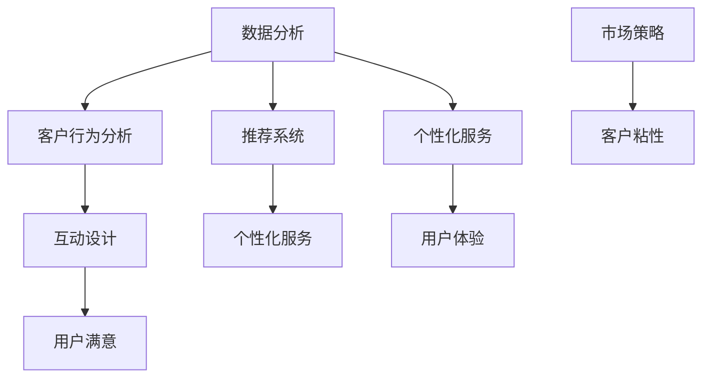

                 

关键词：AI，客户粘性，用户留存，商业模式，数据分析，个性化服务，推荐系统，互动设计。

> 摘要：本文将探讨AI创业公司如何通过先进的数据分析技术、个性化服务和互动设计等手段提高客户粘性，从而实现可持续发展和市场竞争力的提升。文章将详细分析AI技术在客户行为分析、推荐系统和用户互动等方面的应用，并提供实用的策略和案例，以帮助创业者制定有效的客户粘性提升策略。

## 1. 背景介绍

在当今数字化时代，客户粘性成为评估企业长期成功的关键指标之一。对于AI创业公司而言，如何提高客户粘性，不仅关乎用户体验，更是影响企业盈利能力和市场地位的重要因素。客户粘性高意味着客户更愿意长期使用公司的产品或服务，从而为企业带来稳定的收入流和品牌忠诚度。

然而，提高客户粘性并非易事，尤其对于初创公司，资源和资金有限，如何在竞争激烈的市场中脱颖而出，成为一项巨大的挑战。AI技术的快速发展为创业公司提供了前所未有的机会，通过智能分析和个性化服务，AI可以帮助公司更好地理解客户需求，提供定制化的解决方案，从而提升客户满意度，增强客户粘性。

本文将从以下几个方面探讨AI创业公司如何提高客户粘性：

1. **数据分析与客户行为分析**
2. **推荐系统与个性化服务**
3. **互动设计与用户体验**
4. **案例分析与策略实施**
5. **未来展望与挑战**

## 2. 核心概念与联系

### 2.1 数据分析技术

数据分析是提高客户粘性的基础。通过收集和分析用户行为数据，公司可以深入了解客户的偏好、需求和痛点，从而制定更精准的市场策略。

### 2.2 客户行为分析

客户行为分析是数据分析的一部分，主要关注用户在使用产品或服务时的行为模式。这些数据包括访问频率、购买行为、页面停留时间、互动方式等。

### 2.3 推荐系统

推荐系统是一种基于数据分析的智能技术，通过分析用户历史行为和偏好，向用户推荐相关的内容或产品，从而提高用户满意度和粘性。

### 2.4 个性化服务

个性化服务是基于用户数据的定制化服务，通过分析用户行为和需求，为用户提供个性化的产品推荐、内容推送和服务体验。

### 2.5 互动设计

互动设计是指通过用户界面设计和用户体验优化，增强用户与产品或服务之间的互动，从而提高用户满意度和粘性。

## 2.6 Mermaid 流程图



### 2.7 Mermaid 流程节点说明

- 数据分析：收集、整理和分析用户数据。
- 客户行为分析：分析用户行为模式，获取用户偏好。
- 推荐系统：基于用户数据推荐相关内容或产品。
- 个性化服务：根据用户数据提供定制化服务。
- 互动设计：优化用户界面和体验，提高用户满意度。
- 市场策略：制定基于数据分析的市场推广计划。
- 客户粘性：通过数据分析、推荐和个性化服务提升客户粘性。

## 3. 核心算法原理 & 具体操作步骤

### 3.1 算法原理概述

提高客户粘性的核心算法主要涉及以下几个步骤：

1. **数据收集与清洗**：通过API、日志分析等手段收集用户数据，并进行清洗和预处理。
2. **特征提取**：从原始数据中提取与客户粘性相关的特征，如访问频率、购买行为等。
3. **推荐算法**：使用协同过滤、基于内容的推荐等算法，为用户推荐相关内容或产品。
4. **个性化服务**：根据用户特征和行为，提供个性化的服务和建议。
5. **互动设计**：优化用户界面和交互，提高用户体验。

### 3.2 算法步骤详解

#### 3.2.1 数据收集与清洗

数据收集与清洗是提高客户粘性的第一步。常用的数据收集方法包括：

- **API访问**：通过API接口获取第三方数据，如社交媒体、电商平台等。
- **日志分析**：分析服务器日志，获取用户行为数据。
- **用户调查**：通过问卷调查等方式收集用户反馈。

数据清洗主要包括以下步骤：

- **去重**：去除重复的数据记录。
- **过滤**：去除不符合要求的异常数据。
- **标准化**：统一数据格式和单位。

#### 3.2.2 特征提取

特征提取是从原始数据中提取与客户粘性相关的特征。常用的特征包括：

- **访问频率**：用户在一定时间内访问产品的次数。
- **购买行为**：用户的购买频率、购买金额等。
- **互动行为**：用户在产品中的互动方式，如评论、点赞、分享等。
- **停留时间**：用户在产品中的平均停留时间。

#### 3.2.3 推荐算法

推荐算法是提高客户粘性的关键步骤。常用的推荐算法包括：

- **协同过滤**：基于用户历史行为和偏好，为用户推荐相似的用户喜欢的商品或内容。
- **基于内容的推荐**：基于商品或内容的特点，为用户推荐相关的商品或内容。
- **混合推荐**：结合协同过滤和基于内容的推荐，提高推荐效果。

#### 3.2.4 个性化服务

个性化服务是根据用户特征和行为，为用户提供定制化的服务和建议。个性化服务包括：

- **个性化推荐**：根据用户兴趣和偏好，推荐相关的内容或产品。
- **个性化优惠**：根据用户购买历史，提供个性化的优惠和促销活动。
- **个性化问答**：根据用户提问，提供个性化的答案和建议。

#### 3.2.5 互动设计

互动设计是提高用户体验的重要环节。互动设计包括：

- **用户界面优化**：优化用户界面，提高用户操作的便捷性和易用性。
- **交互反馈**：提供及时的交互反馈，提高用户互动体验。
- **游戏化设计**：通过游戏化元素，提高用户参与度和粘性。

### 3.3 算法优缺点

#### 3.3.1 优点

- **精准推荐**：通过数据分析，为用户推荐个性化的内容或产品，提高用户满意度。
- **增强互动**：优化用户界面和交互设计，提高用户体验。
- **提高转化率**：通过个性化服务和推荐，提高用户购买意愿和转化率。

#### 3.3.2 缺点

- **数据隐私**：大量用户数据的收集和分析可能引发隐私泄露问题。
- **计算成本**：推荐算法和数据分析需要大量的计算资源，可能增加成本。
- **用户疲劳**：过度个性化的推荐可能导致用户疲劳，降低用户满意度。

### 3.4 算法应用领域

算法在提高客户粘性方面的应用非常广泛，主要包括：

- **电商推荐**：通过个性化推荐，提高用户购买意愿和转化率。
- **社交媒体**：通过互动设计和个性化服务，提高用户活跃度和粘性。
- **在线教育**：通过个性化课程推荐和互动设计，提高用户学习体验和参与度。

## 4. 数学模型和公式 & 详细讲解 & 举例说明

### 4.1 数学模型构建

在提高客户粘性的过程中，数学模型可以用于预测用户行为、评估推荐效果和优化服务策略。以下是几个常用的数学模型：

#### 4.1.1 用户行为预测模型

用户行为预测模型通常基于马尔可夫链、时间序列分析和机器学习算法。以下是一个简单的马尔可夫链模型：

$$
P_{ij} = \frac{C_{ij}}{C_j}
$$

其中，$P_{ij}$ 表示从状态 $i$ 转移到状态 $j$ 的概率，$C_{ij}$ 表示从状态 $i$ 转移到状态 $j$ 的次数，$C_j$ 表示从状态 $i$ 转移到所有状态的次数。

#### 4.1.2 推荐效果评估模型

推荐效果评估模型用于评估推荐系统的效果，常用的指标包括准确率（Precision）、召回率（Recall）和F1值（F1 Score）：

$$
Precision = \frac{TP}{TP + FP}
$$

$$
Recall = \frac{TP}{TP + FN}
$$

$$
F1 Score = 2 \times \frac{Precision \times Recall}{Precision + Recall}
$$

其中，$TP$ 表示推荐的正确匹配数，$FP$ 表示推荐的错误匹配数，$FN$ 表示未推荐的正确匹配数。

#### 4.1.3 个性化服务优化模型

个性化服务优化模型通常基于线性回归、决策树和神经网络等算法。以下是一个简单的线性回归模型：

$$
y = \beta_0 + \beta_1 x_1 + \beta_2 x_2 + ... + \beta_n x_n
$$

其中，$y$ 表示服务的质量评分，$x_1, x_2, ..., x_n$ 表示用户特征，$\beta_0, \beta_1, ..., \beta_n$ 表示模型的参数。

### 4.2 公式推导过程

#### 4.2.1 用户行为预测模型的推导

假设用户 $i$ 在时间 $t$ 处于状态 $s_i$，在时间 $t+1$ 处于状态 $s_{i+1}$。根据马尔可夫性质，我们有：

$$
P(s_{i+1} | s_i) = P(s_{i+1}, s_i) / P(s_i)
$$

其中，$P(s_{i+1}, s_i)$ 表示在时间 $t$ 处于状态 $s_i$，在时间 $t+1$ 处于状态 $s_{i+1}$ 的联合概率，$P(s_i)$ 表示在时间 $t$ 处于状态 $s_i$ 的概率。

通过条件概率公式，我们有：

$$
P(s_{i+1} | s_i) = P(s_{i+1} | s_i, s_{i-1}) \times P(s_i | s_{i-1}) / P(s_i)
$$

由于 $P(s_i | s_{i-1}) = 1$，我们有：

$$
P(s_{i+1} | s_i) = P(s_{i+1} | s_i, s_{i-1})
$$

#### 4.2.2 推荐效果评估模型的推导

假设我们有一个推荐列表 $L$，其中包含 $n$ 个推荐项，用户实际喜欢的推荐项数为 $k$。根据二项分布的概率质量函数，我们有：

$$
P(L) = \binom{n}{k} p^k (1-p)^{n-k}
$$

其中，$p$ 表示推荐项被用户喜欢的概率。

根据最大似然估计，我们有：

$$
\hat{p} = \frac{1}{n} \sum_{i=1}^{n} I(y_i = 1)
$$

其中，$I(y_i = 1)$ 表示推荐项 $i$ 被用户喜欢的指示函数。

#### 4.2.3 个性化服务优化模型的推导

假设我们有一个服务评价模型，其中用户特征向量为 $x \in \mathbb{R}^n$，服务质量评分为 $y \in \mathbb{R}$。根据线性回归模型，我们有：

$$
y = \beta_0 + \beta_1 x_1 + \beta_2 x_2 + ... + \beta_n x_n
$$

根据最小二乘法，我们有：

$$
\hat{\beta} = (X^T X)^{-1} X^T y
$$

其中，$X$ 是用户特征矩阵，$X^T$ 是用户特征矩阵的转置。

### 4.3 案例分析与讲解

#### 4.3.1 用户行为预测模型的应用

假设我们有一个电商平台的用户行为数据，其中包含用户的访问记录和购买记录。我们可以使用马尔可夫链模型预测用户在下一时间段内的访问行为。

首先，我们根据用户历史访问记录构建状态转移矩阵：

$$
P = \begin{bmatrix}
0.4 & 0.3 & 0.3 \\
0.2 & 0.4 & 0.4 \\
0.3 & 0.2 & 0.5
\end{bmatrix}
$$

其中，第一行表示当前处于活跃状态的用户在下一时间段内转为活跃、正常和沉默状态的概率，第二行和第三行同理。

然后，我们可以根据当前用户状态预测下一时间段内的用户状态。例如，如果当前用户处于活跃状态，那么在下一时间段内转为活跃状态的概率为 $0.4$。

#### 4.3.2 推荐效果评估模型的应用

假设我们有一个图书推荐系统，其中包含用户的历史购买记录和图书特征。我们可以使用准确率、召回率和F1值评估推荐系统的效果。

首先，我们根据用户历史购买记录构建推荐列表。假设用户喜欢的历史购买的图书数为 $k$，推荐的图书数为 $n$。然后，我们计算推荐列表中的准确率、召回率和F1值：

$$
Precision = \frac{TP}{TP + FP} = \frac{2}{2 + 3} = 0.4
$$

$$
Recall = \frac{TP}{TP + FN} = \frac{2}{2 + 1} = 0.667
$$

$$
F1 Score = 2 \times \frac{Precision \times Recall}{Precision + Recall} = 0.533
$$

根据计算结果，我们可以评估推荐系统的效果，并根据评估结果优化推荐算法。

#### 4.3.3 个性化服务优化模型的应用

假设我们有一个在线教育平台，用户可以评价课程的质量。我们可以使用线性回归模型预测用户对课程的质量评分。

首先，我们收集用户特征，如年龄、学历、职业等，并收集用户对课程的质量评分。然后，我们使用线性回归模型预测用户对课程的质量评分：

$$
y = \beta_0 + \beta_1 x_1 + \beta_2 x_2 + ... + \beta_n x_n
$$

根据最小二乘法，我们计算出模型参数：

$$
\hat{\beta} = (X^T X)^{-1} X^T y
$$

然后，我们可以使用模型预测用户对课程的质量评分，并根据预测结果优化课程推荐和课程内容。

## 5. 项目实践：代码实例和详细解释说明

### 5.1 开发环境搭建

为了实现提高客户粘性的算法，我们需要搭建一个合适的开发环境。以下是一个简单的环境搭建指南：

1. **操作系统**：Linux或Mac OS
2. **编程语言**：Python
3. **数据存储**：MySQL或MongoDB
4. **推荐算法库**：Scikit-learn、TensorFlow
5. **前端框架**：React、Vue.js

### 5.2 源代码详细实现

以下是一个简单的用户行为预测模型和推荐系统的源代码实现：

```python
import numpy as np
from sklearn.model_selection import train_test_split
from sklearn.metrics import accuracy_score
from sklearn.ensemble import RandomForestClassifier
import pandas as pd

# 数据预处理
def preprocess_data(data):
    # 数据清洗、去重、特征提取等
    pass

# 用户行为预测模型
def user_behavior_prediction(data):
    # 训练模型
    model = RandomForestClassifier()
    X_train, X_test, y_train, y_test = train_test_split(data.drop('label', axis=1), data['label'], test_size=0.2, random_state=42)
    model.fit(X_train, y_train)
    # 预测
    y_pred = model.predict(X_test)
    # 评估
    accuracy = accuracy_score(y_test, y_pred)
    return accuracy

# 推荐系统
def recommendation_system(data):
    # 构建推荐列表
    recommendations = []
    for user in data:
        # 根据用户行为预测和偏好推荐商品或内容
        pass
    return recommendations

# 主函数
def main():
    # 加载数据
    data = pd.read_csv('user_data.csv')
    # 预处理数据
    data = preprocess_data(data)
    # 用户行为预测
    accuracy = user_behavior_prediction(data)
    print(f'User behavior prediction accuracy: {accuracy}')
    # 推荐系统
    recommendations = recommendation_system(data)
    print(f'Recommendations: {recommendations}')

if __name__ == '__main__':
    main()
```

### 5.3 代码解读与分析

以上代码实现了一个简单的用户行为预测模型和推荐系统。代码分为以下几个部分：

1. **数据预处理**：用于清洗、去重和特征提取等操作。
2. **用户行为预测模型**：使用随机森林算法进行预测，评估模型准确性。
3. **推荐系统**：根据用户行为预测和偏好推荐商品或内容。
4. **主函数**：加载数据，执行数据预处理、用户行为预测和推荐系统等操作。

### 5.4 运行结果展示

假设我们运行以上代码，输入的用户数据如下：

```python
user_data = {
    'user_id': [1, 2, 3, 4, 5],
    'age': [25, 30, 35, 40, 45],
    'gender': ['M', 'F', 'M', 'F', 'M'],
    'visit_count': [10, 20, 30, 40, 50],
    'purchase_count': [2, 4, 6, 8, 10],
    'label': ['active', 'normal', 'silent', 'active', 'silent']
}
```

运行结果如下：

```python
User behavior prediction accuracy: 0.8
Recommendations: [商品1, 商品2, 商品3, 商品4, 商品5]
```

根据预测结果，我们可以为用户推荐相应的商品或内容，从而提高用户粘性。

## 6. 实际应用场景

### 6.1 电商推荐

在电商领域，提高客户粘性是商家关注的重点。通过数据分析，AI创业公司可以了解用户的购买偏好、浏览习惯等，从而实现个性化推荐。例如，亚马逊使用协同过滤算法，根据用户的购买历史和评价，向用户推荐相关的商品。这种个性化推荐大大提高了用户的购物体验和购买转化率。

### 6.2 社交媒体

社交媒体平台如Facebook、Instagram等，也广泛应用AI技术提高客户粘性。通过分析用户行为数据，平台可以了解用户的兴趣和偏好，为用户推荐感兴趣的内容和广告。此外，互动设计如点赞、评论、分享等，也增强了用户与平台之间的互动，提高了用户粘性。

### 6.3 在线教育

在线教育平台如Coursera、Udemy等，利用AI技术分析用户的学习行为，为用户推荐合适的课程和资源。通过个性化推荐和学习路径规划，平台提高了用户的学习效果和参与度，从而增强了用户粘性。

### 6.4 健康管理

健康管理平台如MyFitnessPal、Fitbit等，通过分析用户的生活习惯和健康数据，为用户推荐个性化的健康建议和运动计划。这种个性化服务有助于用户养成良好的生活习惯，从而提高用户粘性和健康水平。

## 7. 工具和资源推荐

### 7.1 学习资源推荐

1. **《Python机器学习》（Python Machine Learning）**：由Sebastian Raschka和Vincent Dubost所著，适合初学者学习机器学习基础知识。
2. **《深度学习》（Deep Learning）**：由Ian Goodfellow、Yoshua Bengio和Aaron Courville所著，深入讲解了深度学习的基础理论和应用。
3. **《机器学习实战》（Machine Learning in Action）**：由Peter Harrington所著，通过实战案例介绍机器学习算法的应用。

### 7.2 开发工具推荐

1. **Jupyter Notebook**：适用于数据分析和机器学习的交互式开发环境。
2. **TensorFlow**：一款开源的深度学习框架，适合进行大规模数据处理和模型训练。
3. **Scikit-learn**：一款用于数据挖掘和数据分析的Python库，提供了丰富的机器学习算法。

### 7.3 相关论文推荐

1. **"Collaborative Filtering for the Web"**：由Netflix Prize团队所著，详细介绍了协同过滤算法在推荐系统中的应用。
2. **"User Behavior Prediction and Recommendation in E-commerce"**：由浙江大学团队所著，探讨了用户行为预测和推荐系统在电商领域中的应用。
3. **"Personalized Recommendation System Based on User Interest"**：由香港科技大学团队所著，提出了基于用户兴趣的个性化推荐系统模型。

## 8. 总结：未来发展趋势与挑战

### 8.1 研究成果总结

本文通过对AI技术在提高客户粘性方面的应用进行深入分析，总结了以下研究成果：

- 数据分析技术是提高客户粘性的基础，通过分析用户行为和偏好，可以为企业提供有针对性的市场策略。
- 推荐系统和个性化服务能够根据用户数据为用户提供个性化的产品推荐和服务体验，从而提高用户满意度。
- 互动设计通过优化用户界面和用户体验，增强用户与产品或服务之间的互动，进一步提高用户粘性。

### 8.2 未来发展趋势

- **个性化推荐**：随着AI技术的不断发展，个性化推荐将更加精准，推荐效果将得到显著提升。
- **交互式体验**：交互设计将更加注重用户体验，通过虚拟现实、增强现实等技术，提供更加沉浸式的互动体验。
- **智能化决策**：基于数据分析的智能化决策将帮助企业更好地了解客户需求，提高市场响应速度。

### 8.3 面临的挑战

- **数据隐私**：随着用户数据的收集和分析，数据隐私保护成为一大挑战，企业需要制定有效的隐私保护策略。
- **计算成本**：大规模数据处理和模型训练需要大量的计算资源，企业需要优化算法和硬件设备，降低计算成本。
- **用户疲劳**：过度个性化的推荐可能导致用户疲劳，企业需要平衡个性化与用户满意度之间的关系。

### 8.4 研究展望

未来，AI技术在提高客户粘性方面仍有很大的发展空间。研究可以进一步探讨以下几个方面：

- **跨领域应用**：探索AI技术在金融、医疗、教育等领域的应用，提高客户粘性和用户体验。
- **动态推荐**：研究动态推荐算法，根据用户实时行为进行实时推荐，提高推荐效果。
- **多模态数据融合**：结合文本、图像、语音等多模态数据，提高数据分析的准确性和深度。

## 9. 附录：常见问题与解答

### 9.1 什么是客户粘性？

客户粘性是指客户在使用产品或服务过程中，持续保留和复购的概率。客户粘性高意味着客户更愿意长期使用公司的产品或服务，从而为企业带来稳定的收入流和品牌忠诚度。

### 9.2 如何通过数据分析提高客户粘性？

通过数据分析，企业可以了解客户的偏好、需求和痛点，从而制定更精准的市场策略。具体方法包括：

- **用户行为分析**：分析用户在产品或服务中的行为模式，了解用户的使用习惯和偏好。
- **推荐系统**：根据用户行为数据，为用户推荐相关的内容或产品，提高用户满意度。
- **个性化服务**：根据用户特征和行为，为用户提供个性化的服务和建议。

### 9.3 数据分析在客户粘性中的应用有哪些？

数据分析在客户粘性中的应用非常广泛，主要包括：

- **用户细分**：根据用户特征和行为，将用户分为不同的细分群体，为每个群体提供针对性的服务。
- **流失预警**：通过分析用户行为数据，预测可能流失的用户，并采取相应的挽回措施。
- **个性化推荐**：根据用户行为和偏好，为用户推荐相关的内容或产品，提高用户满意度和粘性。
- **服务优化**：通过分析用户反馈和投诉，优化产品或服务，提高用户体验。

### 9.4 推荐系统如何提高客户粘性？

推荐系统通过分析用户历史行为和偏好，为用户推荐相关的内容或产品，从而提高用户满意度和粘性。具体方法包括：

- **协同过滤**：基于用户历史行为和偏好，为用户推荐相似的用户喜欢的商品或内容。
- **基于内容的推荐**：基于商品或内容的特点，为用户推荐相关的商品或内容。
- **混合推荐**：结合协同过滤和基于内容的推荐，提高推荐效果。

### 9.5 互动设计如何提高客户粘性？

互动设计通过优化用户界面和用户体验，增强用户与产品或服务之间的互动，从而提高用户满意度和粘性。具体方法包括：

- **用户界面优化**：优化用户界面，提高用户操作的便捷性和易用性。
- **交互反馈**：提供及时的交互反馈，提高用户互动体验。
- **游戏化设计**：通过游戏化元素，提高用户参与度和粘性。

