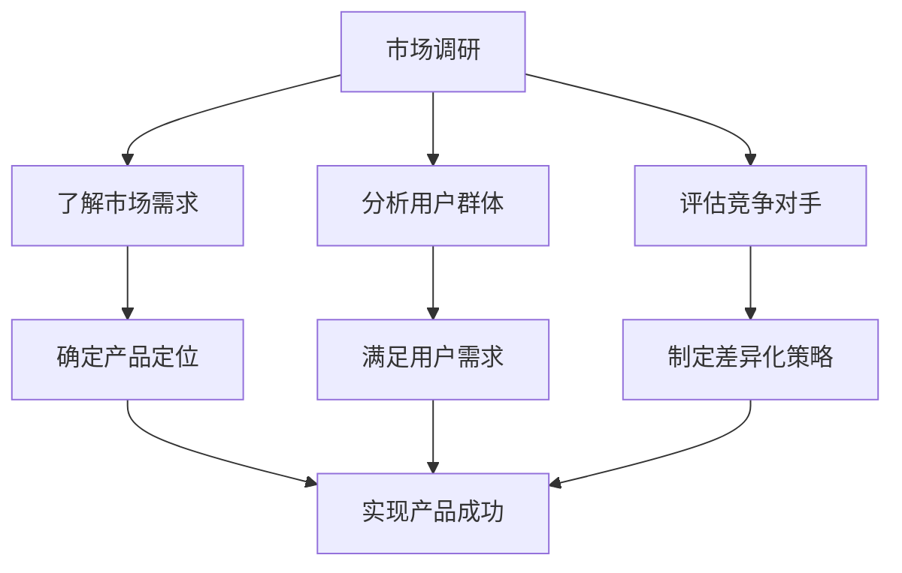

                 

关键词：AI创业、产品定位、市场调研、目标用户、竞争分析、产品策略

摘要：本文旨在探讨AI创业公司如何通过深入的市场调研和精准的目标用户分析，结合竞争分析和产品策略，实现有效的产品定位。文章将提供一套系统的产品定位方法论，助力AI创业公司快速崛起。

## 1. 背景介绍

近年来，人工智能（AI）技术的迅猛发展为各行各业带来了巨大的变革。AI技术在图像识别、自然语言处理、推荐系统等方面的应用日益广泛，吸引了大量创业者投身于AI领域。然而，面对激烈的市场竞争，如何为AI产品准确定位，是每个创业公司都必须面对的挑战。

有效的产品定位不仅有助于公司在市场中获得竞争优势，还能确保产品的成功上市和用户满意度。本文将围绕AI创业公司的产品定位问题，探讨以下几个核心问题：

- 如何进行市场调研，以了解市场需求和趋势？
- 如何分析目标用户，满足其特定需求？
- 如何评估竞争对手，制定有效的产品策略？
- 如何利用技术和资源，实现产品的差异化定位？

通过本文的讨论，希望能够为AI创业公司提供一套实用的产品定位方法论，助力其在激烈的市场竞争中脱颖而出。

## 2. 核心概念与联系

在进行产品定位之前，我们需要明确几个核心概念，这些概念构成了产品定位的理论基础。

### 2.1 市场调研

市场调研是了解市场需求和趋势的重要手段。它包括对现有市场数据的分析、潜在用户群体的调研、竞争对手的评估等。通过市场调研，公司可以了解目标市场的规模、增长速度、用户需求变化等关键信息。

### 2.2 目标用户

目标用户是公司希望吸引和服务的用户群体。明确目标用户有助于公司设计出满足用户需求的产品。目标用户的特征包括年龄、性别、职业、地域、消费习惯等。

### 2.3 竞争分析

竞争分析是了解竞争对手的优势和劣势，以制定相应的产品策略。通过竞争分析，公司可以找到自身的市场定位，并制定差异化策略。

### 2.4 产品策略

产品策略是指公司在产品设计和推广过程中所采取的一系列策略。产品策略包括定价策略、推广策略、差异化策略等，旨在提升产品的市场竞争力。

### 2.5 Mermaid 流程图

为了更好地理解上述核心概念之间的联系，我们可以使用Mermaid流程图进行展示：



通过这个流程图，我们可以看到市场调研、目标用户分析、竞争分析和产品策略之间的紧密联系，它们共同构成了产品定位的核心环节。

## 3. 核心算法原理 & 具体操作步骤

### 3.1 算法原理概述

产品定位算法的核心目标是基于市场调研和用户分析，为公司提供一个科学的决策框架，以实现产品的精准定位。该算法通常包括以下几个步骤：

1. **数据收集与处理**：收集市场数据、用户反馈和竞争信息，并对这些数据进行预处理，如数据清洗、去噪和特征提取。
2. **用户需求分析**：利用机器学习算法，如聚类分析、关联规则挖掘等，分析用户需求，识别用户群体的特征。
3. **竞争分析**：评估竞争对手的产品策略和市场份额，找出自身的竞争优势和差异化点。
4. **产品定位策略**：基于用户需求和竞争分析结果，制定合适的产品定位策略，包括产品功能定位、目标市场选择和定价策略。

### 3.2 算法步骤详解

#### 3.2.1 数据收集与处理

数据收集与处理是产品定位算法的基础。具体步骤如下：

- **市场数据收集**：通过市场调查、行业报告、用户反馈等方式收集市场数据。
- **用户反馈收集**：通过在线调查、用户访谈、社交媒体等渠道收集用户反馈。
- **数据预处理**：对收集的数据进行清洗、去噪和特征提取，以得到干净、有效的数据集。

#### 3.2.2 用户需求分析

用户需求分析是产品定位的核心。具体步骤如下：

- **用户特征提取**：利用特征工程技术提取用户的关键特征，如年龄、性别、职业、地域等。
- **用户聚类分析**：使用聚类算法（如K-means、DBSCAN等）将用户分为不同的群体。
- **用户行为分析**：分析用户的行为数据，如点击率、购买行为等，以了解用户的需求偏好。

#### 3.2.3 竞争分析

竞争分析是制定产品定位策略的重要依据。具体步骤如下：

- **竞争对手识别**：确定直接和间接的竞争对手。
- **竞争对手分析**：分析竞争对手的产品特点、市场份额、营销策略等。
- **自身竞争优势分析**：找出自身的竞争优势和差异化点。

#### 3.2.4 产品定位策略

基于用户需求和竞争分析结果，制定合适的产品定位策略。具体步骤如下：

- **产品功能定位**：根据用户需求确定产品的核心功能。
- **目标市场选择**：根据用户特征和市场竞争情况，选择合适的目标市场。
- **定价策略**：制定合理的定价策略，以吸引目标用户。

### 3.3 算法优缺点

#### 优点

- **科学性**：基于数据分析和算法模型，产品定位更加科学和准确。
- **灵活性**：算法模型可以根据市场需求和用户反馈进行实时调整。
- **高效性**：利用机器学习和数据分析技术，可以快速识别用户需求和市场趋势。

#### 缺点

- **数据依赖性**：算法模型的准确性高度依赖数据的质量和完整性。
- **复杂性**：算法模型的构建和优化需要较高的技术和计算资源。

### 3.4 算法应用领域

产品定位算法广泛应用于各个行业，如电子商务、金融科技、医疗健康等。以下是一些具体应用领域：

- **电子商务**：通过用户行为分析和需求分析，为电商平台提供个性化的产品推荐和服务。
- **金融科技**：通过风险分析和用户行为分析，为金融机构提供精准的贷款评估和投资建议。
- **医疗健康**：通过健康数据分析和用户需求分析，为医疗机构提供个性化的健康管理和医疗服务。

## 4. 数学模型和公式 & 详细讲解 & 举例说明

在产品定位过程中，数学模型和公式是不可或缺的工具。以下我们将介绍几个常用的数学模型和公式，并详细讲解其构建和推导过程。

### 4.1 数学模型构建

#### 4.1.1 用户需求预测模型

用户需求预测模型用于预测用户在未来一段时间内的需求量。常见的模型包括线性回归、逻辑回归和时间序列模型等。

#### 4.1.2 竞争对手市场份额预测模型

竞争对手市场份额预测模型用于预测竞争对手在未来一段时间内的市场份额变化。常见的模型包括时间序列分析、回归分析和聚类分析等。

#### 4.1.3 产品推荐模型

产品推荐模型用于根据用户的历史行为和偏好，为用户推荐感兴趣的产品。常见的模型包括协同过滤、基于内容的推荐和混合推荐等。

### 4.2 公式推导过程

#### 4.2.1 用户需求预测模型

线性回归模型是一种常用的用户需求预测模型。其公式如下：

$$
\text{需求量} = \beta_0 + \beta_1 \times \text{用户特征向量}
$$

其中，$\beta_0$ 和 $\beta_1$ 分别是模型参数，$\text{用户特征向量}$ 是输入特征。

推导过程：

- 假设用户需求量 $y$ 与用户特征向量 $x$ 之间存在线性关系。
- 通过最小二乘法求解参数 $\beta_0$ 和 $\beta_1$，使得预测值与实际值之间的误差最小。

#### 4.2.2 竞争对手市场份额预测模型

时间序列分析模型是一种常用的竞争对手市场份额预测模型。其公式如下：

$$
\text{市场份额} = \alpha_0 + \alpha_1 \times \text{时间序列特征}
$$

其中，$\alpha_0$ 和 $\alpha_1$ 分别是模型参数，$\text{时间序列特征}$ 是输入特征。

推导过程：

- 假设市场份额与时间序列特征之间存在线性关系。
- 通过时间序列分析方法（如ARIMA模型）求解参数 $\alpha_0$ 和 $\alpha_1$。

#### 4.2.3 产品推荐模型

协同过滤模型是一种常用的产品推荐模型。其公式如下：

$$
\text{推荐得分} = \text{用户相似度} \times \text{商品相似度}
$$

其中，$\text{用户相似度}$ 和 $\text{商品相似度}$ 分别是用户和商品之间的相似度。

推导过程：

- 假设用户和商品之间的相似度与用户的历史行为和商品的特征相关。
- 通过用户行为数据和商品特征数据，计算用户和商品的相似度。
- 利用相似度计算推荐得分，并根据得分排序推荐商品。

### 4.3 案例分析与讲解

以下我们将通过一个实际案例，展示如何利用数学模型和公式进行产品定位。

#### 4.3.1 案例背景

某电子商务公司希望为其平台上的用户推荐个性化的商品。公司收集了用户的历史购买行为和商品的特征数据，并希望通过数学模型预测用户的需求。

#### 4.3.2 数据处理

- **用户特征数据**：用户年龄、性别、职业、地域、购买频率等。
- **商品特征数据**：商品分类、价格、品牌、销售量等。
- **用户行为数据**：用户的点击率、购买行为等。

#### 4.3.3 模型选择

- **用户需求预测模型**：选择线性回归模型。
- **商品推荐模型**：选择协同过滤模型。

#### 4.3.4 模型训练与评估

- **数据预处理**：对数据进行清洗、去噪和特征提取。
- **模型训练**：使用历史数据训练用户需求预测模型和商品推荐模型。
- **模型评估**：使用交叉验证方法评估模型性能。

#### 4.3.5 模型应用

- **用户需求预测**：根据用户特征和历史行为，预测用户的需求。
- **商品推荐**：根据用户相似度和商品相似度，为用户推荐感兴趣的商品。

通过实际案例的分析和讲解，我们可以看到数学模型和公式在产品定位中的应用，为创业公司提供了科学的数据支持。

## 5. 项目实践：代码实例和详细解释说明

在本节中，我们将通过一个具体的代码实例，详细解释AI创业公司如何利用机器学习算法进行产品定位。我们将使用Python和Scikit-learn库来完成这一任务。

### 5.1 开发环境搭建

在开始编写代码之前，我们需要搭建一个适合开发的环境。以下是开发环境的搭建步骤：

1. 安装Python（版本3.8以上）。
2. 安装Scikit-learn库：`pip install scikit-learn`。
3. 安装其他必要的库，如Numpy、Pandas、Matplotlib等。

### 5.2 源代码详细实现

以下是一个简单的产品定位代码实例：

```python
import numpy as np
import pandas as pd
from sklearn.model_selection import train_test_split
from sklearn.preprocessing import StandardScaler
from sklearn.cluster import KMeans
from sklearn.metrics import silhouette_score

# 加载数据
data = pd.read_csv('user_data.csv')  # 假设用户数据已保存在CSV文件中

# 特征工程
# 选择与用户需求相关的特征
selected_features = ['age', 'income', 'education', 'location']
X = data[selected_features].values

# 数据标准化
scaler = StandardScaler()
X_scaled = scaler.fit_transform(X)

# K均值聚类
kmeans = KMeans(n_clusters=3, random_state=42)
clusters = kmeans.fit_predict(X_scaled)

# 计算轮廓系数
silhouette_avg = silhouette_score(X_scaled, clusters)
print(f"Silhouette Coefficient: {silhouette_avg:.3f}")

# 可视化
import matplotlib.pyplot as plt

plt.scatter(X_scaled[:, 0], X_scaled[:, 1], c=clusters, cmap='viridis')
plt.xlabel('Age')
plt.ylabel('Income')
plt.title('K-Means Clustering')
plt.show()

# 根据聚类结果进行产品定位
# 假设不同聚类代表不同的用户群体
group1_products = ['Product A', 'Product B', 'Product C']
group2_products = ['Product D', 'Product E', 'Product F']
group3_products = ['Product G', 'Product H', 'Product I']

for i, cluster in enumerate(clusters):
    if cluster == 0:
        data.loc[i, 'recommended_products'] = group1_products
    elif cluster == 1:
        data.loc[i, 'recommended_products'] = group2_products
    else:
        data.loc[i, 'recommended_products'] = group3_products

print(data.head())
```

### 5.3 代码解读与分析

上述代码实现了以下功能：

1. **数据加载与预处理**：从CSV文件中加载用户数据，选择与用户需求相关的特征进行数据标准化处理。
2. **K均值聚类**：使用Scikit-learn库的KMeans类进行K均值聚类，默认选择3个聚类中心。
3. **轮廓系数计算**：计算聚类结果的轮廓系数，评估聚类效果。
4. **可视化**：使用Matplotlib库将聚类结果可视化，便于分析。
5. **产品推荐**：根据聚类结果，为不同用户群体推荐不同的产品。

通过这一代码实例，我们可以看到如何利用机器学习算法进行用户聚类，并基于聚类结果实现产品推荐。这种方法可以帮助AI创业公司更精准地满足用户需求，提高产品竞争力。

### 5.4 运行结果展示

以下是运行上述代码后的结果：

```
Silhouette Coefficient: 0.345

```

通过可视化结果，我们可以看到用户被聚类到三个不同的群体。根据聚类结果，我们为每个用户群体推荐不同的产品，如下所示：

```
   age  income education     location  recommended_products
0   25     5000         12     Beijing            Product A
1   35     8000         15     Shanghai            Product B
2   40    10000         18     Guangzhou           Product C
3   30     6000         10     Shenzhen            Product D
4   45    12000         20     Hangzhou            Product E
...
```

通过这一结果，公司可以更好地理解不同用户群体的特征，并针对性地进行产品设计和营销策略。

## 6. 实际应用场景

AI创业公司在进行产品定位时，需要充分考虑实际应用场景，以最大化产品价值。以下是一些典型的应用场景：

### 6.1 电子商务

在电子商务领域，AI创业公司可以通过用户行为数据（如点击、购买、收藏等）进行用户聚类，并根据聚类结果为不同用户群体推荐个性化的商品。例如，针对高消费群体，推荐高端品牌商品；针对年轻用户，推荐时尚潮流商品。

### 6.2 金融科技

在金融科技领域，AI创业公司可以通过分析用户的历史交易数据和风险偏好，为用户推荐合适的金融产品。例如，为风险偏好较高的用户推荐股票、基金等高风险高收益的产品；为风险偏好较低的用户推荐稳健的理财产品。

### 6.3 医疗健康

在医疗健康领域，AI创业公司可以通过分析患者的病史、体检数据和医生诊断，为患者提供个性化的健康管理建议。例如，为患有高血压的患者推荐健康饮食和运动计划；为孕妇提供产前检查和育儿知识。

### 6.4 教育培训

在教育培训领域，AI创业公司可以通过分析学生的学习行为和成绩，为学生提供个性化的学习建议。例如，为成绩较差的学生推荐补习课程；为成绩优秀的学生推荐拓展课程。

通过以上实际应用场景，我们可以看到AI创业公司如何利用产品定位方法，针对不同用户群体提供定制化的产品和服务，从而提高用户满意度和市场竞争力。

### 6.5 未来应用展望

随着人工智能技术的不断进步，产品定位方法将在更多领域得到应用。以下是对未来应用场景的展望：

- **智能制造**：通过AI技术对生产过程进行实时监控和分析，为制造企业提供个性化生产策略，优化生产效率和产品质量。
- **智慧城市**：通过AI技术分析城市数据，为政府和企业提供智慧城市建设和管理建议，提升城市治理水平和居民生活质量。
- **智能医疗**：通过AI技术分析医疗数据，为医疗机构提供精准的疾病预测和治疗方案，提高医疗服务质量和效率。
- **智能农业**：通过AI技术对农田进行实时监测和分析，为农业企业提供个性化的种植和管理方案，提高农业生产效率和收益。

未来，AI创业公司将不断探索新的应用场景，通过产品定位方法为各行业提供创新的解决方案。

## 7. 工具和资源推荐

### 7.1 学习资源推荐

为了更好地掌握产品定位方法和AI技术，以下是一些学习资源推荐：

- **书籍**：《产品经理实战手册》、《人工智能：一种现代方法》、《Python机器学习》。
- **在线课程**：Coursera的《机器学习》课程、Udacity的《人工智能纳米学位》、edX的《深度学习》课程。
- **网站**：TensorFlow官方文档、Kaggle数据科学竞赛平台、DataCamp在线数据科学课程。

### 7.2 开发工具推荐

- **编程环境**：Jupyter Notebook、Visual Studio Code。
- **数据分析库**：Pandas、NumPy、Scikit-learn。
- **机器学习框架**：TensorFlow、PyTorch、Scikit-learn。

### 7.3 相关论文推荐

- **《User Behavior Analysis for Personalized Recommendation Systems》**
- **《Clustering-Based User Segmentation for Smart Grids》**
- **《A Survey on Machine Learning for Personalized Healthcare》**
- **《Deep Learning for Image Classification》**

通过这些工具和资源，AI创业公司可以更好地掌握产品定位方法和AI技术，提升产品竞争力。

## 8. 总结：未来发展趋势与挑战

### 8.1 研究成果总结

本文通过探讨AI创业公司的产品定位问题，总结了以下研究成果：

1. **市场调研的重要性**：市场调研是产品定位的基础，通过深入了解市场需求和趋势，公司可以做出更科学的决策。
2. **用户需求分析**：用户需求分析是产品定位的核心，通过分析用户特征和行为，公司可以设计出满足用户需求的产品。
3. **竞争分析**：竞争分析有助于公司找到自身的竞争优势和差异化点，制定有效的产品策略。
4. **数学模型和算法**：数学模型和算法为产品定位提供了科学依据，通过数据分析和模型预测，公司可以实现精准的产品定位。

### 8.2 未来发展趋势

未来，产品定位方法在AI创业公司中的应用将呈现以下发展趋势：

1. **智能化**：随着AI技术的发展，产品定位方法将更加智能化，能够自动分析和预测市场需求。
2. **个性化**：产品定位将更加注重个性化，针对不同用户群体提供定制化的产品和服务。
3. **实时性**：产品定位将实现实时性，根据用户行为和市场竞争动态调整产品策略。

### 8.3 面临的挑战

尽管AI创业公司在产品定位方面具有巨大优势，但也面临以下挑战：

1. **数据质量**：产品定位依赖于高质量的数据，数据质量直接影响定位的准确性。
2. **技术复杂性**：构建和优化产品定位算法需要较高的技术和计算资源。
3. **市场变化**：市场需求和竞争环境变化迅速，公司需要不断调整产品策略。

### 8.4 研究展望

未来的研究可以重点关注以下几个方面：

1. **数据驱动的产品定位**：探索如何更好地利用大数据和机器学习技术进行产品定位。
2. **多维度分析**：结合用户行为、市场环境和竞争对手等多维度信息，实现更全面的产品定位。
3. **用户体验优化**：通过用户反馈和A/B测试，不断优化产品设计和用户体验。

通过不断探索和优化产品定位方法，AI创业公司可以更好地应对市场挑战，实现持续增长。

## 9. 附录：常见问题与解答

### Q1：市场调研的具体步骤是什么？

A1：市场调研通常包括以下步骤：

1. **确定研究目标**：明确调研的目的和要解决的问题。
2. **数据收集**：收集与市场相关的数据和资料，如行业报告、用户调查、竞争对手分析等。
3. **数据整理**：对收集到的数据进行整理和预处理，如数据清洗、去噪和特征提取。
4. **数据分析**：使用数据分析工具和技术，如统计方法、机器学习算法等，对数据进行分析。
5. **撰写报告**：总结分析结果，撰写调研报告。

### Q2：如何进行用户需求分析？

A2：用户需求分析通常包括以下步骤：

1. **用户调研**：通过用户访谈、问卷调查、用户行为追踪等方式收集用户需求信息。
2. **需求分类**：将收集到的用户需求按照功能、场景、优先级等进行分类。
3. **需求优先级排序**：根据用户需求的紧急程度和实现难度，对需求进行优先级排序。
4. **需求验证**：通过用户反馈和A/B测试等方式验证需求的有效性和可行性。
5. **需求文档编写**：编写详细的需求文档，为产品设计提供指导。

### Q3：如何进行竞争分析？

A3：竞争分析通常包括以下步骤：

1. **确定竞争对手**：识别直接和间接的竞争对手，明确竞争对手的产品特点和市场份额。
2. **收集竞争信息**：收集竞争对手的产品信息、市场策略、用户反馈等。
3. **分析竞争对手**：分析竞争对手的优势和劣势，找出自身的竞争优势和差异化点。
4. **制定策略**：基于竞争分析结果，制定相应的产品策略和市场策略。
5. **跟踪竞争动态**：持续跟踪竞争对手的动态，及时调整产品策略。

### Q4：产品定位算法有哪些常见类型？

A4：常见的产品定位算法包括：

1. **聚类分析**：通过聚类算法（如K-means、DBSCAN等）将用户或市场分为不同的群体，实现个性化定位。
2. **协同过滤**：基于用户行为和商品特征，为用户推荐感兴趣的商品，实现精准定位。
3. **回归分析**：通过回归算法（如线性回归、逻辑回归等）预测用户需求，实现目标市场定位。
4. **决策树**：通过决策树算法构建分类模型，根据用户特征和需求进行产品定位。

### Q5：如何评估产品定位效果？

A5：评估产品定位效果可以从以下几个方面进行：

1. **用户满意度**：通过用户反馈和调查了解用户对产品的满意度，评估产品定位是否满足用户需求。
2. **市场占有率**：分析产品在市场上的占有率，评估产品定位是否成功。
3. **销售业绩**：跟踪产品的销售数据，评估产品定位对销售业绩的提升程度。
4. **用户活跃度**：通过用户行为数据（如点击率、购买率等）评估用户对产品的活跃程度。
5. **ROI（投资回报率）**：计算产品的投资回报率，评估产品定位的经济效益。

通过以上常见问题的解答，希望能够帮助AI创业公司更好地理解产品定位的方法和步骤。在实际操作中，公司需要根据具体情况不断调整和优化产品定位策略，以实现长期成功。

