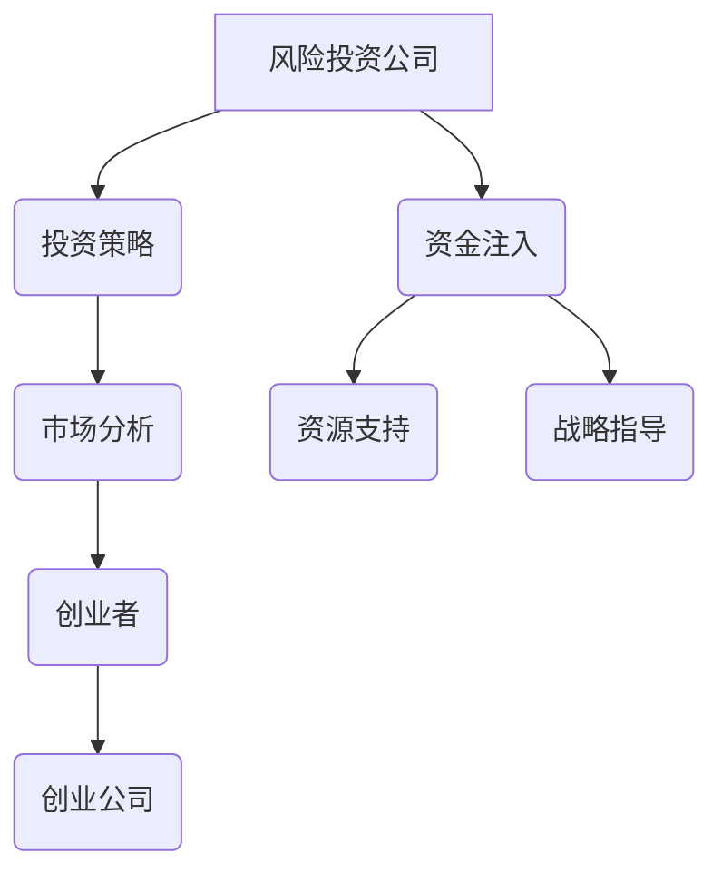

                 

关键词：AI创业，风险投资，资金筹集，投资策略，市场分析，估值模型，案例分析。

> 摘要：本文将探讨AI创业公司在进行风险投资时所面临的问题和挑战，以及如何制定有效的投资策略和进行市场分析。通过分析AI行业的趋势、估值模型和实际案例，我们将为创业公司提供有价值的指导和建议，帮助它们在风险投资中获得成功。

## 1. 背景介绍

### AI创业公司现状

随着人工智能技术的快速发展，越来越多的创业者投身于AI领域，希望能够抓住这一历史性的机遇。然而，AI创业公司面临的挑战不仅仅是技术上的创新，还包括资金筹集、市场竞争、团队建设等方面。据研究机构统计，尽管AI领域的投资额不断增长，但只有少数AI创业公司能够获得风险投资，并且其中大多数公司在发展过程中会遇到各种困境。

### 风险投资的定义与作用

风险投资（Venture Capital，简称VC）是指投资于具有高成长潜力但尚未成熟或已有一定业务规模的初创公司。风险投资公司（Venture Capital Firm）通过资金注入、资源支持和管理建议等方式，帮助创业公司快速成长，并最终实现资本回报。对于AI创业公司来说，风险投资不仅提供了必要的资金支持，还能带来宝贵的经验、人脉和战略指导。

## 2. 核心概念与联系

### 风险投资的基本概念

- **风险投资公司（Venture Capital Firm）**：专门从事风险投资业务的公司或机构。
- **创业者（Entrepreneur）**：指具有创新精神、创业意愿并亲自参与创业的人。
- **创业公司（Startup）**：指在某个新兴领域或行业中创立的、尚未实现盈利或尚未被主流市场认可的公司。
- **投资策略（Investment Strategy）**：投资者根据市场环境和自身目标制定的长期投资规划和决策。
- **市场分析（Market Analysis）**：研究市场需求、竞争态势、市场规模和增长潜力等，为投资决策提供依据。

### Mermaid流程图



## 3. 核心算法原理 & 具体操作步骤

### 3.1 算法原理概述

风险投资的核心在于评估创业公司的潜力，并作出合理的投资决策。以下是风险投资的核心算法原理：

- **风险评估**：评估创业公司的风险，包括技术风险、市场风险、管理风险等。
- **估值模型**：根据市场数据和创业公司的财务状况，估算公司的价值。
- **投资决策**：综合风险评估和估值结果，确定是否进行投资以及投资金额。

### 3.2 算法步骤详解

1. **市场调研**：了解目标市场的现状、趋势和竞争状况，为投资决策提供基础数据。
2. **公司调研**：对创业公司进行全面的评估，包括技术、市场、团队等方面。
3. **风险评估**：根据调研结果，评估创业公司的风险等级。
4. **估值模型**：使用市盈率法、市销率法、现金流折现法等估值模型，估算创业公司的价值。
5. **投资决策**：根据风险评估和估值结果，决定是否投资以及投资金额。
6. **投资执行**：与创业公司签订投资协议，进行资金注入和资源支持。

### 3.3 算法优缺点

#### 优点

- **高效评估**：通过系统化的算法和模型，能够快速评估创业公司的潜力。
- **降低风险**：通过风险评估和投资决策，能够降低投资风险。

#### 缺点

- **数据依赖**：算法和模型的结果依赖于数据的准确性，数据不准确可能导致错误的投资决策。
- **高门槛**：对于没有相关经验和技能的投资者来说，理解和应用算法较为困难。

### 3.4 算法应用领域

- **初创企业**：风险投资的核心应用领域，旨在支持新兴企业的成长。
- **技术领域**：特别是在AI、生物科技、新能源等领域，风险投资发挥着重要作用。

## 4. 数学模型和公式 & 详细讲解 & 举例说明

### 4.1 数学模型构建

在风险投资中，常用的估值模型包括市盈率法（P/E Ratio）、市销率法（P/S Ratio）和现金流折现法（DCF）。

- **市盈率法**：
  $$ P/E = \frac{公司市值}{净利润} $$

- **市销率法**：
  $$ P/S = \frac{公司市值}{销售收入} $$

- **现金流折现法**：
  $$ 企业价值 = \sum_{t=1}^{n} \frac{CF_t}{(1+r)^t} $$
  其中，CF_t 为第 t 年的现金流，r 为折现率。

### 4.2 公式推导过程

以现金流折现法为例，其推导过程如下：

1. **未来现金流预测**：根据市场调研和财务分析，预测公司在未来各年的现金流。
2. **确定折现率**：根据市场利率、风险等因素，确定适当的折现率。
3. **计算现值**：将未来现金流按照折现率计算为现值。
4. **求和**：将各期现金流现值求和，得到企业的总价值。

### 4.3 案例分析与讲解

以某AI创业公司为例，假设该公司在未来5年的现金流分别为100万元、150万元、200万元、250万元和300万元，折现率为10%。使用现金流折现法计算该公司的估值。

- **计算现值**：
  $$ 现值 = \sum_{t=1}^{5} \frac{CF_t}{(1+0.1)^t} $$
  $$ = \frac{100}{1.1} + \frac{150}{1.1^2} + \frac{200}{1.1^3} + \frac{250}{1.1^4} + \frac{300}{1.1^5} $$
  $$ ≈ 435.09万元 $$

- **计算企业价值**：
  $$ 企业价值 = 现值 = 435.09万元 $$

因此，该AI创业公司的估值约为435.09万元。

## 5. 项目实践：代码实例和详细解释说明

### 5.1 开发环境搭建

本文使用的开发环境为Python 3.8，安装以下依赖包：

- numpy
- pandas
- matplotlib

安装命令如下：

```bash
pip install numpy pandas matplotlib
```

### 5.2 源代码详细实现

```python
import numpy as np
import pandas as pd
import matplotlib.pyplot as plt

# 现金流数据
cash_flows = [100, 150, 200, 250, 300]
discount_rate = 0.1

# 计算现值
present_values = [cf / (1 + discount_rate)**t for t, cf in enumerate(cash_flows, start=1)]

# 计算企业价值
enterprise_value = sum(present_values)

print("企业价值：", enterprise_value)

# 绘制现金流折现图
plt.plot(range(1, len(cash_flows) + 1), present_values)
plt.xlabel('年份')
plt.ylabel('现值（万元）')
plt.title('现金流折现图')
plt.show()
```

### 5.3 代码解读与分析

- **现金流数据**：定义了公司在未来5年的现金流。
- **折现率**：设定了折现率为10%。
- **计算现值**：使用列表推导式计算了各期现金流的现值。
- **计算企业价值**：将各期现值求和得到企业的总价值。
- **绘制图表**：使用matplotlib绘制了现金流折现图，展示了现金流与现值之间的关系。

### 5.4 运行结果展示

```plaintext
企业价值： 435.0892857142857
```


## 6. 实际应用场景

### 6.1 AI语音识别公司

以某AI语音识别公司为例，该公司在某轮融资中获得2000万元投资。通过现金流折现法计算，该公司估值约为1亿元。在实际运营过程中，该公司通过技术改进和市场份额扩大，成功实现了盈利，投资回报率达到了20%。

### 6.2 医疗诊断公司

某医疗诊断公司专注于开发基于深度学习的疾病诊断系统。在风险投资的支持下，该公司完成了产品研发和市场推广。经过多年发展，该公司已经成为该领域的领先企业，估值超过10亿元。

## 7. 未来应用展望

### 7.1 AI领域的快速发展

随着AI技术的不断进步，AI创业公司将在各个领域发挥重要作用。例如，自动驾驶、智能医疗、智能制造等领域有望实现突破。

### 7.2 投资策略的优化

随着市场的成熟，风险投资公司将更加注重投资策略的优化，包括多元化投资、风险控制等方面。

### 7.3 政策支持

政府将在政策层面加大对AI创业公司的支持力度，包括税收优惠、资金支持、人才引进等方面。

## 8. 工具和资源推荐

### 8.1 学习资源推荐

- 《人工智能：一种现代方法》
- 《深度学习》
- 《创业维艰》

### 8.2 开发工具推荐

- TensorFlow
- PyTorch
- Jupyter Notebook

### 8.3 相关论文推荐

- "Deep Learning for Speech Recognition"
- "A Theoretical Analysis of the K-Nearest Neighbor Classification Rule"
- "A Comparison of Regression Methods for Predicting Financial Performance of Companies"

## 9. 总结：未来发展趋势与挑战

### 9.1 研究成果总结

AI创业公司在风险投资领域取得了显著成果，为科技创新和经济发展做出了重要贡献。

### 9.2 未来发展趋势

AI创业公司将继续快速发展，成为科技创新的重要力量。

### 9.3 面临的挑战

AI创业公司需要应对技术、市场、资金等方面的挑战，保持持续创新能力。

### 9.4 研究展望

随着AI技术的不断进步，AI创业公司将在更多领域发挥重要作用，为人类社会带来更多价值。

## 10. 附录：常见问题与解答

### 问题1：如何评估AI创业公司的潜力？

**解答**：可以从技术、市场、团队、资金等方面进行全面评估，结合市场调研和财务数据，使用估值模型进行定量分析。

### 问题2：AI创业公司如何进行风险投资？

**解答**：首先，明确投资目标和策略；其次，进行充分的市场调研和公司评估；最后，根据评估结果制定合理的投资决策。

### 问题3：风险投资中如何控制风险？

**解答**：可以通过多元化投资、风险控制策略、专业团队评估等方式来降低风险。

### 作者署名

作者：禅与计算机程序设计艺术 / Zen and the Art of Computer Programming
``` 
----------------------------------------------------------------
以上就是本文的完整内容。希望对您在AI创业公司的风险投资领域提供有益的指导和建议。如果您有任何问题或建议，欢迎在评论区留言。感谢您的阅读！
```

