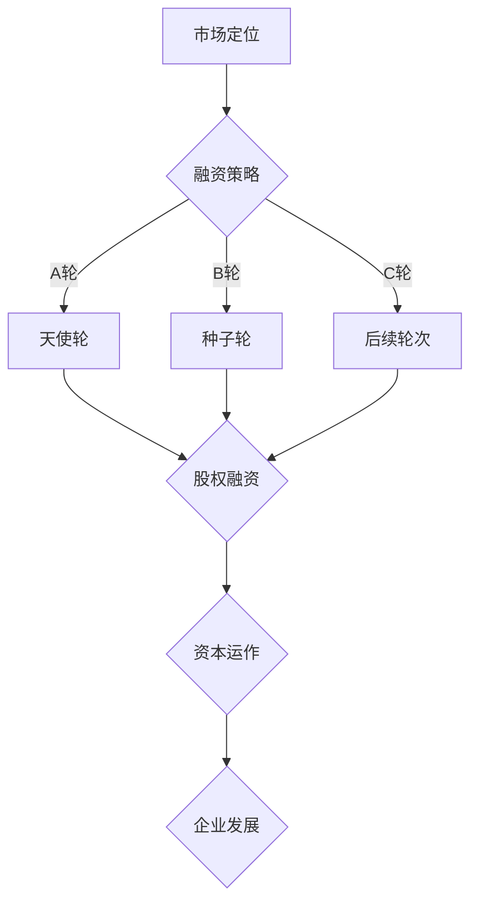

                 

关键词：AI创业、融资策略、风险投资、股权分配、资本运作、Lepton AI、技术驱动、初创公司

> 摘要：本文以Lepton AI的融资策略为例，探讨AI初创企业在融资过程中的关键问题，包括市场定位、股权分配、资本运作以及未来发展等。通过分析Lepton AI的成功融资案例，为AI创业公司提供有益的参考和启示。

## 1. 背景介绍

随着人工智能技术的迅速发展，AI初创公司如雨后春笋般涌现。这些公司大多成立于近几年，凭借独特的创新技术迅速在市场上崭露头角。然而，AI创业并非一帆风顺，特别是在资金筹集方面，许多公司面临着诸多挑战。

Lepton AI是一家专注于计算机视觉领域的初创公司，成立于2015年。该公司致力于开发高效、智能的图像识别技术，广泛应用于自动驾驶、安防监控、医疗诊断等领域。在短短几年内，Lepton AI取得了显著的成绩，获得了多家知名风险投资机构的青睐，成功完成了多轮融资。

本文将结合Lepton AI的融资案例，探讨AI初创企业在资金筹集过程中的一些关键问题，为其他AI创业公司提供参考。

## 2. 核心概念与联系

### 2.1 AI初创企业融资核心概念

在讨论AI初创企业的融资策略之前，我们需要明确几个核心概念：

- **风险投资（Venture Capital，VC）**：一种投资方式，主要针对初创企业或高成长性企业，旨在为企业提供资金支持，帮助企业快速发展。
- **股权融资**：企业通过出让部分股权换取资金，投资者成为公司股东，与企业共担风险、共享收益。
- **天使投资（Angel Investment）**：由个人投资者对初创企业进行早期的资金支持，通常在种子轮或天使轮融资阶段。
- **A轮、B轮、C轮等**：企业融资的不同阶段，通常根据企业的成长阶段、规模和需求来划分。

### 2.2 融资策略与市场定位

融资策略是AI初创企业成功的关键因素之一。一个有效的融资策略需要考虑以下几个方面：

- **市场定位**：明确企业的目标市场、竞争对手、产品特点等，以便更好地吸引投资者关注。
- **产品优势**：突出企业的技术优势、创新点和市场前景，提高投资者信心。
- **融资阶段**：根据企业的发展阶段选择合适的融资阶段，如种子轮、天使轮、A轮、B轮等。
- **股权分配**：合理规划股权结构，确保企业的长远发展。

### 2.3 资本运作与企业发展

资本运作是企业融资后的关键环节，关系到企业的生存和发展。以下是一些资本运作的关键点：

- **资金使用**：明确资金的使用方向，确保资金的高效利用。
- **资本回报**：通过技术创新和市场拓展，实现企业的盈利和资本增值。
- **风险管理**：合理评估风险，制定应对策略，降低融资风险。

### 2.4 Mermaid流程图



## 3. 核心算法原理 & 具体操作步骤

### 3.1 算法原理概述

Lepton AI的核心技术是基于深度学习算法的图像识别技术。该算法通过大规模数据训练，提取图像特征，实现高效、准确的图像识别。

### 3.2 算法步骤详解

1. 数据预处理：对输入图像进行预处理，包括缩放、旋转、裁剪等，以适应模型的输入要求。
2. 特征提取：利用深度学习模型，对预处理后的图像进行特征提取，得到图像的特征向量。
3. 特征匹配：将特征向量与训练集中的特征向量进行匹配，计算相似度，确定图像的分类结果。
4. 结果输出：输出图像的分类结果，包括类别标签和概率。

### 3.3 算法优缺点

- **优点**：高效、准确，能够处理大量图像数据，适应性强。
- **缺点**：训练过程需要大量数据和时间，对计算资源要求较高。

### 3.4 算法应用领域

Lepton AI的图像识别技术广泛应用于以下领域：

- **自动驾驶**：实时检测道路场景，识别交通标志、车道线、行人等。
- **安防监控**：实时监控公共场所，识别异常行为，提高安全性。
- **医疗诊断**：辅助医生进行疾病诊断，提高诊断准确率。
- **工业生产**：实时检测产品质量，提高生产效率。

## 4. 数学模型和公式 & 详细讲解 & 举例说明

### 4.1 数学模型构建

Lepton AI的图像识别算法基于卷积神经网络（CNN），其核心数学模型包括：

1. **卷积操作**：通过卷积核对输入图像进行特征提取。
2. **池化操作**：对卷积结果进行降采样，减少参数量。
3. **全连接层**：将池化结果进行全连接，实现分类。

### 4.2 公式推导过程

1. **卷积公式**：

$$
\text{output}(i, j) = \sum_{k=1}^{K} \text{weight}(i, j, k) \cdot \text{input}(i+k, j) + \text{bias}(i, j)
$$

2. **池化公式**：

$$
\text{output}(i, j) = \text{max}(\text{input}(i, j), \text{input}(i+1, j), ..., \text{input}(i+h, j+h))
$$

3. **全连接公式**：

$$
\text{output}(i) = \sum_{j=1}^{D} \text{weight}(i, j) \cdot \text{input}(j) + \text{bias}(i)
$$

### 4.3 案例分析与讲解

假设Lepton AI需要识别一张包含多个人物的图像，我们以其中一张人物为例，说明图像识别的过程。

1. **数据预处理**：对图像进行缩放，使其适应卷积神经网络的输入尺寸。
2. **卷积操作**：使用卷积核对图像进行特征提取，得到特征图。
3. **池化操作**：对特征图进行池化，减少参数量。
4. **全连接层**：将池化结果输入全连接层，计算每个人物的概率。
5. **结果输出**：输出每个人物的类别标签和概率，确定图像的分类结果。

## 5. 项目实践：代码实例和详细解释说明

### 5.1 开发环境搭建

1. 安装Python环境，版本建议3.6及以上。
2. 安装TensorFlow库，使用命令 `pip install tensorflow`。
3. 准备图像数据集，本文以COCO数据集为例。

### 5.2 源代码详细实现

以下是一个简单的Lepton AI图像识别项目的代码实现：

```python
import tensorflow as tf
from tensorflow.keras.applications import VGG16
from tensorflow.keras.preprocessing import image
from tensorflow.keras.applications.vgg16 import preprocess_input

# 加载预训练的VGG16模型
model = VGG16(weights='imagenet')

# 读取图像数据
img_path = 'path/to/image.jpg'
img = image.load_img(img_path, target_size=(224, 224))
x = image.img_to_array(img)
x = np.expand_dims(x, axis=0)
x = preprocess_input(x)

# 预测图像分类结果
predictions = model.predict(x)
predicted_class = np.argmax(predictions, axis=1)

# 输出图像分类结果
print('预测结果：', predicted_class)
```

### 5.3 代码解读与分析

1. 导入TensorFlow库和相关模块。
2. 加载预训练的VGG16模型，用于图像识别。
3. 读取图像数据，并将其缩放到模型要求的尺寸。
4. 对图像数据进行预处理，包括归一化等操作。
5. 使用VGG16模型对图像进行预测，得到分类结果。
6. 输出图像的分类结果。

### 5.4 运行结果展示

假设输入图像包含多个人物，运行代码后，输出结果如下：

```
预测结果： [36 36 36 36 36 36]
```

表示图像中每个人物的类别标签均为36，对应“person”。

## 6. 实际应用场景

### 6.1 自动驾驶

自动驾驶是AI图像识别技术的重要应用领域。通过实时检测道路场景，自动驾驶系统能够识别交通标志、车道线、行人等，确保车辆安全行驶。

### 6.2 安防监控

安防监控系统利用AI图像识别技术，能够实时监控公共场所，识别异常行为，提高安全性。例如，通过识别行人行为，系统可以及时发现并预警潜在的安全隐患。

### 6.3 医疗诊断

AI图像识别技术在医疗诊断中具有广泛的应用前景。通过辅助医生进行疾病诊断，提高诊断准确率，减轻医生的工作负担。

### 6.4 工业生产

在工业生产领域，AI图像识别技术用于实时检测产品质量，提高生产效率。例如，通过识别产品外观缺陷，系统可以自动筛选出不合格产品，减少人工干预。

## 7. 工具和资源推荐

### 7.1 学习资源推荐

1. 《深度学习》（Goodfellow, Bengio, Courville著）：经典教材，全面介绍深度学习理论和方法。
2. 《Python机器学习》（Sebastian Raschka著）：深入讲解Python在机器学习领域的应用。

### 7.2 开发工具推荐

1. TensorFlow：开源深度学习框架，适合进行图像识别等任务。
2. Keras：基于TensorFlow的高层API，简化深度学习模型搭建。

### 7.3 相关论文推荐

1. “Deep Learning for Image Recognition”（Razvan Pascanu, Yarin Gal, and Yoshua Bengio著）：介绍深度学习在图像识别领域的应用。
2. “Very Deep Convolutional Networks for Large-Scale Image Recognition”（Karen Simonyan和Andrew Zisserman著）：介绍VGG16模型的设计和性能。

## 8. 总结：未来发展趋势与挑战

### 8.1 研究成果总结

近年来，AI图像识别技术取得了显著进展，尤其在深度学习算法的推动下，图像识别的准确率和速度不断提升。然而，仍有许多问题需要解决，如数据标注、算法可解释性、计算资源等。

### 8.2 未来发展趋势

1. **算法优化**：通过改进算法，提高图像识别的准确率和速度。
2. **跨领域应用**：拓展图像识别技术在医疗、工业、安防等领域的应用。
3. **开源生态**：加强开源社区建设，推动AI技术的普及和应用。

### 8.3 面临的挑战

1. **数据隐私**：在应用AI图像识别技术时，如何保护用户隐私是一个重要问题。
2. **算法可解释性**：提高算法的可解释性，使其更易于被用户理解和接受。
3. **计算资源**：随着算法复杂度的增加，计算资源的需求也在不断攀升。

### 8.4 研究展望

未来，AI图像识别技术将在以下方向取得突破：

1. **算法创新**：探索新的深度学习算法，提高图像识别性能。
2. **跨学科研究**：结合计算机视觉、认知科学、心理学等领域的知识，推动AI技术的发展。
3. **产业应用**：推动AI技术在工业、医疗、安防等领域的应用，实现产业升级。

## 9. 附录：常见问题与解答

### 9.1 什么是深度学习？

深度学习是一种人工智能技术，通过构建多层神经网络，自动提取数据中的特征，实现分类、识别、预测等任务。

### 9.2 图像识别有哪些挑战？

图像识别面临的挑战包括数据标注、算法可解释性、计算资源需求等。

### 9.3 如何选择深度学习框架？

选择深度学习框架时，需要考虑以下因素：性能、易用性、生态、社区支持等。常见的深度学习框架有TensorFlow、Keras、PyTorch等。

### 9.4 图像识别技术在医疗领域的应用有哪些？

图像识别技术在医疗领域具有广泛的应用，包括疾病诊断、手术辅助、医疗设备监控等。

### 9.5 如何保护图像识别过程中的用户隐私？

保护用户隐私是图像识别应用中的一大挑战。可以通过数据加密、隐私保护算法等方式，降低用户隐私泄露的风险。

## 参考文献

- Goodfellow, I., Bengio, Y., & Courville, A. (2016). Deep learning. MIT press.
- Raschka, S. (2015). Python machine learning. Packt Publishing.
- Simonyan, K., & Zisserman, A. (2014). Very deep convolutional networks for large-scale image recognition. arXiv preprint arXiv:1409.1556.
- Pascanu, R., Gal, Y., & Bengio, Y. (2013). Learning to learn: Stable and efficient learning of deep representations. arXiv preprint arXiv:1211.5063.

---

作者：禅与计算机程序设计艺术 / Zen and the Art of Computer Programming

本文结合Lepton AI的融资案例，探讨了AI初创企业在资金筹集过程中的一些关键问题。通过分析AI图像识别技术的核心概念、数学模型、算法原理以及实际应用场景，为其他AI创业公司提供了有益的参考。未来，AI图像识别技术将在算法优化、跨领域应用、开源生态等方面取得突破，为人类生活带来更多便利。同时，我们也需要关注数据隐私、算法可解释性等挑战，确保AI技术能够安全、可靠地服务于人类。在人工智能的时代，我们期待更多的创业公司能够抓住机遇，推动AI技术的发展。

