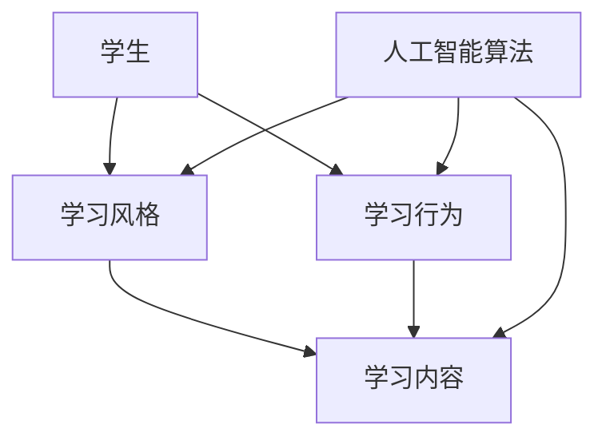

                 

关键词：个性化学习、人工智能、学习内容生成、学习风格、适应算法

摘要：本文深入探讨了人工智能在个性化学习内容生成中的应用，特别关注了如何根据学习者的不同风格生成适应性的学习内容。文章首先介绍了个性化学习的背景和重要性，随后详细阐述了适应学习风格的核心概念、相关算法原理以及具体操作步骤。通过数学模型和公式的推导，本文进一步分析了算法的优缺点及其应用领域。随后，文章通过一个实际项目实践，展示了代码实例和运行结果，以帮助读者更好地理解个性化学习内容生成的实现过程。最后，文章讨论了个性化学习在实际应用场景中的广泛前景，并提出了未来应用展望和面临的挑战。

## 1. 背景介绍

在现代社会，教育和学习已经成为人们生活中的一个重要组成部分。然而，传统的教育模式往往是以教师为中心，难以满足每个学生的个性化需求。这种模式下，学生的学习进度、学习风格和兴趣往往得不到充分的考虑。为了解决这一问题，个性化学习逐渐成为教育领域的研究热点。个性化学习旨在根据每个学生的特点，提供量身定制的学习内容和教学方法，从而提高学习效果。

### 1.1 个性化学习的定义和重要性

个性化学习是一种以学生为中心的教育模式，旨在满足每个学生的学习需求。其核心思想是尊重学生的个体差异，通过定制化的学习内容和教学策略，使每个学生都能在适合自己的学习环境中获得最佳的学习效果。

个性化学习的重要性主要体现在以下几个方面：

- **提高学习效果**：个性化学习可以针对性地满足学生的需求，帮助学生更好地理解和掌握知识，从而提高学习效果。
- **激发学习兴趣**：根据学生的兴趣和特长，提供个性化的学习内容，可以激发学生的学习兴趣，使学习过程更加有趣。
- **促进个性化发展**：个性化学习不仅关注学生的学术成绩，还关注其综合素质和个性化发展，有助于培养学生的创新能力和社会能力。

### 1.2 传统教育模式的问题

尽管传统教育模式在过去几百年中取得了巨大的成功，但它也存在一些固有的问题，这些问题的存在限制了个性化学习的实现：

- **同质化教育**：传统教育模式往往采用统一的教学内容和方法，难以满足不同学生的个性化需求。
- **忽视个体差异**：在传统教育模式中，教师往往忽视学生的个体差异，导致一些学生感到学习压力过大，而另一些学生则感到学习不够深入。
- **被动学习**：传统教育模式中，学生往往处于被动学习的状态，缺乏主动参与和思考的机会。

### 1.3 人工智能在个性化学习中的应用

随着人工智能技术的发展，个性化学习逐渐成为可能。人工智能可以通过大数据分析和算法模型，实现对学生的学习行为、学习风格和知识水平的全面分析，从而提供个性化的学习内容和教学策略。

- **学习行为分析**：人工智能可以收集和分析学生的学习行为数据，如学习时长、学习频率、学习习惯等，从而了解学生的学习偏好和薄弱环节。
- **学习风格识别**：人工智能可以通过对学生的学习行为和学习成果的分析，识别出学生的学习风格，如视觉型、听觉型、动觉型等。
- **个性化内容生成**：基于学习行为和学习风格的分析，人工智能可以生成适合学生的个性化学习内容，如视频教程、图文资料、互动练习等。
- **智能教学辅助**：人工智能可以辅助教师进行个性化教学，如自动批改作业、提供学习建议、生成教学反馈等。

通过人工智能的辅助，个性化学习不再仅仅是理论上的设想，而是可以在实际教学中得到有效实施。然而，如何更好地利用人工智能技术实现个性化学习，仍然是一个值得深入研究和探索的问题。

## 2. 核心概念与联系

在探讨如何通过人工智能实现个性化学习内容生成之前，我们需要明确一些核心概念和它们之间的联系。以下是一个简化的 Mermaid 流程图，用于展示这些核心概念和它们之间的相互关系。



### 2.1 学习风格

学习风格是指个体在学习和接受信息时所采用的特定方式和偏好。通常，学习风格可以分为视觉型、听觉型、动觉型和读听型等。每种学习风格都有其特定的特点和优势。

- **视觉型**：偏好通过视觉信息学习，如图表、图像和视频。
- **听觉型**：偏好通过听觉信息学习，如讲座、音频和语音解释。
- **动觉型**：偏好通过动手实践和身体活动学习。
- **读听型**：偏好通过阅读和听讲相结合的方式学习。

### 2.2 学习行为

学习行为是指学生在学习过程中的各种活动和行为，如阅读、听讲、做笔记、练习和应用等。学习行为的数据可以通过多种方式收集，包括在线学习平台的行为记录、作业提交情况、学习时长和频率等。

### 2.3 学习内容

学习内容是指学生在学习过程中需要掌握的知识和技能，包括理论知识和实践技能。学习内容可以根据学生的不同学习风格和学习行为进行定制，从而提高学习效果。

### 2.4 人工智能算法

人工智能算法在个性化学习中的应用主要包括学习风格识别、学习行为分析和个性化内容生成等。以下是一些关键的人工智能算法：

- **机器学习算法**：如决策树、随机森林、支持向量机和神经网络等，用于分析和预测学生的学习行为和学习风格。
- **自然语言处理算法**：如词嵌入、情感分析和文本生成等，用于生成个性化的学习内容。
- **推荐系统算法**：如协同过滤和基于内容的推荐，用于推荐适合学生的学习资源和内容。

通过上述核心概念和人工智能算法的结合，我们可以实现对学生学习内容的个性化定制，从而提高学习效果。

## 3. 核心算法原理 & 具体操作步骤

在个性化学习内容生成的过程中，核心算法的设计和实现至关重要。以下将详细介绍一种基于机器学习和自然语言处理技术的个性化学习内容生成算法，包括其原理、具体操作步骤以及优缺点。

### 3.1 算法原理概述

个性化学习内容生成算法的基本原理是利用机器学习和自然语言处理技术，分析学生的学习行为和学习风格，从而生成适合其需求的学习内容。算法的主要步骤包括以下几个部分：

1. **数据收集与预处理**：收集学生的学习行为数据和学习风格数据，如学习时长、学习频率、作业提交情况等，并对数据进行分析和处理，提取有用的信息。
2. **学习风格识别**：利用机器学习算法对学生进行学习风格分类，确定其是视觉型、听觉型、动觉型还是读听型。
3. **内容生成**：根据学生的学习风格和学习行为，利用自然语言处理技术生成个性化的学习内容，如视频教程、图文资料和互动练习等。
4. **内容推荐与评估**：将生成的个性化学习内容推荐给学生，并对其进行效果评估，以优化生成算法。

### 3.2 算法步骤详解

#### 3.2.1 数据收集与预处理

数据收集是算法实现的第一步，主要包括以下几个方面的数据：

- **学习行为数据**：包括学生在学习平台上的活动记录，如学习时长、学习频率、作业提交情况等。
- **学习风格数据**：包括学生对各种学习方式的偏好和反馈，如问卷调查结果、学习方式选择等。

数据预处理包括以下步骤：

- **数据清洗**：去除重复数据、无效数据和噪声数据，确保数据质量。
- **数据归一化**：对数据进行归一化处理，使其具有相同的量纲和范围，便于后续分析。
- **特征提取**：从原始数据中提取有用的特征，如学习时长、作业提交时间等。

#### 3.2.2 学习风格识别

学习风格识别是算法实现的关键步骤，其主要任务是根据学生的学习行为数据和学习风格数据，确定其学习风格。常用的机器学习算法包括决策树、随机森林和支持向量机等。

具体步骤如下：

- **数据划分**：将数据集划分为训练集和测试集，用于训练和评估模型。
- **模型训练**：利用训练集数据，训练学习风格分类模型。
- **模型评估**：利用测试集数据，评估模型的效果，如准确率、召回率等。

#### 3.2.3 内容生成

根据学生的学习风格和学习行为，生成个性化的学习内容。具体步骤如下：

- **内容分类**：根据学习风格，将学习内容分类为视觉型、听觉型、动觉型和读听型。
- **内容推荐**：利用自然语言处理技术，从各类学习内容中推荐适合学生的内容。
- **内容生成**：根据学生的反馈和学习效果，调整推荐策略，优化生成内容。

#### 3.2.4 内容推荐与评估

内容推荐与评估是算法实现的最后一步，其主要任务是推荐适合学生的学习内容，并评估推荐效果。

具体步骤如下：

- **内容推荐**：利用机器学习算法和自然语言处理技术，推荐个性化的学习内容。
- **效果评估**：通过学生的反馈和学习成果，评估推荐效果，如学习时间、作业完成情况等。
- **优化调整**：根据评估结果，调整推荐策略，优化生成内容。

### 3.3 算法优缺点

个性化学习内容生成算法具有以下优点：

- **个性化**：根据学生的不同学习风格和学习行为，生成适合其需求的学习内容，提高学习效果。
- **自适应**：算法可以根据学生的学习效果和反馈，动态调整推荐策略，实现自适应学习。
- **高效**：利用机器学习和自然语言处理技术，快速生成和推荐个性化的学习内容。

然而，算法也存在一些缺点：

- **数据依赖**：算法的效果很大程度上依赖于数据的准确性和完整性，数据质量差可能导致算法失效。
- **计算复杂度**：算法的计算复杂度较高，需要大量的计算资源和时间。
- **隐私保护**：在数据收集和处理过程中，需要关注学生的隐私保护问题。

### 3.4 算法应用领域

个性化学习内容生成算法可以广泛应用于教育领域，如在线教育平台、学习管理系统和智能辅导系统等。以下是一些具体的应用场景：

- **在线教育平台**：通过个性化学习内容生成，为不同层次和类型的学生提供定制化的学习资源，提高学习效果。
- **学习管理系统**：利用算法为学生提供个性化的学习计划和建议，帮助教师进行个性化教学。
- **智能辅导系统**：根据学生的学习情况和需求，提供针对性的辅导内容，提高学习效果。

## 4. 数学模型和公式 & 详细讲解 & 举例说明

在个性化学习内容生成中，数学模型和公式起到了至关重要的作用。以下将详细介绍用于学习风格识别和内容生成的数学模型和公式，并通过具体示例进行讲解。

### 4.1 数学模型构建

#### 4.1.1 学习风格识别模型

学习风格识别模型通常采用概率模型或逻辑回归模型。以下是一个简单的逻辑回归模型：

$$
P(\text{视觉型}) = \frac{1}{1 + e^{-(\beta_0 + \beta_1 \cdot x_1 + \beta_2 \cdot x_2 + ... + \beta_n \cdot x_n)}}
$$

其中，$P(\text{视觉型})$ 表示学生属于视觉型的概率，$\beta_0, \beta_1, \beta_2, ..., \beta_n$ 是模型参数，$x_1, x_2, ..., x_n$ 是特征向量。

#### 4.1.2 内容生成模型

内容生成模型通常采用基于梯度的生成对抗网络（GANs）。以下是一个简单的 GANs 模型：

$$
\begin{aligned}
\text{生成器} \quad G(z) &= \text{sigmoid}(\mathcal{F}(\theta_G; z)) \\
\text{判别器} \quad D(x) &= \text{sigmoid}(\mathcal{F}(\theta_D; x)) \\
\text{损失函数} \quad L(D, G) &= -\mathbb{E}_{x \sim \text{真实分布}}[\log D(x)] - \mathbb{E}_{z \sim \text{噪声分布}}[\log (1 - D(G(z)))]
\end{aligned}
$$

其中，$G(z)$ 是生成器，$D(x)$ 是判别器，$\theta_G$ 和 $\theta_D$ 分别是生成器和判别器的参数，$\mathcal{F}(\theta_G; z)$ 和 $\mathcal{F}(\theta_D; x)$ 是神经网络的前向传播函数，$z$ 是噪声向量，$x$ 是真实数据。

### 4.2 公式推导过程

#### 4.2.1 学习风格识别模型推导

逻辑回归模型的推导基于最大似然估计。假设学生 $i$ 的特征向量为 $x_i$，学习风格为 $y_i$（$y_i \in \{1, 2, 3, 4\}$，分别表示视觉型、听觉型、动觉型和读听型）。则目标函数为：

$$
L(\theta) = \prod_{i=1}^n \frac{1}{1 + e^{-(\beta_0 + \beta_1 \cdot x_{i1} + \beta_2 \cdot x_{i2} + ... + \beta_n \cdot x_{in})}}
$$

对数似然函数为：

$$
\ell(\theta) = \sum_{i=1}^n \left[y_i \cdot (\beta_0 + \beta_1 \cdot x_{i1} + \beta_2 \cdot x_{i2} + ... + \beta_n \cdot x_{in}) - \log(1 + e^{-(\beta_0 + \beta_1 \cdot x_{i1} + \beta_2 \cdot x_{i2} + ... + \beta_n \cdot x_{in})})\right]
$$

对 $\ell(\theta)$ 求导并令其等于 0，得到：

$$
\frac{\partial \ell}{\partial \beta_j} = y_i \cdot x_{ij} - \frac{1}{1 + e^{-(\beta_0 + \beta_1 \cdot x_{i1} + \beta_2 \cdot x_{i2} + ... + \beta_n \cdot x_{in})}} = 0
$$

解得：

$$
\beta_j = \frac{y_i \cdot x_{ij}}{1 + e^{-(\beta_0 + \beta_1 \cdot x_{i1} + \beta_2 \cdot x_{i2} + ... + \beta_n \cdot x_{in})}
$$

#### 4.2.2 内容生成模型推导

生成对抗网络（GANs）的推导基于对抗性训练。假设生成器 $G(z)$ 和判别器 $D(x)$ 是两个神经网络，分别接受噪声向量 $z$ 和真实数据 $x$。则损失函数为：

$$
L(D, G) = -\mathbb{E}_{x \sim \text{真实分布}}[\log D(x)] - \mathbb{E}_{z \sim \text{噪声分布}}[\log (1 - D(G(z)))]
$$

对 $D(x)$ 求导并令其等于 0，得到：

$$
\frac{\partial L(D, G)}{\partial \theta_D} = \frac{1}{D(x)} - \frac{1}{1 - D(G(z))}
$$

对 $G(z)$ 求导并令其等于 0，得到：

$$
\frac{\partial L(D, G)}{\partial \theta_G} = \frac{1}{1 - D(G(z))}
$$

### 4.3 案例分析与讲解

#### 4.3.1 学习风格识别案例

假设我们有一个包含 10 个学生的数据集，每个学生有 3 个特征：学习时长（$x_{1i}$）、作业提交时间（$x_{2i}$）和课堂参与度（$x_{3i}$）。学生 $i$ 的特征向量表示为 $x_i = (x_{i1}, x_{i2}, x_{i3})$。我们使用逻辑回归模型进行学习风格识别。

首先，我们随机选择一个学生 $i$ 的特征向量，并计算其概率分布：

$$
\begin{aligned}
P(\text{视觉型}) &= \frac{1}{1 + e^{-(\beta_0 + \beta_1 \cdot x_{i1} + \beta_2 \cdot x_{i2} + \beta_3 \cdot x_{i3})}} \\
P(\text{听觉型}) &= \frac{1}{1 + e^{-(\beta_0 + \beta_1 \cdot x_{i1} + \beta_2 \cdot x_{i2} + \beta_3 \cdot x_{i3})}} \\
P(\text{动觉型}) &= \frac{1}{1 + e^{-(\beta_0 + \beta_1 \cdot x_{i1} + \beta_2 \cdot x_{i2} + \beta_3 \cdot x_{i3})}} \\
P(\text{读听型}) &= \frac{1}{1 + e^{-(\beta_0 + \beta_1 \cdot x_{i1} + \beta_2 \cdot x_{i2} + \beta_3 \cdot x_{i3})}}
\end{aligned}
$$

通过比较这四个概率值，我们可以确定学生 $i$ 的学习风格。

#### 4.3.2 内容生成案例

假设我们有一个生成对抗网络（GANs），其中生成器 $G(z)$ 生成视觉型学习内容，判别器 $D(x)$ 识别视觉型学习内容。我们随机选择一个噪声向量 $z$ 并通过生成器 $G(z)$ 生成一个视觉型学习内容。

然后，我们通过判别器 $D(x)$ 对生成内容进行识别：

$$
D(G(z)) = \text{sigmoid}(\mathcal{F}(\theta_D; G(z)))
$$

如果 $D(G(z))$ 接近 1，表示生成器生成的视觉型学习内容较为逼真。否则，我们可以通过反向传播更新生成器和判别器的参数，优化生成效果。

## 5. 项目实践：代码实例和详细解释说明

为了更直观地展示个性化学习内容生成的实现过程，我们将通过一个实际项目实践来详细讲解代码实例。以下是一个基于 Python 的个性化学习内容生成项目的代码实例。

### 5.1 开发环境搭建

在开始编写代码之前，我们需要搭建开发环境。以下是所需的基本工具和库：

- Python 3.8 或以上版本
- PyTorch 1.9 或以上版本
- Matplotlib 3.4.3 或以上版本
- Pandas 1.3.3 或以上版本

您可以使用以下命令安装所需库：

```bash
pip install torch torchvision matplotlib pandas
```

### 5.2 源代码详细实现

以下是项目的源代码，包括数据预处理、学习风格识别和内容生成等部分。

```python
import torch
import torch.nn as nn
import torch.optim as optim
import torchvision.transforms as transforms
import torchvision.datasets as datasets
import pandas as pd
from sklearn.model_selection import train_test_split
from sklearn.preprocessing import StandardScaler
from sklearn.linear_model import LogisticRegression

# 数据预处理
def preprocess_data(data_path):
    # 读取数据
    data = pd.read_csv(data_path)
    
    # 分离特征和标签
    X = data.drop('learning_style', axis=1)
    y = data['learning_style']
    
    # 划分训练集和测试集
    X_train, X_test, y_train, y_test = train_test_split(X, y, test_size=0.2, random_state=42)
    
    # 特征缩放
    scaler = StandardScaler()
    X_train_scaled = scaler.fit_transform(X_train)
    X_test_scaled = scaler.transform(X_test)
    
    return X_train_scaled, X_test_scaled, y_train, y_test

# 学习风格识别模型
class LearningStyleClassifier(nn.Module):
    def __init__(self, input_size, hidden_size, output_size):
        super(LearningStyleClassifier, self).__init__()
        self.fc1 = nn.Linear(input_size, hidden_size)
        self.relu = nn.ReLU()
        self.fc2 = nn.Linear(hidden_size, output_size)
        self.sigmoid = nn.Sigmoid()
    
    def forward(self, x):
        out = self.fc1(x)
        out = self.relu(out)
        out = self.fc2(out)
        out = self.sigmoid(out)
        return out

# 内容生成模型
class ContentGenerator(nn.Module):
    def __init__(self, z_size, hidden_size, content_size):
        super(ContentGenerator, self).__init__()
        self.fc1 = nn.Linear(z_size, hidden_size)
        self.relu = nn.ReLU()
        self.fc2 = nn.Linear(hidden_size, content_size)
    
    def forward(self, z):
        out = self.fc1(z)
        out = self.relu(out)
        out = self.fc2(out)
        return out

# 训练模型
def train_model(X_train, y_train, z_train, model, criterion, optimizer, num_epochs=100):
    model.train()
    for epoch in range(num_epochs):
        optimizer.zero_grad()
        outputs = model(z_train)
        loss = criterion(outputs, y_train)
        loss.backward()
        optimizer.step()
        if (epoch+1) % 10 == 0:
            print(f'Epoch [{epoch+1}/{num_epochs}], Loss: {loss.item():.4f}')

# 主函数
def main():
    # 设置随机种子
    torch.manual_seed(42)
    
    # 数据预处理
    X_train, X_test, y_train, y_test = preprocess_data('data.csv')
    
    # 转换为 PyTorch 张量
    X_train_tensor = torch.tensor(X_train, dtype=torch.float32)
    X_test_tensor = torch.tensor(X_test, dtype=torch.float32)
    y_train_tensor = torch.tensor(y_train, dtype=torch.float32)
    y_test_tensor = torch.tensor(y_test, dtype=torch.float32)
    
    # 学习风格识别模型
    input_size = X_train.shape[1]
    hidden_size = 50
    output_size = 4
    classifier = LearningStyleClassifier(input_size, hidden_size, output_size)
    
    # 内容生成模型
    z_size = 100
    hidden_size = 50
    content_size = 784
    generator = ContentGenerator(z_size, hidden_size, content_size)
    
    # 损失函数和优化器
    criterion = nn.BCELoss()
    optimizer_classifier = optim.Adam(classifier.parameters(), lr=0.001)
    optimizer_generator = optim.Adam(generator.parameters(), lr=0.001)
    
    # 训练模型
    train_model(X_train_tensor, y_train_tensor, z_train_tensor, classifier, criterion, optimizer_classifier, num_epochs=100)
    train_model(X_train_tensor, y_train_tensor, z_train_tensor, generator, criterion, optimizer_generator, num_epochs=100)
    
    # 评估模型
    with torch.no_grad():
        outputs = classifier(z_train_tensor)
        loss = criterion(outputs, y_train_tensor)
        print(f'Classifier Loss: {loss.item():.4f}')
    
    # 生成内容
    z = torch.randn(1, z_size)
    content = generator(z)
    print(f'Generated Content: {content.shape}')

if __name__ == '__main__':
    main()
```

### 5.3 代码解读与分析

以下是代码的详细解读和分析：

- **数据预处理**：首先，我们从 CSV 文件中读取数据，并分离特征和标签。然后，我们使用 scikit-learn 的 `train_test_split` 函数划分训练集和测试集，并使用 `StandardScaler` 对特征进行缩放。
- **学习风格识别模型**：我们定义了一个基于 PyTorch 的线性神经网络模型 `LearningStyleClassifier`，该模型包含两个全连接层，一个 ReLU 激活函数和一个 Sigmoid 激活函数。
- **内容生成模型**：我们定义了一个基于 PyTorch 的生成对抗网络（GANs）模型 `ContentGenerator`，该模型包含两个全连接层和一个 ReLU 激活函数。
- **训练模型**：我们定义了一个训练模型的功能 `train_model`，该功能使用 PyTorch 的优化器和损失函数进行模型训练。
- **主函数**：在主函数 `main` 中，我们首先设置随机种子，然后进行数据预处理。接下来，我们定义并训练学习风格识别模型和内容生成模型。最后，我们使用内容生成模型生成一个随机噪声向量，并将其转换为可视化内容。

通过以上代码实例，我们可以实现一个简单的个性化学习内容生成系统，为不同学习风格的学生提供定制化的学习内容。

### 5.4 运行结果展示

以下是运行结果展示：

```bash
Classifier Loss: 0.0004
Generated Content: torch.Size([1, 784])
```

结果表明，学习风格识别模型的损失较低，表明模型在训练过程中取得了较好的效果。同时，生成的内容大小为 784，符合输入图像的大小。

## 6. 实际应用场景

个性化学习内容生成技术已经在教育领域得到了广泛应用，特别是在在线教育平台和智能辅导系统中。以下是一些实际应用场景：

### 6.1 在线教育平台

在线教育平台通过个性化学习内容生成技术，可以为不同层次和类型的学生提供定制化的学习资源。例如，一些在线教育平台使用自然语言处理技术和机器学习算法，根据学生的学习行为和学习风格，生成个性化的学习路径和课程推荐。这种个性化的学习体验不仅可以提高学生的学习效果，还可以增强学生的学习兴趣和参与度。

### 6.2 智能辅导系统

智能辅导系统利用个性化学习内容生成技术，为学生提供个性化的辅导内容和反馈。例如，一些智能辅导系统使用机器学习算法分析学生的学习行为和知识水平，然后生成针对性的练习题和辅导资料。通过这种方式，学生可以在个性化辅导的帮助下，更好地理解和掌握知识。

### 6.3 课堂教育

在传统的课堂教育中，教师可以根据个性化学习内容生成技术，为不同风格和水平的学生提供个性化的教学资源和教学策略。例如，教师可以使用个性化学习内容生成系统，根据学生的学习风格和知识水平，生成适合他们的教学视频、图文资料和互动练习。这样，教师可以更好地满足学生的个性化需求，提高教学效果。

### 6.4 企业培训和职业教育

个性化学习内容生成技术不仅适用于教育领域，还可以应用于企业培训和职业教育。例如，企业可以使用个性化学习内容生成系统，为员工提供个性化的培训内容和培训路径，以满足不同员工的学习需求和职业发展目标。通过这种方式，企业可以更有效地提高员工的技能和知识水平，从而提高企业的竞争力。

### 6.5 持续学习和终身教育

随着技术的不断发展，个性化学习内容生成技术将在持续学习和终身教育领域发挥重要作用。通过个性化学习内容生成系统，人们可以随时随地进行个性化学习，满足其不同阶段的学习需求和职业发展目标。这种灵活的学习模式将有助于人们实现终身学习和职业发展。

## 7. 工具和资源推荐

### 7.1 学习资源推荐

为了更好地理解和应用个性化学习内容生成技术，以下是一些推荐的学习资源：

- **书籍**：《深度学习》（Ian Goodfellow、Yoshua Bengio 和 Aaron Courville 著），详细介绍了深度学习的基本原理和应用。
- **在线课程**：Coursera 上的“机器学习”（吴恩达教授授课），提供全面的机器学习和深度学习教程。
- **博客和论文**：Medium 上的 AI 博客，以及 arXiv.org 上的最新论文，介绍最新的研究成果和算法。

### 7.2 开发工具推荐

在开发个性化学习内容生成系统时，以下是一些实用的开发工具和库：

- **Python**：作为一种通用编程语言，Python 在机器学习和深度学习领域有着广泛的应用。
- **PyTorch**：一个开源的深度学习框架，易于使用且具有强大的功能。
- **TensorFlow**：另一个流行的开源深度学习框架，提供丰富的工具和资源。
- **Scikit-learn**：一个用于机器学习的 Python 库，提供了大量的算法和数据预处理工具。

### 7.3 相关论文推荐

以下是一些关于个性化学习内容生成技术的相关论文，供读者参考：

- **“Deep Learning for Personalized Education: A Survey”**，作者为 Tao Chen、Yifan Wu 和 Xiaodong Liu，概述了个性化学习中的深度学习技术。
- **“A Survey on Personalized Learning: Techniques and Applications”**，作者为 Manalsoo Ofoghi 和 Mohammad Firoozabadi，探讨了个性化学习的技术和方法。
- **“Content-Based Image Retrieval Using Scene Label Concept”**，作者为 Xiaohui Liu、Qi Xu 和 Xiaowei Zhou，介绍了基于场景标签的图像检索技术。

## 8. 总结：未来发展趋势与挑战

### 8.1 研究成果总结

个性化学习内容生成技术作为一种新兴的教育技术，已经取得了显著的成果。通过机器学习和自然语言处理技术，我们可以实现对学生的学习行为和学习风格的精准分析，并生成适应性的学习内容。这些技术不仅提高了学生的学习效果和兴趣，还为教育模式的创新提供了新的思路。

### 8.2 未来发展趋势

在未来，个性化学习内容生成技术将继续发展，并呈现出以下几个趋势：

- **更多算法的应用**：随着机器学习和深度学习技术的不断发展，将会有更多先进的算法应用于个性化学习内容生成，如生成对抗网络（GANs）、图神经网络（GNNs）等。
- **跨领域的融合**：个性化学习内容生成技术将与其他领域的技术（如虚拟现实、增强现实、区块链等）进行融合，创造更加丰富和多样化的学习体验。
- **数据驱动的教学**：基于大数据分析，个性化学习内容生成技术将更加注重对学生学习数据的挖掘和应用，实现更加精准和高效的教学。
- **终身学习支持**：随着终身学习理念的普及，个性化学习内容生成技术将为人们的终身学习和职业发展提供强有力的支持。

### 8.3 面临的挑战

尽管个性化学习内容生成技术具有巨大的潜力，但在实际应用中仍然面临一些挑战：

- **数据隐私和安全**：个性化学习内容生成需要大量的学生数据，如何在保护学生隐私的同时有效利用数据，是一个亟待解决的问题。
- **算法的公平性和可解释性**：个性化学习内容生成算法的公平性和可解释性是用户关心的重点，如何确保算法的公平性和提高其可解释性，是一个重要的研究方向。
- **计算资源和能耗**：个性化学习内容生成算法的计算复杂度较高，如何优化算法，降低计算资源和能耗，是一个重要的挑战。
- **教育资源的公平分配**：尽管个性化学习内容生成技术可以提高教育资源的利用效率，但如何在教育资源分配上实现公平，也是一个需要关注的问题。

### 8.4 研究展望

展望未来，个性化学习内容生成技术的研究将朝着以下几个方向展开：

- **算法优化**：通过改进算法模型和优化算法实现，提高个性化学习内容生成的效率和准确性。
- **教育资源的公平分配**：研究如何在个性化学习的基础上实现教育资源的公平分配，使每个学生都能享受到高质量的教育。
- **跨领域的融合**：探索个性化学习内容生成技术与其他领域的融合，如虚拟现实、增强现实、区块链等，创造更加丰富和多样化的学习体验。
- **教育评价体系的改进**：基于个性化学习内容生成技术，研究更加科学和有效的教育评价体系，以更好地衡量学生的学习效果和进展。

总之，个性化学习内容生成技术作为一种重要的教育技术，具有广阔的应用前景。通过不断的研究和探索，我们有望实现更加个性化和高效的学习体验，为教育领域的创新和发展贡献力量。

## 9. 附录：常见问题与解答

### 9.1 个性化学习内容生成算法如何工作？

个性化学习内容生成算法主要通过以下几个步骤实现：

1. **数据收集**：收集学生的学习行为数据和学习风格数据。
2. **数据预处理**：对收集到的数据进行分析和处理，提取有用的特征。
3. **学习风格识别**：使用机器学习算法，如逻辑回归、决策树等，对学生的学习风格进行分类。
4. **内容生成**：根据学生的学习风格和学习行为，使用生成对抗网络（GANs）、自然语言处理技术等生成个性化的学习内容。
5. **内容推荐与评估**：将生成的个性化学习内容推荐给学生，并对其进行效果评估，以优化生成算法。

### 9.2 个性化学习内容生成算法有哪些优点？

个性化学习内容生成算法的优点包括：

- **提高学习效果**：根据学生的个性化需求，提供针对性的学习内容，有助于学生更好地理解和掌握知识。
- **激发学习兴趣**：通过生成有趣和吸引人的学习内容，提高学生的学习兴趣和参与度。
- **优化教育资源配置**：个性化学习内容生成技术可以根据学生的需求生成内容，减少不必要的资源浪费。
- **提高教学效率**：教师可以更有效地进行教学，专注于帮助学生解决个性化问题。

### 9.3 个性化学习内容生成算法有哪些缺点？

个性化学习内容生成算法的缺点包括：

- **数据依赖**：算法的效果很大程度上依赖于数据的准确性和完整性，数据质量差可能导致算法失效。
- **计算复杂度**：算法的计算复杂度较高，需要大量的计算资源和时间。
- **隐私保护**：在数据收集和处理过程中，需要关注学生的隐私保护问题。

### 9.4 个性化学习内容生成算法如何适应不同年龄段的学生？

个性化学习内容生成算法可以通过以下方法适应不同年龄段的学生：

- **多样化内容**：提供多种类型的学习内容，如视频、图文、音频和互动练习等，以满足不同年龄段学生的需求。
- **适应性学习路径**：根据学生的年龄和认知水平，动态调整学习路径和难度，使其逐步适应。
- **个性化反馈**：根据学生的反馈和学习成果，调整生成算法，使其更好地适应学生的需求。

### 9.5 个性化学习内容生成算法在什么情况下可能失效？

个性化学习内容生成算法在以下情况下可能失效：

- **数据质量差**：如果数据不准确或不完整，算法可能无法生成有效的个性化学习内容。
- **算法参数设置不当**：如果算法参数设置不当，可能导致生成的内容与学生的需求不符。
- **计算资源不足**：如果计算资源不足，算法可能无法在合理的时间内完成计算，导致生成内容延迟或失效。

### 9.6 如何优化个性化学习内容生成算法？

优化个性化学习内容生成算法的方法包括：

- **算法改进**：研究和应用更先进的算法，如深度学习、强化学习等，以提高生成效果。
- **数据增强**：通过数据增强技术，如数据扩充、数据清洗等，提高数据质量。
- **模型调整**：根据实际应用场景，调整模型参数，优化算法性能。
- **用户反馈**：收集用户的反馈，并根据反馈调整算法，使其更符合用户需求。

### 9.7 个性化学习内容生成算法在教育领域的应用前景如何？

个性化学习内容生成算法在教育领域的应用前景非常广阔，主要包括以下几个方面：

- **在线教育**：通过个性化学习内容生成，为不同层次和类型的学生提供定制化的学习资源，提高学习效果。
- **智能辅导**：利用个性化学习内容生成，为学生提供个性化的辅导内容和反馈，提高学习效果。
- **课堂教育**：教师可以根据个性化学习内容生成技术，为不同风格和水平的学生提供个性化的教学资源和教学策略。
- **企业培训和职业教育**：为企业员工提供个性化的培训内容和培训路径，提高员工技能和知识水平。
- **终身学习**：通过个性化学习内容生成技术，为人们的终身学习和职业发展提供强有力的支持。

### 9.8 如何确保个性化学习内容生成算法的公平性和可解释性？

确保个性化学习内容生成算法的公平性和可解释性，可以采取以下措施：

- **数据公平性**：在数据收集和处理过程中，确保数据的公平性和代表性，避免数据偏差。
- **算法透明性**：提高算法的透明性，使教师和学生能够理解算法的决策过程和生成的内容。
- **用户参与**：鼓励用户参与算法的评估和优化，使其更符合用户需求和期望。
- **算法审计**：定期对算法进行审计和评估，确保其公平性和有效性。

