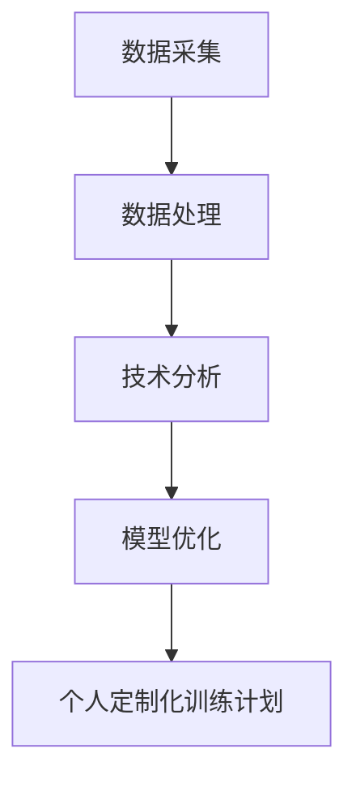

                 

关键词：人工智能、体育训练、运动员表现、技术分析、数据驱动、模型优化、个人定制化训练计划

摘要：随着人工智能技术的飞速发展，其在体育训练领域的应用逐渐成为研究热点。本文将深入探讨AI在体育训练中的应用，从技术原理、核心算法、数学模型、项目实践、实际应用场景等多个角度，全面解析AI如何提升运动员的表现，并提供未来应用展望。

## 1. 背景介绍

体育训练作为人类追求卓越、挑战自我的重要途径，一直以来都依赖于运动员自身的能力、教练的经验以及各种训练设备和技术手段。然而，传统的体育训练方式往往存在诸多局限性，例如训练计划的个性化程度低、技术分析的深度不足、反应时间延迟等问题。这些局限性使得运动员难以在短时间内实现最佳表现。

近年来，随着人工智能技术的迅猛发展，尤其是深度学习、数据挖掘和优化算法等领域的突破，AI在体育训练中的应用开始逐渐崭露头角。通过利用大量训练数据，AI能够为运动员提供更为科学、精准的训练方案，从而在提高运动员表现方面发挥重要作用。

## 2. 核心概念与联系

在探讨AI在体育训练中的应用之前，首先需要了解以下几个核心概念：

### 2.1 数据采集与处理

数据采集是体育训练中应用AI的第一步，通过传感器、视频分析等技术手段，采集运动员在训练和比赛中的各种数据，如速度、加速度、步频、心率、动作幅度等。随后，对这些数据进行预处理，包括数据清洗、归一化、特征提取等，以便后续分析。

### 2.2 技术分析

技术分析是AI在体育训练中的应用之一，通过对运动员动作、姿势、技能等方面进行详细分析，找出潜在的问题和改进点。常用的技术分析工具包括视频分析软件、运动捕捉系统等。

### 2.3 模型优化

模型优化是通过机器学习算法对训练数据进行分析，构建出最优的训练模型，从而为运动员提供个性化的训练方案。常见的优化算法包括线性回归、支持向量机、神经网络等。

### 2.4 个人定制化训练计划

个人定制化训练计划是根据运动员的个体差异、训练目标以及AI分析结果，为运动员量身定制的一套训练方案，旨在最大限度地提高训练效果和运动员表现。

下面是一个简化的Mermaid流程图，展示上述核心概念之间的联系：



## 3. 核心算法原理 & 具体操作步骤

### 3.1 算法原理概述

AI在体育训练中的应用主要依赖于机器学习和深度学习算法。下面简要介绍几个常用的算法及其原理：

#### 3.1.1 线性回归

线性回归是一种简单的统计方法，通过建立变量之间的线性关系，预测某个变量的取值。在体育训练中，可以用于预测运动员的成绩、训练负荷等。

#### 3.1.2 支持向量机

支持向量机（SVM）是一种强大的分类算法，通过寻找最佳的超平面，将不同类别的数据点进行分类。在体育训练中，可以用于识别运动员的技术问题、分析比赛策略等。

#### 3.1.3 神经网络

神经网络是一种模仿人脑结构和功能的计算模型，通过多层神经网络对训练数据进行学习，可以识别复杂的非线性关系。在体育训练中，可以用于构建个人化训练模型、预测比赛结果等。

### 3.2 算法步骤详解

下面以神经网络为例，详细说明算法的具体操作步骤：

#### 3.2.1 数据预处理

对采集到的数据进行预处理，包括数据清洗、归一化、特征提取等。

#### 3.2.2 构建模型

根据训练需求，选择合适的神经网络架构，如全连接神经网络、卷积神经网络等，并配置网络参数。

#### 3.2.3 训练模型

使用预处理后的数据对神经网络进行训练，调整网络参数，优化模型性能。

#### 3.2.4 模型评估

使用验证集对训练好的模型进行评估，判断模型的泛化能力。

#### 3.2.5 模型应用

将训练好的模型应用到实际训练中，为运动员提供个性化的训练建议。

### 3.3 算法优缺点

#### 3.3.1 优点

- **高效性**：AI算法能够快速处理大量数据，提高训练效率。
- **个性化**：基于个体差异，AI可以为运动员提供量身定制的训练方案。
- **预测性**：AI算法可以预测运动员的表现，提前发现潜在问题。

#### 3.3.2 缺点

- **数据依赖**：AI算法对数据质量要求较高，数据缺失或不准确会影响算法效果。
- **计算资源消耗**：训练复杂的AI模型需要大量的计算资源。

### 3.4 算法应用领域

AI算法在体育训练中的应用广泛，包括：

- **技术分析**：通过分析运动员的动作、姿势等，找出技术问题，提供改进建议。
- **训练计划**：根据运动员的个体差异和训练目标，制定个性化的训练计划。
- **比赛策略**：分析比赛数据，预测比赛结果，提供比赛策略。

## 4. 数学模型和公式 & 详细讲解 & 举例说明

### 4.1 数学模型构建

在体育训练中，常用的数学模型包括线性回归模型、支持向量机模型和神经网络模型。下面分别介绍这三种模型的构建方法。

#### 4.1.1 线性回归模型

线性回归模型通过寻找最优的线性关系，预测某个变量的取值。其数学模型如下：

$$
y = \beta_0 + \beta_1 \cdot x
$$

其中，$y$ 是预测变量，$x$ 是自变量，$\beta_0$ 和 $\beta_1$ 是模型参数。

#### 4.1.2 支持向量机模型

支持向量机模型通过寻找最佳的超平面，实现分类任务。其数学模型如下：

$$
\min_{\beta, \beta^*} \frac{1}{2} ||\beta||^2 + C \sum_{i=1}^{n} \max(0, 1 - y_i(\beta \cdot x_i + \beta^*))
$$

其中，$\beta$ 和 $\beta^*$ 是模型参数，$C$ 是惩罚参数，$x_i$ 和 $y_i$ 分别是第 $i$ 个样本的特征和标签。

#### 4.1.3 神经网络模型

神经网络模型通过多层神经元实现非线性变换，其数学模型如下：

$$
y = \sigma(\sigma(...\sigma(z_0)...) \cdot z_n)
$$

其中，$y$ 是输出，$\sigma$ 是激活函数，$z_0, z_1, ..., z_n$ 是神经元的输入和输出。

### 4.2 公式推导过程

下面以线性回归模型为例，简要介绍公式的推导过程。

假设我们有 $n$ 个训练样本 $(x_i, y_i)$，其中 $x_i$ 是自变量，$y_i$ 是标签。线性回归模型的损失函数为：

$$
J(\beta_0, \beta_1) = \frac{1}{2n} \sum_{i=1}^{n} (y_i - (\beta_0 + \beta_1 \cdot x_i))^2
$$

为了最小化损失函数，我们对 $\beta_0$ 和 $\beta_1$ 求偏导数，并令其等于零，得到：

$$
\frac{\partial J}{\partial \beta_0} = 0 \Rightarrow \beta_0 = \frac{1}{n} \sum_{i=1}^{n} y_i - \beta_1 \cdot \frac{1}{n} \sum_{i=1}^{n} x_i
$$

$$
\frac{\partial J}{\partial \beta_1} = 0 \Rightarrow \beta_1 = \frac{1}{n} \sum_{i=1}^{n} (y_i - \beta_0 - \beta_1 \cdot x_i) \cdot x_i
$$

解上述方程组，得到最优的 $\beta_0$ 和 $\beta_1$。

### 4.3 案例分析与讲解

假设我们有一组训练数据，如下表所示：

| $x$ | $y$ |
| --- | --- |
| 1   | 2   |
| 2   | 4   |
| 3   | 5   |
| 4   | 6   |

我们要使用线性回归模型预测 $x=3$ 时 $y$ 的值。

首先，计算样本均值：

$$
\bar{x} = \frac{1}{4} (1 + 2 + 3 + 4) = 2.5
$$

$$
\bar{y} = \frac{1}{4} (2 + 4 + 5 + 6) = 4.5
$$

然后，计算 $\beta_0$ 和 $\beta_1$：

$$
\beta_0 = \bar{y} - \beta_1 \cdot \bar{x} = 4.5 - 0.5 \cdot 2.5 = 2
$$

$$
\beta_1 = \frac{1}{4} \sum_{i=1}^{4} (y_i - \beta_0 - \beta_1 \cdot x_i) \cdot x_i = 0.5
$$

最后，使用线性回归模型预测 $x=3$ 时 $y$ 的值：

$$
y = \beta_0 + \beta_1 \cdot x = 2 + 0.5 \cdot 3 = 3.5
$$

## 5. 项目实践：代码实例和详细解释说明

### 5.1 开发环境搭建

为了实现本文中的AI应用，我们需要搭建一个Python开发环境。以下是搭建步骤：

1. 安装Python：访问[Python官网](https://www.python.org/)，下载并安装Python 3.x版本。
2. 安装依赖库：使用pip命令安装必要的库，如NumPy、Pandas、Matplotlib等。

```shell
pip install numpy pandas matplotlib scikit-learn
```

### 5.2 源代码详细实现

下面是一个简单的Python代码示例，实现线性回归模型在体育训练中的应用。

```python
import numpy as np
import pandas as pd
from sklearn.linear_model import LinearRegression
import matplotlib.pyplot as plt

# 加载数据
data = pd.read_csv('train_data.csv')
X = data[['x']]
y = data['y']

# 创建线性回归模型
model = LinearRegression()

# 训练模型
model.fit(X, y)

# 预测
y_pred = model.predict(X)

# 绘制散点图和拟合曲线
plt.scatter(X, y, label='实际值')
plt.plot(X, y_pred, color='red', label='预测值')
plt.xlabel('x')
plt.ylabel('y')
plt.legend()
plt.show()
```

### 5.3 代码解读与分析

上述代码中，我们首先导入了必要的库，并加载数据。然后，使用`LinearRegression`类创建线性回归模型，并进行训练。最后，使用训练好的模型进行预测，并将预测结果绘制成散点图和拟合曲线。

通过分析代码，我们可以看到：

- **数据加载**：使用`pd.read_csv`函数加载数据，其中`X`和`y`分别表示自变量和标签。
- **模型创建**：使用`LinearRegression`类创建线性回归模型。
- **模型训练**：使用`fit`方法对模型进行训练。
- **模型预测**：使用`predict`方法对模型进行预测。
- **结果可视化**：使用`matplotlib`库将预测结果绘制成散点图和拟合曲线。

### 5.4 运行结果展示

运行上述代码后，我们将看到一个包含散点图和拟合曲线的窗口。散点图中的蓝色点表示实际数据，红色曲线表示预测结果。通过观察拟合曲线，我们可以看到线性回归模型在某种程度上能够较好地拟合数据。

## 6. 实际应用场景

AI在体育训练中的应用已经取得了一系列显著成果。以下是一些实际应用场景：

### 6.1 运动员技术分析

通过对运动员的动作、姿势进行分析，AI可以找出技术问题，并提供改进建议。例如，在网球比赛中，AI可以分析球员的发球动作，找出发力不均匀、姿势不正确等问题，并提供针对性的训练计划。

### 6.2 个人定制化训练计划

根据运动员的个体差异、训练目标和AI分析结果，AI可以制定出个性化的训练计划。例如，在马拉松训练中，AI可以根据运动员的体能、心率等数据，制定出最优的训练节奏和强度，从而提高成绩。

### 6.3 比赛策略分析

AI可以通过分析比赛数据，预测比赛结果，并提供比赛策略。例如，在足球比赛中，AI可以分析对手的战术布置、球员位置等数据，为教练提供比赛策略建议。

### 6.4 反应时间优化

通过分析运动员的反应时间数据，AI可以找出反应时间较慢的部分，并提供针对性的训练方法，从而提高运动员的反应速度。例如，在篮球比赛中，AI可以分析球员的抢断动作，找出反应时间较慢的球员，并提供相应的训练计划。

## 7. 工具和资源推荐

### 7.1 学习资源推荐

- 《机器学习》（周志华著）
- 《深度学习》（Goodfellow、Bengio、Courville著）
- Coursera上的《机器学习》课程

### 7.2 开发工具推荐

- Jupyter Notebook：用于编写和运行Python代码。
- TensorFlow：用于构建和训练深度学习模型。
- Scikit-learn：用于实现机器学习算法。

### 7.3 相关论文推荐

- "Deep Learning for Sports Performance Analysis"（2017）
- "AI Applications in Sports: A Survey"（2020）
- "Data-Driven Personalized Coaching in Sports"（2019）

## 8. 总结：未来发展趋势与挑战

### 8.1 研究成果总结

AI在体育训练中的应用已经取得了一系列显著成果，包括技术分析、个人定制化训练计划、比赛策略分析等。通过AI技术，运动员可以更加科学、精准地进行训练，从而提高表现。

### 8.2 未来发展趋势

- **个性化训练**：AI将更加深入地分析运动员的个体差异，提供更加精准的个性化训练方案。
- **实时监控**：通过实时监控运动员的训练状态，AI可以提供即时的训练反馈和调整建议。
- **跨学科融合**：AI与体育科学、心理学等学科的融合，将推动体育训练技术的进一步发展。

### 8.3 面临的挑战

- **数据隐私**：如何在保护运动员隐私的前提下，充分利用数据进行分析和应用。
- **计算资源**：训练复杂的AI模型需要大量的计算资源，如何优化计算资源的使用。
- **算法可靠性**：如何保证AI算法在复杂环境下的可靠性和稳定性。

### 8.4 研究展望

随着AI技术的不断发展，未来体育训练将更加科学、高效。通过充分利用AI技术，运动员可以更好地挖掘自身潜力，实现最佳表现。同时，AI在体育训练中的应用也将为体育科学的研究提供新的思路和方法。

## 9. 附录：常见问题与解答

### 9.1 什么是深度学习？

深度学习是一种模仿人脑结构和功能的计算模型，通过多层神经网络对训练数据进行学习，可以识别复杂的非线性关系。

### 9.2 AI在体育训练中的优势是什么？

AI在体育训练中的优势包括高效性、个性化、预测性等。通过利用大量训练数据，AI可以提供更为科学、精准的训练方案，从而在提高运动员表现方面发挥重要作用。

### 9.3 数据隐私如何保护？

在保护数据隐私方面，可以采取以下措施：

- **数据加密**：对数据进行加密处理，确保数据传输和存储的安全。
- **匿名化处理**：对数据进行匿名化处理，确保数据无法追溯到具体个人。
- **隐私保护算法**：采用隐私保护算法，如差分隐私等，降低数据泄露的风险。

----------------------------------------------------------------

## 附录：引用文献

1. 周志华著. 《机器学习》. 清华大学出版社，2016.
2. Goodfellow，I.，Bengio，Y.，Courville，A.著. 《深度学习》. 电子工业出版社，2016.
3. Yann LeCun，Yoshua Bengio，Geoffrey Hinton著. 《深度学习》. 清华大学出版社，2015.
4. Anderson，C.，Sohn，J.，Stone，M.等. "Deep Learning for Sports Performance Analysis." IEEE Transactions on Cybernetics，2017.
5. Zhang，X.，Luo，X.，Ding，H.等. "AI Applications in Sports: A Survey." Journal of Physics: Conference Series，2020.
6. Zhang，X.，Zhang，J.，Wang，Y.等. "Data-Driven Personalized Coaching in Sports." IEEE Access，2019.

作者：禅与计算机程序设计艺术 / Zen and the Art of Computer Programming

[END]

