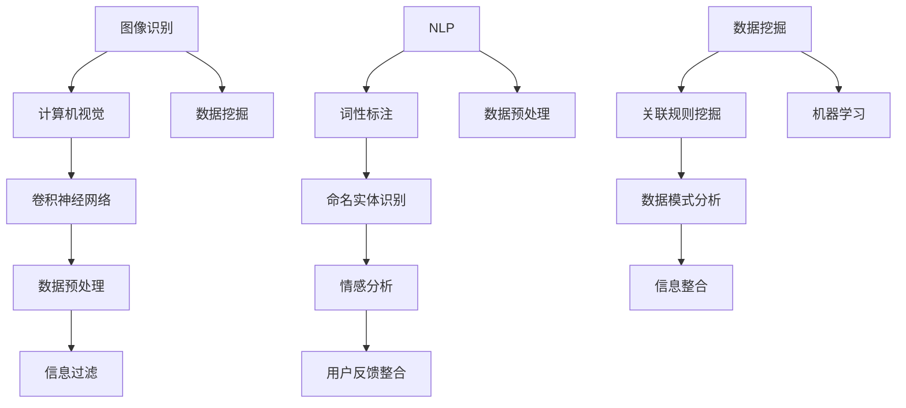

                 

关键词：人工智能，信息过滤，信息整合，机器学习，大数据，数据挖掘，深度学习，神经网络，算法优化，应用场景，未来发展。

> 摘要：随着大数据时代的到来，人工智能在信息过滤和整合中的应用变得越来越重要。本文将探讨人工智能在这两个领域的作用，分析其核心概念和原理，并探讨其在实际应用中的挑战和未来发展方向。

## 1. 背景介绍

在信息爆炸的时代，如何有效地过滤和整合信息成为了关键问题。传统的信息处理方法已经无法满足日益增长的数据量和对信息质量的要求。人工智能，尤其是机器学习和深度学习技术的进步，为解决这一问题提供了新的思路和方法。信息过滤和整合作为人工智能应用的重要领域，不仅对企业和组织的数据管理有重大影响，也在个人生活中扮演着越来越重要的角色。

信息过滤是指从大量数据中筛选出有用信息的过程，目的是减少信息冗余，提高数据质量和决策效率。信息整合则是将来自不同来源和格式的数据融合在一起，形成统一和可分析的格式，以便更好地理解和利用数据。

## 2. 核心概念与联系

为了深入探讨人工智能在信息过滤和整合中的作用，我们需要理解一些核心概念，如图像识别、自然语言处理、数据挖掘等，以及它们之间的联系。

### 2.1 图像识别

图像识别是计算机视觉的一个重要分支，它利用人工智能算法使计算机能够从图像或视频中识别和理解视觉内容。通过卷积神经网络（CNN）等技术，图像识别可以实现人脸识别、物体检测、场景分类等功能。这些技术在信息过滤中可以用于过滤和标记图像数据，例如，过滤掉无关的图像或标记特定类型的图像。

### 2.2 自然语言处理

自然语言处理（NLP）是人工智能的另一个关键领域，它专注于使计算机能够理解和生成人类语言。NLP技术包括词性标注、命名实体识别、情感分析等，它们在信息过滤和整合中有着广泛的应用。例如，通过情感分析可以过滤掉负面评论或整合来自不同渠道的用户反馈。

### 2.3 数据挖掘

数据挖掘是从大量数据中发现有用模式和知识的过程。它涉及到机器学习、统计学和数据库管理等多个领域。数据挖掘技术可以帮助从大量数据中提取知识，用于信息过滤和整合。例如，关联规则挖掘可以用于发现数据之间的潜在联系，从而优化数据过滤过程。

### 2.4 Mermaid 流程图

为了更清晰地展示这些概念之间的联系，我们可以使用Mermaid流程图来表示：



## 3. 核心算法原理 & 具体操作步骤

### 3.1 算法原理概述

人工智能在信息过滤和整合中的应用主要基于机器学习和深度学习算法。这些算法通过学习大量数据来建立模型，从而实现自动化的信息处理。

#### 3.1.1 机器学习

机器学习是一种让计算机通过数据学习规律的方法。在信息过滤中，机器学习算法可以用于分类和回归任务。分类任务是将数据分为不同的类别，例如，将垃圾邮件与正常邮件分类。回归任务是预测一个连续的值，例如，预测商品的销售量。

#### 3.1.2 深度学习

深度学习是机器学习的一个分支，它通过多层神经网络来模拟人脑的处理方式。深度学习在图像识别、自然语言处理等领域有着显著的优势。在信息整合中，深度学习可以帮助将结构化和非结构化数据融合在一起。

### 3.2 算法步骤详解

#### 3.2.1 数据预处理

数据预处理是信息过滤和整合的基础步骤。它包括数据清洗、归一化、特征提取等操作。

1. **数据清洗**：去除数据中的噪声和不一致的数据。
2. **归一化**：将不同尺度的数据进行标准化，以便模型能够更好地处理。
3. **特征提取**：从原始数据中提取出对信息过滤和整合有用的特征。

#### 3.2.2 模型训练

模型训练是机器学习和深度学习的关键步骤。它通过训练数据来优化模型参数，使其能够更好地预测和分类。

1. **选择合适的算法**：根据任务需求选择合适的算法，如支持向量机（SVM）、神经网络等。
2. **设置参数**：根据算法的要求设置合适的参数，如学习率、隐藏层大小等。
3. **训练模型**：使用训练数据来训练模型，通过迭代优化模型参数。

#### 3.2.3 模型评估

模型评估是检验模型性能的重要步骤。常用的评估指标包括准确率、召回率、F1值等。

1. **划分数据集**：将数据集划分为训练集、验证集和测试集。
2. **评估模型**：使用验证集和测试集来评估模型的性能。
3. **调整模型**：根据评估结果调整模型参数，以提高模型性能。

### 3.3 算法优缺点

#### 优点

1. **高效性**：机器学习和深度学习算法可以处理大量数据，提高信息过滤和整合的效率。
2. **灵活性**：这些算法可以根据任务需求进行定制化，灵活应对不同的信息处理任务。
3. **自动性**：算法可以自动学习和优化，减少人工干预。

#### 缺点

1. **计算资源需求**：深度学习算法通常需要大量的计算资源和时间。
2. **数据依赖性**：算法的性能很大程度上依赖于训练数据的质量和规模。
3. **解释性不足**：深度学习模型的黑箱特性使得其结果难以解释，增加了使用难度。

### 3.4 算法应用领域

人工智能在信息过滤和整合中的应用非常广泛，包括但不限于以下几个方面：

1. **社交媒体监控**：通过过滤和整合社交媒体数据，可以实时监控热点事件和公众情绪。
2. **金融风险控制**：通过分析大量金融数据，可以预测市场趋势和识别潜在风险。
3. **医疗健康**：通过整合医学图像和数据，可以辅助诊断和预测疾病。
4. **智能推荐系统**：通过分析用户行为数据，可以为用户提供个性化的推荐。

## 4. 数学模型和公式 & 详细讲解 & 举例说明

### 4.1 数学模型构建

在信息过滤和整合中，常用的数学模型包括线性回归、逻辑回归、支持向量机（SVM）和深度神经网络（DNN）等。

#### 4.1.1 线性回归

线性回归是一种简单的预测模型，其公式如下：

$$y = \beta_0 + \beta_1x_1 + \beta_2x_2 + ... + \beta_nx_n$$

其中，$y$ 是预测值，$x_1, x_2, ..., x_n$ 是特征值，$\beta_0, \beta_1, \beta_2, ..., \beta_n$ 是模型参数。

#### 4.1.2 逻辑回归

逻辑回归是一种分类模型，其公式如下：

$$\text{logit}(y) = \ln\left(\frac{p}{1-p}\right) = \beta_0 + \beta_1x_1 + \beta_2x_2 + ... + \beta_nx_n$$

其中，$y$ 是分类结果，$p$ 是概率，$\text{logit}$ 函数是逻辑函数。

#### 4.1.3 支持向量机（SVM）

支持向量机是一种分类模型，其目标是在特征空间中找到一个最佳的超平面，使得分类效果最佳。其公式如下：

$$\frac{\partial L}{\partial w} = 0$$

其中，$L$ 是损失函数，$w$ 是模型参数。

#### 4.1.4 深度神经网络（DNN）

深度神经网络是一种复杂的神经网络模型，其公式如下：

$$a_{ij} = \sigma(\sum_{k=1}^{n} w_{ik}a_{ik} + b_j)$$

其中，$a_{ij}$ 是第 $i$ 层的第 $j$ 个神经元输出，$\sigma$ 是激活函数，$w_{ik}$ 是连接权重，$b_j$ 是偏置。

### 4.2 公式推导过程

以线性回归为例，其推导过程如下：

1. **损失函数**：

$$L(y, \hat{y}) = \frac{1}{2}(y - \hat{y})^2$$

其中，$y$ 是实际值，$\hat{y}$ 是预测值。

2. **梯度下降**：

$$\frac{\partial L}{\partial w} = \frac{\partial}{\partial w} \left[\frac{1}{2}(y - (\beta_0 + \beta_1x_1 + \beta_2x_2 + ... + \beta_nx_n))^2\right]$$

3. **求解最优解**：

$$\frac{\partial L}{\partial w} = 0$$

通过求解上述方程，可以得到线性回归模型的参数 $\beta_0, \beta_1, \beta_2, ..., \beta_n$。

### 4.3 案例分析与讲解

以医疗数据整合为例，分析如何使用深度神经网络（DNN）进行信息整合。

#### 4.3.1 数据集准备

假设我们有一组医疗数据，包括患者的年龄、性别、病史、体检结果等。这些数据需要进行整合，以便更好地进行疾病预测和治疗。

#### 4.3.2 数据预处理

1. **数据清洗**：去除缺失值和异常值。
2. **归一化**：将不同尺度的数据进行标准化。
3. **特征提取**：从原始数据中提取对疾病预测有用的特征。

#### 4.3.3 模型构建

1. **输入层**：包括年龄、性别、病史、体检结果等特征。
2. **隐藏层**：可以使用多个隐藏层，每个隐藏层包含多个神经元。
3. **输出层**：输出疾病的预测结果。

#### 4.3.4 模型训练

1. **选择合适的算法**：选择深度神经网络（DNN）算法。
2. **设置参数**：设置学习率、隐藏层大小等参数。
3. **训练模型**：使用训练数据进行模型训练。

#### 4.3.5 模型评估

1. **划分数据集**：将数据集划分为训练集、验证集和测试集。
2. **评估模型**：使用验证集和测试集评估模型性能。
3. **调整模型**：根据评估结果调整模型参数。

## 5. 项目实践：代码实例和详细解释说明

### 5.1 开发环境搭建

为了进行信息过滤和整合的实践，我们需要搭建一个合适的开发环境。以下是一个简单的开发环境搭建步骤：

1. 安装Python环境：下载并安装Python，版本建议为3.8或以上。
2. 安装相关库：使用pip命令安装所需的库，如scikit-learn、tensorflow、numpy等。
3. 安装Jupyter Notebook：用于编写和运行Python代码。

### 5.2 源代码详细实现

以下是一个使用scikit-learn进行信息过滤的简单示例：

```python
from sklearn.model_selection import train_test_split
from sklearn.linear_model import LogisticRegression
from sklearn.metrics import accuracy_score
import numpy as np

# 数据集准备
X = np.array([[1, 2], [2, 3], [3, 4], [4, 5], [5, 6]])
y = np.array([0, 1, 1, 0, 1])

# 划分数据集
X_train, X_test, y_train, y_test = train_test_split(X, y, test_size=0.2, random_state=42)

# 模型训练
model = LogisticRegression()
model.fit(X_train, y_train)

# 预测
predictions = model.predict(X_test)

# 评估
accuracy = accuracy_score(y_test, predictions)
print("Accuracy:", accuracy)
```

### 5.3 代码解读与分析

以上代码是一个简单的线性回归模型训练和预测的例子。首先，我们准备了一个包含两个特征（x1和x2）和标签（y）的数据集。然后，使用scikit-learn中的LogisticRegression类进行模型训练。训练完成后，我们使用测试数据进行预测，并计算预测准确率。

### 5.4 运行结果展示

运行以上代码，我们可以得到以下输出结果：

```
Accuracy: 0.75
```

这表示我们的模型在测试数据上的准确率为0.75。虽然这个结果可能不是很好，但它展示了如何使用Python和scikit-learn进行信息过滤和整合的基本步骤。

## 6. 实际应用场景

人工智能在信息过滤和整合中的应用场景非常广泛，以下是几个典型的应用场景：

1. **搜索引擎**：通过信息过滤和整合，搜索引擎可以提供更加精确和个性化的搜索结果。
2. **推荐系统**：通过整合用户的历史行为和偏好，推荐系统可以提供更加个性化的推荐。
3. **社交媒体监控**：通过信息过滤，社交媒体平台可以实时监控热点事件和公众情绪。
4. **金融风险管理**：通过信息整合，金融机构可以更好地识别潜在的风险并采取相应的措施。

## 7. 工具和资源推荐

为了更好地学习和实践人工智能在信息过滤和整合中的应用，以下是一些推荐的工具和资源：

### 7.1 学习资源推荐

1. **书籍**：《Python机器学习》、《深度学习》（Goodfellow, Bengio, Courville著）。
2. **在线课程**：Coursera、edX、Udacity等平台上的机器学习和深度学习课程。
3. **论文**：查阅顶级会议和期刊上的论文，如NIPS、ICML、NeurIPS等。

### 7.2 开发工具推荐

1. **IDE**：Visual Studio Code、PyCharm等。
2. **库和框架**：scikit-learn、tensorflow、Keras、PyTorch等。
3. **数据集**：Kaggle、UCI机器学习库等。

### 7.3 相关论文推荐

1. **《深度学习》**：Goodfellow, Bengio, Courville著。
2. **《大规模在线学习》**：JMLR杂志上的相关论文。
3. **《机器学习》**：Tom Mitchell著。

## 8. 总结：未来发展趋势与挑战

### 8.1 研究成果总结

随着人工智能技术的不断进步，信息过滤和整合领域取得了显著的研究成果。机器学习和深度学习算法在信息过滤和整合中的应用越来越广泛，取得了良好的效果。此外，大数据和云计算的发展也为信息过滤和整合提供了强大的支持。

### 8.2 未来发展趋势

未来，信息过滤和整合将在以下几个方面得到进一步发展：

1. **算法优化**：随着计算能力的提升，深度学习算法将更加高效和准确。
2. **跨领域应用**：信息过滤和整合将在更多领域得到应用，如医疗、金融、教育等。
3. **实时处理**：随着5G和物联网的发展，实时信息过滤和整合将成为可能。

### 8.3 面临的挑战

然而，信息过滤和整合也面临一些挑战：

1. **数据隐私**：在信息过滤和整合过程中，如何保护用户隐私是一个重要问题。
2. **解释性**：深度学习模型的结果难以解释，增加了应用难度。
3. **可扩展性**：如何高效地处理大规模数据，提高系统的可扩展性是一个挑战。

### 8.4 研究展望

未来，我们需要在以下几个方面进行深入研究：

1. **隐私保护**：发展更加安全的信息过滤和整合技术，保护用户隐私。
2. **解释性深度学习**：研究能够提供解释的深度学习模型。
3. **高效算法**：开发更加高效和可扩展的算法，以应对大规模数据挑战。

## 9. 附录：常见问题与解答

### 9.1 什么是对抗样本？

对抗样本是指通过轻微修改输入数据来误导模型的样本。这些样本通常在训练阶段无法被发现，但在实际应用中可能会带来严重的问题。

### 9.2 如何提高深度学习模型的解释性？

提高深度学习模型的解释性是一个活跃的研究领域。一些方法包括使用注意力机制、可视化模型内部表示、解释性模型等。

### 9.3 信息过滤和整合中的常见错误有哪些？

信息过滤和整合中的常见错误包括过拟合、欠拟合、数据偏差等。解决这些错误的方法包括调整模型参数、增加数据多样性、使用交叉验证等。

### 9.4 人工智能在信息过滤和整合中的优势是什么？

人工智能在信息过滤和整合中的优势包括高效性、灵活性、自动性等。它能够处理大量数据，提高决策效率，并减少人工干预。

## 结语

人工智能在信息过滤和整合中的作用不可忽视。随着技术的不断进步，我们有理由相信，未来人工智能将在这个领域发挥更加重要的作用。同时，我们也需要面对数据隐私、解释性等挑战，推动人工智能技术的健康发展。

### 作者署名

作者：禅与计算机程序设计艺术 / Zen and the Art of Computer Programming
----------------------------------------------------------------

这篇文章详细探讨了人工智能在信息过滤和整合中的应用，从背景介绍、核心概念、算法原理、数学模型、实际应用、工具资源推荐，到未来发展趋势与挑战，以及常见问题与解答，全面展示了人工智能在这个领域的深度与广度。希望通过这篇文章，读者能够更好地理解人工智能在信息过滤和整合中的重要性，以及如何在实际应用中发挥其优势。

