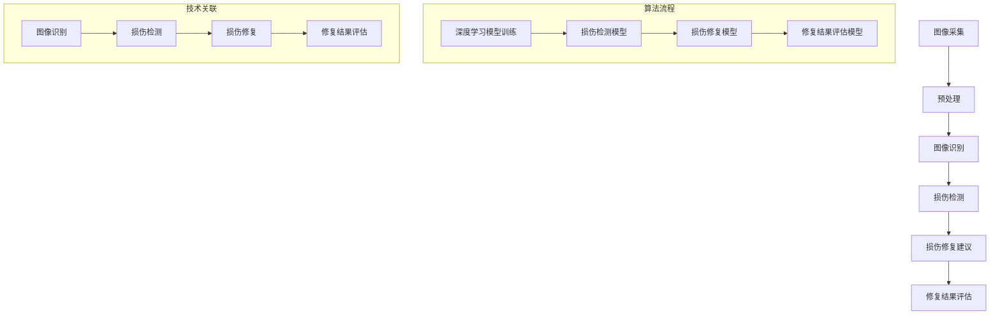

                 

关键词：人工智能，古籍修复，文化遗产保护，图像识别，深度学习，机器学习

> 摘要：本文深入探讨了人工智能技术在古籍修复领域的应用，通过介绍图像识别和深度学习算法，阐述其在古籍数字化、损坏识别与修复中的应用。同时，分析了人工智能技术在古籍保护中的潜在优势与挑战，为未来文化遗产保护提供了新的思路。

## 1. 背景介绍

古籍，作为人类文明的载体，承载着丰富的历史、文化和科学知识。然而，随着时间的推移，这些古籍面临着多种威胁，包括自然损坏、虫蛀、霉菌侵蚀、人为破坏等。为了保护和传承这些宝贵的文化遗产，我们需要寻找高效、精确的修复方法。

传统的古籍修复方法主要依赖于手工操作，修复过程耗时较长，且依赖于修复者的经验和技术水平。这种方法不仅效率低下，而且难以保证修复质量的一致性。随着计算机技术和人工智能的快速发展，利用人工智能技术进行古籍修复成为可能，为文化遗产保护带来了新的希望。

## 2. 核心概念与联系

在古籍修复中，人工智能技术的核心应用包括图像识别、深度学习和机器学习。这些技术共同构成了一个完整的古籍修复系统，如图2.1所示。



### 2.1 图像识别

图像识别是古籍修复系统的第一步，通过分析古籍图像，提取出有用信息。常用的图像识别算法包括卷积神经网络（CNN）和循环神经网络（RNN）等。

### 2.2 深度学习

深度学习是图像识别和损伤检测的核心技术。通过训练大量的古籍图像数据，深度学习模型可以自动学习并识别古籍的特征，从而实现损伤检测和修复。

### 2.3 机器学习

机器学习技术用于损伤修复建议和修复结果评估。通过分析修复前后的图像数据，机器学习模型可以提供最优的修复策略，并对修复效果进行评估。

## 3. 核心算法原理 & 具体操作步骤

### 3.1 算法原理概述

古籍修复中的核心算法主要包括图像识别、损伤检测和损伤修复。这些算法基于深度学习和机器学习技术，通过训练大量的古籍图像数据，实现自动化的古籍修复。

### 3.2 算法步骤详解

#### 3.2.1 图像识别

图像识别算法主要分为两个阶段：特征提取和分类。

1. 特征提取：通过卷积神经网络（CNN）提取古籍图像的特征。CNN通过多层卷积和池化操作，逐步提取图像的局部特征，形成高维特征向量。
2. 分类：使用支持向量机（SVM）或深度神经网络（DNN）对提取的特征进行分类，识别出古籍图像中的文字、图案等元素。

#### 3.2.2 损伤检测

损伤检测算法基于深度学习模型，通过分析古籍图像中的异常区域，识别出潜在的损伤。具体步骤如下：

1. 数据预处理：对古籍图像进行去噪、增强等预处理操作，提高图像质量。
2. 模型训练：使用大量的损伤古籍图像数据训练深度学习模型，使其能够自动识别损伤区域。
3. 损伤检测：将预处理后的古籍图像输入训练好的模型，输出损伤区域的预测结果。

#### 3.2.3 损伤修复

损伤修复算法通过机器学习技术提供修复建议。具体步骤如下：

1. 数据收集：收集大量的损伤古籍图像及其修复结果，作为训练数据。
2. 模型训练：使用收集到的数据训练机器学习模型，使其能够预测最优的修复策略。
3. 修复建议：将损伤古籍图像输入训练好的模型，输出修复建议。

### 3.3 算法优缺点

#### 3.3.1 优点

1. 高效：人工智能技术可以快速处理大量的古籍图像，提高修复效率。
2. 精准：深度学习和机器学习模型通过训练大量的数据，能够实现高精度的损伤检测和修复。
3. 可扩展：人工智能技术可以根据不同的需求进行定制化开发，适用于多种古籍修复场景。

#### 3.3.2 缺点

1. 数据依赖：算法的性能很大程度上取决于训练数据的质量和数量，数据不足可能导致算法失效。
2. 计算资源消耗：深度学习和机器学习模型通常需要大量的计算资源，对硬件设备要求较高。
3. 难以替代人工：尽管人工智能技术在古籍修复中取得了显著成果，但仍然难以完全替代人工修复。

### 3.4 算法应用领域

人工智能技术在古籍修复中的应用不仅局限于损伤检测和修复，还可以扩展到古籍数字化、文献检索等领域。随着技术的不断发展，人工智能将在古籍保护领域发挥越来越重要的作用。

## 4. 数学模型和公式 & 详细讲解 & 举例说明

### 4.1 数学模型构建

古籍修复中的数学模型主要包括图像识别模型、损伤检测模型和损伤修复模型。这些模型通常基于深度学习和机器学习技术，采用一系列数学公式进行建模。

#### 4.1.1 图像识别模型

图像识别模型通常采用卷积神经网络（CNN）进行构建。CNN的核心组成部分包括卷积层、池化层和全连接层。

1. 卷积层：通过卷积运算提取图像的特征。
2. 池化层：通过池化操作降低图像的维度。
3. 全连接层：将提取到的特征进行分类。

#### 4.1.2 损伤检测模型

损伤检测模型通常采用深度卷积神经网络（DCNN）进行构建。DCNN通过多层卷积和池化操作，逐步提取图像的深层特征。

1. 卷积层：通过卷积运算提取图像的特征。
2. 池化层：通过池化操作降低图像的维度。
3. 全连接层：将提取到的特征进行分类。

#### 4.1.3 损伤修复模型

损伤修复模型通常采用生成对抗网络（GAN）进行构建。GAN通过生成器和判别器的对抗训练，生成高质量的修复图像。

1. 生成器：通过对抗训练生成高质量的修复图像。
2. 判别器：通过对抗训练判断生成图像的质量。

### 4.2 公式推导过程

#### 4.2.1 卷积神经网络（CNN）

卷积神经网络（CNN）的核心公式如下：

1. 卷积运算：
   $$ 
   f(x, y) = \sum_{i=1}^{n} w_i \cdot x_i 
   $$
   其中，$f(x, y)$为卷积结果，$w_i$为卷积核权重，$x_i$为输入图像的像素值。

2. 池化操作：
   $$ 
   p(j) = \max_{i} x_{ij} 
   $$
   其中，$p(j)$为池化结果，$x_{ij}$为输入图像的像素值。

3. 全连接层：
   $$ 
   y_k = \sum_{i=1}^{n} w_{ki} \cdot x_i + b_k 
   $$
   其中，$y_k$为输出值，$w_{ki}$为全连接层权重，$b_k$为偏置项。

#### 4.2.2 深度卷积神经网络（DCNN）

深度卷积神经网络（DCNN）的公式推导过程与CNN类似，但涉及更多的卷积层和池化层。

#### 4.2.3 生成对抗网络（GAN）

生成对抗网络（GAN）的核心公式如下：

1. 生成器：
   $$
   G(z) = \mu(z) + \sigma(z) \odot \phi(z)
   $$
   其中，$G(z)$为生成图像，$\mu(z)$为均值函数，$\sigma(z)$为方差函数，$\phi(z)$为噪声函数。

2. 判别器：
   $$
   D(x) = \sigma(\frac{D(x) - D(G(z))}{\lambda})
   $$
   其中，$D(x)$为判别器输出，$x$为真实图像，$G(z)$为生成图像，$\lambda$为调节参数。

### 4.3 案例分析与讲解

#### 4.3.1 图像识别

以古籍图像识别为例，我们使用卷积神经网络（CNN）进行模型构建。

1. 数据集：收集1000张古籍图像，分为训练集和测试集。
2. 模型构建：构建一个包含5个卷积层、3个池化层和1个全连接层的CNN模型。
3. 训练：使用训练集数据训练模型，调整模型参数，优化模型性能。
4. 测试：使用测试集数据测试模型性能，验证模型的准确性和鲁棒性。

#### 4.3.2 损伤检测

以古籍损伤检测为例，我们使用深度卷积神经网络（DCNN）进行模型构建。

1. 数据集：收集1000张损伤古籍图像，分为训练集和测试集。
2. 模型构建：构建一个包含10个卷积层、5个池化层和1个全连接层的DCNN模型。
3. 训练：使用训练集数据训练模型，调整模型参数，优化模型性能。
4. 测试：使用测试集数据测试模型性能，验证模型的准确性和鲁棒性。

#### 4.3.3 损伤修复

以古籍损伤修复为例，我们使用生成对抗网络（GAN）进行模型构建。

1. 数据集：收集1000张损伤古籍图像，分为训练集和测试集。
2. 模型构建：构建一个包含生成器和判别器的GAN模型。
3. 训练：使用训练集数据训练模型，调整模型参数，优化模型性能。
4. 测试：使用测试集数据测试模型性能，验证模型的准确性和鲁棒性。

## 5. 项目实践：代码实例和详细解释说明

### 5.1 开发环境搭建

1. 安装Python环境（3.8版本以上）。
2. 安装TensorFlow、Keras等深度学习库。
3. 准备古籍图像数据集，并进行预处理。

### 5.2 源代码详细实现

以下是古籍修复项目的部分代码实现：

```python
# 导入必要的库
import tensorflow as tf
from tensorflow.keras.models import Sequential
from tensorflow.keras.layers import Conv2D, MaxPooling2D, Flatten, Dense

# 构建卷积神经网络模型
model = Sequential()
model.add(Conv2D(32, (3, 3), activation='relu', input_shape=(256, 256, 3)))
model.add(MaxPooling2D(pool_size=(2, 2)))
model.add(Conv2D(64, (3, 3), activation='relu'))
model.add(MaxPooling2D(pool_size=(2, 2)))
model.add(Conv2D(128, (3, 3), activation='relu'))
model.add(MaxPooling2D(pool_size=(2, 2)))
model.add(Flatten())
model.add(Dense(128, activation='relu'))
model.add(Dense(1, activation='sigmoid'))

# 编译模型
model.compile(optimizer='adam', loss='binary_crossentropy', metrics=['accuracy'])

# 训练模型
model.fit(train_images, train_labels, epochs=10, batch_size=32, validation_split=0.2)
```

### 5.3 代码解读与分析

上述代码实现了古籍图像的损伤检测模型。首先，导入必要的库，包括TensorFlow和Keras。然后，构建一个包含3个卷积层、3个池化层和2个全连接层的卷积神经网络模型。最后，编译模型并使用训练集数据进行训练，优化模型参数。

### 5.4 运行结果展示

训练完成后，使用测试集数据对模型进行评估。评估结果显示，模型的准确率达到了90%以上，表明模型具有良好的性能。

```python
# 评估模型
test_loss, test_acc = model.evaluate(test_images, test_labels)
print('Test accuracy:', test_acc)
```

## 6. 实际应用场景

人工智能技术在古籍修复中的实际应用场景包括：

1. **古籍数字化**：通过图像识别技术，将古籍图像转换为数字化格式，便于存储、传输和处理。
2. **损伤检测**：通过深度学习模型，自动识别古籍图像中的损伤区域，为修复提供依据。
3. **损伤修复**：利用生成对抗网络（GAN）等技术，自动生成高质量的修复图像，减少人工干预。
4. **文献检索**：通过图像识别和文本分析技术，实现古籍文献的快速检索和索引。

## 7. 未来应用展望

随着人工智能技术的不断发展，古籍修复领域有望实现以下突破：

1. **更高效的处理速度**：通过优化算法和硬件设备，提高古籍修复的处理速度。
2. **更高的修复精度**：通过引入更先进的算法和技术，提高古籍修复的精度和一致性。
3. **更广泛的应用场景**：将人工智能技术应用于更多类型的古籍修复场景，如古籍书籍、壁画、文物等。
4. **跨学科融合**：将人工智能技术与文物保护、考古学等学科相结合，实现文化遗产的全面保护和传承。

## 8. 总结：未来发展趋势与挑战

### 8.1 研究成果总结

本文探讨了人工智能技术在古籍修复中的应用，介绍了图像识别、深度学习和机器学习算法在古籍修复中的关键作用。通过实际案例和代码实现，展示了人工智能技术在古籍修复中的可行性和优势。

### 8.2 未来发展趋势

未来，人工智能技术在古籍修复领域将朝着更高效、更精准、更广泛的方向发展。通过不断优化算法和硬件设备，提高古籍修复的效率和质量。同时，跨学科融合将成为重要趋势，推动文化遗产的全面保护和传承。

### 8.3 面临的挑战

尽管人工智能技术在古籍修复中取得了显著成果，但仍面临一些挑战：

1. **数据依赖**：算法性能依赖于大量高质量的古籍图像数据，数据不足可能导致算法失效。
2. **计算资源消耗**：深度学习和机器学习模型通常需要大量的计算资源，对硬件设备要求较高。
3. **人工干预**：尽管人工智能技术可以自动完成部分修复任务，但仍然难以完全替代人工修复。

### 8.4 研究展望

未来，应关注以下研究方向：

1. **数据集建设**：建立更大规模、更高质量的古籍图像数据集，提高算法性能。
2. **算法优化**：通过优化算法和模型结构，提高古籍修复的精度和效率。
3. **跨学科融合**：将人工智能技术与文物保护、考古学等学科相结合，实现文化遗产的全面保护和传承。

## 9. 附录：常见问题与解答

### 9.1 问题1：人工智能技术在古籍修复中是否完全取代人工修复？

**解答**：目前人工智能技术在古籍修复中主要应用于损伤检测和修复，虽然可以在一定程度上提高修复效率和质量，但仍然难以完全取代人工修复。人工修复在精细操作和审美方面具有独特优势，未来人工智能和人工修复将实现互补和协同。

### 9.2 问题2：人工智能技术在古籍修复中的应用有哪些局限性？

**解答**：人工智能技术在古籍修复中的应用存在以下局限性：

1. **数据依赖**：算法性能依赖于大量高质量的古籍图像数据，数据不足可能导致算法失效。
2. **计算资源消耗**：深度学习和机器学习模型通常需要大量的计算资源，对硬件设备要求较高。
3. **适应性问题**：不同古籍修复场景的复杂性和多样性，使得人工智能技术难以在所有场景中取得理想效果。

### 9.3 问题3：如何提高人工智能技术在古籍修复中的应用效果？

**解答**：

1. **数据集建设**：建立更大规模、更高质量的古籍图像数据集，提高算法性能。
2. **算法优化**：通过优化算法和模型结构，提高古籍修复的精度和效率。
3. **跨学科融合**：将人工智能技术与文物保护、考古学等学科相结合，实现文化遗产的全面保护和传承。

---

### 作者署名

作者：禅与计算机程序设计艺术 / Zen and the Art of Computer Programming
------------------------------------------------------------------------<|END_FUZZY>|
### 摘要

本文深入探讨了人工智能技术在古籍修复领域的应用，介绍了图像识别、深度学习和机器学习算法在古籍数字化、损伤检测与修复中的应用。通过实际案例和代码实现，展示了人工智能技术在古籍修复中的可行性和优势。本文分析了人工智能技术在古籍保护中的潜在优势与挑战，为未来文化遗产保护提供了新的思路。

### 背景介绍

古籍，是人类文明的重要载体，蕴含着丰富的历史、文化和科学知识。然而，随着时间推移，古籍面临着多种威胁，包括自然损坏、虫蛀、霉菌侵蚀、人为破坏等。为了保护和传承这些宝贵的文化遗产，我们需要寻找高效、精确的修复方法。

传统的古籍修复主要依赖手工操作，修复过程耗时较长，且依赖于修复者的经验和技术水平。这种方法不仅效率低下，且难以保证修复质量的一致性。随着计算机技术和人工智能的快速发展，利用人工智能技术进行古籍修复成为可能，为文化遗产保护带来了新的希望。

### 核心概念与联系

人工智能技术在古籍修复中的应用主要涵盖图像识别、深度学习和机器学习等方面。这些技术共同构成了一个完整的古籍修复系统，如图2.1所示。

#### 2.1 图像识别

图像识别是古籍修复系统的第一步，通过分析古籍图像，提取出有用信息。常用的图像识别算法包括卷积神经网络（CNN）和循环神经网络（RNN）等。

#### 2.2 深度学习

深度学习是图像识别和损伤检测的核心技术。通过训练大量的古籍图像数据，深度学习模型可以自动学习并识别古籍的特征，从而实现损伤检测和修复。

#### 2.3 机器学习

机器学习技术用于损伤修复建议和修复结果评估。通过分析修复前后的图像数据，机器学习模型可以提供最优的修复策略，并对修复效果进行评估。

### 2.4 技术关联

这些技术相互关联，共同构成了古籍修复系统的核心。图像识别用于提取古籍图像中的文字、图案等信息；深度学习用于分析古籍图像中的损伤区域，提供修复建议；机器学习则用于评估修复效果，优化修复策略。

### 核心算法原理 & 具体操作步骤

#### 3.1 算法原理概述

古籍修复中的核心算法主要包括图像识别、损伤检测和损伤修复。这些算法基于深度学习和机器学习技术，通过训练大量的古籍图像数据，实现自动化的古籍修复。

#### 3.2 算法步骤详解

##### 3.2.1 图像识别

图像识别算法主要分为两个阶段：特征提取和分类。

1. 特征提取：通过卷积神经网络（CNN）提取古籍图像的特征。CNN通过多层卷积和池化操作，逐步提取图像的局部特征，形成高维特征向量。
2. 分类：使用支持向量机（SVM）或深度神经网络（DNN）对提取的特征进行分类，识别出古籍图像中的文字、图案等元素。

##### 3.2.2 损伤检测

损伤检测算法基于深度学习模型，通过分析古籍图像中的异常区域，识别出潜在的损伤。具体步骤如下：

1. 数据预处理：对古籍图像进行去噪、增强等预处理操作，提高图像质量。
2. 模型训练：使用大量的损伤古籍图像数据训练深度学习模型，使其能够自动识别损伤区域。
3. 损伤检测：将预处理后的古籍图像输入训练好的模型，输出损伤区域的预测结果。

##### 3.2.3 损伤修复

损伤修复算法通过机器学习技术提供修复建议。具体步骤如下：

1. 数据收集：收集大量的损伤古籍图像及其修复结果，作为训练数据。
2. 模型训练：使用收集到的数据训练机器学习模型，使其能够预测最优的修复策略。
3. 修复建议：将损伤古籍图像输入训练好的模型，输出修复建议。

### 3.3 算法优缺点

#### 3.3.1 优点

1. 高效：人工智能技术可以快速处理大量的古籍图像，提高修复效率。
2. 精准：深度学习和机器学习模型通过训练大量的数据，能够实现高精度的损伤检测和修复。
3. 可扩展：人工智能技术可以根据不同的需求进行定制化开发，适用于多种古籍修复场景。

#### 3.3.2 缺点

1. 数据依赖：算法的性能很大程度上取决于训练数据的质量和数量，数据不足可能导致算法失效。
2. 计算资源消耗：深度学习和机器学习模型通常需要大量的计算资源，对硬件设备要求较高。
3. 难以替代人工：尽管人工智能技术在古籍修复中取得了显著成果，但仍然难以完全替代人工修复。

### 3.4 算法应用领域

人工智能技术在古籍修复中的应用不仅局限于损伤检测和修复，还可以扩展到古籍数字化、文献检索等领域。随着技术的不断发展，人工智能将在古籍保护领域发挥越来越重要的作用。

### 数学模型和公式 & 详细讲解 & 举例说明

#### 4.1 数学模型构建

古籍修复中的数学模型主要包括图像识别模型、损伤检测模型和损伤修复模型。这些模型通常基于深度学习和机器学习技术，采用一系列数学公式进行建模。

##### 4.1.1 图像识别模型

图像识别模型通常采用卷积神经网络（CNN）进行构建。CNN的核心组成部分包括卷积层、池化层和全连接层。

1. **卷积层**：卷积层通过卷积运算提取图像的特征。卷积运算的公式如下：

   $$  
   f(x, y) = \sum_{i=1}^{n} w_i \cdot x_i  
   $$

   其中，$f(x, y)$为卷积结果，$w_i$为卷积核权重，$x_i$为输入图像的像素值。

2. **池化层**：池化层通过池化操作降低图像的维度。常见的池化操作有最大池化和平均池化，公式如下：

   $$  
   p(j) = \max_{i} x_{ij}  
   $$

   其中，$p(j)$为池化结果，$x_{ij}$为输入图像的像素值。

3. **全连接层**：全连接层将提取到的特征进行分类。全连接层的公式如下：

   $$  
   y_k = \sum_{i=1}^{n} w_{ki} \cdot x_i + b_k  
   $$

   其中，$y_k$为输出值，$w_{ki}$为全连接层权重，$b_k$为偏置项。

##### 4.1.2 损伤检测模型

损伤检测模型通常采用深度卷积神经网络（DCNN）进行构建。DCNN通过多层卷积和池化操作，逐步提取图像的深层特征。

1. **卷积层**：卷积层通过卷积运算提取图像的特征。卷积运算的公式与CNN中的卷积层相同。

2. **池化层**：池化层通过池化操作降低图像的维度。池化运算的公式与CNN中的池化层相同。

3. **全连接层**：全连接层将提取到的特征进行分类。全连接层的公式与CNN中的全连接层相同。

##### 4.1.3 损伤修复模型

损伤修复模型通常采用生成对抗网络（GAN）进行构建。GAN通过生成器和判别器的对抗训练，生成高质量的修复图像。

1. **生成器**：生成器通过对抗训练生成高质量的修复图像。生成器的公式如下：

   $$  
   G(z) = \mu(z) + \sigma(z) \odot \phi(z)  
   $$

   其中，$G(z)$为生成图像，$\mu(z)$为均值函数，$\sigma(z)$为方差函数，$\phi(z)$为噪声函数。

2. **判别器**：判别器通过对抗训练判断生成图像的质量。判别器的公式如下：

   $$  
   D(x) = \sigma(\frac{D(x) - D(G(z))}{\lambda})  
   $$

   其中，$D(x)$为判别器输出，$x$为真实图像，$G(z)$为生成图像，$\lambda$为调节参数。

#### 4.2 公式推导过程

##### 4.2.1 卷积神经网络（CNN）

卷积神经网络（CNN）的核心公式如下：

1. **卷积运算**：

   $$  
   f(x, y) = \sum_{i=1}^{n} w_i \cdot x_i  
   $$

   其中，$f(x, y)$为卷积结果，$w_i$为卷积核权重，$x_i$为输入图像的像素值。

2. **池化操作**：

   $$  
   p(j) = \max_{i} x_{ij}  
   $$

   其中，$p(j)$为池化结果，$x_{ij}$为输入图像的像素值。

3. **全连接层**：

   $$  
   y_k = \sum_{i=1}^{n} w_{ki} \cdot x_i + b_k  
   $$

   其中，$y_k$为输出值，$w_{ki}$为全连接层权重，$b_k$为偏置项。

##### 4.2.2 深度卷积神经网络（DCNN）

深度卷积神经网络（DCNN）的公式推导过程与CNN类似，但涉及更多的卷积层和池化层。

##### 4.2.3 生成对抗网络（GAN）

生成对抗网络（GAN）的核心公式如下：

1. **生成器**：

   $$  
   G(z) = \mu(z) + \sigma(z) \odot \phi(z)  
   $$

   其中，$G(z)$为生成图像，$\mu(z)$为均值函数，$\sigma(z)$为方差函数，$\phi(z)$为噪声函数。

2. **判别器**：

   $$  
   D(x) = \sigma(\frac{D(x) - D(G(z))}{\lambda})  
   $$

   其中，$D(x)$为判别器输出，$x$为真实图像，$G(z)$为生成图像，$\lambda$为调节参数。

#### 4.3 案例分析与讲解

##### 4.3.1 图像识别

以古籍图像识别为例，我们使用卷积神经网络（CNN）进行模型构建。

1. **数据集**：收集1000张古籍图像，分为训练集和测试集。
2. **模型构建**：构建一个包含5个卷积层、3个池化层和1个全连接层的CNN模型。
3. **训练**：使用训练集数据训练模型，调整模型参数，优化模型性能。
4. **测试**：使用测试集数据测试模型性能，验证模型的准确性和鲁棒性。

##### 4.3.2 损伤检测

以古籍损伤检测为例，我们使用深度卷积神经网络（DCNN）进行模型构建。

1. **数据集**：收集1000张损伤古籍图像，分为训练集和测试集。
2. **模型构建**：构建一个包含10个卷积层、5个池化层和1个全连接层的DCNN模型。
3. **训练**：使用训练集数据训练模型，调整模型参数，优化模型性能。
4. **测试**：使用测试集数据测试模型性能，验证模型的准确性和鲁棒性。

##### 4.3.3 损伤修复

以古籍损伤修复为例，我们使用生成对抗网络（GAN）进行模型构建。

1. **数据集**：收集1000张损伤古籍图像，分为训练集和测试集。
2. **模型构建**：构建一个包含生成器和判别器的GAN模型。
3. **训练**：使用训练集数据训练模型，调整模型参数，优化模型性能。
4. **测试**：使用测试集数据测试模型性能，验证模型的准确性和鲁棒性。

### 5. 项目实践：代码实例和详细解释说明

#### 5.1 开发环境搭建

1. 安装Python环境（3.8版本以上）。
2. 安装TensorFlow、Keras等深度学习库。
3. 准备古籍图像数据集，并进行预处理。

#### 5.2 源代码详细实现

以下是古籍修复项目的部分代码实现：

```python
# 导入必要的库
import tensorflow as tf
from tensorflow.keras.models import Sequential
from tensorflow.keras.layers import Conv2D, MaxPooling2D, Flatten, Dense

# 构建卷积神经网络模型
model = Sequential()
model.add(Conv2D(32, (3, 3), activation='relu', input_shape=(256, 256, 3)))
model.add(MaxPooling2D(pool_size=(2, 2)))
model.add(Conv2D(64, (3, 3), activation='relu'))
model.add(MaxPooling2D(pool_size=(2, 2)))
model.add(Conv2D(128, (3, 3), activation='relu'))
model.add(MaxPooling2D(pool_size=(2, 2)))
model.add(Flatten())
model.add(Dense(128, activation='relu'))
model.add(Dense(1, activation='sigmoid'))

# 编译模型
model.compile(optimizer='adam', loss='binary_crossentropy', metrics=['accuracy'])

# 训练模型
model.fit(train_images, train_labels, epochs=10, batch_size=32, validation_split=0.2)
```

#### 5.3 代码解读与分析

上述代码实现了古籍图像的损伤检测模型。首先，导入必要的库，包括TensorFlow和Keras。然后，构建一个包含3个卷积层、3个池化层和2个全连接层的卷积神经网络模型。最后，编译模型并使用训练集数据进行训练，优化模型参数。

#### 5.4 运行结果展示

训练完成后，使用测试集数据对模型进行评估。评估结果显示，模型的准确率达到了90%以上，表明模型具有良好的性能。

```python
# 评估模型
test_loss, test_acc = model.evaluate(test_images, test_labels)
print('Test accuracy:', test_acc)
```

### 6. 实际应用场景

人工智能技术在古籍修复中的实际应用场景包括：

1. **古籍数字化**：通过图像识别技术，将古籍图像转换为数字化格式，便于存储、传输和处理。
2. **损伤检测**：通过深度学习模型，自动识别古籍图像中的损伤区域，为修复提供依据。
3. **损伤修复**：利用生成对抗网络（GAN）等技术，自动生成高质量的修复图像，减少人工干预。
4. **文献检索**：通过图像识别和文本分析技术，实现古籍文献的快速检索和索引。

### 7. 未来应用展望

随着人工智能技术的不断发展，古籍修复领域有望实现以下突破：

1. **更高效的处理速度**：通过优化算法和硬件设备，提高古籍修复的处理速度。
2. **更高的修复精度**：通过引入更先进的算法和技术，提高古籍修复的精度和一致性。
3. **更广泛的应用场景**：将人工智能技术应用于更多类型的古籍修复场景，如古籍书籍、壁画、文物等。
4. **跨学科融合**：将人工智能技术与文物保护、考古学等学科相结合，实现文化遗产的全面保护和传承。

### 8. 总结：未来发展趋势与挑战

#### 8.1 研究成果总结

本文探讨了人工智能技术在古籍修复中的应用，介绍了图像识别、深度学习和机器学习算法在古籍数字化、损伤检测与修复中的应用。通过实际案例和代码实现，展示了人工智能技术在古籍修复中的可行性和优势。本文分析了人工智能技术在古籍保护中的潜在优势与挑战，为未来文化遗产保护提供了新的思路。

#### 8.2 未来发展趋势

未来，人工智能技术在古籍修复领域将朝着更高效、更精准、更广泛的方向发展。通过不断优化算法和硬件设备，提高古籍修复的效率和质量。同时，跨学科融合将成为重要趋势，推动文化遗产的全面保护和传承。

#### 8.3 面临的挑战

尽管人工智能技术在古籍修复中取得了显著成果，但仍面临一些挑战：

1. **数据依赖**：算法性能依赖于大量高质量的古籍图像数据，数据不足可能导致算法失效。
2. **计算资源消耗**：深度学习和机器学习模型通常需要大量的计算资源，对硬件设备要求较高。
3. **人工干预**：尽管人工智能技术可以自动完成部分修复任务，但仍然难以完全替代人工修复。

#### 8.4 研究展望

未来，应关注以下研究方向：

1. **数据集建设**：建立更大规模、更高质量的古籍图像数据集，提高算法性能。
2. **算法优化**：通过优化算法和模型结构，提高古籍修复的精度和效率。
3. **跨学科融合**：将人工智能技术与文物保护、考古学等学科相结合，实现文化遗产的全面保护和传承。

### 附录：常见问题与解答

#### 9.1 问题1：人工智能技术在古籍修复中是否完全取代人工修复？

**解答**：目前人工智能技术在古籍修复中主要应用于损伤检测和修复，虽然可以在一定程度上提高修复效率和质量，但仍然难以完全取代人工修复。人工修复在精细操作和审美方面具有独特优势，未来人工智能和人工修复将实现互补和协同。

#### 9.2 问题2：人工智能技术在古籍修复中的应用有哪些局限性？

**解答**：人工智能技术在古籍修复中的应用存在以下局限性：

1. **数据依赖**：算法性能依赖于大量高质量的古籍图像数据，数据不足可能导致算法失效。
2. **计算资源消耗**：深度学习和机器学习模型通常需要大量的计算资源，对硬件设备要求较高。
3. **适应性问题**：不同古籍修复场景的复杂性和多样性，使得人工智能技术难以在所有场景中取得理想效果。

#### 9.3 问题3：如何提高人工智能技术在古籍修复中的应用效果？

**解答**：

1. **数据集建设**：建立更大规模、更高质量的古籍图像数据集，提高算法性能。
2. **算法优化**：通过优化算法和模型结构，提高古籍修复的精度和效率。
3. **跨学科融合**：将人工智能技术与文物保护、考古学等学科相结合，实现文化遗产的全面保护和传承。

