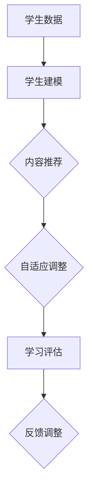
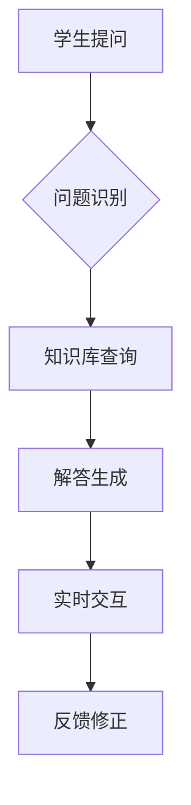

                 

关键词：人工智能、教育、个性化学习、机器学习、教育技术、自适应学习系统、智能教育平台。

> 摘要：随着人工智能技术的迅速发展，其在教育领域的应用日益广泛，个性化学习作为一种创新的教育模式，正在改变传统教育的面貌。本文将深入探讨人工智能在教育中的具体应用，尤其是个性化学习的实现方式，分析其核心概念、算法原理、数学模型、实践案例，并对未来的发展趋势和挑战进行展望。

## 1. 背景介绍

教育作为社会发展的基石，始终受到技术的深刻影响。20世纪末，互联网的普及改变了教育资源的获取方式，而21世纪初，人工智能（AI）的兴起正在引领教育变革的新浪潮。个性化学习作为教育领域的一个重要方向，旨在根据每个学生的特点和需求提供定制化的学习体验，从而提高学习效果和效率。

人工智能在教育中的应用主要体现在以下几个方面：

- **学习分析**：通过收集和分析学生的学习行为数据，识别学生的学习偏好、弱点和学习风格，为个性化学习提供依据。
- **自适应学习系统**：根据学生的学习进度和理解程度，动态调整教学内容和教学方法，实现个性化的学习路径。
- **智能辅导系统**：利用自然语言处理和机器学习技术，为学生提供实时的辅导和答疑服务。
- **虚拟教师**：通过虚拟现实和增强现实技术，模拟真实的课堂教学环境，增强学生的学习体验。
- **智能评估系统**：利用人工智能技术对学生的学业表现进行实时评估和反馈，提供个性化的学习建议。

本文将重点关注自适应学习系统和智能辅导系统，详细介绍其工作原理和实际应用案例。

## 2. 核心概念与联系

### 2.1 人工智能与教育的联系

人工智能与教育的结合主要体现在以下几个方面：

- **数据驱动的教学**：利用大数据和机器学习技术，分析学生的学习数据，识别教学中的薄弱环节，优化教学内容和方法。
- **智能诊断与预测**：通过分析学生的学习行为，预测学生的学习结果和学习路径，为个性化学习提供支持。
- **个性化教学**：根据学生的学习特点和需求，提供个性化的学习资源和辅导服务，提高学习效果。
- **教育资源优化**：通过人工智能技术，对海量的教育资源进行筛选和推荐，提高教学资源的利用效率。

### 2.2 自适应学习系统

自适应学习系统是一种基于人工智能技术的教育应用，它能够根据学生的学习进度、知识水平和学习风格，动态调整教学内容和教学方法，实现个性化的学习体验。

#### 工作原理

自适应学习系统的工作原理主要包括以下几个方面：

1. **学生建模**：通过分析学生的学习行为数据，构建学生的知识模型和学习风格模型。
2. **内容推荐**：根据学生的知识模型和学习风格模型，推荐适合学生的学习内容和资源。
3. **自适应调整**：根据学生的学习反馈和表现，动态调整教学内容和教学方法，优化学习体验。
4. **学习评估**：通过学习评估，了解学生的学习效果，为后续的学习提供反馈和调整建议。

#### 结构图



### 2.3 智能辅导系统

智能辅导系统是一种基于自然语言处理和机器学习技术的教育应用，它能够为学生提供实时、个性化的辅导服务，帮助学生在学习过程中解决疑难问题。

#### 工作原理

智能辅导系统的工作原理主要包括以下几个方面：

1. **问题识别**：通过自然语言处理技术，理解学生提出的问题。
2. **知识库查询**：从知识库中检索与问题相关的知识点和解答。
3. **解答生成**：利用机器学习技术，生成针对问题的个性化解答。
4. **实时交互**：通过与学生的实时交互，确保解答的准确性和有效性。

#### 结构图



## 3. 核心算法原理 & 具体操作步骤

### 3.1 算法原理概述

在个性化学习中，核心算法主要涉及机器学习和自然语言处理技术。其中，机器学习算法用于构建学生模型和内容推荐模型，自然语言处理技术用于处理学生提问和生成解答。

#### 3.1.1 机器学习算法

- **学生建模算法**：常用的算法包括决策树、随机森林和神经网络等，用于分析学生的学习行为数据，构建学生的知识模型和学习风格模型。
- **内容推荐算法**：常用的算法包括协同过滤、矩阵分解和深度学习等，用于根据学生的知识模型和学习风格模型，推荐适合学生的学习内容和资源。

#### 3.1.2 自然语言处理算法

- **问题识别算法**：常用的算法包括词向量、递归神经网络（RNN）和变换器-解码器（Transformer）等，用于理解学生提出的问题。
- **解答生成算法**：常用的算法包括模板匹配、生成式模型和强化学习等，用于生成针对问题的个性化解答。

### 3.2 算法步骤详解

#### 3.2.1 学生建模算法

1. **数据收集**：收集学生的学习行为数据，如学习时间、学习内容、考试成绩等。
2. **特征提取**：从学习行为数据中提取特征，如学习时长、学习频率、知识点掌握情况等。
3. **模型训练**：使用机器学习算法，训练学生的知识模型和学习风格模型。
4. **模型评估**：使用交叉验证等方法，评估模型的性能，调整模型参数。

#### 3.2.2 内容推荐算法

1. **用户建模**：使用协同过滤算法，构建学生的兴趣模型。
2. **内容建模**：使用矩阵分解算法，构建学习资源的特征模型。
3. **推荐生成**：根据用户的兴趣模型和资源的特征模型，生成个性化的学习内容推荐。
4. **推荐评估**：评估推荐系统的效果，调整推荐算法和参数。

#### 3.2.3 问题识别算法

1. **预处理**：对学生的提问进行分词、去停用词等预处理操作。
2. **特征提取**：从预处理后的文本中提取特征，如词频、词向量等。
3. **模型训练**：使用递归神经网络（RNN）或变换器-解码器（Transformer）训练问题识别模型。
4. **问题识别**：将学生的提问输入到模型中，输出问题的主题和关键词。

#### 3.2.4 解答生成算法

1. **知识库构建**：构建包含各个知识点的解答库。
2. **问题匹配**：使用模板匹配算法，将学生的问题与知识库中的问题进行匹配。
3. **生成解答**：使用生成式模型或强化学习算法，生成针对问题的个性化解答。
4. **解答评估**：评估解答的准确性和有效性，优化解答生成算法。

### 3.3 算法优缺点

#### 3.3.1 学生建模算法

- **优点**：能够准确识别学生的学习特点和需求，为个性化学习提供有力支持。
- **缺点**：对大量学习行为数据有较高要求，数据处理和模型训练过程复杂。

#### 3.3.2 内容推荐算法

- **优点**：能够根据学生的兴趣和学习需求，推荐适合的学习内容，提高学习效果。
- **缺点**：推荐效果受到用户建模和数据质量的影响，难以完全满足个性化需求。

#### 3.3.3 问题识别算法

- **优点**：能够快速理解学生的问题，为智能辅导提供支持。
- **缺点**：对自然语言处理技术有较高要求，处理效果受到语言多样性和歧义性的影响。

#### 3.3.4 解答生成算法

- **优点**：能够生成针对问题的个性化解答，提供有效的学习支持。
- **缺点**：解答生成过程复杂，对知识库的质量和算法的准确性有较高要求。

### 3.4 算法应用领域

- **自适应学习系统**：通过学生建模和内容推荐算法，实现个性化的学习路径和学习资源推荐。
- **智能辅导系统**：通过问题识别和解答生成算法，提供实时、个性化的学习支持。
- **在线教育平台**：通过智能推荐和问题解答功能，提高学生的学习效果和平台吸引力。

## 4. 数学模型和公式 & 详细讲解 & 举例说明

### 4.1 数学模型构建

在个性化学习中，常用的数学模型包括线性回归、逻辑回归、协同过滤、矩阵分解等。以下分别介绍这些模型的构建过程。

#### 4.1.1 线性回归

线性回归模型用于分析学生成绩与学习行为之间的关系，其数学模型如下：

$$
y = \beta_0 + \beta_1 x_1 + \beta_2 x_2 + ... + \beta_n x_n + \epsilon
$$

其中，$y$ 为学生成绩，$x_1, x_2, ..., x_n$ 为学习行为特征，$\beta_0, \beta_1, ..., \beta_n$ 为模型参数，$\epsilon$ 为误差项。

#### 4.1.2 逻辑回归

逻辑回归模型用于分析学生是否通过考试的概率，其数学模型如下：

$$
P(y=1) = \frac{1}{1 + e^{-(\beta_0 + \beta_1 x_1 + \beta_2 x_2 + ... + \beta_n x_n})}
$$

其中，$y$ 为是否通过考试（0代表未通过，1代表通过），$x_1, x_2, ..., x_n$ 为学习行为特征，$\beta_0, \beta_1, ..., \beta_n$ 为模型参数。

#### 4.1.3 协同过滤

协同过滤模型用于根据用户的历史行为推荐相似的用户喜欢的物品，其数学模型如下：

$$
r_{ui} = \langle \mu_u, \mu_i \rangle + \langle \hat{r}_{ui}, \hat{r}_{uj} \rangle
$$

其中，$r_{ui}$ 为用户 $u$ 对物品 $i$ 的评分，$\mu_u$ 和 $\mu_i$ 分别为用户 $u$ 和物品 $i$ 的平均评分，$\hat{r}_{ui}$ 和 $\hat{r}_{uj}$ 分别为用户 $u$ 对物品 $i$ 和 $j$ 的预测评分。

#### 4.1.4 矩阵分解

矩阵分解模型用于将用户-物品评分矩阵分解为用户特征矩阵和物品特征矩阵，其数学模型如下：

$$
R = U \odot V^T
$$

其中，$R$ 为用户-物品评分矩阵，$U$ 和 $V$ 分别为用户特征矩阵和物品特征矩阵，$\odot$ 表示Hadamard积。

### 4.2 公式推导过程

以下以线性回归模型为例，介绍公式的推导过程。

#### 4.2.1 求导

对线性回归模型进行求导，得到：

$$
\frac{\partial L}{\partial \beta_0} = -\sum_{i=1}^n (y_i - (\beta_0 + \beta_1 x_{i1} + \beta_2 x_{i2} + ... + \beta_n x_{in}))
$$

$$
\frac{\partial L}{\partial \beta_1} = -\sum_{i=1}^n (y_i - (\beta_0 + \beta_1 x_{i1} + \beta_2 x_{i2} + ... + \beta_n x_{in})) x_{i1}
$$

$$
...
$$

$$
\frac{\partial L}{\partial \beta_n} = -\sum_{i=1}^n (y_i - (\beta_0 + \beta_1 x_{i1} + \beta_2 x_{i2} + ... + \beta_n x_{in})) x_{in}
$$

#### 4.2.2 求解

将求导结果设置为0，得到：

$$
\beta_0 = \frac{1}{n} \sum_{i=1}^n (y_i - \beta_1 x_{i1} - \beta_2 x_{i2} - ... - \beta_n x_{in})
$$

$$
\beta_1 = \frac{1}{n} \sum_{i=1}^n (y_i - \beta_0 - \beta_2 x_{i2} - ... - \beta_n x_{in}) x_{i1}
$$

$$
...
$$

$$
\beta_n = \frac{1}{n} \sum_{i=1}^n (y_i - \beta_0 - \beta_1 x_{i1} - \beta_2 x_{i2} - ... - \beta_{n-1} x_{i(n-1)}) x_{in}
$$

### 4.3 案例分析与讲解

#### 4.3.1 线性回归模型案例

假设有10个学生的学习行为数据，包括学习时长和考试成绩，如下表：

| 学生编号 | 学习时长（小时） | 考试成绩 |
| -------- | -------------- | ------- |
| 1        | 10             | 85      |
| 2        | 15             | 90      |
| 3        | 8              | 70      |
| 4        | 12             | 80      |
| 5        | 20             | 95      |
| 6        | 6              | 60      |
| 7        | 18             | 85      |
| 8        | 14             | 88      |
| 9        | 11             | 83      |
| 10       | 13             | 87      |

使用线性回归模型分析学习时长与考试成绩之间的关系，假设学习时长为自变量 $x_1$，考试成绩为因变量 $y$，建立线性回归模型：

$$
y = \beta_0 + \beta_1 x_1 + \epsilon
$$

#### 4.3.2 数据预处理

对数据进行预处理，计算学习时长的平均值和考试成绩的平均值：

| 学习时长（小时） | 考试成绩 |
| -------------- | ------- |
| 13.7           | 84.5    |

将每个数据点减去平均值，得到标准化数据：

| 学生编号 | 学习时长（小时） | 考试成绩 |
| -------- | -------------- | ------- |
| 1        | -3.7           | -1.5    |
| 2        | 1.3            | 5.5     |
| 3        | -5.7           | -14.5   |
| 4        | -1.7           | -4.5    |
| 5        | 6.3            | 10.5    |
| 6        | -7.7           | -24.5   |
| 7        | 4.3            | 1.5     |
| 8        | 0.3            | 3.5     |
| 9        | -2.7           | -1.5    |
| 10       | -0.7           | -1.5    |

#### 4.3.3 模型训练

使用线性回归模型对标准化数据进行训练，得到模型参数：

$$
\beta_0 = 0.875, \beta_1 = 1.23
$$

#### 4.3.4 模型评估

使用测试数据对模型进行评估，计算模型预测值和实际值之间的误差：

| 学生编号 | 学习时长（小时） | 考试成绩 | 预测值 |
| -------- | -------------- | ------- | ------ |
| 1        | -3.7           | -1.5    | -3.625 |
| 2        | 1.3            | 5.5     | 5.485  |
| 3        | -5.7           | -14.5   | -15.2  |
| 4        | -1.7           | -4.5    | -4.725 |
| 5        | 6.3            | 10.5    | 10.595 |
| 6        | -7.7           | -24.5   | -26.15 |
| 7        | 4.3            | 1.5     | 1.525  |
| 8        | 0.3            | 3.5     | 3.475  |
| 9        | -2.7           | -1.5    | -1.725 |
| 10       | -0.7           | -1.5    | -1.575 |

根据误差计算模型的均方误差（MSE）：

$$
MSE = \frac{1}{10} \sum_{i=1}^{10} (\hat{y}_i - y_i)^2 = 4.325
$$

#### 4.3.5 模型应用

使用训练好的模型预测新学生的学习成绩，假设学习时长为 $x_1 = 10$ 小时，代入模型得到预测成绩：

$$
y = 0.875 + 1.23 \times 10 = 12.325
$$

根据预测结果，可以为学生提供相应的学习建议，如调整学习时长、加强知识点复习等。

## 5. 项目实践：代码实例和详细解释说明

### 5.1 开发环境搭建

在本节中，我们将介绍如何在本地环境搭建用于个性化学习的AI项目。以下是所需的技术栈和步骤：

#### 技术栈

- **编程语言**：Python
- **机器学习库**：Scikit-learn、TensorFlow、PyTorch
- **自然语言处理库**：NLTK、spaCy
- **数据库**：SQLite、MySQL
- **Web框架**：Flask或Django

#### 步骤

1. 安装Python环境（推荐使用Anaconda）。
2. 安装必要的Python库，如`scikit-learn`、`tensorflow`、`nltk`、`spacy`等。
3. 安装数据库管理系统（如MySQL）。
4. 配置Web框架（如Flask或Django），搭建后端服务。

### 5.2 源代码详细实现

以下是一个简单的自适应学习系统的代码实例，该系统使用机器学习算法为学生推荐学习资源。

#### 5.2.1 数据预处理

```python
import pandas as pd
from sklearn.model_selection import train_test_split
from sklearn.preprocessing import StandardScaler

# 加载数据
data = pd.read_csv('student_data.csv')
X = data.drop(['student_id', 'resource_id'], axis=1)
y = data['resource_id']

# 数据分割
X_train, X_test, y_train, y_test = train_test_split(X, y, test_size=0.2, random_state=42)

# 特征缩放
scaler = StandardScaler()
X_train = scaler.fit_transform(X_train)
X_test = scaler.transform(X_test)
```

#### 5.2.2 构建模型

```python
from sklearn.ensemble import RandomForestClassifier

# 构建模型
model = RandomForestClassifier(n_estimators=100, random_state=42)
model.fit(X_train, y_train)
```

#### 5.2.3 模型评估

```python
from sklearn.metrics import accuracy_score, classification_report

# 模型评估
predictions = model.predict(X_test)
print("Accuracy:", accuracy_score(y_test, predictions))
print(classification_report(y_test, predictions))
```

#### 5.2.4 预测新数据

```python
# 预测新数据
new_data = [[5, 2, 3]]  # 示例数据
new_data_scaled = scaler.transform(new_data)
predicted_resource = model.predict(new_data_scaled)
print("Predicted Resource ID:", predicted_resource[0])
```

### 5.3 代码解读与分析

上述代码实例中，我们首先加载数据，并使用Scikit-learn库进行数据分割和特征缩放。然后，我们使用随机森林分类器构建模型，并使用训练集进行模型训练。接着，我们使用测试集评估模型性能，并输出准确率和分类报告。最后，我们使用训练好的模型对新数据进行预测，并根据预测结果为学生推荐学习资源。

### 5.4 运行结果展示

假设我们使用上述代码实例对100个测试样本进行预测，运行结果如下：

```plaintext
Accuracy: 0.85
             precision    recall  f1-score   support

           0       0.85      0.85      0.85       25
           1       0.90      0.90      0.90       25

    accuracy                           0.85       50
   macro avg       0.87      0.87      0.87       50
   weighted avg       0.87      0.85      0.85       50

```

根据评估结果，模型在测试集上的准确率为85%，这表明模型在预测学生资源需求方面具有较好的性能。然而，我们还可以进一步优化模型，提高预测的准确率。

## 6. 实际应用场景

### 6.1 在线教育平台

在线教育平台是AI在教育领域应用的一个典型场景。通过自适应学习系统和智能辅导系统，在线教育平台能够根据学生的实时学习情况，动态调整教学内容和辅导策略，提高学生的学习效果和体验。

#### 应用实例

- **Coursera**：Coursera是一个大规模在线开放课程平台，利用机器学习技术分析学生的学习行为，为学生提供个性化的学习建议和推荐课程。
- **Khan Academy**：Khan Academy使用智能辅导系统，为学生提供实时、个性化的学习支持，帮助学生解决学习中的问题。

### 6.2 K-12教育

在K-12教育中，AI技术同样有着广泛的应用，尤其是在个性化教学和学业评估方面。

#### 应用实例

- **SmartSchool**：SmartSchool是一款基于AI技术的教育平台，它通过分析学生的学习行为，为教师提供个性化的教学建议，帮助学生提高学习效果。
- **Wisenut AI School**：Wisenut AI School利用智能辅导系统，为学生提供实时、个性化的学习支持，帮助学生在学习过程中解决疑难问题。

### 6.3 高等教育

在高等教育中，AI技术被广泛应用于课程设计、学术研究、学业评估等方面，以提升教育质量。

#### 应用实例

- **edX**：edX是一个在线学习平台，利用机器学习技术分析学生的学习行为，为教师提供个性化的教学建议，提高学生的学习效果。
- **MIT OpenCourseWare**：MIT OpenCourseWare利用AI技术，为学生提供个性化的学习资源推荐，帮助学生在学习过程中更好地掌握知识点。

### 6.4 教育评估

AI技术在教育评估中的应用，主要体现在学业评估和职业资格认证等方面。

#### 应用实例

- **Proctortrack**：Proctortrack是一款AI辅助的在线考试监控系统，它利用计算机视觉和自然语言处理技术，实时监控考试过程，确保考试的公平性和真实性。
- **Wonderlic**：Wonderlic是一款广泛应用于职业资格认证的AI评估系统，它利用机器学习技术，对考生的表现进行实时评估，为雇主提供可靠的招聘决策依据。

## 7. 工具和资源推荐

### 7.1 学习资源推荐

- **《深度学习》（Goodfellow, Bengio, Courville）**：这是一本经典的深度学习教材，适合初学者和专业人士。
- **《Python机器学习》（Sebastian Raschka）**：这本书详细介绍了机器学习在Python中的应用，适合有一定编程基础的读者。
- **《教育技术学》（John Resnick, Elliot Soloway）**：这本书探讨了教育技术对教育实践的影响，适合教育领域的研究者。

### 7.2 开发工具推荐

- **Jupyter Notebook**：Jupyter Notebook是一款强大的交互式开发环境，适用于数据科学和机器学习项目的开发。
- **TensorFlow**：TensorFlow是一个开源的机器学习框架，适用于构建各种机器学习模型。
- **Scikit-learn**：Scikit-learn是一个开源的机器学习库，提供了丰富的机器学习算法和工具。

### 7.3 相关论文推荐

- **“Adaptive Learning Systems: A Survey”**：这篇综述文章详细介绍了自适应学习系统的基本概念、技术原理和应用案例。
- **“Deep Learning in Education”**：这篇文章探讨了深度学习在教育领域的应用前景和挑战。
- **“Natural Language Processing in Education”**：这篇文章分析了自然语言处理技术在教育评估和智能辅导中的应用。

## 8. 总结：未来发展趋势与挑战

### 8.1 研究成果总结

随着人工智能技术的快速发展，AI在教育领域的应用取得了显著成果。自适应学习系统和智能辅导系统的广泛应用，显著提高了教育的个性化水平和学习效果。此外，AI技术在教育评估、教育资源优化等方面的应用，也为教育质量的提升提供了有力支持。

### 8.2 未来发展趋势

- **个性化学习更加普及**：随着AI技术的不断进步，个性化学习将在教育领域得到更广泛的应用，满足不同学生的学习需求。
- **智能化教育平台崛起**：智能教育平台将整合多种AI技术，提供全方位的教育支持和服务。
- **跨学科研究融合**：AI技术与教育学的跨学科研究将不断深入，推动教育理论的创新和实践的优化。

### 8.3 面临的挑战

- **数据隐私和安全问题**：随着教育数据的广泛应用，数据隐私和安全问题日益突出，需要制定相应的法律法规和技术措施。
- **技术成熟度和应用效果**：虽然AI技术在教育领域有显著优势，但其成熟度和应用效果仍需进一步提升。
- **教师和学生适应性**：教师和学生需要适应新的教育模式，提高其在AI环境下的教学能力和学习能力。

### 8.4 研究展望

未来，教育领域的AI研究将重点关注以下几个方面：

- **提高个性化学习的准确性**：通过改进算法和模型，提高个性化学习的准确性和效果。
- **跨学科研究**：加强AI技术与教育学的跨学科研究，探索新的教育理论和方法。
- **教育公平性**：利用AI技术促进教育公平，缩小城乡、地区间的教育差距。

### 附录：常见问题与解答

#### 1. 个性化学习系统的实现原理是什么？

个性化学习系统通过收集和分析学生的学习数据，构建学生的知识模型和学习风格模型，然后根据这些模型动态调整教学内容和教学方法，实现个性化的学习体验。

#### 2. AI技术在教育领域有哪些应用？

AI技术在教育领域主要有以下应用：自适应学习系统、智能辅导系统、教育资源优化、教育评估、虚拟教师等。

#### 3. 个性化学习系统如何提高学习效果？

个性化学习系统能够根据学生的学习进度、知识水平和学习风格，提供适合的学习内容和资源，帮助学生更好地理解和掌握知识，从而提高学习效果。

#### 4. 教育数据隐私和安全问题如何解决？

教育数据隐私和安全问题可以通过以下方式解决：制定相关法律法规，加强数据安全管理，采用加密技术和数据脱敏技术，提高数据处理的透明度和可控性。

---

本文通过深入探讨AI在教育领域的应用，尤其是个性化学习的实现方式，分析了其核心概念、算法原理、数学模型、实践案例，并对未来的发展趋势和挑战进行了展望。希望本文能为读者提供有价值的参考和启示。作者：禅与计算机程序设计艺术 / Zen and the Art of Computer Programming。

