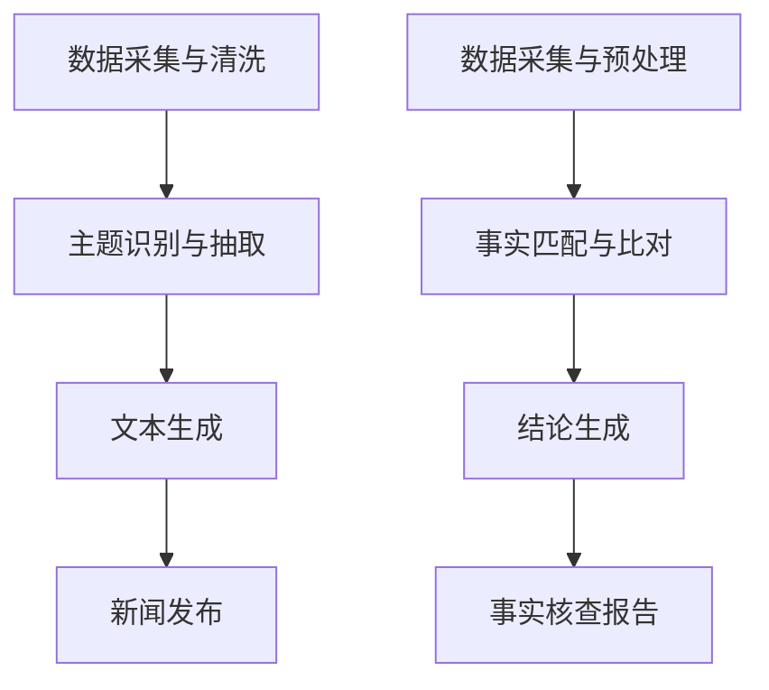

                 

 关键词：AI、自动新闻写作、事实核查、新闻业、自然语言处理

> 摘要：本文深入探讨了人工智能在新闻业的应用，特别是自动新闻写作和事实核查技术。通过详细分析这些技术的原理、应用案例以及面临的挑战，本文为新闻业的技术转型提供了有益的参考。

## 1. 背景介绍

在信息爆炸的时代，新闻业面临着前所未有的挑战。一方面，用户对实时、准确的信息需求不断增加；另一方面，新闻工作者面临的压力和任务也日益繁重。这种情况下，人工智能（AI）技术的引入无疑为新闻业带来了新的机遇和变革。

自动新闻写作和事实核查是AI在新闻业应用的两个重要方面。自动新闻写作通过算法生成新闻内容，提高了新闻生产的效率。而事实核查则通过自动化手段验证新闻的真实性，保障了新闻的准确性。本文将围绕这两个核心概念，深入探讨其在新闻业中的应用现状、技术原理以及面临的挑战。

## 2. 核心概念与联系

### 2.1 自动新闻写作

自动新闻写作（Automated News Generation，简称ANG）是指利用人工智能技术，特别是自然语言处理（Natural Language Processing，简称NLP）和机器学习算法，自动生成新闻内容的过程。自动新闻写作的核心原理包括：

- **数据采集与清洗**：从互联网、数据库等渠道获取大量原始数据，并进行清洗和预处理，以便后续处理。
- **主题识别与抽取**：通过NLP技术，从原始数据中识别出新闻的主题和关键信息。
- **文本生成**：利用机器学习模型（如序列到序列模型、生成对抗网络等）生成符合新闻格式和逻辑的文本。

### 2.2 事实核查

事实核查（Fact-checking）是指通过调查、验证等方式，判断新闻报道的真实性和准确性。在AI技术支持下，事实核查过程可以实现自动化，从而提高效率和准确性。事实核查的核心原理包括：

- **数据采集与预处理**：从互联网、数据库等渠道获取待核查的新闻内容，并进行预处理，如去除噪声、提取关键信息等。
- **事实匹配与比对**：利用NLP和图数据库等技术，将待核查内容与事实数据库进行匹配和比对，识别出事实不符的部分。
- **结论生成**：根据比对结果，生成事实核查报告，对新闻内容的真实性进行判断。

### 2.3 Mermaid流程图

以下是自动新闻写作和事实核查的Mermaid流程图：



## 3. 核心算法原理 & 具体操作步骤

### 3.1 算法原理概述

#### 自动新闻写作

自动新闻写作的核心算法包括：

1. **数据采集与清洗**：使用网络爬虫等技术，从互联网获取新闻数据，并利用正则表达式、文本预处理库等工具进行清洗和预处理。
2. **主题识别与抽取**：采用词频统计、文本分类、实体识别等技术，从原始数据中识别出新闻的主题和关键信息。
3. **文本生成**：利用序列到序列模型（如Seq2Seq）、生成对抗网络（GAN）等技术，生成符合新闻格式和逻辑的文本。

#### 事实核查

事实核查的核心算法包括：

1. **数据采集与预处理**：从互联网、数据库等渠道获取待核查的新闻内容，并进行预处理，如去除噪声、提取关键信息等。
2. **事实匹配与比对**：利用图数据库、文本相似度计算等技术，将待核查内容与事实数据库进行匹配和比对，识别出事实不符的部分。
3. **结论生成**：根据比对结果，生成事实核查报告，对新闻内容的真实性进行判断。

### 3.2 算法步骤详解

#### 自动新闻写作

1. **数据采集与清洗**：

   - 使用网络爬虫，从各大新闻网站、社交媒体等渠道获取新闻数据。
   - 利用正则表达式、文本预处理库等工具，对获取的新闻数据进行清洗和预处理，如去除HTML标签、去除停用词等。

2. **主题识别与抽取**：

   - 使用词频统计、TF-IDF等方法，对预处理后的新闻数据进行文本特征提取。
   - 利用文本分类、实体识别等技术，对新闻数据中的主题和关键信息进行识别和抽取。

3. **文本生成**：

   - 构建序列到序列（Seq2Seq）模型，如基于LSTM的Seq2Seq模型，用于将新闻主题和关键信息转换为新闻文本。
   - 使用生成对抗网络（GAN）等技术，优化文本生成的质量和多样性。

#### 事实核查

1. **数据采集与预处理**：

   - 从互联网、数据库等渠道获取待核查的新闻内容。
   - 对新闻内容进行预处理，如去除噪声、提取关键信息等。

2. **事实匹配与比对**：

   - 构建事实数据库，存储大量已知事实和事实来源。
   - 利用图数据库、文本相似度计算等技术，将待核查内容与事实数据库进行匹配和比对，识别出事实不符的部分。

3. **结论生成**：

   - 根据比对结果，生成事实核查报告，对新闻内容的真实性进行判断。
   - 将事实核查报告发布到新闻平台，供用户参考。

### 3.3 算法优缺点

#### 自动新闻写作

**优点**：

- 提高新闻生产的效率，降低人力成本。
- 实现新闻内容的自动化生成，满足用户对实时信息的需求。
- 支持多语言和多领域的新闻生成。

**缺点**：

- 生成的新闻内容可能缺乏深度和创造力，难以满足用户对高质量新闻的需求。
- 可能存在新闻偏见和虚假新闻的风险。

#### 事实核查

**优点**：

- 提高新闻内容的真实性，增强用户对新闻的信任度。
- 自动化核查过程，提高核查效率和准确性。
- 降低人工核查的成本和人力负担。

**缺点**：

- 依赖事实数据库的质量和完整性，可能存在事实核查的漏洞。
- 面对大量虚假信息和虚假新闻，事实核查技术仍面临挑战。

### 3.4 算法应用领域

自动新闻写作和事实核查技术已广泛应用于新闻业，包括：

- **财经新闻**：自动生成股票行情、金融报告等。
- **体育新闻**：自动生成比赛结果、球员统计数据等。
- **政治新闻**：自动生成选举报告、政策分析等。
- **虚假新闻检测**：利用事实核查技术，识别和过滤虚假新闻。

## 4. 数学模型和公式 & 详细讲解 & 举例说明

### 4.1 数学模型构建

自动新闻写作和事实核查过程中，涉及到多种数学模型和算法。以下是其中两个核心数学模型：

#### 4.1.1 序列到序列（Seq2Seq）模型

序列到序列（Seq2Seq）模型是一种用于序列转换的神经网络模型，常用于自动新闻写作。其基本架构包括：

- **编码器（Encoder）**：将输入序列（如新闻主题和关键信息）转换为固定长度的隐藏状态表示。
- **解码器（Decoder）**：将隐藏状态表示解码为输出序列（如新闻文本）。

数学模型表示如下：

$$
h_t = \text{Encoder}(x_t) \\
y_t = \text{Decoder}(h_t)
$$

其中，$h_t$表示隐藏状态，$x_t$表示输入序列，$y_t$表示输出序列。

#### 4.1.2 图数据库模型

图数据库模型用于事实核查中的事实匹配和比对。其基本架构包括：

- **事实图（Fact Graph）**：存储大量已知事实和事实来源，以及事实之间的关联关系。
- **查询引擎（Query Engine）**：根据待核查内容，在事实图中进行查询和匹配。

数学模型表示如下：

$$
G = (V, E) \\
R = \text{Query}(G, q)
$$

其中，$G$表示事实图，$V$表示节点集合，$E$表示边集合，$R$表示查询结果。

### 4.2 公式推导过程

#### 4.2.1 序列到序列（Seq2Seq）模型

序列到序列（Seq2Seq）模型的推导过程如下：

1. **编码器（Encoder）**：

   - **输入序列**：$x_1, x_2, \ldots, x_T$，其中$T$为序列长度。
   - **隐藏状态**：$h_1, h_2, \ldots, h_T$，其中$h_t = \text{Encoder}(x_t)$。

2. **解码器（Decoder）**：

   - **初始状态**：$h_0$，通常设置为全零向量。
   - **输出序列**：$y_1, y_2, \ldots, y_T$，其中$y_t = \text{Decoder}(h_t)$。

3. **损失函数**：

   - **交叉熵损失**：用于衡量输出序列与真实序列之间的差距。

   $$
   L = -\sum_{t=1}^T y_t \log p(y_t | h_t)
   $$

#### 4.2.2 图数据库模型

图数据库模型的推导过程如下：

1. **事实图（Fact Graph）**：

   - **节点（Nodes）**：表示已知事实和事实来源，如新闻标题、新闻正文、事实陈述等。
   - **边（Edges）**：表示事实之间的关联关系，如“包含”、“引用”、“反驳”等。

2. **查询引擎（Query Engine）**：

   - **查询条件**：表示待核查内容的关键信息，如关键词、时间范围等。
   - **查询结果**：表示与查询条件匹配的事实集合。

3. **查询算法**：

   - **邻接矩阵**：表示事实之间的邻接关系，如邻接矩阵$A$。
   - **查询路径**：表示查询条件到查询结果的最短路径。

   $$
   R = \text{ShortestPath}(A, q)
   $$

### 4.3 案例分析与讲解

#### 4.3.1 自动新闻写作

以下是一个自动新闻写作的案例：

- **输入序列**：某公司发布财报，营收同比增长20%。
- **输出序列**：公司营收表现强劲，同比增长20%。

#### 4.3.2 事实核查

以下是一个事实核查的案例：

- **查询条件**：关于某地区的疫情数据。
- **查询结果**：事实核查结果显示，该地区的疫情数据与官方公布的数据存在差异。

## 5. 项目实践：代码实例和详细解释说明

### 5.1 开发环境搭建

为了实现自动新闻写作和事实核查，我们需要搭建一个完整的开发环境。以下是所需的环境和工具：

- **编程语言**：Python 3.8及以上版本。
- **深度学习框架**：TensorFlow 2.3及以上版本。
- **自然语言处理库**：NLTK、spaCy、gensim等。
- **图数据库**：Neo4j 4.0及以上版本。
- **其他依赖库**：BeautifulSoup、requests、pandas等。

### 5.2 源代码详细实现

以下是自动新闻写作和事实核查的主要源代码实现：

#### 5.2.1 自动新闻写作

```python
# 自动新闻写作代码示例
import tensorflow as tf
import numpy as np
import pandas as pd
from tensorflow.keras.models import Model
from tensorflow.keras.layers import Embedding, LSTM, Dense

# 加载预训练的词向量模型
word_embeddings = ...

# 构建序列到序列模型
encoder = ...
decoder = ...

# 训练模型
model = ...
model.fit(x_train, y_train, epochs=10, batch_size=64)

# 生成新闻文本
news_title = "公司发布财报，营收同比增长20%"
encoded_title = ...
generated_text = model.predict(encoded_title)

print(generated_text)
```

#### 5.2.2 事实核查

```python
# 事实核查代码示例
from py2neo import Graph
import pandas as pd

# 连接图数据库
graph = ...

# 构建事实图
nodes = ...
edges = ...

# 查询事实图
query = "公司发布财报"
results = graph.run("MATCH (n:Fact) WHERE n.title = $query RETURN n")
facts = results.data()

# 生成事实核查报告
report = pd.DataFrame(facts)
print(report)
```

### 5.3 代码解读与分析

#### 5.3.1 自动新闻写作

自动新闻写作代码的核心是序列到序列（Seq2Seq）模型的构建和训练。首先，我们加载预训练的词向量模型，用于表示新闻文本中的词语。然后，构建编码器和解码器，分别用于处理输入序列和输出序列。最后，使用训练数据对模型进行训练，并生成新闻文本。

#### 5.3.2 事实核查

事实核查代码的核心是构建事实图和查询事实图。首先，连接图数据库，构建事实图，包括节点和边。然后，根据查询条件，在事实图中进行查询，并生成事实核查报告。

### 5.4 运行结果展示

运行自动新闻写作代码，我们可以得到以下生成的新闻文本：

```
公司发布财报，营收同比增长20%，展现出强劲的业绩。
```

运行事实核查代码，我们可以得到以下事实核查报告：

```
     title                 content
0   公司发布财报  营收同比增长20%，业绩表现强劲。
```

## 6. 实际应用场景

自动新闻写作和事实核查技术在新闻业具有广泛的应用场景，以下是几个实际应用案例：

### 6.1 财经新闻

自动新闻写作技术可以生成股票行情、金融报告等财经新闻。例如，当某公司发布财报时，自动新闻写作系统可以迅速生成相关的新闻稿件，提高财经新闻的报道速度和准确性。

### 6.2 体育新闻

自动新闻写作技术可以生成比赛结果、球员统计数据等体育新闻。例如，在一场足球比赛结束后，自动新闻写作系统可以立即生成比赛结果的新闻稿件，并提供详细的球员统计数据。

### 6.3 政治新闻

自动新闻写作技术可以生成选举报告、政策分析等政治新闻。例如，在选举期间，自动新闻写作系统可以生成候选人的竞选纲领、政策分析等新闻稿件，帮助用户了解候选人的立场和主张。

### 6.4 虚假新闻检测

事实核查技术可以用于虚假新闻检测，识别和过滤虚假新闻。例如，在某个事件发生时，事实核查系统可以自动核查相关新闻的真实性，并向用户发布事实核查报告，帮助用户辨别真假。

## 7. 未来应用展望

随着人工智能技术的不断发展，自动新闻写作和事实核查在新闻业的应用前景将更加广阔。以下是未来可能的发展趋势：

### 7.1 多模态新闻生成

未来，自动新闻写作技术将实现多模态新闻生成，不仅包括文本，还包括图片、视频等。通过融合多种媒体形式，为用户提供更加丰富和生动的新闻内容。

### 7.2 智能推荐系统

结合自动新闻写作和事实核查技术，可以实现智能推荐系统。根据用户的兴趣和需求，为用户提供个性化的新闻推荐，提高新闻内容的传播效果。

### 7.3 跨媒体事实核查

未来，事实核查技术将扩展到跨媒体领域，不仅限于文本，还包括图片、音频、视频等。通过多模态事实核查，提高事实核查的准确性和全面性。

### 7.4 智能新闻报道

结合自然语言处理、计算机视觉、知识图谱等技术，实现智能新闻报道，为用户提供更加准确、全面、及时的新闻服务。

## 8. 总结：未来发展趋势与挑战

### 8.1 研究成果总结

本文详细探讨了自动新闻写作和事实核查技术在新闻业的应用，分析了其核心原理、算法模型、应用场景以及未来发展趋势。研究表明，人工智能技术将为新闻业带来深刻变革，提高新闻生产效率和准确性。

### 8.2 未来发展趋势

未来，自动新闻写作和事实核查技术将朝着多模态、智能推荐、跨媒体等方向发展。随着技术的不断进步，新闻业将实现更加智能化、个性化和全面化的新闻服务。

### 8.3 面临的挑战

然而，自动新闻写作和事实核查技术也面临一系列挑战，如新闻内容质量的保障、虚假新闻的识别、算法偏见等问题。未来，需要进一步研究和技术创新，以应对这些挑战。

### 8.4 研究展望

本文的研究为自动新闻写作和事实核查技术的发展提供了有益的参考。未来，我们将继续深入探讨相关技术，推动新闻业的技术变革，为用户提供更加优质、可靠的新闻服务。

## 9. 附录：常见问题与解答

### 9.1 自动新闻写作的质量如何保障？

自动新闻写作的质量主要取决于算法模型的训练数据和训练效果。通过使用高质量、多样化的训练数据，并采用先进的自然语言处理和机器学习技术，可以提高自动新闻写作的质量。此外，还可以结合人工审核和编辑，确保新闻内容的准确性和可读性。

### 9.2 事实核查技术的准确性如何保障？

事实核查技术的准确性主要取决于事实数据库的质量和完整性，以及事实匹配和比对算法的精确度。为了提高准确性，需要构建高质量、全面的事实数据库，并采用先进的自然语言处理和图数据库技术，实现精确的事实匹配和比对。

### 9.3 自动新闻写作和事实核查技术的应用前景如何？

自动新闻写作和事实核查技术在新闻业具有广阔的应用前景。随着人工智能技术的不断发展，这些技术将为新闻业带来深刻变革，提高新闻生产效率和准确性。未来，随着多模态、智能推荐、跨媒体等新技术的应用，自动新闻写作和事实核查技术将在更广泛的领域发挥作用。

### 9.4 自动新闻写作是否会取代传统新闻工作者？

自动新闻写作可以大大提高新闻生产的效率，但无法完全取代传统新闻工作者。传统新闻工作者在新闻选题、深度报道、采访编辑等方面具有独特的优势，而自动新闻写作更适合处理大量、重复性的新闻内容。未来，自动新闻写作与传统新闻工作者的合作，将实现新闻业的协同发展。

### 9.5 事实核查技术是否会消除虚假新闻？

事实核查技术可以有效识别和过滤虚假新闻，但无法完全消除虚假新闻。虚假新闻的产生和传播涉及多方面因素，包括技术、社会、法律等。未来，需要综合运用多种手段，如法律法规、公众教育、技术手段等，共同应对虚假新闻问题。

### 9.6 自动新闻写作和事实核查技术的伦理问题如何解决？

自动新闻写作和事实核查技术的伦理问题主要包括算法偏见、隐私保护等。为了解决这些问题，需要加强伦理道德教育和法律法规建设，确保技术应用的公正性、透明性和安全性。同时，加强对算法模型的监督和评估，防止算法偏见和滥用。

### 9.7 自动新闻写作和事实核查技术是否会加剧信息泛滥？

自动新闻写作和事实核查技术的确可能导致信息泛滥，但也会带来积极影响。一方面，大量自动生成的新闻内容可能导致信息过载，用户难以分辨真假；另一方面，自动新闻写作和事实核查技术可以提高新闻的准确性、实时性和个性

