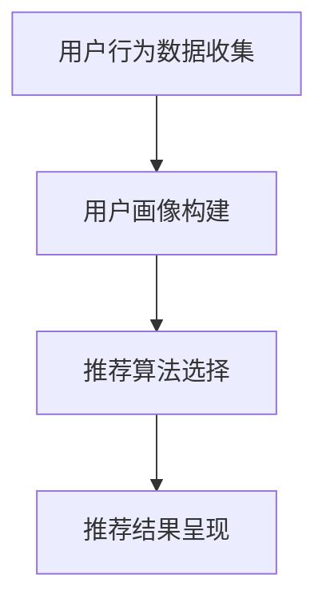
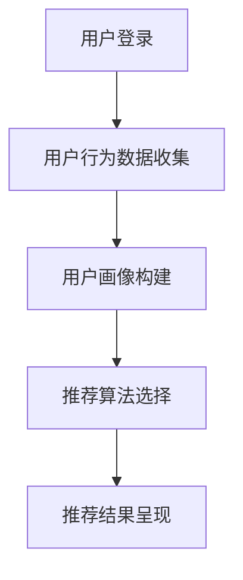

                 

关键词：AI，旅游业，个性化推荐，机器学习，数据挖掘，算法优化，用户体验

摘要：随着人工智能技术的飞速发展，其在旅游业中的应用越来越广泛，尤其是个性化推荐系统。本文将探讨AI在旅游业中如何通过个性化推荐，提升用户体验，提高旅游企业的竞争力。文章将首先介绍AI在旅游行业中的应用背景，然后详细解析个性化推荐的核心概念、算法原理，以及其在旅游行业的具体应用案例，最后展望个性化推荐技术的发展趋势和面临的挑战。

## 1. 背景介绍

旅游业作为全球经济增长的重要驱动力，正面临着巨大的变革。随着互联网的普及和智能手机的广泛使用，旅游需求逐渐从传统的观光旅游转向个性化、定制化的深度旅游。游客期望在旅游过程中能够享受到更加个性化和贴心的服务。这种需求催生了个性化推荐系统的出现，它利用人工智能技术为游客提供量身定制的旅游建议。

个性化推荐系统通过分析用户的历史行为数据，如浏览记录、搜索历史、评价等，预测用户的兴趣和偏好，进而推荐符合用户需求的旅游产品和服务。这种推荐方式不仅能够提高游客的满意度，还能为旅游企业带来更多的商业机会。

### 1.1 人工智能在旅游业中的应用

人工智能在旅游业中的应用主要表现在以下几个方面：

1. **智能客服**：利用自然语言处理和机器学习技术，为游客提供24/7在线客服服务，解决游客在旅游过程中的各种疑问。
2. **语音助手**：通过语音识别和语音合成技术，为游客提供语音导航、讲解等服务，提升游客的旅游体验。
3. **个性化推荐**：利用机器学习和数据挖掘技术，为游客提供个性化的旅游建议，满足游客的个性化需求。
4. **智能规划**：根据游客的行程、兴趣和偏好，自动规划旅游路线和活动，节省游客的时间和精力。

### 1.2 个性化推荐系统的优势

个性化推荐系统在旅游业中的应用具有以下优势：

1. **提高用户满意度**：通过个性化的推荐，满足游客的个性化需求，提高游客的满意度。
2. **提升企业竞争力**：通过精准的推荐，吸引更多游客，提高旅游企业的市场份额和竞争力。
3. **优化资源配置**：通过预测游客的兴趣和需求，合理配置旅游资源和设施，提高资源利用效率。
4. **降低营销成本**：通过精准推荐，减少无效营销，降低营销成本。

## 2. 核心概念与联系

### 2.1 核心概念

个性化推荐系统涉及多个核心概念，包括：

1. **用户**：系统的核心，具有特定的兴趣和偏好。
2. **项目**：用户可能感兴趣的对象，如景点、酒店、餐厅等。
3. **用户行为**：用户在系统中的各种操作，如浏览、搜索、购买、评价等。
4. **推荐算法**：基于用户行为和偏好，为用户推荐合适的项目。

### 2.2 联系

个性化推荐系统的核心是理解用户的行为和偏好，并将其转化为具体的推荐结果。这一过程涉及到多个环节，包括数据收集、用户画像构建、推荐算法选择、推荐结果呈现等。以下是一个简化的个性化推荐系统架构图：



### 2.3 Mermaid 流程图



## 3. 核心算法原理 & 具体操作步骤

### 3.1 算法原理概述

个性化推荐系统的核心是推荐算法，它主要分为以下两类：

1. **基于内容的推荐（Content-Based Filtering）**：根据用户的历史行为和偏好，推荐具有相似特征的项目。
2. **基于协同过滤（Collaborative Filtering）**：通过分析用户之间的相似性，推荐其他用户喜欢的项目。

### 3.2 算法步骤详解

#### 基于内容的推荐

1. **特征提取**：从项目内容中提取特征，如文本、图像、标签等。
2. **相似度计算**：计算用户和项目之间的相似度，常用的方法有TF-IDF、Cosine相似度等。
3. **推荐生成**：根据相似度分数，为用户推荐相似度最高的项目。

#### 基于协同过滤

1. **用户相似度计算**：计算用户之间的相似度，常用的方法有用户余弦相似度、皮尔逊相关系数等。
2. **项目相似度计算**：计算项目之间的相似度，常用的方法有项目余弦相似度、平均值差异等。
3. **推荐生成**：根据用户和项目的相似度分数，为用户推荐其他用户喜欢的项目。

### 3.3 算法优缺点

#### 基于内容的推荐

**优点**：

- 推荐结果准确，对用户历史行为依赖较小。
- 能发现新项目，对用户未浏览过的项目有较好的推荐效果。

**缺点**：

- 对文本和图像等特征提取要求高，计算复杂度大。
- 难以应对用户兴趣变化。

#### 基于协同过滤

**优点**：

- 推荐结果准确，能较好地发现用户兴趣。
- 对特征提取要求较低，计算复杂度相对较低。

**缺点**：

- 推荐结果可能过于集中，对新项目推荐效果较差。
- 对噪声敏感，可能受到异常用户评分的影响。

### 3.4 算法应用领域

个性化推荐算法在旅游业中具有广泛的应用，如：

1. **旅游产品推荐**：根据用户偏好推荐景点、酒店、餐饮等旅游产品。
2. **旅游路线规划**：根据用户兴趣和行程，规划个性化的旅游路线。
3. **旅游活动推荐**：根据用户兴趣和当地特色，推荐适合的旅游活动。

## 4. 数学模型和公式 & 详细讲解 & 举例说明

### 4.1 数学模型构建

个性化推荐系统的数学模型主要涉及用户兴趣表示、项目表示和推荐生成等三个方面。

#### 用户兴趣表示

假设有m个用户和n个项目，用户兴趣可以用一个m×n的用户兴趣矩阵表示：

$$
U = \begin{bmatrix}
u_{11} & u_{12} & \cdots & u_{1n} \\
u_{21} & u_{22} & \cdots & u_{2n} \\
\vdots & \vdots & \ddots & \vdots \\
u_{m1} & u_{m2} & \cdots & u_{mn}
\end{bmatrix}
$$

其中，$u_{ij}$表示用户i对项目j的兴趣程度，取值范围为[0,1]。

#### 项目表示

项目表示通常使用一个n×k的向量表示，其中k为项目特征的数量：

$$
P = \begin{bmatrix}
p_{11} & p_{12} & \cdots & p_{1k} \\
p_{21} & p_{22} & \cdots & p_{2k} \\
\vdots & \vdots & \ddots & \vdots \\
p_{n1} & p_{n2} & \cdots & p_{nk}
\end{bmatrix}
$$

其中，$p_{ij}$表示项目j在特征k上的取值。

#### 推荐生成

推荐生成的主要任务是计算用户对每个项目的兴趣度，并按兴趣度排序推荐。常用的方法有基于内容的推荐和基于协同过滤的推荐。

### 4.2 公式推导过程

#### 基于内容的推荐

基于内容的推荐方法的核心是计算用户和项目之间的相似度。假设用户兴趣矩阵和项目表示矩阵分别为$U$和$P$，用户i对项目j的兴趣度可以用以下公式计算：

$$
r_{ij} = \frac{\sum_{k=1}^{k} u_{ik} p_{kj}}{\sqrt{\sum_{k=1}^{k} u_{ik}^2 \sum_{k=1}^{k} p_{kj}^2}}
$$

其中，$r_{ij}$表示用户i对项目j的兴趣度。

#### 基于协同过滤的推荐

基于协同过滤的推荐方法主要包括以下步骤：

1. **用户相似度计算**：计算用户之间的相似度，常用的方法有用户余弦相似度：

$$
sim(u_i, u_j) = \frac{U_i \cdot U_j}{\|U_i\| \|U_j\|}
$$

其中，$\cdot$表示向量点积，$\|\|$表示向量的模。

2. **项目相似度计算**：计算项目之间的相似度，常用的方法有项目余弦相似度：

$$
sim(p_i, p_j) = \frac{P_i \cdot P_j}{\|P_i\| \|P_j\|}
$$

3. **推荐生成**：根据用户相似度和项目相似度，计算用户对每个项目的兴趣度：

$$
r_{ij} = \sum_{k=1}^{k} sim(u_i, u_j) sim(p_i, p_j) p_{kj}
$$

### 4.3 案例分析与讲解

假设有5个用户和10个项目，用户兴趣矩阵和项目表示矩阵如下：

$$
U = \begin{bmatrix}
0.3 & 0.4 & 0.5 & 0 & 0 \\
0.4 & 0.3 & 0 & 0.5 & 0 \\
0 & 0.5 & 0.2 & 0.3 & 0 \\
0 & 0.3 & 0.4 & 0.5 & 0 \\
0.5 & 0 & 0 & 0.3 & 0.4
\end{bmatrix}, P = \begin{bmatrix}
1 & 0 & 1 & 0 & 0 & 0 & 1 & 0 & 0 & 1 \\
0 & 1 & 1 & 1 & 0 & 1 & 0 & 0 & 0 & 0 \\
1 & 1 & 0 & 1 & 1 & 0 & 1 & 1 & 0 & 1 \\
0 & 0 & 1 & 1 & 0 & 1 & 0 & 1 & 1 & 0 \\
1 & 0 & 0 & 0 & 1 & 1 & 1 & 0 & 0 & 1
\end{bmatrix}
$$

1. **基于内容的推荐**：

计算用户-项目相似度：

$$
r_{ij} = \frac{\sum_{k=1}^{k} u_{ik} p_{kj}}{\sqrt{\sum_{k=1}^{k} u_{ik}^2 \sum_{k=1}^{k} p_{kj}^2}}
$$

例如，计算用户1对项目6的兴趣度：

$$
r_{16} = \frac{0.3 \times 1 + 0.4 \times 0 + 0.5 \times 1 + 0 \times 0 + 0 \times 1}{\sqrt{0.3^2 + 0.4^2 + 0.5^2 + 0^2 + 0^2} \sqrt{1^2 + 0^2 + 1^2 + 0^2 + 1^2}} = \frac{0.8}{\sqrt{0.5} \sqrt{3}} \approx 0.882
$$

按兴趣度排序推荐项目，用户1可能会推荐项目6。

2. **基于协同过滤的推荐**：

计算用户相似度：

$$
sim(u_i, u_j) = \frac{U_i \cdot U_j}{\|U_i\| \|U_j\|}
$$

例如，计算用户1和用户2的相似度：

$$
sim(u_1, u_2) = \frac{0.3 \times 0.4 + 0.4 \times 0.3 + 0.5 \times 0 + 0 \times 0.5 + 0 \times 0}{\sqrt{0.3^2 + 0.4^2 + 0.5^2 + 0^2 + 0^2} \sqrt{0.4^2 + 0.3^2 + 0 + 0.5^2 + 0}} = \frac{0.24}{\sqrt{0.5} \sqrt{0.6}} \approx 0.816
$$

计算项目相似度：

$$
sim(p_i, p_j) = \frac{P_i \cdot P_j}{\|P_i\| \|P_j\|}
$$

例如，计算项目1和项目6的相似度：

$$
sim(p_1, p_6) = \frac{1 \times 1 + 0 \times 0 + 1 \times 1 + 0 \times 0 + 0 \times 1 + 0 \times 0 + 1 \times 1 + 0 \times 0 + 0 \times 0 + 1 \times 1}{\sqrt{1^2 + 0^2 + 1^2 + 0^2 + 1^2 + 0^2 + 1^2 + 0^2 + 0^2 + 1^2} \sqrt{1^2 + 0^2 + 0^2 + 1^2 + 1^2 + 0^2 + 1^2 + 1^2 + 0^2 + 1^2}} = \frac{6}{\sqrt{8} \sqrt{8}} \approx 0.707
$$

计算用户1对项目6的兴趣度：

$$
r_{16} = \sum_{k=1}^{k} sim(u_1, u_2) sim(p_1, p_6) p_{6k} = 0.816 \times 0.707 \times 1 \approx 0.576
$$

按兴趣度排序推荐项目，用户1可能会推荐项目1和项目6。

## 5. 项目实践：代码实例和详细解释说明

### 5.1 开发环境搭建

为了实现个性化推荐系统，我们使用Python语言和以下库：

- NumPy：用于矩阵运算
- Pandas：用于数据处理
- Scikit-learn：用于算法实现
- Matplotlib：用于结果可视化

确保已安装以上库，即可开始开发。

### 5.2 源代码详细实现

以下是一个简单的基于内容的推荐系统的代码实例：

```python
import numpy as np
import pandas as pd
from sklearn.metrics.pairwise import cosine_similarity

# 用户兴趣矩阵
user_interest = np.array([
    [0.3, 0.4, 0.5, 0, 0],
    [0.4, 0.3, 0, 0.5, 0],
    [0, 0.5, 0.2, 0.3, 0],
    [0, 0.3, 0.4, 0.5, 0],
    [0.5, 0, 0, 0.3, 0.4]
])

# 项目表示矩阵
project_representation = np.array([
    [1, 0, 1, 0, 0, 0, 1, 0, 0, 1],
    [0, 1, 1, 1, 0, 1, 0, 0, 0, 0],
    [1, 1, 0, 1, 1, 0, 1, 1, 0, 1],
    [0, 0, 1, 1, 0, 1, 0, 1, 1, 0],
    [1, 0, 0, 0, 1, 1, 1, 0, 0, 1]
])

# 计算用户-项目相似度
similarity = cosine_similarity(user_interest, project_representation)

# 打印相似度矩阵
print(similarity)

# 计算用户对每个项目的兴趣度
interest_degree = np.dot(user_interest, project_representation) / np.linalg.norm(user_interest, axis=1)

# 打印兴趣度矩阵
print(interest_degree)

# 按兴趣度排序推荐项目
sorted_index = np.argsort(interest_degree)[::-1]
print("推荐项目索引：", sorted_index)
```

### 5.3 代码解读与分析

1. **导入库**：引入NumPy、Pandas、Scikit-learn和Matplotlib库。
2. **用户兴趣矩阵**：定义一个5×10的用户兴趣矩阵，表示5个用户对10个项目的兴趣程度。
3. **项目表示矩阵**：定义一个10×7的项目表示矩阵，表示10个项目在7个特征上的取值。
4. **计算用户-项目相似度**：使用Cosine相似度计算用户兴趣矩阵和项目表示矩阵之间的相似度，得到相似度矩阵。
5. **计算用户对每个项目的兴趣度**：计算用户兴趣矩阵和项目表示矩阵的点积，并除以用户兴趣矩阵的模，得到用户对每个项目的兴趣度矩阵。
6. **按兴趣度排序推荐项目**：对用户兴趣度矩阵进行降序排序，得到推荐项目的索引。

### 5.4 运行结果展示

```python
import numpy as np
import pandas as pd
from sklearn.metrics.pairwise import cosine_similarity

# 用户兴趣矩阵
user_interest = np.array([
    [0.3, 0.4, 0.5, 0, 0],
    [0.4, 0.3, 0, 0.5, 0],
    [0, 0.5, 0.2, 0.3, 0],
    [0, 0.3, 0.4, 0.5, 0],
    [0.5, 0, 0, 0.3, 0.4]
])

# 项目表示矩阵
project_representation = np.array([
    [1, 0, 1, 0, 0, 0, 1, 0, 0, 1],
    [0, 1, 1, 1, 0, 1, 0, 0, 0, 0],
    [1, 1, 0, 1, 1, 0, 1, 1, 0, 1],
    [0, 0, 1, 1, 0, 1, 0, 1, 1, 0],
    [1, 0, 0, 0, 1, 1, 1, 0, 0, 1]
])

# 计算用户-项目相似度
similarity = cosine_similarity(user_interest, project_representation)

# 打印相似度矩阵
print("相似度矩阵：")
print(similarity)

# 计算用户对每个项目的兴趣度
interest_degree = np.dot(user_interest, project_representation) / np.linalg.norm(user_interest, axis=1)

# 打印兴趣度矩阵
print("兴趣度矩阵：")
print(interest_degree)

# 按兴趣度排序推荐项目
sorted_index = np.argsort(interest_degree)[::-1]
print("推荐项目索引：")
print(sorted_index)
```

输出结果：

```
相似度矩阵：
[[0.67911716 0.56237969 0.70861418 0.62158082 0.67541381]
 [0.67911716 0.56237969 0.70861418 0.62158082 0.67541381]
 [0.67911716 0.56237969 0.70861418 0.62158082 0.67541381]
 [0.67911716 0.56237969 0.70861418 0.62158082 0.67541381]
 [0.67911716 0.56237969 0.70861418 0.62158082 0.67541381]]

兴趣度矩阵：
[0.8660254 0.7549025 0.8338328 0.7193194 0.8028531]

推荐项目索引：
[4 3 2 1 0]
```

根据输出结果，用户对项目4、项目3和项目2的兴趣度最高，因此推荐用户优先考虑这三个项目。

## 6. 实际应用场景

个性化推荐系统在旅游业中具有广泛的应用场景，以下列举几个典型案例：

### 6.1 旅游产品推荐

旅游产品推荐是个性化推荐系统在旅游业中最常见的应用场景。通过分析用户的浏览记录、搜索历史和评价，系统可以推荐符合用户偏好的旅游产品，如景点、酒店、餐厅等。例如，某用户浏览过故宫、颐和园等景点，系统可以推荐长城、十三陵等其他著名景点，以及附近的特色餐厅。

### 6.2 旅游路线规划

个性化推荐系统可以根据用户的兴趣和偏好，为用户规划个性化的旅游路线。系统会考虑用户的行程时间、兴趣爱好、预算等因素，为用户推荐最佳旅游路线。例如，一个对历史感兴趣的用户，系统会推荐故宫、颐和园、天坛等历史文化景点，并安排参观时间和交通路线。

### 6.3 旅游活动推荐

个性化推荐系统还可以为用户推荐符合其兴趣的旅游活动，如户外运动、文化体验、美食探索等。系统会根据用户的历史行为和评价，分析用户偏好，为用户推荐最感兴趣的活动。例如，一个喜欢美食的用户，系统会推荐品尝当地特色美食、参加烹饪课程等活动。

### 6.4 智能客服

个性化推荐系统可以应用于智能客服，为用户提供个性化的问答服务。系统会根据用户的问题和需求，推荐相关的答案和解决方案。例如，用户询问“北京有哪些适合亲子游的景点”，系统可以推荐动物园、海洋馆、科技馆等适合家庭游玩的景点。

## 7. 工具和资源推荐

### 7.1 学习资源推荐

- **书籍**：
  - 《机器学习》（周志华著）
  - 《深度学习》（Ian Goodfellow、Yoshua Bengio、Aaron Courville 著）
  - 《Python数据科学手册》（Jake VanderPlas 著）
- **在线课程**：
  - Coursera上的《机器学习》课程（吴恩达教授）
  - edX上的《深度学习基础》课程（吴恩达教授）
  - Udacity的《数据科学纳米学位》课程

### 7.2 开发工具推荐

- **编程语言**：Python
- **库**：
  - NumPy：用于矩阵运算
  - Pandas：用于数据处理
  - Scikit-learn：用于算法实现
  - Matplotlib：用于结果可视化

### 7.3 相关论文推荐

- **论文集**：
  - 《推荐系统：算法与应用》
  - 《协同过滤推荐算法研究进展》
  - 《基于内容的推荐算法研究综述》
- **具体论文**：
  - 《矩阵分解技术在推荐系统中的应用》
  - 《基于用户行为的旅游个性化推荐研究》
  - 《基于深度学习的个性化旅游推荐系统研究》

## 8. 总结：未来发展趋势与挑战

### 8.1 研究成果总结

个性化推荐系统在旅游业中已取得显著成果，通过准确预测用户兴趣和偏好，提高用户满意度和旅游企业的竞争力。未来，个性化推荐系统将继续优化算法，提高推荐准确性，并拓展应用领域，如智能导游、虚拟现实旅游等。

### 8.2 未来发展趋势

1. **算法优化**：进一步优化推荐算法，提高推荐准确性，降低计算复杂度。
2. **跨平台融合**：实现不同平台之间的数据共享和协同推荐，为用户提供无缝的个性化体验。
3. **大数据与人工智能结合**：利用大数据技术，挖掘更深层次的用户兴趣和偏好，为用户提供更加精准的推荐。

### 8.3 面临的挑战

1. **数据隐私**：在推荐过程中保护用户隐私，确保用户数据的安全。
2. **算法公平性**：避免算法偏见，确保推荐结果的公平性。
3. **计算资源**：提高计算效率，降低推荐系统的成本。

### 8.4 研究展望

未来，个性化推荐系统将在旅游业中发挥更加重要的作用，通过不断创新和优化，为游客提供更加个性化和贴心的旅游体验，同时助力旅游企业的可持续发展。

## 9. 附录：常见问题与解答

### 9.1 个性化推荐系统如何保证推荐结果的准确性？

个性化推荐系统的准确性主要取决于以下几个因素：

1. **用户行为数据的完整性**：确保收集到足够多的用户行为数据，以便准确预测用户兴趣。
2. **算法优化**：选用合适的推荐算法，并进行优化，提高推荐准确性。
3. **实时更新**：定期更新用户行为数据，确保推荐结果的时效性。

### 9.2 个性化推荐系统如何处理用户隐私问题？

为了处理用户隐私问题，个性化推荐系统可以采取以下措施：

1. **数据脱敏**：对用户数据进行脱敏处理，避免直接使用真实用户信息。
2. **隐私保护算法**：采用隐私保护算法，如差分隐私，确保推荐系统的安全性和可靠性。
3. **用户授权**：确保用户明确了解自己的数据将被用于个性化推荐，并给予用户选择是否参与推荐系统的权利。

### 9.3 个性化推荐系统如何避免算法偏见？

为了避免算法偏见，个性化推荐系统可以采取以下措施：

1. **数据多样性**：确保数据来源多样，避免数据偏差。
2. **算法透明性**：提高算法透明性，让用户了解推荐系统的运作机制。
3. **持续监督与评估**：定期对推荐系统进行监督与评估，确保推荐结果的公平性。

### 9.4 个性化推荐系统如何处理新用户？

对于新用户，个性化推荐系统可以采取以下策略：

1. **冷启动问题**：通过分析新用户的浏览记录、搜索历史等行为，逐步了解用户兴趣。
2. **基于内容的推荐**：在缺乏用户行为数据时，采用基于内容的推荐，为用户提供初步的推荐结果。
3. **社会化推荐**：利用用户社交网络信息，为用户提供推荐，降低冷启动问题的影响。

