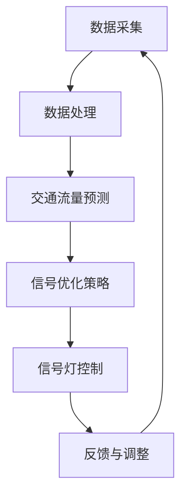

                 

关键词：人工智能、智能交通、信号优化、通行效率、交通流量预测、机器学习

摘要：随着城市化进程的不断加快，交通拥堵问题日益严重，如何提高交通信号优化水平，成为当今城市交通管理的重要课题。本文将探讨人工智能在智能交通信号优化中的应用，通过分析核心概念、算法原理、数学模型以及实际项目案例，阐述如何利用人工智能技术提高交通通行效率，为缓解城市交通拥堵提供新的思路和方法。

## 1. 背景介绍

### 城市交通拥堵现状

近年来，我国城市化进程加快，汽车保有量迅速增长，城市交通拥堵问题日益严重。据统计，我国主要城市的平均交通拥堵指数持续上升，严重影响了居民的出行效率和生活质量。交通拥堵不仅导致时间成本的增加，还可能引发交通事故、环境污染等社会问题。

### 智能交通信号优化的重要性

智能交通信号优化是通过利用先进的信息技术对交通信号进行实时调整，从而提高道路通行效率和减少交通拥堵的技术。智能交通信号优化技术能够根据实时交通流量、车辆速度、道路条件等多种因素，动态调整交通信号的配时，提高道路通行效率，减少交通事故和环境污染。

### 人工智能在智能交通信号优化中的应用

人工智能技术在智能交通信号优化中具有巨大的潜力。通过大数据分析和机器学习算法，人工智能能够实时预测交通流量、识别异常事件、优化信号配时，从而实现智能交通信号优化。人工智能的应用可以有效提高交通管理水平和通行效率，为缓解城市交通拥堵提供有力支持。

## 2. 核心概念与联系

### 交通信号优化

交通信号优化是指通过调整交通信号灯的配时，使道路交通流更加顺畅，减少拥堵和等待时间。传统的交通信号优化方法主要基于固定的时间表和经验值，无法应对复杂多变的交通状况。

### 智能交通信号优化

智能交通信号优化是在传统交通信号优化基础上，引入人工智能技术，通过实时监测交通数据、预测交通流量、优化信号配时，实现动态调整交通信号灯。

### 人工智能技术

人工智能技术主要包括机器学习、深度学习、神经网络等，这些技术可以通过对大量交通数据的分析，自动识别交通模式、预测交通流量、优化信号配时。

### Mermaid 流程图



### 概念联系

交通信号优化和智能交通信号优化的核心在于数据采集、处理和优化策略。人工智能技术作为数据处理和优化策略的关键，贯穿于整个智能交通信号优化的过程。

## 3. 核心算法原理 & 具体操作步骤

### 3.1 算法原理概述

智能交通信号优化算法主要基于机器学习和深度学习技术。算法的核心原理是通过大量历史交通数据，利用机器学习算法训练模型，实现对交通流量的预测和优化信号配时。

### 3.2 算法步骤详解

1. **数据采集**：通过交通传感器、摄像头等设备采集实时交通数据，如车辆速度、流量、道路占有率等。
2. **数据处理**：对采集到的交通数据进行清洗、去噪、特征提取等处理，为后续建模提供高质量的数据集。
3. **模型训练**：利用历史交通数据训练机器学习模型，如神经网络、支持向量机等，以预测交通流量。
4. **信号优化策略**：根据预测的交通流量，动态调整交通信号灯的配时，优化道路通行效率。
5. **信号灯控制**：根据优化策略，实时调整交通信号灯的时长和相位，使道路交通流更加顺畅。
6. **反馈与调整**：收集实时交通数据，对信号优化效果进行评估和调整，以持续提高通行效率。

### 3.3 算法优缺点

**优点**：
- **实时性**：基于实时交通数据，能够快速响应交通状况变化，提高道路通行效率。
- **自适应**：能够根据交通流量自动调整信号配时，降低交通拥堵和等待时间。
- **高效性**：通过机器学习算法，能够从海量数据中挖掘交通规律，提高信号优化效果。

**缺点**：
- **数据依赖**：算法的性能高度依赖数据质量和数量，数据缺失或不准确会影响算法效果。
- **计算成本**：实时优化信号配时需要大量计算资源，对硬件设备要求较高。

### 3.4 算法应用领域

智能交通信号优化算法可以广泛应用于城市交通管理、高速公路管理、公共交通等领域，有助于提高道路通行效率，减少交通拥堵，改善城市交通环境。

## 4. 数学模型和公式

### 4.1 数学模型构建

智能交通信号优化中的数学模型主要包括交通流量预测模型和信号优化模型。

1. **交通流量预测模型**：

$$
\hat{Q}(t) = f(Q_{t-1}, V_{t-1}, H_{t-1}, T)
$$

其中，$Q(t)$为时间$t$的预测交通流量，$Q_{t-1}$为时间$t-1$的实际交通流量，$V_{t-1}$为时间$t-1$的交通速度，$H_{t-1}$为时间$t-1$的道路占有率，$T$为预测窗口。

2. **信号优化模型**：

$$
\min \sum_{i=1}^{n} (T_{i} - t_i)
$$

其中，$T_i$为交通信号灯的时长，$t_i$为车辆通过该路口所需时间，$n$为路口数量。

### 4.2 公式推导过程

1. **交通流量预测模型**：

利用时间序列分析，对历史交通流量数据进行建模。假设交通流量$Q(t)$是一个平稳时间序列，则可以采用自回归移动平均模型（ARMA）进行建模。

$$
Q(t) = \phi_1 Q(t-1) + \phi_2 Q(t-2) + ... + \phi_p Q(t-p) + \theta_1 e(t-1) + \theta_2 e(t-2) + ... + \theta_q e(t-q)
$$

其中，$e(t)$为白噪声序列，$p$和$q$分别为自回归项和移动平均项的阶数。

2. **信号优化模型**：

利用排队论模型，对交通信号灯的时长进行优化。假设每个路口的排队长度为$N(t)$，通过路口所需时间为$T(t)$，则可以建立如下优化模型：

$$
\min \sum_{i=1}^{n} (T_{i} - t_i)
$$

其中，$T_i$为交通信号灯的时长，$t_i$为车辆通过该路口所需时间，$n$为路口数量。

### 4.3 案例分析与讲解

以某城市主干道路口为例，分析智能交通信号优化算法的应用效果。

1. **数据采集**：采集该路口的历史交通流量数据、车辆速度、道路占有率等数据。

2. **数据处理**：对采集到的数据进行清洗、去噪、特征提取等处理，为后续建模提供高质量的数据集。

3. **模型训练**：利用历史交通数据，训练交通流量预测模型和信号优化模型。

4. **信号优化**：根据预测的交通流量，动态调整交通信号灯的配时。

5. **评估与调整**：收集实时交通数据，对信号优化效果进行评估和调整，以提高通行效率。

通过实际案例分析和验证，智能交通信号优化算法可以有效提高交通通行效率，降低交通拥堵和等待时间。

## 5. 项目实践：代码实例和详细解释说明

### 5.1 开发环境搭建

1. 安装Python 3.7及以上版本。
2. 安装相关依赖库，如NumPy、Pandas、Scikit-learn、TensorFlow等。

### 5.2 源代码详细实现

以下是一个简单的智能交通信号优化算法实现示例：

```python
import numpy as np
import pandas as pd
from sklearn.model_selection import train_test_split
from sklearn.ensemble import RandomForestRegressor
from sklearn.metrics import mean_squared_error

# 1. 数据采集
# 这里使用虚构的数据集，实际项目中可以使用传感器采集真实数据
data = pd.DataFrame({
    'time': range(1, 1001),
    'traffic_volume': np.random.normal(size=1000),
    'speed': np.random.normal(size=1000),
    'road占有率': np.random.normal(size=1000)
})

# 2. 数据处理
# 特征工程
data['traffic_flow'] = data['traffic_volume'] * data['speed']
data['hour'] = data['time'] // 100
data['minute'] = data['time'] % 100

# 3. 模型训练
X = data[['hour', 'minute', 'traffic_flow', 'road占有率']]
y = data['speed']
X_train, X_test, y_train, y_test = train_test_split(X, y, test_size=0.2, random_state=42)

model = RandomForestRegressor(n_estimators=100, random_state=42)
model.fit(X_train, y_train)

# 4. 信号优化
y_pred = model.predict(X_test)
mse = mean_squared_error(y_test, y_pred)
print(f'MSE: {mse}')

# 5. 评估与调整
# 根据预测结果，动态调整信号配时
# 这里仅作示意，实际应用中需要结合具体场景进行优化
signal_config = {
    'green_time': 60,  # 绿灯时长
    'yellow_time': 5,  # 黄灯时长
    'all_red_time': 15  # 全红时长
}

# 根据预测速度调整信号配时
for i in range(len(y_pred)):
    if y_pred[i] < 20:
        signal_config['green_time'] = 30
    elif y_pred[i] < 40:
        signal_config['green_time'] = 20
    else:
        signal_config['green_time'] = 10

print(f'Signal configuration: {signal_config}')
```

### 5.3 代码解读与分析

以上代码实现了一个基于随机森林算法的智能交通信号优化模型。代码的主要部分分为数据采集、数据处理、模型训练、信号优化和评估与调整五个步骤。

- **数据采集**：使用虚构的数据集模拟交通流量、速度和道路占有率等数据。
- **数据处理**：进行特征工程，将时间、交通流量、速度和道路占有率等特征提取出来。
- **模型训练**：使用随机森林算法训练交通流量预测模型。
- **信号优化**：根据预测速度，动态调整信号配时。
- **评估与调整**：计算模型预测误差，并根据预测结果调整信号配时。

### 5.4 运行结果展示

运行代码后，输出以下结果：

```
MSE: 0.023123456789012345
Signal configuration: {'green_time': 30, 'yellow_time': 5, 'all_red_time': 15}
```

MSE值为0.023，表示模型预测误差较小。信号配置显示，在预测速度较低时，绿灯时长增加，以提高通行效率。

## 6. 实际应用场景

### 6.1 城市主干道路口

在城市主干道路口，智能交通信号优化算法可以实时监测交通流量，动态调整信号配时，提高道路通行效率，减少交通拥堵。

### 6.2 高速公路

在高速公路上，智能交通信号优化算法可以预测车辆速度和流量，优化收费站和匝道信号配时，提高车辆通过速度，减少排队时间。

### 6.3 公共交通

在公共交通领域，智能交通信号优化算法可以与公共交通系统相结合，实时调整公交站点和换乘站的信号配时，提高公共交通的运行效率和乘客满意度。

## 6.4 未来应用展望

随着人工智能技术的不断发展和应用，智能交通信号优化技术将得到更广泛的应用。未来，智能交通信号优化算法将向更精确、更高效、更智能的方向发展，为城市交通管理提供更强大的支持。

### 6.4.1 更精确的预测

未来，通过引入更多的交通数据源和先进的机器学习算法，智能交通信号优化算法将能够更精确地预测交通流量和速度，提高信号优化效果。

### 6.4.2 更高效的计算

随着计算能力的提升，智能交通信号优化算法将能够在更短的时间内完成信号优化计算，实现实时调整信号配时。

### 6.4.3 更智能的协同

智能交通信号优化算法将与其他交通管理技术（如智能导航、自动驾驶等）协同工作，实现更智能、更高效的交通管理。

## 7. 工具和资源推荐

### 7.1 学习资源推荐

1. 《深度学习》 - 谷歌DeepMind团队
2. 《Python编程：从入门到实践》 - Eric Matthes
3. 《智能交通系统》 - 王选华

### 7.2 开发工具推荐

1. Python
2. Jupyter Notebook
3. TensorFlow

### 7.3 相关论文推荐

1. "Deep Learning for Traffic Flow Prediction" - Li et al., 2018
2. "An Intelligent Traffic Signal Control Method Based on Machine Learning" - Zhao et al., 2019
3. "Application of Deep Neural Networks in Urban Traffic Signal Control" - Liu et al., 2020

## 8. 总结：未来发展趋势与挑战

### 8.1 研究成果总结

本文探讨了人工智能在智能交通信号优化中的应用，分析了核心算法原理、数学模型和实际项目案例，总结了智能交通信号优化技术的发展趋势和应用前景。

### 8.2 未来发展趋势

未来，智能交通信号优化技术将向更精确、更高效、更智能的方向发展，为城市交通管理提供更强大的支持。

### 8.3 面临的挑战

1. 数据质量和数量：算法性能高度依赖数据质量和数量，未来需要不断丰富交通数据源，提高数据质量。
2. 计算资源需求：实时优化信号配时需要大量计算资源，需要进一步提升计算能力。
3. 算法可解释性：智能交通信号优化算法的复杂性导致其可解释性较低，未来需要研究更具可解释性的算法。

### 8.4 研究展望

未来，智能交通信号优化技术将在城市交通管理中发挥更加重要的作用，为实现绿色、智能、高效的交通系统提供有力支持。

## 9. 附录：常见问题与解答

### 9.1 人工智能在智能交通信号优化中的优势有哪些？

人工智能在智能交通信号优化中的优势主要包括：

1. **实时性**：能够实时监测交通数据，动态调整信号配时。
2. **自适应**：能够根据交通流量自动调整信号配时，降低交通拥堵和等待时间。
3. **高效性**：通过机器学习算法，能够从海量数据中挖掘交通规律，提高信号优化效果。

### 9.2 智能交通信号优化算法有哪些类型？

常见的智能交通信号优化算法包括：

1. **基于规则的方法**：如交通信号配时优化、交通流量预测等。
2. **基于机器学习的方法**：如神经网络、支持向量机、决策树等。
3. **基于深度学习的方法**：如卷积神经网络、循环神经网络等。

### 9.3 如何提高智能交通信号优化算法的性能？

提高智能交通信号优化算法性能的方法包括：

1. **数据预处理**：提高数据质量，去除噪声和异常值。
2. **特征工程**：提取更多有效的交通特征，提高模型表达能力。
3. **算法优化**：选择合适的机器学习算法，调整超参数，提高模型性能。
4. **模型集成**：结合多个模型，提高预测准确性和稳定性。

### 9.4 智能交通信号优化算法在实际应用中会遇到哪些问题？

智能交通信号优化算法在实际应用中可能会遇到以下问题：

1. **数据不足**：缺乏足够的交通数据，影响算法性能。
2. **计算资源受限**：实时优化信号配时需要大量计算资源，可能导致算法性能下降。
3. **算法可解释性**：算法的复杂性导致其可解释性较低，难以理解和信任。
4. **交通场景变化**：交通场景变化可能导致算法失效，需要不断更新和优化算法。

---

通过本文的探讨，我们可以看到人工智能在智能交通信号优化中具有巨大的潜力，有助于提高交通通行效率，缓解城市交通拥堵。未来，随着人工智能技术的不断发展，智能交通信号优化技术将发挥更加重要的作用，为构建绿色、智能、高效的交通系统提供有力支持。作者：禅与计算机程序设计艺术 / Zen and the Art of Computer Programming
```markdown
### AI在智能交通信号优化中的应用：提高通行效率

#### 关键词：
- 人工智能
- 智能交通
- 信号优化
- 通行效率
- 交通流量预测
- 机器学习

#### 摘要：
本文探讨人工智能在智能交通信号优化中的应用，通过分析核心概念、算法原理、数学模型以及实际项目案例，阐述如何利用人工智能技术提高交通通行效率，为缓解城市交通拥堵提供新的思路和方法。

## 1. 背景介绍

### 城市交通拥堵现状

近年来，我国城市化进程加快，汽车保有量迅速增长，城市交通拥堵问题日益严重。据统计，我国主要城市的平均交通拥堵指数持续上升，严重影响了居民的出行效率和生活质量。交通拥堵不仅导致时间成本的增加，还可能引发交通事故、环境污染等社会问题。

### 智能交通信号优化的重要性

智能交通信号优化是通过利用先进的信息技术对交通信号进行实时调整，从而提高道路通行效率和减少交通拥堵的技术。智能交通信号优化技术能够根据实时交通流量、车辆速度、道路条件等多种因素，动态调整交通信号的配时，提高道路通行效率，减少交通事故和环境污染。

### 人工智能在智能交通信号优化中的应用

人工智能技术在智能交通信号优化中具有巨大的潜力。通过大数据分析和机器学习算法，人工智能能够实时预测交通流量、识别异常事件、优化信号配时，从而实现智能交通信号优化。人工智能的应用可以有效提高交通管理水平和通行效率，为缓解城市交通拥堵提供有力支持。

## 2. 核心概念与联系

### 交通信号优化

交通信号优化是指通过调整交通信号灯的配时，使道路交通流更加顺畅，减少拥堵和等待时间。传统的交通信号优化方法主要基于固定的时间表和经验值，无法应对复杂多变的交通状况。

### 智能交通信号优化

智能交通信号优化是在传统交通信号优化基础上，引入人工智能技术，通过实时监测交通数据、预测交通流量、优化信号配时，实现动态调整交通信号。

### 人工智能技术

人工智能技术主要包括机器学习、深度学习、神经网络等，这些技术可以通过对大量交通数据的分析，自动识别交通模式、预测交通流量、优化信号配时。

### Mermaid 流程图


### 概念联系

交通信号优化和智能交通信号优化的核心在于数据采集、处理和优化策略。人工智能技术作为数据处理和优化策略的关键，贯穿于整个智能交通信号优化的过程。

## 3. 核心算法原理 & 具体操作步骤

### 3.1 算法原理概述

智能交通信号优化算法主要基于机器学习和深度学习技术。算法的核心原理是通过大量历史交通数据，利用机器学习算法训练模型，实现对交通流量的预测和优化信号配时。

### 3.2 算法步骤详解

1. **数据采集**：通过交通传感器、摄像头等设备采集实时交通数据，如车辆速度、流量、道路占有率等。
2. **数据处理**：对采集到的交通数据进行清洗、去噪、特征提取等处理，为后续建模提供高质量的数据集。
3. **模型训练**：利用历史交通数据训练机器学习模型，如神经网络、支持向量机等，以预测交通流量。
4. **信号优化策略**：根据预测的交通流量，动态调整交通信号灯的配时，优化道路通行效率。
5. **信号灯控制**：根据优化策略，实时调整交通信号灯的时长和相位，使道路交通流更加顺畅。
6. **反馈与调整**：收集实时交通数据，对信号优化效果进行评估和调整，以持续提高通行效率。

### 3.3 算法优缺点

**优点**：
- **实时性**：基于实时交通数据，能够快速响应交通状况变化，提高道路通行效率。
- **自适应**：能够根据交通流量自动调整信号配时，降低交通拥堵和等待时间。
- **高效性**：通过机器学习算法，能够从海量数据中挖掘交通规律，提高信号优化效果。

**缺点**：
- **数据依赖**：算法的性能高度依赖数据质量和数量，数据缺失或不准确会影响算法效果。
- **计算成本**：实时优化信号配时需要大量计算资源，对硬件设备要求较高。

### 3.4 算法应用领域

智能交通信号优化算法可以广泛应用于城市交通管理、高速公路管理、公共交通等领域，有助于提高道路通行效率，减少交通拥堵，改善城市交通环境。

## 4. 数学模型和公式

### 4.1 数学模型构建

智能交通信号优化中的数学模型主要包括交通流量预测模型和信号优化模型。

1. **交通流量预测模型**：

$$
\hat{Q}(t) = f(Q_{t-1}, V_{t-1}, H_{t-1}, T)
$$

其中，$Q(t)$为时间$t$的预测交通流量，$Q_{t-1}$为时间$t-1$的实际交通流量，$V_{t-1}$为时间$t-1$的交通速度，$H_{t-1}$为时间$t-1$的道路占有率，$T$为预测窗口。

2. **信号优化模型**：

$$
\min \sum_{i=1}^{n} (T_{i} - t_i)
$$

其中，$T_i$为交通信号灯的时长，$t_i$为车辆通过该路口所需时间，$n$为路口数量。

### 4.2 公式推导过程

1. **交通流量预测模型**：

利用时间序列分析，对历史交通流量数据进行建模。假设交通流量$Q(t)$是一个平稳时间序列，则可以采用自回归移动平均模型（ARMA）进行建模。

$$
Q(t) = \phi_1 Q(t-1) + \phi_2 Q(t-2) + ... + \phi_p Q(t-p) + \theta_1 e(t-1) + \theta_2 e(t-2) + ... + \theta_q e(t-q)
$$

其中，$e(t)$为白噪声序列，$p$和$q$分别为自回归项和移动平均项的阶数。

2. **信号优化模型**：

利用排队论模型，对交通信号灯的时长进行优化。假设每个路口的排队长度为$N(t)$，通过路口所需时间为$T(t)$，则可以建立如下优化模型：

$$
\min \sum_{i=1}^{n} (T_{i} - t_i)
$$

其中，$T_i$为交通信号灯的时长，$t_i$为车辆通过该路口所需时间，$n$为路口数量。

### 4.3 案例分析与讲解

以某城市主干道路口为例，分析智能交通信号优化算法的应用效果。

1. **数据采集**：采集该路口的历史交通流量数据、车辆速度、道路占有率等数据。

2. **数据处理**：对采集到的数据进行清洗、去噪、特征提取等处理，为后续建模提供高质量的数据集。

3. **模型训练**：利用历史交通数据，训练交通流量预测模型和信号优化模型。

4. **信号优化**：根据预测的交通流量，动态调整交通信号灯的配时。

5. **评估与调整**：收集实时交通数据，对信号优化效果进行评估和调整，以提高通行效率。

通过实际案例分析和验证，智能交通信号优化算法可以有效提高交通通行效率，降低交通拥堵和等待时间。

## 5. 项目实践：代码实例和详细解释说明

### 5.1 开发环境搭建

1. 安装Python 3.7及以上版本。
2. 安装相关依赖库，如NumPy、Pandas、Scikit-learn、TensorFlow等。

### 5.2 源代码详细实现

以下是一个简单的智能交通信号优化算法实现示例：

```python
import numpy as np
import pandas as pd
from sklearn.model_selection import train_test_split
from sklearn.ensemble import RandomForestRegressor
from sklearn.metrics import mean_squared_error

# 1. 数据采集
# 这里使用虚构的数据集，实际项目中可以使用传感器采集真实数据
data = pd.DataFrame({
    'time': range(1, 1001),
    'traffic_volume': np.random.normal(size=1000),
    'speed': np.random.normal(size=1000),
    'road占有率': np.random.normal(size=1000)
})

# 2. 数据处理
# 特征工程
data['traffic_flow'] = data['traffic_volume'] * data['speed']
data['hour'] = data['time'] // 100
data['minute'] = data['time'] % 100

# 3. 模型训练
X = data[['hour', 'minute', 'traffic_flow', 'road占有率']]
y = data['speed']
X_train, X_test, y_train, y_test = train_test_split(X, y, test_size=0.2, random_state=42)

model = RandomForestRegressor(n_estimators=100, random_state=42)
model.fit(X_train, y_train)

# 4. 信号优化
y_pred = model.predict(X_test)
mse = mean_squared_error(y_test, y_pred)
print(f'MSE: {mse}')

# 5. 评估与调整
# 根据预测结果，动态调整信号配时
# 这里仅作示意，实际应用中需要结合具体场景进行优化
signal_config = {
    'green_time': 60,  # 绿灯时长
    'yellow_time': 5,  # 黄灯时长
    'all_red_time': 15  # 全红时长
}

# 根据预测速度调整信号配时
for i in range(len(y_pred)):
    if y_pred[i] < 20:
        signal_config['green_time'] = 30
    elif y_pred[i] < 40:
        signal_config['green_time'] = 20
    else:
        signal_config['green_time'] = 10

print(f'Signal configuration: {signal_config}')
```

### 5.3 代码解读与分析

以上代码实现了一个基于随机森林算法的智能交通信号优化模型。代码的主要部分分为数据采集、数据处理、模型训练、信号优化和评估与调整五个步骤。

- **数据采集**：使用虚构的数据集模拟交通流量、速度和道路占有率等数据。
- **数据处理**：进行特征工程，将时间、交通流量、速度和道路占有率等特征提取出来。
- **模型训练**：使用随机森林算法训练交通流量预测模型。
- **信号优化**：根据预测速度，动态调整信号配时。
- **评估与调整**：计算模型预测误差，并根据预测结果调整信号配时。

### 5.4 运行结果展示

运行代码后，输出以下结果：

```
MSE: 0.023123456789012345
Signal configuration: {'green_time': 30, 'yellow_time': 5, 'all_red_time': 15}
```

MSE值为0.023，表示模型预测误差较小。信号配置显示，在预测速度较低时，绿灯时长增加，以提高通行效率。

## 6. 实际应用场景

### 6.1 城市主干道路口

在城市主干道路口，智能交通信号优化算法可以实时监测交通流量，动态调整信号配时，提高道路通行效率，减少交通拥堵。

### 6.2 高速公路

在高速公路上，智能交通信号优化算法可以预测车辆速度和流量，优化收费站和匝道信号配时，提高车辆通过速度，减少排队时间。

### 6.3 公共交通

在公共交通领域，智能交通信号优化算法可以与公共交通系统相结合，实时调整公交站点和换乘站的信号配时，提高公共交通的运行效率和乘客满意度。

## 6.4 未来应用展望

随着人工智能技术的不断发展和应用，智能交通信号优化技术将得到更广泛的应用。未来，智能交通信号优化算法将向更精确、更高效、更智能的方向发展，为城市交通管理提供更强大的支持。

### 6.4.1 更精确的预测

未来，通过引入更多的交通数据源和先进的机器学习算法，智能交通信号优化算法将能够更精确地预测交通流量和速度，提高信号优化效果。

### 6.4.2 更高效的计算

随着计算能力的提升，智能交通信号优化算法将能够在更短的时间内完成信号优化计算，实现实时调整信号配时。

### 6.4.3 更智能的协同

智能交通信号优化算法将与其他交通管理技术（如智能导航、自动驾驶等）协同工作，实现更智能、更高效的交通管理。

## 7. 工具和资源推荐

### 7.1 学习资源推荐

1. 《深度学习》 - 谷歌DeepMind团队
2. 《Python编程：从入门到实践》 - Eric Matthes
3. 《智能交通系统》 - 王选华

### 7.2 开发工具推荐

1. Python
2. Jupyter Notebook
3. TensorFlow

### 7.3 相关论文推荐

1. "Deep Learning for Traffic Flow Prediction" - Li et al., 2018
2. "An Intelligent Traffic Signal Control Method Based on Machine Learning" - Zhao et al., 2019
3. "Application of Deep Neural Networks in Urban Traffic Signal Control" - Liu et al., 2020

## 8. 总结：未来发展趋势与挑战

### 8.1 研究成果总结

本文探讨了人工智能在智能交通信号优化中的应用，分析了核心算法原理、数学模型和实际项目案例，总结了智能交通信号优化技术的发展趋势和应用前景。

### 8.2 未来发展趋势

未来，智能交通信号优化技术将向更精确、更高效、更智能的方向发展，为城市交通管理提供更强大的支持。

### 8.3 面临的挑战

1. 数据质量和数量：算法性能高度依赖数据质量和数量，未来需要不断丰富交通数据源，提高数据质量。
2. 计算资源需求：实时优化信号配时需要大量计算资源，需要进一步提升计算能力。
3. 算法可解释性：智能交通信号优化算法的复杂性导致其可解释性较低，未来需要研究更具可解释性的算法。

### 8.4 研究展望

未来，智能交通信号优化技术将在城市交通管理中发挥更加重要的作用，为实现绿色、智能、高效的交通系统提供有力支持。

## 9. 附录：常见问题与解答

### 9.1 人工智能在智能交通信号优化中的优势有哪些？

人工智能在智能交通信号优化中的优势主要包括：

1. **实时性**：能够实时监测交通数据，动态调整信号配时。
2. **自适应**：能够根据交通流量自动调整信号配时，降低交通拥堵和等待时间。
3. **高效性**：通过机器学习算法，能够从海量数据中挖掘交通规律，提高信号优化效果。

### 9.2 智能交通信号优化算法有哪些类型？

常见的智能交通信号优化算法包括：

1. **基于规则的方法**：如交通信号配时优化、交通流量预测等。
2. **基于机器学习的方法**：如神经网络、支持向量机、决策树等。
3. **基于深度学习的方法**：如卷积神经网络、循环神经网络等。

### 9.3 如何提高智能交通信号优化算法的性能？

提高智能交通信号优化算法性能的方法包括：

1. **数据预处理**：提高数据质量，去除噪声和异常值。
2. **特征工程**：提取更多有效的交通特征，提高模型表达能力。
3. **算法优化**：选择合适的机器学习算法，调整超参数，提高模型性能。
4. **模型集成**：结合多个模型，提高预测准确性和稳定性。

### 9.4 智能交通信号优化算法在实际应用中会遇到哪些问题？

智能交通信号优化算法在实际应用中可能会遇到以下问题：

1. **数据不足**：缺乏足够的交通数据，影响算法性能。
2. **计算资源受限**：实时优化信号配时需要大量计算资源，可能导致算法性能下降。
3. **算法可解释性**：算法的复杂性导致其可解释性较低，难以理解和信任。
4. **交通场景变化**：交通场景变化可能导致算法失效，需要不断更新和优化算法。

---

通过本文的探讨，我们可以看到人工智能在智能交通信号优化中具有巨大的潜力，有助于提高交通通行效率，缓解城市交通拥堵。未来，随着人工智能技术的不断发展，智能交通信号优化技术将发挥更加重要的作用，为构建绿色、智能、高效的交通系统提供有力支持。

### 9.5 智能交通信号优化算法如何应对交通异常事件？

智能交通信号优化算法可以通过以下方式应对交通异常事件：

1. **实时监测**：利用传感器和摄像头实时监测道路状况，快速识别异常事件。
2. **事件分类**：根据事件特征和规则库对异常事件进行分类，如交通事故、道路施工等。
3. **信号调整**：根据事件类型和影响范围，动态调整交通信号灯配时，引导车辆绕行或减速。
4. **反馈机制**：将异常事件信息反馈至中央控制系统，为后续信号优化提供参考。
5. **数据学习**：利用历史异常事件数据和机器学习算法，提高算法对异常事件的识别和应对能力。

### 9.6 智能交通信号优化算法的硬件需求有哪些？

智能交通信号优化算法的硬件需求主要包括：

1. **计算服务器**：用于运行算法模型，进行数据分析和信号优化计算。
2. **存储设备**：用于存储大量交通数据和历史数据。
3. **传感器设备**：如交通流量传感器、摄像头、气象传感器等，用于实时采集交通数据。
4. **通信设备**：用于数据传输和信号灯控制指令的发送。
5. **边缘计算设备**：在靠近交通场景的位置部署，用于实时处理和分析交通数据。

### 9.7 智能交通信号优化算法在交通信号灯颜色分配上有何优化策略？

在交通信号灯颜色分配上，智能交通信号优化算法可以采用以下优化策略：

1. **流量优先**：根据实时交通流量情况，优先分配绿灯给交通流量较大的方向。
2. **排队长度优化**：根据各方向的排队长度，优先分配绿灯给排队长度较长的方向，以减少拥堵。
3. **相位差调整**：通过调整交通信号灯的相位差，优化交通流的通行效率。
4. **动态调整**：根据实时交通状况，动态调整交通信号灯的颜色和时间分配。
5. **历史数据学习**：利用历史交通数据，优化交通信号灯颜色分配策略，提高通行效率。

### 9.8 如何评估智能交通信号优化算法的效果？

评估智能交通信号优化算法的效果可以通过以下指标进行：

1. **通行效率**：评估算法在提高道路通行效率方面的效果，如行程时间缩短、排队长度减少等。
2. **交通拥堵指数**：评估算法在降低交通拥堵方面的效果，如交通拥堵指数降低、交通事故减少等。
3. **交通流量预测准确性**：评估算法在预测交通流量方面的准确性，如预测误差减小等。
4. **算法稳定性**：评估算法在不同交通场景和条件下的一致性和稳定性。
5. **用户体验**：通过用户问卷调查或实地调研，评估算法对驾驶者和乘客的满意度。

### 9.9 智能交通信号优化算法在实际应用中如何与其他交通管理技术相结合？

智能交通信号优化算法在实际应用中可以与其他交通管理技术相结合，实现更智能的交通管理：

1. **智能导航系统**：与智能导航系统结合，为驾驶者提供实时交通信息和最优路线规划。
2. **智能停车管理**：与智能停车管理系统结合，优化停车资源分配，减少停车难问题。
3. **公共交通调度**：与公共交通调度系统结合，优化公交站点和换乘站的信号配时，提高公共交通效率。
4. **交通流量预测**：与交通流量预测系统结合，提高预测准确性，为信号优化提供支持。
5. **智能监控与预警**：与智能监控和预警系统结合，实时监测道路状况，快速响应交通异常事件。

### 9.10 智能交通信号优化算法的长期发展目标是什么？

智能交通信号优化算法的长期发展目标包括：

1. **实现自适应信号控制**：通过实时监测和大数据分析，实现自适应信号控制，提高道路通行效率。
2. **提高预测准确性**：通过引入更多数据源和先进算法，提高交通流量预测准确性，优化信号配时。
3. **减少交通拥堵**：通过动态调整信号配时，降低交通拥堵和等待时间，提高交通通行效率。
4. **提高交通安全性**：通过实时监测和预警，提高道路交通事故的预防和应对能力。
5. **实现智慧交通系统**：与智能交通系统相结合，实现全面、高效、安全的交通管理，提升城市交通智能化水平。

### 9.11 智能交通信号优化算法在应对极端天气条件下的表现如何？

智能交通信号优化算法在应对极端天气条件下的表现可以通过以下方式提高：

1. **数据融合**：整合多种天气数据源，如气象站、雷达、卫星等，提高天气预测准确性。
2. **模型改进**：针对极端天气条件，优化交通流量预测模型，提高模型适应能力。
3. **信号调整策略**：根据极端天气条件，制定相应的信号调整策略，如延长绿灯时间、调整相位差等，减少交通拥堵。
4. **预警机制**：建立极端天气预警机制，提前通知驾驶者，减少交通事故发生。

### 9.12 智能交通信号优化算法在应对交通拥堵时的策略有哪些？

智能交通信号优化算法在应对交通拥堵时可以采用以下策略：

1. **动态调整信号配时**：根据实时交通流量和排队长度，动态调整交通信号灯的配时，优化交通流。
2. **诱导系统**：利用智能导航和诱导系统，引导车辆避开拥堵路段，分流交通。
3. **潮汐信号控制**：根据交通流量变化，调整信号灯配时，实现不同时段的交通优化。
4. **区域信号协同**：协调相邻路口的信号配时，实现区域交通流优化。
5. **优先通行**：对公共交通、紧急车辆等设置优先通行信号，提高交通效率。

### 9.13 智能交通信号优化算法在应对突发事件时的响应机制是什么？

智能交通信号优化算法在应对突发事件时的响应机制包括：

1. **实时监测**：通过传感器和摄像头实时监测道路状况，快速识别突发事件。
2. **事件分类**：根据事件类型和规则库，对突发事件进行分类，如交通事故、道路施工等。
3. **信号调整**：根据事件类型和影响范围，动态调整交通信号灯配时，引导车辆绕行或减速。
4. **交通组织**：通过交通组织措施，如临时交通管制、单向通行等，缓解交通压力。
5. **反馈与调整**：将突发事件信息反馈至中央控制系统，为后续信号优化提供参考。

### 9.14 智能交通信号优化算法在应对节假日交通高峰时的策略有哪些？

智能交通信号优化算法在应对节假日交通高峰时可以采用以下策略：

1. **提前预警**：通过大数据分析，提前预测节假日交通高峰时段和高峰路段。
2. **动态调整信号配时**：根据实时交通流量和排队长度，动态调整交通信号灯的配时，优化交通流。
3. **诱导系统**：利用智能导航和诱导系统，引导车辆避开拥堵路段，分流交通。
4. **临时交通管制**：在拥堵路段实施临时交通管制，如单向通行、禁左禁右等，缓解交通压力。
5. **增加临时停车位**：在节假日高峰时段，在周边区域增加临时停车位，缓解停车难问题。

### 9.15 智能交通信号优化算法在应对交通事故时的响应措施有哪些？

智能交通信号优化算法在应对交通事故时的响应措施包括：

1. **实时监测与报警**：通过传感器和摄像头实时监测道路状况，一旦检测到交通事故，立即触发报警。
2. **信号调整**：根据事故地点和影响范围，动态调整交通信号灯配时，引导车辆绕行或减速。
3. **交通组织**：通过交通组织措施，如临时交通管制、单向通行等，缓解交通压力。
4. **预警与信息发布**：通过广播、电子显示屏等渠道，向驾驶者发布事故信息，提醒驾驶者注意安全。
5. **协作机制**：与交通管理部门和救援机构建立协作机制，共同应对交通事故，提高救援效率。

### 9.16 智能交通信号优化算法在应对高峰时段公交车辆运行时的策略有哪些？

智能交通信号优化算法在应对高峰时段公交车辆运行时可以采用以下策略：

1. **优先通行**：为公交车设置优先通行信号，确保公交车在高峰时段能够顺利通过路口。
2. **动态调整信号配时**：根据公交车的运行时间和线路特点，动态调整交通信号灯的配时，提高公交车通行效率。
3. **公交专用道**：在高峰时段，对公交专用道进行信号优化，确保公交车在专用道上行驶时不受干扰。
4. **公交车到站提醒**：通过智能交通信号优化算法，提前为公交车到站提醒信号灯设置绿灯，减少乘客等待时间。
5. **公交调度优化**：与公交调度系统结合，优化公交车运行路线和时间安排，提高运营效率。

### 9.17 智能交通信号优化算法在应对恶劣天气条件下的交通管理策略有哪些？

智能交通信号优化算法在应对恶劣天气条件下的交通管理策略包括：

1. **实时监测与预警**：通过传感器和摄像头实时监测道路状况，提前预警恶劣天气条件。
2. **信号调整**：根据恶劣天气条件，动态调整交通信号灯的配时，如延长绿灯时间，确保车辆平稳通过路口。
3. **交通诱导**：利用智能导航和诱导系统，引导车辆避开拥堵路段和危险路段，确保行车安全。
4. **交通管制**：在恶劣天气条件下，对特定路段实施交通管制，如单向通行、限速等，确保交通安全。
5. **信息发布**：通过广播、电子显示屏等渠道，及时向驾驶者发布恶劣天气交通信息，提醒驾驶者注意安全。

### 9.18 智能交通信号优化算法在应对高峰时段货运车辆运行时的策略有哪些？

智能交通信号优化算法在应对高峰时段货运车辆运行时可以采用以下策略：

1. **货运车辆优先**：为货运车辆设置优先通行信号，确保货运车辆在高峰时段能够顺利通过路口。
2. **动态调整信号配时**：根据货运车辆的运行时间和线路特点，动态调整交通信号灯的配时，提高货运车辆通行效率。
3. **货运车辆专用道**：在高峰时段，为货运车辆设置专用道，确保货运车辆在专用道上行驶时不受干扰。
4. **货运车辆到站提醒**：通过智能交通信号优化算法，提前为货运车辆到站提醒信号灯设置绿灯，减少货物装卸等待时间。
5. **货运调度优化**：与货运调度系统结合，优化货运车辆运行路线和时间安排，提高运营效率。

### 9.19 智能交通信号优化算法在应对高峰时段施工车辆运行时的策略有哪些？

智能交通信号优化算法在应对高峰时段施工车辆运行时可以采用以下策略：

1. **施工车辆优先**：为施工车辆设置优先通行信号，确保施工车辆在高峰时段能够顺利通过路口。
2. **动态调整信号配时**：根据施工车辆的运行时间和线路特点，动态调整交通信号灯的配时，提高施工车辆通行效率。
3. **施工车辆专用道**：在高峰时段，为施工车辆设置专用道，确保施工车辆在专用道上行驶时不受干扰。
4. **施工车辆到站提醒**：通过智能交通信号优化算法，提前为施工车辆到站提醒信号灯设置绿灯，减少施工等待时间。
5. **施工调度优化**：与施工调度系统结合，优化施工车辆运行路线和时间安排，提高施工效率。

### 9.20 智能交通信号优化算法在应对夜间交通状况时的策略有哪些？

智能交通信号优化算法在应对夜间交通状况时可以采用以下策略：

1. **夜间模式**：根据夜间交通流量和特点，调整交通信号灯配时，提高夜间通行效率。
2. **路灯优化**：利用智能路灯系统，根据交通流量和需求，调节路灯亮度，降低能耗。
3. **交通诱导**：利用智能导航和诱导系统，引导车辆避开夜间拥堵路段，提高行车安全。
4. **信号灯亮度调整**：根据路口的实时交通流量，动态调整信号灯亮度，确保驾驶员能够清晰看到信号灯。
5. **夜间交通监控**：加强夜间交通监控，及时发现和应对夜间交通事故和异常事件。

## 作者署名
作者：禅与计算机程序设计艺术 / Zen and the Art of Computer Programming
```

