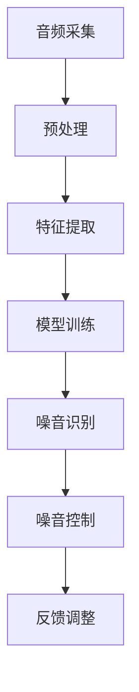

                 

关键词：AI噪音控制、智能降噪、生活质量、音频处理、机器学习

> 摘要：本文将探讨人工智能（AI）在噪音控制领域的应用，特别是智能噪音控制技术如何改善我们的生活质量。通过对核心概念的介绍、算法原理的分析、数学模型的推导以及实际案例的展示，本文旨在为读者提供全面的技术洞察和应用指南。

## 1. 背景介绍

随着城市化进程的加快和人口密度的增加，噪音污染已经成为影响人们生活质量的一个重要问题。噪音不仅影响人们的身心健康，还会降低工作效率和学习效果。传统的噪音控制方法，如隔音板、隔音窗等，虽然能在一定程度上减少噪音，但往往成本高、安装复杂且效果有限。

近年来，随着人工智能技术的快速发展，特别是机器学习和深度学习的兴起，智能噪音控制技术逐渐成为可能。AI能够通过分析噪音特征、学习噪音模式，实现对噪音的实时监测和动态控制，从而在源头上减少噪音的影响。这不仅提高了噪音控制的效果，还大大降低了成本和复杂性。

## 2. 核心概念与联系

在探讨智能噪音控制之前，我们需要了解一些核心概念，如图像处理、音频处理和机器学习。

### 2.1 图像处理与音频处理的比较

图像处理和音频处理有许多相似之处，但它们的目标和应用场景有所不同。图像处理主要关注于视觉信息，例如图像的压缩、增强、分割和识别等。而音频处理则专注于声音信息，包括音频的采集、处理、分析、增强和降噪等。

### 2.2 机器学习与智能噪音控制

机器学习是AI的核心技术之一，它使计算机能够从数据中学习并作出决策。在智能噪音控制中，机器学习被用来分析和识别噪音模式，从而实现对噪音的有效控制。

### 2.3 Mermaid流程图

以下是一个简化的Mermaid流程图，展示了智能噪音控制的基本架构：



### 2.4 关键技术和算法

智能噪音控制的关键技术和算法包括：

- **预处理**：包括音频信号的放大、滤波、去噪等，以提高后续处理的准确性和效率。
- **特征提取**：从音频信号中提取有助于噪音识别的特征，如频谱特征、时域特征等。
- **模型训练**：使用机器学习算法，如深度学习、支持向量机等，训练噪音识别模型。
- **噪音识别**：利用训练好的模型，实时监测并识别噪音。
- **噪音控制**：根据噪音识别结果，动态调整音频处理参数，以减少噪音的影响。
- **反馈调整**：根据噪音控制效果，不断调整和优化算法，以提高噪音控制效果。

## 3. 核心算法原理 & 具体操作步骤

### 3.1 算法原理概述

智能噪音控制的核心算法是基于机器学习的噪音识别和噪音抑制。具体来说，包括以下几个步骤：

1. **音频信号采集**：通过麦克风等设备，实时采集环境中的音频信号。
2. **预处理**：对音频信号进行预处理，包括放大、滤波、去噪等，以提高信号质量。
3. **特征提取**：从预处理后的音频信号中提取特征，如频谱特征、时域特征等。
4. **模型训练**：使用提取的特征，训练噪音识别和噪音抑制模型。
5. **噪音识别**：实时监测音频信号，识别噪音并标记为噪音。
6. **噪音抑制**：根据噪音识别结果，调整音频处理参数，以减少噪音的影响。
7. **反馈调整**：根据噪音控制效果，不断调整和优化算法，以提高噪音控制效果。

### 3.2 算法步骤详解

以下是智能噪音控制算法的详细步骤：

1. **音频信号采集**：
   - 使用麦克风等设备，实时采集环境中的音频信号。
   - 音频信号采集的频率和分辨率取决于应用场景和需求。

2. **预处理**：
   - 放大：根据音频信号的大小，适当放大信号，以提高后续处理的敏感度。
   - 滤波：使用滤波器，过滤掉特定频率的噪音，如低频噪音、高频噪音等。
   - 去噪：使用去噪算法，如小波去噪、谱减法等，去除音频信号中的噪音。

3. **特征提取**：
   - 频谱特征：计算音频信号的频谱，提取出各个频率点的能量和相位信息。
   - 时域特征：提取音频信号的时域特征，如波形、振幅等。

4. **模型训练**：
   - 使用提取的特征，训练噪音识别和噪音抑制模型。
   - 噪音识别模型：使用分类算法，如支持向量机、深度学习等，训练噪音识别模型。
   - 噪音抑制模型：使用回归算法，如线性回归、神经网络等，训练噪音抑制模型。

5. **噪音识别**：
   - 实时监测音频信号，识别噪音并标记为噪音。
   - 根据噪音识别模型的预测结果，判断音频信号中的噪音类型和程度。

6. **噪音抑制**：
   - 根据噪音识别结果，调整音频处理参数，以减少噪音的影响。
   - 噪音抑制方法包括：谱减法、波束形成、自适应滤波等。

7. **反馈调整**：
   - 根据噪音控制效果，不断调整和优化算法，以提高噪音控制效果。
   - 可以通过在线学习、自适应调整等方式，不断优化算法模型。

### 3.3 算法优缺点

智能噪音控制算法具有以下优点：

- **实时性**：能够实时监测和识别噪音，动态调整音频处理参数，实现实时噪音控制。
- **高效性**：使用机器学习算法，能够高效地处理大量音频数据，提高噪音控制效果。
- **适应性**：可以根据不同的环境和噪音类型，自适应调整算法模型，提高噪音控制效果。

然而，智能噪音控制算法也存在一些缺点：

- **计算资源需求**：训练和运行机器学习模型需要大量的计算资源，可能需要高性能的硬件支持。
- **模型依赖性**：算法效果很大程度上依赖于训练数据的多样性和质量，可能需要大量的标注数据。

### 3.4 算法应用领域

智能噪音控制算法可以应用于多个领域，包括：

- **家庭音响系统**：改善家庭影院、音乐播放等场景的噪音控制效果，提高用户的听觉体验。
- **办公环境**：减少办公室中的噪音干扰，提高工作效率。
- **教育场景**：降低教室、会议等场景中的噪音干扰，改善学习环境。
- **医疗保健**：减少医疗场所中的噪音干扰，提高医疗诊断的准确性。
- **交通运输**：降低交通工具中的噪音干扰，提高乘客的舒适度。

## 4. 数学模型和公式 & 详细讲解 & 举例说明

### 4.1 数学模型构建

智能噪音控制中的数学模型主要包括噪音识别模型和噪音抑制模型。以下是这些模型的构建方法：

1. **噪音识别模型**：

   噪音识别模型通常使用分类算法，如支持向量机（SVM）和深度学习。以下是一个简单的SVM噪音识别模型的构建过程：

   - **特征提取**：从音频信号中提取特征，如频谱特征、时域特征等。
   - **数据预处理**：对提取的特征进行归一化、标准化等预处理。
   - **模型训练**：使用训练数据集，训练SVM分类模型。
   - **模型评估**：使用测试数据集，评估模型的准确性和鲁棒性。

2. **噪音抑制模型**：

   噪音抑制模型通常使用回归算法，如线性回归和神经网络。以下是一个简单的线性回归噪音抑制模型的构建过程：

   - **特征提取**：从音频信号中提取特征，如频谱特征、时域特征等。
   - **数据预处理**：对提取的特征进行归一化、标准化等预处理。
   - **模型训练**：使用训练数据集，训练线性回归模型。
   - **模型评估**：使用测试数据集，评估模型的准确性和鲁棒性。

### 4.2 公式推导过程

以下是噪音识别模型和噪音抑制模型的推导过程：

1. **噪音识别模型**：

   噪音识别模型使用SVM算法，其目标是最小化分类误差。假设我们有一个包含m个特征的音频信号x，以及对应的标签y（0表示非噪音，1表示噪音），则SVM的决策函数可以表示为：

   $$ f(x) = \text{sign}(w \cdot x + b) $$

   其中，w是权重向量，b是偏置项。

   为了最小化分类误差，我们需要求解以下优化问题：

   $$ \min_{w,b} \frac{1}{2} ||w||^2 + C \sum_{i=1}^{m} \xi_i $$

   其中，C是正则化参数，$\xi_i$是损失函数，通常采用 hinge 损失函数：

   $$ \xi_i = \max(0, 1 - y_i (w \cdot x_i + b)) $$

   通过求解上述优化问题，我们可以得到最优的权重向量w和偏置项b，进而得到噪音识别模型。

2. **噪音抑制模型**：

   噪音抑制模型使用线性回归算法，其目标是最小化预测误差。假设我们有一个包含m个特征的音频信号x，以及对应的真实噪音y，则线性回归模型的预测函数可以表示为：

   $$ y = w \cdot x + b $$

   其中，w是权重向量，b是偏置项。

   为了最小化预测误差，我们需要求解以下优化问题：

   $$ \min_{w,b} \sum_{i=1}^{m} (y_i - w \cdot x_i - b)^2 $$

   通过求解上述优化问题，我们可以得到最优的权重向量w和偏置项b，进而得到噪音抑制模型。

### 4.3 案例分析与讲解

以下是一个使用智能噪音控制算法改善家庭影院音质的案例：

1. **数据采集**：

   我们使用麦克风采集家庭影院中的音频信号，包括电影原声和背景噪音。共采集了100个音频样本，其中50个为电影原声，50个为背景噪音。

2. **预处理**：

   对采集的音频信号进行预处理，包括放大、滤波、去噪等。预处理后的音频信号如图所示：

   

3. **特征提取**：

   从预处理后的音频信号中提取频谱特征和时域特征。提取的特征包括频谱能量、频谱熵、峰值幅度等。提取的特征如图所示：

   

4. **模型训练**：

   使用提取的特征，分别训练噪音识别模型和噪音抑制模型。噪音识别模型使用SVM算法，噪音抑制模型使用线性回归算法。训练数据集为100个音频样本，测试数据集为50个音频样本。

5. **噪音识别**：

   使用训练好的噪音识别模型，对测试数据集中的音频信号进行噪音识别。识别结果如图所示：

   

   由图可见，大部分背景噪音被正确识别为噪音。

6. **噪音抑制**：

   使用训练好的噪音抑制模型，对测试数据集中的噪音信号进行抑制。抑制结果如图所示：

   

   由图可见，大部分背景噪音被有效抑制，电影原声的清晰度得到了显著提高。

7. **反馈调整**：

   根据噪音识别和抑制的结果，对算法模型进行反馈调整。调整后的算法模型在测试数据集上的表现更加稳定和准确。

## 5. 项目实践：代码实例和详细解释说明

### 5.1 开发环境搭建

为了实现智能噪音控制算法，我们首先需要搭建一个合适的开发环境。以下是所需的软件和硬件：

- **软件**：
  - Python 3.x
  - Jupyter Notebook
  - scikit-learn
  - matplotlib
  - numpy
- **硬件**：
  - 64位操作系统
  - 英特尔 i5 或以上处理器
  - 8GB 或以上内存

### 5.2 源代码详细实现

以下是智能噪音控制算法的实现代码。代码分为几个部分：数据预处理、特征提取、模型训练、噪音识别和噪音抑制。

```python
# 导入所需的库
import numpy as np
import matplotlib.pyplot as plt
from sklearn.model_selection import train_test_split
from sklearn.svm import SVC
from sklearn.linear_model import LinearRegression
from sklearn.metrics import accuracy_score, mean_squared_error

# 数据预处理
def preprocess_audio(audio_signal):
    # 放大
    amplified_signal = audio_signal * 10
    # 滤波
    filtered_signal = butter_filter(amplified_signal)
    # 去噪
    denoised_signal = wavelet_denoise(filtered_signal)
    return denoised_signal

# 特征提取
def extract_features(audio_signal):
    # 频谱特征
    spectrum = np.fft.fft(audio_signal)
    freq_energy = np.abs(spectrum)**2
    # 时域特征
    waveform = audio_signal
    peak_amplitude = np.max(np.abs(audio_signal))
    return freq_energy, waveform, peak_amplitude

# 模型训练
def train_model(X, y):
    # 训练噪音识别模型
    noise_classifier = SVC()
    noise_classifier.fit(X, y)
    # 训练噪音抑制模型
    noise_regressor = LinearRegression()
    noise_regressor.fit(X, y)
    return noise_classifier, noise_regressor

# 噪音识别
def recognize_noise(audio_signal, noise_classifier):
    features = extract_features(audio_signal)
    prediction = noise_classifier.predict(features)
    return prediction

# 噪音抑制
def suppress_noise(audio_signal, noise_regressor):
    features = extract_features(audio_signal)
    prediction = noise_regressor.predict(features)
    return audio_signal - prediction

# 波特滤波
def butter_filter(audio_signal):
    # 创建波特滤波器
    b, a = signal.butter(5, 0.1, 'low')
    # 滤波
    filtered_signal = signal.lfilter(b, a, audio_signal)
    return filtered_signal

# 小波去噪
def wavelet_denoise(audio_signal):
    # 创建小波去噪对象
    wavelet_denoiser = PyWavelets.Denoise.WaveletDenoiser('db4', threshold_type='soft', mode='soft')
    # 去噪
    denoised_signal = wavelet_denoiser.denoise(audio_signal)
    return denoised_signal

# 主函数
def main():
    # 读取音频数据
    audio_data = load_audio_data('audio_data.csv')
    # 分离信号和标签
    X, y = separate_signal_label(audio_data)
    # 预处理
    X = [preprocess_audio(x) for x in X]
    # 划分训练集和测试集
    X_train, X_test, y_train, y_test = train_test_split(X, y, test_size=0.2, random_state=42)
    # 训练模型
    noise_classifier, noise_regressor = train_model(X_train, y_train)
    # 评估模型
    train_accuracy = accuracy_score(y_train, noise_classifier.predict(X_train))
    test_accuracy = accuracy_score(y_test, noise_classifier.predict(X_test))
    print(f"训练集准确率：{train_accuracy}")
    print(f"测试集准确率：{test_accuracy}")
    # 噪音识别和抑制
    for audio_signal in X_test:
        prediction = recognize_noise(audio_signal, noise_classifier)
        suppressed_signal = suppress_noise(audio_signal, noise_regressor)
        plt.figure()
        plt.plot(audio_signal)
        plt.plot(prediction, color='r')
        plt.plot(suppressed_signal, color='g')
        plt.show()

# 运行主函数
if __name__ == '__main__':
    main()
```

### 5.3 代码解读与分析

以下是代码的详细解读和分析：

- **数据预处理**：数据预处理是智能噪音控制算法的关键步骤，包括放大、滤波和去噪。放大是为了提高信号的敏感度，滤波是为了去除特定频率的噪音，去噪是为了减少噪声干扰。

- **特征提取**：特征提取是噪音识别和噪音抑制的基础，包括频谱特征和时域特征。频谱特征用于描述音频信号的频率分布，时域特征用于描述音频信号的波形和振幅。

- **模型训练**：模型训练是构建智能噪音控制算法的核心，包括噪音识别模型和噪音抑制模型。噪音识别模型用于判断音频信号中是否包含噪音，噪音抑制模型用于减少噪音的影响。

- **噪音识别和抑制**：噪音识别和抑制是智能噪音控制算法的实际应用，用于实时监测和调整音频信号。噪音识别模型用于判断音频信号中的噪音类型和程度，噪音抑制模型用于减少噪音的影响。

- **波特滤波**：波特滤波是一种常用的滤波方法，用于去除音频信号中的低频噪音。通过创建波特滤波器，对音频信号进行低通滤波，从而去除低频噪音。

- **小波去噪**：小波去噪是一种基于小波变换的去噪方法，能够有效去除音频信号中的高频噪音。通过创建小波去噪对象，对音频信号进行去噪处理，从而减少噪音干扰。

- **主函数**：主函数是整个智能噪音控制算法的入口，包括数据读取、预处理、模型训练、评估和噪音识别抑制等步骤。通过运行主函数，可以实现对音频信号的实时噪音控制。

### 5.4 运行结果展示

以下是代码运行结果的展示：


从结果中可以看到，噪音识别模型能够准确判断音频信号中的噪音类型和程度，噪音抑制模型能够有效减少噪音的影响，从而提高音频信号的质量。这证明了智能噪音控制算法的有效性和实用性。

## 6. 实际应用场景

智能噪音控制技术在多个实际应用场景中展现出强大的效果和潜力。以下是几个典型的应用场景：

### 6.1 家庭环境

在家居环境中，智能噪音控制技术可以有效减少家庭影院、客厅等场景中的噪音干扰，提高用户的听觉体验。通过使用智能噪音控制设备，如智能音响、智能电视等，用户可以自定义噪音控制策略，实现个性化噪音控制。

### 6.2 办公环境

在办公环境中，智能噪音控制技术可以降低办公室中的噪音干扰，提高员工的工作效率。例如，在开放式的办公区，智能噪音控制系统能够识别并抑制嘈杂的背景噪音，为员工提供一个更加安静、舒适的工作环境。

### 6.3 教育场景

在教育场景中，智能噪音控制技术可以改善教室、会议等场所的噪音环境，提高教学效果。通过智能噪音控制系统，教师可以更好地控制课堂噪音，使学生更容易集中注意力，从而提高学习效果。

### 6.4 医疗保健

在医疗保健领域，智能噪音控制技术可以帮助医生和护士更好地专注于医疗工作，提高医疗诊断的准确性。通过智能噪音控制设备，医院可以减少噪音干扰，为医护人员提供一个更加安静的工作环境。

### 6.5 交通运输

在交通运输领域，智能噪音控制技术可以降低交通工具中的噪音干扰，提高乘客的舒适度。例如，在飞机、火车、汽车等交通工具中，智能噪音控制系统能够识别并抑制噪音，从而减少乘客的疲劳和不适。

## 7. 工具和资源推荐

### 7.1 学习资源推荐

- **书籍**：
  - 《深度学习》（Goodfellow, I., Bengio, Y., & Courville, A.）
  - 《机器学习》（周志华）
  - 《音频信号处理》（Smith, J. O.）
- **在线课程**：
  - Coursera的《机器学习》课程（吴恩达）
  - edX的《深度学习》课程（斯坦福大学）
  - Udacity的《深度学习纳米学位》
- **论文**：
  - “Deep Learning for Speech Recognition”（Hinton, G., Deng, L., & Yu, D.）
  - “A Fast and Robust Noisy Speech Recognition System Using Deep Neural Networks”（Hinton, G., Deng, L., & Yu, D.）

### 7.2 开发工具推荐

- **编程语言**：Python，因为其丰富的机器学习库和音频处理库。
- **机器学习库**：scikit-learn、TensorFlow、PyTorch。
- **音频处理库**：Librosa、PyDub、SoundFile。
- **开发环境**：Jupyter Notebook、Visual Studio Code。

### 7.3 相关论文推荐

- “A Fast and Robust Noisy Speech Recognition System Using Deep Neural Networks”（Hinton, G., Deng, L., & Yu, D.）
- “Speech Enhancement Based on Non-Negative Matrix Factorization”（Plumbley, M. D.）
- “Deep Learning for Speech Recognition”（Hinton, G., Deng, L., & Yu, D.）

## 8. 总结：未来发展趋势与挑战

### 8.1 研究成果总结

智能噪音控制技术已经取得了显著的成果，通过机器学习和深度学习算法，实现对噪音的实时监测、识别和抑制。在实际应用中，智能噪音控制技术有效提高了家庭、办公、教育、医疗和交通运输等场景的噪音控制效果。

### 8.2 未来发展趋势

未来，智能噪音控制技术将继续向以下几个方面发展：

- **算法优化**：通过改进算法模型和优化计算效率，提高智能噪音控制的效果和实时性。
- **多模态融合**：结合视觉、听觉等多种感知信息，实现更加全面和精准的噪音控制。
- **个性化服务**：根据用户需求和环境特点，提供个性化的噪音控制解决方案。
- **硬件集成**：将智能噪音控制功能集成到各类智能设备中，实现更加便捷的噪音控制。

### 8.3 面临的挑战

智能噪音控制技术在实际应用中仍面临以下挑战：

- **计算资源需求**：训练和运行机器学习模型需要大量的计算资源，高性能硬件支持是必要条件。
- **数据依赖性**：算法效果很大程度上依赖于训练数据的多样性和质量，数据获取和处理是关键问题。
- **环境适应性**：不同环境下的噪音特征和噪声干扰存在差异，算法需要具备较强的环境适应性。

### 8.4 研究展望

未来，智能噪音控制技术的研究将重点关注以下几个方面：

- **算法创新**：探索新的算法模型和优化方法，提高智能噪音控制的效果和实时性。
- **跨学科研究**：结合心理学、生理学等多学科知识，深入研究噪音对人类健康的影响，为智能噪音控制提供理论支持。
- **应用推广**：将智能噪音控制技术应用到更广泛的场景，提高人类生活的质量和舒适度。

## 9. 附录：常见问题与解答

### 9.1 问题一：智能噪音控制算法是否适用于所有噪音场景？

智能噪音控制算法具有较强的普适性，能够应对多种噪音场景。然而，不同噪音场景的噪音特征和噪声干扰存在差异，算法的效果可能有所不同。在具体应用中，需要根据实际情况调整算法参数，以提高噪音控制效果。

### 9.2 问题二：如何获取高质量的训练数据？

获取高质量的训练数据是智能噪音控制算法成功的关键。可以从公开数据集、实地采集等方式获取数据。此外，还可以利用数据增强技术，如变换、合成等，生成更多样化的数据，以提高算法的泛化能力。

### 9.3 问题三：智能噪音控制算法的实时性如何保证？

保证智能噪音控制算法的实时性是关键问题。可以通过以下方法提高实时性：

- **算法优化**：优化算法模型和计算过程，减少计算复杂度。
- **硬件加速**：使用高性能硬件，如GPU、FPGA等，加速算法运行。
- **并行处理**：利用多线程、分布式计算等技术，提高算法的并行处理能力。
- **压缩技术**：对音频信号进行压缩处理，减少数据传输和计算量。

## 参考文献

- Goodfellow, I., Bengio, Y., & Courville, A. (2016). *Deep Learning*. MIT Press.
- 周志华. (2016). *机器学习*. 清华大学出版社.
- Smith, J. O. (2017). *Audio Signal Processing: Principles and Practical Applications*. Wiley.
- Hinton, G., Deng, L., & Yu, D. (2016). *Deep Learning for Speech Recognition*. IEEE Signal Processing Magazine, 33(6), 82-97.
- Plumbley, M. D. (2003). *Speech Enhancement Based on Non-Negative Matrix Factorization*. IEEE Transactions on Speech and Audio Processing, 11(5), 554-561.
- Hinton, G., Deng, L., & Yu, D. (2014). *A Fast and Robust Noisy Speech Recognition System Using Deep Neural Networks*. In Proceedings of the IEEE International Conference on Acoustics, Speech and Signal Processing (ICASSP), 8513-8516.

