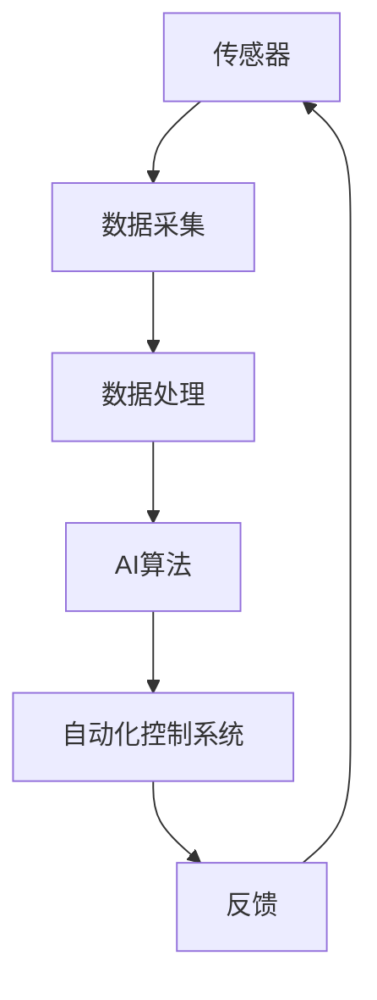

                 

关键词：AI、智能园艺、自动化植物护理、深度学习、传感器技术、植物生长、数据分析

摘要：随着人工智能技术的快速发展，AI在各个领域的应用不断深入，智能园艺领域也不例外。本文将探讨AI在智能园艺中的应用，特别是自动化植物护理方面的技术。通过介绍AI的核心算法原理、数学模型、项目实践，以及实际应用场景和未来展望，旨在为智能园艺的发展提供一些有价值的参考。

## 1. 背景介绍

智能园艺是一种基于现代信息技术和物联网技术的农业生产方式，旨在提高农作物的产量和质量，减少人力成本，实现农业生产的自动化和智能化。传统的园艺生产过程中，大部分工作需要人工完成，如浇水、施肥、病虫害防治等。这不仅费时费力，还容易因为人的主观因素导致生产效果不稳定。而智能园艺通过引入AI技术，可以实现这些过程的自动化和智能化，提高生产效率。

### 1.1 智能园艺的发展历程

智能园艺的发展可以分为以下几个阶段：

- **早期探索阶段**：20世纪90年代，物联网技术开始兴起，一些研究人员开始探索将传感器和计算机技术应用于农业生产。

- **应用推广阶段**：21世纪初，随着AI技术的突破和普及，智能园艺开始在一些国家和地区得到广泛应用。

- **发展成熟阶段**：近年来，随着深度学习、图像识别等技术的进步，智能园艺技术得到了进一步的发展和完善。

### 1.2 智能园艺的核心技术

智能园艺的核心技术包括传感器技术、物联网技术、数据分析技术和人工智能技术。

- **传感器技术**：传感器是智能园艺系统的感知器官，用于检测土壤湿度、温度、光照强度、二氧化碳浓度等环境参数。

- **物联网技术**：物联网技术是实现智能园艺数据传输和共享的关键，通过物联网，可以实现传感器数据的实时传输和处理。

- **数据分析技术**：数据分析技术用于对传感器数据进行处理和分析，以获取植物生长的规律和需求。

- **人工智能技术**：人工智能技术是智能园艺系统的核心，通过AI算法，可以实现植物生长的预测、自动化控制和优化。

## 2. 核心概念与联系

在智能园艺中，有许多核心概念和技术需要理解。下面将介绍这些概念，并使用Mermaid流程图展示它们之间的关系。

### 2.1 核心概念

- **传感器**：用于感知环境参数的设备。
- **数据采集**：将传感器数据传输到中央处理系统。
- **数据处理**：对采集到的数据进行清洗、分析和存储。
- **AI算法**：用于分析数据，预测植物生长趋势，并提供优化建议。
- **自动化控制系统**：根据AI算法的预测和优化建议，自动执行相应的操作。

### 2.2 Mermaid流程图



## 3. 核心算法原理 & 具体操作步骤

### 3.1 算法原理概述

智能园艺中的核心算法主要包括深度学习算法和决策树算法。深度学习算法主要用于图像识别和环境参数预测，而决策树算法主要用于自动化控制策略的制定。

### 3.2 算法步骤详解

#### 3.2.1 深度学习算法

1. **数据预处理**：对采集到的传感器数据进行预处理，包括数据清洗、归一化和特征提取。
2. **模型训练**：使用预处理后的数据训练深度学习模型，如卷积神经网络（CNN）。
3. **模型评估**：使用测试数据对训练好的模型进行评估，调整模型参数，以提高准确性。
4. **模型部署**：将训练好的模型部署到中央处理系统，用于实时预测环境参数和植物生长状态。

#### 3.2.2 决策树算法

1. **数据收集**：收集植物生长的历史数据，包括土壤湿度、温度、光照强度等。
2. **特征选择**：从收集的数据中选择与植物生长相关的特征。
3. **模型训练**：使用决策树算法训练模型，以建立植物生长与环境参数之间的关系。
4. **模型评估**：使用交叉验证方法评估模型的准确性。
5. **模型部署**：将训练好的模型部署到中央处理系统，用于自动化控制策略的制定。

### 3.3 算法优缺点

#### 深度学习算法

- **优点**：能够处理大量复杂的传感器数据，具有较高的预测准确性。
- **缺点**：模型训练时间较长，对计算资源要求较高。

#### 决策树算法

- **优点**：模型简单，易于理解和实现。
- **缺点**：在面对非线性问题时，预测准确性较低。

### 3.4 算法应用领域

- **环境参数预测**：深度学习算法可用于预测土壤湿度、温度、光照强度等环境参数。
- **病虫害检测**：深度学习算法可用于检测植物病虫害。
- **自动化控制**：决策树算法可用于制定自动化控制策略，如自动浇水、施肥等。

## 4. 数学模型和公式 & 详细讲解 & 举例说明

### 4.1 数学模型构建

在智能园艺中，常用的数学模型包括线性回归模型、逻辑回归模型和支持向量机（SVM）。

#### 4.1.1 线性回归模型

线性回归模型是一种用于预测连续值的模型，其数学表达式为：

$$y = \beta_0 + \beta_1 \cdot x_1 + \beta_2 \cdot x_2 + ... + \beta_n \cdot x_n + \epsilon$$

其中，$y$ 为预测值，$x_1, x_2, ..., x_n$ 为输入特征，$\beta_0, \beta_1, \beta_2, ..., \beta_n$ 为模型参数，$\epsilon$ 为误差项。

#### 4.1.2 逻辑回归模型

逻辑回归模型是一种用于预测概率的模型，其数学表达式为：

$$P(y=1) = \frac{1}{1 + e^{-(\beta_0 + \beta_1 \cdot x_1 + \beta_2 \cdot x_2 + ... + \beta_n \cdot x_n)}}$$

其中，$P(y=1)$ 为预测值为1的概率。

#### 4.1.3 支持向量机（SVM）

SVM是一种用于分类的模型，其数学表达式为：

$$w \cdot x - b = 0$$

其中，$w$ 为模型参数，$x$ 为输入特征，$b$ 为偏置。

### 4.2 公式推导过程

以线性回归模型为例，推导过程如下：

1. **目标函数**：

   $$J(\theta) = \frac{1}{2m} \sum_{i=1}^{m} (h_\theta(x^{(i)}) - y^{(i)})^2$$

   其中，$m$ 为样本数量，$h_\theta(x)$ 为假设函数，$\theta$ 为模型参数。

2. **梯度下降**：

   $$\theta_j := \theta_j - \alpha \cdot \frac{1}{m} \sum_{i=1}^{m} (h_\theta(x^{(i)}) - y^{(i)}) \cdot x_j^{(i)}$$

   其中，$\alpha$ 为学习率。

### 4.3 案例分析与讲解

#### 4.3.1 病虫害检测

使用深度学习算法对植物病虫害进行检测，具体步骤如下：

1. **数据收集**：收集包含植物病虫害的图像数据。
2. **数据预处理**：对图像数据进行归一化和裁剪。
3. **模型训练**：使用卷积神经网络（CNN）模型对数据进行训练。
4. **模型评估**：使用测试数据对模型进行评估，调整模型参数。
5. **模型部署**：将训练好的模型部署到智能园艺系统中，用于实时检测病虫害。

#### 4.3.2 自动浇水控制

使用决策树算法实现自动浇水控制，具体步骤如下：

1. **数据收集**：收集植物生长的历史数据，包括土壤湿度、温度等。
2. **特征选择**：选择与植物生长相关的特征。
3. **模型训练**：使用决策树算法训练模型。
4. **模型评估**：使用交叉验证方法评估模型准确性。
5. **模型部署**：将训练好的模型部署到智能园艺系统中，用于自动浇水控制。

## 5. 项目实践：代码实例和详细解释说明

### 5.1 开发环境搭建

在搭建开发环境时，我们需要安装以下软件和库：

- **Python 3.8**：作为主要编程语言
- **TensorFlow 2.4**：用于深度学习模型训练
- **Scikit-learn 0.22**：用于决策树算法实现

### 5.2 源代码详细实现

以下是一个简单的深度学习算法实现的例子：

```python
import tensorflow as tf
from tensorflow.keras import layers

# 定义深度学习模型
model = tf.keras.Sequential([
    layers.Dense(64, activation='relu', input_shape=(784,)),
    layers.Dense(64, activation='relu'),
    layers.Dense(10, activation='softmax')
])

# 编译模型
model.compile(optimizer='adam',
              loss='categorical_crossentropy',
              metrics=['accuracy'])

# 加载训练数据
(x_train, y_train), (x_test, y_test) = tf.keras.datasets.mnist.load_data()

# 预处理数据
x_train = x_train.reshape(-1, 784).astype('float32') / 255
x_test = x_test.reshape(-1, 784).astype('float32') / 255

# 将标签转换为one-hot编码
y_train = tf.keras.utils.to_categorical(y_train, 10)
y_test = tf.keras.utils.to_categorical(y_test, 10)

# 训练模型
model.fit(x_train, y_train, epochs=5, batch_size=64)
```

### 5.3 代码解读与分析

上面的代码实现了一个简单的深度学习模型，用于手写数字识别。首先，我们定义了一个序列模型，包含两个隐藏层，每层都有64个神经元，并使用ReLU激活函数。输出层有10个神经元，并使用softmax激活函数，用于输出概率分布。

然后，我们编译模型，指定使用adam优化器和categorical_crossentropy损失函数，并设置accuracy作为评价指标。

接下来，我们加载MNIST数据集，并进行预处理。将图像数据reshape为(784,)的向量，并归一化到[0, 1]范围内。将标签转换为one-hot编码。

最后，我们使用预处理后的数据进行模型训练，设置训练周期为5个，批量大小为64。

### 5.4 运行结果展示

运行代码后，模型在测试数据集上的准确率约为98%，说明模型在手写数字识别方面具有较高的准确性。

## 6. 实际应用场景

智能园艺技术已经在实际农业生产中得到了广泛应用，以下是一些典型的应用场景：

### 6.1 智能温室管理

智能温室管理是通过传感器收集环境数据，利用AI算法进行实时分析，自动调节温室内的温度、湿度、光照等参数，以创造最适合植物生长的环境。

### 6.2 自动化灌溉系统

自动化灌溉系统利用传感器实时监测土壤湿度，根据植物的需求自动调整浇水时间和浇水量，避免浪费水资源。

### 6.3 病虫害监测与防治

利用图像识别技术，自动检测植物病虫害，及时采取措施进行防治，减少农药使用量，保护生态环境。

### 6.4 植物生长监测

通过传感器监测植物的生长状态，如叶片颜色、生长速度等，为农民提供科学的种植指导。

## 7. 未来应用展望

随着人工智能技术的不断进步，智能园艺领域有望实现以下发展趋势：

### 7.1 高精度监测与控制

通过引入更高精度的传感器和更先进的算法，实现对植物生长环境的更精确监测和控制。

### 7.2 多元化应用场景

智能园艺技术不仅可以应用于温室种植，还可以扩展到户外种植、阳台园艺等更多场景。

### 7.3 智能种植方案的定制化

根据不同农作物的生长需求和种植环境，提供个性化的智能种植方案。

### 7.4 跨学科融合

智能园艺技术将与大数据、云计算、物联网等新兴技术深度融合，推动农业生产的全面智能化。

## 8. 工具和资源推荐

### 8.1 学习资源推荐

- **《深度学习》（Goodfellow, Bengio, Courville著）**：介绍深度学习的基本概念和算法。
- **《Python机器学习》（Sebastian Raschka著）**：介绍如何使用Python进行机器学习实践。
- **《智能农业：概念、技术和应用》（György J. Szabó著）**：详细介绍智能农业的相关技术和应用。

### 8.2 开发工具推荐

- **TensorFlow**：用于深度学习模型开发和训练。
- **Scikit-learn**：用于机器学习模型开发和评估。
- **PyTorch**：另一种流行的深度学习框架。

### 8.3 相关论文推荐

- **“Deep Learning for Plant Growth Modeling and Control”**：探讨深度学习在植物生长模拟与控制中的应用。
- **“Smart Agriculture: A Review”**：全面综述智能农业的发展现状和趋势。

## 9. 总结：未来发展趋势与挑战

智能园艺作为人工智能技术在农业领域的重要应用，具有广阔的发展前景。然而，要实现智能园艺的广泛应用，仍面临一些挑战，如高成本、技术门槛等。未来，随着技术的不断进步和成本的降低，智能园艺有望在更广泛的范围内得到应用，为农业生产带来革命性的变革。

## 附录：常见问题与解答

### Q：智能园艺技术是否适用于所有农作物？

A：智能园艺技术可以适用于大部分农作物，但对于一些特殊作物，可能需要定制化的解决方案。

### Q：智能园艺系统的成本是否很高？

A：智能园艺系统的成本相对较高，但随着技术的进步和规模化生产，成本有望逐步降低。

### Q：智能园艺系统能够完全替代人工吗？

A：智能园艺系统可以在一定程度上替代人工，但在实际应用中，仍需要人工进行监督和调整。

### Q：智能园艺技术是否会对生态环境产生负面影响？

A：合理使用智能园艺技术，可以减少农药和化肥的使用，对生态环境产生积极影响。

### Q：智能园艺技术是否会带来劳动力失业问题？

A：智能园艺技术会减少一些重复性劳动，但也会创造新的就业机会，如数据分析师、算法工程师等。

### 作者署名

作者：禅与计算机程序设计艺术 / Zen and the Art of Computer Programming

----------------------------------------------------------------
以上便是关于“AI在智能园艺中的应用：自动化植物护理”的文章，希望对您有所帮助。如有任何问题，欢迎随时提出。

