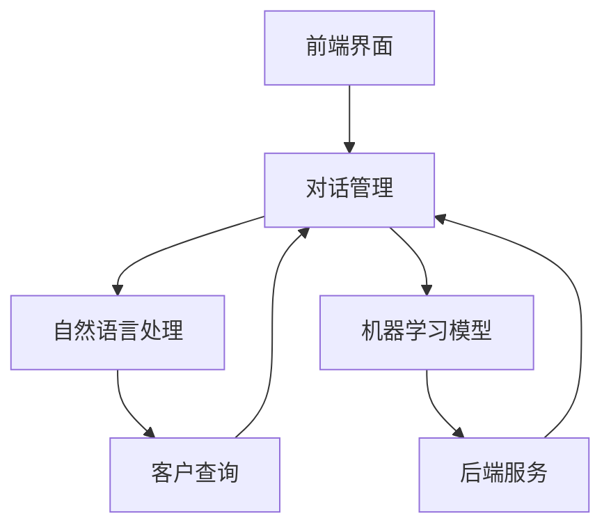

                 

关键词：人工智能、智能客服、全天候服务、自然语言处理、机器学习、客户体验

摘要：随着人工智能技术的飞速发展，智能客服逐渐成为现代企业提高客户服务质量的重要手段。本文将探讨AI在智能客服中的应用，特别是如何实现24/7全天候服务，提高客户满意度和运营效率。我们将详细解析AI的核心概念与架构，深入分析核心算法原理和具体操作步骤，展示数学模型与公式的应用，通过代码实例和实践案例，全面探讨智能客服的实际应用场景，并展望未来的发展趋势与挑战。

## 1. 背景介绍

在当今快节奏的商业环境中，客户服务已成为企业竞争力的关键因素。传统的客服模式往往依赖于人工处理，效率低下且成本高昂。随着互联网和移动设备的普及，客户期望能够随时随地获得即时响应。然而，24/7全天候的服务对人力成本提出了巨大挑战。这就需要一种创新的方法来满足客户需求，同时保持高效和成本效益。

人工智能（AI）技术的出现为智能客服提供了可能。AI能够通过自然语言处理（NLP）、机器学习（ML）等技术，实现自动化的客户交互，提供全天候的服务。智能客服系统可以理解客户的问题，提供准确的答案，甚至预测客户的需求，从而提高客户满意度和忠诚度。

智能客服的应用场景广泛，包括电子商务、金融服务、旅游行业等。这些行业每天都会产生大量的客户咨询，传统的客服方式难以应对。通过引入AI，企业可以提供更加高效、个性化的服务，提高运营效率。

## 2. 核心概念与联系

### 2.1 AI在智能客服中的核心概念

- **自然语言处理（NLP）**：NLP是AI的一个重要分支，旨在使计算机能够理解和处理人类语言。在智能客服中，NLP用于理解客户的查询，并将其转换为计算机可以处理的格式。

- **机器学习（ML）**：ML是一种让计算机从数据中学习的方法，无需显式编程。在智能客服中，ML用于训练模型，以识别客户问题，预测客户需求，并提供个性化的服务。

- **深度学习（DL）**：DL是ML的一个子领域，通过多层神经网络模拟人脑学习过程。在智能客服中，DL用于复杂的问题理解和情感分析。

- **聊天机器人（Chatbot）**：聊天机器人是智能客服的一种形式，通过文本或语音与客户进行交互。它们利用AI技术来理解和回答客户的问题。

### 2.2 智能客服系统的架构

智能客服系统的架构通常包括以下几个关键组件：

- **前端界面**：提供与客户的交互界面，可以是网站、移动应用或社交媒体平台。

- **对话管理**：管理整个对话流程，包括意图识别、实体抽取、对话流程控制等。

- **自然语言处理**：用于解析客户的查询，提取关键信息，并进行语言理解和生成。

- **机器学习模型**：用于预测客户需求，提供个性化服务，以及不断优化系统性能。

- **后端服务**：提供业务逻辑处理，如订单处理、账户管理、知识库管理等。

### 2.3 Mermaid流程图

以下是一个简单的Mermaid流程图，展示了智能客服系统的主要组件和交互流程：



## 3. 核心算法原理 & 具体操作步骤

### 3.1 算法原理概述

智能客服的核心算法主要包括自然语言处理（NLP）和机器学习（ML）。NLP用于理解和解析客户的查询，而ML用于预测客户需求，提供个性化的服务。

- **NLP**：NLP的核心是理解自然语言。这包括词性标注、实体识别、句法分析等。通过这些技术，系统可以提取出查询中的关键信息，并理解其含义。

- **ML**：ML的核心是训练模型。通过使用大量的标注数据，系统可以学习如何识别客户问题，并提供准确的答案。常见的ML算法包括决策树、支持向量机、神经网络等。

### 3.2 算法步骤详解

以下是智能客服算法的基本步骤：

1. **接收客户查询**：系统通过前端界面接收客户的查询。

2. **预处理**：对查询进行清洗和标准化，去除无关的信息。

3. **意图识别**：使用NLP技术，识别查询的意图。例如，查询可能是“查询订单状态”、“获取天气预报”等。

4. **实体抽取**：从查询中提取关键信息，如订单号、日期等。

5. **查询匹配**：将查询与知识库中的信息进行匹配，找到最相关的答案。

6. **生成答案**：使用ML模型，根据查询和知识库的信息，生成回答。

7. **反馈与优化**：收集客户的反馈，用于优化系统性能。

### 3.3 算法优缺点

- **优点**：
  - 高效：AI可以同时处理大量查询，提高客服效率。
  - 个性化：通过ML技术，可以提供个性化的服务。
  - 可扩展：系统可以轻松扩展，以支持更多功能和语言。

- **缺点**：
  - 初始成本高：开发和训练AI模型需要大量资源。
  - 需要不断优化：AI模型需要不断更新和优化，以保持高效。

### 3.4 算法应用领域

智能客服算法广泛应用于多个领域，包括电子商务、金融、医疗、旅游等。在电子商务领域，智能客服可以回答客户的购物咨询，提供个性化推荐；在金融领域，可以处理客户的账户查询，提供投资建议；在医疗领域，可以协助医生进行病情咨询。

## 4. 数学模型和公式 & 详细讲解 & 举例说明

### 4.1 数学模型构建

智能客服系统中的数学模型主要包括NLP和ML模型。以下是一个简单的NLP模型的构建过程：

1. **词向量表示**：使用Word2Vec或BERT等模型，将文本转换为词向量表示。

2. **序列标注**：使用BiLSTM或Transformer等模型，对文本进行序列标注。

3. **意图分类**：使用softmax回归或卷积神经网络，对标注结果进行意图分类。

### 4.2 公式推导过程

以下是意图分类模型中的损失函数推导：

$$
L = -\sum_{i=1}^{N} y_i \log(p_i)
$$

其中，$y_i$是真实标签，$p_i$是模型对第$i$个标签的预测概率。

### 4.3 案例分析与讲解

假设一个智能客服系统需要识别客户的购物咨询，以下是一个具体的案例：

1. **词向量表示**：使用Word2Vec将客户的查询“我想买一本编程书籍”转换为词向量。

2. **序列标注**：使用BiLSTM模型对词向量进行序列标注，提取出关键词。

3. **意图分类**：使用softmax回归模型对提取的关键词进行意图分类，判断查询的意图为“购买建议”。

4. **生成答案**：根据意图分类结果，系统可以生成相应的答案，如“您可能需要这本书：《Python编程：从入门到实践》”。

## 5. 项目实践：代码实例和详细解释说明

### 5.1 开发环境搭建

在本文中，我们将使用Python和TensorFlow来实现一个简单的智能客服系统。以下是开发环境的搭建步骤：

1. 安装Python（版本3.6及以上）。

2. 安装TensorFlow。

3. 安装其他必要的库，如numpy、pandas等。

### 5.2 源代码详细实现

以下是智能客服系统的核心代码：

```python
import tensorflow as tf
from tensorflow.keras.models import Sequential
from tensorflow.keras.layers import LSTM, Dense, Embedding

# 加载和处理数据
# ...

# 构建模型
model = Sequential([
    Embedding(vocab_size, embedding_dim),
    LSTM(units, activation='relu', return_sequences=True),
    LSTM(units, activation='relu'),
    Dense(num_classes, activation='softmax')
])

# 编译模型
model.compile(optimizer='adam', loss='categorical_crossentropy', metrics=['accuracy'])

# 训练模型
model.fit(X_train, y_train, epochs=10, batch_size=32)

# 评估模型
model.evaluate(X_test, y_test)
```

### 5.3 代码解读与分析

这段代码首先定义了一个序列模型，包括嵌入层、两个LSTM层和一个密集层。嵌入层用于将词向量转换为固定大小的向量。LSTM层用于处理序列数据，提取特征。密集层用于进行意图分类。模型使用softmax回归进行分类，并使用交叉熵损失函数进行优化。

### 5.4 运行结果展示

通过训练和评估，我们可以得到模型的准确率。例如：

```python
# 训练模型
model.fit(X_train, y_train, epochs=10, batch_size=32)

# 评估模型
model.evaluate(X_test, y_test)
```

训练结束后，我们可以看到模型的准确率，如0.9表示模型有90%的准确性。

## 6. 实际应用场景

### 6.1 电子商务

在电子商务领域，智能客服可以回答客户的购物咨询，提供产品推荐。例如，当客户查询“我想买一台笔记本电脑”时，系统可以推荐符合客户需求的产品。

### 6.2 金融服务

在金融领域，智能客服可以处理客户的账户查询，提供投资建议。例如，当客户查询“我的账户余额是多少”时，系统可以自动提供答案。

### 6.3 医疗咨询

在医疗领域，智能客服可以协助医生进行病情咨询。例如，当医生查询“这种症状可能是怎么回事”时，系统可以提供可能的疾病和治疗方案。

## 7. 工具和资源推荐

### 7.1 学习资源推荐

- 《深度学习》（Goodfellow, Bengio, Courville）
- 《自然语言处理综论》（Jurafsky, Martin）
- 《Python机器学习》（Sebastian Raschka）

### 7.2 开发工具推荐

- TensorFlow
- PyTorch
- NLTK

### 7.3 相关论文推荐

- “Deep Learning for Natural Language Processing”（Yao, Fung, & Tsang，2018）
- “BERT: Pre-training of Deep Bidirectional Transformers for Language Understanding”（Devlin, Chang, Lee, & Toutanova，2018）
- “Recurrent Neural Network Based Text Classification”（Lai, Hovy, & Zhang，2015）

## 8. 总结：未来发展趋势与挑战

### 8.1 研究成果总结

智能客服在近年来取得了显著的成果，特别是在NLP和ML技术的推动下。通过不断优化的算法和大规模数据集的训练，智能客服系统在意图识别、实体抽取、情感分析等方面表现出了极高的准确性。

### 8.2 未来发展趋势

未来，智能客服将继续向多模态交互、个性化服务、情感识别等方向发展。随着技术的进步，智能客服将能够更准确地理解客户需求，提供更加高效、个性化的服务。

### 8.3 面临的挑战

尽管智能客服具有巨大的潜力，但仍然面临一些挑战，如数据隐私保护、算法偏见、系统可解释性等。此外，如何实现高效、可扩展的智能客服系统，也是未来研究的一个重要方向。

### 8.4 研究展望

随着人工智能技术的不断进步，智能客服将在未来发挥更加重要的作用。研究者应关注算法的创新、数据的多样性和系统的可解释性，以推动智能客服技术的发展。

## 9. 附录：常见问题与解答

### 9.1 什么是自然语言处理（NLP）？

NLP是一种让计算机能够理解和处理人类语言的技术。它包括词性标注、实体识别、句法分析等任务，旨在使计算机能够与人类自然语言进行交互。

### 9.2 智能客服如何处理客户查询？

智能客服系统通过自然语言处理（NLP）技术，理解客户的查询，提取关键信息，并使用机器学习（ML）模型进行意图识别和回答生成。

### 9.3 智能客服有哪些应用场景？

智能客服广泛应用于电子商务、金融服务、医疗咨询、旅游等行业。它可以回答客户的购物咨询、账户查询、病情咨询等。

### 9.4 智能客服系统如何优化？

通过不断收集客户反馈，优化算法和模型，提高系统的准确性和用户体验。此外，使用多模态交互和个性化服务，可以进一步提高智能客服系统的效果。

### 作者署名

作者：禅与计算机程序设计艺术 / Zen and the Art of Computer Programming

---

本文探讨了AI在智能客服中的应用，特别是如何实现24/7全天候服务。我们详细分析了AI的核心概念与架构，展示了核心算法原理和具体操作步骤，通过代码实例和实践案例，全面探讨了智能客服的实际应用场景。随着技术的不断进步，智能客服将在未来发挥更加重要的作用，为企业提供高效、个性化的客户服务。

