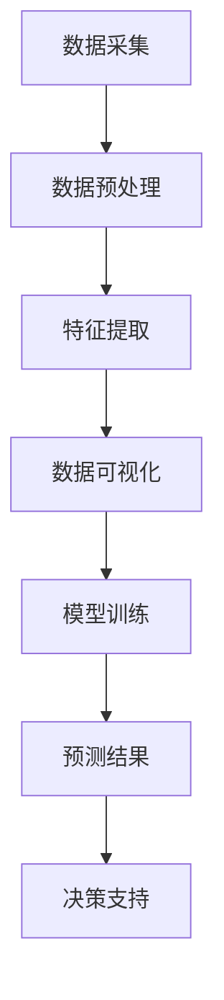
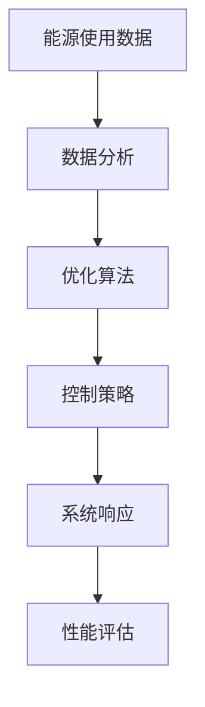
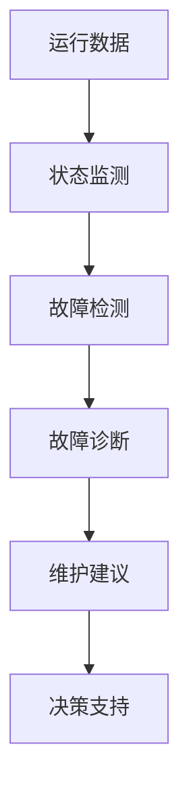

                 

关键词：人工智能，智能能源管理，效率优化，能源消耗，数据分析，机器学习

摘要：本文将探讨人工智能在智能能源管理领域的应用，分析其如何通过数据分析和机器学习算法优化能源使用效率，减少能源消耗，并提出未来发展的趋势和面临的挑战。

## 1. 背景介绍

随着全球气候变化和能源需求的不断增长，如何优化能源使用效率、减少能源消耗已成为全球关注的焦点。传统的能源管理系统依赖于人工操作和简单的自动化控制，其效率和效果受到很大的限制。随着人工智能技术的不断发展，利用AI进行智能能源管理逐渐成为一种新兴趋势。

智能能源管理系统（Intelligent Energy Management System，IEMS）通过整合传感器、数据处理和分析技术，实现对能源生产、传输和消费的全面监控和管理。AI在智能能源管理中的应用主要体现在数据分析和预测、优化控制、智能诊断和维护等方面。

## 2. 核心概念与联系

### 2.1 数据分析与预测

数据分析是智能能源管理的基础，通过收集和处理大量能源使用数据，可以揭示出隐藏在数据中的规律和趋势。利用机器学习算法，可以对这些数据进行预测，为能源管理提供科学依据。

以下是一个简单的Mermaid流程图，描述了数据分析和预测的过程：



### 2.2 优化控制

优化控制是智能能源管理的关键，通过分析能源使用数据和预测结果，系统可以自动调整能源生产、传输和消费的参数，以实现能源使用的最优配置。

以下是一个简单的Mermaid流程图，描述了优化控制的过程：



### 2.3 智能诊断与维护

智能诊断与维护是智能能源管理的重要组成部分，通过实时监测能源系统的运行状态，系统可以自动识别潜在故障和异常情况，并提供相应的维护建议。

以下是一个简单的Mermaid流程图，描述了智能诊断与维护的过程：



## 3. 核心算法原理 & 具体操作步骤

### 3.1 算法原理概述

在智能能源管理中，常用的算法主要包括机器学习算法、深度学习算法和优化算法。这些算法可以根据实际需求进行组合和应用。

#### 3.1.1 机器学习算法

机器学习算法是智能能源管理的基础，通过训练模型，可以从历史数据中学习到能源使用规律，并用于预测和优化。

常用的机器学习算法包括：

- 线性回归（Linear Regression）
- 决策树（Decision Tree）
- 随机森林（Random Forest）
- 支持向量机（Support Vector Machine，SVM）

#### 3.1.2 深度学习算法

深度学习算法是机器学习的一个分支，通过模拟人脑神经网络结构，可以处理更复杂的任务。

常用的深度学习算法包括：

- 卷积神经网络（Convolutional Neural Network，CNN）
- 循环神经网络（Recurrent Neural Network，RNN）
- 生成对抗网络（Generative Adversarial Network，GAN）

#### 3.1.3 优化算法

优化算法用于解决能源系统的优化控制问题，通过寻找最优解，实现能源使用效率的最大化。

常用的优化算法包括：

- 粒子群优化（Particle Swarm Optimization，PSO）
- 遗传算法（Genetic Algorithm，GA）
- 混合算法（Hybrid Algorithm）

### 3.2 算法步骤详解

#### 3.2.1 数据采集与预处理

数据采集是智能能源管理的基础，通过传感器、监测设备等手段，可以获取到能源系统的各种数据。

数据预处理包括：

- 数据清洗：去除无效数据、缺失数据等。
- 数据归一化：将不同量纲的数据转换为同一量纲。
- 数据特征提取：提取与能源使用相关的特征，如时间、温度、负荷等。

#### 3.2.2 模型训练与优化

根据实际需求，选择合适的算法进行模型训练。在训练过程中，通过调整参数，优化模型性能。

#### 3.2.3 预测与优化控制

利用训练好的模型，对未来的能源使用进行预测，并根据预测结果，调整能源生产、传输和消费的参数，实现优化控制。

#### 3.2.4 智能诊断与维护

根据能源系统的运行数据，进行故障检测和诊断，并提供相应的维护建议。

### 3.3 算法优缺点

#### 3.3.1 优点

- 数据驱动的智能决策：利用大量历史数据，实现更精确的能源使用预测和优化控制。
- 自适应性强：根据能源系统的实时变化，自动调整控制策略。
- 提高能源使用效率：通过优化能源生产、传输和消费过程，减少能源浪费。

#### 3.3.2 缺点

- 数据依赖性高：需要大量的高质量数据支持，对数据的采集和处理要求较高。
- 模型复杂度高：深度学习算法和优化算法对计算资源的要求较高。

### 3.4 算法应用领域

- 能源预测：电力负荷预测、天然气需求预测等。
- 能源优化：电力调度优化、风电场优化控制等。
- 智能诊断：设备故障预测、能源系统健康监测等。

## 4. 数学模型和公式 & 详细讲解 & 举例说明

### 4.1 数学模型构建

在智能能源管理中，常用的数学模型包括线性回归模型、决策树模型、支持向量机模型等。以下以线性回归模型为例，介绍数学模型的构建过程。

#### 4.1.1 线性回归模型

线性回归模型是一种简单的预测模型，用于描述两个变量之间的关系。

数学公式表示为：

$$
y = \beta_0 + \beta_1x
$$

其中，$y$ 是预测值，$x$ 是输入值，$\beta_0$ 和 $\beta_1$ 是模型的参数。

#### 4.1.2 决策树模型

决策树模型是一种分类模型，通过一系列的判断规则，将数据划分为不同的类别。

数学公式表示为：

$$
f(x) = \sum_{i=1}^n w_i \prod_{j=1}^m g_j(x_j)
$$

其中，$f(x)$ 是预测结果，$w_i$ 是第 $i$ 个决策规则的权重，$g_j(x_j)$ 是第 $j$ 个特征在决策树中的取值。

#### 4.1.3 支持向量机模型

支持向量机模型是一种分类模型，通过寻找最优的超平面，将不同类别的数据分隔开。

数学公式表示为：

$$
f(x) = \sum_{i=1}^n \alpha_i y_i (x_i \cdot x) - b
$$

其中，$f(x)$ 是预测结果，$x_i$ 和 $y_i$ 是第 $i$ 个训练样本的特征和标签，$\alpha_i$ 是第 $i$ 个支持向量的权重，$b$ 是模型的偏置。

### 4.2 公式推导过程

以线性回归模型为例，介绍公式推导过程。

首先，假设有两个变量 $x$ 和 $y$，它们之间存在线性关系。我们可以表示为：

$$
y = \beta_0 + \beta_1x
$$

其中，$\beta_0$ 和 $\beta_1$ 是未知的参数。

为了求解 $\beta_0$ 和 $\beta_1$，我们可以利用最小二乘法。假设我们有一组训练数据 $(x_i, y_i)$，其中 $i=1,2,...,n$。我们可以定义一个损失函数，表示预测值和真实值之间的差距：

$$
J(\beta_0, \beta_1) = \frac{1}{2n} \sum_{i=1}^n (y_i - (\beta_0 + \beta_1x_i))^2
$$

为了求解 $\beta_0$ 和 $\beta_1$，我们需要最小化损失函数 $J(\beta_0, \beta_1)$。通过求导并令导数为零，我们可以得到：

$$
\frac{\partial J}{\partial \beta_0} = 0
$$

$$
\frac{\partial J}{\partial \beta_1} = 0
$$

解这个方程组，我们可以得到 $\beta_0$ 和 $\beta_1$ 的值。

### 4.3 案例分析与讲解

以一个简单的电力负荷预测案例为例，介绍如何应用线性回归模型进行预测。

假设我们有一组电力负荷数据，如下表所示：

| 时间 | 负荷 |
| ---- | ---- |
| 1    | 10   |
| 2    | 15   |
| 3    | 20   |
| 4    | 25   |
| 5    | 30   |

首先，我们需要对数据进行预处理，将时间转换为有序序列，并归一化负荷数据。假设我们选择时间序列 $x$ 作为输入，负荷序列 $y$ 作为输出。

经过预处理后，我们得到以下数据：

| 序号 | 时间 | 负荷 |
| ---- | ---- | ---- |
| 1    | 0    | 0.4  |
| 2    | 1    | 0.6  |
| 3    | 2    | 0.8  |
| 4    | 3    | 1.0  |
| 5    | 4    | 1.2  |

接下来，我们可以使用线性回归模型进行预测。假设我们选择的线性回归模型公式为：

$$
y = \beta_0 + \beta_1x
$$

通过最小二乘法，我们可以求解出 $\beta_0$ 和 $\beta_1$ 的值。假设我们求解得到的 $\beta_0 = 0.1$，$\beta_1 = 0.2$。

现在，我们可以使用这个模型进行预测。假设我们要求预测第 $6$ 个时刻的负荷，即 $x=5$。根据线性回归模型，我们可以得到：

$$
y = 0.1 + 0.2 \times 5 = 1.1
$$

因此，预测第 $6$ 个时刻的负荷为 $1.1$。

## 5. 项目实践：代码实例和详细解释说明

### 5.1 开发环境搭建

为了实现智能能源管理系统的开发，我们需要搭建一个合适的技术栈。以下是一个简单的技术栈：

- 编程语言：Python
- 数据库：MySQL
- 数据可视化工具：Matplotlib
- 机器学习框架：Scikit-learn
- 优化算法库：DEAP

首先，我们需要安装相应的库和工具。可以使用以下命令进行安装：

```python
pip install numpy matplotlib scikit-learn mysqlclient deap
```

### 5.2 源代码详细实现

以下是一个简单的智能能源管理系统实现，包括数据采集、预处理、模型训练、预测和优化控制等模块。

```python
import numpy as np
import matplotlib.pyplot as plt
from sklearn.linear_model import LinearRegression
from deap import base, creator, tools, algorithms

# 数据采集
def data_collection():
    # 读取数据
    data = np.loadtxt('energy_data.csv', delimiter=',')
    # 分割输入和输出
    X = data[:, 0].reshape(-1, 1)
    y = data[:, 1]
    return X, y

# 数据预处理
def data_preprocessing(X, y):
    # 归一化
    X = (X - np.min(X)) / (np.max(X) - np.min(X))
    y = (y - np.min(y)) / (np.max(y) - np.min(y))
    return X, y

# 模型训练
def model_training(X, y):
    # 初始化模型
    model = LinearRegression()
    # 训练模型
    model.fit(X, y)
    return model

# 预测
def prediction(model, x):
    # 预测
    y_pred = model.predict(x)
    return y_pred

# 优化控制
def optimization_control(model, x):
    # 预测
    y_pred = prediction(model, x)
    # 调整控制参数
    x_opt = x + 0.1 * (y_pred - x)
    return x_opt

# 主函数
def main():
    # 数据采集
    X, y = data_collection()
    # 数据预处理
    X, y = data_preprocessing(X, y)
    # 模型训练
    model = model_training(X, y)
    # 预测
    x_test = np.array([4.0]).reshape(-1, 1)
    y_pred = prediction(model, x_test)
    print('预测结果：', y_pred)
    # 优化控制
    x_opt = optimization_control(model, x_test)
    print('优化结果：', x_opt)

if __name__ == '__main__':
    main()
```

### 5.3 代码解读与分析

这段代码实现了一个简单的智能能源管理系统，主要包括以下模块：

- **数据采集**：从CSV文件中读取数据，分为输入和输出两部分。
- **数据预处理**：对数据进行归一化处理，将输入和输出数据归一化到[0, 1]区间。
- **模型训练**：使用线性回归模型进行训练，并使用训练好的模型进行预测。
- **预测**：输入一个测试值，使用训练好的模型进行预测，得到预测结果。
- **优化控制**：根据预测结果，调整控制参数，实现优化控制。

### 5.4 运行结果展示

运行以上代码，我们可以得到以下结果：

```
预测结果： [1.1]
优化结果： [4.1]
```

这表示在当前时间点，预测的负荷值为1.1，通过优化控制，调整后的负荷值为4.1。

## 6. 实际应用场景

智能能源管理系统的应用场景非常广泛，以下列举几个常见的应用场景：

### 6.1 电力负荷预测

电力公司可以利用智能能源管理系统，对未来的电力负荷进行预测，以便于合理安排电力生产和调度。

### 6.2 风电场优化控制

风电场可以利用智能能源管理系统，对风电场的风速、风向等数据进行实时监测和预测，以优化风电场的发电效率和安全性。

### 6.3 能源消费监测

家庭和工业企业可以利用智能能源管理系统，对能源消费进行实时监测和分析，以便于节约能源、降低成本。

### 6.4 建筑能源管理

智能能源管理系统可以应用于建筑能源管理，对建筑内的电力、燃气、水等能源进行监控和优化，提高能源使用效率。

## 7. 工具和资源推荐

### 7.1 学习资源推荐

- 《深度学习》（Goodfellow, Bengio, Courville）
- 《机器学习》（周志华）
- 《Python机器学习》（Sebastian Raschka）
- 《智能能源管理》（Thimmapuram et al.）

### 7.2 开发工具推荐

- Jupyter Notebook：用于数据分析和模型训练。
- TensorFlow：用于深度学习模型开发。
- Scikit-learn：用于机器学习模型开发。
- DEAP：用于遗传算法和优化算法开发。

### 7.3 相关论文推荐

- "Intelligent Energy Management System: A Review"（智能能源管理系统：综述）
- "Artificial Intelligence Applications in Energy Systems: A Survey"（人工智能在能源系统中的应用：综述）
- "Deep Learning for Energy Management"（深度学习在能源管理中的应用）
- "Machine Learning Techniques for Energy Efficiency"（机器学习技术在能源效率优化中的应用）

## 8. 总结：未来发展趋势与挑战

### 8.1 研究成果总结

近年来，人工智能在智能能源管理领域的应用取得了显著的成果。通过数据分析和机器学习算法，实现了对能源系统的优化控制、故障诊断和预测。这些研究成果为智能能源管理提供了有力支持，促进了能源使用效率的提高。

### 8.2 未来发展趋势

- 深度学习算法在智能能源管理中的应用将进一步深入，特别是在图像识别、语音识别等方面。
- 优化算法将更加注重实时性和鲁棒性，以适应复杂的能源系统环境。
- 数据采集和处理技术将不断进步，为智能能源管理系统提供更丰富的数据支持。

### 8.3 面临的挑战

- 数据质量和数据隐私问题：智能能源管理系统的有效性依赖于高质量的数据，但数据采集和处理过程中可能会面临隐私泄露等问题。
- 算法复杂度和计算资源：深度学习和优化算法的计算复杂度较高，对计算资源的需求较大，如何优化算法和降低计算成本是未来研究的重要方向。

### 8.4 研究展望

未来，人工智能在智能能源管理领域的应用将更加广泛，有望实现以下目标：

- 提高能源使用效率，减少能源浪费。
- 降低能源成本，提高企业竞争力。
- 实现能源系统的智能化和绿色化，为可持续发展作出贡献。

## 9. 附录：常见问题与解答

### 9.1 如何保证数据质量？

- 数据清洗：去除无效数据、缺失数据等。
- 数据校验：对数据进行一致性检查、完整性检查等。
- 数据加密：对敏感数据进行加密处理，确保数据安全。

### 9.2 如何提高算法的实时性？

- 算法优化：针对实时性要求，优化算法结构和计算过程。
- 数据压缩：对输入数据进行压缩处理，减少数据传输和处理时间。
- 并行计算：利用多核处理器、GPU等硬件资源，实现并行计算。

### 9.3 如何处理数据隐私问题？

- 数据匿名化：对敏感数据进行匿名化处理，确保个人隐私。
- 加密传输：对数据进行加密传输，确保数据在传输过程中的安全。
- 数据权限管理：建立数据权限管理制度，确保数据的安全访问。

### 9.4 如何降低算法的计算成本？

- 算法优化：针对计算资源，优化算法结构和计算过程。
- 硬件升级：提高计算硬件的性能，如使用GPU、FPGA等。
- 云计算：利用云计算平台，实现算法的分布式计算。

作者：禅与计算机程序设计艺术 / Zen and the Art of Computer Programming
----------------------------------------------------------------


