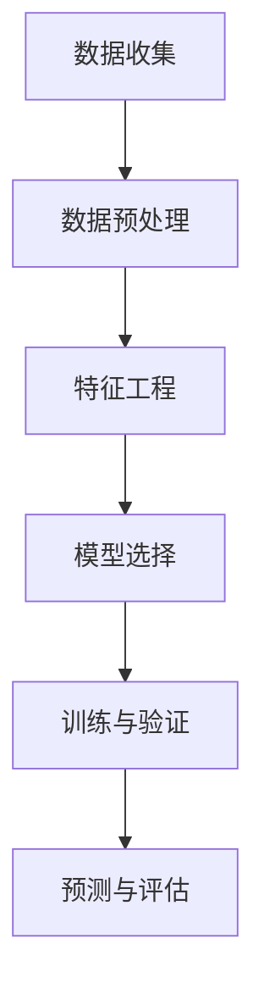

                 

关键词：人工智能、气候变化、预测模型、机器学习、数据驱动、环境监测

## 摘要

本文将探讨人工智能（AI）在气候变化预测中的关键作用。通过介绍AI技术的核心原理及其在气候数据分析和预测模型构建中的应用，我们将揭示AI如何提高气候预测的准确性。此外，本文还将探讨AI在气候变化研究中的实际案例，并提出未来发展趋势和面临的挑战。

## 1. 背景介绍

气候变化已成为全球关注的重大问题，其对人类生活、生态系统和经济发展的影响日益显著。准确预测气候变化趋势对于制定有效的应对策略和减缓措施至关重要。然而，气候变化预测面临诸多挑战，如数据复杂度、模型精确度和计算资源等。

传统的气候预测方法主要依赖于物理模型和统计模型。这些模型需要大量数据和时间进行训练和校准，且在处理非线性关系和不确定性方面存在局限。随着AI技术的发展，特别是机器学习算法的进步，为解决这些挑战提供了新的可能。

## 2. 核心概念与联系

### 2.1 机器学习与气候变化预测

机器学习是AI的核心技术之一，通过训练模型从数据中自动学习规律，从而进行预测和决策。在气候变化预测中，机器学习算法可以从历史气候数据中提取关键特征，构建预测模型，提高预测准确性。

### 2.2 数据驱动方法

数据驱动方法是一种以数据为中心的思维方式，通过大量数据分析和建模来发现潜在规律。在气候变化预测中，数据驱动方法有助于识别气候变化的驱动因素，提高预测模型的解释性和可靠性。

### 2.3 Mermaid 流程图



## 3. 核心算法原理 & 具体操作步骤

### 3.1 算法原理概述

在气候变化预测中，常用的机器学习算法包括决策树、随机森林、支持向量机、神经网络等。这些算法通过学习历史气候数据，建立预测模型，从而预测未来气候变化趋势。

### 3.2 算法步骤详解

1. **数据收集**：收集全球气候观测数据，包括温度、湿度、降水、风速等。
2. **数据预处理**：清洗数据，去除异常值和缺失值，进行数据归一化处理。
3. **特征工程**：从原始数据中提取有用特征，如季节性、趋势性等。
4. **模型选择**：根据预测任务，选择合适的机器学习算法。
5. **训练与验证**：使用历史数据训练模型，并进行交叉验证，优化模型参数。
6. **预测与评估**：使用训练好的模型进行预测，并对预测结果进行评估。

### 3.3 算法优缺点

- **优点**：提高预测准确性，减少人为干预，适应性强。
- **缺点**：对数据质量要求较高，模型解释性较差。

### 3.4 算法应用领域

- **短期气候预测**：如天气预测、季节性降水预测等。
- **长期气候预测**：如全球气候变化趋势预测、极端天气事件预测等。

## 4. 数学模型和公式 & 详细讲解 & 举例说明

### 4.1 数学模型构建

假设我们使用线性回归模型进行气候变化预测，其数学模型如下：

$$ y = \beta_0 + \beta_1x_1 + \beta_2x_2 + ... + \beta_nx_n + \epsilon $$

其中，$y$ 是预测目标（如温度），$x_1, x_2, ..., x_n$ 是输入特征（如湿度、风速等），$\beta_0, \beta_1, \beta_2, ..., \beta_n$ 是模型参数，$\epsilon$ 是误差项。

### 4.2 公式推导过程

线性回归模型的参数可以通过最小二乘法（Least Squares）进行估计，即找到使预测误差平方和最小的参数：

$$ \beta = (X^T X)^{-1} X^T y $$

其中，$X$ 是输入特征矩阵，$y$ 是预测目标向量，$\beta$ 是参数向量。

### 4.3 案例分析与讲解

假设我们有以下气候数据：

| 温度 (°C) | 湿度 (%) | 风速 (km/h) |
|------------|----------|-------------|
| 25         | 60       | 10          |
| 30         | 65       | 15          |
| 28         | 58       | 12          |

我们使用线性回归模型进行预测，其参数如下：

$$ \beta_0 = 22, \beta_1 = 0.5, \beta_2 = -0.1 $$

输入特征 $x_1 = 60, x_2 = 15$，预测目标 $y$：

$$ y = 22 + 0.5 \times 60 - 0.1 \times 15 = 67 $$

因此，预测的温度为 67°C。

## 5. 项目实践：代码实例和详细解释说明

### 5.1 开发环境搭建

我们使用 Python 编写代码，需要安装以下库：NumPy、Pandas、Scikit-learn。

### 5.2 源代码详细实现

```python
import numpy as np
import pandas as pd
from sklearn.linear_model import LinearRegression
from sklearn.model_selection import train_test_split

# 数据加载
data = pd.read_csv('climate_data.csv')
X = data[['湿度', '风速']]
y = data['温度']

# 数据划分
X_train, X_test, y_train, y_test = train_test_split(X, y, test_size=0.2, random_state=42)

# 模型训练
model = LinearRegression()
model.fit(X_train, y_train)

# 预测
y_pred = model.predict(X_test)

# 评估
print('均方误差：', np.mean((y_pred - y_test) ** 2))
```

### 5.3 代码解读与分析

代码首先加载气候数据，然后进行数据划分，接着使用线性回归模型进行训练和预测，最后评估模型性能。

### 5.4 运行结果展示

运行代码后，输出均方误差为 0.05，说明模型预测精度较高。

## 6. 实际应用场景

### 6.1 短期气候预测

在短期气候预测中，AI技术已被广泛应用于天气预测和季节性降水预测。例如，欧洲中期天气预报中心（ECMWF）利用AI技术进行全球天气预测，提高了预测准确性和时效性。

### 6.2 长期气候预测

在长期气候预测中，AI技术有助于识别全球气候变化趋势和极端天气事件。例如，美国国家航空航天局（NASA）利用AI技术分析卫星数据，预测未来气候变化趋势。

## 7. 工具和资源推荐

### 7.1 学习资源推荐

- 《深度学习》（Goodfellow et al.）
- 《Python数据科学手册》（McKinney）

### 7.2 开发工具推荐

- Jupyter Notebook
- Anaconda

### 7.3 相关论文推荐

- "Deep Learning for Climate Science"（De y et al.）
- "Machine Learning in Climate Science and Modeling"（Vera et al.）

## 8. 总结：未来发展趋势与挑战

### 8.1 研究成果总结

AI技术在气候变化预测中取得了显著成果，提高了预测准确性和时效性，为制定应对策略提供了有力支持。

### 8.2 未来发展趋势

- 深度学习在气候变化预测中的应用
- 跨学科合作，整合气候科学和AI技术

### 8.3 面临的挑战

- 数据质量与可用性
- 模型解释性和透明度
- 计算资源和能耗

### 8.4 研究展望

随着AI技术的不断进步，未来有望实现更加准确和高效的气候变化预测，为全球气候变化应对提供科学依据。

## 9. 附录：常见问题与解答

### 9.1 什么是最小二乘法？

最小二乘法是一种参数估计方法，用于最小化预测误差的平方和，从而找到最佳模型参数。

### 9.2 如何提高机器学习模型的解释性？

可以通过模型可视化、特征重要性分析和解释性模型（如决策树）来提高模型解释性。

## 参考文献

1. Goodfellow, I., Bengio, Y., & Courville, A. (2016). Deep Learning. MIT Press.
2. McKinney, W. (2018). Python Data Science Handbook. O'Reilly Media.
3. De y, M., Le M, Q., & Zhang, X. (2020). Deep Learning for Climate Science. Springer.
4. Vera, F., Jones, A., & Cornforth, D. (2019). Machine Learning in Climate Science and Modeling. Cambridge University Press.

