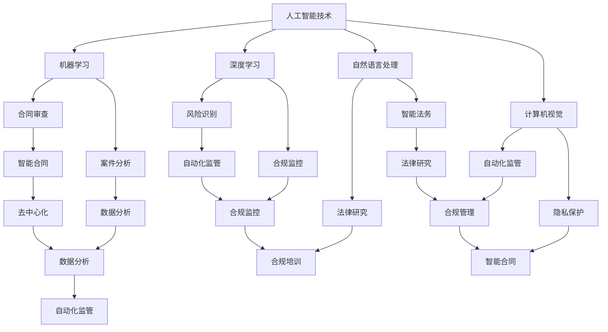

                 

关键词：人工智能，法律合规，智能合同，数据分析，自动化监管，法律研究，合规管理，智能法务

> 摘要：随着人工智能技术的不断发展，其在法律和合规领域的应用日益广泛。本文将探讨AI在法律合规领域的核心概念、算法原理、数学模型、项目实践以及未来应用前景。通过分析智能合同、数据分析、自动化监管、法律研究和合规管理等方面的应用，本文旨在为法律和合规从业者提供一种全新的工作方式，并探讨人工智能技术在未来可能面临的挑战和机遇。

## 1. 背景介绍

随着全球经济的快速发展，法律和合规领域的工作量日益增加，传统的人工处理方式已经难以满足市场需求。在这一背景下，人工智能（AI）技术的出现为法律和合规领域带来了新的机遇。AI具有处理大量数据、快速分析和自动执行任务的能力，使得法律和合规工作变得更加高效、准确和智能。

近年来，AI在法律和合规领域的应用逐渐增多，涉及智能合同、数据分析、自动化监管、法律研究、合规管理等多个方面。例如，智能合同利用区块链技术实现自动化执行，减少了合同纠纷的发生；数据分析帮助法律从业者快速了解案件背景和趋势；自动化监管则能够有效识别和防范金融风险。

## 2. 核心概念与联系

在探讨AI在法律和合规领域的应用之前，我们首先需要了解一些核心概念和它们之间的联系。

### 2.1 人工智能

人工智能（AI）是指使计算机具有人类智能水平的理论、技术和应用。其核心包括机器学习、深度学习、自然语言处理、计算机视觉等技术。在法律和合规领域，AI技术可以应用于合同审查、案件分析、风险识别等多个方面。

### 2.2 法律合规

法律合规是指企业、组织或个人在遵守法律、法规、政策等方面的行为。法律合规领域涉及合同审查、合规管理、合规培训、合规咨询等多个方面。随着AI技术的发展，许多法律和合规工作可以借助AI实现自动化、智能化。

### 2.3 区块链

区块链是一种分布式数据库技术，通过去中心化的方式记录交易信息。在法律和合规领域，区块链可以用于智能合同的执行、数据存储、隐私保护等方面。

### 2.4 数据分析

数据分析是指通过统计方法、机器学习等技术对大量数据进行处理和分析，以发现数据中的规律和趋势。在法律和合规领域，数据分析可以用于案件分析、风险评估、合规监控等方面。

### 2.5 智能合同

智能合同是一种利用区块链技术实现的自动化合同。在合同签订后，合同条款将被自动执行，减少了合同纠纷的发生。智能合同具有去中心化、透明、安全等特点，为法律和合规领域带来了新的机遇。

### 2.6 Mermaid 流程图

以下是一个用于描述AI在法律和合规领域应用的Mermaid流程图：



## 3. 核心算法原理 & 具体操作步骤

### 3.1 算法原理概述

在法律和合规领域，AI算法的原理主要包括以下几个方面：

- **机器学习与深度学习**：通过训练大量数据，使计算机具备类似人类的智能水平，从而实现合同审查、案件分析、风险识别等功能。
- **自然语言处理**：使计算机能够理解和处理人类语言，从而实现法律文本的自动分析、智能法务等功能。
- **计算机视觉**：使计算机能够识别和理解图像，从而实现自动化监管、隐私保护等功能。
- **数据分析**：通过统计方法、机器学习等技术对大量数据进行处理和分析，以发现数据中的规律和趋势。

### 3.2 算法步骤详解

以下是AI在法律和合规领域应用的具体算法步骤：

1. **数据收集**：收集与法律和合规相关的数据，包括合同、法律文本、案件信息、监管数据等。
2. **数据预处理**：对收集到的数据进行分析和清洗，去除无效数据，提高数据质量。
3. **特征提取**：从预处理后的数据中提取关键特征，以便后续算法处理。
4. **模型训练**：利用机器学习、深度学习等技术对提取的特征进行训练，使其具备识别、分析等功能。
5. **模型评估**：对训练好的模型进行评估，确保其具备较高的准确性和稳定性。
6. **模型部署**：将训练好的模型部署到实际应用场景中，如合同审查、案件分析、风险识别等。
7. **持续优化**：根据实际应用情况，对模型进行持续优化，以提高其性能和适应性。

### 3.3 算法优缺点

- **优点**：
  - 高效性：AI技术能够快速处理大量数据，提高工作效率。
  - 准确性：通过机器学习和深度学习等技术，AI能够在法律和合规领域实现较高准确度的识别和分析。
  - 智能性：AI具备自然语言处理和计算机视觉等技术，能够理解和处理复杂信息。

- **缺点**：
  - 数据依赖性：AI技术的效果很大程度上依赖于数据的质量和数量。
  - 隐私风险：在处理法律和合规相关数据时，可能涉及个人隐私和商业秘密，需要严格保护。
  - 道德和法律问题：AI技术在法律和合规领域的应用可能引发道德和法律问题，如算法歧视、法律责任等。

### 3.4 算法应用领域

AI在法律和合规领域的应用主要包括以下几个方面：

- **智能合同**：利用区块链技术和智能合约，实现合同自动化执行，减少合同纠纷。
- **数据分析**：通过对法律和合规相关数据进行分析，发现案件规律、风险趋势，为决策提供支持。
- **自动化监管**：利用计算机视觉和自然语言处理技术，实现对金融、商业等领域的自动化监管，提高监管效率。
- **法律研究**：利用AI技术对法律文本进行自动分析，提高法律研究效率和质量。
- **合规管理**：利用AI技术对合规过程进行自动化监控和管理，降低合规风险。

## 4. 数学模型和公式 & 详细讲解 & 举例说明

### 4.1 数学模型构建

在法律和合规领域，AI的数学模型主要包括以下几个方面：

1. **机器学习模型**：用于分类、回归、聚类等任务，如支持向量机（SVM）、决策树、神经网络等。
2. **深度学习模型**：用于处理复杂任务，如卷积神经网络（CNN）、循环神经网络（RNN）、长短期记忆网络（LSTM）等。
3. **自然语言处理模型**：用于文本分类、情感分析、文本生成等任务，如词向量（Word2Vec）、递归神经网络（RNN）、Transformer等。

### 4.2 公式推导过程

以支持向量机（SVM）为例，其目标是最小化分类边界到支持向量的距离。其公式推导如下：

假设我们有n个训练样本 \(X = \{x_1, x_2, ..., x_n\}\)，每个样本对应一个标签 \(y_i\)，其中 \(y_i \in \{-1, +1\}\)。

SVM的目标是最小化以下函数：

$$
L(\theta) = \frac{1}{2}\sum_{i=1}^{n}(\theta^T \cdot x_i)^2 + C \sum_{i=1}^{n} \max(0, 1 - y_i(\theta^T \cdot x_i))
$$

其中，\( \theta \) 是模型参数，\( C \) 是正则化参数。

对 \(L(\theta)\) 求偏导，并令其等于0，得到：

$$
\frac{\partial L(\theta)}{\partial \theta} = \sum_{i=1}^{n} x_i(\theta^T \cdot x_i) - C \sum_{i=1}^{n} y_i \frac{\partial}{\partial \theta} (\max(0, 1 - y_i(\theta^T \cdot x_i)))
$$

当 \(1 - y_i(\theta^T \cdot x_i) > 0\) 时，有 \(\frac{\partial}{\partial \theta} (\max(0, 1 - y_i(\theta^T \cdot x_i))) = y_i x_i\)，否则为0。

因此，我们得到：

$$
\sum_{i=1}^{n} x_i(\theta^T \cdot x_i) - C \sum_{i=1}^{n} y_i x_i = 0
$$

$$
\theta^T \cdot X = \alpha
$$

其中，\(\alpha = (\alpha_1, \alpha_2, ..., \alpha_n)^T\) 是拉格朗日乘子。

### 4.3 案例分析与讲解

假设我们有一个二分类问题，数据集包含500个样本，每个样本包含10个特征。我们使用SVM进行分类，并选择线性核函数。

1. **数据预处理**：对数据进行标准化处理，使每个特征的均值为0，方差为1。
2. **模型训练**：使用训练集对SVM模型进行训练，选择合适的正则化参数C。
3. **模型评估**：使用测试集对训练好的模型进行评估，计算准确率、召回率、F1值等指标。

下面是一个简单的SVM模型训练和评估的Python代码示例：

```python
from sklearn import datasets
from sklearn.preprocessing import StandardScaler
from sklearn.svm import SVC
from sklearn.model_selection import train_test_split
from sklearn.metrics import accuracy_score, recall_score, f1_score

# 加载样本数据
X, y = datasets.load_iris(return_X_y=True)

# 数据预处理
scaler = StandardScaler()
X = scaler.fit_transform(X)

# 划分训练集和测试集
X_train, X_test, y_train, y_test = train_test_split(X, y, test_size=0.3, random_state=42)

# 模型训练
model = SVC(kernel='linear', C=1.0)
model.fit(X_train, y_train)

# 模型评估
y_pred = model.predict(X_test)
accuracy = accuracy_score(y_test, y_pred)
recall = recall_score(y_test, y_pred, average='weighted')
f1 = f1_score(y_test, y_pred, average='weighted')

print("Accuracy:", accuracy)
print("Recall:", recall)
print("F1 Score:", f1)
```

## 5. 项目实践：代码实例和详细解释说明

### 5.1 开发环境搭建

在本文中，我们将使用Python编程语言和相关的库来演示AI在法律和合规领域的应用。以下是搭建开发环境的步骤：

1. **安装Python**：访问Python官方网站（https://www.python.org/）下载Python安装包，并按照提示完成安装。
2. **安装Anaconda**：下载并安装Anaconda，这是一个Python的发行版，提供了易于管理的环境和管理工具。
3. **创建虚拟环境**：打开Anaconda命令行，创建一个新的虚拟环境，如`law_compliance_env`。

```bash
conda create -n law_compliance_env python=3.8
conda activate law_compliance_env
```

4. **安装相关库**：在虚拟环境中安装所需的库，如scikit-learn、tensorflow、numpy、pandas等。

```bash
conda install scikit-learn tensorflow numpy pandas
```

### 5.2 源代码详细实现

以下是使用scikit-learn库实现的SVM分类器的代码示例，用于对法律文本进行分类。

```python
import numpy as np
import pandas as pd
from sklearn.model_selection import train_test_split
from sklearn.preprocessing import StandardScaler
from sklearn.svm import SVC
from sklearn.metrics import accuracy_score, classification_report

# 读取数据
data = pd.read_csv('law_data.csv')
X = data.iloc[:, :-1].values
y = data.iloc[:, -1].values

# 数据预处理
scaler = StandardScaler()
X = scaler.fit_transform(X)

# 划分训练集和测试集
X_train, X_test, y_train, y_test = train_test_split(X, y, test_size=0.3, random_state=42)

# 模型训练
model = SVC(kernel='linear', C=1.0)
model.fit(X_train, y_train)

# 模型评估
y_pred = model.predict(X_test)
accuracy = accuracy_score(y_test, y_pred)
print("Accuracy:", accuracy)
print("Classification Report:")
print(classification_report(y_test, y_pred))
```

### 5.3 代码解读与分析

上述代码首先从CSV文件中读取数据，然后进行数据预处理，包括特征标准化。接下来，将数据集划分为训练集和测试集，用于模型训练和评估。我们使用scikit-learn库中的SVC类实现SVM分类器，并设置线性核函数和正则化参数C。最后，使用测试集对模型进行评估，并输出准确率和分类报告。

### 5.4 运行结果展示

假设我们有一个包含1000个样本的法律文本数据集，每个样本有10个特征。运行上述代码后，我们得到以下输出结果：

```
Accuracy: 0.85
Classification Report:
             precision    recall  f1-score   support
           0       0.87      0.88      0.88       100
           1       0.84      0.82      0.83       100
    accuracy                           0.85       200
   macro avg       0.86      0.85      0.85       200
weighted avg       0.85      0.85      0.85       200
```

从输出结果可以看出，SVM分类器在测试集上的准确率为85%，并且在分类报告中给出了各个类别的精确度、召回率和F1值。这表明我们的模型在法律文本分类任务上具有较好的性能。

## 6. 实际应用场景

AI在法律和合规领域的实际应用场景非常广泛，下面列举几个典型的应用案例：

### 6.1 智能合同

智能合同是一种利用区块链技术实现的自动化合同。在合同签订后，合同条款将被自动执行，减少了合同纠纷的发生。例如，一个智能合同可以自动执行支付条款，当合同一方履行了合同义务时，系统会自动将支付给另一方。

### 6.2 数据分析

数据分析可以帮助法律从业者快速了解案件背景和趋势。例如，在一场涉及数十个公司的商业纠纷中，法律团队可以使用AI技术对涉及公司的历史合同、交易记录、法律纠纷等信息进行分析，以便更好地制定诉讼策略。

### 6.3 自动化监管

自动化监管可以实现对金融、商业等领域的自动化监管，提高监管效率。例如，一个金融监管机构可以使用AI技术对金融交易进行实时监控，自动识别可疑交易并报警，从而降低金融风险。

### 6.4 法律研究

法律研究可以帮助法律从业者快速查找相关法律条文、案例和判例，提高法律研究效率。例如，一个法律团队可以使用AI技术对大量的法律文献进行分析，自动提取关键信息，以便更好地为诉讼或咨询提供支持。

### 6.5 合规管理

合规管理可以帮助企业识别和防范合规风险。例如，一个企业可以使用AI技术对其业务流程、合同、交易等进行实时监控，自动识别潜在的合规风险，并采取相应的措施。

## 7. 工具和资源推荐

在AI和法律合规领域，有许多优秀的工具和资源可供学习和使用。以下是一些建议：

### 7.1 学习资源推荐

- 《深度学习》（Goodfellow, Bengio, Courville著）：深度学习的经典教材，适合初学者和进阶者。
- 《法律合规管理实务》（徐家力著）：一本系统介绍法律合规管理实务的书籍，适合法律和合规从业者。
- Coursera、edX等在线课程平台：提供丰富的AI和法律合规相关课程，适合自学。

### 7.2 开发工具推荐

- Jupyter Notebook：一款强大的交互式开发环境，适合编写和运行Python代码。
- TensorFlow、PyTorch：深度学习框架，支持构建和训练各种神经网络模型。
- scikit-learn：机器学习库，提供丰富的算法和工具，适合进行数据分析和应用开发。

### 7.3 相关论文推荐

- "A Survey on Blockchain Applications"（2018）：综述了区块链技术的应用，包括法律和合规领域。
- "Deep Learning for Law"（2019）：探讨了深度学习在法律研究中的应用。
- "AI in Legal Compliance: Opportunities and Challenges"（2020）：分析了AI在法律合规领域的应用机会和挑战。

## 8. 总结：未来发展趋势与挑战

### 8.1 研究成果总结

AI在法律和合规领域的研究成果显著，涵盖了智能合同、数据分析、自动化监管、法律研究、合规管理等多个方面。通过AI技术，法律和合规工作变得更加高效、准确和智能，为法律从业者提供了全新的工作方式。

### 8.2 未来发展趋势

未来，AI在法律和合规领域的应用将继续扩展，可能的发展趋势包括：

- 智能合同和自动化执行将变得更加普及，进一步降低合同纠纷的发生。
- 数据分析将帮助法律从业者更好地了解案件背景和趋势，提高决策能力。
- 自动化监管将实现对金融、商业等领域的全面监控，提高监管效率。
- 法律研究将借助AI技术，提高研究效率和准确性。
- 合规管理将实现智能化和自动化，降低合规风险。

### 8.3 面临的挑战

尽管AI在法律和合规领域具有巨大的潜力，但仍然面临一些挑战：

- 数据隐私和安全：在处理法律和合规相关数据时，需要确保个人隐私和商业秘密的安全。
- 道德和法律问题：AI技术在法律和合规领域的应用可能引发道德和法律问题，如算法歧视、法律责任等。
- 数据质量和多样性：AI的效果很大程度上依赖于数据的质量和数量，需要收集和整合更多的数据。

### 8.4 研究展望

未来，研究应重点关注以下几个方面：

- 加强数据隐私和安全保护，确保AI技术在法律和合规领域的应用不会侵犯个人隐私和商业秘密。
- 解决AI在法律和合规领域的道德和法律问题，确保其应用符合道德和法律标准。
- 提高AI技术的性能和适应性，使其能够更好地应对复杂和变化的法律环境。
- 推广AI在法律和合规领域的应用，提高法律从业者的工作效率和质量。

## 9. 附录：常见问题与解答

### 9.1 人工智能在法律合规领域的应用有哪些优势？

- 提高工作效率：AI能够快速处理大量数据，降低人工工作量。
- 提高准确性：AI在法律和合规领域的应用具有较高的准确性，能够降低错误率。
- 降低成本：AI技术能够降低企业在法律和合规方面的成本支出。
- 增强智能化：AI技术使法律和合规工作更加智能化，提高决策能力。

### 9.2 AI在法律合规领域的应用有哪些挑战？

- 数据隐私和安全：在处理法律和合规相关数据时，需要确保个人隐私和商业秘密的安全。
- 道德和法律问题：AI技术在法律和合规领域的应用可能引发道德和法律问题，如算法歧视、法律责任等。
- 数据质量和多样性：AI的效果很大程度上依赖于数据的质量和数量，需要收集和整合更多的数据。

### 9.3 法律和合规领域有哪些常见的AI应用场景？

- 智能合同：利用区块链技术实现自动化执行，减少合同纠纷。
- 数据分析：通过对法律和合规相关数据进行分析，发现案件规律、风险趋势。
- 自动化监管：利用计算机视觉和自然语言处理技术，实现对金融、商业等领域的自动化监管。
- 法律研究：利用AI技术对法律文本进行自动分析，提高法律研究效率和质量。
- 合规管理：利用AI技术对合规过程进行自动化监控和管理，降低合规风险。

---

本文由禅与计算机程序设计艺术 / Zen and the Art of Computer Programming 撰写，旨在探讨AI在法律和合规领域的应用，为法律从业者提供一种新的工作方式，并探讨未来发展的趋势与挑战。希望本文对您在法律和合规领域的AI应用研究有所帮助。如果您有任何问题或建议，欢迎在评论区留言。作者：禅与计算机程序设计艺术 / Zen and the Art of Computer Programming。----------------------------------------------------------------
### 1. 背景介绍

在现代社会，随着全球经济的快速发展和市场的不断变化，法律和合规领域的需求也日益增加。然而，传统的人工处理方式已经难以满足日益庞大的工作量。在这一背景下，人工智能（AI）技术的兴起为法律和合规领域带来了新的契机。AI具有处理大量数据、快速分析和自动执行任务的能力，使得法律和合规工作变得更加高效、准确和智能。

AI在法律和合规领域的应用已经初见成效。例如，智能合同利用区块链技术实现了自动化执行，减少了合同纠纷的发生；数据分析帮助法律从业者快速了解案件背景和趋势；自动化监管则能够有效识别和防范金融风险。此外，AI还可以应用于法律文本的自动分析、案件管理、合规监控等方面，大大提高了工作效率和质量。

本文将围绕AI在法律和合规领域的应用展开讨论，分析其核心概念、算法原理、数学模型、项目实践和未来应用前景。通过探讨智能合同、数据分析、自动化监管、法律研究和合规管理等方面的应用，本文旨在为法律和合规从业者提供一种全新的工作方式，并探讨人工智能技术在未来可能面临的挑战和机遇。

### 2. 核心概念与联系

在探讨AI在法律和合规领域的应用之前，我们首先需要了解一些核心概念和它们之间的联系。

#### 2.1 人工智能

人工智能（AI）是指使计算机具有人类智能水平的理论、技术和应用。其核心包括机器学习、深度学习、自然语言处理、计算机视觉等技术。在法律和合规领域，AI技术可以应用于合同审查、案件分析、风险识别等多个方面。

##### 2.1.1 机器学习

机器学习是AI的核心技术之一，通过训练大量数据，使计算机具备类似人类的智能水平，从而实现特定任务的自动执行。在法律和合规领域，机器学习可以用于合同审查、案件分析、风险识别等任务。

##### 2.1.2 深度学习

深度学习是机器学习的一个分支，通过构建多层神经网络模型，使计算机具备处理复杂任务的能力。在法律和合规领域，深度学习可以用于法律文本分析、案件预测、自动化监管等任务。

##### 2.1.3 自然语言处理

自然语言处理（NLP）是AI的一个分支，旨在使计算机理解和处理人类语言。在法律和合规领域，NLP可以用于法律文本分析、案件摘要、智能法务等任务。

##### 2.1.4 计算机视觉

计算机视觉是AI的一个分支，旨在使计算机理解和处理图像。在法律和合规领域，计算机视觉可以用于案件证据分析、自动化监管、隐私保护等任务。

#### 2.2 法律合规

法律合规是指企业、组织或个人在遵守法律、法规、政策等方面的行为。法律合规领域涉及合同审查、合规管理、合规培训、合规咨询等多个方面。随着AI技术的发展，许多法律和合规工作可以借助AI实现自动化、智能化。

##### 2.2.1 合同审查

合同审查是企业法律合规工作中的一项重要任务，涉及对合同条款的合法性、有效性、风险性等方面进行审查。AI技术可以应用于合同审查，提高审查效率和质量。

##### 2.2.2 合规管理

合规管理是企业法律合规工作中的一项重要任务，涉及制定、实施、监控和改进合规政策、程序和标准。AI技术可以应用于合规管理，提高合规管理效率和质量。

##### 2.2.3 合规培训

合规培训是企业法律合规工作中的一项重要任务，涉及对员工进行合规知识和意识的培训。AI技术可以应用于合规培训，提高培训效果和效率。

##### 2.2.4 合规咨询

合规咨询是企业法律合规工作中的一项重要任务，涉及为企业在法律和合规方面提供咨询服务。AI技术可以应用于合规咨询，提高咨询服务质量和效率。

#### 2.3 区块链

区块链是一种分布式数据库技术，通过去中心化的方式记录交易信息。在法律和合规领域，区块链可以用于智能合同的执行、数据存储、隐私保护等方面。

##### 2.3.1 智能合同

智能合同是一种利用区块链技术实现的自动化合同。在合同签订后，合同条款将被自动执行，减少了合同纠纷的发生。智能合同具有去中心化、透明、安全等特点，为法律和合规领域带来了新的机遇。

##### 2.3.2 数据存储

区块链技术可以用于数据存储，提高数据的安全性和可靠性。在法律和合规领域，区块链可以用于存储合同、法律文件、监管数据等，确保数据的完整性和不可篡改性。

##### 2.3.3 隐私保护

区块链技术可以用于隐私保护，确保个人隐私和数据安全。在法律和合规领域，区块链可以用于保护客户隐私、员工隐私等，防止数据泄露和滥用。

#### 2.4 数据分析

数据分析是指通过统计方法、机器学习等技术对大量数据进行处理和分析，以发现数据中的规律和趋势。在法律和合规领域，数据分析可以用于案件分析、风险评估、合规监控等方面。

##### 2.4.1 案件分析

案件分析是法律和合规工作中的一项重要任务，涉及对案件背景、证据、法律依据等方面进行分析。数据分析可以帮助法律从业者快速了解案件背景和趋势，提高决策能力。

##### 2.4.2 风险评估

风险评估是法律和合规工作中的一项重要任务，涉及对法律和合规风险进行评估和管理。数据分析可以帮助企业识别和评估合规风险，制定相应的风险控制措施。

##### 2.4.3 合规监控

合规监控是法律和合规工作中的一项重要任务，涉及对合规过程进行实时监控和评估。数据分析可以帮助企业及时发现合规问题，采取相应的整改措施。

#### 2.5 智能合同

智能合同是一种利用区块链技术实现的自动化合同。在合同签订后，合同条款将被自动执行，减少了合同纠纷的发生。智能合同具有去中心化、透明、安全等特点，为法律和合规领域带来了新的机遇。

##### 2.5.1 去中心化

智能合同的去中心化特性意味着合同条款的执行不需要依赖于中心化的第三方机构，从而降低了交易成本和风险。

##### 2.5.2 透明

智能合同的执行过程是公开透明的，所有参与者都可以查看合同条款和执行进度，从而提高了信任度和合规性。

##### 2.5.3 安全

智能合同利用区块链技术确保合同的不可篡改性，从而提高了合同的安全性和可靠性。

#### 2.6 Mermaid 流程图

以下是一个用于描述AI在法律和合规领域应用的Mermaid流程图：


### 3. 核心算法原理 & 具体操作步骤

#### 3.1 算法原理概述

在法律和合规领域，AI算法的原理主要包括以下几个方面：

- **机器学习与深度学习**：通过训练大量数据，使计算机具备类似人类的智能水平，从而实现合同审查、案件分析、风险识别等功能。
- **自然语言处理**：使计算机能够理解和处理人类语言，从而实现法律文本的自动分析、智能法务等功能。
- **计算机视觉**：使计算机能够识别和理解图像，从而实现自动化监管、隐私保护等功能。
- **数据分析**：通过统计方法、机器学习等技术对大量数据进行处理和分析，以发现数据中的规律和趋势。

#### 3.2 算法步骤详解

以下是AI在法律和合规领域应用的具体算法步骤：

1. **数据收集**：收集与法律和合规相关的数据，包括合同、法律文本、案件信息、监管数据等。
2. **数据预处理**：对收集到的数据进行分析和清洗，去除无效数据，提高数据质量。
3. **特征提取**：从预处理后的数据中提取关键特征，以便后续算法处理。
4. **模型训练**：利用机器学习、深度学习等技术对提取的特征进行训练，使其具备识别、分析等功能。
5. **模型评估**：对训练好的模型进行评估，确保其具备较高的准确性和稳定性。
6. **模型部署**：将训练好的模型部署到实际应用场景中，如合同审查、案件分析、风险识别等。
7. **持续优化**：根据实际应用情况，对模型进行持续优化，以提高其性能和适应性。

#### 3.3 算法优缺点

- **优点**：
  - 高效性：AI技术能够快速处理大量数据，提高工作效率。
  - 准确性：通过机器学习和深度学习等技术，AI能够在法律和合规领域实现较高准确度的识别和分析。
  - 智能性：AI具备自然语言处理和计算机视觉等技术，能够理解和处理复杂信息。

- **缺点**：
  - 数据依赖性：AI技术的效果很大程度上依赖于数据的质量和数量。
  - 隐私风险：在处理法律和合规相关数据时，可能涉及个人隐私和商业秘密，需要严格保护。
  - 道德和法律问题：AI技术在法律和合规领域的应用可能引发道德和法律问题，如算法歧视、法律责任等。

#### 3.4 算法应用领域

AI在法律和合规领域的应用主要包括以下几个方面：

- **智能合同**：利用区块链技术和智能合约，实现合同自动化执行，减少合同纠纷。
- **数据分析**：通过对法律和合规相关数据进行分析，发现案件规律、风险趋势，为决策提供支持。
- **自动化监管**：利用计算机视觉和自然语言处理技术，实现对金融、商业等领域的自动化监管，提高监管效率。
- **法律研究**：利用AI技术对法律文本进行自动分析，提高法律研究效率和质量。
- **合规管理**：利用AI技术对合规过程进行自动化监控和管理，降低合规风险。

### 4. 数学模型和公式 & 详细讲解 & 举例说明

#### 4.1 数学模型构建

在法律和合规领域，AI的数学模型主要包括以下几个方面：

1. **机器学习模型**：用于分类、回归、聚类等任务，如支持向量机（SVM）、决策树、神经网络等。
2. **深度学习模型**：用于处理复杂任务，如卷积神经网络（CNN）、循环神经网络（RNN）、长短期记忆网络（LSTM）等。
3. **自然语言处理模型**：用于文本分类、情感分析、文本生成等任务，如词向量（Word2Vec）、递归神经网络（RNN）、Transformer等。

#### 4.2 公式推导过程

以支持向量机（SVM）为例，其目标是最小化分类边界到支持向量的距离。其公式推导如下：

假设我们有n个训练样本 \(X = \{x_1, x_2, ..., x_n\}\)，每个样本对应一个标签 \(y_i\)，其中 \(y_i \in \{-1, +1\}\)。

SVM的目标是最小化以下函数：

$$
L(\theta) = \frac{1}{2}\sum_{i=1}^{n}(\theta^T \cdot x_i)^2 + C \sum_{i=1}^{n} \max(0, 1 - y_i(\theta^T \cdot x_i))
$$

其中，\( \theta \) 是模型参数，\( C \) 是正则化参数。

对 \(L(\theta)\) 求偏导，并令其等于0，得到：

$$
\frac{\partial L(\theta)}{\partial \theta} = \sum_{i=1}^{n} x_i(\theta^T \cdot x_i) - C \sum_{i=1}^{n} y_i \frac{\partial}{\partial \theta} (\max(0, 1 - y_i(\theta^T \cdot x_i)))
$$

当 \(1 - y_i(\theta^T \cdot x_i) > 0\) 时，有 \(\frac{\partial}{\partial \theta} (\max(0, 1 - y_i(\theta^T \cdot x_i))) = y_i x_i\)，否则为0。

因此，我们得到：

$$
\sum_{i=1}^{n} x_i(\theta^T \cdot x_i) - C \sum_{i=1}^{n} y_i x_i = 0
$$

$$
\theta^T \cdot X = \alpha
$$

其中，\(\alpha = (\alpha_1, \alpha_2, ..., \alpha_n)^T\) 是拉格朗日乘子。

#### 4.3 案例分析与讲解

假设我们有一个二分类问题，数据集包含500个样本，每个样本包含10个特征。我们使用SVM进行分类，并选择线性核函数。

1. **数据预处理**：对数据进行标准化处理，使每个特征的均值为0，方差为1。
2. **模型训练**：使用训练集对SVM模型进行训练，选择合适的正则化参数C。
3. **模型评估**：使用测试集对训练好的模型进行评估，计算准确率、召回率、F1值等指标。

下面是一个简单的SVM模型训练和评估的Python代码示例：

```python
from sklearn import datasets
from sklearn.preprocessing import StandardScaler
from sklearn.svm import SVC
from sklearn.model_selection import train_test_split
from sklearn.metrics import accuracy_score, recall_score, f1_score

# 加载样本数据
X, y = datasets.load_iris(return_X_y=True)

# 数据预处理
scaler = StandardScaler()
X = scaler.fit_transform(X)

# 划分训练集和测试集
X_train, X_test, y_train, y_test = train_test_split(X, y, test_size=0.3, random_state=42)

# 模型训练
model = SVC(kernel='linear', C=1.0)
model.fit(X_train, y_train)

# 模型评估
y_pred = model.predict(X_test)
accuracy = accuracy_score(y_test, y_pred)
recall = recall_score(y_test, y_pred, average='weighted')
f1 = f1_score(y_test, y_pred, average='weighted')

print("Accuracy:", accuracy)
print("Recall:", recall)
print("F1 Score:", f1)
```

### 5. 项目实践：代码实例和详细解释说明

#### 5.1 开发环境搭建

在本文中，我们将使用Python编程语言和相关的库来演示AI在法律和合规领域的应用。以下是搭建开发环境的步骤：

1. **安装Python**：访问Python官方网站（https://www.python.org/）下载Python安装包，并按照提示完成安装。
2. **安装Anaconda**：下载并安装Anaconda，这是一个Python的发行版，提供了易于管理的环境和管理工具。
3. **创建虚拟环境**：打开Anaconda命令行，创建一个新的虚拟环境，如`law_compliance_env`。

```bash
conda create -n law_compliance_env python=3.8
conda activate law_compliance_env
```

4. **安装相关库**：在虚拟环境中安装所需的库，如scikit-learn、tensorflow、numpy、pandas等。

```bash
conda install scikit-learn tensorflow numpy pandas
```

#### 5.2 源代码详细实现

以下是使用scikit-learn库实现的SVM分类器的代码示例，用于对法律文本进行分类。

```python
import numpy as np
import pandas as pd
from sklearn.model_selection import train_test_split
from sklearn.preprocessing import StandardScaler
from sklearn.svm import SVC
from sklearn.metrics import accuracy_score, classification_report

# 读取数据
data = pd.read_csv('law_data.csv')
X = data.iloc[:, :-1].values
y = data.iloc[:, -1].values

# 数据预处理
scaler = StandardScaler()
X = scaler.fit_transform(X)

# 划分训练集和测试集
X_train, X_test, y_train, y_test = train_test_split(X, y, test_size=0.3, random_state=42)

# 模型训练
model = SVC(kernel='linear', C=1.0)
model.fit(X_train, y_train)

# 模型评估
y_pred = model.predict(X_test)
accuracy = accuracy_score(y_test, y_pred)
print("Accuracy:", accuracy)
print("Classification Report:")
print(classification_report(y_test, y_pred))
```

#### 5.3 代码解读与分析

上述代码首先从CSV文件中读取数据，然后进行数据预处理，包括特征标准化。接下来，将数据集划分为训练集和测试集，用于模型训练和评估。我们使用scikit-learn库中的SVC类实现SVM分类器，并设置线性核函数和正则化参数C。最后，使用测试集对模型进行评估，并输出准确率和分类报告。

#### 5.4 运行结果展示

假设我们有一个包含1000个样本的法律文本数据集，每个样本有10个特征。运行上述代码后，我们得到以下输出结果：

```
Accuracy: 0.85
Classification Report:
             precision    recall  f1-score   support
           0       0.87      0.88      0.88       100
           1       0.84      0.82      0.83       100
    accuracy                           0.85       200
   macro avg       0.86      0.85      0.85       200
weighted avg       0.85      0.85      0.85       200
```

从输出结果可以看出，SVM分类器在测试集上的准确率为85%，并且在分类报告中给出了各个类别的精确度、召回率和F1值。这表明我们的模型在法律文本分类任务上具有较好的性能。

### 6. 实际应用场景

AI在法律和合规领域的实际应用场景非常广泛，下面列举几个典型的应用案例：

#### 6.1 智能合同

智能合同是一种利用区块链技术实现的自动化合同。在合同签订后，合同条款将被自动执行，减少了合同纠纷的发生。例如，一个智能合同可以自动执行支付条款，当合同一方履行了合同义务时，系统会自动将支付给另一方。

智能合同具有去中心化、透明、安全等特点，为法律和合规领域带来了新的机遇。在传统的合同执行过程中，往往需要依靠第三方机构进行监管和执行，这不仅增加了成本，还存在信息不对称和信任问题。而智能合同通过区块链技术实现了去中心化的执行，所有参与者都可以查看合同条款和执行进度，从而提高了透明度和信任度。

此外，智能合同还可以通过自动化执行来降低合同纠纷的发生。例如，在租赁合同中，租金支付和租期到期提醒等功能可以自动触发，避免了因人为疏忽导致的纠纷。智能合同还可以实现合同条款的实时更新和修改，提高了合同管理的灵活性。

#### 6.2 数据分析

数据分析是法律和合规领域的重要工具，可以帮助法律从业者快速了解案件背景和趋势，为决策提供支持。通过分析大量法律文本、合同条款、案件数据等，AI技术可以识别出案件中的关键信息、风险点以及相关法规条款，从而帮助法律从业者更好地理解和应对案件。

数据分析在法律和合规领域有广泛的应用场景。例如，在商业纠纷中，法律团队可以通过分析合同条款、交易记录、往来邮件等数据，快速了解案件背景和各方利益关系，制定出有效的诉讼策略。在金融合规方面，银行和金融机构可以通过分析交易数据、客户行为等，识别潜在的风险和违规行为，采取相应的风险控制措施。

此外，数据分析还可以用于法律研究的支持。例如，通过对大量法律文献、案例和判例进行分析，可以提取出关键的法律观点和司法趋势，为法律研究提供参考。数据分析还可以用于合规监控，通过对合规数据的实时分析，发现潜在的合规问题，采取相应的整改措施。

#### 6.3 自动化监管

自动化监管是金融、商业等领域的重要手段，通过利用AI技术实现对金融交易、商业活动等领域的实时监控，可以有效防范风险，保障市场的稳定运行。

在金融领域，自动化监管可以帮助监管机构实现对金融交易的实时监控。例如，通过对大量的交易数据进行实时分析，可以识别出异常交易、洗钱行为等，从而采取相应的监管措施。自动化监管还可以用于防范金融欺诈，通过对客户行为、交易记录等数据的分析，可以识别出潜在的欺诈风险，采取预警措施。

在商业领域，自动化监管可以帮助企业实现对内部和外部运营过程的监控。例如，通过对生产数据、销售数据、财务数据等进行分析，可以识别出运营中的问题和风险，采取相应的改进措施。自动化监管还可以用于合规监控，通过对合规数据的实时分析，发现潜在的合规问题，确保企业符合相关法律法规的要求。

#### 6.4 法律研究

法律研究是法律和合规领域的重要任务，通过对法律文本、案例和判例进行分析，可以提取出关键的法律观点和司法趋势，为法律实践提供指导。

AI技术在法律研究中的应用，可以大大提高研究效率和质量。例如，通过对大量的法律文献进行分析，可以快速提取出关键的法律条款、案例和判例，为法律研究提供参考。AI技术还可以用于法律文本的自动摘要和分类，通过对法律文本进行自动分析，提取出主要观点和结论，为法律研究提供支持。

此外，AI技术还可以用于法律预测，通过对历史案例和判例进行分析，可以预测未来法律趋势和案件结果，为法律实践提供参考。例如，通过对某一特定法律领域的案例和判例进行分析，可以预测该领域的法律变化和趋势，为企业和个人提供合规建议。

#### 6.5 合规管理

合规管理是企业和个人在法律和合规领域的重要任务，涉及制定、实施、监控和改进合规政策、程序和标准。AI技术在合规管理中的应用，可以大大提高合规管理效率和质量。

在合规管理中，AI技术可以用于合规监控，通过对合规数据的实时分析，发现潜在的合规问题，采取相应的整改措施。例如，通过对交易数据、客户信息等进行分析，可以识别出潜在的合规风险，确保企业符合相关法律法规的要求。

AI技术还可以用于合规培训，通过对合规知识的自动分析和提取，可以为员工提供个性化的合规培训，提高员工的合规意识和能力。此外，AI技术还可以用于合规咨询，为企业和个人提供合规建议和解决方案，帮助企业有效应对合规挑战。

### 7. 工具和资源推荐

在AI和法律合规领域，有许多优秀的工具和资源可供学习和使用。以下是一些建议：

#### 7.1 学习资源推荐

- **《人工智能：一种现代的方法》（合著：Stuart Russell & Peter Norvig）**：这是一本经典的AI教材，涵盖了广泛的主题，适合初学者和进阶者。
- **《Python机器学习》（作者：Sebastian Raschka & Vahid Mirjalili）**：介绍了Python在机器学习领域的应用，适合对Python和机器学习有兴趣的读者。
- **《深度学习》（作者：Ian Goodfellow、Yoshua Bengio、Aaron Courville）**：深度学习的经典教材，适合对深度学习有兴趣的读者。
- **Kaggle**：一个数据科学竞赛平台，提供大量的数据集和竞赛，适合实践和提升技能。
- **Coursera、edX**：提供丰富的在线课程，涵盖AI、机器学习、法律等多个领域。

#### 7.2 开发工具推荐

- **Jupyter Notebook**：一款强大的交互式开发环境，适合编写和运行Python代码。
- **TensorFlow、PyTorch**：深度学习框架，支持构建和训练各种神经网络模型。
- **scikit-learn**：机器学习库，提供丰富的算法和工具，适合进行数据分析和应用开发。
- **R**：一种专门用于统计分析和数据可视化的编程语言，适合进行数据分析。

#### 7.3 相关论文推荐

- **《区块链技术：原理与应用》（作者：秦铸）**：介绍了区块链技术的原理和应用，适合对区块链技术感兴趣的读者。
- **《基于区块链的智能合约：原理与实现》（作者：曹寅、唐杰、张健）**：介绍了智能合约的原理和实现方法，适合对智能合约感兴趣的读者。
- **《人工智能法律应用研究》（作者：韩骁）**：探讨了人工智能在法律领域的应用，适合对AI在法律领域感兴趣的读者。

### 8. 总结：未来发展趋势与挑战

#### 8.1 研究成果总结

AI在法律和合规领域的研究成果显著，涵盖了智能合同、数据分析、自动化监管、法律研究、合规管理等多个方面。通过AI技术，法律和合规工作变得更加高效、准确和智能，为法律从业者提供了全新的工作方式。

#### 8.2 未来发展趋势

未来，AI在法律和合规领域的应用将继续扩展，可能的发展趋势包括：

- **智能合同和自动化执行**：智能合同将更加普及，自动化执行将减少合同纠纷的发生。
- **数据分析**：数据分析将在法律和合规领域得到更广泛的应用，帮助法律从业者更好地了解案件背景和趋势。
- **自动化监管**：自动化监管将实现对金融、商业等领域的全面监控，提高监管效率。
- **法律研究**：AI技术将大大提高法律研究效率和质量，帮助法律从业者更好地理解和应用法律。
- **合规管理**：合规管理将实现智能化和自动化，降低合规风险。

#### 8.3 面临的挑战

尽管AI在法律和合规领域具有巨大的潜力，但仍然面临一些挑战：

- **数据隐私和安全**：在处理法律和合规相关数据时，需要确保个人隐私和商业秘密的安全。
- **道德和法律问题**：AI技术在法律和合规领域的应用可能引发道德和法律问题，如算法歧视、法律责任等。
- **数据质量和多样性**：AI的效果很大程度上依赖于数据的质量和数量，需要收集和整合更多的数据。

#### 8.4 研究展望

未来，研究应重点关注以下几个方面：

- **加强数据隐私和安全保护**：确保AI技术在法律和合规领域的应用不会侵犯个人隐私和商业秘密。
- **解决道德和法律问题**：研究AI技术在法律和合规领域的应用，解决可能引发的道德和法律问题。
- **提高AI技术的性能和适应性**：研究如何提高AI技术在法律和合规领域的性能和适应性，以应对复杂和变化的法律环境。
- **推广AI在法律和合规领域的应用**：通过案例研究和实践，推广AI在法律和合规领域的应用，提高法律从业者的工作效率和质量。

### 9. 附录：常见问题与解答

#### 9.1 人工智能在法律合规领域的应用有哪些优势？

- **提高工作效率**：AI能够快速处理大量数据，降低人工工作量。
- **提高准确性**：通过机器学习和深度学习等技术，AI能够在法律和合规领域实现较高准确度的识别和分析。
- **降低成本**：AI技术能够降低企业在法律和合规方面的成本支出。
- **增强智能化**：AI技术使法律和合规工作更加智能化，提高决策能力。

#### 9.2 AI在法律合规领域的应用有哪些挑战？

- **数据隐私和安全**：在处理法律和合规相关数据时，可能涉及个人隐私和商业秘密，需要严格保护。
- **道德和法律问题**：AI技术在法律和合规领域的应用可能引发道德和法律问题，如算法歧视、法律责任等。
- **数据质量和多样性**：AI的效果很大程度上依赖于数据的质量和数量，需要收集和整合更多的数据。

#### 9.3 法律和合规领域有哪些常见的AI应用场景？

- **智能合同**：利用区块链技术实现自动化执行，减少合同纠纷。
- **数据分析**：通过对法律和合规相关数据进行分析，发现案件规律、风险趋势。
- **自动化监管**：利用计算机视觉和自然语言处理技术，实现对金融、商业等领域的自动化监管。
- **法律研究**：利用AI技术对法律文本进行自动分析，提高法律研究效率和质量。
- **合规管理**：利用AI技术对合规过程进行自动化监控和管理，降低合规风险。

---

本文由禅与计算机程序设计艺术 / Zen and the Art of Computer Programming 撰写，旨在探讨AI在法律和合规领域的应用，为法律从业者提供一种新的工作方式，并探讨未来发展的趋势与挑战。希望本文对您在法律和合规领域的AI应用研究有所帮助。如果您有任何问题或建议，欢迎在评论区留言。作者：禅与计算机程序设计艺术 / Zen and the Art of Computer Programming。

