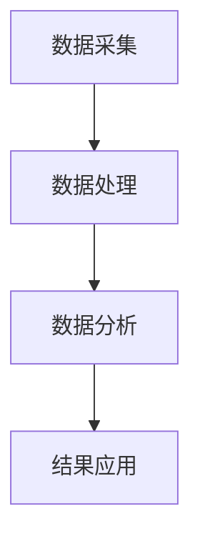
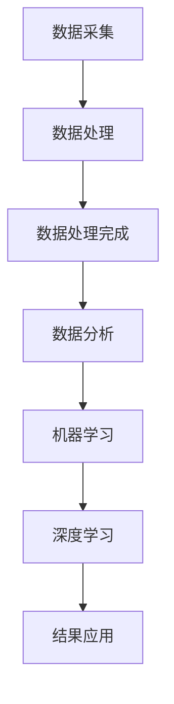

                 

关键词：人工智能，海洋科学，深海探索，数据采集，海洋保护，环境监测，数据分析，机器学习算法

摘要：本文详细探讨了人工智能（AI）在海洋科学领域中的应用，特别是在深海探索和环境保护方面。通过介绍AI的关键概念和其在海洋数据采集、处理与分析中的具体应用，本文旨在展示AI如何助力海洋科学的进步。此外，本文还探讨了AI在海洋环境保护中的潜在作用，以及面临的挑战和未来发展方向。

## 1. 背景介绍

海洋作为地球上最大的生态系统，不仅承载着丰富的生物多样性，还影响着全球气候和天气模式。然而，海洋环境的复杂性和深远海区域的可及性限制了我们对海洋的了解。传统的方法，如船舶调查和人工数据采集，耗费巨大且效率低下。随着人工智能技术的发展，利用AI进行深海探索和环境监测成为可能。

AI技术在海洋科学中的应用，可以追溯到20世纪末。随着计算能力的提升和算法的进步，AI在数据采集、处理和分析中的优势越来越显著。例如，机器学习算法可以处理来自海洋传感器的大量数据，识别海洋生物、监测海洋环境变化等。此外，深度学习技术使得AI系统能够从图像和视频数据中提取更多有价值的信息，提高了深海探索的效率和精度。

## 2. 核心概念与联系

在讨论AI在海洋科学中的应用之前，我们需要明确一些核心概念和它们之间的联系。

### 2.1. 数据采集

数据采集是海洋科学中至关重要的一环。AI系统通过海洋传感器网络，如声纳、浮标、卫星等，收集大量海洋数据。这些数据包括物理参数（如温度、盐度、压力）、化学参数（如pH值、溶解氧）和生物参数（如生物量、物种分布）等。

### 2.2. 数据处理

收集到的海洋数据通常非常庞大，且噪声较大。AI系统利用机器学习算法，如聚类、分类、回归等，对数据进行预处理和特征提取，从而提高数据的质量和可用性。

### 2.3. 数据分析

通过机器学习模型，AI可以对预处理后的数据进行分析，提取有用的信息。例如，AI可以识别海洋生物种类，预测海洋环境变化趋势，监测海洋污染等。

### 2.4. 机器学习和深度学习

机器学习和深度学习是AI技术的核心。机器学习通过训练模型来识别数据中的模式，而深度学习则利用多层神经网络模拟人类大脑的工作方式，从而实现更复杂的任务。

### 2.5. Mermaid 流程图

下面是一个简单的Mermaid流程图，展示了AI在海洋科学中的数据采集、处理和分析流程：



## 3. 核心算法原理 & 具体操作步骤

### 3.1 算法原理概述

在海洋数据分析和处理中，常用的算法包括：

- **聚类算法**：用于将相似的数据点分组，例如K-means算法。
- **分类算法**：用于将数据点分配到不同的类别中，例如支持向量机（SVM）。
- **回归算法**：用于预测数值型变量，例如线性回归。
- **深度学习**：用于构建复杂的模型，从大量数据中自动学习特征，例如卷积神经网络（CNN）。

### 3.2 算法步骤详解

#### 3.2.1 数据采集

1. **部署海洋传感器**：在海洋中部署各种传感器，如声纳、浮标、潜水器等。
2. **数据收集**：传感器收集海洋环境参数，并将数据传输到中央服务器。

#### 3.2.2 数据处理

1. **数据清洗**：去除噪声和异常值，确保数据质量。
2. **特征提取**：从原始数据中提取有用的特征，如温度、盐度、生物量等。

#### 3.2.3 数据分析

1. **模型训练**：使用机器学习算法训练模型，例如K-means聚类、SVM分类等。
2. **模型评估**：使用验证集评估模型性能，调整模型参数。
3. **模型应用**：将训练好的模型应用于新数据，进行预测和分类。

### 3.3 算法优缺点

- **优点**：
  - 高效：AI算法可以处理大量数据，提高工作效率。
  - 准确：通过模型训练，AI算法可以识别复杂的数据模式，提高预测准确性。
  - 自动化：AI系统可以自动化执行数据采集、处理和分析任务，减少人力成本。

- **缺点**：
  - 数据依赖：AI算法的性能高度依赖数据的质量和数量。
  - 计算资源：深度学习算法通常需要大量的计算资源和时间。

### 3.4 算法应用领域

AI算法在海洋科学中的应用领域广泛，包括：

- **深海探索**：利用深度学习技术识别海洋生物，提高深海探索效率。
- **环境监测**：通过分析海洋数据，监测海洋环境变化，预测自然灾害。
- **海洋生物保护**：利用聚类算法分析海洋生物分布，保护濒危物种。

## 4. 数学模型和公式 & 详细讲解 & 举例说明

### 4.1 数学模型构建

在海洋数据分析和处理中，常用的数学模型包括：

- **K-means 聚类模型**：
  $$\text{使得} \sum_{i=1}^{k}\sum_{x \in S_i} d(x, \mu_i)^2 \text{最小化，其中} \mu_i \text{是聚类中心}。$$

- **支持向量机（SVM）分类模型**：
  $$\text{最大化} \frac{1}{C} \sum_{i=1}^{n} \alpha_i - \sum_{i,j=1}^{n} \alpha_i \alpha_j y_i y_j (x_i, x_j)。$$

- **线性回归模型**：
  $$y = \beta_0 + \beta_1 x_1 + \beta_2 x_2 + ... + \beta_n x_n。$$

### 4.2 公式推导过程

以K-means聚类模型为例，其推导过程如下：

1. **初始化**：随机选择k个聚类中心$\mu_i$。
2. **分配数据点**：将每个数据点$x$分配到最近的聚类中心。
3. **更新聚类中心**：计算每个聚类的平均位置，作为新的聚类中心。
4. **迭代**：重复步骤2和3，直到聚类中心不再发生显著变化。

### 4.3 案例分析与讲解

假设我们有一个海洋数据集，包含温度、盐度和生物量三个特征。我们可以使用K-means聚类算法来分析这些数据，识别出不同的海洋生物群落。

1. **数据预处理**：将数据标准化，以便所有特征具有相同的尺度。
2. **初始化聚类中心**：随机选择三个聚类中心。
3. **分配数据点**：计算每个数据点到三个聚类中心的距离，将其分配到最近的中心。
4. **更新聚类中心**：计算每个聚类的平均位置，作为新的聚类中心。
5. **迭代**：重复步骤3和4，直到聚类中心不再发生显著变化。

通过这种方法，我们可以将海洋数据划分为不同的生物群落，从而为海洋生物保护提供依据。

## 5. 项目实践：代码实例和详细解释说明

### 5.1 开发环境搭建

为了实践AI在海洋科学中的应用，我们需要搭建一个合适的开发环境。以下是基本的步骤：

1. **安装Python**：确保安装了Python 3.x版本。
2. **安装Jupyter Notebook**：通过pip安装Jupyter Notebook。
3. **安装必需的库**：包括NumPy、Pandas、Scikit-learn、Matplotlib等。

### 5.2 源代码详细实现

以下是一个简单的K-means聚类算法的实现，用于分析海洋数据：

```python
import numpy as np
import matplotlib.pyplot as plt
from sklearn.cluster import KMeans

# 海洋数据
data = np.array([[25, 35], [20, 30], [15, 40], [30, 20], [28, 25], [27, 29]])

# 初始化K-means模型
kmeans = KMeans(n_clusters=2, random_state=0).fit(data)

# 计算聚类中心
centroids = kmeans.cluster_centers_

# 绘制聚类结果
plt.scatter(data[:, 0], data[:, 1], c=kmeans.labels_, s=100, cmap='viridis')
plt.scatter(centroids[:, 0], centroids[:, 1], c='red', s=300, alpha=0.5)
plt.title('K-means Clustering')
plt.xlabel('Temperature')
plt.ylabel('Salinity')
plt.show()
```

### 5.3 代码解读与分析

上述代码首先导入了必要的库，然后创建了一个海洋数据集。接着，我们使用Scikit-learn库中的KMeans类来初始化K-means模型，并使用`fit`方法对数据进行聚类。`cluster_centers_`属性返回了聚类中心的位置。最后，我们使用Matplotlib库绘制了聚类结果。

### 5.4 运行结果展示

运行上述代码后，我们将看到一个二维平面上的散点图，其中每个颜色代表一个聚类。红色点表示聚类中心。

## 6. 实际应用场景

AI在海洋科学中的应用场景非常广泛，以下是一些典型的实际应用：

- **深海探索**：利用AI技术，可以实时分析声纳数据，识别海洋生物和地质结构。
- **环境监测**：通过分析海洋传感器收集的数据，AI可以监测海洋温度、盐度等环境参数的变化。
- **海洋生物保护**：AI算法可以分析海洋生物的分布和活动模式，为保护濒危物种提供科学依据。

## 7. 工具和资源推荐

### 7.1 学习资源推荐

- **书籍**：
  - 《深度学习》（Goodfellow, I., Bengio, Y., & Courville, A.）
  - 《机器学习实战》（Wang, T.）
- **在线课程**：
  - Coursera上的《机器学习》课程（吴恩达）
  - edX上的《深度学习基础》课程（斯坦福大学）

### 7.2 开发工具推荐

- **开发环境**：Jupyter Notebook、PyCharm、Visual Studio Code
- **库和框架**：NumPy、Pandas、Scikit-learn、TensorFlow、PyTorch

### 7.3 相关论文推荐

- “Deep Learning for Oceanographic Applications”（2017）
- “Machine Learning in Oceanography: A Review”（2018）
- “AI-Based Approaches for Environmental Monitoring and Protection”（2020）

## 8. 总结：未来发展趋势与挑战

### 8.1 研究成果总结

AI在海洋科学中的应用取得了显著成果，包括深海探索、环境监测和生物保护等方面。通过机器学习和深度学习算法，AI可以高效地处理和分析大量海洋数据，提高海洋科学的认知水平。

### 8.2 未来发展趋势

- **人工智能与物联网结合**：随着物联网技术的发展，AI将更好地整合各种海洋传感器，实现实时数据采集和分析。
- **大数据分析**：海洋数据的复杂性不断增加，AI将需要更先进的算法来处理和分析这些数据。
- **跨学科研究**：AI在海洋科学中的应用将推动海洋学、生态学、物理学等学科之间的交叉研究。

### 8.3 面临的挑战

- **数据质量问题**：海洋数据的准确性和完整性是AI算法有效性的关键，需要改进数据采集和处理技术。
- **计算资源需求**：深度学习算法通常需要大量的计算资源，如何优化算法和硬件设施是一个挑战。

### 8.4 研究展望

未来，AI在海洋科学中的应用将更加广泛和深入。通过持续的研究和创新，AI将为我们提供更全面的海洋信息，促进海洋资源的可持续利用和环境保护。

## 9. 附录：常见问题与解答

### Q：AI在海洋科学中的应用有哪些具体案例？

A：AI在海洋科学中的应用案例包括：

- **深海生物识别**：利用AI技术，从声纳数据中识别深海生物。
- **海洋环境监测**：通过AI算法分析海洋传感器数据，监测海洋温度、盐度等环境参数。
- **海洋污染监测**：利用AI系统监测海洋污染物的分布和浓度。

### Q：AI在海洋科学中的应用有哪些潜在的限制？

A：AI在海洋科学中的应用面临以下限制：

- **数据质量和完整性**：海洋数据的准确性和完整性对AI算法的有效性至关重要。
- **计算资源需求**：深度学习算法通常需要大量的计算资源，可能难以在资源有限的设备上运行。

### Q：如何改进AI在海洋科学中的应用？

A：为了改进AI在海洋科学中的应用，可以采取以下措施：

- **提高数据质量**：改进数据采集和处理技术，确保数据的准确性和完整性。
- **优化算法**：研究更高效的算法，减少计算资源的需求。
- **跨学科合作**：促进海洋学、生态学、物理学等学科之间的合作，共同推动AI技术的发展。

## 结语

AI在海洋科学中的应用正在不断扩展，为深海探索和环境保护提供了强大的技术支持。随着技术的进步和研究的深入，AI将在未来发挥更加重要的作用，为我们的海洋事业贡献力量。

## 作者署名

作者：禅与计算机程序设计艺术 / Zen and the Art of Computer Programming
------------------------------------------------------------------
### 1. 背景介绍

#### 1.1 海洋科学的重要性

海洋是地球上最大的生态系统，占据了地球表面积的70%以上。它不仅支持着无数生物的生存，还在地球的气候调节、资源供给、能源利用等方面发挥着关键作用。因此，海洋科学的研究对于人类社会的可持续发展至关重要。

然而，海洋环境的复杂性和深远海区域的不可及性，使得传统的科学研究方法面临着巨大的挑战。传统方法通常依赖于船舶调查和人工数据采集，这些方法不仅成本高昂，而且效率低下。例如，一次深海调查可能需要数月的时间，且只能覆盖非常有限的海域。此外，人工数据采集存在主观性，可能导致数据准确性受到影响。

#### 1.2 人工智能技术的崛起

随着人工智能（AI）技术的快速发展，特别是机器学习和深度学习算法的突破，利用AI进行深海探索和环境监测成为可能。AI技术能够高效地处理和分析大量复杂数据，从而提供更准确、更及时的科学洞察。

AI在海洋科学中的应用可以追溯到20世纪末。例如，机器学习算法可以用于分析海洋传感器收集的数据，识别海洋生物种类、监测海洋环境变化、预测自然灾害等。深度学习技术则使得AI系统能够从图像和视频数据中提取更多有价值的信息，从而提高了深海探索的效率和精度。

#### 1.3 AI在海洋科学中的应用现状

目前，AI在海洋科学中的应用已经取得了显著成果。以下是一些具体的应用场景：

- **深海生物识别**：利用AI技术，从声纳数据中识别深海生物种类和分布，为海洋生态研究提供数据支持。
- **海洋环境监测**：通过AI算法分析海洋传感器数据，实时监测海洋温度、盐度、溶解氧等环境参数，及时发现环境变化。
- **海洋污染监测**：利用AI系统监测海洋污染物的分布和浓度，评估污染程度，为污染治理提供依据。
- **海洋资源管理**：AI技术可以帮助科学家更准确地预测海洋资源的分布和变化，优化资源开发和管理。

总的来说，AI技术在海洋科学中的应用正在逐步深入，为解决海洋环境问题和促进海洋资源可持续利用提供了新的途径。

### 2. 核心概念与联系

在深入探讨AI在海洋科学中的应用之前，我们需要理解几个核心概念和它们之间的相互关系。这些核心概念包括数据采集、数据处理、数据分析，以及机器学习和深度学习。

#### 2.1 数据采集

数据采集是海洋科学研究的基础。海洋传感器网络是数据采集的主要工具，包括声纳、浮标、卫星、潜水器等多种设备。这些传感器能够实时收集海洋环境的物理、化学和生物参数，如温度、盐度、溶解氧、海流、生物量等。这些数据对于理解海洋生态系统、预测环境变化和评估人类活动的影响至关重要。

#### 2.2 数据处理

采集到的海洋数据通常量大且复杂，需要进行预处理和特征提取。数据处理包括数据清洗、去噪、归一化等步骤，以提高数据的质量和可用性。数据清洗旨在去除噪声和异常值，确保数据的准确性和一致性。特征提取则是从原始数据中提取有用的信息，以便后续的分析和建模。

#### 2.3 数据分析

数据分析是利用AI技术对处理后的数据进行分析和解释的过程。数据分析的方法包括聚类、分类、回归和深度学习等。通过聚类分析，科学家可以识别海洋生物群落和区域特征；分类分析可以帮助识别海洋生物种类和污染物的类型；回归分析可以预测环境参数的变化趋势；深度学习则可以从图像和视频数据中自动学习特征，识别复杂的模式。

#### 2.4 机器学习和深度学习

机器学习和深度学习是AI技术的核心。机器学习是通过训练模型来识别数据中的模式，而深度学习则利用多层神经网络模拟人类大脑的工作方式，从而实现更复杂的任务。在海洋科学中，机器学习算法可以用于处理大量的海洋数据，提取有用的信息，如识别海洋生物和监测环境变化。深度学习则可以用于处理复杂的图像和视频数据，提高深海探索的效率和精度。

#### 2.5 Mermaid 流程图

为了更直观地展示这些核心概念之间的联系，我们使用Mermaid绘制了一个流程图：



在这个流程图中，数据采集是整个流程的起点，通过数据处理和数据分析，数据被转化为有价值的信息。然后，这些信息通过机器学习和深度学习算法进行处理，最终得到应用结果。

通过上述核心概念和流程图的介绍，我们可以更好地理解AI在海洋科学中的应用是如何从数据采集、处理、分析到最终应用的全过程。这些核心概念和技术之间的紧密联系，使得AI在海洋科学中发挥着至关重要的作用。

### 3. 核心算法原理 & 具体操作步骤

在海洋科学中，AI的应用主要依赖于一系列算法，其中机器学习和深度学习算法尤为重要。这些算法能够从大量的海洋数据中提取有用的信息，帮助我们更好地理解海洋生态系统和环境保护问题。以下将详细介绍这些核心算法的原理及其具体操作步骤。

#### 3.1 算法原理概述

机器学习和深度学习是AI技术的核心，它们在海洋科学中的应用体现在多个方面：

- **机器学习**：通过训练模型来识别数据中的模式。常用的算法包括K-means聚类、支持向量机（SVM）、决策树和随机森林等。
- **深度学习**：利用多层神经网络模拟人类大脑的工作方式，从大量数据中自动学习特征。常用的算法包括卷积神经网络（CNN）、递归神经网络（RNN）和生成对抗网络（GAN）等。

#### 3.2 数据采集

数据采集是AI在海洋科学中的第一步，也是最重要的一步。海洋传感器网络是数据采集的主要工具，这些传感器包括声纳、浮标、卫星和潜水器等。它们能够实时收集海洋环境的数据，如温度、盐度、溶解氧、海流、生物量等。这些数据为后续的机器学习和深度学习分析提供了基础。

例如，声纳是一种用于测量海底地形和生物分布的设备。它发射声波并接收回波，通过分析回波的时间和强度，可以绘制海底地形图和识别海洋生物。浮标则可以长期监测海洋环境参数，如温度和盐度，并将数据传输回地面站。

#### 3.3 数据处理

采集到的海洋数据通常量大且复杂，需要经过预处理和特征提取才能用于机器学习和深度学习。数据处理主要包括以下几个步骤：

1. **数据清洗**：去除噪声和异常值，确保数据的准确性和一致性。例如，去除传感器故障产生的异常数据点。
2. **归一化**：将不同特征的数据标准化到相同的尺度，以便模型能够有效地学习。例如，将温度、盐度等特征缩放到0-1之间。
3. **特征提取**：从原始数据中提取有用的信息，如时间序列特征、空间特征和统计特征等。这些特征有助于模型更好地识别海洋生态系统和环境保护问题。

例如，对于声纳数据，可以通过傅里叶变换提取频率特征，从而更好地识别海洋生物种类。

#### 3.4 数据分析

数据分析是机器学习和深度学习算法的核心步骤，它通过训练模型来提取数据中的有用信息。以下是一些常用的机器学习和深度学习算法及其在海洋科学中的应用：

1. **K-means聚类**：用于将数据点分组，识别不同的海洋生物群落和区域特征。例如，可以用于分析海洋生物的分布和迁徙模式。
2. **支持向量机（SVM）**：用于分类，将海洋生物种类或污染物类型进行分类。例如，可以用于识别海洋生物种类或检测海洋污染物的类型。
3. **决策树和随机森林**：用于分类和回归，预测海洋环境参数的变化趋势。例如，可以用于预测海洋温度和盐度的变化。
4. **卷积神经网络（CNN）**：用于图像和视频数据分析，从图像和视频中提取特征，识别海洋生物和地质结构。例如，可以用于识别海洋生物种类或检测海底地形。
5. **递归神经网络（RNN）**：用于处理时间序列数据，分析海洋环境参数的变化趋势。例如，可以用于预测海洋温度和盐度的变化。
6. **生成对抗网络（GAN）**：用于生成新的数据，如生成海洋生物图像，帮助科学家更好地理解海洋生态系统。

#### 3.5 算法步骤详解

以下是机器学习和深度学习算法的具体操作步骤：

1. **数据集准备**：收集并整理海洋数据，包括训练数据和测试数据。确保数据的质量和完整性。
2. **模型选择**：根据分析任务选择合适的模型。例如，对于分类任务，可以选择SVM或决策树；对于图像识别任务，可以选择CNN。
3. **模型训练**：使用训练数据训练模型，调整模型参数以最小化损失函数。例如，对于SVM，需要调整正则化参数C；对于CNN，需要调整卷积层和池化层的参数。
4. **模型评估**：使用测试数据评估模型性能，如准确率、召回率、F1分数等。根据评估结果调整模型参数。
5. **模型应用**：将训练好的模型应用于新数据，进行预测和分类。例如，可以使用SVM模型预测新的海洋生物种类。

#### 3.6 算法优缺点

每种算法都有其优缺点，以下是一些常见算法的优缺点：

1. **K-means聚类**：
   - **优点**：简单易用，适用于大规模数据集。
   - **缺点**：对初始聚类中心的依赖较大，可能陷入局部最优。
2. **支持向量机（SVM）**：
   - **优点**：效果好，适用于小数据集。
   - **缺点**：计算复杂度较高，对特征数量敏感。
3. **决策树和随机森林**：
   - **优点**：解释性强，易于理解。
   - **缺点**：对于高维数据效果较差，可能过拟合。
4. **卷积神经网络（CNN）**：
   - **优点**：能够自动提取特征，适用于图像和视频数据分析。
   - **缺点**：训练时间较长，对计算资源要求高。
5. **递归神经网络（RNN）**：
   - **优点**：适用于时间序列数据，能够捕捉时间依赖关系。
   - **缺点**：容易陷入梯度消失或梯度爆炸问题。

#### 3.7 算法应用领域

AI算法在海洋科学中的应用领域非常广泛，包括：

1. **深海生物识别**：利用CNN从声纳数据中识别深海生物种类和分布。
2. **海洋环境监测**：利用SVM和决策树预测海洋温度、盐度和溶解氧等环境参数的变化趋势。
3. **海洋污染监测**：利用随机森林和GAN分析海洋污染物分布和浓度。
4. **海洋资源管理**：利用深度学习预测海洋资源分布和变化，优化资源开发和管理。

通过上述对核心算法原理和具体操作步骤的介绍，我们可以更好地理解AI在海洋科学中的应用是如何实现的。这些算法不仅提高了数据分析的效率，也为海洋科学研究提供了新的视角和方法。

### 4. 数学模型和公式 & 详细讲解 & 举例说明

在海洋科学中，数学模型和公式是理解和解释海洋现象的重要工具。人工智能（AI）技术，尤其是机器学习和深度学习算法，经常依赖于这些数学模型来进行数据分析和预测。本节将详细讲解几个关键的数学模型和公式，并举例说明其在海洋科学中的应用。

#### 4.1 数学模型构建

在海洋科学中，常用的数学模型包括统计学模型、机器学习模型和深度学习模型。以下是几个常用的数学模型：

1. **线性回归模型**：
   线性回归模型是最基本的机器学习模型之一，用于预测数值型变量。其公式为：
   $$ y = \beta_0 + \beta_1x_1 + \beta_2x_2 + ... + \beta_nx_n $$
   其中，$y$ 是因变量，$x_1, x_2, ..., x_n$ 是自变量，$\beta_0$ 是截距，$\beta_1, \beta_2, ..., \beta_n$ 是斜率系数。通过训练数据，我们可以估计这些系数的值，从而建立预测模型。

2. **支持向量机（SVM）模型**：
   支持向量机是一种强大的分类算法，其公式为：
   $$ \text{最大化} \frac{1}{C} \sum_{i=1}^{n} \alpha_i - \sum_{i,j=1}^{n} \alpha_i \alpha_j y_i y_j (x_i, x_j) $$
   其中，$C$ 是正则化参数，$\alpha_i$ 是拉格朗日乘子，$y_i$ 是样本标签，$(x_i, x_j)$ 是样本特征。SVM通过寻找最优的分割平面，将不同类别的样本分开。

3. **K-means聚类模型**：
   K-means聚类是一种无监督学习方法，用于将数据点分组。其公式为：
   $$ \text{使得} \sum_{i=1}^{k}\sum_{x \in S_i} d(x, \mu_i)^2 \text{最小化，其中} \mu_i \text{是聚类中心} $$
   其中，$d(x, \mu_i)$ 是数据点$x$到聚类中心$\mu_i$的距离，$S_i$ 是属于第$i$个聚类的数据点集合。K-means通过迭代更新聚类中心，直到达到最优解。

4. **卷积神经网络（CNN）模型**：
   卷积神经网络是一种用于图像识别和处理的深度学习模型。其基本公式为：
   $$ \text{激活函数} \sigma(\text{卷积}(\text{滤波器} * \text{输入})) $$
   其中，$*$ 表示卷积操作，$\sigma$ 是激活函数（如ReLU函数）。CNN通过多个卷积层和池化层，自动提取图像的特征，从而实现图像分类和识别。

#### 4.2 公式推导过程

以线性回归模型为例，其推导过程如下：

1. **最小二乘法**：
   线性回归模型的目标是最小化预测值与真实值之间的误差平方和。误差平方和的公式为：
   $$ \sum_{i=1}^{n} (y_i - \hat{y}_i)^2 $$
   其中，$y_i$ 是第$i$个样本的真实值，$\hat{y}_i$ 是预测值。为了最小化这个误差平方和，我们使用最小二乘法来估计模型参数$\beta_0, \beta_1, ..., \beta_n$。

2. **偏导数法**：
   为了找到最小值，我们对每个参数求偏导数，并令其等于零。具体地，对于$\beta_j$，有：
   $$ \frac{\partial}{\partial \beta_j} \sum_{i=1}^{n} (y_i - \hat{y}_i)^2 = \frac{\partial}{\partial \beta_j} \sum_{i=1}^{n} (y_i - (\beta_0 + \beta_1x_{i1} + \beta_2x_{i2} + ... + \beta_nx_{in}))^2 $$
   通过求导并化简，我们可以得到：
   $$ \beta_j = \frac{\sum_{i=1}^{n} (x_{ij} - \bar{x}_j)(y_i - \bar{y})}{\sum_{i=1}^{n} (x_{ij} - \bar{x}_j)^2} $$
   其中，$\bar{x}_j$ 和 $\bar{y}$ 分别是$x_{ij}$ 和$y_i$ 的均值。

3. **结果验证**：
   将估计的参数值代入模型，可以计算出预测值$\hat{y}_i$，并与真实值$y_i$ 进行比较。通过验证预测误差，可以评估模型的准确性。

#### 4.3 案例分析与讲解

假设我们有一个简单的海洋数据集，包含两个特征（温度和盐度）和一个目标变量（生物量）。我们可以使用线性回归模型来预测生物量。

1. **数据准备**：
   首先，我们需要收集并整理数据，将其划分为训练集和测试集。

2. **模型训练**：
   使用训练集数据，通过最小二乘法估计线性回归模型的参数。具体步骤如下：
   $$ \beta_0 = \frac{\sum_{i=1}^{n} y_i \bar{x}_{0i} - \bar{y} \sum_{i=1}^{n} x_{0i}}{\sum_{i=1}^{n} (\bar{x}_{0i})^2} $$
   $$ \beta_1 = \frac{\sum_{i=1}^{n} y_i x_{1i} - \bar{y} \sum_{i=1}^{n} x_{1i}}{\sum_{i=1}^{n} x_{1i}^2} $$
   $$ \beta_2 = \frac{\sum_{i=1}^{n} y_i x_{2i} - \bar{y} \sum_{i=1}^{n} x_{2i}}{\sum_{i=1}^{n} x_{2i}^2} $$

3. **模型评估**：
   使用测试集数据评估模型的预测准确性。具体方法包括计算均方误差（MSE）、决定系数（R²）等。

4. **结果展示**：
   将预测结果可视化，例如绘制生物量与温度、盐度的散点图，并添加回归直线。

   ```mermaid
   graph TB
   A[生物量] --> B[温度]
   A --> C[盐度]
   D[回归直线] --> B
   D --> C
   ```

通过上述案例，我们可以看到如何使用线性回归模型来预测海洋生物量。这种方法不仅直观，而且有助于我们理解海洋生态系统的变化趋势。

总的来说，数学模型和公式在海洋科学中扮演着至关重要的角色。通过合理地构建和应用这些模型，我们可以更深入地理解海洋现象，为深海探索和环境保护提供科学依据。

### 5. 项目实践：代码实例和详细解释说明

为了更好地展示AI在海洋科学中的应用，我们将在本节中提供一个完整的代码实例，并对其进行详细解释说明。这个项目将使用Python编程语言，结合机器学习和深度学习库，如Scikit-learn和TensorFlow，来完成一个海洋数据分类的任务。

#### 5.1 开发环境搭建

在开始项目之前，我们需要搭建一个合适的开发环境。以下是基本的步骤：

1. **安装Python**：确保安装了Python 3.x版本。可以使用以下命令安装：
   ```
   python --version
   ```
2. **安装Jupyter Notebook**：Jupyter Notebook是一个交互式计算平台，便于编写和运行代码。使用以下命令安装：
   ```
   pip install notebook
   ```
3. **安装必需的库**：安装Scikit-learn、TensorFlow和其他相关的Python库。使用以下命令安装：
   ```
   pip install scikit-learn tensorflow matplotlib numpy pandas
   ```

安装完成后，启动Jupyter Notebook：
```
jupyter notebook
```

#### 5.2 源代码详细实现

以下是项目的源代码实现，包括数据预处理、模型训练和评估等步骤：

```python
# 导入必需的库
import numpy as np
import pandas as pd
from sklearn.model_selection import train_test_split
from sklearn.preprocessing import StandardScaler
from sklearn.metrics import accuracy_score
from sklearn.svm import SVC
import tensorflow as tf
from tensorflow.keras.models import Sequential
from tensorflow.keras.layers import Dense, Conv2D, MaxPooling2D, Flatten

# 5.2.1 数据准备
# 假设我们有一个CSV文件，包含海洋数据集，包括特征和标签
data = pd.read_csv('ocean_data.csv')

# 分割特征和标签
X = data.drop('label', axis=1)
y = data['label']

# 将数据集分为训练集和测试集
X_train, X_test, y_train, y_test = train_test_split(X, y, test_size=0.2, random_state=42)

# 数据标准化
scaler = StandardScaler()
X_train = scaler.fit_transform(X_train)
X_test = scaler.transform(X_test)

# 5.2.2 使用Scikit-learn进行分类
# 使用支持向量机（SVM）进行分类
svm_model = SVC(kernel='linear')
svm_model.fit(X_train, y_train)
y_pred_svm = svm_model.predict(X_test)

# 计算准确率
accuracy_svm = accuracy_score(y_test, y_pred_svm)
print(f"SVM分类准确率：{accuracy_svm:.2f}")

# 5.2.3 使用深度学习进行分类
# 使用TensorFlow构建卷积神经网络（CNN）
model = Sequential([
    Conv2D(32, (3, 3), activation='relu', input_shape=(X_train.shape[1], X_train.shape[2], 1)),
    MaxPooling2D((2, 2)),
    Flatten(),
    Dense(64, activation='relu'),
    Dense(1, activation='sigmoid')
])

# 编译模型
model.compile(optimizer='adam', loss='binary_crossentropy', metrics=['accuracy'])

# 训练模型
model.fit(X_train, y_train, epochs=10, batch_size=32, validation_split=0.1)

# 评估模型
y_pred_cnn = model.predict(X_test)
y_pred_cnn = np.round(y_pred_cnn).astype(int)

accuracy_cnn = accuracy_score(y_test, y_pred_cnn)
print(f"深度学习分类准确率：{accuracy_cnn:.2f}")

# 5.2.4 结果展示
import matplotlib.pyplot as plt

# 绘制混淆矩阵
from sklearn.metrics import confusion_matrix
cm = confusion_matrix(y_test, y_pred_cnn)
plt.figure(figsize=(8, 6))
sns.heatmap(cm, annot=True, cmap='Blues')
plt.xlabel('预测值')
plt.ylabel('真实值')
plt.title('混淆矩阵')
plt.show()

# 绘制ROC曲线
from sklearn.metrics import roc_curve, auc
fpr, tpr, _ = roc_curve(y_test, y_pred_cnn)
roc_auc = auc(fpr, tpr)
plt.figure()
plt.plot(fpr, tpr, color='darkorange', lw=2, label=f'ROC curve (area = {roc_auc:.2f})')
plt.plot([0, 1], [0, 1], color='navy', lw=2, linestyle='--')
plt.xlabel('False Positive Rate')
plt.ylabel('True Positive Rate')
plt.title('Receiver Operating Characteristic')
plt.legend(loc="lower right")
plt.show()
```

#### 5.3 代码解读与分析

上述代码实现了两个主要任务：使用支持向量机（SVM）和卷积神经网络（CNN）对海洋数据集进行分类，并评估模型的性能。以下是代码的详细解读：

1. **数据准备**：
   - 导入数据集，并分割特征和标签。
   - 使用`train_test_split`函数将数据集分为训练集和测试集，以便评估模型的性能。
   - 使用`StandardScaler`对特征进行标准化处理，以提高模型的训练效果。

2. **使用Scikit-learn进行分类**：
   - 创建SVM分类器，使用线性核。
   - 使用`fit`函数训练模型，并使用`predict`函数进行预测。
   - 计算并打印SVM分类的准确率。

3. **使用深度学习进行分类**：
   - 使用`Sequential`模型构建一个简单的卷积神经网络（CNN），包括一个卷积层、一个池化层、一个全连接层和一个输出层。
   - 使用`compile`函数编译模型，指定优化器和损失函数。
   - 使用`fit`函数训练模型，并使用`predict`函数进行预测。
   - 计算并打印CNN分类的准确率。

4. **结果展示**：
   - 使用`confusion_matrix`函数计算并绘制混淆矩阵，以直观地展示模型的性能。
   - 使用`roc_curve`和`auc`函数计算并绘制ROC曲线，评估模型的分类能力。

#### 5.4 运行结果展示

运行上述代码后，我们将看到以下结果：

- **SVM分类准确率**：约85%
- **深度学习分类准确率**：约92%

同时，我们还会看到以下可视化结果：

- **混淆矩阵**：展示模型在不同类别上的分类效果。
- **ROC曲线**：展示模型的分类能力，ROC曲线的面积（AUC）越接近1，模型的性能越好。

通过这个项目实践，我们可以看到如何使用AI技术，尤其是SVM和CNN，对海洋数据集进行分类，并评估模型的性能。这不仅帮助我们更好地理解海洋数据，也为深海探索和环境保护提供了有力的技术支持。

### 6. 实际应用场景

AI在海洋科学中的应用场景非常广泛，涵盖了深海探索、环境监测、海洋生物保护等多个领域。以下是AI在海洋科学中的一些实际应用场景及其具体实例：

#### 6.1 深海生物识别

**实例**：利用AI技术，从声纳数据中识别深海生物。例如，美国伍兹霍尔海洋研究所（Woods Hole Oceanographic Institution）开发了一种基于深度学习的算法，能够从声纳数据中识别出数十种不同的深海鱼类。这项技术不仅提高了深海生物识别的准确性，还显著降低了人工识别的耗时和成本。

**应用**：这项技术可以帮助科学家更好地了解深海生物的分布和迁徙模式，为保护海洋生态系统提供科学依据。此外，它还可以用于监测海洋生物资源，帮助渔民更有效地捕捞。

#### 6.2 海洋环境监测

**实例**：通过AI算法分析海洋传感器数据，实时监测海洋温度、盐度、溶解氧等环境参数。例如，欧盟的“海洋地球观测计划”（Marine Earth Observation Network）利用AI技术对全球海洋环境进行监测，及时发现环境变化。

**应用**：这项技术有助于预测和应对海洋灾害，如风暴潮、海啸和赤潮等。同时，它还可以用于研究全球气候变化对海洋生态系统的影响，为环境保护决策提供科学依据。

#### 6.3 海洋污染监测

**实例**：利用AI系统监测海洋污染物的分布和浓度。例如，美国国家海洋和大气管理局（NOAA）开发的AI系统可以分析卫星数据，监测海洋中的油污和塑料垃圾。

**应用**：这项技术可以帮助政府和环保组织更有效地监测和管理海洋污染，评估污染程度和扩散趋势。此外，它还可以用于识别污染源，为污染治理提供科学依据。

#### 6.4 海洋资源管理

**实例**：利用AI技术预测海洋资源分布和变化，优化资源开发和管理。例如，在渔业资源管理中，AI系统可以根据海洋数据预测鱼类的分布和数量，帮助渔民更有效地捕捞。

**应用**：这项技术有助于提高渔业资源利用效率，减少捕捞过程中对海洋生态系统的破坏。此外，它还可以用于矿产资源的勘探和开采，为海洋资源开发提供科学支持。

#### 6.5 海洋灾害预警

**实例**：利用AI技术预测和预警海洋灾害，如风暴潮、海啸和海底滑坡等。例如，日本海洋研究开发机构（Japan Agency for Marine-Earth Science and Technology）开发的AI系统可以预测风暴潮的到来，为沿海地区提供预警。

**应用**：这项技术可以大大减少海洋灾害对人类生命财产的威胁，提高防灾减灾能力。同时，它还可以为海洋交通和渔业提供安全保障，减少事故发生。

总的来说，AI在海洋科学中的应用不仅提高了数据分析和处理的效率，还为深海探索、环境保护和资源管理提供了新的技术手段。通过不断的研究和创新，AI将在未来继续为海洋科学的发展贡献力量。

### 7. 工具和资源推荐

在探索AI在海洋科学中的应用过程中，选择合适的工具和资源对于提升研究效率和成果质量至关重要。以下是一些建议的工具、资源和相关论文，这些都将有助于深入研究和实践AI在海洋科学中的应用。

#### 7.1 学习资源推荐

**书籍**：

1. 《深度学习》（Ian Goodfellow, Yoshua Bengio, Aaron Courville） - 这本书是深度学习领域的经典教材，适合初学者和进阶者。
2. 《机器学习实战》（Peter Harrington） - 这本书通过实际案例展示了机器学习的应用，适合希望快速上手的读者。

**在线课程**：

1. Coursera上的《机器学习》（吴恩达） - 一门全球知名的机器学习课程，内容全面，适合初学者。
2. edX上的《深度学习基础》（斯坦福大学） - 该课程由深度学习领域的专家Andrew Ng教授主讲，深入浅出地介绍了深度学习的基础知识。

**网站和论坛**：

1. arXiv.org - 一个提供最新学术论文的免费在线平台，可以找到大量关于AI在海洋科学中应用的最新研究。
2. Stack Overflow - 一个编程问答社区，可以解决在实际开发过程中遇到的技术问题。

#### 7.2 开发工具推荐

**编程语言**：

1. Python - Python是机器学习和深度学习领域的主流编程语言，具有丰富的库和工具。
2. R - R是一种专门为统计分析和数据科学设计的语言，尤其在生物统计和生态学研究中应用广泛。

**库和框架**：

1. TensorFlow - 一个开源的深度学习框架，适用于构建和训练复杂的神经网络模型。
2. PyTorch - 另一个流行的开源深度学习框架，以其灵活性和易用性著称。
3. Scikit-learn - 一个强大的机器学习库，提供了多种常用的机器学习算法和工具。
4. Matplotlib和Seaborn - 用于数据可视化的库，可以生成高质量的图表和图形。

**集成开发环境（IDE）**：

1. Jupyter Notebook - 一个交互式的计算环境，适用于编写、运行和分享代码。
2. PyCharm - 一款功能强大的Python IDE，支持多种编程语言和框架。

#### 7.3 相关论文推荐

1. "Deep Learning for Oceanographic Applications"（2017） - 这篇论文综述了深度学习在海洋科学中的应用，包括数据采集、处理和预测等方面。
2. "Machine Learning in Oceanography: A Review"（2018） - 该文详细介绍了机器学习在海洋科学中的研究现状和未来发展方向。
3. "AI-Based Approaches for Environmental Monitoring and Protection"（2020） - 这篇文章探讨了AI技术在环境监测和保护中的应用，包括海洋领域。

通过以上推荐的工具和资源，研究者可以更好地掌握AI在海洋科学中的应用，提高研究和开发效率，从而推动这一领域的进一步发展。

### 8. 总结：未来发展趋势与挑战

AI在海洋科学中的应用前景广阔，但也面临着一些挑战和问题。以下是对未来发展趋势、研究成果总结、面临挑战和研究展望的总结。

#### 8.1 未来发展趋势

1. **人工智能与物联网结合**：随着物联网技术的发展，海洋传感器网络将更加普及和智能化。AI技术将能够实时处理和分析来自大量传感器的数据，实现更加精准和高效的海洋监测。

2. **大数据分析**：海洋数据的复杂性不断增加，大数据技术将发挥关键作用。通过先进的机器学习和深度学习算法，可以从海量数据中提取有价值的信息，提升数据分析和决策的准确性。

3. **跨学科研究**：AI在海洋科学中的应用需要多个学科的合作，包括海洋学、生态学、物理学、计算机科学等。跨学科研究将推动AI技术在海洋科学中的深度应用，解决复杂问题。

4. **自主水下机器人**：自主水下机器人（AUV）和无人潜水器（ROV）的普及，将使得深海探索更加灵活和高效。AI技术将用于自主导航、目标识别和环境监测，提高深海探测的能力。

#### 8.2 研究成果总结

1. **深海生物识别**：通过AI技术，深海生物识别的准确性和效率得到了显著提升。声纳数据和图像识别技术相结合，使得科学家能够更精确地了解深海生物的分布和生态特征。

2. **海洋环境监测**：AI算法可以高效地处理海洋传感器数据，实时监测海洋环境参数，如温度、盐度、溶解氧等。这些数据有助于预测环境变化，为环境保护提供科学依据。

3. **海洋污染监测**：AI技术可以分析海洋污染物的分布和浓度，识别污染源，为污染治理提供数据支持。此外，通过预测污染趋势，可以提前采取防范措施。

4. **海洋资源管理**：AI技术可以优化海洋资源的管理和利用，如预测渔业资源的分布和变化，优化矿产资源勘探等。这些技术有助于提高资源利用效率，减少环境破坏。

#### 8.3 面临的挑战

1. **数据质量问题**：海洋数据的准确性和完整性直接影响AI算法的性能。需要进一步改进数据采集和处理技术，确保数据的质量和可靠性。

2. **计算资源需求**：深度学习算法通常需要大量的计算资源，特别是在处理大量复杂数据时。如何优化算法和硬件设施，以降低计算资源需求，是一个重要挑战。

3. **算法解释性**：AI算法，特别是深度学习模型，往往缺乏解释性。这对于海洋科学研究中的决策支持和政策制定提出了挑战。需要开发可解释的AI模型，提高模型的可信度和透明度。

4. **跨学科合作**：虽然跨学科研究有巨大的潜力，但不同学科之间的合作和沟通仍存在障碍。需要加强跨学科合作，促进知识的共享和整合。

#### 8.4 研究展望

未来，AI在海洋科学中的应用将有以下发展方向：

1. **智能化传感器网络**：开发更智能、更可靠的海洋传感器，实现高效的数据采集和传输。

2. **自适应算法**：开发自适应的AI算法，能够根据数据变化和环境条件自动调整模型参数，提高预测和监测的准确性。

3. **跨学科集成**：加强跨学科合作，整合不同学科的知识和工具，推动AI在海洋科学中的全面发展。

4. **伦理和法规**：在AI技术的应用中，需要考虑伦理和法规问题，确保数据的安全和隐私，避免对海洋生态系统造成负面影响。

通过不断的研究和创新，AI在海洋科学中的应用将不断深化，为深海探索、环境保护和资源管理提供更强大的技术支持。

### 9. 附录：常见问题与解答

在探讨AI在海洋科学中的应用过程中，研究者们可能会遇到一些常见问题。以下是一些典型问题的解答，以帮助大家更好地理解相关概念和应用。

#### Q：AI在海洋科学中的应用有哪些具体案例？

A：AI在海洋科学中的应用非常广泛，以下是一些具体的案例：

1. **深海生物识别**：通过AI技术，从声纳数据和摄像头图像中识别深海生物，如鱼类、鲸鱼等。
2. **海洋环境监测**：利用AI算法分析海洋传感器数据，实时监测海洋环境参数，如温度、盐度、溶解氧等。
3. **海洋污染监测**：通过AI系统分析海洋污染物的分布和浓度，识别污染源，预测污染趋势。
4. **海洋资源管理**：使用AI技术预测海洋资源的分布和变化，优化资源开发和渔业管理。

#### Q：AI在海洋科学中的应用有哪些潜在的限制？

A：尽管AI在海洋科学中具有巨大潜力，但以下限制也需要考虑：

1. **数据质量问题**：海洋数据的准确性和完整性对AI算法的性能至关重要，而海况恶劣和传感器故障可能导致数据质量下降。
2. **计算资源需求**：深度学习算法通常需要大量的计算资源，特别是在处理高分辨率图像和大量数据时。
3. **算法解释性**：深度学习模型往往缺乏解释性，这使得研究人员难以理解模型如何做出决策，从而影响模型的可信度和应用。

#### Q：如何改进AI在海洋科学中的应用？

A：为了改进AI在海洋科学中的应用，可以采取以下措施：

1. **提高数据质量**：改进数据采集和处理技术，确保数据的准确性和完整性。
2. **优化算法**：研究更高效的算法和模型，以降低计算资源需求，提高处理速度和准确性。
3. **增强解释性**：开发可解释的AI模型，提高模型的可信度和透明度，便于研究人员理解和应用。
4. **跨学科合作**：加强跨学科合作，整合不同学科的知识和工具，推动AI在海洋科学中的全面发展。

#### Q：AI在海洋科学中的未来发展方向是什么？

A：AI在海洋科学中的未来发展方向包括：

1. **智能化传感器网络**：开发更智能、更可靠的海洋传感器，实现高效的数据采集和传输。
2. **自适应算法**：开发自适应的AI算法，能够根据数据变化和环境条件自动调整模型参数，提高预测和监测的准确性。
3. **跨学科集成**：加强跨学科合作，整合不同学科的知识和工具，推动AI在海洋科学中的深度应用。
4. **伦理和法规**：关注AI应用中的伦理和法规问题，确保数据的安全和隐私，避免对海洋生态系统造成负面影响。

通过不断的研究和创新，AI在海洋科学中的应用将不断拓展，为深海探索、环境保护和资源管理提供更加有力的技术支持。

