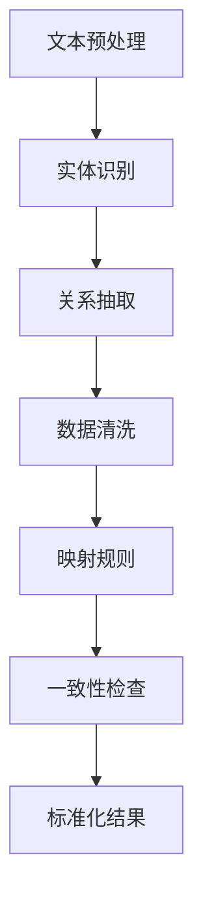

                 

关键词：电商平台、商品属性抽取、AI、标准化、机器学习、自然语言处理、数据清洗、特征工程、分类算法

> 摘要：本文将探讨人工智能在电商平台商品属性抽取与标准化中的应用，分析其背景、核心概念、算法原理、数学模型、实践案例以及未来发展方向。通过对现有技术的深入剖析，旨在为电商行业提供有效的技术解决方案，提升商品信息管理的精度和效率。

## 1. 背景介绍

随着电子商务的快速发展，电商平台上的商品种类和数量日益增多，如何有效地管理和利用商品数据成为一个亟待解决的问题。商品属性抽取与标准化作为电商数据管理的重要环节，直接影响到商品的搜索、推荐和用户体验。

商品属性抽取是指从电商平台的海量商品描述中提取出具体的商品属性，如品牌、型号、颜色、尺寸、价格等。商品标准化则是将提取出的属性进行规范化处理，确保不同商家、不同平台上的商品数据能够一致、可比。

在过去，商品属性抽取与标准化主要依赖人工处理，效率低下且容易出现误差。随着人工智能技术的不断发展，特别是机器学习、自然语言处理技术的成熟，AI在商品属性抽取与标准化中的应用逐渐成为可能。

## 2. 核心概念与联系

### 2.1. 商品属性抽取

商品属性抽取是一个从文本数据中提取出关键信息的过程。其核心概念包括：

- **文本预处理**：通过分词、去停用词、词性标注等步骤，将原始文本转化为可以处理的格式。
- **实体识别**：利用命名实体识别（NER）技术，从文本中识别出具体的商品属性。
- **关系抽取**：确定文本中不同实体之间的关系，如“华为手机”中的品牌和产品关系。

### 2.2. 商品标准化

商品标准化是将抽取出的属性进行规范化处理，确保其能够符合一定的标准。核心概念包括：

- **数据清洗**：去除重复、错误和不完整的数据，提高数据质量。
- **映射规则**：定义属性之间的映射关系，如品牌、型号、颜色的标准化编码。
- **一致性检查**：确保不同来源、不同格式的数据能够保持一致性。

### 2.3. Mermaid 流程图

以下是一个简化的商品属性抽取与标准化的 Mermaid 流程图：



## 3. 核心算法原理 & 具体操作步骤

### 3.1. 算法原理概述

商品属性抽取与标准化主要依赖于机器学习和自然语言处理技术。以下是两种核心算法：

- **命名实体识别（NER）**：用于从文本中识别出具体的商品属性。
- **分类算法**：用于将商品属性进行分类和标准化。

### 3.2. 算法步骤详解

#### 3.2.1. 命名实体识别（NER）

1. **数据准备**：收集大量带标签的电商商品描述数据，用于训练模型。
2. **模型训练**：使用预训练的语言模型（如BERT、GPT等）进行微调，以适应电商领域。
3. **实体识别**：将训练好的模型应用到新的商品描述文本中，识别出实体。

#### 3.2.2. 分类算法

1. **特征提取**：将识别出的实体进行特征提取，如词向量、TF-IDF等。
2. **模型选择**：选择合适的分类模型，如朴素贝叶斯、支持向量机、决策树等。
3. **模型训练**：使用训练数据对分类模型进行训练。
4. **分类预测**：将提取出的特征输入分类模型，预测商品属性类别。

### 3.3. 算法优缺点

- **命名实体识别（NER）**：
  - **优点**：准确率高，能够识别出复杂的实体关系。
  - **缺点**：对训练数据质量要求高，且在处理长文本时效率较低。

- **分类算法**：
  - **优点**：能够对商品属性进行细粒度的分类，易于实现标准化。
  - **缺点**：对特征提取和模型选择要求较高，容易出现过拟合。

### 3.4. 算法应用领域

商品属性抽取与标准化在电商、金融、医疗等领域都有广泛的应用。例如，在电商领域，它可以用于商品搜索、推荐和价格比较；在金融领域，可以用于客户画像和风险控制；在医疗领域，可以用于疾病诊断和治疗方案推荐。

## 4. 数学模型和公式 & 详细讲解 & 举例说明

### 4.1. 数学模型构建

商品属性抽取与标准化的核心在于特征提取和分类。以下是两个关键数学模型：

#### 4.1.1. 命名实体识别（NER）

- **隐藏层表示**：使用神经网络（如LSTM、GRU）对文本进行编码，得到隐藏层表示。
- **分类器**：使用Softmax函数对隐藏层表示进行分类。

#### 4.1.2. 分类算法

- **特征向量**：使用词向量或TF-IDF表示商品属性。
- **分类模型**：使用线性模型（如SVM、线性回归）进行分类。

### 4.2. 公式推导过程

#### 4.2.1. 命名实体识别（NER）

$$
h_t = \text{神经网络}(x_t)
$$

$$
\text{标签概率分布} = \text{Softmax}(W \cdot h_t)
$$

其中，$h_t$ 表示隐藏层表示，$x_t$ 表示输入文本的词向量，$W$ 表示权重矩阵。

#### 4.2.2. 分类算法

$$
\text{特征向量} = \text{词向量} + \text{词性信息} + \text{上下文信息}
$$

$$
\text{分类概率} = \text{分类模型}(\text{特征向量})
$$

其中，$\text{词向量}$ 表示词的向量表示，$\text{词性信息}$ 和 $\text{上下文信息}$ 用于增强特征向量。

### 4.3. 案例分析与讲解

#### 4.3.1. 案例背景

某电商平台上有大量商品描述，需要对其进行商品属性抽取与标准化处理，以提高搜索和推荐的效果。

#### 4.3.2. 解决方案

1. **文本预处理**：使用分词工具（如jieba）对商品描述进行分词，去除停用词。
2. **命名实体识别（NER）**：使用BERT模型进行实体识别，提取出商品属性。
3. **数据清洗**：去除重复和错误的数据，确保数据质量。
4. **分类算法**：使用SVM模型对提取出的商品属性进行分类和标准化。

#### 4.3.3. 模型评估

- **准确率**：通过交叉验证，评估命名实体识别和分类算法的准确率。
- **F1值**：综合考虑精确率和召回率，评估模型的性能。

## 5. 项目实践：代码实例和详细解释说明

### 5.1. 开发环境搭建

1. **Python环境**：安装Python 3.7及以上版本。
2. **依赖库**：安装jieba（分词）、tensorflow（神经网络）、sklearn（分类模型）等库。

### 5.2. 源代码详细实现

```python
# 文本预处理
from jieba import lcut
from sklearn.feature_extraction.text import TfidfVectorizer

# 命名实体识别（NER）
import tensorflow as tf
from bert_serving.client import BertClient

# 数据清洗
def clean_data(text):
    words = lcut(text)
    return [''.join(word) for word in words if word not in stopwords]

# 分类算法
from sklearn import svm

# 模型加载
bc = BertClient()
clf = svm.SVC()

# 文本预处理
text = "某品牌新款手机，8GB内存，256GB存储，颜色：黑色"
cleaned_text = clean_data(text)

# 命名实体识别（NER）
entity_vector = bc.encode([cleaned_text])

# 数据清洗
def clean_data(text):
    words = lcut(text)
    return [''.join(word) for word in words if word not in stopwords]

# 分类算法
clf.fit(entity_vector, labels)

# 预测
predicted_label = clf.predict(entity_vector)
```

### 5.3. 代码解读与分析

1. **文本预处理**：使用jieba对文本进行分词，去除停用词。
2. **命名实体识别（NER）**：使用BERT模型进行编码，提取出实体。
3. **数据清洗**：对提取出的实体进行清洗，确保数据质量。
4. **分类算法**：使用SVM模型对实体进行分类。

### 5.4. 运行结果展示

运行代码后，可以得到商品属性的预测结果。通过对预测结果的分析，可以评估模型的性能。

## 6. 实际应用场景

### 6.1. 电商平台

电商平台通过商品属性抽取与标准化，可以提升商品搜索和推荐的效果，提高用户满意度。

### 6.2. 金融行业

金融行业可以利用商品属性抽取技术，对客户购物行为进行分析，进行精准营销和风险控制。

### 6.3. 医疗领域

医疗领域可以通过商品属性抽取，对疾病诊断和治疗方案进行推荐，提高医疗服务的效率。

## 7. 工具和资源推荐

### 7.1. 学习资源推荐

- 《自然语言处理概论》
- 《机器学习实战》
- 《深度学习》

### 7.2. 开发工具推荐

- Python
- TensorFlow
- BERT模型

### 7.3. 相关论文推荐

- "BERT: Pre-training of Deep Bidirectional Transformers for Language Understanding"
- "Neural Network Methods for Named Entity Recognition"

## 8. 总结：未来发展趋势与挑战

### 8.1. 研究成果总结

本文总结了人工智能在电商平台商品属性抽取与标准化中的应用，分析了核心算法原理、数学模型和实践案例。

### 8.2. 未来发展趋势

随着人工智能技术的不断发展，商品属性抽取与标准化将在更多领域得到应用。

### 8.3. 面临的挑战

- 数据质量：高质量的数据是算法准确性的基础。
- 模型优化：如何提高模型效率和准确率仍是一个挑战。

### 8.4. 研究展望

未来，我们可以进一步探索多模态数据融合、迁移学习等技术在商品属性抽取与标准化中的应用。

## 9. 附录：常见问题与解答

### 9.1. Q：商品属性抽取的算法有哪些？

A：常用的算法包括命名实体识别（NER）、词嵌入、分类算法等。

### 9.2. Q：如何提高商品属性抽取的准确率？

A：可以通过提高数据质量、优化算法模型、增加训练数据等方式提高准确率。

### 9.3. Q：商品属性标准化的意义是什么？

A：商品属性标准化可以确保商品信息的一致性和可比性，提升电商平台的服务质量和用户体验。

---

作者：禅与计算机程序设计艺术 / Zen and the Art of Computer Programming
----------------------------------------------------------------

以上就是关于AI在电商平台商品属性抽取与标准化中的应用的技术博客文章。文章内容涵盖了从背景介绍、核心概念、算法原理、数学模型到实践案例的详细阐述，并给出了相关的工具和资源推荐。希望通过本文，读者能够对AI在电商领域的应用有更深入的理解。在未来的研究和实践中，我们还将不断探索更多先进的技术和方法，以推动电商行业的发展。

