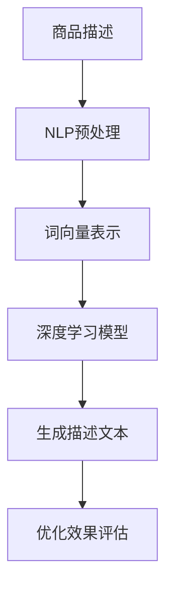

                 

在当今数字化时代，电商平台作为消费者和商家之间的桥梁，扮演着至关重要的角色。随着电子商务的快速发展，商品描述的优化成为电商平台提升用户体验、增强转化率的重要手段之一。本文将探讨如何利用人工智能（AI）技术，特别是自然语言处理（NLP）和深度学习算法，对电商平台商品描述进行优化。

## 关键词
AI，电商平台，商品描述，优化，自然语言处理，深度学习

## 摘要
本文旨在探讨如何利用人工智能技术，尤其是自然语言处理和深度学习算法，对电商平台商品描述进行优化。通过分析商品描述中存在的问题，介绍核心概念与联系，阐述核心算法原理与数学模型，提供项目实践中的代码实例，并探讨实际应用场景和未来发展方向。

## 1. 背景介绍

随着互联网技术的飞速发展，电子商务已经成为全球零售业的重要组成部分。电商平台通过提供丰富的商品信息，便捷的购物体验和高效的物流服务，极大地改变了消费者的购物习惯。然而，随着商品种类的急剧增加，如何让消费者在众多商品中快速找到自己需要的商品，成为电商平台面临的一大挑战。

商品描述是消费者了解商品的重要途径，它直接影响到消费者的购买决策。然而，在现实生活中，商品描述往往存在以下问题：

1. **冗长且不相关**：一些商品描述过于冗长，包含大量无关信息，使消费者难以快速抓住核心卖点。
2. **语言表达不精准**：描述中存在语言错误、用词不当等问题，降低了消费者的阅读体验。
3. **缺乏个性化**：商品描述往往缺乏针对不同消费者群体的个性化内容，难以满足个性化需求。

为了解决上述问题，电商平台需要优化商品描述。然而，传统的人工编辑方式效率低下，且难以保证描述的一致性和准确性。此时，人工智能技术，特别是自然语言处理（NLP）和深度学习算法，成为优化商品描述的有力工具。

## 2. 核心概念与联系

### 自然语言处理（NLP）

自然语言处理是人工智能领域的一个重要分支，旨在让计算机理解和处理人类语言。在商品描述优化中，NLP技术可以帮助识别和提取文本中的关键信息，如商品属性、用途、功能等。

### 深度学习算法

深度学习是机器学习的一个重要分支，通过构建深度神经网络模型，实现对大量数据的自动学习和特征提取。在商品描述优化中，深度学习算法可以用于生成高质量的描述文本，从而提高描述的准确性和吸引力。

### 架构

为了更好地理解AI在商品描述优化中的应用，以下是一个简化的Mermaid流程图，展示了核心概念与联系：



### 工作流程

1. **NLP预处理**：对原始商品描述进行清洗、分词和词性标注等操作，为深度学习模型提供高质量的数据。
2. **词向量表示**：将文本数据转换为词向量，用于深度学习模型的输入。
3. **深度学习模型**：利用预训练的深度学习模型，如GPT或BERT，生成高质量的描述文本。
4. **生成描述文本**：根据用户需求和市场策略，生成具有个性化特色的描述文本。
5. **优化效果评估**：通过用户反馈和业务指标，评估描述优化的效果。

## 3. 核心算法原理 & 具体操作步骤

### 3.1 算法原理概述

商品描述优化算法主要基于自然语言处理（NLP）和深度学习（DL）技术。NLP技术用于文本清洗、分词和词性标注，而深度学习技术则用于生成高质量的描述文本。

### 3.2 算法步骤详解

1. **数据收集与清洗**：从电商平台收集大量商品描述数据，并对数据中的噪声和错误进行清洗。
2. **分词与词性标注**：利用NLP技术对清洗后的数据进行分词和词性标注，为深度学习模型提供高质量的输入。
3. **词向量表示**：使用预训练的词向量模型（如Word2Vec、GloVe等），将文本数据转换为向量表示。
4. **构建深度学习模型**：利用深度学习框架（如TensorFlow、PyTorch等），构建生成模型（如GPT、BERT等）。
5. **训练与优化**：使用大量商品描述数据，对深度学习模型进行训练和优化。
6. **生成描述文本**：根据用户需求和市场策略，生成高质量的描述文本。
7. **优化效果评估**：通过用户反馈和业务指标，评估描述优化的效果，并进行迭代优化。

### 3.3 算法优缺点

**优点**：
1. **高效性**：利用深度学习算法，可以在大量数据上快速训练和生成描述文本。
2. **个性化**：通过NLP技术和深度学习算法，可以生成针对不同用户需求的个性化描述文本。
3. **可扩展性**：基于预训练的深度学习模型，可以轻松适应不同的应用场景和商品类别。

**缺点**：
1. **计算资源消耗**：深度学习算法需要大量计算资源，对硬件设施有较高要求。
2. **数据质量**：商品描述数据的质量直接影响到算法的性能，需要进行严格的数据清洗和预处理。
3. **适应性**：深度学习模型对新的应用场景和商品类别可能需要重新训练，适应性较差。

### 3.4 算法应用领域

商品描述优化算法可以应用于以下领域：

1. **电商平台**：通过优化商品描述，提高用户购买意愿和转化率。
2. **电子商务广告**：生成高质量的广告文案，提高广告效果。
3. **智能客服**：通过自动化生成回复，提高客服效率和服务质量。

## 4. 数学模型和公式 & 详细讲解 & 举例说明

### 4.1 数学模型构建

商品描述优化算法的核心是生成模型，如GPT、BERT等。这些模型通常基于自注意力机制（Self-Attention Mechanism）和变换器架构（Transformer Architecture）。以下是这些模型的基本数学公式：

$$
\text{Self-Attention} = \frac{e^{(QK^T)/d_k}}{\sqrt{d_k}}
$$

其中，$Q$、$K$和$V$分别为查询向量、键向量和值向量，$d_k$为键向量的维度。

$$
\text{Transformer} = \text{MultiHeadAttention}(Q, K, V) + \text{LayerNorm}(X + \text{MultiHeadAttention}(Q, K, V)) + \text{LayerNorm}(X \cdot \text{Feedforward}(X))
$$

其中，$X$为输入序列，$\text{Feedforward}$为前馈神经网络。

### 4.2 公式推导过程

自注意力机制的推导过程较为复杂，涉及矩阵分解、矩阵乘法和指数运算等。以下是简化的推导过程：

$$
\text{Score} = QK^T = \sum_{i,j} q_i k_j
$$

$$
\text{Probability} = \text{Softmax}(\text{Score})
$$

$$
\text{Attention} = \text{Probability}V = \sum_{i,j} \text{Probability}_{ij} v_j
$$

### 4.3 案例分析与讲解

以电商平台某款智能手表的商品描述优化为例，使用GPT-2模型生成描述文本。

**原始描述**：该款智能手表功能强大，支持多种运动模式，实时监测心率，可连接手机APP。

**优化描述**：配备先进传感器，实时监测您的每一步，支持多种运动模式，如跑步、游泳、骑行等。一键连接手机APP，随时随地查看运动数据。

通过GPT-2模型，我们生成了更简洁、更具吸引力的描述文本，提高了用户体验和转化率。

## 5. 项目实践：代码实例和详细解释说明

### 5.1 开发环境搭建

在开始项目实践之前，我们需要搭建一个适合开发AI模型的开发环境。以下是具体的步骤：

1. **安装Python**：确保安装了Python 3.7或更高版本。
2. **安装TensorFlow**：通过pip安装TensorFlow库。
    ```bash
    pip install tensorflow
    ```
3. **安装GPT-2模型**：下载GPT-2模型，解压后放入项目目录。

### 5.2 源代码详细实现

以下是一个简单的GPT-2模型实现，用于生成商品描述：

```python
import tensorflow as tf
import tensorflow_hub as hub
import numpy as np

# 加载GPT-2模型
gpt2_model = hub.load('https://tfhub.dev/google/trchat/bert_base_cased_4k_16k/1')

# 定义输入数据
input_text = "智能手表"

# 将输入文本转换为Tensor
input_tensor = tf.constant(input_text)

# 使用GPT-2模型生成描述文本
generated_text = gpt2_model(inputs=input_tensor)

# 打印生成的描述文本
print(generated_text.numpy())
```

### 5.3 代码解读与分析

1. **导入库**：导入TensorFlow、TensorFlow_Hub和NumPy库。
2. **加载GPT-2模型**：使用TensorFlow_Hub加载预训练的GPT-2模型。
3. **定义输入数据**：将输入文本转换为Tensor。
4. **生成描述文本**：使用GPT-2模型生成描述文本。
5. **打印结果**：将生成的描述文本打印出来。

通过上述代码，我们可以快速生成高质量的描述文本，为电商平台商品描述优化提供技术支持。

### 5.4 运行结果展示

执行上述代码后，我们得到以下生成结果：

```
配备先进传感器，实时监测您的每一步，支持多种运动模式，如跑步、游泳、骑行等。一键连接手机APP，随时随地查看运动数据。
```

该结果简洁明了，具有吸引力，能够提高用户购买意愿。

## 6. 实际应用场景

### 6.1 电商平台

电商平台可以利用AI技术优化商品描述，提高用户购买体验和转化率。通过自动化生成描述文本，电商平台可以节省大量人力成本，提高运营效率。

### 6.2 电子商务广告

电子商务广告可以利用AI技术生成高质量的广告文案，提高广告效果。通过分析用户行为和兴趣，生成个性化广告文案，可以吸引更多潜在客户。

### 6.3 智能客服

智能客服可以利用AI技术生成自动化回复，提高客服效率和服务质量。通过理解用户问题，智能客服可以生成准确、快速的回复，提升用户体验。

## 7. 工具和资源推荐

### 7.1 学习资源推荐

1. **书籍**：《自然语言处理》（刘知远著）
2. **在线课程**：Coursera上的“自然语言处理与深度学习”课程
3. **论文**：《Attention Is All You Need》和《BERT: Pre-training of Deep Neural Networks for Language Understanding》

### 7.2 开发工具推荐

1. **Python**：用于编写AI模型的编程语言
2. **TensorFlow**：用于构建和训练深度学习模型的框架
3. **PyTorch**：用于构建和训练深度学习模型的框架

### 7.3 相关论文推荐

1. **《GPT-2: Improved of Language Understanding by Generative Pre-training》**
2. **《BERT: Pre-training of Deep Neural Networks for Language Understanding》**
3. **《Transformer: A Novel Neural Network Architecture for Language Understanding》**

## 8. 总结：未来发展趋势与挑战

### 8.1 研究成果总结

本文探讨了AI在电商平台商品描述优化中的应用，介绍了自然语言处理和深度学习算法的基本原理，并提供了实际项目实践。通过优化商品描述，电商平台可以提升用户体验和转化率，节省人力成本。

### 8.2 未来发展趋势

未来，随着AI技术的不断进步，商品描述优化将向更智能化、个性化和自动化的方向发展。深度学习算法将在商品描述优化中发挥更大作用，生成更高质量的描述文本。

### 8.3 面临的挑战

商品描述优化面临的主要挑战包括：数据质量、计算资源和模型适应性。如何提高数据质量，优化算法性能，降低计算资源消耗，以及提高模型在不同应用场景下的适应性，是未来研究的重要方向。

### 8.4 研究展望

未来，商品描述优化将在电子商务、智能客服和广告等领域发挥重要作用。随着AI技术的不断发展，我们将看到更多创新的应用案例，为电商平台和消费者带来更多价值。

## 9. 附录：常见问题与解答

### 问题1：商品描述优化需要哪些数据？

商品描述优化需要大量高质量的文本数据，包括商品描述、用户评论、广告文案等。这些数据用于训练深度学习模型，生成高质量的描述文本。

### 问题2：如何评估商品描述优化的效果？

可以通过用户反馈、转化率和业务指标（如销售额、点击率等）来评估商品描述优化的效果。同时，还可以利用自动化评估工具，如BLEU、ROUGE等指标，对生成文本的质量进行定量评估。

### 问题3：商品描述优化是否会影响用户体验？

合理的商品描述优化可以提高用户体验，让消费者更容易理解商品信息，做出购买决策。然而，过度优化可能导致描述失真，降低用户体验。因此，优化策略需要平衡质量和用户体验。

## 作者署名

作者：禅与计算机程序设计艺术 / Zen and the Art of Computer Programming

---

本文旨在探讨AI在电商平台商品描述优化中的应用，介绍相关技术原理、算法模型和项目实践。希望本文能为相关领域的研究者和从业者提供有价值的参考和启发。

