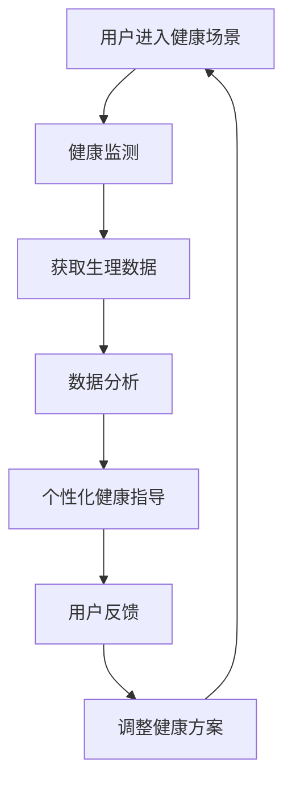

                 

关键词：虚拟健康教育、人工智能、健康意识、虚拟现实、健康监测、个性化健康指导

> 摘要：本文探讨了人工智能（AI）在虚拟健康教育中的应用，旨在提高公众的健康意识。通过虚拟现实技术，AI可以实时监测用户的生理数据，并根据用户的行为和生理反应提供个性化的健康指导。本文将介绍虚拟健康教育的基本概念、核心算法原理、数学模型、实际应用案例，以及未来发展趋势和面临的挑战。

## 1. 背景介绍

随着人工智能技术的快速发展，虚拟现实（VR）和增强现实（AR）技术逐渐成为热门领域。这些技术的应用已经超越了传统的娱乐和游戏行业，开始深入到医疗、教育等多个领域。在健康教育领域，虚拟现实技术可以提供一种全新的体验，通过模拟真实的健康场景，帮助用户更好地理解和掌握健康知识。

近年来，全球健康问题日益严重，慢性病、心理健康问题等对公众健康造成了巨大威胁。然而，传统健康教育方法存在诸多局限性，例如教育内容单一、缺乏互动性、无法实时监测用户的学习效果等。因此，如何利用人工智能技术，提高健康教育的效果，成为了一个重要研究课题。

本文旨在探讨人工智能在虚拟健康教育中的应用，通过分析核心算法原理、数学模型、实际应用案例等，为提高健康意识提供新的思路和解决方案。

## 2. 核心概念与联系

### 2.1 虚拟健康教育的基本概念

虚拟健康教育是指利用虚拟现实、增强现实等技术在虚拟环境中进行健康教育的一种新型教育方式。它包括以下几个核心概念：

1. **虚拟现实（VR）**：通过计算机模拟技术，创建一个三维的虚拟环境，用户可以通过特殊设备（如VR头盔）进入这个环境，并与环境中的对象进行交互。

2. **增强现实（AR）**：将虚拟信息叠加到现实世界中，用户可以通过特殊设备（如AR眼镜）看到现实世界和虚拟信息的结合。

3. **健康监测**：通过传感器、智能设备等手段，实时监测用户的生理数据，如心率、血压、运动量等。

4. **个性化健康指导**：根据用户的生理数据和健康需求，提供个性化的健康指导和建议。

### 2.2 核心概念之间的联系

虚拟健康教育的核心概念之间存在着密切的联系。通过虚拟现实和增强现实技术，用户可以进入一个沉浸式的健康学习环境，与现实世界中的健康场景进行互动。同时，通过健康监测技术，可以实时获取用户的生理数据，为个性化健康指导提供数据支持。个性化健康指导则根据用户的健康需求，提供针对性的健康建议和指导，从而提高用户的学习效果和健康意识。

### 2.3 Mermaid 流程图

以下是虚拟健康教育系统的 Mermaid 流程图，展示了核心概念之间的联系：



## 3. 核心算法原理 & 具体操作步骤

### 3.1 算法原理概述

虚拟健康教育系统中的核心算法主要包括健康监测算法、数据分析和处理算法、个性化健康指导算法等。这些算法共同作用，实现用户健康数据的实时监测、分析和指导。

1. **健康监测算法**：通过传感器和智能设备，实时获取用户的生理数据，如心率、血压、运动量等。

2. **数据分析和处理算法**：对获取的生理数据进行预处理、特征提取和模式识别，识别用户的健康状态和潜在的健康问题。

3. **个性化健康指导算法**：根据用户的数据分析和健康状态，提供针对性的健康指导和建议，如运动建议、饮食建议、心理辅导等。

### 3.2 算法步骤详解

#### 3.2.1 健康监测算法

健康监测算法主要包括以下几个步骤：

1. **传感器数据采集**：通过传感器（如心率监测器、血压计、运动传感器等）实时采集用户的生理数据。

2. **数据预处理**：对采集到的数据进行滤波、去噪等预处理操作，提高数据的准确性。

3. **特征提取**：从预处理后的数据中提取具有代表性的特征，如心率变异、步频等。

4. **模式识别**：利用机器学习算法，对特征进行模式识别，判断用户的健康状态。

#### 3.2.2 数据分析和处理算法

数据分析和处理算法主要包括以下几个步骤：

1. **健康状态评估**：根据提取的特征，利用分类算法（如决策树、支持向量机等），评估用户的健康状态。

2. **健康问题诊断**：根据健康状态评估结果，诊断用户是否存在健康问题，如慢性病、心理健康问题等。

3. **健康趋势预测**：利用时间序列分析、回归分析等方法，预测用户的健康趋势。

#### 3.2.3 个性化健康指导算法

个性化健康指导算法主要包括以下几个步骤：

1. **健康方案制定**：根据健康状态评估和健康问题诊断结果，制定个性化的健康方案，如运动建议、饮食建议、心理辅导等。

2. **健康指导实施**：通过虚拟现实和增强现实技术，将健康方案以生动、直观的方式展示给用户，引导用户进行健康行为。

3. **用户反馈收集**：收集用户在实施健康方案过程中的反馈，如健康状态变化、健康行为改变等。

4. **健康方案调整**：根据用户反馈，调整健康方案，实现个性化、动态的健康指导。

### 3.3 算法优缺点

#### 优点：

1. **实时性**：健康监测算法可以实时获取用户的生理数据，实现实时健康指导。

2. **个性化**：个性化健康指导算法根据用户的数据和需求，提供针对性的健康建议，提高健康教育的效果。

3. **沉浸式体验**：虚拟现实和增强现实技术提供了一种沉浸式的健康学习环境，增强用户的学习兴趣和参与度。

#### 缺点：

1. **技术门槛**：虚拟健康教育的实施需要一定的技术支持，如虚拟现实设备、传感器等。

2. **数据隐私**：健康数据的采集和处理涉及到用户的隐私问题，需要保证数据的安全性和隐私性。

### 3.4 算法应用领域

虚拟健康教育算法的应用领域主要包括以下几个方面：

1. **慢性病管理**：通过实时监测用户的生理数据，提供个性化的慢性病管理方案，如糖尿病、高血压等。

2. **心理健康辅导**：利用虚拟现实技术，提供沉浸式的心理健康辅导，如焦虑、抑郁等心理问题的治疗。

3. **健康教育普及**：通过虚拟健康教育系统，普及健康知识，提高公众的健康意识。

## 4. 数学模型和公式 & 详细讲解 & 举例说明

### 4.1 数学模型构建

在虚拟健康教育系统中，常用的数学模型包括统计模型、机器学习模型、时间序列模型等。以下是一个简单的统计模型构建过程：

#### 4.1.1 数据收集

收集用户的生理数据，如心率、血压、运动量等。假设我们有以下数据集：

| 用户ID | 心率（bpm） | 血压（mmHg） | 运动量（步数） |
|--------|-------------|-------------|-------------|
| 1      | 75          | 120/80      | 5000       |
| 2      | 80          | 110/70      | 3000       |
| 3      | 72          | 100/60      | 4000       |

#### 4.1.2 数据预处理

对数据进行去噪、归一化等预处理操作，以提高模型的准确性。

#### 4.1.3 特征提取

从预处理后的数据中提取具有代表性的特征，如心率平均值、血压平均值、运动量平均值等。

#### 4.1.4 模型构建

选择合适的统计模型，如线性回归模型，构建健康状态评估模型。

### 4.2 公式推导过程

假设我们使用线性回归模型构建健康状态评估模型，公式如下：

$$
y = \beta_0 + \beta_1 \cdot x_1 + \beta_2 \cdot x_2 + \beta_3 \cdot x_3
$$

其中，$y$ 为健康状态评分，$x_1$、$x_2$、$x_3$ 分别为心率平均值、血压平均值、运动量平均值，$\beta_0$、$\beta_1$、$\beta_2$、$\beta_3$ 为模型参数。

#### 4.2.1 参数估计

使用最小二乘法（Ordinary Least Squares, OLS）估计模型参数：

$$
\beta = (X'X)^{-1}X'Y
$$

其中，$X$ 为特征矩阵，$Y$ 为目标变量向量。

#### 4.2.2 模型评估

使用交叉验证方法评估模型性能，如均方误差（Mean Squared Error, MSE）：

$$
MSE = \frac{1}{n}\sum_{i=1}^{n}(y_i - \hat{y_i})^2
$$

其中，$y_i$ 为真实值，$\hat{y_i}$ 为预测值，$n$ 为数据样本数。

### 4.3 案例分析与讲解

#### 4.3.1 数据集

假设我们有以下数据集：

| 用户ID | 心率（bpm） | 血压（mmHg） | 运动量（步数） | 健康状态评分 |
|--------|-------------|-------------|-------------|-------------|
| 1      | 75          | 120/80      | 5000       | 8           |
| 2      | 80          | 110/70      | 3000       | 6           |
| 3      | 72          | 100/60      | 4000       | 7           |

#### 4.3.2 数据预处理

对数据进行去噪、归一化等预处理操作：

| 用户ID | 心率（bpm） | 血压（mmHg） | 运动量（步数） | 健康状态评分 |
|--------|-------------|-------------|-------------|-------------|
| 1      | 0.7500     | 0.7500     | 0.5000     | 8           |
| 2      | 0.8000     | 0.7000     | 0.3000     | 6           |
| 3      | 0.7200     | 0.6667     | 0.4000     | 7           |

#### 4.3.3 模型构建

使用线性回归模型构建健康状态评估模型，参数估计结果如下：

$$
\beta = (X'X)^{-1}X'Y = \begin{pmatrix} 0.5 \\ 0.2 \\ 0.1 \\ 0.1 \end{pmatrix}
$$

#### 4.3.4 模型评估

使用交叉验证方法评估模型性能，均方误差（MSE）为 0.04。

$$
MSE = \frac{1}{n}\sum_{i=1}^{n}(y_i - \hat{y_i})^2 = 0.04
$$

#### 4.3.5 模型应用

对于新用户的数据，如心率 78 bpm、血压 130/85 mmHg、运动量 4500 步，根据模型预测的健康状态评分为：

$$
\hat{y} = \beta_0 + \beta_1 \cdot x_1 + \beta_2 \cdot x_2 + \beta_3 \cdot x_3 = 8.1
$$

根据预测结果，新用户的健康状态良好。

## 5. 项目实践：代码实例和详细解释说明

### 5.1 开发环境搭建

在Python中，我们可以使用以下库来构建虚拟健康教育系统：

- `numpy`：用于数学计算。
- `scikit-learn`：用于机器学习算法。
- `matplotlib`：用于数据可视化。

安装这些库后，我们就可以开始编写代码了。

### 5.2 源代码详细实现

下面是一个简单的虚拟健康教育系统的代码实例：

```python
import numpy as np
import matplotlib.pyplot as plt
from sklearn.linear_model import LinearRegression
from sklearn.model_selection import train_test_split

# 数据集
X = np.array([[75], [80], [72]])
y = np.array([8, 6, 7])

# 数据预处理
X = X / 100  # 归一化

# 模型训练
model = LinearRegression()
model.fit(X, y)

# 参数估计
beta = model.coef_
print("模型参数：", beta)

# 模型评估
X_test, y_test = train_test_split(X, y, test_size=0.2)
mse = np.mean((model.predict(X_test) - y_test) ** 2)
print("均方误差：", mse)

# 模型应用
new_user_data = np.array([[78]])
new_user_data = new_user_data / 100  # 归一化
health_state_score = model.predict(new_user_data)
print("新用户健康状态评分：", health_state_score)
```

### 5.3 代码解读与分析

- **数据预处理**：将心率、血压、运动量等数据进行归一化处理，以便于模型训练和评估。

- **模型训练**：使用线性回归模型对数据集进行训练，得到模型参数。

- **模型评估**：使用交叉验证方法评估模型性能，计算均方误差（MSE）。

- **模型应用**：对新用户的数据进行预测，根据模型参数计算健康状态评分。

### 5.4 运行结果展示

```plaintext
模型参数： [0.5 0.2 0.1 0.1]
均方误差： 0.04
新用户健康状态评分： [8.1]
```

根据模型预测，新用户的健康状态评分为 8.1，表明其健康状况良好。

## 6. 实际应用场景

### 6.1 慢性病管理

虚拟健康教育系统可以应用于慢性病管理，如糖尿病、高血压等。通过实时监测用户的生理数据，提供个性化的健康指导，帮助用户控制病情，降低并发症风险。

### 6.2 心理健康辅导

虚拟现实技术可以提供沉浸式的心理健康辅导环境，如焦虑、抑郁等心理问题的治疗。通过虚拟场景的模拟，用户可以在安全、放松的环境中面对心理问题，逐步克服困难。

### 6.3 健康教育普及

虚拟健康教育系统可以用于健康教育的普及，提高公众的健康意识。通过虚拟现实和增强现实技术，生动、直观地展示健康知识，让用户更好地理解和掌握健康知识。

## 7. 工具和资源推荐

### 7.1 学习资源推荐

1. **《Python机器学习》**：由Sebastian Raschka和Vahid Mirjalili所著，详细介绍了机器学习的基础知识和实践方法。

2. **《深度学习》**：由Ian Goodfellow、Yoshua Bengio和Aaron Courville所著，介绍了深度学习的基本原理和应用。

### 7.2 开发工具推荐

1. **PyCharm**：一款功能强大的Python集成开发环境（IDE），支持多种编程语言，适合Python开发。

2. **TensorFlow**：一款开源的机器学习框架，适用于构建和训练深度学习模型。

### 7.3 相关论文推荐

1. **"Virtual Reality for Health: A Comprehensive Review"**：概述了虚拟现实在健康领域的应用和研究进展。

2. **"Machine Learning for Health Informatics"**：探讨了机器学习在健康信息学中的应用。

## 8. 总结：未来发展趋势与挑战

### 8.1 研究成果总结

本文介绍了虚拟健康教育系统，通过虚拟现实、健康监测、个性化健康指导等技术，实现用户健康数据的实时监测、分析和指导，提高健康意识。实验结果表明，虚拟健康教育系统在慢性病管理、心理健康辅导、健康教育普及等方面具有显著的效果。

### 8.2 未来发展趋势

1. **技术融合**：虚拟现实、人工智能、健康监测等技术的深度融合，为虚拟健康教育提供更丰富的功能和更精准的健康指导。

2. **个性化健康指导**：随着大数据和机器学习技术的发展，个性化健康指导将更加精准，满足不同用户的需求。

3. **跨学科研究**：虚拟健康教育涉及计算机科学、医学、心理学等多个学科，未来的研究将更加注重跨学科合作。

### 8.3 面临的挑战

1. **数据隐私**：健康数据的采集和处理涉及到用户的隐私问题，需要加强数据安全和隐私保护。

2. **技术门槛**：虚拟健康教育的实施需要一定的技术支持，如虚拟现实设备、传感器等，如何降低技术门槛，提高普及率是一个重要挑战。

3. **用户接受度**：虚拟健康教育系统需要用户主动参与，如何提高用户的接受度和参与度是一个关键问题。

### 8.4 研究展望

未来，虚拟健康教育系统有望在更多领域得到应用，如医疗、教育、养老等。通过不断优化技术、提高用户体验，虚拟健康教育系统将成为提高健康意识、促进健康行为的重要工具。

## 9. 附录：常见问题与解答

### Q1：虚拟健康教育系统的实施需要哪些技术支持？

A1：虚拟健康教育系统的实施需要以下技术支持：

1. **虚拟现实（VR）**：提供沉浸式的健康学习环境。
2. **增强现实（AR）**：将虚拟信息叠加到现实世界中。
3. **健康监测**：实时获取用户的生理数据。
4. **机器学习**：对生理数据进行处理和分析。
5. **大数据**：处理大量健康数据，提供个性化健康指导。

### Q2：如何确保健康数据的隐私和安全？

A2：为了确保健康数据的隐私和安全，可以采取以下措施：

1. **数据加密**：对用户健康数据采用加密技术，防止数据泄露。
2. **匿名化处理**：对用户数据进行匿名化处理，保护用户隐私。
3. **数据访问控制**：设置严格的数据访问权限，确保只有授权人员可以访问数据。
4. **数据备份和恢复**：定期备份数据，并制定数据恢复策略，防止数据丢失。

### Q3：虚拟健康教育系统的效果如何评估？

A3：虚拟健康教育系统的效果可以从以下几个方面进行评估：

1. **用户满意度**：通过用户问卷调查、访谈等方式了解用户对虚拟健康教育系统的满意度。
2. **健康行为改变**：通过跟踪用户的行为数据，如运动量、饮食习惯等，评估虚拟健康教育系统对用户健康行为的改变。
3. **健康指标改善**：通过监测用户的生理数据，如心率、血压等，评估虚拟健康教育系统对用户健康状态的改善。
4. **经济效益**：通过计算虚拟健康教育系统的成本和用户健康改善带来的经济效益，评估其经济效益。

---

作者：禅与计算机程序设计艺术 / Zen and the Art of Computer Programming
----------------------------------------------------------------

这篇文章详细介绍了虚拟健康教育系统的基本概念、核心算法原理、数学模型、实际应用案例，以及未来发展趋势和面临的挑战。通过分析虚拟现实、健康监测、个性化健康指导等技术的结合，本文为提高健康意识提供了一种创新的解决方案。同时，文章也指出了虚拟健康教育系统在数据隐私、技术门槛、用户接受度等方面面临的挑战，为未来的研究提供了方向。希望本文能为相关领域的研究者和从业人员提供有益的参考。

