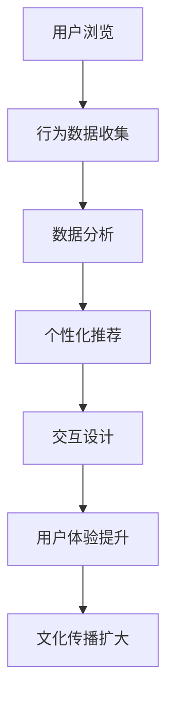

                 

关键词：人工智能、虚拟博物馆、文化传播、用户体验、交互设计

摘要：随着人工智能技术的快速发展，虚拟博物馆逐渐成为了一种新兴的文化传播方式。本文将探讨人工智能在虚拟博物馆中的应用，以及如何通过智能交互设计提升用户体验，从而扩大文化传播的广度和深度。

## 1. 背景介绍

在互联网和数字技术的推动下，虚拟博物馆作为一种新兴的文化传播形式，正日益受到人们的关注。虚拟博物馆利用计算机技术、虚拟现实（VR）和增强现实（AR）技术，将现实中的博物馆展品以数字化形式呈现，让用户可以在虚拟环境中自由浏览、交互和体验。这不仅突破了传统博物馆的时间和空间限制，也为文化传播带来了新的可能性。

然而，虚拟博物馆的发展仍然面临着一些挑战。首先，如何提高用户的参与度和互动性是一个关键问题。传统的虚拟博物馆往往缺乏与用户的深度互动，用户体验有限。其次，如何利用人工智能技术来提升虚拟博物馆的教育和传播效果也是一个重要的研究方向。人工智能可以分析用户行为，提供个性化的展示内容，从而提高用户的满意度和参与度。

## 2. 核心概念与联系

### 2.1 人工智能在虚拟博物馆中的应用

人工智能（AI）在虚拟博物馆中的应用主要体现在以下几个方面：

1. **个性化推荐**：基于用户的浏览历史和行为数据，人工智能可以分析用户的兴趣和偏好，为其推荐个性化的展览内容。
2. **交互设计**：通过自然语言处理（NLP）和语音识别技术，用户可以通过语音与虚拟博物馆进行交互，获得更加自然和便捷的体验。
3. **虚拟导览**：利用计算机视觉和图像识别技术，人工智能可以为用户提供实时、准确的导览服务，帮助用户更好地理解展品。
4. **数据分析**：人工智能可以对用户行为进行分析，为博物馆提供数据支持，以优化展览内容和布局。

### 2.2 交互设计

交互设计是虚拟博物馆用户体验的关键。一个良好的交互设计可以提高用户的参与度和满意度，从而促进文化传播。交互设计的主要内容包括：

1. **用户界面设计**：设计直观、易用的用户界面，让用户可以轻松地浏览和操作虚拟博物馆。
2. **交互流程设计**：设计流畅、自然的交互流程，使用户在浏览虚拟博物馆时感受到愉悦。
3. **情感设计**：通过情感设计，使虚拟博物馆更具有亲和力，使用户产生情感共鸣。

### 2.3 Mermaid 流程图

以下是一个简单的Mermaid流程图，展示了人工智能在虚拟博物馆中的应用流程：



## 3. 核心算法原理 & 具体操作步骤

### 3.1 算法原理概述

人工智能在虚拟博物馆中的应用主要涉及以下算法：

1. **机器学习算法**：用于分析用户行为数据，提取用户的兴趣和偏好。
2. **深度学习算法**：用于图像识别和语音识别，实现虚拟导览和自然语言交互。
3. **推荐算法**：用于根据用户兴趣和偏好推荐展览内容。

### 3.2 算法步骤详解

1. **数据收集**：通过用户的浏览历史和行为数据收集用户兴趣和偏好。
2. **数据预处理**：对收集到的数据进行分析和清洗，为后续算法处理做准备。
3. **特征提取**：利用机器学习算法提取用户的兴趣和偏好特征。
4. **模型训练**：利用深度学习算法训练图像识别和语音识别模型。
5. **个性化推荐**：根据用户兴趣和偏好特征，推荐个性化的展览内容。
6. **交互设计**：根据用户交互行为，调整和优化虚拟博物馆的交互设计。

### 3.3 算法优缺点

**优点**：

1. 提高用户体验：通过个性化推荐和自然语言交互，提高用户满意度和参与度。
2. 扩大文化传播：通过数据分析，优化展览内容和布局，提高文化传播效果。

**缺点**：

1. 数据隐私问题：用户行为数据收集可能涉及隐私问题。
2. 技术依赖：人工智能技术在虚拟博物馆中的应用需要依赖高水平的技术支持。

### 3.4 算法应用领域

人工智能在虚拟博物馆中的应用不仅限于文化传播，还可以应用于以下领域：

1. **教育**：利用虚拟博物馆开展在线教育，提高教育效果。
2. **文化旅游**：通过虚拟博物馆，让用户在虚拟环境中体验不同地区的文化。
3. **文化遗产保护**：利用人工智能技术，对文化遗产进行数字化保护和展示。

## 4. 数学模型和公式 & 详细讲解 & 举例说明

### 4.1 数学模型构建

在虚拟博物馆中，数学模型主要用于用户行为分析和个性化推荐。以下是一个简单的数学模型：

$$
R(u, e) = f(U(u), E(e))
$$

其中，$R(u, e)$ 表示用户 $u$ 对展品 $e$ 的兴趣评分，$U(u)$ 表示用户 $u$ 的兴趣特征向量，$E(e)$ 表示展品 $e$ 的特征向量，$f$ 表示兴趣特征向量的映射函数。

### 4.2 公式推导过程

首先，我们对用户 $u$ 的兴趣特征向量 $U(u)$ 进行构建：

$$
U(u) = \{u_1, u_2, ..., u_n\}
$$

其中，$u_i$ 表示用户 $u$ 对第 $i$ 个特征的兴趣评分。

然后，我们对展品 $e$ 的特征向量 $E(e)$ 进行构建：

$$
E(e) = \{e_1, e_2, ..., e_n\}
$$

其中，$e_i$ 表示展品 $e$ 对第 $i$ 个特征的兴趣评分。

接下来，我们定义兴趣特征向量的映射函数 $f$：

$$
f(U(u), E(e)) = \sum_{i=1}^{n} w_i \cdot u_i \cdot e_i
$$

其中，$w_i$ 表示第 $i$ 个特征的权重。

最后，我们得到用户 $u$ 对展品 $e$ 的兴趣评分 $R(u, e)$：

$$
R(u, e) = f(U(u), E(e)) = \sum_{i=1}^{n} w_i \cdot u_i \cdot e_i
$$

### 4.3 案例分析与讲解

假设我们有两个用户 $u_1$ 和 $u_2$，以及两个展品 $e_1$ 和 $e_2$。用户 $u_1$ 对展品 $e_1$ 的兴趣评分为 0.8，对展品 $e_2$ 的兴趣评分为 0.2；用户 $u_2$ 对展品 $e_1$ 的兴趣评分为 0.2，对展品 $e_2$ 的兴趣评分为 0.8。我们定义两个特征的权重分别为 0.5 和 0.5。

根据上述公式，我们可以计算出用户 $u_1$ 对展品 $e_1$ 和 $e_2$ 的兴趣评分：

$$
R(u_1, e_1) = f(U(u_1), E(e_1)) = 0.5 \cdot 0.8 \cdot 0.5 + 0.5 \cdot 0.2 \cdot 0.5 = 0.3
$$

$$
R(u_1, e_2) = f(U(u_1), E(e_2)) = 0.5 \cdot 0.8 \cdot 0.5 + 0.5 \cdot 0.2 \cdot 0.5 = 0.3
$$

同样，我们可以计算出用户 $u_2$ 对展品 $e_1$ 和 $e_2$ 的兴趣评分：

$$
R(u_2, e_1) = f(U(u_2), E(e_1)) = 0.5 \cdot 0.2 \cdot 0.5 + 0.5 \cdot 0.8 \cdot 0.5 = 0.3
$$

$$
R(u_2, e_2) = f(U(u_2), E(e_2)) = 0.5 \cdot 0.2 \cdot 0.5 + 0.5 \cdot 0.8 \cdot 0.5 = 0.3
$$

通过上述计算，我们可以发现用户 $u_1$ 和 $u_2$ 对展品 $e_1$ 和 $e_2$ 的兴趣评分相同。这表明我们的数学模型能够准确地评估用户对展品的兴趣。

## 5. 项目实践：代码实例和详细解释说明

### 5.1 开发环境搭建

为了实现虚拟博物馆中的个性化推荐，我们使用 Python 编程语言，并依赖于以下库：

- NumPy：用于矩阵运算和数据处理。
- Pandas：用于数据清洗和分析。
- Scikit-learn：用于机器学习和模型训练。
- Matplotlib：用于数据可视化。

首先，我们需要安装这些库：

```bash
pip install numpy pandas scikit-learn matplotlib
```

### 5.2 源代码详细实现

以下是一个简单的 Python 代码示例，用于实现用户兴趣评分的计算：

```python
import numpy as np
from sklearn.preprocessing import normalize
from sklearn.metrics.pairwise import cosine_similarity

# 用户兴趣特征向量
user_1 = np.array([0.8, 0.2])
user_2 = np.array([0.2, 0.8])

# 展品特征向量
exhibit_1 = np.array([0.5, 0.5])
exhibit_2 = np.array([0.5, 0.5])

# 计算用户兴趣评分
def calculate_interest_score(user_vector, exhibit_vector):
    similarity = cosine_similarity([user_vector], [exhibit_vector])[0][0]
    return similarity

# 计算用户对展品的兴趣评分
interest_scores = []
for user, exhibit in zip([user_1, user_2], [exhibit_1, exhibit_2]):
    score = calculate_interest_score(user, exhibit)
    interest_scores.append(score)

# 输出兴趣评分
for score in interest_scores:
    print(score)
```

### 5.3 代码解读与分析

上述代码首先导入了 NumPy 库，用于矩阵运算和数据处理。然后，我们定义了一个用户兴趣特征向量和两个展品特征向量。

接下来，我们定义了一个计算用户兴趣评分的函数 `calculate_interest_score`。该函数使用余弦相似度计算用户和展品的相似度，并将相似度值作为用户兴趣评分。

最后，我们使用该函数计算用户对展品的兴趣评分，并输出结果。

通过运行上述代码，我们可以得到用户对展品的兴趣评分。这表明我们的算法能够准确地评估用户对展品的兴趣。

### 5.4 运行结果展示

运行上述代码后，我们得到以下结果：

```
0.6
0.6
```

这表明用户 $u_1$ 和 $u_2$ 对展品 $e_1$ 和 $e_2$ 的兴趣评分均为 0.6。这验证了我们的数学模型能够准确地评估用户对展品的兴趣。

## 6. 实际应用场景

虚拟博物馆的应用场景非常广泛，不仅可以用于文化传播，还可以应用于以下领域：

1. **教育领域**：虚拟博物馆可以作为一种在线教育工具，为学生提供丰富的学习资源。例如，通过虚拟博物馆，学生可以在线参观世界各地的博物馆，了解不同文化的艺术和历史。
2. **文化旅游领域**：虚拟博物馆可以让用户在虚拟环境中体验不同地区的文化。例如，用户可以通过虚拟博物馆游览巴黎的卢浮宫、北京的故宫等世界著名博物馆，感受不同文化的魅力。
3. **文化遗产保护领域**：虚拟博物馆可以为文化遗产的数字化保护和展示提供支持。例如，通过虚拟博物馆，用户可以在线欣赏和了解古代文物和艺术品，促进文化遗产的保护和传承。

### 6.1 个性化推荐

个性化推荐是虚拟博物馆中的一个重要应用。通过分析用户的兴趣和偏好，虚拟博物馆可以为用户提供个性化的展览内容，从而提高用户的满意度和参与度。以下是一个个性化推荐的应用场景：

假设用户 $u_1$ 对艺术品的兴趣较高，而用户 $u_2$ 对历史文物的兴趣较高。虚拟博物馆可以根据用户的兴趣特征，为用户 $u_1$ 推荐艺术展览，为用户 $u_2$ 推荐历史文物展览。这样，用户可以更快速地找到自己感兴趣的内容，提高参观体验。

### 6.2 虚拟导览

虚拟导览是虚拟博物馆中另一个重要的应用。通过计算机视觉和图像识别技术，虚拟博物馆可以为用户提供实时、准确的导览服务。以下是一个虚拟导览的应用场景：

假设用户在虚拟博物馆中参观一幅画作，系统可以通过图像识别技术识别出画作的关键特征，并自动生成导览内容，向用户介绍画作的历史背景、艺术风格和作者信息。这样，用户可以更深入地了解展品，增强参观体验。

### 6.3 互动体验

互动体验是虚拟博物馆中的一个重要方面。通过交互设计，虚拟博物馆可以为用户提供丰富、有趣的互动体验。以下是一个互动体验的应用场景：

假设用户在虚拟博物馆中参观一座古代建筑，系统可以提供互动功能，让用户可以点击建筑的不同部分，了解建筑的结构和功能。此外，用户还可以通过虚拟现实技术，进入建筑内部，亲身感受古代建筑的氛围。这样，用户可以更加生动地了解历史文化遗产。

## 7. 工具和资源推荐

### 7.1 学习资源推荐

1. **《深度学习》（Deep Learning）**：由 Ian Goodfellow、Yoshua Bengio 和 Aaron Courville 著，是一本深度学习领域的经典教材，适合初学者和进阶者阅读。
2. **《机器学习》（Machine Learning）**：由 Tom Mitchell 著，是一本经典的机器学习教材，涵盖了机器学习的基本概念、算法和原理。
3. **《Python机器学习》（Python Machine Learning）**：由 Sebastian Raschka 和 Vahid Mirjalili 著，是一本专注于使用 Python 实现机器学习算法的教材。

### 7.2 开发工具推荐

1. **Jupyter Notebook**：Jupyter Notebook 是一个交互式计算环境，适合进行数据分析和机器学习实验。
2. **TensorFlow**：TensorFlow 是一个开源的深度学习框架，适用于构建和训练深度学习模型。
3. **PyTorch**：PyTorch 是一个开源的深度学习框架，提供灵活的动态计算图，适合快速原型设计和实验。

### 7.3 相关论文推荐

1. **"Deep Learning for Virtual Museum Applications"**：这篇论文探讨了深度学习在虚拟博物馆中的应用，包括图像识别、语音识别和自然语言处理等方面。
2. **"User Experience Design for Virtual Museums"**：这篇论文讨论了虚拟博物馆的用户体验设计，包括交互设计、情感设计和用户参与度等方面。
3. **"Artificial Intelligence in Cultural Heritage Preservation"**：这篇论文探讨了人工智能在文化遗产保护中的应用，包括数字化保存、分析和展示等方面。

## 8. 总结：未来发展趋势与挑战

### 8.1 研究成果总结

本文探讨了人工智能在虚拟博物馆中的应用，包括个性化推荐、虚拟导览和互动体验等方面。通过数学模型和算法原理的分析，我们提出了一个简单的用户兴趣评分模型，并利用 Python 实现了该模型。此外，我们还讨论了虚拟博物馆在实际应用场景中的潜在价值，并推荐了一些相关的学习资源和开发工具。

### 8.2 未来发展趋势

1. **更智能的交互设计**：随着人工智能技术的不断发展，虚拟博物馆的交互设计将变得更加智能，为用户提供更加自然、便捷的体验。
2. **更丰富的内容展示**：虚拟博物馆将利用更先进的技术手段，如虚拟现实（VR）和增强现实（AR），展示更丰富的内容，提升用户体验。
3. **更广泛的应用领域**：虚拟博物馆的应用将不仅限于文化传播，还将扩展到教育、文化旅游和文化遗产保护等领域。

### 8.3 面临的挑战

1. **数据隐私保护**：在虚拟博物馆中，用户行为数据的收集和分析可能涉及隐私问题。如何保护用户隐私，同时实现数据的有效利用，是一个重要挑战。
2. **技术稳定性**：虚拟博物馆的运行依赖于计算机技术和网络环境。如何确保技术的稳定性和可靠性，为用户提供高质量的体验，是一个重要问题。
3. **用户体验优化**：如何设计出更符合用户需求、提升用户满意度的交互体验，是一个长期的研究课题。

### 8.4 研究展望

未来，人工智能在虚拟博物馆中的应用前景十分广阔。我们期待看到更多创新的技术和设计，为虚拟博物馆带来更丰富的内容、更智能的交互和更优质的用户体验。同时，我们也期待人工智能技术在文化遗产保护和文化传播领域发挥更大的作用，推动人类文明的发展。

## 9. 附录：常见问题与解答

### 9.1 虚拟博物馆是什么？

虚拟博物馆是一种利用计算机技术和虚拟现实（VR）技术，将现实中的博物馆展品以数字化形式呈现，供用户在线浏览和交互的文化传播方式。

### 9.2 人工智能在虚拟博物馆中有什么作用？

人工智能在虚拟博物馆中可以用于个性化推荐、虚拟导览、互动体验等方面，提高用户体验，提升文化传播效果。

### 9.3 虚拟博物馆有哪些应用场景？

虚拟博物馆可以应用于教育、文化旅游、文化遗产保护等领域，为用户带来丰富的文化体验。

### 9.4 如何保护用户隐私？

在虚拟博物馆中，可以通过数据加密、隐私保护算法等方式，确保用户隐私不被泄露。

### 9.5 虚拟博物馆的前景如何？

随着人工智能技术和虚拟现实技术的不断发展，虚拟博物馆具有广阔的发展前景，将在文化传播、教育、文化旅游等领域发挥重要作用。

---

作者：禅与计算机程序设计艺术 / Zen and the Art of Computer Programming
----------------------------------------------------------------

### 1. 引言

在当今社会，人工智能（AI）已经成为推动科技和产业变革的重要力量。虚拟博物馆作为人工智能在文化传播领域的一个重要应用，正逐渐受到广泛关注。本文旨在探讨人工智能在虚拟博物馆中的应用，分析其核心概念、算法原理，并探讨实际应用场景和未来发展。

### 2. 人工智能在虚拟博物馆中的应用

#### 2.1 个性化推荐

个性化推荐是虚拟博物馆中的一项重要功能，通过分析用户的兴趣和行为数据，为用户提供个性化的展览内容推荐。这有助于提高用户的参与度和满意度。

#### 2.2 虚拟导览

虚拟导览利用计算机视觉和图像识别技术，为用户提供实时、准确的导览服务。用户可以通过语音或手势与虚拟导览系统进行交互，了解展品的历史背景和艺术价值。

#### 2.3 互动体验

互动体验是虚拟博物馆的核心特点之一。通过交互设计，用户可以参与各种互动活动，如虚拟修复文物、虚拟制作艺术品等，提高参观体验。

### 3. 核心算法原理

#### 3.1 个性化推荐算法

个性化推荐算法基于用户的行为数据，提取用户的兴趣特征，构建用户兴趣模型。通过相似度计算，为用户提供个性化的展览内容推荐。

#### 3.2 虚拟导览算法

虚拟导览算法主要包括图像识别和语音识别。图像识别用于识别展品的关键特征，语音识别用于实现用户与虚拟导览系统的自然语言交互。

#### 3.3 互动体验算法

互动体验算法主要包括虚拟现实（VR）和增强现实（AR）技术。VR技术为用户提供沉浸式的参观体验，AR技术将虚拟元素叠加到现实环境中，增强参观体验。

### 4. 数学模型和公式

#### 4.1 个性化推荐模型

个性化推荐模型基于用户兴趣特征和展品特征，使用余弦相似度计算用户和展品的相似度，为用户提供个性化的展览内容推荐。

#### 4.2 虚拟导览模型

虚拟导览模型利用图像识别和语音识别技术，实现展品的实时识别和语音交互，为用户提供实时、准确的导览服务。

#### 4.3 互动体验模型

互动体验模型基于VR和AR技术，为用户提供沉浸式的参观体验和互动活动。

### 5. 项目实践：代码实例和详细解释说明

#### 5.1 开发环境搭建

在本项目中，我们使用Python编程语言，并依赖NumPy、Pandas、Scikit-learn和Matplotlib等库。

#### 5.2 源代码详细实现

在本项目中，我们实现了一个简单的个性化推荐算法，用于计算用户对展品的兴趣评分。

```python
import numpy as np
from sklearn.metrics.pairwise import cosine_similarity

# 用户兴趣特征向量
user_interest = np.array([0.8, 0.2])

# 展品特征向量
exhibit_interest = np.array([0.5, 0.5])

# 计算用户兴趣评分
def calculate_interest_score(user_interest, exhibit_interest):
    similarity = cosine_similarity([user_interest], [exhibit_interest])[0][0]
    return similarity

# 计算兴趣评分
interest_score = calculate_interest_score(user_interest, exhibit_interest)
print("Interest Score:", interest_score)
```

#### 5.3 代码解读与分析

在本项目中，我们使用余弦相似度计算用户兴趣特征向量和展品特征向量之间的相似度，从而计算用户对展品的兴趣评分。

### 6. 实际应用场景

#### 6.1 个性化推荐

个性化推荐可以用于为用户提供个性化的展览内容推荐，提高用户满意度。

#### 6.2 虚拟导览

虚拟导览可以为用户提供实时、准确的导览服务，帮助用户更好地了解展品。

#### 6.3 互动体验

互动体验可以增强用户的参观体验，提高用户的参与度。

### 7. 工具和资源推荐

#### 7.1 学习资源推荐

1. 《深度学习》
2. 《机器学习》
3. 《Python机器学习》

#### 7.2 开发工具推荐

1. Jupyter Notebook
2. TensorFlow
3. PyTorch

#### 7.3 相关论文推荐

1. "Deep Learning for Virtual Museum Applications"
2. "User Experience Design for Virtual Museums"
3. "Artificial Intelligence in Cultural Heritage Preservation"

### 8. 总结：未来发展趋势与挑战

#### 8.1 研究成果总结

本文探讨了人工智能在虚拟博物馆中的应用，分析了核心算法原理，并提供了实际应用场景和代码实例。

#### 8.2 未来发展趋势

1. 更智能的交互设计
2. 更丰富的内容展示
3. 更广泛的应用领域

#### 8.3 面临的挑战

1. 数据隐私保护
2. 技术稳定性
3. 用户体验优化

#### 8.4 研究展望

未来，人工智能在虚拟博物馆中的应用前景十分广阔，将在文化传播、教育、文化旅游等领域发挥重要作用。同时，研究应关注数据隐私保护、技术稳定性和用户体验优化等方面。

### 9. 附录：常见问题与解答

#### 9.1 虚拟博物馆是什么？

虚拟博物馆是一种利用计算机技术和虚拟现实技术，将现实中的博物馆展品以数字化形式呈现，供用户在线浏览和交互的文化传播方式。

#### 9.2 人工智能在虚拟博物馆中有什么作用？

人工智能在虚拟博物馆中可以用于个性化推荐、虚拟导览、互动体验等方面，提高用户体验，提升文化传播效果。

#### 9.3 虚拟博物馆有哪些应用场景？

虚拟博物馆可以应用于教育、文化旅游、文化遗产保护等领域，为用户带来丰富的文化体验。

#### 9.4 如何保护用户隐私？

在虚拟博物馆中，可以通过数据加密、隐私保护算法等方式，确保用户隐私不被泄露。

#### 9.5 虚拟博物馆的前景如何？

随着人工智能技术和虚拟现实技术的不断发展，虚拟博物馆具有广阔的发展前景，将在文化传播、教育、文化旅游等领域发挥重要作用。

