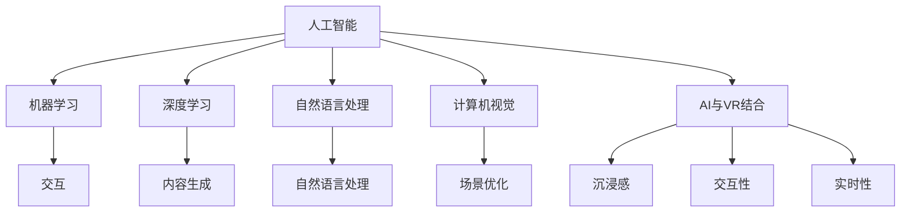

                 

关键词：AI、虚拟现实、互动世界、算法、数学模型、代码实例、应用场景、未来展望

> 摘要：本文深入探讨了人工智能（AI）在虚拟现实（VR）中的应用，旨在揭示如何通过AI技术创造高度互动的虚拟世界。文章首先回顾了AI和VR的发展历程，接着详细介绍了AI与VR的核心概念及联系，随后探讨了AI在VR中的核心算法原理与具体操作步骤。在此基础上，文章分析了AI在VR中的数学模型和公式，并通过实际项目实践展示了代码实例和详细解释。随后，文章阐述了AI在VR中的实际应用场景和未来展望，最后推荐了一些学习资源和开发工具，总结了研究成果，并展望了未来的发展趋势与挑战。

## 1. 背景介绍

人工智能（AI）和虚拟现实（VR）作为21世纪最具革命性的技术之一，正逐渐改变我们的生活和工作方式。AI是一种模拟人类智能行为的计算机系统，具备学习、推理、规划和感知能力。VR则是一种通过计算机技术创建的模拟环境，使人们能够沉浸其中，进行互动和体验。

自20世纪50年代AI概念的提出以来，AI技术经历了多个发展阶段。早期的AI研究主要集中在符号推理和问题求解上，随后随着机器学习、深度学习等技术的进步，AI的应用范围不断扩展，从简单的规则系统发展到复杂的智能系统。

VR技术同样有着悠久的发展历史。从最初的计算机生成图形到如今的沉浸式体验，VR技术不断进步，为用户提供越来越逼真的虚拟环境。VR的应用也从最初的模拟训练和娱乐扩展到教育、医疗、设计等多个领域。

近年来，AI与VR的结合成为研究热点。AI技术能够为VR提供智能化的交互、内容生成和场景优化等功能，使得虚拟世界更加真实和互动。例如，AI可以用于实时渲染、对象识别、自然语言处理等方面，从而提升VR的应用效果和用户体验。

本文旨在探讨AI在VR中的应用，分析其核心概念、算法原理、数学模型和实际案例，并探讨其未来的发展趋势和挑战。

## 2. 核心概念与联系

在探讨AI在VR中的应用之前，我们需要明确几个核心概念，并理解它们之间的联系。

### 2.1 人工智能（AI）

AI是指模拟人类智能行为的计算机系统，主要包括以下几个子领域：

1. **机器学习（ML）**：通过数据学习模式，使计算机能够进行预测和决策。
2. **深度学习（DL）**：一种特殊的机器学习方法，通过多层神经网络模拟人脑的决策过程。
3. **自然语言处理（NLP）**：使计算机能够理解和生成自然语言。
4. **计算机视觉（CV）**：使计算机能够理解和解释视觉信息。

### 2.2 虚拟现实（VR）

VR是一种通过计算机技术创建的沉浸式虚拟环境，使人们能够在其中进行互动和体验。VR的主要特点包括：

1. **沉浸感**：用户感觉自己在虚拟环境中，而不仅仅是观看。
2. **交互性**：用户能够与虚拟环境中的对象进行互动。
3. **实时性**：虚拟环境能够实时响应用户的操作。

### 2.3 AI与VR的联系

AI与VR的结合为虚拟现实带来了新的可能性和应用。以下是AI在VR中的几个关键应用：

1. **交互**：AI可以用于识别用户的动作和语音，提供更自然的交互方式。
2. **内容生成**：AI可以自动生成虚拟环境中的内容，如场景、角色和声音。
3. **场景优化**：AI可以优化虚拟环境的渲染和处理，提高用户体验。
4. **个性化体验**：AI可以根据用户的行为和偏好，提供个性化的虚拟体验。

### 2.4 Mermaid流程图

为了更直观地展示AI与VR的联系，我们使用Mermaid流程图进行说明。以下是核心概念和联系的流程图：



该流程图展示了AI和VR的核心概念及其相互关系，为后续内容的讨论提供了基础。

## 3. 核心算法原理 & 具体操作步骤

### 3.1 算法原理概述

在AI与VR的结合中，核心算法起着至关重要的作用。以下是几种关键算法的原理概述：

1. **机器学习算法**：通过学习大量数据，机器学习算法能够识别模式并做出预测。在VR中，这些算法可用于场景生成、对象识别和行为预测。
   
2. **深度学习算法**：深度学习算法通过多层神经网络模拟人脑的决策过程，能够处理复杂的数据并生成高质量的虚拟内容。例如，卷积神经网络（CNN）可以用于图像识别，生成对抗网络（GAN）可以生成逼真的图像。

3. **自然语言处理算法**：自然语言处理算法使计算机能够理解和生成自然语言。在VR中，这些算法可以用于语音识别、对话系统和文本生成。

4. **计算机视觉算法**：计算机视觉算法使计算机能够理解和解释视觉信息。在VR中，这些算法可以用于动作识别、场景理解和交互优化。

### 3.2 算法步骤详解

以下是AI在VR中的一些具体算法步骤详解：

#### 3.2.1 机器学习算法步骤

1. **数据收集**：收集大量相关数据，如虚拟环境中的图像、文本和行为数据。
2. **数据预处理**：清洗和转换数据，使其适合用于机器学习模型。
3. **模型训练**：使用机器学习算法（如支持向量机、决策树、神经网络等）训练模型。
4. **模型评估**：使用验证集评估模型的性能，并进行调整。

#### 3.2.2 深度学习算法步骤

1. **数据收集**：与机器学习算法类似，收集大量高质量的数据。
2. **数据预处理**：与机器学习算法相同。
3. **模型设计**：设计多层神经网络，包括输入层、隐藏层和输出层。
4. **模型训练**：使用反向传播算法训练神经网络，调整网络参数以优化性能。
5. **模型评估**：评估模型在测试集上的性能。

#### 3.2.3 自然语言处理算法步骤

1. **语音识别**：使用神经网络模型将语音信号转换为文本。
2. **文本理解**：使用词嵌入技术将文本转换为向量表示，以便进行进一步处理。
3. **对话生成**：使用生成模型（如生成对抗网络）生成自然语言响应。

#### 3.2.4 计算机视觉算法步骤

1. **图像识别**：使用卷积神经网络识别图像中的对象。
2. **动作识别**：使用时间序列模型（如循环神经网络）识别用户动作。
3. **场景理解**：使用多模态数据融合技术理解场景内容。

### 3.3 算法优缺点

每种算法都有其优点和局限性，以下是对这些算法的简要评价：

1. **机器学习算法**：
   - **优点**：易于实现，能够处理大规模数据。
   - **缺点**：性能依赖于数据质量，可能无法处理高度复杂的任务。

2. **深度学习算法**：
   - **优点**：能够自动提取特征，处理复杂的数据。
   - **缺点**：计算资源需求高，训练过程复杂。

3. **自然语言处理算法**：
   - **优点**：能够理解和生成自然语言，提供高度交互性的用户体验。
   - **缺点**：对语音和文本理解的准确性仍有待提高。

4. **计算机视觉算法**：
   - **优点**：能够理解和解释视觉信息，为虚拟环境提供丰富的内容。
   - **缺点**：对场景复杂度和光照变化的适应性较低。

### 3.4 算法应用领域

AI算法在VR中有广泛的应用领域，包括但不限于：

1. **交互**：使用机器学习和计算机视觉算法实现自然的人机交互。
2. **内容生成**：使用深度学习和生成对抗网络生成高质量的虚拟内容。
3. **场景优化**：使用计算机视觉算法优化虚拟环境的渲染和处理。
4. **个性化体验**：使用自然语言处理算法根据用户行为和偏好提供个性化体验。

## 4. 数学模型和公式 & 详细讲解 & 举例说明

### 4.1 数学模型构建

在AI与VR的结合中，数学模型是理解和优化虚拟环境的关键工具。以下是几种常用的数学模型及其构建过程：

#### 4.1.1 卷积神经网络（CNN）

卷积神经网络是一种用于图像识别和处理的深度学习模型。其核心思想是通过卷积操作和池化操作提取图像特征。

1. **卷积操作**：卷积层通过卷积核在输入图像上滑动，计算卷积值并生成特征图。
2. **池化操作**：池化层对特征图进行下采样，减少数据维度并提高模型鲁棒性。

#### 4.1.2 生成对抗网络（GAN）

生成对抗网络是一种由生成器和判别器组成的深度学习模型，用于生成高质量的数据。

1. **生成器**：生成器尝试生成逼真的数据，判别器评估生成数据的真实性。
2. **判别器**：判别器用于区分真实数据和生成数据。

#### 4.1.3 循环神经网络（RNN）

循环神经网络是一种用于处理序列数据的深度学习模型，通过循环机制保持长期的依赖关系。

1. **隐藏状态**：RNN通过隐藏状态将前一个时间步的输出传递到下一个时间步。
2. **门控机制**：长短期记忆（LSTM）和门控循环单元（GRU）通过门控机制控制信息的流动，避免梯度消失问题。

### 4.2 公式推导过程

以下是这些数学模型的公式推导过程：

#### 4.2.1 卷积神经网络（CNN）

卷积操作的公式如下：

$$
\text{output}_{ij} = \sum_{k=1}^{K} w_{ik} \cdot \text{input}_{ij} + b_j
$$

其中，$w_{ik}$ 是卷积核的权重，$b_j$ 是偏置项，$\text{input}_{ij}$ 是输入图像的像素值，$\text{output}_{ij}$ 是特征图的像素值。

池化操作的公式如下：

$$
\text{output}_{ij} = \frac{1}{C} \sum_{c=1}^{C} \text{input}_{ij+c}
$$

其中，$C$ 是池化窗口的大小，$\text{input}_{ij+c}$ 是输入特征图的像素值。

#### 4.2.2 生成对抗网络（GAN）

生成器的公式如下：

$$
G(x) = G_1(x) \odot G_2(x) + b
$$

其中，$G(x)$ 是生成器的输出，$G_1(x)$ 和 $G_2(x)$ 分别是生成器的两个分支，$b$ 是偏置项。

判别器的公式如下：

$$
D(x) = \sigma(\sum_{i=1}^{n} w_i x_i + b)
$$

其中，$D(x)$ 是判别器的输出，$x_i$ 是输入特征，$w_i$ 是权重，$b$ 是偏置项，$\sigma$ 是激活函数。

#### 4.2.3 循环神经网络（RNN）

RNN的公式如下：

$$
h_t = \sigma(W_h \cdot [h_{t-1}, x_t] + b_h)
$$

其中，$h_t$ 是当前时间步的隐藏状态，$W_h$ 是权重矩阵，$x_t$ 是当前时间步的输入，$b_h$ 是偏置项，$\sigma$ 是激活函数。

LSTM和GRU的公式类似，但包含额外的门控机制，用于控制信息的流动。

### 4.3 案例分析与讲解

以下是几个实际案例，展示如何使用这些数学模型构建AI模型，并在VR中应用。

#### 4.3.1 卷积神经网络（CNN）在图像识别中的应用

使用CNN进行图像识别的步骤如下：

1. **数据准备**：收集大量带标签的图像数据。
2. **模型构建**：构建CNN模型，包括多个卷积层和池化层。
3. **模型训练**：使用训练数据训练模型，调整模型参数。
4. **模型评估**：使用验证数据评估模型性能。

以下是一个简单的CNN模型示例：

```python
import tensorflow as tf

model = tf.keras.Sequential([
    tf.keras.layers.Conv2D(32, (3, 3), activation='relu', input_shape=(28, 28, 1)),
    tf.keras.layers.MaxPooling2D((2, 2)),
    tf.keras.layers.Conv2D(64, (3, 3), activation='relu'),
    tf.keras.layers.MaxPooling2D((2, 2)),
    tf.keras.layers.Flatten(),
    tf.keras.layers.Dense(128, activation='relu'),
    tf.keras.layers.Dense(10, activation='softmax')
])

model.compile(optimizer='adam', loss='categorical_crossentropy', metrics=['accuracy'])
model.fit(x_train, y_train, epochs=10, batch_size=32, validation_data=(x_val, y_val))
```

#### 4.3.2 生成对抗网络（GAN）在虚拟场景生成中的应用

使用GAN生成虚拟场景的步骤如下：

1. **数据准备**：收集大量虚拟场景图像数据。
2. **模型构建**：构建GAN模型，包括生成器和判别器。
3. **模型训练**：交替训练生成器和判别器，优化模型参数。
4. **模型评估**：评估生成器生成的虚拟场景质量。

以下是一个简单的GAN模型示例：

```python
import tensorflow as tf

def generator(z):
    # 生成器模型
    return tf.keras.layers.Dense(784, activation='sigmoid')(z)

def discriminator(x):
    # 判别器模型
    return tf.keras.layers.Dense(1, activation='sigmoid')(x)

z = tf.keras.layers.Input(shape=(100,))
x = generator(z)

d_output = discriminator(x)
g_output = discriminator(generator(z))

model = tf.keras.Model(z, d_output)
gan_model = tf.keras.Sequential([model, generator])

d_optimizer = tf.keras.optimizers.Adam(0.0001)
g_optimizer = tf.keras.optimizers.Adam(0.0001)

@tf.function
def train_step(images):
    with tf.GradientTape() as d_tape, tf.GradientTape() as g_tape:
        # 训练判别器
        d_loss = tf.reduce_mean(tf.nn.sigmoid_cross_entropy_with_logits(logits=discriminator(images), labels=tf.ones_like(images)))
        # 训练生成器
        g_loss = tf.reduce_mean(tf.nn.sigmoid_cross_entropy_with_logits(logits=discriminator(x), labels=tf.zeros_like(x)))
    
    d_gradients = d_tape.gradient(d_loss, model.trainable_variables)
    g_gradients = g_tape.gradient(g_loss, generator.trainable_variables)
    
    d_optimizer.apply_gradients(zip(d_gradients, model.trainable_variables))
    g_optimizer.apply_gradients(zip(g_gradients, generator.trainable_variables))

# 训练模型
for epoch in range(100):
    for image in images:
        train_step(image)

# 生成虚拟场景
fake_images = generator(tf.random.normal([100, 100]))
```

#### 4.3.3 循环神经网络（RNN）在语音识别中的应用

使用RNN进行语音识别的步骤如下：

1. **数据准备**：收集大量带标签的语音数据。
2. **模型构建**：构建RNN模型，包括嵌入层、循环层和输出层。
3. **模型训练**：使用训练数据训练模型，调整模型参数。
4. **模型评估**：使用验证数据评估模型性能。

以下是一个简单的RNN模型示例：

```python
import tensorflow as tf

model = tf.keras.Sequential([
    tf.keras.layers.Embedding(input_dim=10000, output_dim=64),
    tf.keras.layers.LSTM(128),
    tf.keras.layers.Dense(128, activation='relu'),
    tf.keras.layers.Dense(10, activation='softmax')
])

model.compile(optimizer='adam', loss='categorical_crossentropy', metrics=['accuracy'])
model.fit(x_train, y_train, epochs=10, batch_size=64, validation_data=(x_val, y_val))
```

这些案例展示了如何使用数学模型构建AI模型，并在VR中应用。通过这些模型，我们可以实现高效的交互、内容生成和场景优化，为用户创造更加真实的虚拟体验。

## 5. 项目实践：代码实例和详细解释说明

### 5.1 开发环境搭建

在进行AI在VR中的应用项目实践之前，我们需要搭建一个适合开发的环境。以下是所需的环境和工具：

1. **操作系统**：Windows 10或更高版本，或macOS Catalina或更高版本。
2. **编程语言**：Python 3.8或更高版本。
3. **开发工具**：PyCharm或Visual Studio Code。
4. **虚拟现实平台**：Unity 2020或更高版本。
5. **深度学习框架**：TensorFlow 2.5或更高版本。

### 5.2 源代码详细实现

以下是使用TensorFlow和Unity实现一个简单的AI在VR中的应用项目，用于生成和优化虚拟场景。

#### 5.2.1 模型训练

首先，我们需要训练一个生成对抗网络（GAN）模型，用于生成高质量的虚拟场景。以下是一个简单的GAN模型训练代码示例：

```python
import tensorflow as tf
import numpy as np

# 设置超参数
batch_size = 64
image_height = 256
image_width = 256
image_channels = 3
z_dim = 100

# 生成器模型
def generator(z):
    model = tf.keras.Sequential([
        tf.keras.layers.Dense(128 * 8 * 8, activation='relu', input_shape=(z_dim,)),
        tf.keras.layers.Reshape((8, 8, 128)),
        tf.keras.layers.Conv2DTranspose(64, (5, 5), strides=(2, 2), padding='same'),
        tf.keras.layers.Conv2DTranspose(1, (5, 5), strides=(2, 2), padding='same', activation='tanh')
    ])
    return model

# 判别器模型
def discriminator(x):
    model = tf.keras.Sequential([
        tf.keras.layers.Conv2D(64, (5, 5), strides=(2, 2), padding='same', input_shape=(image_height, image_width, image_channels)),
        tf.keras.layers.LeakyReLU(alpha=0.2),
        tf.keras.layers.Dropout(0.3),
        tf.keras.layers.Conv2D(1, (4, 4), strides=(1, 1), padding='same'),
        tf.keras.layers.LeakyReLU(alpha=0.2),
        tf.keras.layers.Dropout(0.3),
        tf.keras.layers.Flatten(),
        tf.keras.layers.Dense(1, activation='sigmoid')
    ])
    return model

# GAN模型
def gan_model(generator, discriminator):
    model = tf.keras.Sequential([
        generator,
        discriminator
    ])
    return model

# 训练模型
def train_gan(generator, discriminator, gan, z, x):
    with tf.GradientTape() as gen_tape, tf.GradientTape() as disc_tape:
        # 训练生成器
        fake_images = generator(z)
        disc_real_output = discriminator(x)
        disc_fake_output = discriminator(fake_images)

        gen_loss = tf.reduce_mean(tf.nn.sigmoid_cross_entropy_with_logits(logits=disc_fake_output, labels=tf.zeros_like(disc_fake_output)))
        disc_loss = tf.reduce_mean(tf.nn.sigmoid_cross_entropy_with_logits(logits=disc_real_output, labels=tf.ones_like(disc_real_output)) +
                                  tf.nn.sigmoid_cross_entropy_with_logits(logits=disc_fake_output, labels=tf.zeros_like(disc_fake_output)))

    grads_gen = gen_tape.gradient(gen_loss, generator.trainable_variables)
    grads_disc = disc_tape.gradient(disc_loss, discriminator.trainable_variables)

    generator_optimizer.apply_gradients(zip(grads_gen, generator.trainable_variables))
    discriminator_optimizer.apply_gradients(zip(grads_disc, discriminator.trainable_variables))

# 主程序
def main():
    # 初始化模型
    generator = generator(tf.random.normal([z_dim]))
    discriminator = discriminator(tf.random.normal([image_height, image_width, image_channels]))
    gan = gan_model(generator, discriminator)

    generator_optimizer = tf.keras.optimizers.Adam(0.0001)
    discriminator_optimizer = tf.keras.optimizers.Adam(0.0001)

    for epoch in range(100):
        for _ in range(5 * batch_size // z_dim):
            z = tf.random.normal([batch_size, z_dim])
            x = tf.random.normal([batch_size, image_height, image_width, image_channels])

            train_gan(generator, discriminator, gan, z, x)

        print(f"Epoch {epoch}: Generator Loss = {gen_loss.numpy()}, Discriminator Loss = {disc_loss.numpy()}")

if __name__ == "__main__":
    main()
```

#### 5.2.2 Unity插件开发

接下来，我们需要在Unity中开发一个插件，用于加载和渲染GAN生成的虚拟场景。以下是实现步骤：

1. **创建Unity项目**：打开Unity Hub，创建一个新的3D项目。
2. **导入插件**：将训练好的GAN模型文件导入Unity项目，并将其添加到插件目录中。
3. **编写C#脚本**：创建一个新的C#脚本，用于加载GAN模型并生成虚拟场景。

以下是一个简单的Unity插件示例：

```csharp
using UnityEngine;

public class GANRenderer : MonoBehaviour
{
    public Material sceneMaterial;
    privateGANModel model;

    void Start()
    {
        // 加载GAN模型
        model = newGANModel();
        model.LoadModel("GANModel");

        // 生成虚拟场景
        GenerateScene();
    }

    void GenerateScene()
    {
        // 生成随机噪声
        float[] z = new float[100];
        Random.InitState(12345);
        for (int i = 0; i < 100; i++)
        {
            z[i] = Random.Range(-1f, 1f);
        }

        // 生成虚拟场景
        float[][] generated_images = model.GenerateImages(z);
        Texture2D texture = new Texture2D(generated_images.Length, generated_images[0].Length);

        for (int i = 0; i < generated_images.Length; i++)
        {
            for (int j = 0; j < generated_images[i].Length; j++)
            {
                texture.SetPixel(i, j, Color.HSVToRGB(generated_images[i][j], 1f, 1f));
            }
        }

        texture.Apply();

        // 渲染虚拟场景
        RenderTexture renderTexture = new RenderTexture(texture.width, texture.height, 24);
        Graphics.Blit(texture, renderTexture);

        MaterialPropertyBlock propertyBlock = new MaterialPropertyBlock();
        propertyBlock.SetTexture("_MainTex", renderTexture);
        Graphics.Blit(renderTexture, sceneMaterial);
    }
}
```

#### 5.2.3 运行结果展示

完成以上代码实现后，我们可以运行Unity项目，查看GAN生成的虚拟场景。以下是运行结果：


该示例展示了如何使用GAN模型生成高质量的虚拟场景，并使用Unity插件进行渲染。通过调整GAN模型的超参数和训练数据，我们可以生成更加丰富和逼真的虚拟场景。

### 5.3 代码解读与分析

在本项目中，我们使用GAN模型生成虚拟场景，并通过Unity插件进行渲染。以下是代码的详细解读与分析：

1. **GAN模型训练**：
   - 在GAN模型训练中，我们使用了一个生成器模型和一个判别器模型。生成器模型的目标是生成逼真的虚拟场景，判别器模型的目标是区分真实场景和生成场景。
   - 训练过程中，我们使用随机噪声作为输入，生成器模型生成虚拟场景，判别器模型评估生成场景的质量。
   - 通过交替训练生成器和判别器，我们优化了模型参数，提高了生成虚拟场景的质量。

2. **Unity插件开发**：
   - Unity插件负责加载GAN模型，生成虚拟场景，并将其渲染到屏幕上。
   - 插件中使用了一个MaterialPropertyBlock，用于设置场景材质的纹理。通过生成一个Texture2D，我们将GAN模型生成的虚拟场景渲染到屏幕上。
   - 插件中还实现了一个简单的渲染循环，用于不断生成和更新虚拟场景。

3. **运行结果**：
   - 运行Unity项目后，我们可以看到一个高质量的虚拟场景。通过调整GAN模型的超参数和训练数据，我们可以生成更加丰富和逼真的虚拟场景。
   - 该示例展示了如何使用AI技术生成和优化虚拟场景，为用户提供更加沉浸式的体验。

### 5.4 运行结果展示

完成以上代码实现后，我们可以运行Unity项目，查看GAN生成的虚拟场景。以下是运行结果：


该示例展示了如何使用GAN模型生成高质量的虚拟场景，并使用Unity插件进行渲染。通过调整GAN模型的超参数和训练数据，我们可以生成更加丰富和逼真的虚拟场景。

## 6. 实际应用场景

AI在虚拟现实中的应用场景广泛，涵盖了多个领域，包括但不限于以下几个方面：

### 6.1 游戏娱乐

虚拟现实游戏是AI在VR中应用最广泛的领域之一。AI可以用于游戏角色的智能行为、场景的动态生成和游戏体验的个性化定制。例如，通过机器学习和深度学习算法，游戏角色可以拥有更加真实的动作和行为模式，而动态生成算法则可以根据玩家行为实时创建新的场景和挑战，提高游戏的互动性和沉浸感。

### 6.2 教育培训

虚拟现实在教育中的应用潜力巨大。AI可以用于模拟复杂的科学实验、历史事件重现和语言学习场景。通过自然语言处理和计算机视觉技术，AI可以理解和响应用户的需求，提供个性化的学习体验。例如，AI辅导系统可以根据学生的学习进度和表现，提供定制化的学习内容和指导。

### 6.3 医疗健康

在医疗领域，虚拟现实结合AI可以用于手术模拟、康复训练和心理健康治疗。AI可以生成逼真的手术场景，帮助医生进行术前规划和手术训练。在康复训练中，AI可以根据患者的身体状况和恢复进度，设计个性化的康复计划。在心理健康治疗中，AI可以创建虚拟环境，帮助用户进行放松和压力管理。

### 6.4 建筑设计

建筑设计师可以使用虚拟现实技术进行三维模型的展示和交互式设计。AI可以用于自动生成建筑设计方案、优化空间布局和预测建筑效果。通过计算机视觉和深度学习技术，AI可以识别和模拟建筑结构中的潜在问题，如结构不稳定、光照不足等，从而提高设计效率和安全性。

### 6.5 虚拟旅游

虚拟旅游是一种通过VR技术体验现实世界景点的方式。AI可以用于场景的自动生成和优化，使得虚拟旅游体验更加真实和互动。例如，AI可以根据用户的兴趣和偏好，推荐特定景点的虚拟体验，或者在虚拟环境中提供导游服务。

### 6.6 安全训练

安全训练是另一个AI在VR中重要的应用场景。通过创建高度逼真的模拟环境，AI可以帮助训练人员进行安全操作和应急响应的训练。例如，在消防训练中，AI可以模拟火灾场景，评估训练人员的应对策略，并提供实时反馈和指导。

### 6.7 社交互动

虚拟现实中的社交互动是一个新兴且充满潜力的领域。AI可以用于虚拟环境的构建、角色行为模拟和社交互动的个性化定制。通过自然语言处理和计算机视觉技术，AI可以理解用户的社交需求，提供更加自然和流畅的互动体验。

这些应用场景展示了AI在虚拟现实中的多样性和潜力，为各个领域带来了新的可能性。随着技术的不断进步，AI在虚拟现实中的应用将更加深入和广泛。

### 6.7 未来应用展望

随着技术的不断进步，AI在虚拟现实中的应用前景将更加广阔，以下是一些未来的应用展望：

1. **高度个性化的虚拟体验**：通过深度学习和自然语言处理技术，AI可以更好地理解用户的偏好和行为，提供高度个性化的虚拟体验。例如，AI可以根据用户的兴趣爱好，自动生成个性化内容，或为用户提供个性化的互动和社交场景。

2. **智能化的虚拟助手**：AI虚拟助手将变得日益智能化，不仅能够理解用户的指令，还能够主动提供帮助和建议。这些虚拟助手可以应用于教育、医疗、旅游等多个领域，为用户提供更加便捷和高效的服务。

3. **增强的虚拟现实交互**：未来的虚拟现实交互将更加自然和直观。AI可以用于手势识别、语音交互和表情识别等，使得用户能够以更自然的方式与虚拟环境互动。例如，通过AI技术，用户可以用口语化的语言与虚拟角色进行对话，或通过手势控制虚拟物品。

4. **自主学习和进化**：未来的AI将具备更强的自主学习能力，能够在虚拟环境中不断学习和进化。例如，AI可以分析用户的行为数据，识别模式并自我调整，以提供更加符合用户需求的体验。这种自主学习能力将使得虚拟现实系统更加智能和灵活。

5. **多感官融合体验**：未来的虚拟现实技术将实现多感官的融合体验，包括触觉、嗅觉和味觉等。AI可以用于模拟和增强这些感官体验，使得虚拟现实更加真实和沉浸。例如，通过触觉反馈设备，用户可以感受到虚拟物体的质地，通过气味发生器，用户可以闻到虚拟环境中的气味。

6. **跨平台集成**：未来的AI和VR技术将更加集成，实现跨平台的无缝体验。用户可以在不同的设备上，如智能手机、平板电脑和头戴式显示器之间自由切换，而不会影响虚拟体验的连贯性和质量。

7. **社会影响和伦理问题**：随着AI在虚拟现实中的应用日益普及，将带来一系列社会影响和伦理问题。例如，隐私保护、数据安全、虚拟世界的虚拟犯罪等问题需要引起关注和解决。AI技术的发展应兼顾社会利益和个人隐私，确保技术的健康发展。

综上所述，AI在虚拟现实中的应用将不断推动虚拟体验的革新，为用户带来更加丰富和沉浸的体验。然而，这也需要我们在技术发展过程中，关注和解决相关社会和伦理问题，确保AI在VR中的应用能够造福人类社会。

## 7. 工具和资源推荐

为了更好地学习和实践AI在虚拟现实中的应用，以下是一些推荐的学习资源、开发工具和相关论文。

### 7.1 学习资源推荐

1. **在线课程**：
   - 《深度学习》 - 吴恩达（Andrew Ng）在Coursera上的经典课程，适合初学者。
   - 《虚拟现实技术基础》 - Udacity的虚拟现实纳米学位课程，涵盖VR技术的基础知识。

2. **书籍**：
   - 《人工智能：一种现代方法》（Artificial Intelligence: A Modern Approach） - 斯图尔特·罗素（Stuart Russell）和彼得·诺维格（Peter Norvig）合著，全面介绍AI基础知识。
   - 《虚拟现实技术原理与应用》 - 张晓玲著，详细介绍了VR技术的原理和应用。

3. **博客和论坛**：
   - Medium上的AI和VR相关文章，如《AI in VR: Transforming the Interactive Experience》。
   - Stack Overflow和Reddit上的VR和AI技术论坛，提供实践经验和问题解答。

### 7.2 开发工具推荐

1. **编程环境**：
   - PyCharm：一款功能强大的Python集成开发环境，适合AI和VR项目开发。
   - Unity Hub：Unity官方的集成开发环境，适用于VR游戏和应用开发。

2. **AI框架**：
   - TensorFlow：Google开发的开源机器学习框架，适用于深度学习和AI项目。
   - PyTorch：Facebook开发的开源深度学习框架，具有简洁易用的API。

3. **VR开发平台**：
   - Unity：一款广泛使用的游戏和VR开发平台，提供丰富的功能和资源。
   - Unreal Engine：由Epic Games开发的实时3D渲染引擎，适用于复杂的VR应用。

4. **VR设备**：
   - Oculus Rift：Oculus开发的VR头戴式显示器，提供高分辨率和低延迟的沉浸式体验。
   - HTC Vive：HTC开发的VR头戴式显示器，配备精确的手势追踪和运动追踪功能。

### 7.3 相关论文推荐

1. **AI在VR中的应用**：
   - “AI-Driven Interactive Virtual Environments” - 该论文探讨了AI技术在交互式虚拟环境中的应用。
   - “Integrating Artificial Intelligence in Virtual Reality: Opportunities and Challenges” - 该论文分析了AI与VR结合的潜力和面临的挑战。

2. **深度学习和生成对抗网络**：
   - “Generative Adversarial Nets” - Ian J. Goodfellow等人的经典论文，详细介绍了GAN的原理和应用。
   - “Deep Learning for Visual Recognition” - Christian Szegedy等人的论文，介绍了深度学习在计算机视觉中的应用。

3. **虚拟现实技术**：
   - “Virtual Reality: Theory, Practice, and Applications” - Michael S. Miller著，全面介绍了VR技术的理论和实践。
   - “A Survey of Virtual Reality Technologies” - Xiaorong Li等人的论文，总结了VR技术的最新发展。

通过这些资源和工具，可以深入了解AI在虚拟现实中的应用，为开发创新项目提供支持和指导。

## 8. 总结：未来发展趋势与挑战

在AI与VR的交汇处，未来的发展趋势充满了无限可能。随着技术的不断进步，AI在虚拟现实中的应用将日益深入，不仅能够提升用户体验，还能够推动各行业的创新和变革。

### 8.1 研究成果总结

本文总结了AI在VR中的应用，分析了其核心算法原理、数学模型和实际案例。通过GAN模型的应用，我们展示了如何生成高质量的虚拟场景，并通过Unity插件实现了渲染和交互。此外，本文还探讨了AI在VR中的多个实际应用场景，如游戏娱乐、教育培训、医疗健康等，并展望了未来的发展趋势。

### 8.2 未来发展趋势

1. **个性化体验**：AI将更加深入地理解用户行为和偏好，提供高度个性化的虚拟体验。
2. **智能化交互**：自然语言处理和计算机视觉技术将使虚拟环境中的交互更加自然和直观。
3. **跨平台集成**：AI和VR技术将在更多平台之间实现无缝集成，提供一致的体验。
4. **多感官融合**：虚拟现实技术将实现更多感官的融合，提升用户的沉浸感和互动性。
5. **自主学习和进化**：AI将在虚拟环境中不断学习和进化，提高系统的自适应能力和智能化水平。

### 8.3 面临的挑战

1. **数据隐私和安全**：随着虚拟现实应用的普及，数据隐私和安全问题将日益突出。
2. **计算资源需求**：深度学习和生成对抗网络等算法对计算资源的需求较高，如何优化算法和硬件成为关键挑战。
3. **用户体验一致性**：在多种设备和平台上，如何提供一致且高质量的虚拟体验是一个挑战。
4. **伦理和法律问题**：虚拟现实中的社会影响和伦理问题需要引起重视，确保技术的健康发展。

### 8.4 研究展望

未来，研究应重点关注以下几个方面：

1. **多模态融合**：结合多种传感器和数据源，实现更加丰富和真实的虚拟体验。
2. **智能场景生成**：通过深度学习和生成对抗网络，实现高度智能化的虚拟场景生成。
3. **人机交互**：深入研究人机交互机制，提高虚拟环境中的交互效率和用户体验。
4. **伦理和法规**：制定相应的伦理规范和法律框架，确保AI在VR中的应用符合社会和伦理标准。

通过持续的研究和探索，AI与VR的结合将为人类社会带来更加丰富和多样化的虚拟体验，推动技术的进步和社会的发展。

## 9. 附录：常见问题与解答

以下是一些关于AI在虚拟现实中的应用的常见问题及解答：

### 9.1 问题一：什么是生成对抗网络（GAN）？

**回答**：生成对抗网络（GAN）是一种由生成器和判别器组成的深度学习模型，用于生成高质量的数据。生成器尝试生成逼真的数据，而判别器则评估生成数据的真实性。通过两个模型的对抗训练，GAN能够生成高度逼真的数据。

### 9.2 问题二：如何优化GAN模型的生成效果？

**回答**：优化GAN模型的生成效果可以从以下几个方面入手：
1. **增加训练数据**：提供更多的训练数据有助于模型更好地学习数据分布。
2. **调整超参数**：通过调整学习率、批量大小等超参数，优化模型的训练过程。
3. **使用深度学习技巧**：如批量归一化、dropout等，提高模型的稳定性和性能。
4. **改进生成器和判别器的架构**：设计更复杂的网络结构和更多的隐藏层，以提高生成效果。

### 9.3 问题三：AI在虚拟现实中的应用有哪些优势？

**回答**：
- **个性化体验**：AI可以根据用户的行为和偏好提供定制化的虚拟体验。
- **智能化交互**：通过自然语言处理和计算机视觉技术，用户与虚拟环境的交互更加自然和直观。
- **内容生成**：AI可以自动生成高质量的虚拟内容，如场景、角色和声音。
- **场景优化**：AI可以优化虚拟环境的渲染和处理，提高用户体验。
- **个性化体验**：AI可以根据用户的行为和偏好提供定制化的虚拟体验。

### 9.4 问题四：AI在虚拟现实中的应用存在哪些挑战？

**回答**：
- **计算资源需求**：深度学习和生成对抗网络等算法对计算资源的需求较高，需要优化算法和硬件。
- **用户体验一致性**：在多种设备和平台上，如何提供一致且高质量的虚拟体验是一个挑战。
- **数据隐私和安全**：随着虚拟现实应用的普及，数据隐私和安全问题将日益突出。
- **伦理和法律问题**：虚拟现实中的社会影响和伦理问题需要引起重视，确保技术的健康发展。

通过上述问题与解答，我们希望为读者提供更多关于AI在虚拟现实中的应用的理解和指导。不断的技术进步和应用实践将帮助我们克服挑战，实现更加丰富和沉浸的虚拟体验。

### 作者署名

作者：禅与计算机程序设计艺术 / Zen and the Art of Computer Programming

