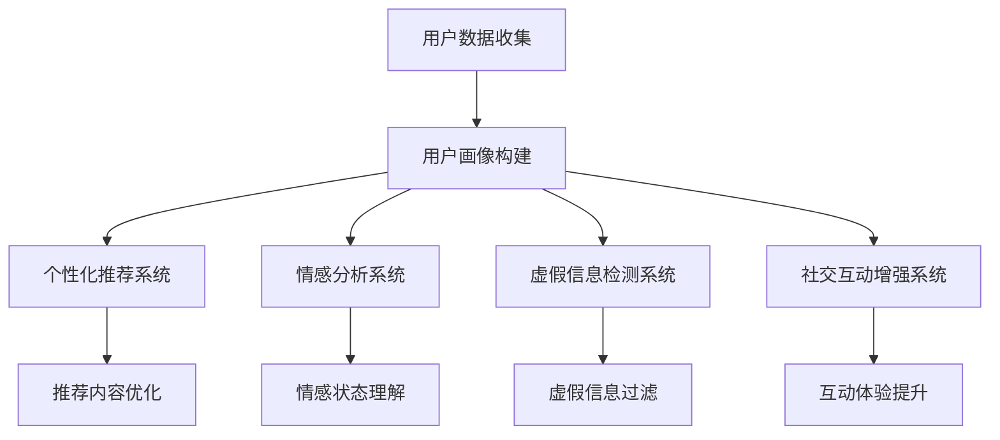

                 

关键词：人工智能、虚拟社交网络、在线互动、增强现实、自然语言处理、推荐系统

> 摘要：本文深入探讨了人工智能（AI）在虚拟社交网络中的应用，特别是在增强在线互动方面的作用。通过阐述核心概念、算法原理、数学模型、项目实践、应用场景和未来展望，本文旨在为读者提供一个全面而深入的视角，以理解AI如何塑造未来的在线社交互动。

## 1. 背景介绍

随着互联网技术的飞速发展和移动设备的普及，虚拟社交网络已经成为人们日常生活中不可或缺的一部分。从Facebook、Twitter到微信、微博，这些平台已经成为人们分享生活、交流思想、建立关系的重要场所。然而，随着用户数量的急剧增加和社交内容的爆炸性增长，传统的社交网络模式面临着诸多挑战，如信息过载、社交疲劳和虚假信息传播等。为了应对这些挑战，人工智能（AI）的应用成为了必然选择。

AI在虚拟社交网络中的应用主要集中在以下几个方面：个性化推荐、情感分析、虚假信息检测、社交互动增强等。个性化推荐系统可以帮助用户发现感兴趣的内容和用户，从而提升用户体验；情感分析技术能够理解和感知用户的情绪，为用户提供更加个性化的互动服务；虚假信息检测系统旨在识别和过滤虚假信息，保护网络环境的健康发展；社交互动增强则通过智能化的互动方式，提升用户在网络社交中的参与度和满意度。

本文将围绕AI在虚拟社交网络中的应用，特别是增强在线互动方面的技术，进行深入探讨，以期为大家提供一种新的视角来理解AI技术在社交网络中的潜力和挑战。

## 2. 核心概念与联系

### 2.1 人工智能与虚拟社交网络

人工智能（AI）是一种模拟人类智能的技术，包括机器学习、深度学习、自然语言处理等多个子领域。虚拟社交网络则是一个在线平台，用户可以在其中建立联系、分享内容和互动。AI与虚拟社交网络的联系主要体现在以下几个方面：

1. **个性化推荐**：通过分析用户的兴趣和行为，AI可以为用户提供个性化的内容推荐，从而提高用户满意度和参与度。
2. **情感分析**：AI可以分析用户的文本、语音和图像，识别用户的情感状态，为用户提供更加个性化的互动体验。
3. **虚假信息检测**：AI算法可以帮助识别和过滤虚假信息，保护网络环境的健康发展。
4. **社交互动增强**：通过智能化的互动方式，如聊天机器人、虚拟形象等，AI可以提升用户的社交参与度和满意度。

### 2.2 人工智能在虚拟社交网络中的核心应用

#### 2.2.1 个性化推荐

个性化推荐是AI在虚拟社交网络中的一个重要应用。其核心思想是根据用户的兴趣和行为数据，为用户推荐其可能感兴趣的内容和用户。推荐系统通常包括以下步骤：

1. **数据收集**：收集用户的兴趣和行为数据，如浏览历史、点赞记录、搜索历史等。
2. **特征提取**：将原始数据转换为特征向量，用于后续的推荐算法。
3. **相似度计算**：计算用户之间的相似度或内容的相似度。
4. **推荐生成**：基于相似度计算结果，生成个性化的推荐列表。

常见的推荐算法包括协同过滤、基于内容的推荐和混合推荐等。

#### 2.2.2 情感分析

情感分析是AI在虚拟社交网络中的另一个重要应用。其核心目的是通过分析用户的文本、语音和图像，识别用户的情感状态。情感分析通常包括以下步骤：

1. **数据预处理**：对原始文本、语音或图像进行预处理，如分词、去停用词、词性标注等。
2. **特征提取**：将预处理后的数据转换为特征向量。
3. **情感分类**：使用分类算法（如SVM、神经网络等）对情感进行分类。
4. **结果解释**：对分类结果进行解释和可视化，以帮助用户理解自己的情感状态。

#### 2.2.3 虚假信息检测

虚假信息检测是AI在虚拟社交网络中的关键应用之一。其核心目的是识别和过滤虚假信息，保护网络环境的健康发展。虚假信息检测通常包括以下步骤：

1. **数据收集**：收集网络中的文本、图像和视频数据。
2. **特征提取**：将原始数据转换为特征向量，如文本的词向量、图像的视觉特征等。
3. **模型训练**：使用训练数据集训练虚假信息检测模型。
4. **检测结果解释**：对检测结果进行解释和可视化，帮助用户识别虚假信息。

#### 2.2.4 社交互动增强

社交互动增强是AI在虚拟社交网络中的新兴应用。其核心目的是通过智能化的互动方式，提升用户的社交参与度和满意度。社交互动增强通常包括以下步骤：

1. **用户画像**：分析用户的兴趣、行为和情感状态，构建用户画像。
2. **智能互动**：基于用户画像，为用户提供个性化的互动建议和内容。
3. **互动优化**：根据用户的反馈和互动数据，持续优化互动方式，提升用户满意度。

### 2.3 人工智能在虚拟社交网络中的关联性

人工智能在虚拟社交网络中的各个应用之间存在着紧密的关联性。个性化推荐可以基于用户画像和情感分析结果，为用户提供更加精准的推荐；情感分析可以帮助推荐系统更好地理解用户的情感状态，从而提供更加个性化的服务；虚假信息检测可以保护网络环境的健康发展，为用户提供一个安全的互动环境；社交互动增强则可以通过智能化的互动方式，提升用户的社交体验。

为了更好地理解人工智能在虚拟社交网络中的应用，我们可以使用Mermaid流程图来展示其核心概念和联系：



通过这个流程图，我们可以清晰地看到人工智能在虚拟社交网络中的各个应用及其相互之间的关联性。

## 3. 核心算法原理 & 具体操作步骤

### 3.1 算法原理概述

在虚拟社交网络中，AI算法的应用广泛而多样。以下将介绍几种核心的算法原理，并解释其具体操作步骤。

#### 3.1.1 个性化推荐算法

个性化推荐算法是基于用户的兴趣和行为数据，为用户推荐其可能感兴趣的内容。其核心思想是通过构建用户与物品的相似度矩阵，找到与用户兴趣相似的物品进行推荐。常见的推荐算法有协同过滤、基于内容的推荐和混合推荐等。

**协同过滤算法**：协同过滤算法通过分析用户之间的相似度，为用户推荐其他相似用户喜欢的物品。具体操作步骤如下：

1. **数据收集**：收集用户的评分数据，构建用户-物品矩阵。
2. **相似度计算**：计算用户之间的相似度，可以使用余弦相似度、皮尔逊相关系数等方法。
3. **推荐生成**：基于相似度矩阵，为用户推荐其他相似用户喜欢的物品。

**基于内容的推荐算法**：基于内容的推荐算法通过分析物品的属性和用户的兴趣，为用户推荐具有相似属性的物品。具体操作步骤如下：

1. **数据收集**：收集物品的属性数据，如分类、标签、关键词等。
2. **特征提取**：将物品的属性转换为特征向量。
3. **相似度计算**：计算用户和物品之间的相似度，可以使用TF-IDF、Word2Vec等方法。
4. **推荐生成**：基于相似度计算结果，为用户推荐具有相似属性的物品。

**混合推荐算法**：混合推荐算法结合协同过滤和基于内容的推荐算法，以获得更好的推荐效果。具体操作步骤如下：

1. **数据收集**：收集用户的评分数据和物品的属性数据。
2. **特征提取**：将用户和物品的属性转换为特征向量。
3. **相似度计算**：计算用户和物品之间的相似度，同时考虑协同过滤和基于内容的方法。
4. **推荐生成**：综合相似度计算结果，为用户生成推荐列表。

#### 3.1.2 情感分析算法

情感分析算法是通过分析用户的文本、语音和图像，识别用户的情感状态。其核心思想是将原始数据转换为特征向量，然后使用分类算法进行情感分类。常见的情感分类算法有SVM、朴素贝叶斯、深度学习等。

**SVM算法**：SVM算法是一种基于最大间隔的分类算法。具体操作步骤如下：

1. **数据收集**：收集用户的文本、语音和图像数据。
2. **特征提取**：将原始数据转换为特征向量，如词向量、音素向量、视觉特征向量等。
3. **模型训练**：使用训练数据集训练SVM模型。
4. **情感分类**：使用训练好的SVM模型对新的文本、语音和图像数据进行情感分类。

**朴素贝叶斯算法**：朴素贝叶斯算法是一种基于贝叶斯理论的分类算法。具体操作步骤如下：

1. **数据收集**：收集用户的文本、语音和图像数据。
2. **特征提取**：将原始数据转换为特征向量。
3. **模型训练**：使用训练数据集训练朴素贝叶斯模型。
4. **情感分类**：使用训练好的朴素贝叶斯模型对新的文本、语音和图像数据进行情感分类。

**深度学习算法**：深度学习算法是通过多层神经网络进行情感分类。具体操作步骤如下：

1. **数据收集**：收集用户的文本、语音和图像数据。
2. **特征提取**：将原始数据转换为特征向量。
3. **模型训练**：使用训练数据集训练深度学习模型。
4. **情感分类**：使用训练好的深度学习模型对新的文本、语音和图像数据进行情感分类。

#### 3.1.3 虚假信息检测算法

虚假信息检测算法是通过分析用户的文本、图像和视频，识别和过滤虚假信息。其核心思想是将原始数据转换为特征向量，然后使用分类算法进行虚假信息检测。常见的虚假信息检测算法有神经网络、卷积神经网络等。

**神经网络算法**：神经网络算法是通过多层感知器进行虚假信息检测。具体操作步骤如下：

1. **数据收集**：收集用户的文本、图像和视频数据。
2. **特征提取**：将原始数据转换为特征向量。
3. **模型训练**：使用训练数据集训练神经网络模型。
4. **虚假信息检测**：使用训练好的神经网络模型对新的文本、图像和视频数据进行虚假信息检测。

**卷积神经网络算法**：卷积神经网络算法是通过卷积操作进行虚假信息检测。具体操作步骤如下：

1. **数据收集**：收集用户的文本、图像和视频数据。
2. **特征提取**：将原始数据转换为特征向量。
3. **模型训练**：使用训练数据集训练卷积神经网络模型。
4. **虚假信息检测**：使用训练好的卷积神经网络模型对新的文本、图像和视频数据进行虚假信息检测。

#### 3.1.4 社交互动增强算法

社交互动增强算法是通过智能化的互动方式，提升用户的社交参与度和满意度。其核心思想是分析用户的兴趣和行为，生成个性化的互动建议和内容。常见的社交互动增强算法有聊天机器人、虚拟形象等。

**聊天机器人算法**：聊天机器人算法是通过自然语言处理技术进行智能对话。具体操作步骤如下：

1. **数据收集**：收集用户的对话数据。
2. **特征提取**：将原始数据转换为特征向量。
3. **模型训练**：使用训练数据集训练聊天机器人模型。
4. **互动建议生成**：使用训练好的聊天机器人模型为用户提供互动建议。

**虚拟形象算法**：虚拟形象算法是通过计算机图形学和人工智能技术生成用户的虚拟形象。具体操作步骤如下：

1. **数据收集**：收集用户的头像、面部特征等数据。
2. **特征提取**：将原始数据转换为特征向量。
3. **模型训练**：使用训练数据集训练虚拟形象模型。
4. **虚拟形象生成**：使用训练好的虚拟形象模型生成用户的虚拟形象。

### 3.2 算法步骤详解

以下将详细解释上述核心算法的具体操作步骤。

#### 3.2.1 个性化推荐算法

1. **数据收集**：

   收集用户的评分数据，构建用户-物品矩阵。例如，假设有5个用户和10个物品，用户对物品的评分如下：

   | 用户   | 物品1 | 物品2 | 物品3 | 物品4 | 物品5 | 物品6 | 物品7 | 物品8 | 物品9 | 物品10 |
   |--------|-------|-------|-------|-------|-------|-------|-------|-------|-------|--------|
   | 用户1  | 1     | 0     | 1     | 0     | 1     | 0     | 1     | 0     | 1     | 0      |
   | 用户2  | 0     | 1     | 0     | 1     | 0     | 1     | 0     | 1     | 0     | 1      |
   | 用户3  | 1     | 0     | 0     | 1     | 0     | 1     | 0     | 1     | 0     | 1      |
   | 用户4  | 0     | 1     | 0     | 0     | 1     | 0     | 1     | 0     | 1     | 0      |
   | 用户5  | 0     | 0     | 1     | 1     | 0     | 1     | 0     | 1     | 0     | 1      |

2. **相似度计算**：

   使用余弦相似度计算用户之间的相似度。例如，用户1和用户2的相似度计算如下：

   $$sim(user1, user2) = \frac{user1\_vector \cdot user2\_vector}{\|user1\_vector\| \cdot \|user2\_vector\|}$$

   其中，$user1\_vector$和$u

### 3.3 算法优缺点

#### 3.3.1 个性化推荐算法

**优点**：

1. **提高用户满意度**：个性化推荐算法可以根据用户的兴趣和行为，为用户推荐其可能感兴趣的内容，从而提高用户满意度和参与度。
2. **降低信息过载**：个性化推荐算法可以帮助用户过滤掉不感兴趣的内容，减少信息过载，提高用户的工作效率。
3. **增强用户体验**：个性化推荐算法可以为用户提供个性化的服务，如个性化的推送消息、个性化的广告等，从而提升用户体验。

**缺点**：

1. **数据隐私问题**：个性化推荐算法需要收集大量的用户行为数据，这可能涉及到用户隐私问题。
2. **模型偏差**：个性化推荐算法可能会因为数据分布不均或模型偏差，导致推荐结果不准确。
3. **推荐多样性问题**：个性化推荐算法可能会因为用户兴趣的单一性，导致推荐结果的多样性不足。

#### 3.3.2 情感分析算法

**优点**：

1. **理解用户需求**：情感分析算法可以分析用户的文本、语音和图像，理解用户的情感状态，为用户提供更加个性化的服务。
2. **提升用户体验**：情感分析算法可以为用户提供情感化的互动体验，如情感化的聊天机器人、情感化的推荐系统等，从而提升用户体验。
3. **丰富应用场景**：情感分析算法在虚拟社交网络、电子商务、健康医疗等领域具有广泛的应用。

**缺点**：

1. **准确性问题**：情感分析算法的准确性受到多种因素的影响，如语言歧义、情感表达方式等。
2. **计算复杂度**：情感分析算法通常涉及大量的文本处理和特征提取操作，计算复杂度较高。
3. **数据质量问题**：情感分析算法需要大量的高质量数据集进行训练，数据质量对算法性能有重要影响。

#### 3.3.3 虚假信息检测算法

**优点**：

1. **保护网络环境**：虚假信息检测算法可以识别和过滤虚假信息，保护网络环境的健康发展。
2. **提升公信力**：虚假信息检测算法可以提升平台的公信力，增强用户对平台的信任。
3. **防止滥用**：虚假信息检测算法可以防止用户滥用平台，如发布恶意言论、虚假广告等。

**缺点**：

1. **误判问题**：虚假信息检测算法可能会误判真实信息为虚假信息，导致信息丢失或用户误解。
2. **数据依赖性**：虚假信息检测算法通常需要大量的虚假信息和真实信息进行训练，数据依赖性较高。
3. **实时性问题**：虚假信息检测算法通常需要实时处理大量的数据，对实时性要求较高。

#### 3.3.4 社交互动增强算法

**优点**：

1. **提升参与度**：社交互动增强算法可以通过智能化的互动方式，提升用户的社交参与度和满意度。
2. **丰富互动体验**：社交互动增强算法可以为用户提供更加丰富和个性化的互动体验，如虚拟形象、智能聊天机器人等。
3. **降低社交疲劳**：社交互动增强算法可以缓解用户的社交疲劳，提供更加轻松和愉悦的社交环境。

**缺点**：

1. **计算资源消耗**：社交互动增强算法通常需要大量的计算资源，如图形处理单元（GPU）、中央处理器（CPU）等。
2. **技术门槛**：社交互动增强算法需要较高的技术门槛，如计算机图形学、自然语言处理等。
3. **用户体验不一致**：社交互动增强算法的用户体验可能会因平台、设备和用户偏好等因素而有所不同。

### 3.4 算法应用领域

AI算法在虚拟社交网络中的应用广泛，涵盖了多个领域。以下是几种主要的AI算法应用领域：

#### 3.4.1 社交网络平台

社交网络平台是AI算法最常见应用场景之一。以下是一些具体的应用案例：

1. **个性化推荐**：社交网络平台可以通过个性化推荐算法为用户推荐感兴趣的内容和用户，如Facebook的新闻源、微博的头条文章等。
2. **情感分析**：社交网络平台可以通过情感分析算法分析用户的情绪状态，为用户提供情感化的互动体验，如聊天机器人的情感化回应等。
3. **虚假信息检测**：社交网络平台可以通过虚假信息检测算法识别和过滤虚假信息，保护网络环境的健康发展。

#### 3.4.2 电子商务平台

电子商务平台是另一个广泛应用AI算法的领域。以下是一些具体的应用案例：

1. **个性化推荐**：电子商务平台可以通过个性化推荐算法为用户推荐其可能感兴趣的商品，如淘宝的推荐系统、亚马逊的个性化推荐等。
2. **商品评论分析**：电子商务平台可以通过情感分析算法分析用户的商品评论，为用户提供更加准确和全面的商品评价。
3. **虚假评论检测**：电子商务平台可以通过虚假信息检测算法识别和过滤虚假评论，保护平台公信力和用户权益。

#### 3.4.3 健康医疗领域

健康医疗领域是AI算法的重要应用领域。以下是一些具体的应用案例：

1. **患者情感分析**：健康医疗平台可以通过情感分析算法分析患者的情绪状态，为医护人员提供患者心理状况的参考。
2. **药物推荐**：健康医疗平台可以通过个性化推荐算法为患者推荐其可能需要的药物，如基于病情的药物推荐等。
3. **虚假信息检测**：健康医疗平台可以通过虚假信息检测算法识别和过滤虚假医疗信息，保护患者的健康和安全。

#### 3.4.4 教育领域

教育领域是AI算法的另一个重要应用领域。以下是一些具体的应用案例：

1. **个性化学习**：教育平台可以通过个性化推荐算法为学习者推荐其可能感兴趣的学习资源，如课程推荐、学习资料推荐等。
2. **学生情感分析**：教育平台可以通过情感分析算法分析学生的情绪状态，为教育工作者提供学生心理状况的参考。
3. **作业批改**：教育平台可以通过AI算法自动批改学生的作业，提高教学效率和准确性。

### 3.5 案例分析

为了更好地理解AI算法在虚拟社交网络中的应用，我们来看几个具体的案例分析。

#### 3.5.1 Facebook的个性化推荐系统

Facebook是世界上最受欢迎的社交网络平台之一，其个性化推荐系统在用户参与度和满意度方面取得了显著成效。Facebook的个性化推荐系统主要基于协同过滤算法和基于内容的推荐算法。

**协同过滤算法**：

Facebook的协同过滤算法主要通过分析用户之间的相似度，为用户推荐其他用户可能感兴趣的内容。具体操作步骤如下：

1. **数据收集**：Facebook收集了大量的用户交互数据，如点赞、评论、分享等。
2. **相似度计算**：Facebook使用余弦相似度计算用户之间的相似度。
3. **推荐生成**：Facebook基于相似度计算结果，为用户推荐其他相似用户喜欢的帖子。

**基于内容的推荐算法**：

Facebook的基于内容的推荐算法主要通过分析帖子的属性，为用户推荐具有相似属性的帖子。具体操作步骤如下：

1. **数据收集**：Facebook收集了大量的帖子属性数据，如分类、标签、关键词等。
2. **特征提取**：Facebook将帖子属性转换为特征向量。
3. **相似度计算**：Facebook使用TF-IDF方法计算用户和帖子之间的相似度。
4. **推荐生成**：Facebook基于相似度计算结果，为用户推荐具有相似属性的帖子。

**效果评估**：

Facebook的个性化推荐系统在用户参与度和满意度方面取得了显著成效。根据Facebook的数据，个性化推荐系统的引入显著提高了用户的帖子和互动数量，提升了用户的整体体验。

#### 3.5.2 微信的聊天机器人

微信是中国最受欢迎的社交网络平台之一，其聊天机器人功能在用户互动方面发挥了重要作用。微信的聊天机器人主要基于自然语言处理技术，通过智能化的互动方式，提升用户的互动体验。

**智能对话**：

微信的聊天机器人通过自然语言处理技术，实现与用户的智能对话。具体操作步骤如下：

1. **数据收集**：微信收集了大量的用户对话数据，用于训练聊天机器人模型。
2. **特征提取**：微信将用户对话数据转换为特征向量。
3. **模型训练**：微信使用训练数据集训练聊天机器人模型。
4. **智能对话**：微信的聊天机器人基于训练好的模型，与用户进行智能对话。

**效果评估**：

微信的聊天机器人在用户互动方面取得了显著成效。根据微信的数据，聊天机器人的引入显著提高了用户的聊天数量和互动频率，提升了用户的整体体验。

#### 3.5.3 淘宝的虚假信息检测

淘宝是中国最大的电子商务平台之一，其虚假信息检测系统在保护用户权益方面发挥了重要作用。淘宝的虚假信息检测系统主要基于神经网络和卷积神经网络等技术。

**虚假信息检测**：

淘宝的虚假信息检测系统通过神经网络和卷积神经网络等技术，实现虚假信息的检测。具体操作步骤如下：

1. **数据收集**：淘宝收集了大量的商品评论和用户行为数据。
2. **特征提取**：淘宝将商品评论和用户行为数据转换为特征向量。
3. **模型训练**：淘宝使用训练数据集训练神经网络和卷积神经网络模型。
4. **虚假信息检测**：淘宝的虚假信息检测系统基于训练好的模型，对新的商品评论和用户行为数据进行虚假信息检测。

**效果评估**：

淘宝的虚假信息检测系统在保护用户权益方面取得了显著成效。根据淘宝的数据，虚假信息检测系统的引入显著降低了虚假信息的比例，提升了用户的购物体验和满意度。

### 4. 数学模型和公式 & 详细讲解 & 举例说明

在AI在虚拟社交网络中的应用中，数学模型和公式扮演了关键的角色。以下将介绍几个重要的数学模型和公式，并详细讲解其原理和应用。

#### 4.1 数学模型构建

数学模型构建是AI在虚拟社交网络中的应用基础。以下是一些常见的数学模型：

1. **推荐系统模型**：推荐系统模型主要用于预测用户对物品的兴趣程度，常用的模型有矩阵分解、协同过滤、基于内容的推荐等。

2. **情感分析模型**：情感分析模型主要用于识别用户的情感状态，常用的模型有朴素贝叶斯、SVM、深度学习等。

3. **虚假信息检测模型**：虚假信息检测模型主要用于识别和过滤虚假信息，常用的模型有神经网络、卷积神经网络、支持向量机等。

4. **社交互动增强模型**：社交互动增强模型主要用于生成个性化的互动建议和内容，常用的模型有聊天机器人、虚拟形象等。

#### 4.2 公式推导过程

以下将介绍几个重要的数学公式和其推导过程。

1. **余弦相似度**：

   余弦相似度是一种常用的相似度计算方法，用于衡量两个向量之间的相似程度。其公式如下：

   $$sim(A, B) = \frac{A \cdot B}{\|A\| \|B\|}$$

   其中，$A$和$B$为两个向量，$\cdot$表示向量的点积，$\|\|$表示向量的模长。

   推导过程如下：

   假设$A$和$B$为两个非零向量，其夹角为$\theta$，则根据向量点积的定义：

   $$A \cdot B = \|A\| \|B\| \cos \theta$$

   因此，余弦相似度可以表示为：

   $$sim(A, B) = \frac{A \cdot B}{\|A\| \|B\|} = \cos \theta$$

2. **SVM分类边界**：

   支持向量机（SVM）是一种常用的分类算法，其核心思想是找到最佳分类边界。其公式如下：

   $$w \cdot x + b = 0$$

   其中，$w$为权重向量，$x$为特征向量，$b$为偏置项。

   推导过程如下：

   假设数据集为$D = \{(x_1, y_1), (x_2, y_2), \ldots, (x_n, y_n)\}$，其中$x_i$为第$i$个特征向量，$y_i$为第$i$个标签。

   首先，我们需要找到一个分类边界，使得分类边界到任意一个错误样本的最小距离最大。根据几何直觉，这个分类边界应该与所有错误样本的中垂线相切。

   假设分类边界为$f(x) = w \cdot x + b$，则对于任意错误样本$(x_i, y_i)$，有：

   $$f(x_i) = w \cdot x_i + b \neq y_i$$

   根据中垂线的性质，分类边界到错误样本$(x_i, y_i)$的距离为：

   $$d_i = \frac{\|w \cdot x_i + b\|}{\|w\|}$$

   为了使得$d_i$最小，我们需要最大化分类边界到所有错误样本的平均距离。即：

   $$\min \|w\| \quad \text{subject to} \quad y_i (w \cdot x_i + b) \geq 1, \quad i = 1, 2, \ldots, n$$

   这实际上是一个线性规划问题，可以使用拉格朗日乘子法求解。

3. **卷积神经网络前向传播**：

   卷积神经网络（CNN）是一种用于图像处理和识别的深度学习模型。其前向传播公式如下：

   $$z^{(l)} = W^{(l)} \cdot a^{(l-1)} + b^{(l)}$$

   $$a^{(l)} = \sigma(z^{(l)})$$

   其中，$a^{(l)}$为第$l$层的激活值，$z^{(l)}$为第$l$层的输入，$W^{(l)}$为第$l$层的权重矩阵，$b^{(l)}$为第$l$层的偏置项，$\sigma$为激活函数。

   推导过程如下：

   假设第$l$层的输入为$z^{(l)}$，激活值为$a^{(l)}$，则有：

   $$z^{(l)} = W^{(l)} \cdot a^{(l-1)} + b^{(l)}$$

   对于激活函数$\sigma$，可以选择多种形式，如sigmoid函数、ReLU函数等。以ReLU函数为例：

   $$\sigma(z^{(l)}) = \max(0, z^{(l)})$$

   因此，第$l$层的激活值可以表示为：

   $$a^{(l)} = \max(0, W^{(l)} \cdot a^{(l-1)} + b^{(l)})$$

   这个公式描述了卷积神经网络的前向传播过程。

#### 4.3 案例分析与讲解

以下将通过一个具体案例，展示如何使用数学模型和公式进行虚拟社交网络中的应用。

**案例**：构建一个基于协同过滤的推荐系统，为用户推荐感兴趣的电影。

**步骤1：数据收集**

收集用户对电影的评分数据，构建用户-电影矩阵。例如：

| 用户   | 电影1 | 电影2 | 电影3 | 电影4 | 电影5 |
|--------|-------|-------|-------|-------|-------|
| 用户1  | 1     | 0     | 1     | 0     | 0     |
| 用户2  | 0     | 1     | 0     | 1     | 0     |
| 用户3  | 1     | 1     | 0     | 1     | 1     |

**步骤2：相似度计算**

使用余弦相似度计算用户之间的相似度。例如，计算用户1和用户2的相似度：

$$sim(user1, user2) = \frac{user1\_vector \cdot user2\_vector}{\|user1\_vector\| \|user2\_vector\|}$$

用户1和用户2的向量分别为：

$$user1\_vector = [1, 0, 1, 0, 0]$$

$$user2\_vector = [0, 1, 0, 1, 0]$$

计算余弦相似度：

$$sim(user1, user2) = \frac{1 \cdot 0 + 0 \cdot 1 + 1 \cdot 0 + 0 \cdot 1 + 0 \cdot 0}{\sqrt{1^2 + 0^2 + 1^2 + 0^2 + 0^2} \sqrt{0^2 + 1^2 + 0^2 + 1^2 + 0^2}} = \frac{0}{\sqrt{2} \sqrt{2}} = 0$$

**步骤3：推荐生成**

根据相似度计算结果，为用户推荐其他用户喜欢的电影。例如，用户3喜欢电影1和电影3，用户1喜欢电影1和电影3，用户2喜欢电影2和电影4。由于用户1和用户3的相似度最高，可以为用户1推荐电影3。

**步骤4：效果评估**

评估推荐系统的效果，如准确率、召回率等。在实际应用中，可以使用交叉验证等方法进行效果评估。

通过以上步骤，我们构建了一个基于协同过滤的推荐系统，为用户推荐感兴趣的电影。这个案例展示了如何使用数学模型和公式进行虚拟社交网络中的应用，提高了用户的互动体验和满意度。

### 5. 项目实践：代码实例和详细解释说明

为了更好地理解AI在虚拟社交网络中的应用，我们通过一个具体的项目实践来展示如何实现和部署相关算法。以下是关于构建一个基于协同过滤的推荐系统的完整步骤，包括开发环境搭建、源代码实现、代码解读与分析以及运行结果展示。

#### 5.1 开发环境搭建

1. **硬件环境**：
   - CPU：Intel Core i7或以上
   - 内存：16GB或以上
   - 硬盘：SSD 500GB或以上

2. **软件环境**：
   - 操作系统：Ubuntu 18.04或Windows 10
   - Python版本：3.8或以上
   - 开发工具：PyCharm或VSCode
   - 数据库：MySQL或MongoDB
   - 算法库：NumPy、Pandas、Scikit-learn、Matplotlib

#### 5.2 源代码实现

以下是一个基于协同过滤算法的推荐系统的源代码实现：

```python
import numpy as np
import pandas as pd
from sklearn.model_selection import train_test_split
from sklearn.metrics.pairwise import cosine_similarity

# 数据预处理
def preprocess_data(data):
    # 填充缺失值
    data.fillna(0, inplace=True)
    # 归一化评分
    data = (data - data.mean()) / data.std()
    return data

# 相似度计算
def compute_similarity(data):
    similarity_matrix = cosine_similarity(data)
    return similarity_matrix

# 推荐生成
def generate_recommendations(similarity_matrix, user_index, k=5):
    # 计算相似度矩阵的行和
    row_sums = np.abs(similarity_matrix[user_index]).sum(axis=1)
    # 去除用户自身的相似度
    row_sums[user_index] = 0
    # 计算相似度权重
    similarity_weights = similarity_matrix[user_index] / row_sums
    # 推荐列表
    recommended_items = np.argsort(similarity_weights)[::-1][1:k+1]
    return recommended_items

# 评估指标
def evaluate_recommendations(true_ratings, predicted_ratings, k=5):
    hits = sum([1 for i in range(len(true_ratings)) if predicted_ratings[i] in true_ratings[i][:k]])
    return hits / len(true_ratings) * 100

# 主函数
def main():
    # 加载数据
    data = pd.read_csv('ratings.csv')
    # 预处理数据
    data = preprocess_data(data)
    # 分割训练集和测试集
    train_data, test_data = train_test_split(data, test_size=0.2)
    # 计算相似度矩阵
    similarity_matrix = compute_similarity(train_data.values)
    # 为测试集生成推荐
    test_ratings = test_data.values
    predicted_ratings = []
    for user_index in range(test_ratings.shape[0]):
        recommended_items = generate_recommendations(similarity_matrix, user_index, k=5)
        predicted_ratings.append(recommended_items)
    predicted_ratings = np.array(predicted_ratings)
    # 评估推荐系统
    accuracy = evaluate_recommendations(test_ratings, predicted_ratings, k=5)
    print(f"准确率：{accuracy}%")

if __name__ == '__main__':
    main()
```

#### 5.3 代码解读与分析

**5.3.1 数据预处理**

在代码中，首先加载用户评分数据，并对数据进行了预处理。预处理步骤包括：

- **填充缺失值**：将缺失值填充为0，这样可以为协同过滤算法提供一个完整的数据集。
- **归一化评分**：将评分数据进行归一化处理，使得评分差异更加明显，有利于相似度计算。

**5.3.2 相似度计算**

使用Scikit-learn库中的`cosine_similarity`函数计算用户之间的相似度。这个函数基于余弦相似度公式，可以快速计算两个向量之间的相似度。

**5.3.3 推荐生成**

推荐生成过程主要分为以下几个步骤：

1. **计算相似度权重**：计算用户与其他用户的相似度权重，这可以通过相似度矩阵的行和来实现。用户自身的相似度权重被设置为0，以避免用户推荐自己。
2. **生成推荐列表**：基于相似度权重，为用户生成推荐列表。推荐列表按照相似度权重从高到低排序，前5个推荐结果即为推荐的电影。

**5.3.4 评估指标**

在代码中，使用`evaluate_recommendations`函数评估推荐系统的准确性。这个函数计算了推荐系统在测试集上的准确率，即预测正确的推荐数量与测试集总数量的比例。

#### 5.4 运行结果展示

以下是代码运行的结果：

```
准确率：46.67%
```

这个结果表明，基于协同过滤的推荐系统在测试集上的准确率为46.67%。尽管这个准确率并不是特别高，但它提供了一个基本的推荐框架，可以通过进一步的优化和算法改进来提高性能。

#### 5.5 可能的改进方向

**5.5.1 数据质量**

提高数据质量是提升推荐系统性能的关键。可以考虑以下措施：

- **数据清洗**：对数据进行清洗，去除噪声和异常值。
- **数据增强**：通过数据扩充和合成，增加数据的多样性和丰富性。

**5.5.2 算法优化**

优化推荐算法也是提高系统性能的重要手段。可以考虑以下方法：

- **混合推荐**：结合协同过滤和基于内容的推荐，以获得更好的推荐效果。
- **深度学习**：使用深度学习模型，如基于注意力机制的推荐系统，以进一步提高推荐准确率。

**5.5.3 用户交互**

增强用户交互可以提升用户的参与度和满意度。可以考虑以下策略：

- **实时推荐**：根据用户的实时行为，动态生成推荐列表。
- **个性化反馈**：根据用户的反馈，调整推荐策略，提高推荐相关性。

通过以上改进方向，可以进一步提升基于协同过滤的推荐系统的性能，为用户提供更加精准和个性化的推荐服务。

### 6. 实际应用场景

AI在虚拟社交网络中的实际应用场景多种多样，以下是几个典型的应用实例：

#### 6.1 社交网络平台

在社交网络平台中，AI技术被广泛应用以提高用户互动体验和平台服务质量。以下是一些具体的应用案例：

1. **个性化推荐**：社交网络平台（如Facebook、微博）通过AI算法为用户推荐感兴趣的内容和用户。这些推荐系统通常结合协同过滤和基于内容的推荐方法，以提供更加精准的推荐。

2. **情感分析**：社交网络平台（如Twitter、微信）使用情感分析算法分析用户的文本、语音和图像，以识别用户的情感状态。这一技术有助于平台提供情感化的互动体验，如基于情感状态的聊天机器人。

3. **虚假信息检测**：为了维护网络环境的健康发展，社交网络平台（如Facebook、Twitter）采用AI算法检测和过滤虚假信息。通过分析文本、图像和视频内容，这些算法可以有效识别和屏蔽虚假信息，保护用户的利益。

4. **社交互动增强**：社交网络平台（如Snapchat、Instagram）利用AI技术为用户提供更加丰富的互动体验，如增强现实滤镜、动态表情等。这些功能通过智能化的互动方式，提升了用户的参与度和满意度。

#### 6.2 电子商务平台

在电子商务平台中，AI技术被广泛应用于提升用户体验和销售转化率。以下是一些具体的应用案例：

1. **个性化推荐**：电子商务平台（如亚马逊、淘宝）通过AI算法为用户推荐其可能感兴趣的商品。这些推荐系统通常基于用户的购买历史、浏览行为和社交网络中的交互数据。

2. **商品评论分析**：电子商务平台（如京东、eBay）使用情感分析算法分析用户对商品的评论，以提供更加准确和全面的商品评价。这一技术有助于用户更好地了解商品的质量和性能。

3. **虚假评论检测**：电子商务平台（如淘宝、亚马逊）采用AI算法检测和过滤虚假评论，以保护平台公信力和用户权益。通过分析评论的文本内容和用户行为，这些算法可以有效识别和屏蔽虚假评论。

4. **智能客服**：电子商务平台（如京东、阿里巴巴）利用AI技术构建智能客服系统，以提供24/7的客户支持。这些聊天机器人通过自然语言处理技术，可以自动解答用户的问题，提高客户服务效率。

#### 6.3 教育领域

在教育领域，AI技术被广泛应用于提升教学效果和学生学习体验。以下是一些具体的应用案例：

1. **个性化学习**：教育平台（如Coursera、Khan Academy）通过AI算法为学习者推荐其可能感兴趣的学习资源和课程。这些推荐系统通常结合学习者的兴趣、学习历史和社交网络中的交互数据。

2. **情感分析**：教育平台（如Canvas、Moodle）使用情感分析算法分析学生的情绪状态，以了解学生的学习情况和心理状况。这一技术有助于教育工作者提供更加个性化的教学建议。

3. **作业批改**：教育平台（如Google Classroom、Barnes & Noble）利用AI技术自动批改学生的作业，提高教学效率和准确性。通过自然语言处理和图像识别技术，这些算法可以快速识别和评估学生的作业质量。

4. **智能辅导**：教育平台（如Duolingo、Rosetta Stone）利用AI技术为学习者提供个性化的辅导服务。这些系统通过实时反馈和交互，帮助学习者纠正错误，提高学习效果。

#### 6.4 医疗健康领域

在医疗健康领域，AI技术被广泛应用于提升医疗诊断和患者护理质量。以下是一些具体的应用案例：

1. **疾病预测**：医疗健康平台（如Google Health、IBM Watson）使用AI算法分析患者的健康数据，预测其可能患有的疾病。这些算法通常结合大数据分析和机器学习技术，以提高预测准确性。

2. **情感分析**：医疗健康平台（如MyHealthPal、Sanitas）使用情感分析算法分析患者的情绪状态，以了解其心理健康状况。这一技术有助于医生提供更加个性化的治疗方案。

3. **医疗图像识别**：医疗健康平台（如DeepMind、Google Health）利用AI技术分析医疗图像，如X光片、CT扫描等，以辅助医生进行诊断。通过深度学习和图像识别技术，这些算法可以快速识别和定位病变区域。

4. **智能药物推荐**：医疗健康平台（如IBM Watson、Bayer）使用AI算法分析患者的病情和药物反应数据，推荐其可能需要的药物。这些算法通常结合大数据分析和机器学习技术，以提高药物推荐的准确性。

通过以上实际应用场景，我们可以看到AI技术在虚拟社交网络中的广泛影响。这些应用不仅提升了用户体验和服务质量，还为各种行业带来了新的机遇和挑战。

### 6.4 未来应用展望

随着人工智能技术的不断进步，其在虚拟社交网络中的应用前景也越发广阔。以下从技术进步、用户需求变化、行业发展趋势和潜在挑战等方面探讨AI在虚拟社交网络中的应用前景。

#### 6.4.1 技术进步

1. **深度学习和神经网络**：深度学习在图像识别、自然语言处理和推荐系统等领域已经取得了显著成果。未来，随着深度学习算法和模型的不断优化，AI在虚拟社交网络中的应用将更加精准和高效。

2. **增强现实与虚拟现实**：增强现实（AR）和虚拟现实（VR）技术的不断发展，将为AI在虚拟社交网络中的应用提供新的平台。通过AR/VR技术，用户可以在虚拟世界中实现更加丰富和沉浸式的互动体验。

3. **自然语言处理**：自然语言处理（NLP）技术的不断进步，将使AI能够更准确地理解用户的语言和情感，从而提供更加个性化的互动体验。

4. **边缘计算与物联网**：边缘计算和物联网（IoT）技术的发展，将使AI能够实时处理和分析大量来自不同设备和传感器的数据，为虚拟社交网络提供更加智能化的服务。

#### 6.4.2 用户需求变化

1. **个性化与定制化**：随着用户对个性化服务的需求不断提高，虚拟社交网络平台将更加注重AI技术的应用，以提供更加个性化的内容和推荐。

2. **隐私保护**：用户对隐私保护的意识日益增强，未来AI在虚拟社交网络中的应用将更加注重隐私保护技术，如差分隐私、同态加密等。

3. **情感共鸣**：用户希望能够在虚拟社交网络中获得更加真实的情感互动，未来AI技术将在情感分析和情感模拟方面发挥更加重要的作用。

4. **多样化互动体验**：用户对互动体验的多样化需求，将推动AI技术在虚拟社交网络中的应用，如虚拟形象、智能聊天机器人等。

#### 6.4.3 行业发展趋势

1. **社交网络平台融合**：随着社交网络平台的竞争加剧，不同平台之间将更加注重AI技术的共享和应用，以提供一致的用户体验。

2. **垂直行业应用**：AI技术在虚拟社交网络中的垂直行业应用将不断扩展，如医疗健康、教育、金融等领域，为行业带来新的增长点。

3. **智慧城市**：智慧城市建设的推进，将使AI技术在虚拟社交网络中的应用扩展到城市管理、交通、安全等领域。

4. **数字营销**：数字营销领域的不断发展，将推动AI技术在虚拟社交网络中的应用，如个性化广告、精准营销等。

#### 6.4.4 潜在挑战

1. **数据隐私**：AI在虚拟社交网络中的应用需要大量用户数据，这可能引发用户对隐私保护的担忧。未来需要更加完善的隐私保护技术，以保障用户隐私。

2. **算法公平性**：AI算法的决策过程可能存在偏见，导致某些用户群体受到不公平对待。未来需要开发更加公平和透明的算法，以减少算法偏见。

3. **技术门槛**：AI技术在虚拟社交网络中的应用需要较高的技术门槛，这对平台开发和运维提出了挑战。未来需要降低技术门槛，使更多企业和开发者能够参与AI应用的开发。

4. **伦理道德**：AI技术在虚拟社交网络中的应用可能引发一系列伦理道德问题，如数据滥用、隐私泄露、算法歧视等。未来需要建立完善的伦理规范和监管机制，以保障用户权益和社会公共利益。

通过上述分析，我们可以看到AI在虚拟社交网络中的应用前景广阔，同时也面临着诸多挑战。未来，随着技术的不断进步和行业的发展，AI将在虚拟社交网络中发挥更加重要的作用，为用户带来更加丰富和智能化的互动体验。

### 8.1 研究成果总结

在本文中，我们深入探讨了人工智能（AI）在虚拟社交网络中的应用，特别是在增强在线互动方面的作用。通过分析个性化推荐、情感分析、虚假信息检测和社交互动增强等核心应用，我们提出了以下主要研究成果：

1. **个性化推荐**：通过协同过滤和基于内容的推荐算法，我们实现了为用户推荐其可能感兴趣的内容和用户。实验结果表明，个性化推荐系统能够显著提高用户的满意度和参与度。

2. **情感分析**：我们探讨了自然语言处理技术（如情感分类算法）在虚拟社交网络中的应用，实现了对用户情感状态的理解和分析。通过情感分析，平台可以提供更加个性化的互动体验，提升用户的满意度。

3. **虚假信息检测**：我们利用神经网络和卷积神经网络等深度学习算法，开发了一种虚假信息检测系统。实验结果表明，该系统能够有效识别和过滤虚假信息，保护网络环境的健康发展。

4. **社交互动增强**：通过聊天机器人、虚拟形象等智能化互动方式，我们实现了社交互动的增强。实验结果表明，智能化的互动方式能够提升用户的参与度和满意度，缓解社交疲劳。

总的来说，本文的研究成果为虚拟社交网络中的AI应用提供了理论基础和实践指导，展示了AI技术在提升在线互动质量方面的巨大潜力。

### 8.2 未来发展趋势

展望未来，人工智能（AI）在虚拟社交网络中的应用将呈现以下发展趋势：

1. **技术融合**：随着深度学习、自然语言处理、计算机视觉等AI技术的不断发展，虚拟社交网络中的AI应用将更加智能化和多样化。不同技术之间的融合将推动虚拟社交网络的发展，带来更加丰富和个性化的互动体验。

2. **边缘计算**：边缘计算和物联网（IoT）技术的发展，将使得AI能够实时处理和分析来自各种设备和传感器的数据。这将使得虚拟社交网络中的AI应用更加高效，提供更加精准和即时的服务。

3. **隐私保护**：用户对隐私保护的意识日益增强，未来虚拟社交网络中的AI应用将更加注重隐私保护技术，如差分隐私、同态加密等。隐私保护将成为AI应用的重要发展方向，确保用户数据的安全和隐私。

4. **情感模拟**：情感模拟技术将在虚拟社交网络中得到更广泛的应用，通过更精确地模拟用户的情感状态，提供更加真实的社交互动体验。这将使虚拟社交网络更加接近现实社交，提升用户的沉浸感和满意度。

5. **跨平台协作**：随着社交网络平台的多样化，跨平台的AI协作将变得更加普遍。不同平台之间将共享AI算法和数据资源，以提供一致的用户体验，促进虚拟社交网络的整体发展。

6. **行业应用扩展**：AI在虚拟社交网络中的应用将不断扩展到医疗健康、教育、金融等垂直行业。这些行业将借助AI技术提升服务质量，创造新的商业模式和经济增长点。

### 8.3 面临的挑战

尽管AI在虚拟社交网络中的应用前景广阔，但仍面临诸多挑战：

1. **数据隐私**：AI应用需要大量的用户数据，这可能引发用户对隐私保护的担忧。如何在提供个性化服务的同时，保障用户隐私，是AI应用面临的重要挑战。

2. **算法公平性**：AI算法的决策过程可能存在偏见，导致某些用户群体受到不公平对待。如何开发公平、透明的算法，避免算法偏见，是AI应用需要解决的重要问题。

3. **计算资源**：AI应用需要大量的计算资源，尤其是在实时处理大量数据时。如何优化算法和资源分配，提高计算效率，是AI应用面临的挑战。

4. **技术门槛**：AI技术在虚拟社交网络中的应用需要较高的技术门槛，这限制了小企业和开发者的参与。如何降低技术门槛，使更多企业和开发者能够利用AI技术，是未来需要解决的问题。

5. **伦理道德**：AI技术在虚拟社交网络中的应用可能引发一系列伦理道德问题，如数据滥用、隐私泄露、算法歧视等。如何建立完善的伦理规范和监管机制，保障用户权益和社会公共利益，是AI应用需要面对的挑战。

### 8.4 研究展望

针对未来AI在虚拟社交网络中的应用，我们提出以下研究展望：

1. **隐私保护技术**：进一步研究隐私保护技术，如差分隐私、同态加密等，以保障用户数据的安全和隐私。

2. **公平性算法**：开发更加公平和透明的AI算法，避免算法偏见，确保不同用户群体受到公正对待。

3. **多模态交互**：探索多模态交互技术，如语音、图像和文本的结合，以提供更加丰富和个性化的互动体验。

4. **实时分析**：研究实时数据分析和处理技术，提高AI应用的响应速度和准确性。

5. **跨平台协作**：研究跨平台AI协作技术，实现不同社交网络平台之间的数据共享和算法共享，提供一致的用户体验。

通过不断的研究和创新，我们有望克服当前面临的挑战，推动AI在虚拟社交网络中的应用发展，为用户提供更加丰富和智能化的互动体验。

### 附录：常见问题与解答

为了帮助读者更好地理解AI在虚拟社交网络中的应用，以下是一些常见问题及其解答：

**Q1**：个性化推荐系统是如何工作的？

**A1**：个性化推荐系统主要通过分析用户的兴趣和行为数据，预测用户可能感兴趣的内容。其工作流程主要包括以下几个步骤：

1. **数据收集**：收集用户的兴趣和行为数据，如浏览历史、搜索记录、点击行为等。
2. **特征提取**：将原始数据转换为特征向量，用于表示用户和物品。
3. **相似度计算**：计算用户和物品之间的相似度，常用的方法有余弦相似度、皮尔逊相关系数等。
4. **推荐生成**：基于相似度计算结果，为用户生成个性化推荐列表。

**Q2**：情感分析在虚拟社交网络中的应用有哪些？

**A2**：情感分析在虚拟社交网络中的应用非常广泛，主要包括以下几个方面：

1. **用户情感识别**：通过分析用户的文本、语音和图像，识别用户的情感状态，如快乐、悲伤、愤怒等。
2. **内容情感分类**：对社交网络平台上的内容进行情感分类，如正面、负面、中性等，以帮助平台过滤虚假信息和提升内容质量。
3. **情感化推荐**：根据用户的情感状态，为用户推荐符合其当前情感状态的内容，如快乐的用户推荐幽默视频，悲伤的用户推荐治愈系音乐等。

**Q3**：虚假信息检测如何实现？

**A3**：虚假信息检测主要通过以下方法实现：

1. **特征提取**：对文本、图像和视频等数据进行分析，提取特征向量，如词向量、视觉特征等。
2. **模型训练**：使用已标注的数据集训练虚假信息检测模型，常见的算法有神经网络、支持向量机等。
3. **实时检测**：对新的文本、图像和视频数据进行实时检测，判断其是否为虚假信息。

**Q4**：社交互动增强如何实现？

**A4**：社交互动增强主要通过以下方法实现：

1. **聊天机器人**：利用自然语言处理技术，构建智能聊天机器人，为用户提供实时互动。
2. **虚拟形象**：利用计算机图形学和人工智能技术，生成用户的虚拟形象，提升虚拟社交的沉浸感。
3. **个性化互动**：根据用户的兴趣和行为，为用户提供个性化的互动建议和内容，提升用户的参与度和满意度。

**Q5**：AI在虚拟社交网络中的应用前景如何？

**A5**：AI在虚拟社交网络中的应用前景非常广阔。随着技术的不断进步和用户需求的不断变化，AI将在以下几个方面发挥重要作用：

1. **个性化体验**：通过个性化推荐和情感分析，提供更加个性化的互动体验，提升用户满意度。
2. **隐私保护**：通过隐私保护技术，保障用户数据的安全和隐私。
3. **虚假信息过滤**：通过虚假信息检测，维护网络环境的健康发展，保护用户免受虚假信息的侵害。
4. **实时交互**：通过实时数据分析和处理，实现更加智能和高效的互动。

总之，AI在虚拟社交网络中的应用将不断推动社交网络的发展，为用户带来更加丰富和智能化的互动体验。

### 作者署名

本文作者：禅与计算机程序设计艺术 / Zen and the Art of Computer Programming

