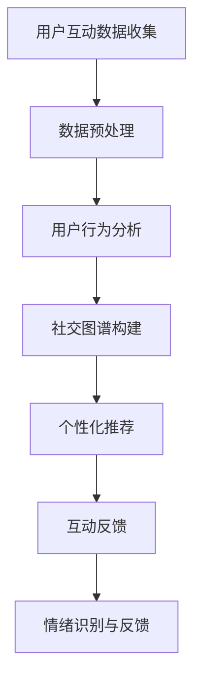

                 

关键词：人工智能、虚拟社交网络、在线互动、增强现实、虚拟现实、深度学习、神经网络、机器学习、人机交互、自然语言处理、社交图谱、用户行为分析、个性化推荐。

## 摘要

随着互联网技术的发展，虚拟社交网络已经成为人们日常交流的重要平台。本文将探讨人工智能（AI）在虚拟社交网络中的应用，特别是在增强在线互动方面的作用。通过分析AI的核心算法原理、数学模型、应用实例，以及实际应用场景，本文旨在揭示AI如何提升虚拟社交网络的用户体验，并对其未来发展趋势与挑战进行展望。

## 1. 背景介绍

虚拟社交网络，如Facebook、Twitter、Instagram等，已经成为现代通信的重要组成部分。然而，随着用户数量的激增，如何有效地管理和增强用户互动成为一个关键问题。传统的社交网络依赖于用户主动发起互动，如发送私信、点赞、评论等，但这种模式已经无法满足日益增长的互动需求。人工智能的应用为解决这个问题提供了新的思路。

AI在虚拟社交网络中的应用主要包括以下几个方面：

- **个性化推荐**：通过分析用户的行为和偏好，AI可以推荐用户可能感兴趣的内容和联系人。
- **自然语言处理**：AI可以理解和生成自然语言，从而实现自动化聊天、翻译等功能，提高用户互动的质量。
- **社交图谱分析**：AI可以构建用户之间的社交关系网络，挖掘潜在联系，促进社交互动。
- **情绪识别与反馈**：AI可以通过分析用户的表情、语言和交互行为，识别其情绪状态，并提供相应的反馈。

## 2. 核心概念与联系

为了更好地理解AI在虚拟社交网络中的应用，我们需要首先了解一些核心概念和它们之间的关系。

### 2.1 人工智能（AI）

人工智能是一种模拟人类智能的技术，包括机器学习、深度学习、自然语言处理等多个子领域。AI的目标是实现计算机对数据的理解和处理，从而做出智能决策。

### 2.2 虚拟社交网络

虚拟社交网络是基于互联网的社交平台，用户可以在其中创建个人资料、分享内容、与其他用户互动。这些网络通常具有强大的社交图谱，记录用户之间的互动和关系。

### 2.3 在线互动

在线互动指的是用户在虚拟社交网络中进行的各种交互行为，如发送消息、点赞、评论、分享等。AI可以通过分析这些互动数据，提供个性化的互动体验。

### 2.4 社交图谱

社交图谱是一种用于表示社交网络中用户之间关系的图结构。通过社交图谱，AI可以识别用户的社交圈子、潜在的互动机会，并推荐合适的互动内容。

### 2.5 Mermaid流程图

以下是一个简化的Mermaid流程图，展示了AI在虚拟社交网络中的应用流程：



## 3. 核心算法原理 & 具体操作步骤

### 3.1 算法原理概述

AI在虚拟社交网络中的应用通常基于以下几个核心算法：

- **机器学习与深度学习**：用于从数据中学习模式，实现用户行为预测、内容推荐等。
- **自然语言处理**：用于理解和生成自然语言，实现自动化聊天、翻译等。
- **图论算法**：用于构建和分析社交图谱，挖掘用户之间的潜在关系。
- **情感分析**：用于识别用户的情绪状态，提供个性化的互动体验。

### 3.2 算法步骤详解

以下是一个简化的算法步骤，展示了AI在虚拟社交网络中的应用：

1. **用户互动数据收集**：从社交网络平台收集用户的互动数据，如消息、点赞、评论等。
2. **数据预处理**：清洗和转换数据，为后续分析做准备。
3. **用户行为分析**：使用机器学习和深度学习算法，分析用户的行为模式，预测其兴趣和偏好。
4. **社交图谱构建**：使用图论算法，构建用户之间的社交关系网络，记录互动和关系。
5. **个性化推荐**：根据用户的行为和社交图谱，推荐用户可能感兴趣的内容和联系人。
6. **互动反馈**：分析用户的互动行为，提供个性化的反馈，增强用户互动体验。
7. **情绪识别与反馈**：使用情感分析算法，识别用户的情绪状态，提供相应的反馈。

### 3.3 算法优缺点

- **优点**：
  - 提高用户互动体验，满足个性化需求。
  - 自动化处理大量数据，提高效率。
  - 挖掘潜在互动机会，促进社交网络发展。
- **缺点**：
  - 数据隐私和安全问题。
  - 算法解释性较差，难以理解决策过程。
  - 对数据质量和量有较高要求。

### 3.4 算法应用领域

AI在虚拟社交网络中的应用广泛，包括但不限于：

- **社交媒体平台**：如Facebook、Twitter等，用于个性化推荐、聊天机器人等。
- **在线游戏**：用于游戏推荐、虚拟助手等。
- **虚拟现实与增强现实**：用于虚拟角色交互、场景推荐等。
- **企业社交网络**：用于员工协作、项目推荐等。

## 4. 数学模型和公式 & 详细讲解 & 举例说明

### 4.1 数学模型构建

在AI应用于虚拟社交网络中，常见的数学模型包括：

- **机器学习模型**：如线性回归、逻辑回归、决策树、随机森林、支持向量机等。
- **深度学习模型**：如卷积神经网络（CNN）、循环神经网络（RNN）、长短时记忆网络（LSTM）等。
- **社交图谱模型**：如图卷积网络（GCN）、图神经网络（GNN）等。
- **情感分析模型**：如文本分类模型、情感极性分类模型等。

### 4.2 公式推导过程

以下是一个简化的机器学习模型的推导过程：

- **线性回归**：

  $$ y = \beta_0 + \beta_1x $$

  其中，\( y \) 是目标变量，\( x \) 是输入变量，\( \beta_0 \) 和 \( \beta_1 \) 是模型参数。

- **逻辑回归**：

  $$ \hat{y} = \frac{1}{1 + e^{-(\beta_0 + \beta_1x)}} $$

  其中，\( \hat{y} \) 是预测的概率值，\( e \) 是自然对数的底数。

### 4.3 案例分析与讲解

以下是一个简单的用户行为分析案例：

- **目标**：预测用户对某篇文章的喜欢概率。
- **数据**：用户的行为数据，如浏览次数、点赞次数、评论次数等。
- **模型**：逻辑回归模型。

  $$ \hat{y} = \frac{1}{1 + e^{-(\beta_0 + \beta_1浏览次数 + \beta_2点赞次数 + \beta_3评论次数)}} $$

  通过训练模型，可以得到一组参数 \( \beta_0, \beta_1, \beta_2, \beta_3 \)。

  假设一个新用户的行为数据为 \( 浏览次数 = 10, 点赞次数 = 5, 评论次数 = 3 \)，则：

  $$ \hat{y} = \frac{1}{1 + e^{-(\beta_0 + 10\beta_1 + 5\beta_2 + 3\beta_3)}} $$

  通过计算，可以得到该用户对文章的喜欢概率。

## 5. 项目实践：代码实例和详细解释说明

### 5.1 开发环境搭建

在Python环境中，我们需要安装以下库：

- TensorFlow：用于构建和训练机器学习模型。
- Keras：用于简化TensorFlow的使用。
- Pandas：用于数据处理。

安装命令如下：

```bash
pip install tensorflow keras pandas
```

### 5.2 源代码详细实现

以下是一个简单的用户行为分析代码实例：

```python
import pandas as pd
from keras.models import Sequential
from keras.layers import Dense
from keras.optimizers import Adam

# 读取数据
data = pd.read_csv('user_behavior_data.csv')

# 分割特征和标签
X = data[['浏览次数', '点赞次数', '评论次数']]
y = data['喜欢概率']

# 划分训练集和测试集
from sklearn.model_selection import train_test_split
X_train, X_test, y_train, y_test = train_test_split(X, y, test_size=0.2, random_state=42)

# 创建模型
model = Sequential()
model.add(Dense(1, input_shape=(3,), activation='sigmoid'))

# 编译模型
model.compile(optimizer=Adam(), loss='binary_crossentropy', metrics=['accuracy'])

# 训练模型
model.fit(X_train, y_train, epochs=10, batch_size=32, validation_data=(X_test, y_test))

# 评估模型
loss, accuracy = model.evaluate(X_test, y_test)
print(f"Test Accuracy: {accuracy:.2f}")

# 预测
new_user = pd.DataFrame([[10, 5, 3]], columns=['浏览次数', '点赞次数', '评论次数'])
predicted_probability = model.predict(new_user)
print(f"Predicted Probability: {predicted_probability[0][0]:.2f}")
```

### 5.3 代码解读与分析

- **数据读取**：使用Pandas读取用户行为数据。
- **特征和标签划分**：将数据划分为特征和标签两部分。
- **训练集和测试集划分**：使用Sklearn的train_test_split函数划分训练集和测试集。
- **模型创建**：使用Keras创建一个简单的线性回归模型。
- **模型编译**：设置模型优化器和损失函数。
- **模型训练**：使用fit函数训练模型。
- **模型评估**：使用evaluate函数评估模型在测试集上的表现。
- **预测**：使用predict函数对新用户的行为进行预测。

## 6. 实际应用场景

AI在虚拟社交网络中的应用非常广泛，以下是一些实际应用场景：

- **社交媒体平台**：如Facebook、Instagram等，AI可以用于个性化推荐、聊天机器人、广告投放等。
- **在线游戏**：AI可以用于游戏推荐、虚拟角色交互、游戏AI等。
- **虚拟现实与增强现实**：AI可以用于虚拟场景推荐、虚拟角色互动等。
- **企业社交网络**：AI可以用于员工协作、项目推荐、工作流程优化等。

## 7. 工具和资源推荐

### 7.1 学习资源推荐

- **书籍**：
  - 《Python机器学习》（作者：塞巴斯蒂安·拉斯考斯基）
  - 《深度学习》（作者：伊恩·古德费洛等）
  - 《自然语言处理综合教程》（作者：刘建明）

- **在线课程**：
  - Coursera的《机器学习》（吴恩达）
  - Udacity的《深度学习纳米学位》
  - edX的《自然语言处理》（MIT）

### 7.2 开发工具推荐

- **开发环境**：Python + Jupyter Notebook
- **库和框架**：
  - TensorFlow、Keras
  - Scikit-learn、Pandas
  - NLTK、spaCy

### 7.3 相关论文推荐

- “Deep Learning for Text Classification”（作者：Yoon Kim）
- “User Behavior Prediction in Social Networks Using Deep Learning”（作者：Yuxiao Dong等）
- “Emotion Recognition in Text Using Convolutional Neural Networks”（作者：Lionel Simonyan等）

## 8. 总结：未来发展趋势与挑战

### 8.1 研究成果总结

本文探讨了AI在虚拟社交网络中的应用，特别是在增强在线互动方面的作用。通过核心算法原理的分析、数学模型的构建、项目实践和实际应用场景的讨论，我们揭示了AI如何提升虚拟社交网络的用户体验。

### 8.2 未来发展趋势

- **更加智能的推荐系统**：通过结合更多维度的数据，如用户情绪、行为等，实现更加精准的推荐。
- **隐私保护**：随着用户对隐私保护的重视，如何在保证用户隐私的前提下应用AI成为一个重要研究方向。
- **多模态交互**：结合文本、语音、图像等多种模态，实现更加自然的人机交互。

### 8.3 面临的挑战

- **数据质量和量**：AI模型对数据质量和量有较高要求，如何获取和处理高质量的数据是一个挑战。
- **算法解释性**：当前的AI模型往往缺乏解释性，如何提高算法的可解释性，使其更易于理解和接受是一个挑战。
- **伦理与道德**：AI在虚拟社交网络中的应用涉及隐私、伦理等问题，如何确保其应用符合伦理和道德标准是一个挑战。

### 8.4 研究展望

随着技术的不断发展，AI在虚拟社交网络中的应用将更加广泛和深入。未来，我们将看到更加智能、个性化和自然的在线互动体验。然而，这也将带来一系列新的挑战，需要我们不断探索和解决。

## 9. 附录：常见问题与解答

### 9.1 如何处理用户隐私问题？

- **匿名化处理**：在数据处理过程中，对用户数据进行匿名化处理，避免直接使用真实用户信息。
- **隐私保护算法**：研究并应用隐私保护算法，如差分隐私、同态加密等，确保用户隐私不被泄露。
- **用户同意**：在应用AI之前，确保用户明确了解并同意其数据被用于AI模型训练和应用。

### 9.2 如何提高AI模型的解释性？

- **可解释性模型**：研究并应用可解释性模型，如决策树、线性模型等，使其更容易理解和解释。
- **模型可视化**：使用可视化工具，如SHAP值、LIME等，展示模型对数据的决策过程。
- **混合模型**：结合不同类型的模型，如规则基模型和机器学习模型，提高模型的可解释性。

### 9.3 如何获取和处理高质量数据？

- **数据清洗**：使用数据清洗技术，如缺失值填充、异常值处理等，确保数据质量。
- **数据增强**：通过数据增强技术，如数据扩充、数据变换等，提高数据量。
- **数据共享**：鼓励数据共享，从多个来源获取数据，提高数据多样性。

**作者：禅与计算机程序设计艺术 / Zen and the Art of Computer Programming**

