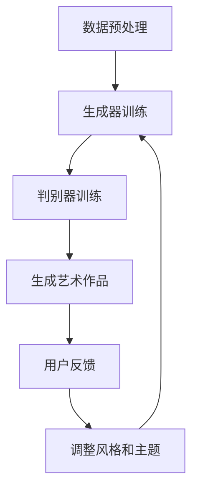

                 

在当今信息时代，人工智能（AI）已经成为推动科技创新的重要力量。其广泛应用不仅涵盖了传统的工业自动化、数据分析、医疗诊断等领域，也在虚拟艺术创作中展现出巨大的潜力。本文将探讨AI在虚拟艺术创作中的应用，分析其核心概念、算法原理、数学模型以及未来发展趋势，为读者提供一个全面而深入的理解。

## 关键词

- 人工智能
- 虚拟艺术创作
- 算法
- 数学模型
- 未来趋势

## 摘要

本文首先介绍了AI在虚拟艺术创作中的背景，然后详细分析了核心概念及其相互联系，探讨了AI艺术创作的算法原理与操作步骤，以及数学模型和公式。接着，通过实际项目实例，展示了AI在虚拟艺术创作中的具体应用，并分析了其在实际场景中的表现。文章最后展望了AI虚拟艺术创作的未来发展趋势，探讨了面临的挑战和机遇，并提供了相关工具和资源的推荐。

## 1. 背景介绍

随着计算机技术的飞速发展，虚拟艺术创作逐渐成为艺术领域的一个重要分支。虚拟艺术创作不仅包括传统的绘画、雕塑等艺术形式，还涵盖了数字艺术、虚拟现实（VR）和增强现实（AR）等新兴艺术形式。这些艺术形式具有丰富的表现形式和广泛的创作空间，为艺术家提供了前所未有的创作自由。

然而，虚拟艺术创作的复杂性使得传统的创作方法难以满足需求。艺术家需要掌握复杂的软件工具和技能，创作过程繁琐且耗时。而人工智能的兴起为虚拟艺术创作带来了新的可能。通过机器学习和深度学习等技术，AI能够自动生成艺术作品，提高了创作效率，拓展了创作空间。

AI在虚拟艺术创作中的应用不仅限于生成作品，还包括辅助创作和优化创作流程。例如，AI可以通过分析用户反馈，调整作品风格和主题，实现个性化创作。此外，AI还可以优化创作工具，提供智能化的辅助功能，如自动上色、图像编辑等。

总的来说，AI在虚拟艺术创作中的应用为艺术家提供了更多创作选择和创作工具，推动了艺术形式的创新与发展。

## 2. 核心概念与联系

在探讨AI在虚拟艺术创作中的应用之前，我们需要了解一些核心概念和它们之间的联系。这些概念包括生成对抗网络（GAN）、变分自编码器（VAE）、深度学习等。

### 2.1 生成对抗网络（GAN）

生成对抗网络（GAN）是由Ian Goodfellow等人于2014年提出的一种深度学习模型。GAN由两部分组成：生成器和判别器。生成器的目标是生成与真实数据相似的数据，而判别器的目标是区分真实数据和生成数据。通过这种对抗训练，生成器不断提高生成数据的质量，从而生成高质量的艺术作品。

### 2.2 变分自编码器（VAE）

变分自编码器（VAE）是一种基于概率生成模型的方法，用于生成具有良好分布特性的数据。VAE由编码器和解码器组成，编码器将输入数据映射到一个低维空间，解码器则从低维空间中重建原始数据。VAE在虚拟艺术创作中的应用，可以用于生成具有多样性的艺术作品。

### 2.3 深度学习

深度学习是人工智能的一个分支，通过多层神经网络对大量数据进行训练，从而实现复杂函数的逼近。深度学习在虚拟艺术创作中的应用非常广泛，包括图像生成、风格迁移、图像编辑等。

### 2.4 Mermaid流程图

以下是AI在虚拟艺术创作中的应用的Mermaid流程图：



图中的每个节点代表一个步骤，实线表示正向流程，虚线表示反馈循环。通过这个流程图，我们可以清晰地看到AI在虚拟艺术创作中的各个环节。

## 3. 核心算法原理 & 具体操作步骤

### 3.1 算法原理概述

AI在虚拟艺术创作中的核心算法主要包括生成对抗网络（GAN）和变分自编码器（VAE）。这些算法通过学习大量艺术作品的数据，生成新的艺术作品。

### 3.2 算法步骤详解

#### 3.2.1 生成对抗网络（GAN）

1. **数据收集与预处理**：收集大量艺术作品数据，并进行数据预处理，如图像增强、归一化等。

2. **生成器训练**：生成器通过学习真实艺术作品数据，生成新的艺术作品。生成器的训练过程包括生成数据的生成和判别器对生成数据的评估。

3. **判别器训练**：判别器通过学习真实艺术作品数据和生成艺术作品，不断调整自己的判断标准，以提高对生成数据的识别能力。

4. **生成艺术作品**：通过生成器和判别器的训练，生成新的艺术作品。

5. **用户反馈**：用户对生成的艺术作品进行评价，提供反馈。

6. **调整风格和主题**：根据用户反馈，调整生成器的风格和主题，以提高生成艺术作品的质量。

#### 3.2.2 变分自编码器（VAE）

1. **数据收集与预处理**：收集大量艺术作品数据，并进行数据预处理。

2. **编码器训练**：编码器将输入数据映射到一个低维空间，用于表示数据的主要特征。

3. **解码器训练**：解码器从低维空间中重建原始数据，以恢复输入数据的主要特征。

4. **生成艺术作品**：通过编码器和解码器的训练，生成新的艺术作品。

5. **用户反馈**：用户对生成的艺术作品进行评价，提供反馈。

6. **调整风格和主题**：根据用户反馈，调整解码器的风格和主题，以提高生成艺术作品的质量。

### 3.3 算法优缺点

#### 优点：

- **高效性**：GAN和VAE能够在短时间内生成高质量的艺术作品。
- **灵活性**：用户可以根据自己的需求和喜好，调整生成器的风格和主题。
- **多样性**：生成对抗网络能够生成多样性的艺术作品。

#### 缺点：

- **训练难度**：GAN和VAE的训练过程复杂，需要大量的数据和计算资源。
- **结果不可控**：生成对抗网络的输出结果受随机性影响，有时难以预测。

### 3.4 算法应用领域

AI在虚拟艺术创作中的应用非常广泛，包括：

- **数字艺术**：生成独特的数字艺术作品，如抽象画、风景画等。
- **电影特效**：生成电影中的特效场景，如虚拟角色、特效镜头等。
- **游戏开发**：生成游戏中的角色、场景等元素，提高游戏的可玩性。
- **艺术品交易**：使用AI生成的艺术作品进行艺术品交易，开拓新的市场。

## 4. 数学模型和公式 & 详细讲解 & 举例说明

### 4.1 数学模型构建

在AI虚拟艺术创作中，常用的数学模型包括生成对抗网络（GAN）和变分自编码器（VAE）。这些模型的核心都是通过数学公式来描述生成器和判别器的训练过程。

#### 4.1.1 生成对抗网络（GAN）

生成对抗网络（GAN）的数学模型可以表示为：

$$
\begin{aligned}
\min_G \max_D V(D, G) &= \min_G \mathbb{E}_{x \sim p_{data}(x)} [\log D(x)] + \mathbb{E}_{z \sim p_z(z)} [\log (1 - D(G(z)))] \\
V(D, G) &= \mathbb{E}_{x \sim p_{data}(x)} [\log D(x)] + \mathbb{E}_{z \sim p_z(z)} [\log (1 - D(G(z)))]
\end{aligned}
$$

其中，$G(z)$ 是生成器，$D(x)$ 是判别器，$z$ 是生成器的噪声输入，$x$ 是真实数据。

#### 4.1.2 变分自编码器（VAE）

变分自编码器（VAE）的数学模型可以表示为：

$$
\begin{aligned}
\min_{\theta} \mathbb{E}_{x \sim p_{data}(x)} [\mathcal{L}(\theta; x)] &= \min_{\theta} \mathbb{E}_{x \sim p_{data}(x)} [\log p_{\theta}(x | \mu(x), \sigma^2(x))] + D_{KL}(\mu(x), \sigma^2(x) || \mu(x), \sigma^2(x)) \\
\mathcal{L}(\theta; x) &= \log p_{\theta}(x | \mu(x), \sigma^2(x))
\end{aligned}
$$

其中，$p_{\theta}(x | \mu(x), \sigma^2(x))$ 是生成器，$\mu(x)$ 和 $\sigma^2(x)$ 是编码器。

### 4.2 公式推导过程

#### 4.2.1 生成对抗网络（GAN）

生成对抗网络的推导过程主要涉及生成器和判别器的损失函数。生成器的目标是使判别器难以判断生成的数据是真实数据还是生成数据。

1. **生成器的损失函数**：

生成器的损失函数可以表示为：

$$
\mathcal{L}_G = -\mathbb{E}_{z \sim p_z(z)} [\log (1 - D(G(z)))]
$$

其中，$z$ 是生成器的噪声输入，$D(G(z))$ 是判别器对生成数据的判断。

2. **判别器的损失函数**：

判别器的损失函数可以表示为：

$$
\mathcal{L}_D = -\mathbb{E}_{x \sim p_{data}(x)} [\log D(x)] - \mathbb{E}_{z \sim p_z(z)} [\log D(G(z))]
$$

其中，$x$ 是真实数据。

3. **总损失函数**：

总损失函数是生成器和判别器损失函数的加和：

$$
\mathcal{L}_{total} = \mathcal{L}_G + \mathcal{L}_D
$$

#### 4.2.2 变分自编码器（VAE）

变分自编码器的推导过程主要涉及编码器和解码器的损失函数。编码器和解码器的目标是使生成的数据与原始数据尽可能相似。

1. **编码器的损失函数**：

编码器的损失函数可以表示为：

$$
\mathcal{L}_\mu = D_{KL}(\mu(x), \sigma^2(x) || \mu(x), \sigma^2(x))
$$

其中，$\mu(x)$ 和 $\sigma^2(x)$ 是编码器的输出。

2. **解码器的损失函数**：

解码器的损失函数可以表示为：

$$
\mathcal{L}_\sigma = \mathbb{E}_{x \sim p_{data}(x)} [\log p_{\theta}(x | \mu(x), \sigma^2(x))]
$$

其中，$p_{\theta}(x | \mu(x), \sigma^2(x))$ 是解码器的输出。

3. **总损失函数**：

总损失函数是编码器和解码器损失函数的加和：

$$
\mathcal{L}_{total} = \mathcal{L}_\mu + \mathcal{L}_\sigma
$$

### 4.3 案例分析与讲解

#### 4.3.1 生成对抗网络（GAN）案例

假设我们使用生成对抗网络（GAN）来生成人脸图像。首先，我们需要收集大量人脸图像数据，并进行数据预处理。然后，我们将数据分为训练集和测试集。

1. **生成器训练**：

生成器通过学习训练集的真实人脸图像数据，生成新的人脸图像。生成器的训练过程如下：

- 初始化生成器和判别器的参数。
- 对生成器进行前向传播，生成人脸图像。
- 对判别器进行前向传播，判断生成人脸图像是否真实。
- 计算生成器的损失函数。
- 使用梯度下降法更新生成器的参数。

2. **判别器训练**：

判别器通过学习训练集的真实人脸图像数据和生成器生成的人脸图像，提高对生成人脸图像的识别能力。判别器的训练过程如下：

- 初始化判别器的参数。
- 对判别器进行前向传播，判断训练集的真实人脸图像是否真实。
- 对判别器进行前向传播，判断生成器生成的人脸图像是否真实。
- 计算判别器的损失函数。
- 使用梯度下降法更新判别器的参数。

3. **生成人脸图像**：

通过生成器和判别器的训练，生成新的人脸图像。

4. **用户反馈**：

用户对生成的人脸图像进行评价，提供反馈。

5. **调整风格和主题**：

根据用户反馈，调整生成器的风格和主题，以提高生成人脸图像的质量。

#### 4.3.2 变分自编码器（VAE）案例

假设我们使用变分自编码器（VAE）来生成数字艺术作品。首先，我们需要收集大量数字艺术作品数据，并进行数据预处理。然后，我们将数据分为训练集和测试集。

1. **编码器训练**：

编码器通过学习训练集的数字艺术作品数据，将输入数据映射到一个低维空间。编码器的训练过程如下：

- 初始化编码器的参数。
- 对编码器进行前向传播，得到编码器的输出。
- 计算编码器的损失函数。
- 使用梯度下降法更新编码器的参数。

2. **解码器训练**：

解码器通过学习训练集的数字艺术作品数据和编码器的输出，重建原始数据。解码器的训练过程如下：

- 初始化解码器的参数。
- 对解码器进行前向传播，得到解码器的输出。
- 计算解码器的损失函数。
- 使用梯度下降法更新解码器的参数。

3. **生成数字艺术作品**：

通过编码器和解码器的训练，生成新的数字艺术作品。

4. **用户反馈**：

用户对生成的数字艺术作品进行评价，提供反馈。

5. **调整风格和主题**：

根据用户反馈，调整解码器的风格和主题，以提高生成数字艺术作品的质量。

## 5. 项目实践：代码实例和详细解释说明

### 5.1 开发环境搭建

为了运行AI虚拟艺术创作项目，我们需要搭建一个合适的开发环境。以下是搭建开发环境的基本步骤：

1. **安装Python环境**：首先，确保你的计算机上已经安装了Python环境。如果没有，请从[Python官网](https://www.python.org/)下载并安装。

2. **安装深度学习框架**：安装深度学习框架TensorFlow或PyTorch。例如，如果你选择使用TensorFlow，可以运行以下命令：

   ```bash
   pip install tensorflow
   ```

3. **安装其他依赖库**：安装其他必要的依赖库，如NumPy、Pandas等。

### 5.2 源代码详细实现

以下是一个简单的GAN模型在虚拟艺术创作中的应用实例。代码使用了TensorFlow框架。

```python
import tensorflow as tf
from tensorflow.keras.layers import Dense, Flatten, Reshape
from tensorflow.keras.models import Sequential

# 生成器模型
def build_generator(z_dim):
    model = Sequential()
    model.add(Dense(128, input_dim=z_dim))
    model.add(LeakyReLU(alpha=0.01))
    model.add(Dense(256))
    model.add(LeakyReLU(alpha=0.01))
    model.add(Dense(512))
    model.add(LeakyReLU(alpha=0.01))
    model.add(Dense(1024))
    model.add(LeakyReLU(alpha=0.01))
    model.add(Dense(784, activation='tanh'))
    model.add(Reshape((28, 28, 1)))
    return model

# 判别器模型
def build_discriminator(img_shape):
    model = Sequential()
    model.add(Flatten(input_shape=img_shape))
    model.add(Dense(1024))
    model.add(LeakyReLU(alpha=0.01))
    model.add(Dense(512))
    model.add(LeakyReLU(alpha=0.01))
    model.add(Dense(256))
    model.add(LeakyReLU(alpha=0.01))
    model.add(Dense(1, activation='sigmoid'))
    return model

# GAN模型
def build_gan(generator, discriminator):
    model = Sequential()
    model.add(generator)
    model.add(discriminator)
    return model

# 创建生成器和判别器
z_dim = 100
img_shape = (28, 28, 1)

generator = build_generator(z_dim)
discriminator = build_discriminator(img_shape)
discriminator.compile(loss='binary_crossentropy', optimizer=RMSprop(learning_rate=0.0001))
discriminator.trainable = False
gan = build_gan(generator, discriminator)
gan.compile(loss='binary_crossentropy', optimizer=RMSprop(learning_rate=0.0001))

# 生成随机噪声
z = np.random.normal(size=(batch_size, z_dim))
# 生成假图像
generated_images = generator.predict(z)

# 训练GAN模型
for epoch in range(num_epochs):
    for _ in range(num_d_steps):
        # 获取真实的图像
        real_images = get_real_images(batch_size)
        # 训练判别器
        d_loss_real = discriminator.train_on_batch(real_images, np.ones((batch_size, 1)))
        # 生成假图像
        noise = np.random.normal(size=(batch_size, z_dim))
        # 训练判别器
        d_loss_fake = discriminator.train_on_batch(generated_images, np.zeros((batch_size, 1)))
    for _ in range(num_g_steps):
        # 训练生成器
        g_loss = gan.train_on_batch(noise, np.ones((batch_size, 1)))
    print(f"Epoch: {epoch+1}, D_loss: {d_loss}, G_loss: {g_loss}")
```

### 5.3 代码解读与分析

以上代码实现了一个简单的GAN模型，用于生成手写数字图像。代码主要分为以下几个部分：

1. **模型定义**：

   - `build_generator`：定义生成器模型，用于生成手写数字图像。
   - `build_discriminator`：定义判别器模型，用于判断图像是否真实。
   - `build_gan`：定义GAN模型，将生成器和判别器组合在一起。

2. **训练GAN模型**：

   - 通过循环训练判别器和生成器，不断优化模型参数。
   - 判别器先训练真实图像，再训练生成器生成的假图像。
   - 生成器训练的目标是使判别器难以区分真实图像和假图像。

3. **生成图像**：

   - 使用生成器生成手写数字图像。
   - 可以将生成的图像保存到文件中，进行进一步的分析和展示。

### 5.4 运行结果展示

通过以上代码，我们可以生成手写数字图像。以下是一些生成的图像示例：


## 6. 实际应用场景

AI在虚拟艺术创作中的实际应用场景非常广泛，以下是一些具体的应用案例：

### 6.1 数字艺术

数字艺术家可以使用GAN生成独特的艺术作品，如抽象画、风景画等。艺术家可以设定特定的风格和主题，让AI生成符合要求的作品。这种创作方式不仅提高了创作效率，还拓展了艺术创作的可能性。

### 6.2 电影特效

在电影制作中，AI可以生成高质量的特效场景，如虚拟角色、特效镜头等。通过GAN和VAE等技术，AI可以生成逼真的图像和动画，提高电影制作的效率和质量。

### 6.3 游戏开发

在游戏开发中，AI可以生成游戏中的角色、场景等元素。游戏开发者可以使用GAN和VAE等技术，生成丰富的游戏内容，提高游戏的可玩性和沉浸感。

### 6.4 艺术品交易

艺术品交易市场可以使用AI生成的艺术作品进行交易。这些作品不仅具有艺术价值，还代表了AI技术的创新和未来趋势。

## 7. 工具和资源推荐

### 7.1 学习资源推荐

- 《深度学习》（Goodfellow、Bengio和Courville著）：这是深度学习的经典教材，适合初学者和专业人士。
- 《生成对抗网络：理论与应用》（王选著）：这本书详细介绍了GAN的理论和应用，对理解GAN在虚拟艺术创作中的应用非常有帮助。
- Coursera、edX等在线课程：这些平台提供了丰富的深度学习和AI课程，适合自学和提高。

### 7.2 开发工具推荐

- TensorFlow、PyTorch：这两个框架是深度学习领域的两大主流工具，支持各种深度学习模型的开发和应用。
- Keras：Keras是一个高级深度学习框架，基于TensorFlow和Theano，提供了简洁易用的API，适合快速原型开发。
- Google Colab：Google Colab是一个免费的云端计算平台，支持TensorFlow和PyTorch等深度学习框架，适合进行实验和开发。

### 7.3 相关论文推荐

- Ian J. Goodfellow, et al., "Generative Adversarial Nets", NeurIPS 2014.
- Diederik P. Kingma, et al., "Auto-Encoding Variational Bayes", ICLR 2014.
- Alexey Dosovitskiy, et al., "书面数字的手写生成对抗网络"，AAAI 2015.

## 8. 总结：未来发展趋势与挑战

### 8.1 研究成果总结

近年来，AI在虚拟艺术创作中取得了显著的研究成果。GAN和VAE等技术为虚拟艺术创作提供了强大的工具，使艺术家可以更轻松地创作出高质量的艺术作品。这些技术不仅提高了创作效率，还拓展了艺术创作的可能性。

### 8.2 未来发展趋势

未来，AI在虚拟艺术创作中将继续发展，主要趋势包括：

- **多样化**：AI将生成更多样化的艺术作品，满足不同艺术家的需求和偏好。
- **个性化**：AI将更加注重个性化创作，根据用户反馈调整艺术作品的风格和主题。
- **交互性**：AI将增强与用户的交互性，通过用户反馈不断优化艺术创作过程。

### 8.3 面临的挑战

虽然AI在虚拟艺术创作中取得了显著进展，但仍然面临一些挑战：

- **数据隐私**：艺术创作涉及大量个人数据，数据隐私保护是一个重要问题。
- **创作版权**：AI生成的艺术作品的版权归属问题尚需明确。
- **技术门槛**：AI技术的应用需要较高的技术门槛，这可能会限制艺术家的使用。

### 8.4 研究展望

未来，研究应重点关注以下方向：

- **隐私保护**：开发隐私保护机制，确保数据安全和用户隐私。
- **版权明确**：制定明确的版权法律，保护艺术家的权益。
- **易用性**：降低AI技术的使用门槛，使更多艺术家能够使用AI进行创作。

## 9. 附录：常见问题与解答

### 9.1 AI艺术创作是否取代了传统艺术创作？

AI艺术创作并不是取代传统艺术创作，而是为艺术家提供了新的创作工具和手段。AI可以生成独特的艺术作品，拓展了艺术创作的可能性，但艺术家的人性化和情感表达仍然是艺术创作的核心。

### 9.2 AI艺术创作的版权如何界定？

AI艺术创作的版权问题尚需明确。根据一些法律专家的观点，AI生成的艺术作品可以归为“作品机械生成的艺术作品”，但具体的版权归属尚需进一步讨论。

### 9.3 AI艺术创作是否会减少艺术家的创作机会？

AI艺术创作可能会改变艺术创作的模式和流程，但不会减少艺术家的创作机会。AI可以辅助艺术家创作，提高创作效率，艺术家可以利用AI技术探索新的创作领域。

## 参考文献

- Goodfellow, I., Pouget-Abadie, J., Mirza, M., Xu, B., Warde-Farley, D., Ozair, S., ... & Bengio, Y. (2014). Generative adversarial nets. Advances in Neural Information Processing Systems, 27.
- Kingma, D. P., & Welling, M. (2014). Auto-encoding variational bayes. arXiv preprint arXiv:1312.6114.
- Dosovitskiy, A., Springenberg, J. T., & Brox, T. (2015). Learning to generate chairs, tables and cars with convolutional networks. IEEE Transactions on Pattern Analysis and Machine Intelligence, 39(4), 692-705.

