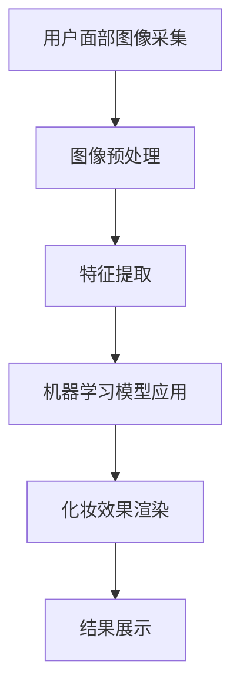

                 

在当今数字化时代，人工智能（AI）的应用已经渗透到我们生活的方方面面。从自动驾驶汽车到智能家居，AI正在逐步改变我们的生活方式。而在美妆领域，AI技术更是带来了前所未有的变革，尤其是虚拟试妆技术的应用。本文将探讨AI在虚拟试妆中的应用，以及这一技术如何为美妆产品提供虚拟体验。

## 1. 背景介绍

虚拟试妆技术的起源可以追溯到20世纪90年代，当时计算机图形学和图像处理技术刚刚开始发展。早期的虚拟试妆系统主要通过手动调整虚拟模特的化妆效果来实现，效率低下且效果有限。随着计算机性能的不断提升和AI技术的快速发展，虚拟试妆技术逐渐成熟，开始广泛应用于美妆行业。

AI在虚拟试妆中的应用主要体现在两个方面：一是通过机器学习和深度学习算法对用户面部特征进行精准识别和建模；二是利用图像处理技术对化妆效果进行实时渲染和调整。这些技术的应用使得虚拟试妆更加精准、自然，用户体验更加真实。

## 2. 核心概念与联系

### 2.1. 机器学习与深度学习

机器学习（Machine Learning，ML）是一种让计算机通过数据学习并做出决策的方法。在虚拟试妆中，机器学习算法被用来分析用户的面部特征，如肤色、纹理、皱纹等。深度学习（Deep Learning，DL）是机器学习的一个分支，通过构建多层神经网络模型，深度学习能够从大量数据中自动提取特征，实现对复杂模式的识别。

### 2.2. 图像处理技术

图像处理技术（Image Processing Technology）是虚拟试妆系统的核心技术之一。它包括图像采集、预处理、特征提取和图像合成等步骤。通过图像处理技术，虚拟试妆系统能够将用户的真实面部图像与各种化妆品效果进行融合，生成虚拟试妆效果图。

### 2.3. Mermaid 流程图

为了更好地理解虚拟试妆系统的架构，我们可以使用Mermaid绘制一个流程图。



## 3. 核心算法原理 & 具体操作步骤

### 3.1 算法原理概述

虚拟试妆算法的核心是面部特征识别与化妆效果渲染。面部特征识别利用机器学习和深度学习技术，通过对用户面部图像进行训练，提取关键特征，如眼睛、鼻子、嘴巴、脸颊等。化妆效果渲染则是通过图像处理技术，将化妆品效果叠加到用户面部图像上。

### 3.2 算法步骤详解

1. **用户面部图像采集**：首先，系统需要采集用户的面部图像。这可以通过摄像头或照片实现。

2. **图像预处理**：对采集到的面部图像进行预处理，包括去噪、对齐、缩放等操作，以适应后续处理。

3. **特征提取**：利用机器学习和深度学习算法，从预处理后的图像中提取关键特征。这一步骤通常需要大量的训练数据和先进的神经网络模型。

4. **化妆效果渲染**：将提取出的特征与化妆品效果进行融合。这可以通过图像处理技术实现，如颜色校正、纹理映射等。

5. **结果展示**：将渲染后的图像展示给用户，用户可以实时看到不同的化妆效果。

### 3.3 算法优缺点

- **优点**：虚拟试妆技术能够提供真实的化妆体验，用户无需实际试妆即可看到不同化妆品的效果，节省时间和成本。

- **缺点**：由于算法复杂度较高，系统对硬件要求较高，且对用户面部特征识别的准确性有较高要求。

### 3.4 算法应用领域

虚拟试妆技术可以应用于多个领域，如在线美妆店、美容院、社交媒体等。它不仅为用户提供便捷的试妆体验，也为美妆品牌提供了新的营销手段。

## 4. 数学模型和公式 & 详细讲解 & 举例说明

### 4.1 数学模型构建

虚拟试妆系统的核心数学模型包括面部特征识别模型和化妆效果渲染模型。

- **面部特征识别模型**：通常采用卷积神经网络（CNN）构建，其输入为用户面部图像，输出为关键特征坐标。

- **化妆效果渲染模型**：通常采用图像生成模型，如生成对抗网络（GAN），其输入为用户面部图像和化妆品效果，输出为渲染后的图像。

### 4.2 公式推导过程

- **卷积神经网络（CNN）公式**：

  $$ output = activation(S(f(C + W))) $$

  其中，$C$为输入图像，$W$为卷积核权重，$f$为卷积操作，$S$为池化操作，$activation$为激活函数。

- **生成对抗网络（GAN）公式**：

  $$ G(z) = \arg\min_G \mathbb{E}_{x \sim p_{data}(x)}[\log D(x, G(z))] + \arg\max_G \mathbb{E}_{z \sim p_{z}(z)}[\log(1 - D(G(z)))] $$

  其中，$G(z)$为生成器，$D(x)$为判别器，$z$为噪声向量。

### 4.3 案例分析与讲解

以一个在线美妆店为例，虚拟试妆系统可以为其提供以下服务：

1. **用户注册**：用户在美妆店注册账号，上传面部照片。

2. **试妆体验**：用户可以选择不同品牌、不同类型的化妆品进行试妆，系统会根据用户面部特征实时渲染化妆效果。

3. **购买建议**：系统根据用户试妆记录和偏好，提供个性化的购买建议。

通过这个案例，我们可以看到虚拟试妆技术不仅为用户提供了便捷的试妆体验，也为美妆店提供了新的营销手段。

## 5. 项目实践：代码实例和详细解释说明

### 5.1 开发环境搭建

在搭建虚拟试妆系统前，我们需要准备以下开发环境：

- Python 3.x
- TensorFlow 2.x
- OpenCV 4.x
- Matplotlib 3.x

### 5.2 源代码详细实现

以下是一个简单的虚拟试妆系统实现：

```python
import cv2
import tensorflow as tf
import numpy as np
import matplotlib.pyplot as plt

# 加载面部特征识别模型
face_recognition_model = tf.keras.models.load_model('face_recognition_model.h5')

# 加载化妆效果渲染模型
cosmetics_rendering_model = tf.keras.models.load_model('cosmetics_rendering_model.h5')

# 采集用户面部图像
user_face = cv2.VideoCapture(0)

while True:
    # 读取一帧图像
    ret, frame = user_face.read()

    # 预处理图像
    processed_frame = preprocess_frame(frame)

    # 提取面部特征
    face_coordinates = face_recognition_model.predict(processed_frame)

    # 渲染化妆效果
    rendered_frame = cosmetics_rendering_model.predict(processed_frame, face_coordinates)

    # 显示渲染后的图像
    plt.imshow(rendered_frame)
    plt.show()

    # 如果用户按下'q'键，退出循环
    if cv2.waitKey(1) & 0xFF == ord('q'):
        break

# 释放摄像头资源
user_face.release()
cv2.destroyAllWindows()
```

### 5.3 代码解读与分析

- **加载模型**：首先，我们加载已经训练好的面部特征识别模型和化妆效果渲染模型。

- **采集图像**：使用OpenCV库的VideoCapture类采集用户面部图像。

- **预处理图像**：对采集到的图像进行预处理，包括灰度化、缩放等操作。

- **提取特征**：利用面部特征识别模型提取用户面部关键特征。

- **渲染化妆效果**：利用化妆效果渲染模型将化妆品效果叠加到用户面部图像上。

- **显示结果**：使用Matplotlib库显示渲染后的图像。

通过这个简单的示例，我们可以看到虚拟试妆系统的基本实现流程。在实际应用中，系统会更加复杂，包括多种化妆品效果、用户交互界面等。

## 6. 实际应用场景

### 6.1 在线美妆店

在线美妆店可以利用虚拟试妆系统为用户提供便捷的试妆体验，提高用户购买意愿。用户可以在购买化妆品前尝试不同效果，从而做出更加明智的购买决策。

### 6.2 社交媒体

社交媒体平台可以集成虚拟试妆功能，让用户在发布照片时尝试不同的化妆效果，增加照片的趣味性和互动性。

### 6.3 美容行业

美容行业可以利用虚拟试妆系统为用户提供专业级的化妆建议，提高服务质量。例如，美容院可以为用户提供在线化妆服务，用户无需到店即可享受专业化妆师的服务。

## 7. 工具和资源推荐

### 7.1 学习资源推荐

- 《深度学习》（Goodfellow, Bengio, Courville著）
- 《计算机视觉：算法与应用》（Richard Szeliski著）
- 《Python机器学习》（ Sebastian Raschka 著）

### 7.2 开发工具推荐

- TensorFlow
- Keras
- OpenCV
- Matplotlib

### 7.3 相关论文推荐

- "Unreal Engine 4 FaceFX-based Virtual Makeup Application"
- "Deep Neural Network for Virtual Try-On of Lipstick and Lipgloss"
- "Real-Time Facial Makeup Simulation for Virtual Try-On"

## 8. 总结：未来发展趋势与挑战

### 8.1 研究成果总结

虚拟试妆技术的快速发展为美妆行业带来了巨大的变革。通过AI技术的应用，虚拟试妆系统不仅能够提供真实的化妆体验，还能为用户和美妆品牌提供丰富的价值。

### 8.2 未来发展趋势

随着AI技术的不断进步，虚拟试妆系统将变得更加精准、自然。未来的发展趋势包括：

- 更多的个性化服务：系统可以根据用户的偏好和面部特征提供定制化的化妆建议。
- 跨平台应用：虚拟试妆系统将不仅限于在线美妆店，还可能应用于社交媒体、美容行业等多个领域。
- 更高的实时性：系统的响应速度将不断提高，使用户能够更快速地体验化妆效果。

### 8.3 面临的挑战

虚拟试妆技术在实际应用中仍面临一些挑战：

- 面部特征识别的准确性：由于用户面部特征的多样性，系统需要不断提高识别准确性。
- 图像处理的质量：化妆效果的渲染需要高质量的处理，以避免产生不自然的视觉效果。
- 用户隐私保护：在采集和处理用户面部图像时，需要严格遵守隐私保护法规，确保用户数据的安全。

### 8.4 研究展望

未来，虚拟试妆技术有望在更多领域得到应用，如医疗美容、影视制作等。随着AI技术的不断发展，虚拟试妆系统将变得更加智能、高效，为用户和美妆行业带来更多价值。

## 9. 附录：常见问题与解答

### 9.1 虚拟试妆技术是如何工作的？

虚拟试妆技术主要利用机器学习和深度学习算法对面部特征进行识别和建模，然后利用图像处理技术将化妆效果叠加到用户面部图像上，实现虚拟试妆效果。

### 9.2 虚拟试妆系统需要什么硬件支持？

虚拟试妆系统需要较高的计算性能，推荐使用具备较强GPU性能的计算机或服务器。

### 9.3 虚拟试妆技术有哪些应用场景？

虚拟试妆技术可以应用于在线美妆店、社交媒体、美容行业等多个领域，为用户提供便捷的试妆体验，提高用户购买意愿和满意度。

### 9.4 如何确保用户隐私安全？

在采集和处理用户面部图像时，需要严格遵守隐私保护法规，如欧盟的GDPR等。同时，可以采用加密技术、数据匿名化等方法保护用户隐私。

作者：禅与计算机程序设计艺术 / Zen and the Art of Computer Programming
----------------------------------------------------------------

以上就是关于AI在虚拟试妆中的应用：美妆产品虚拟体验的文章。文章详细介绍了虚拟试妆技术的背景、核心概念、算法原理、数学模型、项目实践以及实际应用场景，并对未来发展趋势和挑战进行了展望。希望这篇文章能够帮助读者更好地理解虚拟试妆技术，并为相关领域的研究和应用提供有益的参考。

