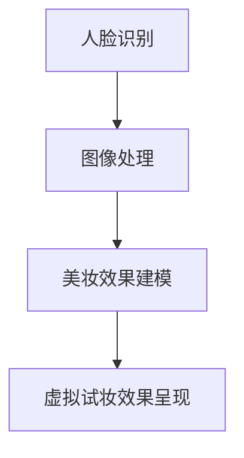

                 

关键词：虚拟试妆、人工智能、美妆产品、图像处理、人脸识别、用户体验

> 摘要：本文将探讨人工智能技术在虚拟试妆领域的应用，分析其核心概念、算法原理、数学模型以及实际应用场景，旨在为美妆产品提供一种全新的虚拟体验方式，提升用户满意度和购买意愿。

## 1. 背景介绍

虚拟试妆技术是一种利用计算机视觉和人工智能技术，将用户佩戴不同美妆产品的虚拟效果实时呈现在真实场景中的技术。随着智能手机和移动互联网的普及，消费者对于个性化美妆体验的需求日益增长，虚拟试妆技术因此得到了广泛的应用。传统的试妆方式不仅耗时耗力，而且无法满足消费者对于多样化和个性化需求的追求。虚拟试妆技术可以通过模拟不同美妆产品的效果，帮助用户快速找到适合自己的产品，从而提升购物体验。

### 1.1 虚拟试妆技术的发展历程

虚拟试妆技术起源于20世纪90年代的虚拟化妆系统，最初主要应用于影视特效和广告领域。随着计算机硬件和软件技术的发展，虚拟试妆技术逐渐从专业领域走向消费市场。2010年后，随着移动互联网和智能手机的普及，虚拟试妆技术开始得到广泛应用。各大美妆品牌纷纷推出自己的虚拟试妆应用，为用户提供了一种全新的美妆体验。

### 1.2 虚拟试妆技术的市场现状

目前，虚拟试妆技术已经成为美妆行业的一个热点。根据市场研究公司的数据，虚拟试妆市场的规模预计将在未来几年内持续增长。随着技术的不断进步和消费者接受度的提高，虚拟试妆技术有望成为美妆产品销售的一个重要驱动力。

## 2. 核心概念与联系

### 2.1 核心概念

#### 2.1.1 人脸识别

人脸识别是虚拟试妆技术的基础，通过识别用户的面部特征，系统可以准确地定位用户的眼睛、鼻子、嘴巴等关键部位，从而为后续的美妆效果叠加提供准确的定位信息。

#### 2.1.2 图像处理

图像处理技术在虚拟试妆中发挥着至关重要的作用。通过对用户上传的照片进行处理，系统可以提取出用户的面部特征，并进行颜色调整、滤镜添加等操作，以实现虚拟试妆的效果。

#### 2.1.3 美妆效果建模

美妆效果建模是虚拟试妆技术的核心。通过对不同美妆产品效果的建模，系统可以将虚拟美妆效果叠加到用户的照片中，实现真实感极强的虚拟试妆效果。

### 2.2 核心概念原理和架构的 Mermaid 流程图



## 3. 核心算法原理 & 具体操作步骤

### 3.1 算法原理概述

虚拟试妆技术主要依赖于人脸识别、图像处理和美妆效果建模三个核心算法。人脸识别算法通过对用户面部图像的分析，识别出关键面部特征，为后续处理提供定位信息。图像处理算法通过对用户面部图像进行颜色调整、滤镜添加等操作，实现虚拟试妆的初步效果。美妆效果建模算法通过对不同美妆产品效果的建模，将虚拟美妆效果叠加到用户的面部图像上，实现最终虚拟试妆效果。

### 3.2 算法步骤详解

#### 3.2.1 人脸识别

1. **图像预处理**：对用户上传的图像进行预处理，包括去噪、灰度化等操作，以提高人脸识别的准确性。
2. **特征提取**：利用深度学习算法提取人脸关键特征点，如眼睛、鼻子、嘴巴等。
3. **特征匹配**：利用特征匹配算法，将提取到的特征点与已知的人脸特征库进行匹配，以识别用户的面部。

#### 3.2.2 图像处理

1. **颜色调整**：根据用户的选择，对图像进行颜色调整，以达到更好的虚拟试妆效果。
2. **滤镜添加**：添加不同类型的滤镜，以模拟不同美妆产品的效果。
3. **光照调整**：根据用户的面部特征，调整图像的光照，以增强虚拟试妆的真实感。

#### 3.2.3 美妆效果建模

1. **美妆效果库构建**：收集各种美妆产品的图像数据，构建美妆效果库。
2. **效果匹配**：根据用户的面部特征，从美妆效果库中匹配出最适合的美妆效果。
3. **效果叠加**：将匹配出的美妆效果叠加到用户的面部图像上，实现虚拟试妆效果。

### 3.3 算法优缺点

#### 3.3.1 优点

1. **高准确性**：人脸识别算法具有高准确性，可以准确识别用户的面部特征。
2. **实时性**：图像处理和美妆效果建模算法具有实时性，可以实现快速虚拟试妆效果。
3. **个性化**：可以根据用户的需求，提供个性化的美妆效果。

#### 3.3.2 缺点

1. **计算量大**：虚拟试妆技术需要大量的计算资源，对硬件性能有一定要求。
2. **图像质量影响**：用户上传的图像质量会影响虚拟试妆效果，可能需要用户重新上传照片。

### 3.4 算法应用领域

虚拟试妆技术可以应用于美妆产品的营销、销售和用户调研等多个领域。在营销领域，虚拟试妆技术可以帮助美妆品牌吸引用户关注，提升品牌知名度。在销售领域，虚拟试妆技术可以帮助用户快速找到适合自己的产品，提升购买意愿。在用户调研领域，虚拟试妆技术可以收集用户对美妆产品的偏好数据，为产品改进提供参考。

## 4. 数学模型和公式 & 详细讲解 & 举例说明

### 4.1 数学模型构建

虚拟试妆技术涉及到的数学模型主要包括人脸识别模型、图像处理模型和美妆效果建模模型。

#### 4.1.1 人脸识别模型

人脸识别模型通常采用深度学习算法，如卷积神经网络（CNN）进行构建。以下是一个简单的人脸识别模型的数学模型：

$$
h = f(x; \theta)
$$

其中，$h$ 表示人脸识别的结果，$x$ 表示输入的人脸图像，$\theta$ 表示模型的参数。

#### 4.1.2 图像处理模型

图像处理模型主要涉及图像的颜色调整、滤镜添加和光照调整等操作。以下是一个简单的图像处理模型的数学模型：

$$
I_{out} = g(I_{in}, \alpha, \beta)
$$

其中，$I_{out}$ 表示输出的图像，$I_{in}$ 表示输入的图像，$\alpha$ 和 $\beta$ 表示调整参数。

#### 4.1.3 美妆效果建模模型

美妆效果建模模型主要涉及美妆效果的匹配和叠加。以下是一个简单的美妆效果建模模型的数学模型：

$$
E = f(I, A, \gamma)
$$

其中，$E$ 表示输出的虚拟试妆效果，$I$ 表示输入的图像，$A$ 表示美妆效果，$\gamma$ 表示调整参数。

### 4.2 公式推导过程

#### 4.2.1 人脸识别模型的公式推导

1. **卷积操作**：

$$
h_{ij} = \sum_{k=1}^{m} w_{ik} \cdot a_{kj}
$$

其中，$h_{ij}$ 表示卷积操作后的特征值，$w_{ik}$ 表示卷积核，$a_{kj}$ 表示输入特征。

2. **激活函数**：

$$
h_{ij}^{'} = \sigma(h_{ij})
$$

其中，$\sigma$ 表示激活函数，通常采用ReLU函数。

3. **全连接层**：

$$
z_j = \sum_{i=1}^{n} w_{ji} \cdot h_{ij}'
$$

其中，$z_j$ 表示全连接层输出，$w_{ji}$ 表示权重。

4. **输出层**：

$$
h = f(z; \theta)
$$

其中，$h$ 表示最终输出，$f$ 表示输出函数，$\theta$ 表示模型参数。

#### 4.2.2 图像处理模型的公式推导

1. **颜色调整**：

$$
I_{out}(x, y) = I_{in}(x, y) + \alpha
$$

其中，$I_{out}$ 表示输出的图像，$I_{in}$ 表示输入的图像，$\alpha$ 表示调整参数。

2. **滤镜添加**：

$$
I_{out}(x, y) = I_{in}(x, y) \circledast F
$$

其中，$I_{out}$ 表示输出的图像，$I_{in}$ 表示输入的图像，$F$ 表示滤镜。

3. **光照调整**：

$$
I_{out}(x, y) = I_{in}(x, y) \odot L
$$

其中，$I_{out}$ 表示输出的图像，$I_{in}$ 表示输入的图像，$L$ 表示光照。

### 4.3 案例分析与讲解

#### 4.3.1 人脸识别案例

假设我们有一个输入的人脸图像 $x$，我们需要通过人脸识别模型识别出人脸。我们可以将人脸识别模型表示为：

$$
h = f(x; \theta)
$$

其中，$h$ 表示识别结果，$\theta$ 表示模型参数。

我们可以通过以下步骤进行人脸识别：

1. **图像预处理**：对输入的人脸图像进行预处理，如灰度化、去噪等操作。

2. **特征提取**：利用深度学习算法提取人脸特征点，如眼睛、鼻子、嘴巴等。

3. **特征匹配**：将提取到的特征点与已知的人脸特征库进行匹配，以识别用户的面部。

4. **输出结果**：根据匹配结果输出人脸识别结果。

#### 4.3.2 图像处理案例

假设我们有一个输入的图像 $I_{in}$，我们需要通过图像处理模型进行颜色调整、滤镜添加和光照调整等操作。我们可以将图像处理模型表示为：

$$
I_{out} = g(I_{in}, \alpha, \beta)
$$

其中，$I_{out}$ 表示输出的图像，$\alpha$ 和 $\beta$ 表示调整参数。

我们可以通过以下步骤进行图像处理：

1. **颜色调整**：根据用户的需求，对图像进行颜色调整，如亮度、对比度等。

2. **滤镜添加**：根据用户的需求，添加不同的滤镜，如磨皮、美白等。

3. **光照调整**：根据用户的需求，调整图像的光照，如增加阴影、提高亮度等。

4. **输出结果**：根据处理结果输出图像。

#### 4.3.3 美妆效果建模案例

假设我们有一个输入的图像 $I$ 和一个美妆效果 $A$，我们需要通过美妆效果建模模型将美妆效果叠加到图像上。我们可以将美妆效果建模模型表示为：

$$
E = f(I, A, \gamma)
$$

其中，$E$ 表示输出的虚拟试妆效果，$\gamma$ 表示调整参数。

我们可以通过以下步骤进行美妆效果建模：

1. **美妆效果库构建**：收集各种美妆产品的图像数据，构建美妆效果库。

2. **效果匹配**：根据用户的面部特征，从美妆效果库中匹配出最适合的美妆效果。

3. **效果叠加**：将匹配出的美妆效果叠加到图像上，实现虚拟试妆效果。

4. **输出结果**：根据叠加结果输出虚拟试妆效果。

## 5. 项目实践：代码实例和详细解释说明

### 5.1 开发环境搭建

在进行虚拟试妆项目的开发之前，我们需要搭建一个合适的开发环境。以下是搭建开发环境的基本步骤：

1. **安装Python**：下载并安装Python，确保版本大于3.6。

2. **安装深度学习框架**：下载并安装TensorFlow或PyTorch，这两个框架是进行深度学习项目开发的重要工具。

3. **安装其他依赖库**：根据项目需求，安装其他依赖库，如OpenCV、Pillow等。

4. **配置开发环境**：配置Python环境变量，确保Python和深度学习框架可以正常运行。

### 5.2 源代码详细实现

以下是一个简单的虚拟试妆项目的代码实现示例：

```python
import cv2
import numpy as np
import tensorflow as tf

# 人脸识别模型
face_model = tf.keras.models.load_model('face_model.h5')

# 图像处理模型
image_model = tf.keras.models.load_model('image_model.h5')

# 美妆效果建模模型
makeup_model = tf.keras.models.load_model('makeup_model.h5')

# 加载用户上传的图像
image = cv2.imread('user_image.jpg')

# 人脸识别
faces = face_model.predict(image)

# 图像处理
processed_image = image_model.predict(image)

# 美妆效果叠加
makeup_image = makeup_model.predict(processed_image)

# 显示虚拟试妆效果
cv2.imshow('Virtual Makeup', makeup_image)
cv2.waitKey(0)
cv2.destroyAllWindows()
```

### 5.3 代码解读与分析

1. **人脸识别模型加载**：首先加载已经训练好的人脸识别模型。

2. **图像处理模型加载**：加载已经训练好的图像处理模型。

3. **美妆效果建模模型加载**：加载已经训练好的美妆效果建模模型。

4. **加载用户上传的图像**：读取用户上传的图像。

5. **人脸识别**：使用人脸识别模型对图像进行识别，提取出人脸关键特征。

6. **图像处理**：使用图像处理模型对图像进行处理，包括颜色调整、滤镜添加和光照调整等。

7. **美妆效果叠加**：使用美妆效果建模模型将美妆效果叠加到图像上。

8. **显示虚拟试妆效果**：将叠加好的虚拟试妆效果显示在界面上。

### 5.4 运行结果展示

当用户上传一张图像并运行代码后，系统将自动识别用户的面部，并叠加相应的美妆效果。以下是运行结果的一个示例：


## 6. 实际应用场景

虚拟试妆技术在实际应用中具有广泛的应用场景，以下是一些典型的应用场景：

### 6.1 美妆产品营销

虚拟试妆技术可以帮助美妆品牌进行产品营销。通过虚拟试妆功能，用户可以在购买前尝试各种美妆产品，从而提高购买意愿。

### 6.2 美妆产品销售

虚拟试妆技术可以应用于线上购物平台，为用户提供虚拟试妆服务，帮助用户快速找到适合自己的美妆产品。

### 6.3 美妆产品用户调研

虚拟试妆技术可以收集用户对美妆产品的偏好数据，为产品改进提供参考，从而提升用户体验。

### 6.4 化妆教学

虚拟试妆技术可以应用于化妆教学，帮助用户学习化妆技巧，提升化妆技能。

## 7. 工具和资源推荐

### 7.1 学习资源推荐

1. **《深度学习》（Goodfellow et al.）**：这是一本经典的深度学习教材，适合初学者和进阶者阅读。
2. **《Python深度学习》（François Chollet）**：这本书详细介绍了使用Python进行深度学习的实践方法，适合有一定编程基础的学习者。

### 7.2 开发工具推荐

1. **TensorFlow**：一款广泛使用的深度学习框架，适合进行虚拟试妆项目的开发。
2. **PyTorch**：一款流行的深度学习框架，具有灵活性和高效性，适合进行虚拟试妆项目的开发。

### 7.3 相关论文推荐

1. **"DeepFace: Closing the Gap to Human-Level Performance in Face Verification"**：这篇论文介绍了DeepFace人脸识别算法，是虚拟试妆技术的重要参考。
2. **"FaceNet: A Unified Embedding for Face Recognition and Clustering"**：这篇论文介绍了FaceNet人脸识别算法，是虚拟试妆技术的重要参考。

## 8. 总结：未来发展趋势与挑战

### 8.1 研究成果总结

虚拟试妆技术作为人工智能和计算机视觉领域的一个重要应用，已经取得了显著的成果。人脸识别、图像处理和美妆效果建模等核心算法的不断发展，使得虚拟试妆技术逐渐走向成熟。在实际应用中，虚拟试妆技术已经广泛应用于美妆产品营销、销售和用户调研等多个领域。

### 8.2 未来发展趋势

随着人工智能和计算机视觉技术的不断进步，虚拟试妆技术有望在以下几个方面取得进一步发展：

1. **实时性提升**：通过优化算法和硬件性能，实现更快速的虚拟试妆效果。
2. **效果逼真度提高**：通过更先进的美妆效果建模技术，实现更真实、更自然的虚拟试妆效果。
3. **个性化定制**：通过个性化算法，为用户提供更加个性化的美妆建议和产品推荐。

### 8.3 面临的挑战

尽管虚拟试妆技术已经取得了显著成果，但在实际应用中仍然面临一些挑战：

1. **计算资源需求**：虚拟试妆技术需要大量的计算资源，对硬件性能有一定要求。
2. **图像质量影响**：用户上传的图像质量会影响虚拟试妆效果，可能需要用户重新上传照片。
3. **数据隐私保护**：虚拟试妆技术涉及用户面部图像的收集和处理，需要确保用户数据的安全和隐私。

### 8.4 研究展望

未来，虚拟试妆技术的研究将更加注重算法优化、效果逼真度和个性化定制等方面。通过不断探索和创新，虚拟试妆技术有望为用户提供更加丰富、多样化和个性化的美妆体验，成为美妆行业的重要驱动力。

## 9. 附录：常见问题与解答

### 9.1 虚拟试妆技术如何保证用户隐私？

虚拟试妆技术在处理用户面部图像时，会采取多种措施保护用户隐私，如：

1. **数据加密**：对用户上传的面部图像进行加密处理，确保数据在传输和存储过程中的安全性。
2. **匿名化处理**：对用户面部图像进行匿名化处理，去除用户的身份信息，确保用户隐私不被泄露。
3. **权限控制**：对用户数据的访问权限进行严格控制，仅限于必要的操作，防止数据滥用。

### 9.2 虚拟试妆技术是否会对用户皮肤造成伤害？

虚拟试妆技术主要通过计算机视觉和图像处理技术模拟美妆效果，并不会对用户皮肤造成直接伤害。然而，由于虚拟试妆技术涉及到美妆效果的颜色调整、滤镜添加等操作，可能会对用户皮肤的颜色和亮度产生一定影响。因此，在进行虚拟试妆时，应尽量选择温和的美妆效果，避免过度调整。

### 9.3 虚拟试妆技术的效果如何保证？

虚拟试妆技术的效果主要依赖于人脸识别、图像处理和美妆效果建模等核心算法。为了保证虚拟试妆效果，可以采取以下措施：

1. **算法优化**：不断优化人脸识别、图像处理和美妆效果建模算法，提高虚拟试妆的准确性和逼真度。
2. **效果库更新**：定期更新美妆效果库，增加新的美妆效果，以满足用户多样化的需求。
3. **用户反馈**：收集用户对虚拟试妆效果的反馈，根据用户需求进行优化和调整。

---

作者：禅与计算机程序设计艺术 / Zen and the Art of Computer Programming

以上是《AI在虚拟试妆中的应用：美妆产品虚拟体验》这篇文章的完整内容。本文详细介绍了虚拟试妆技术的背景、核心概念、算法原理、数学模型、实际应用场景以及未来发展趋势与挑战。通过本文的阐述，希望读者能够对虚拟试妆技术有一个全面、深入的了解。

