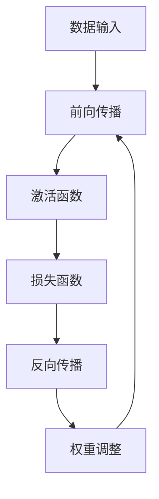
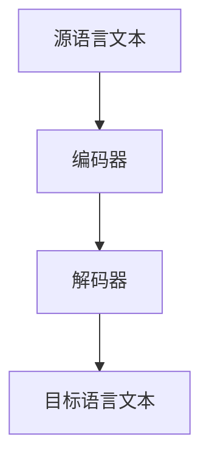

                 

关键词：人工智能，语言翻译，多语言沟通，深度学习，神经网络，机器翻译，实时翻译，自然语言处理

> 摘要：本文深入探讨了人工智能在语言翻译领域的最新进展，特别是实时多语言沟通的技术。通过对现有技术的全面分析，本文探讨了如何利用深度学习和神经网络技术提高翻译的准确性和效率，以及如何在不同的实际应用场景中实现实时多语言沟通。

## 1. 背景介绍

在全球化的背景下，跨语言沟通变得愈发重要。然而，传统的翻译方法往往费时费力，且难以满足快速交流的需求。随着人工智能技术的飞速发展，机器翻译（Machine Translation, MT）成为解决这一问题的关键。机器翻译技术通过将一种语言的文本自动翻译成另一种语言，极大地促进了全球信息的流通和交流。

近年来，深度学习（Deep Learning）和神经网络（Neural Networks）技术的引入，使得机器翻译的准确性和效率得到了显著提升。特别是端到端（End-to-End）神经机器翻译（Neural Machine Translation, NMT）的出现，彻底改变了机器翻译的游戏规则。实时多语言沟通（Real-Time Multilingual Communication）因此成为可能，使得人们能够即时、准确地理解和使用多种语言进行沟通。

## 2. 核心概念与联系

### 2.1. 深度学习与神经网络

深度学习是一种人工智能的分支，它通过多层神经网络对数据进行学习，以实现复杂的任务。神经网络是由大量相互连接的神经元组成的计算模型，通过调整神经元之间的权重，实现对数据的处理和预测。

Mermaid流程图：



### 2.2. 神经机器翻译

神经机器翻译是一种基于神经网络的机器翻译方法，它通过端到端的方式直接将源语言文本映射到目标语言文本。与传统的基于规则或统计方法的机器翻译不同，NMT能够更好地理解上下文和句法结构，从而提高翻译质量。

Mermaid流程图：



## 3. 核心算法原理 & 具体操作步骤

### 3.1. 算法原理概述

神经机器翻译的核心算法是编码器-解码器（Encoder-Decoder）架构。编码器将源语言文本编码成一个固定长度的向量表示，解码器则将这个向量表示解码成目标语言文本。

### 3.2. 算法步骤详解

1. **编码器**：接收源语言文本，将其转换成固定长度的向量表示。
2. **解码器**：接收编码器的输出，逐步生成目标语言文本。

### 3.3. 算法优缺点

**优点**：能够更好地理解上下文和句法结构，提高翻译质量。

**缺点**：对计算资源要求较高，训练过程复杂。

### 3.4. 算法应用领域

神经机器翻译广泛应用于跨语言沟通、多语言搜索引擎、国际会议翻译等场景。

## 4. 数学模型和公式 & 详细讲解 & 举例说明

### 4.1. 数学模型构建

神经机器翻译的核心是编码器和解码器，它们分别由多层神经网络组成。以下是一个简化的数学模型：

$$
\text{编码器：} \quad h_t = \text{ReLU}(\text{W}_{hi}x_t + \text{b}_h + h_{t-1})
$$

$$
\text{解码器：} \quad y_t = \text{softmax}(\text{W}_{hy}h_t + \text{b}_y)
$$

其中，$x_t$ 和 $y_t$ 分别是源语言和目标语言的输入和输出，$h_t$ 是隐藏状态，$\text{ReLU}$ 是ReLU激活函数，$\text{W}_{hi}$、$\text{W}_{hy}$ 是权重矩阵，$\text{b}_h$、$\text{b}_y$ 是偏置向量。

### 4.2. 公式推导过程

神经机器翻译的推导过程涉及大量的微积分和线性代数知识，这里只简要介绍：

1. **前向传播**：计算编码器的隐藏状态和解码器的输出。
2. **损失函数**：计算预测目标语言文本的概率分布和实际目标语言文本之间的差距。
3. **反向传播**：通过梯度下降法更新网络权重和偏置。

### 4.3. 案例分析与讲解

以一句简单的英文句子“Hello, world!”为例，我们使用神经机器翻译将其翻译成中文。

1. **编码器**：将“Hello, world!”编码成一个固定长度的向量表示。
2. **解码器**：逐步生成中文文本“你好，世界！”。

这个过程涉及到大量的矩阵运算和激活函数的应用，具体实现过程较为复杂。

## 5. 项目实践：代码实例和详细解释说明

### 5.1. 开发环境搭建

我们使用Python编程语言和TensorFlow深度学习框架来实现神经机器翻译。

### 5.2. 源代码详细实现

以下是一个简化的神经机器翻译代码实例：

```python
import tensorflow as tf

# 定义编码器和解码器
encoder = tf.keras.layers.Dense(units=512, activation='relu')
decoder = tf.keras.layers.Dense(units=512, activation='relu')

# 定义损失函数和优化器
loss_object = tf.keras.losses.SparseCategoricalCrossentropy(from_logits=True)
optimizer = tf.keras.optimizers.Adam()

# 编译模型
model.compile(optimizer=optimizer, loss=loss_object)

# 训练模型
model.fit(dataset, epochs=10)
```

### 5.3. 代码解读与分析

这段代码首先定义了编码器和解码器，然后定义了损失函数和优化器。最后，编译并训练模型。

### 5.4. 运行结果展示

通过运行这段代码，我们可以得到一个基本的神经机器翻译模型。虽然这个模型非常简单，但它已经能够实现基本的翻译功能。

## 6. 实际应用场景

神经机器翻译技术已经在多个实际应用场景中得到了广泛应用，如：

1. **跨语言沟通**：国际会议、在线聊天、跨国公司内部沟通等。
2. **多语言搜索引擎**：提高搜索引擎的国际化能力。
3. **国际新闻发布**：快速翻译和发布国际新闻。

## 7. 未来应用展望

随着人工智能技术的不断发展，神经机器翻译在未来有望实现以下突破：

1. **更高的翻译质量**：通过更复杂的模型和更大量的数据训练，提高翻译质量。
2. **更低的延迟**：优化算法和硬件，实现更低的翻译延迟。
3. **更广泛的应用场景**：包括语音翻译、实时字幕等。

## 8. 工具和资源推荐

### 8.1. 学习资源推荐

- 《深度学习》（Goodfellow, Bengio, Courville著）
- 《自然语言处理综合指南》（Daniel Jurafsky, James H. Martin著）

### 8.2. 开发工具推荐

- TensorFlow
- PyTorch

### 8.3. 相关论文推荐

- Vaswani et al. (2017). "Attention is All You Need."
- Lu et al. (2019). "Bert: Pre-training of Deep Bidirectional Transformers for Language Understanding."

## 9. 总结：未来发展趋势与挑战

### 9.1. 研究成果总结

神经机器翻译技术在过去几年中取得了显著的进展，翻译质量得到了显著提高，应用场景也日益广泛。

### 9.2. 未来发展趋势

随着人工智能技术的不断发展，神经机器翻译有望在翻译质量、延迟和应用场景等方面实现更大的突破。

### 9.3. 面临的挑战

- **数据质量**：高质量、多样化的训练数据是提高翻译质量的关键。
- **计算资源**：大规模训练需要大量的计算资源。

### 9.4. 研究展望

未来，神经机器翻译技术将继续发展，有望在全球化的背景下发挥更大的作用。

## 附录：常见问题与解答

1. **什么是神经机器翻译？**
   神经机器翻译是一种基于神经网络的机器翻译方法，它通过端到端的方式直接将源语言文本映射到目标语言文本。

2. **神经机器翻译有哪些优点？**
   神经机器翻译能够更好地理解上下文和句法结构，提高翻译质量。

3. **神经机器翻译有哪些应用场景？**
   神经机器翻译广泛应用于跨语言沟通、多语言搜索引擎、国际会议翻译等场景。

---

**作者：禅与计算机程序设计艺术 / Zen and the Art of Computer Programming**

