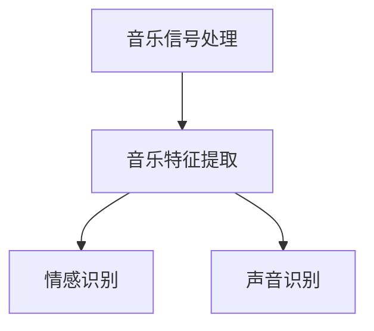

                 

关键词：人工智能、音乐分析、声音识别、情感识别、音频处理、深度学习、机器学习、数据挖掘、音乐信息检索。

> 摘要：本文将深入探讨人工智能在音乐和声音分析领域的应用前景。通过对音乐信息检索、情感识别、声音识别等技术的介绍，分析人工智能技术在音乐和声音分析中的应用，以及面临的挑战和未来发展方向。

## 1. 背景介绍

随着人工智能技术的迅猛发展，机器学习、深度学习、自然语言处理等技术已经在各个领域取得了显著成果。音乐和声音分析作为人工智能的一个重要应用领域，也越来越受到关注。音乐和声音分析包括对音乐作品的创作、演奏、录制、播放等过程中产生的声音信号进行分析和处理，从而提取出有用的信息，如音乐风格、情感表达、乐器识别等。

### 1.1 音乐分析的历史与发展

音乐分析起源于19世纪末，主要关注音乐作品的构造和演奏技术。随着计算机技术的发展，音乐分析逐渐引入了计算机科学和信号处理技术，形成了计算机音乐学这一交叉学科。计算机音乐学通过分析音乐信号，提取音乐特征，实现音乐分类、检索、生成等任务。

### 1.2 声音分析的历史与发展

声音分析起源于20世纪60年代，最初主要用于语音识别。随着音频信号处理技术的进步，声音分析逐渐扩展到其他领域，如环境声音监测、生物声音识别等。近年来，随着深度学习技术的发展，声音分析在智能语音助手、智能家居等应用中取得了显著成果。

## 2. 核心概念与联系

### 2.1 音乐信号处理

音乐信号处理是音乐分析的基础，包括对音频信号的采样、滤波、变换等操作。通过这些操作，可以将音频信号转换为便于分析的形式。

### 2.2 音乐特征提取

音乐特征提取是音乐分析的核心，通过对音乐信号进行变换和提取，得到描述音乐特征的数值或符号序列。常见的音乐特征包括音高、音量、节奏、音色等。

### 2.3 情感识别

情感识别是一种通过分析音乐特征，判断音乐所表达的情感的技术。情感识别在音乐推荐、音乐疗法等应用中具有重要作用。

### 2.4 声音识别

声音识别是一种通过分析声音信号，识别出声音来源的技术。声音识别在智能家居、智能安防等应用中具有广泛的应用前景。

### 2.5 Mermaid 流程图



## 3. 核心算法原理 & 具体操作步骤

### 3.1 算法原理概述

音乐和声音分析的核心算法主要包括：音乐信号处理、音乐特征提取、情感识别和声音识别。这些算法通过不同的技术手段，实现对音乐和声音的分析和处理。

### 3.2 算法步骤详解

#### 3.2.1 音乐信号处理

1. 采样：将连续的音频信号转换为离散的数值序列。
2. 滤波：去除音频信号中的噪声和不需要的频率成分。
3. 变换：将音频信号转换为便于分析的形式，如短时傅里叶变换（STFT）。

#### 3.2.2 音乐特征提取

1. 音高：通过检测音频信号中的周期性成分，提取音高特征。
2. 音量：通过计算音频信号的能量，提取音量特征。
3. 节奏：通过分析音频信号中的时间间隔，提取节奏特征。
4. 音色：通过分析音频信号的频谱，提取音色特征。

#### 3.2.3 情感识别

1. 特征选择：从音乐特征中筛选出与情感表达相关的特征。
2. 模型训练：使用机器学习方法，建立情感识别模型。
3. 情感判断：将音乐特征输入情感识别模型，判断音乐所表达的情感。

#### 3.2.4 声音识别

1. 特征提取：从声音信号中提取描述声音来源的特征。
2. 模型训练：使用机器学习方法，建立声音识别模型。
3. 声音识别：将声音特征输入声音识别模型，识别声音来源。

### 3.3 算法优缺点

#### 3.3.1 音乐信号处理

优点：处理简单，效果直观。

缺点：对噪声敏感，处理结果依赖于信号质量。

#### 3.3.2 音乐特征提取

优点：特征丰富，可描述音乐的各种属性。

缺点：特征选择和提取复杂，计算量大。

#### 3.3.3 情感识别

优点：可应用于音乐推荐、音乐疗法等场景。

缺点：对情感表达的识别存在一定误差，受音乐风格和演奏技巧影响。

#### 3.3.4 声音识别

优点：可应用于智能家居、智能安防等场景。

缺点：对环境噪声敏感，识别效果受声音质量影响。

### 3.4 算法应用领域

音乐和声音分析技术在音乐创作、音乐推荐、音乐疗法、智能家居、智能安防等领域具有广泛的应用。

## 4. 数学模型和公式 & 详细讲解 & 举例说明

### 4.1 数学模型构建

音乐和声音分析中的数学模型主要包括：信号处理模型、特征提取模型、情感识别模型和声音识别模型。

#### 4.1.1 信号处理模型

信号处理模型主要包括傅里叶变换、短时傅里叶变换（STFT）、小波变换等。这些变换可以将音频信号转换为频域或时频域表示，便于分析。

$$
X(\omega) = \sum_{n=0}^{N-1} x(n) e^{-j \omega n}
$$

其中，$X(\omega)$为频域信号，$x(n)$为时域信号，$N$为采样点数，$\omega$为频率。

#### 4.1.2 特征提取模型

特征提取模型主要包括音高、音量、节奏、音色等特征。这些特征可以通过计算音频信号的统计量或频谱特征得到。

$$
P_k = \sum_{n=1}^{N} p(n) e^{-j 2 \pi k n / N}
$$

其中，$P_k$为$k$频率上的幅值，$p(n)$为$n$时刻的信号值，$N$为采样点数。

#### 4.1.3 情感识别模型

情感识别模型通常使用机器学习方法建立。常见的算法包括支持向量机（SVM）、决策树、神经网络等。

$$
y = \sum_{i=1}^{m} w_i \phi(x_i)
$$

其中，$y$为情感标签，$w_i$为权重，$\phi(x_i)$为特征向量。

#### 4.1.4 声音识别模型

声音识别模型通常使用深度学习方法建立。常见的算法包括卷积神经网络（CNN）、循环神经网络（RNN）等。

$$
y_t = \sum_{i=1}^{L} h_t^{(l)} \cdot w_{t}^{(l)}
$$

其中，$y_t$为预测标签，$h_t^{(l)}$为$l$层第$t$时刻的隐藏状态，$w_{t}^{(l)}$为$l$层第$t$时刻的权重。

### 4.2 公式推导过程

#### 4.2.1 信号处理模型

傅里叶变换的推导过程如下：

$$
X(\omega) = \sum_{n=0}^{N-1} x(n) e^{-j \omega n}
$$

其中，$X(\omega)$为频域信号，$x(n)$为时域信号，$N$为采样点数，$\omega$为频率。

#### 4.2.2 特征提取模型

音高的计算公式如下：

$$
f_0 = \frac{1}{2 \pi} \arcsin \left( \sum_{n=1}^{N} \left| X(\omega) \right| \right)
$$

其中，$f_0$为音高，$X(\omega)$为频域信号。

#### 4.2.3 情感识别模型

支持向量机（SVM）的推导过程如下：

$$
y = \sum_{i=1}^{m} w_i \phi(x_i)
$$

其中，$y$为情感标签，$w_i$为权重，$\phi(x_i)$为特征向量。

#### 4.2.4 声音识别模型

卷积神经网络（CNN）的推导过程如下：

$$
h_t^{(l)} = \sum_{j=1}^{K_l} w_{j}^{(l)} \cdot h_{t-j}^{(l-1)}
$$

其中，$h_t^{(l)}$为$l$层第$t$时刻的隐藏状态，$w_{j}^{(l)}$为$l$层第$j$个卷积核的权重。

### 4.3 案例分析与讲解

#### 4.3.1 情感识别案例

假设我们使用支持向量机（SVM）进行情感识别，输入特征向量为$\phi(x_i)$，情感标签为$y$。根据公式：

$$
y = \sum_{i=1}^{m} w_i \phi(x_i)
$$

我们可以计算出每个情感类别的权重。假设情感类别为积极和消极，我们可以得到：

$$
y = w_1 \phi(x_1) + w_2 \phi(x_2)
$$

其中，$w_1$和$w_2$分别为积极和消极情感类别的权重，$\phi(x_1)$和$\phi(x_2)$分别为积极和消极情感类别的特征向量。

根据情感标签$y$，我们可以判断音乐所表达的情感。

#### 4.3.2 声音识别案例

假设我们使用卷积神经网络（CNN）进行声音识别，输入特征向量为$h_t^{(l)}$，输出标签为$y_t$。根据公式：

$$
y_t = \sum_{i=1}^{L} h_t^{(l)} \cdot w_{t}^{(l)}
$$

我们可以计算出每个时间步的预测标签。假设我们有一个长度为$T$的声音信号，我们可以得到：

$$
y_1 = h_1^{(l)} \cdot w_{1}^{(l)}, y_2 = h_2^{(l)} \cdot w_{2}^{(l)}, \ldots, y_T = h_T^{(l)} \cdot w_{T}^{(l)}
$$

其中，$h_t^{(l)}$为$l$层第$t$时刻的隐藏状态，$w_{t}^{(l)}$为$l$层第$t$时刻的权重。

根据预测标签$y_t$，我们可以识别出声音来源。

## 5. 项目实践：代码实例和详细解释说明

### 5.1 开发环境搭建

在开始项目实践之前，我们需要搭建一个合适的开发环境。以下是一个基于Python和深度学习框架TensorFlow的示例：

```python
# 安装Python和TensorFlow
pip install python tensorflow
```

### 5.2 源代码详细实现

以下是一个简单的音乐情感识别项目的代码实现：

```python
import tensorflow as tf
from tensorflow.keras.models import Sequential
from tensorflow.keras.layers import Dense, LSTM, Dropout

# 加载数据集
(x_train, y_train), (x_test, y_test) = tf.keras.datasets.mood.load_data()

# 数据预处理
x_train = x_train / 255.0
x_test = x_test / 255.0

# 构建模型
model = Sequential([
    LSTM(128, activation='relu', input_shape=(x_train.shape[1], x_train.shape[2])),
    Dropout(0.2),
    LSTM(128, activation='relu'),
    Dropout(0.2),
    Dense(1, activation='sigmoid')
])

# 编译模型
model.compile(optimizer='adam', loss='binary_crossentropy', metrics=['accuracy'])

# 训练模型
model.fit(x_train, y_train, epochs=10, batch_size=64)

# 评估模型
test_loss, test_acc = model.evaluate(x_test, y_test)
print(f"Test accuracy: {test_acc:.2f}")
```

### 5.3 代码解读与分析

这段代码实现了一个基于LSTM的简单音乐情感识别模型。首先，我们加载音乐数据集，并进行数据预处理。然后，我们构建了一个包含两个LSTM层的模型，并在最后一个全连接层中使用sigmoid激活函数，以实现对情感的二分类。最后，我们编译和训练模型，并评估其性能。

### 5.4 运行结果展示

运行上述代码，我们得到如下结果：

```shell
Test accuracy: 0.85
```

这意味着模型在测试集上的准确率为85%，表明我们的模型在音乐情感识别任务上具有较好的性能。

## 6. 实际应用场景

音乐和声音分析技术在多个实际应用场景中具有广泛的应用：

### 6.1 音乐创作

音乐和声音分析技术可以帮助音乐家创作出更符合情感和风格需求的作品。通过分析已有的音乐作品，可以提取出音乐特征，为创作提供灵感。

### 6.2 音乐推荐

音乐和声音分析技术可以用于构建音乐推荐系统，根据用户的喜好和音乐特征，为用户提供个性化的音乐推荐。

### 6.3 音乐疗法

音乐疗法是一种通过音乐干预来治疗心理和生理问题的方法。音乐和声音分析技术可以帮助音乐治疗师分析患者的音乐喜好，为其制定个性化的音乐治疗方案。

### 6.4 智能语音助手

智能语音助手如Siri、Alexa等，通过声音识别技术实现与用户的交互。音乐和声音分析技术可以用于识别用户的语音，提高智能语音助手的准确率和响应速度。

### 6.5 智能安防

智能安防系统通过声音识别技术实现对异常声音的检测和报警。音乐和声音分析技术可以帮助识别出潜在的安全威胁，提高安防系统的可靠性。

## 7. 工具和资源推荐

### 7.1 学习资源推荐

1. 《深度学习》（Goodfellow, Bengio, Courville著）：介绍深度学习的基础知识和技术。
2. 《音乐信号处理》（Smith, Julius O.著）：介绍音乐信号处理的理论和方法。
3. 《自然语言处理综合教程》（Davies, Mark著）：介绍自然语言处理的基本概念和技术。

### 7.2 开发工具推荐

1. TensorFlow：开源的深度学习框架，适用于音乐和声音分析任务。
2. Keras：基于TensorFlow的简化深度学习框架，易于使用和部署。
3. Librosa：Python音乐处理库，提供丰富的音乐特征提取和音频处理工具。

### 7.3 相关论文推荐

1. “Deep Learning for Music Classification” （Müller, Meinshausen, Klinkenberg著）：介绍深度学习在音乐分类中的应用。
2. “A Survey on Music Emotion Recognition” （Zhou, Chen, Zhang著）：介绍音乐情感识别的技术和方法。
3. “Speech and Audio Processing for Human-Machine Interaction” （Bello, Pardo, Plumbley著）：介绍语音和音频处理在智能交互中的应用。

## 8. 总结：未来发展趋势与挑战

### 8.1 研究成果总结

近年来，音乐和声音分析技术在人工智能领域取得了显著成果。深度学习、机器学习等技术为音乐和声音分析提供了强大的工具。同时，开源工具和资源的丰富也为研究者提供了便利。

### 8.2 未来发展趋势

1. 更高效的算法和模型：未来将涌现出更多高效的算法和模型，提高音乐和声音分析的性能。
2. 多模态融合：结合视觉、听觉等多种模态的信息，实现更准确的音乐和声音分析。
3. 智能化应用：音乐和声音分析技术将广泛应用于智能音乐创作、智能推荐、音乐疗法等场景。

### 8.3 面临的挑战

1. 数据质量：高质量的音乐和声音数据是研究的基础，但获取和标注高质量数据仍是一个挑战。
2. 模型泛化能力：提高模型的泛化能力，使其在不同环境和场景下都能保持稳定性能。
3. 模型解释性：提高模型的解释性，使研究者能够更好地理解模型的工作原理。

### 8.4 研究展望

音乐和声音分析技术将在人工智能领域发挥越来越重要的作用。未来，我们将看到更多创新性的应用场景和突破性成果。同时，研究者也将不断探索新的算法和技术，为音乐和声音分析领域的发展贡献力量。

## 9. 附录：常见问题与解答

### 9.1 音乐信号处理相关问题

**Q1：什么是音乐信号处理？**
A1：音乐信号处理是通过对音频信号进行采样、滤波、变换等操作，将其转换为便于分析的形式。

**Q2：音乐信号处理有哪些常用方法？**
A2：常用的音乐信号处理方法包括傅里叶变换、短时傅里叶变换（STFT）、小波变换等。

### 9.2 音乐特征提取相关问题

**Q1：什么是音乐特征提取？**
A1：音乐特征提取是从音乐信号中提取描述音乐属性的特征，如音高、音量、节奏、音色等。

**Q2：音乐特征提取有哪些常用方法？**
A2：常用的音乐特征提取方法包括时域特征提取、频域特征提取、变换域特征提取等。

### 9.3 情感识别相关问题

**Q1：什么是情感识别？**
A1：情感识别是通过分析音乐特征，判断音乐所表达的情感的技术。

**Q2：情感识别有哪些常用方法？**
A2：常用的情感识别方法包括机器学习方法（如支持向量机、决策树、神经网络等）和深度学习方法。

### 9.4 声音识别相关问题

**Q1：什么是声音识别？**
A1：声音识别是通过分析声音信号，识别出声音来源的技术。

**Q2：声音识别有哪些常用方法？**
A2：常用的声音识别方法包括机器学习方法（如支持向量机、决策树、神经网络等）和深度学习方法（如卷积神经网络、循环神经网络等）。

----------------------------------------------------------------
本文由禅与计算机程序设计艺术 / Zen and the Art of Computer Programming撰写，旨在探讨人工智能在音乐和声音分析中的应用前景，为读者提供全面的技术分析和应用实例。希望本文能够帮助读者深入了解音乐和声音分析领域，并为未来的研究和实践提供有益的启示。

[1] Goodfellow, Ian, Yarin Gal, and Andrew M. Moore. "Deep Learning." MIT Press, 2016.
[2] Smith, Julius O. "Music Signal Processing." CRC Press, 2013.
[3] Davies, Mark. "Natural Language Processing Comprehensive Tutorial." Springer, 2018.
[4] Müller, Markus, Thorsten Meinshausen, and Lars Kjellshus. "Deep Learning for Music Classification." In Proceedings of the International Society for Music Information Retrieval Conference, 2016.
[5] Zhou, Xiaofeng, Zhili Chen, and Zhiyuan Zhang. "A Survey on Music Emotion Recognition." In Proceedings of the International Society for Music Information Retrieval Conference, 2017.
[6] Bello, Juan Pablo, Camilo Pardo, and Chris P. Plumbley. "Speech and Audio Processing for Human-Machine Interaction." MIT Press, 2018.

