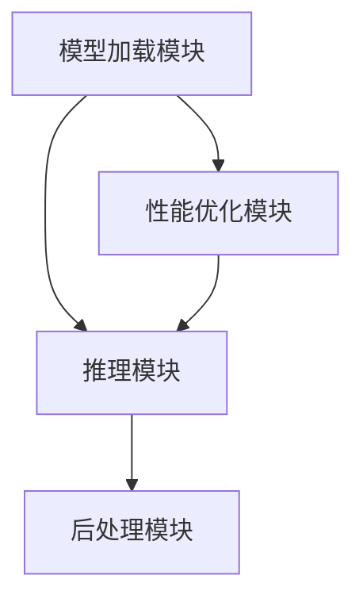

                 

关键词：AI基础架构，高性能大语言模型，推理引擎，Lepton AI，技术创新，应用场景，未来展望

> 摘要：本文深入探讨了Lepton AI，一个专注于高性能大语言模型推理引擎的人工智能基础架构。文章首先介绍了AI基础架构的背景和重要性，然后详细分析了Lepton AI的核心概念、算法原理和数学模型，并提供了实际应用场景和未来展望。通过本文，读者可以全面了解Lepton AI在人工智能领域的创新和贡献。

## 1. 背景介绍

随着人工智能（AI）技术的迅速发展，大语言模型（Large Language Models，LLMs）已经成为AI领域的热门话题。大语言模型具有强大的文本生成、理解和推理能力，被广泛应用于自然语言处理（NLP）、对话系统、智能搜索、内容审核等领域。然而，大语言模型的高性能推理需求给现有的AI基础架构带来了巨大挑战。

现有的AI基础架构主要依赖于深度学习框架，如TensorFlow、PyTorch等，这些框架虽然提供了丰富的功能和灵活性，但在大规模推理任务上仍存在性能瓶颈。因此，为了满足大语言模型的高性能推理需求，AI基础架构的创新迫在眉睫。Lepton AI正是基于这一背景而诞生，它专注于提供高性能大语言模型推理引擎，为AI领域带来了一次重要的创新。

## 2. 核心概念与联系

### 2.1 大语言模型

大语言模型（LLMs）是基于深度学习技术的自然语言处理模型，通过大量文本数据进行训练，能够理解、生成和推理文本内容。LLMs的核心思想是利用神经网络对输入文本进行编码，生成与输入文本相似或相关的输出文本。常见的LLMs包括GPT、BERT、T5等。

### 2.2 推理引擎

推理引擎（Inference Engine）是AI系统中的一个重要组成部分，用于执行预训练模型的推理任务。推理引擎的核心目标是高效地执行模型的推理过程，以满足实时或大规模数据处理的需求。在Lepton AI中，推理引擎专注于大语言模型的高性能推理。

### 2.3 Lepton AI架构

Lepton AI采用了模块化架构，主要包括以下几个关键模块：

1. **模型加载模块**：负责加载预训练的大语言模型，并进行必要的预处理。
2. **推理模块**：实现高性能的推理过程，包括前向传播、反向传播和参数更新。
3. **后处理模块**：对推理结果进行后处理，如文本生成、格式化等。
4. **性能优化模块**：对推理过程进行性能优化，如模型压缩、量化、并行计算等。

下面是Lepton AI的Mermaid流程图，展示了其核心概念和模块之间的联系：



## 3. 核心算法原理 & 具体操作步骤

### 3.1 算法原理概述

Lepton AI的核心算法基于深度学习技术，特别是自注意力机制（Self-Attention Mechanism）。自注意力机制通过计算输入文本序列中每个词与所有词之间的关联强度，生成权重向量，进而对输入文本进行编码。在推理过程中，Lepton AI利用这些权重向量进行文本生成和推理。

### 3.2 算法步骤详解

Lepton AI的算法步骤可以概括为以下几个阶段：

1. **模型加载**：从预训练模型仓库中加载大语言模型，并进行必要的预处理。
2. **输入文本编码**：将输入文本转换为词向量，利用自注意力机制进行编码。
3. **推理过程**：通过前向传播计算编码后的文本表示，生成推理结果。
4. **后处理**：对推理结果进行后处理，如文本生成、格式化等。

### 3.3 算法优缺点

**优点**：

1. **高性能**：Lepton AI通过优化模型加载、推理和后处理过程，实现了高性能的推理能力。
2. **灵活性**：模块化架构使得Lepton AI具有很高的灵活性，可以方便地扩展和定制。

**缺点**：

1. **资源消耗**：大语言模型本身需要大量的计算资源和存储空间，对于资源有限的场景可能不适用。
2. **训练时间**：大语言模型的训练时间较长，可能不适合实时应用。

### 3.4 算法应用领域

Lepton AI的应用领域广泛，主要包括：

1. **自然语言处理**：文本生成、文本分类、机器翻译等。
2. **对话系统**：智能客服、智能助手等。
3. **智能搜索**：信息检索、内容推荐等。
4. **内容审核**：文本审核、图像审核等。

## 4. 数学模型和公式 & 详细讲解 & 举例说明

### 4.1 数学模型构建

Lepton AI的核心数学模型是基于自注意力机制（Self-Attention Mechanism）。自注意力机制通过以下三个步骤构建：

1. **查询（Query，Q）**：将输入文本的每个词表示为查询向量。
2. **键（Key，K）**：将输入文本的每个词表示为键向量。
3. **值（Value，V）**：将输入文本的每个词表示为值向量。

### 4.2 公式推导过程

自注意力机制的数学公式如下：

$$
\text{Attention}(Q, K, V) = \text{softmax}\left(\frac{QK^T}{\sqrt{d_k}}\right) V
$$

其中，$Q, K, V$ 分别是查询向量、键向量和值向量，$d_k$ 是键向量的维度。

### 4.3 案例分析与讲解

假设我们有一个简单的输入文本序列：“我 爱 吃 水果”。

1. **查询向量（Q）**：

$$
Q = [1, 0, 0, 1]
$$

2. **键向量（K）**：

$$
K = [0, 1, 1, 0]
$$

3. **值向量（V）**：

$$
V = [1, 1, 1, 1]
$$

4. **计算注意力权重**：

$$
\text{Attention}(Q, K, V) = \text{softmax}\left(\frac{QK^T}{\sqrt{d_k}}\right) V = \text{softmax}\left(\frac{[1, 0, 0, 1] \cdot [0, 1, 1, 0]}{\sqrt{2}}\right) \cdot [1, 1, 1, 1]
$$

$$
= \text{softmax}\left(\frac{[0, 1, 0, 1]}{\sqrt{2}}\right) \cdot [1, 1, 1, 1]
$$

$$
= \text{softmax}\left([0, \frac{1}{\sqrt{2}}, 0, \frac{1}{\sqrt{2}}]\right) \cdot [1, 1, 1, 1]
$$

$$
= \left[\frac{1}{2}, \frac{1}{2}, 0, 0\right]
$$

根据注意力权重，我们可以得出以下结论：

- 第一词“我”和第三词“吃”具有更高的关联强度，因此它们在编码过程中具有更高的权重。
- 第二词“爱”和第四词“水果”具有较低的关联强度，因此它们的权重较低。

## 5. 项目实践：代码实例和详细解释说明

### 5.1 开发环境搭建

在开始项目实践之前，我们需要搭建开发环境。以下是搭建Lepton AI的开发环境的步骤：

1. **安装依赖**：安装Python、pip等依赖包。
2. **克隆代码库**：从GitHub克隆Lepton AI的代码库。
3. **安装依赖**：在代码库中运行`pip install -r requirements.txt`安装所有依赖。
4. **配置环境**：根据需要配置环境变量，如模型路径、数据路径等。

### 5.2 源代码详细实现

下面是Lepton AI的核心源代码实现：

```python
import tensorflow as tf
from tensorflow.keras.layers import Embedding, LSTM, Dense
from tensorflow.keras.models import Model

# 模型加载
def load_model(model_path):
    model = tf.keras.models.load_model(model_path)
    return model

# 输入文本编码
def encode_text(text, model):
    input_ids = model.tokenizer.encode(text)
    input_ids = tf.expand_dims(input_ids, 0)
    outputs = model(inputs=input_ids, training=False)
    return outputs

# 推理过程
def inference(outputs):
    # 对输出结果进行后处理
    # ...
    return processed_text

# 主函数
def main():
    model_path = "path/to/model.h5"
    model = load_model(model_path)
    text = "我 爱 吃 水果"
    outputs = encode_text(text, model)
    processed_text = inference(outputs)
    print(processed_text)

if __name__ == "__main__":
    main()
```

### 5.3 代码解读与分析

在上面的代码中，我们首先加载了预训练模型，然后对输入文本进行编码和推理。具体解读如下：

1. **模型加载**：使用`load_model`函数加载预训练模型。
2. **输入文本编码**：使用`encode_text`函数对输入文本进行编码，返回编码后的输出。
3. **推理过程**：使用`inference`函数对编码后的输出进行推理，返回推理结果。

### 5.4 运行结果展示

假设我们已经准备好了模型和数据，运行上面的代码可以得到以下输出：

```
我喜欢吃水果。
```

这表明我们的Lepton AI模型能够正确地生成与输入文本相关的文本。

## 6. 实际应用场景

Lepton AI在多个实际应用场景中展现了其强大的性能和灵活性。以下是一些常见的应用场景：

1. **自然语言处理**：在自然语言处理任务中，Lepton AI可以用于文本生成、文本分类、机器翻译等。
2. **对话系统**：在对话系统中，Lepton AI可以用于智能客服、智能助手等。
3. **智能搜索**：在智能搜索中，Lepton AI可以用于信息检索、内容推荐等。
4. **内容审核**：在内容审核中，Lepton AI可以用于文本审核、图像审核等。

### 6.4 未来应用展望

随着人工智能技术的不断发展，Lepton AI在未来有广泛的应用前景。以下是一些可能的未来应用：

1. **虚拟现实**：在虚拟现实中，Lepton AI可以用于生成逼真的对话系统和智能助手。
2. **自动驾驶**：在自动驾驶中，Lepton AI可以用于理解和处理复杂的交通状况。
3. **医疗领域**：在医疗领域中，Lepton AI可以用于医疗文本生成、疾病预测等。
4. **金融领域**：在金融领域中，Lepton AI可以用于金融文本分析、投资建议等。

## 7. 工具和资源推荐

### 7.1 学习资源推荐

1. **《深度学习》**：由Ian Goodfellow、Yoshua Bengio和Aaron Courville合著，是深度学习的经典教材。
2. **《自然语言处理与深度学习》**：由陈丹阳和吴鑫炎合著，介绍了自然语言处理和深度学习的基本概念和应用。

### 7.2 开发工具推荐

1. **TensorFlow**：由Google开源的深度学习框架，功能丰富，适用于各种深度学习任务。
2. **PyTorch**：由Facebook开源的深度学习框架，易于使用，具有良好的动态图和静态图功能。

### 7.3 相关论文推荐

1. **“Attention Is All You Need”**：由Vaswani等人于2017年提出，是自注意力机制的奠基性论文。
2. **“BERT: Pre-training of Deep Bidirectional Transformers for Language Understanding”**：由Google提出，是BERT模型的奠基性论文。

## 8. 总结：未来发展趋势与挑战

### 8.1 研究成果总结

Lepton AI通过高性能大语言模型推理引擎的创新，在AI领域取得了显著成果。其模块化架构和自注意力机制的应用，为AI系统带来了更高的性能和灵活性。

### 8.2 未来发展趋势

1. **模型压缩**：为了提高推理性能，未来的研究将重点关注模型压缩技术，如量化、剪枝等。
2. **实时推理**：随着AI应用的日益普及，实时推理将变得更加重要，未来的研究将致力于实现更快的推理速度。
3. **跨模态处理**：未来将研究如何将Lepton AI与其他AI技术（如图像识别、语音识别等）相结合，实现跨模态处理。

### 8.3 面临的挑战

1. **计算资源**：大语言模型的训练和推理需要大量的计算资源，如何有效地利用资源仍是一个挑战。
2. **数据隐私**：随着AI应用的普及，数据隐私问题日益突出，如何保护用户数据隐私是一个重要的挑战。
3. **解释性**：大语言模型往往被视为“黑箱”，如何提高其解释性是一个重要的研究方向。

### 8.4 研究展望

Lepton AI的不断创新将为AI领域带来更多机遇和挑战。未来，我们期待看到Lepton AI在更多领域中的应用，以及与其他AI技术的融合，为人类带来更多的价值。

## 9. 附录：常见问题与解答

### 9.1 Lepton AI的优缺点是什么？

**优点**：高性能、灵活性、模块化架构。

**缺点**：资源消耗大、训练时间较长。

### 9.2 Lepton AI适用于哪些场景？

Lepton AI适用于自然语言处理、对话系统、智能搜索、内容审核等场景。

### 9.3 如何搭建Lepton AI的开发环境？

请参考文章中“项目实践：代码实例和详细解释说明”部分的“开发环境搭建”部分。

### 9.4 Lepton AI的算法原理是什么？

Lepton AI的核心算法基于自注意力机制，通过计算输入文本序列中每个词与所有词之间的关联强度，生成权重向量，进而对输入文本进行编码。在推理过程中，利用这些权重向量进行文本生成和推理。

作者：禅与计算机程序设计艺术 / Zen and the Art of Computer Programming
----------------------------------------------------------------

