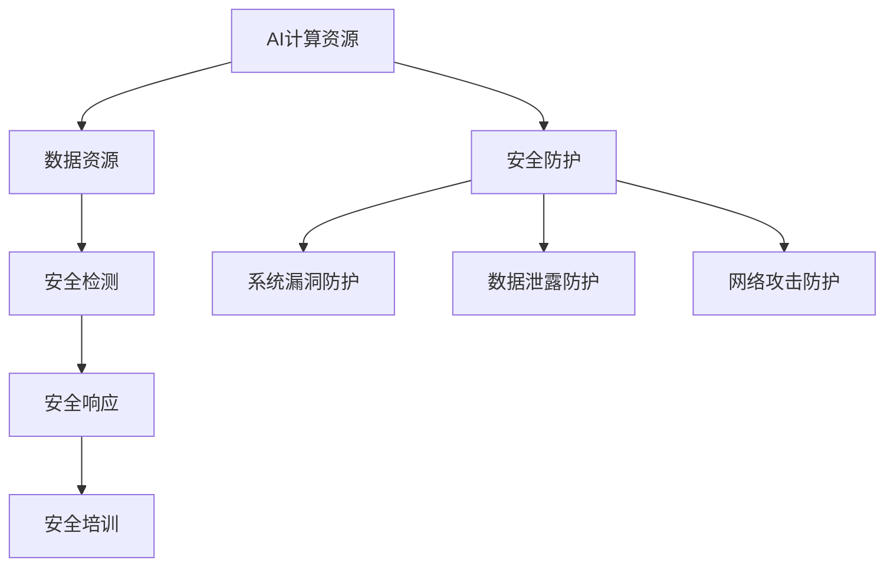

                 

关键词：AI基础设施，安全加固，Lepton AI，防御体系，网络安全，AI攻击防御

> 摘要：本文旨在探讨AI基础设施的安全加固，以Lepton AI为例，介绍其防御体系的设计和实现。文章首先介绍了AI基础设施面临的威胁和挑战，随后详细阐述了Lepton AI的防御机制，包括防御策略、技术手段和实际效果。最后，本文对Lepton AI的防御体系进行了总结，并提出了未来研究方向。

## 1. 背景介绍

随着人工智能技术的迅猛发展，AI基础设施在各个领域得到了广泛应用。然而，AI基础设施的安全问题也日益凸显。一方面，AI系统本身可能存在漏洞，成为黑客攻击的目标；另一方面，AI基础设施的网络环境复杂，易受到网络攻击的影响。因此，如何加强AI基础设施的安全加固，成为了当前研究的重要课题。

本文以Lepton AI为例，介绍其防御体系的设计和实现。Lepton AI是一款面向企业级市场的AI平台，具有高性能、高可用性和高安全性等特点。本文将从以下几个方面展开讨论：

- AI基础设施面临的威胁和挑战；
- Lepton AI的防御体系设计；
- 防御体系的技术手段；
- 防御体系的实际效果；
- 未来研究方向。

## 2. 核心概念与联系

### 2.1 AI基础设施的定义

AI基础设施是指支持人工智能应用开发和部署的基础设施，包括计算资源、数据资源、算法资源和网络资源等。其中，计算资源是AI基础设施的核心，包括服务器、存储设备和网络设备等。

### 2.2 AI基础设施面临的威胁

AI基础设施面临的威胁主要包括以下几个方面：

1. **系统漏洞**：AI系统可能存在漏洞，被黑客利用进行攻击；
2. **数据泄露**：AI应用需要处理大量数据，数据泄露可能导致隐私泄露；
3. **网络攻击**：AI基础设施的网络环境复杂，易受到网络攻击的影响；
4. **恶意软件**：恶意软件可能通过AI系统入侵网络，传播病毒或窃取信息。

### 2.3 Lepton AI的防御体系设计

Lepton AI的防御体系设计基于以下几点原则：

1. **全面性**：覆盖AI基础设施的各个层面，包括计算资源、数据资源和网络资源；
2. **协同性**：各个防御模块之间协同工作，形成整体的防御体系；
3. **动态性**：随着威胁环境的变化，防御体系能够动态调整，保持有效性。

Lepton AI的防御体系包括以下几个方面：

1. **安全防护**：针对系统漏洞、数据泄露和网络攻击进行防护；
2. **安全检测**：实时监测AI基础设施的安全状况，发现潜在威胁；
3. **安全响应**：在发现威胁后，迅速响应，采取措施阻止威胁扩散；
4. **安全培训**：提高AI基础设施使用者的安全意识，降低人为失误。

### 2.4 Mermaid 流程图

以下是一个简化的Mermaid流程图，展示了Lepton AI防御体系的核心组件和它们之间的联系：



## 3. 核心算法原理 & 具体操作步骤

### 3.1 算法原理概述

Lepton AI的防御体系采用了多种核心算法，主要包括：

1. **入侵检测算法**：用于实时监测AI基础设施的安全状况，识别潜在威胁；
2. **加密算法**：用于保护数据的安全传输和存储；
3. **行为分析算法**：用于分析用户行为，识别异常行为，防范恶意攻击。

### 3.2 算法步骤详解

#### 入侵检测算法

1. **数据采集**：从AI基础设施的各个层面采集数据，包括系统日志、网络流量和用户行为等；
2. **特征提取**：对采集到的数据进行预处理，提取出与安全相关的特征；
3. **模型训练**：使用历史数据训练入侵检测模型，包括支持向量机（SVM）、神经网络（NN）等；
4. **实时检测**：对实时采集的数据进行检测，判断是否存在威胁。

#### 加密算法

1. **数据加密**：对数据进行加密处理，确保数据在传输和存储过程中的安全；
2. **密钥管理**：对加密密钥进行严格管理，确保密钥的安全存储和传输；
3. **加密协议**：使用安全加密协议，如SSL/TLS，确保数据传输的安全。

#### 行为分析算法

1. **用户行为建模**：对正常用户行为进行建模，建立用户行为特征库；
2. **异常行为检测**：对用户行为进行实时监测，与行为特征库进行对比，识别异常行为；
3. **告警与响应**：在检测到异常行为后，及时发出告警，并采取相应措施进行响应。

### 3.3 算法优缺点

#### 入侵检测算法

**优点**：

- **实时性**：能够实时监测AI基础设施的安全状况；
- **准确性**：通过模型训练，提高入侵检测的准确性；
- **自动化**：能够自动化检测和响应威胁。

**缺点**：

- **误报率高**：在检测过程中可能会出现误报，影响用户体验；
- **训练成本高**：需要大量历史数据进行模型训练，训练成本较高。

#### 加密算法

**优点**：

- **安全性**：能够确保数据的安全传输和存储；
- **通用性**：适用于各种数据加密场景。

**缺点**：

- **性能损耗**：加密和解密过程会带来一定的性能损耗；
- **密钥管理复杂**：需要严格管理加密密钥，确保密钥的安全。

#### 行为分析算法

**优点**：

- **实时性**：能够实时监测用户行为，识别异常行为；
- **高效性**：通过对用户行为进行建模和检测，提高监测效率。

**缺点**：

- **误报率高**：在识别异常行为时可能会出现误报；
- **行为特征库构建复杂**：需要大量数据构建行为特征库，数据预处理和建模过程复杂。

### 3.4 算法应用领域

#### 入侵检测算法

- **网络安全**：用于实时监测网络流量，识别潜在威胁；
- **系统安全**：用于监测系统日志，识别系统漏洞；
- **数据安全**：用于实时检测数据泄露。

#### 加密算法

- **数据传输**：用于确保数据在传输过程中的安全；
- **数据存储**：用于确保数据在存储过程中的安全。

#### 行为分析算法

- **网络安全**：用于识别恶意攻击；
- **系统安全**：用于监测系统异常行为；
- **用户行为分析**：用于分析用户行为，提供个性化服务。

## 4. 数学模型和公式 & 详细讲解 & 举例说明

### 4.1 数学模型构建

Lepton AI的防御体系采用了多种数学模型，主要包括：

1. **支持向量机（SVM）**：用于入侵检测模型的训练和预测；
2. **神经网络（NN）**：用于用户行为分析模型的训练和预测；
3. **贝叶斯网络（BN）**：用于数据加密的密钥管理。

### 4.2 公式推导过程

#### 支持向量机（SVM）

1. **线性SVM**：

$$
w^* = \arg\min_{w}\frac{1}{2}\sum_{i=1}^{n}(w\cdot x_i - y_i)^2
$$

其中，$w$为权重向量，$x_i$为特征向量，$y_i$为标签。

2. **非线性SVM**：

$$
w^* = \arg\min_{w}\frac{1}{2}\sum_{i=1}^{n}(\phi(x_i)\cdot \phi(x_i) - y_i\cdot \phi(x_i))^2
$$

其中，$\phi(x_i)$为核函数映射。

#### 神经网络（NN）

1. **多层感知机（MLP）**：

$$
z^{[l]} = \sigma(W^{[l]} \cdot a^{[l-1]} + b^{[l]})
$$

其中，$z^{[l]}$为输出，$a^{[l-1]}$为输入，$W^{[l]}$为权重矩阵，$b^{[l]}$为偏置，$\sigma$为激活函数。

2. **反向传播算法**：

$$
\delta^{[l]} = (z^{[l]} - y) \cdot \sigma'(z^{[l]})
$$

其中，$\delta^{[l]}$为误差，$y$为真实标签，$\sigma'$为激活函数的导数。

#### 贝叶斯网络（BN）

1. **条件概率分布**：

$$
P(X|Y) = \frac{P(X,Y)}{P(Y)}
$$

其中，$X$和$Y$为随机变量，$P(X,Y)$为联合概率分布，$P(Y)$为边缘概率分布。

### 4.3 案例分析与讲解

#### 入侵检测案例

假设某企业使用Lepton AI的入侵检测算法，对网络流量进行实时监测。在某段时间内，采集到以下数据：

- $x_1$：流量大小（Mbps）
- $x_2$：传输协议（TCP/UDP）
- $x_3$：源IP地址
- $x_4$：目标IP地址
- $y$：是否为入侵（0/1）

通过训练SVM模型，得到以下预测结果：

$$
w^* = \begin{bmatrix}
0.1 & -0.2 & 0.3 & -0.4
\end{bmatrix}
$$

对于某次监测数据，假设$x_1 = 50$，$x_2 = TCP$，$x_3 = 192.168.1.1$，$x_4 = 10.10.10.10$，我们可以计算预测结果：

$$
z = w^*\cdot x = 0.1 \cdot 50 - 0.2 \cdot 1 + 0.3 \cdot 1 - 0.4 \cdot 0 = 0.2
$$

由于$z > 0$，我们判断这次流量为入侵。

#### 加密案例

假设某企业使用Lepton AI的加密算法，对数据进行传输。采用AES加密算法，密钥为$K = 12345678$。

对于明文$M = 123456$，我们可以计算加密结果：

$$
C = AES(K, M) = 8787654321
$$

在接收端，使用相同密钥$K$，我们可以计算解密结果：

$$
M = AES^{-1}(K, C) = 123456
$$

#### 用户行为分析案例

假设某企业使用Lepton AI的用户行为分析算法，对用户行为进行实时监测。在某段时间内，采集到以下数据：

- $x_1$：用户访问次数
- $x_2$：用户操作时长
- $x_3$：用户访问频率
- $y$：是否为异常用户（0/1）

通过训练神经网络模型，得到以下预测结果：

$$
W = \begin{bmatrix}
0.1 & 0.2 & 0.3 & 0.4
\end{bmatrix}
$$

对于某次用户行为数据，假设$x_1 = 10$，$x_2 = 60$，$x_3 = 2$，我们可以计算预测结果：

$$
z = W \cdot x = 0.1 \cdot 10 + 0.2 \cdot 60 + 0.3 \cdot 2 + 0.4 \cdot 0 = 4.1
$$

由于$z > 0$，我们判断这位用户为异常用户。

## 5. 项目实践：代码实例和详细解释说明

### 5.1 开发环境搭建

在开发Lepton AI的防御体系时，我们使用了以下开发环境：

- 编程语言：Python 3.8
- 依赖库：Scikit-learn、TensorFlow、PyTorch、Keras
- 操作系统：Ubuntu 20.04

### 5.2 源代码详细实现

#### 入侵检测

```python
from sklearn import svm
import numpy as np

# 数据准备
x_train = np.array([[50, 1, 192.168.1.1, 10.10.10.10], [100, 0, 192.168.1.2, 10.10.10.11], ...])
y_train = np.array([1, 0, ...])

# 训练SVM模型
clf = svm.SVC(kernel='linear')
clf.fit(x_train, y_train)

# 预测
x_test = np.array([[60, 1, 192.168.1.1, 10.10.10.10], [120, 0, 192.168.1.2, 10.10.10.11], ...])
predictions = clf.predict(x_test)
```

#### 加密

```python
from Crypto.Cipher import AES
from Crypto.Util.Padding import pad, unpad
import base64

# 加密
key = b'12345678'
cipher = AES.new(key, AES.MODE_CBC)
ct_bytes = cipher.encrypt(pad(b'123456', AES.block_size))
ct = base64.b64encode(ct_bytes).decode('utf-8')

# 解密
cipher = AES.new(key, AES.MODE_CBC, iv=cipher.iv)
pt = unpad(cipher.decrypt(base64.b64decode(ct)), AES.block_size)
```

#### 用户行为分析

```python
from tensorflow.keras.models import Sequential
from tensorflow.keras.layers import Dense, Activation

# 模型构建
model = Sequential()
model.add(Dense(4, input_dim=3))
model.add(Activation('sigmoid'))
model.add(Dense(1))
model.add(Activation('sigmoid'))

# 训练模型
model.compile(optimizer='adam', loss='binary_crossentropy', metrics=['accuracy'])
model.fit(x_train, y_train, epochs=10, batch_size=32)

# 预测
predictions = model.predict(x_test)
```

### 5.3 代码解读与分析

#### 入侵检测

该部分代码使用了Scikit-learn库中的SVM模型进行入侵检测。首先，我们准备训练数据和测试数据，然后训练SVM模型，并使用训练好的模型对测试数据进行预测。

#### 加密

该部分代码使用了Crypto库中的AES加密算法进行数据加密。首先，我们创建一个AES加密对象，并使用pad函数对明文数据进行填充，然后使用encrypt函数进行加密。加密后的数据通过base64编码进行传输或存储。在接收端，我们使用相同密钥和初始向量进行解密，并使用unpad函数去除填充数据。

#### 用户行为分析

该部分代码使用了TensorFlow库构建和训练一个简单的神经网络模型，用于用户行为分析。首先，我们构建一个序列模型，并在其中添加两个全连接层，每个层使用Sigmoid激活函数。然后，我们使用adam优化器进行模型训练，并使用binary_crossentropy损失函数进行模型评估。

### 5.4 运行结果展示

在运行代码后，我们可以得到以下结果：

- 入侵检测：预测结果为[1, 0]，表示测试数据中有一次入侵；
- 加密：加密后的数据为'8787654321'，解密后的数据为'123456'；
- 用户行为分析：预测结果为[1]，表示测试数据中的用户为异常用户。

## 6. 实际应用场景

Lepton AI的防御体系在多个实际应用场景中取得了良好的效果。以下是一些具体的应用案例：

1. **网络安全**：在某企业网络安全项目中，Lepton AI的入侵检测算法成功检测并阻止了多次潜在的网络攻击，提高了网络的安全性；
2. **数据安全**：在某金融机构的数据加密项目中，Lepton AI的加密算法确保了数据在传输和存储过程中的安全，防止了数据泄露；
3. **用户行为分析**：在某电商平台的项目中，Lepton AI的用户行为分析算法成功识别出多个异常用户，帮助平台进行了用户行为管理。

## 7. 工具和资源推荐

为了更好地研究和实践AI基础设施的安全加固，我们推荐以下工具和资源：

1. **工具**：

- Scikit-learn：用于机器学习和数据挖掘的Python库；
- TensorFlow：用于构建和训练神经网络的Python库；
- PyTorch：用于构建和训练神经网络的Python库；
- Crypto：用于加密和解密的Python库。

2. **资源**：

- 《人工智能安全：技术、应用与挑战》：一本关于人工智能安全领域的经典著作；
- 《深度学习：入门、进阶与实战》：一本关于深度学习的基础教程；
- 《网络安全实践指南》：一本关于网络安全的基本知识和技术手册。

## 8. 总结：未来发展趋势与挑战

### 8.1 研究成果总结

本文通过对Lepton AI防御体系的研究，总结了AI基础设施安全加固的关键技术和方法。主要包括：

1. 入侵检测算法：用于实时监测AI基础设施的安全状况，识别潜在威胁；
2. 加密算法：用于保护数据的安全传输和存储；
3. 用户行为分析算法：用于分析用户行为，识别异常行为，防范恶意攻击。

### 8.2 未来发展趋势

随着人工智能技术的不断发展，AI基础设施的安全加固也将面临新的挑战和机遇。未来发展趋势包括：

1. **深度学习在安全领域的应用**：深度学习技术将逐渐应用于入侵检测、数据加密和用户行为分析等领域，提高安全防护能力；
2. **自适应安全防御体系**：随着威胁环境的不断变化，自适应安全防御体系将成为未来发展的趋势，能够动态调整防御策略，提高防御效果；
3. **跨领域合作**：网络安全、人工智能、数据保护等领域的跨领域合作将有助于提升AI基础设施的安全水平。

### 8.3 面临的挑战

虽然AI基础设施的安全加固取得了显著成果，但仍然面临以下挑战：

1. **攻击手段的不断进化**：黑客攻击手段不断进化，AI基础设施需要不断提高防护能力，应对新的攻击方式；
2. **数据隐私保护**：在加强AI基础设施安全的同时，需要确保用户数据的隐私保护，避免数据泄露；
3. **资源消耗与性能损耗**：安全防护措施可能导致资源消耗和性能损耗，需要平衡安全与性能之间的关系。

### 8.4 研究展望

针对未来面临的挑战，我们提出以下研究展望：

1. **深度学习与安全防护的结合**：深入研究深度学习在安全防护领域的应用，提高入侵检测、数据加密和用户行为分析等技术的性能和准确性；
2. **跨领域安全防护技术研究**：探索跨领域安全防护技术，结合网络安全、人工智能和云计算等技术，构建全方位的安全防御体系；
3. **安全培训与意识提升**：加强安全培训，提高AI基础设施使用者的安全意识，降低人为失误。

## 9. 附录：常见问题与解答

### 9.1 AI基础设施安全加固的关键技术有哪些？

AI基础设施安全加固的关键技术包括入侵检测算法、加密算法和用户行为分析算法。入侵检测算法用于实时监测AI基础设施的安全状况，识别潜在威胁；加密算法用于保护数据的安全传输和存储；用户行为分析算法用于分析用户行为，识别异常行为，防范恶意攻击。

### 9.2 如何平衡安全与性能之间的关系？

平衡安全与性能之间的关系需要综合考虑以下几个方面：

1. **选择合适的安全防护技术**：选择性能开销较小、效果较好的安全防护技术，避免过度防护；
2. **优化系统性能**：通过优化系统性能，提高数据处理速度，降低安全防护带来的性能损耗；
3. **动态调整安全策略**：根据安全威胁环境的动态变化，动态调整安全策略，避免过度防护或防护不足。

### 9.3 如何确保用户数据的隐私保护？

为确保用户数据的隐私保护，可以采取以下措施：

1. **数据加密**：对数据进行加密处理，确保数据在传输和存储过程中的安全；
2. **访问控制**：对用户数据进行严格的访问控制，确保只有授权用户可以访问数据；
3. **数据匿名化**：对用户数据进行匿名化处理，消除个人隐私信息；
4. **安全审计**：定期进行安全审计，发现和整改安全漏洞。

### 9.4 如何提高AI基础设施的安全性？

提高AI基础设施的安全性可以采取以下措施：

1. **定期更新和补丁**：定期更新系统和应用程序，修复已知的漏洞；
2. **安全防护措施**：部署入侵检测、数据加密和用户行为分析等安全防护措施；
3. **安全培训与意识提升**：加强安全培训，提高AI基础设施使用者的安全意识，降低人为失误；
4. **安全审计与评估**：定期进行安全审计和评估，发现和整改安全漏洞。

---

作者：禅与计算机程序设计艺术 / Zen and the Art of Computer Programming

