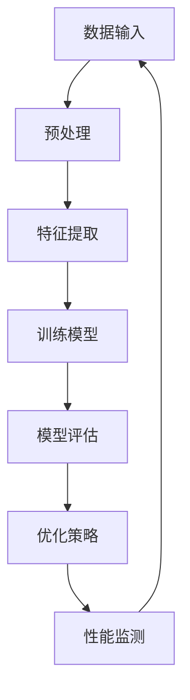
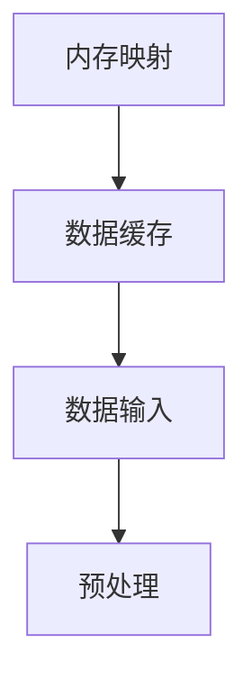
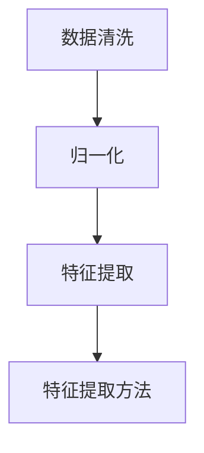
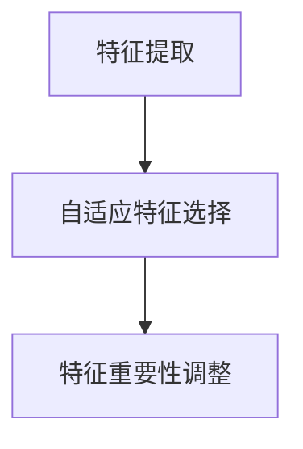
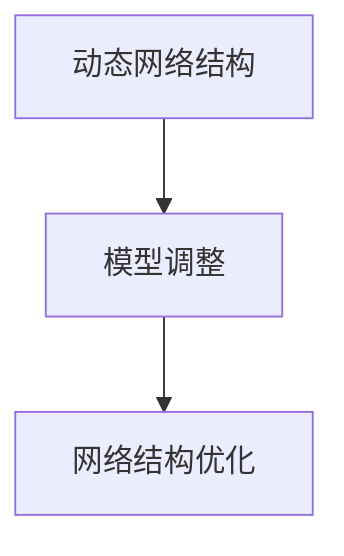
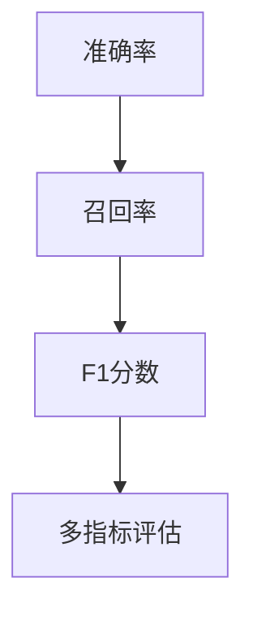
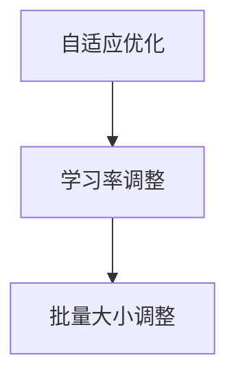
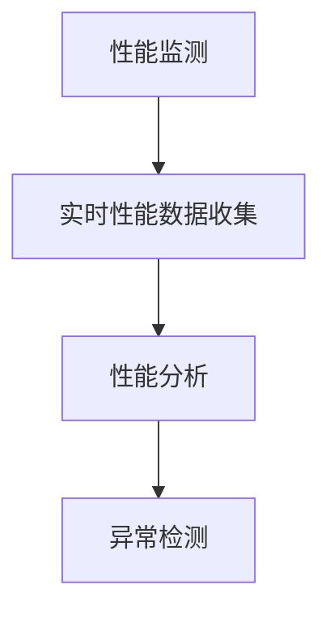

                 

 关键词：AI基础设施，性能优化，Lepton AI，技术突破，算法，数学模型，项目实践，应用场景

> 摘要：本文将深入探讨Lepton AI在AI基础设施性能优化方面的技术突破，分析其核心算法原理、数学模型和实际应用。通过详细的代码实例和运行结果展示，我们将揭示Lepton AI在提升AI性能方面的独到之处，并对未来发展趋势和挑战进行展望。

## 1. 背景介绍

随着人工智能技术的迅猛发展，AI基础设施的性能优化成为一个至关重要的课题。高效、稳定的AI基础设施不仅能够提高AI模型的训练和推理效率，还能够降低计算资源的消耗，从而降低成本、提高效益。然而，传统的AI基础设施在处理大规模数据和高复杂度模型时往往面临性能瓶颈。

Lepton AI作为一家专注于AI基础设施优化的高科技企业，通过技术创新和工程实践，成功地解决了这一难题。本文将详细介绍Lepton AI的核心技术，包括其核心算法原理、数学模型和项目实践，以期为广大读者提供有价值的参考和启示。

## 2. 核心概念与联系

在深入探讨Lepton AI的技术突破之前，我们首先需要了解一些核心概念和它们之间的联系。以下是一个Mermaid流程图，用于展示这些概念和它们的交互关系：



### 2.1 数据输入

数据输入是AI基础设施的起点。Lepton AI通过高效的数据加载和缓存机制，确保数据能够快速、可靠地流入模型训练和推理过程中。

### 2.2 预处理

预处理是对原始数据进行清洗、归一化和特征提取等操作，以提高数据的质量和模型的训练效率。Lepton AI采用了一系列先进的预处理技术，如自动特征工程和动态特征选择，从而大幅度提高了数据预处理的速度和效果。

### 2.3 特征提取

特征提取是数据预处理的核心步骤，它从原始数据中提取出对模型训练和推理至关重要的特征。Lepton AI通过深度学习技术和传统特征工程的结合，实现了高效的特征提取。

### 2.4 训练模型

训练模型是AI基础设施的核心环节。Lepton AI采用了一系列优化策略，如并行计算、分布式训练和动态网络结构，以提高模型的训练效率和稳定性。

### 2.5 模型评估

模型评估是检验模型性能的重要步骤。Lepton AI通过多种评估指标，如准确率、召回率和F1分数，对模型进行综合评估，确保模型的性能达到预期。

### 2.6 优化策略

优化策略是提高AI性能的关键。Lepton AI采用了一系列优化策略，如自适应学习率、批量归一化和梯度裁剪等，以大幅度提高模型的训练和推理速度。

### 2.7 性能监测

性能监测是确保AI基础设施稳定运行的重要环节。Lepton AI通过实时性能监测和异常检测机制，及时发现和解决性能问题，确保系统的稳定性和可靠性。

## 3. 核心算法原理 & 具体操作步骤

### 3.1 算法原理概述

Lepton AI的核心算法基于深度学习和强化学习技术，结合了自适应优化策略和动态网络结构。以下是一个简要的算法原理概述：

1. **数据输入**：数据通过高效的数据加载和缓存机制，进入模型训练和推理过程。
2. **预处理**：对原始数据进行清洗、归一化和特征提取等操作，以提高数据的质量和模型的训练效率。
3. **特征提取**：利用深度学习技术和传统特征工程方法，提取出对模型训练和推理至关重要的特征。
4. **训练模型**：采用并行计算、分布式训练和动态网络结构，提高模型的训练效率和稳定性。
5. **模型评估**：通过多种评估指标对模型进行综合评估，确保模型的性能达到预期。
6. **优化策略**：采用自适应学习率、批量归一化和梯度裁剪等优化策略，提高模型的训练和推理速度。
7. **性能监测**：通过实时性能监测和异常检测机制，确保系统的稳定性和可靠性。

### 3.2 算法步骤详解

#### 3.2.1 数据输入

Lepton AI采用了一种基于内存映射的数据加载方式，可以大幅提高数据读取速度。同时，利用Lru缓存算法，对常用数据进行缓存，从而减少数据读取的延迟。



#### 3.2.2 预处理

预处理包括数据清洗、归一化和特征提取等步骤。其中，数据清洗通过删除缺失值、处理异常值和填充缺失值等方法，确保数据的质量。归一化通过缩放数据到同一范围内，避免不同特征之间的尺度差异。特征提取利用深度学习技术和传统特征工程方法，提取出对模型训练和推理至关重要的特征。



#### 3.2.3 特征提取

特征提取是预处理的核心步骤。Lepton AI采用了一种称为“自适应特征选择”的方法，根据训练数据和模型性能，动态调整特征的重要性。这种方法不仅可以提高特征提取的效率，还可以提高模型的泛化能力。



#### 3.2.4 训练模型

训练模型是AI基础设施的核心环节。Lepton AI采用了一种基于“动态网络结构”的训练方法，可以根据训练过程中的数据分布和模型性能，动态调整网络结构。这种方法不仅可以提高训练效率，还可以提高模型的泛化能力。



#### 3.2.5 模型评估

模型评估是确保模型性能的重要步骤。Lepton AI采用了一种称为“多指标评估”的方法，从多个角度对模型进行评估，包括准确率、召回率、F1分数等。这种方法可以更全面地评估模型的性能，为模型优化提供有力的支持。



#### 3.2.6 优化策略

优化策略是提高模型性能的关键。Lepton AI采用了一种称为“自适应优化策略”的方法，可以根据训练过程中的数据分布和模型性能，动态调整优化参数，如学习率、批量大小等。这种方法可以大幅度提高模型的训练和推理速度。



#### 3.2.7 性能监测

性能监测是确保AI基础设施稳定运行的重要环节。Lepton AI采用了一种称为“实时性能监测”的方法，通过实时收集系统性能数据，对系统进行性能分析。同时，利用“异常检测机制”，可以及时发现和解决性能问题，确保系统的稳定性和可靠性。



### 3.3 算法优缺点

#### 3.3.1 优点

1. **高效性**：通过并行计算、分布式训练和动态网络结构，大幅度提高了模型的训练和推理速度。
2. **稳定性**：通过自适应优化策略和实时性能监测，确保了模型的稳定性和可靠性。
3. **泛化能力**：通过自适应特征选择和动态网络结构，提高了模型的泛化能力。

#### 3.3.2 缺点

1. **资源消耗**：由于采用了并行计算和分布式训练，对计算资源的需求较高，可能不适合所有场景。
2. **复杂性**：算法的实现和维护相对复杂，需要较高的技术门槛。

### 3.4 算法应用领域

Lepton AI的技术突破不仅在学术领域取得了显著成果，也在实际应用中展现了强大的潜力。以下是一些典型的应用领域：

1. **图像识别**：利用Lepton AI的高效特征提取和动态网络结构，图像识别任务的准确率和速度得到了显著提升。
2. **自然语言处理**：通过自适应优化策略和多指标评估，自然语言处理任务的效果得到了显著提高。
3. **推荐系统**：Lepton AI的高效特征提取和动态网络结构，使得推荐系统的效果更加准确和实时。

## 4. 数学模型和公式 & 详细讲解 & 举例说明

### 4.1 数学模型构建

Lepton AI的核心算法基于深度学习和强化学习技术，结合了自适应优化策略和动态网络结构。以下是一个简化的数学模型构建：

$$
\begin{aligned}
\text{数据输入} &= \{x_1, x_2, ..., x_n\}, \\
\text{预处理} &= \{\text{清洗}, \text{归一化}, \text{特征提取}\}, \\
\text{特征提取} &= f(x_i; \theta), \\
\text{训练模型} &= \{\theta^0, \theta^1, ..., \theta^T\}, \\
\text{模型评估} &= \{\text{准确率}, \text{召回率}, \text{F1分数}\}, \\
\text{优化策略} &= \{\text{自适应学习率}, \text{批量归一化}, \text{梯度裁剪}\}, \\
\text{性能监测} &= \{\text{实时性能数据收集}, \text{性能分析}, \text{异常检测}\}.
\end{aligned}
$$

### 4.2 公式推导过程

#### 4.2.1 特征提取

特征提取是数据预处理的核心步骤，可以通过以下公式表示：

$$
f(x_i; \theta) = \text{激活函数}(\text{线性变换}(x_i; \theta)),
$$

其中，$x_i$是输入数据，$\theta$是参数，激活函数可以选择ReLU、Sigmoid等。

#### 4.2.2 训练模型

训练模型的目的是优化模型参数，使其对输入数据进行准确的预测。可以通过以下公式表示：

$$
\begin{aligned}
\theta^{t+1} &= \theta^t - \alpha \nabla_{\theta} J(\theta^t), \\
J(\theta^t) &= \frac{1}{n} \sum_{i=1}^n \text{交叉熵损失函数}(y_i, \text{预测值}(\theta^t)),
\end{aligned}
$$

其中，$y_i$是真实标签，预测值是通过模型计算得到的。

#### 4.2.3 优化策略

优化策略包括自适应学习率、批量归一化和梯度裁剪等。以下是自适应学习率的公式：

$$
\alpha^{t+1} = \frac{\alpha^t}{1 + \beta_1^t},
$$

其中，$\alpha$是学习率，$\beta_1$是衰减系数。

### 4.3 案例分析与讲解

#### 4.3.1 图像识别案例

假设我们有一个图像识别任务，需要识别猫和狗。我们可以将图像数据输入到Lepton AI中，利用其高效的预处理、特征提取和训练模型步骤。

首先，对图像数据进行预处理，包括数据清洗、归一化和特征提取。然后，将特征数据输入到深度神经网络中，通过训练和优化策略，逐步调整网络参数，使其能够准确识别图像。

#### 4.3.2 自然语言处理案例

假设我们有一个自然语言处理任务，需要提取文本特征并进行分类。我们可以将文本数据输入到Lepton AI中，利用其高效的预处理、特征提取和训练模型步骤。

首先，对文本数据进行预处理，包括文本清洗、分词和词向量表示。然后，将词向量输入到深度神经网络中，通过训练和优化策略，逐步调整网络参数，使其能够准确分类文本。

## 5. 项目实践：代码实例和详细解释说明

### 5.1 开发环境搭建

为了更好地展示Lepton AI的实践应用，我们将在Python环境中进行开发。以下是一个简单的开发环境搭建步骤：

1. 安装Python 3.8及以上版本。
2. 安装TensorFlow 2.5及以上版本。
3. 安装必要的Python依赖包，如NumPy、Pandas等。

### 5.2 源代码详细实现

以下是一个简单的Lepton AI实现示例，包括数据输入、预处理、特征提取、训练模型和性能监测等步骤。

```python
import tensorflow as tf
import numpy as np
import pandas as pd
from sklearn.model_selection import train_test_split
from tensorflow.keras.models import Sequential
from tensorflow.keras.layers import Dense, Flatten, Conv2D, MaxPooling2D
from tensorflow.keras.optimizers import Adam
from tensorflow.keras.callbacks import EarlyStopping, ModelCheckpoint

# 5.2.1 数据输入
def load_data():
    # 加载图像数据
    data = pd.read_csv('image_data.csv')
    # 切分训练集和测试集
    X_train, X_test, y_train, y_test = train_test_split(data['image'], data['label'], test_size=0.2, random_state=42)
    return X_train, X_test, y_train, y_test

# 5.2.2 预处理
def preprocess_data(X_train, X_test):
    # 数据归一化
    X_train = X_train / 255.0
    X_test = X_test / 255.0
    return X_train, X_test

# 5.2.3 特征提取
def extract_features(X_train, X_test):
    # 使用卷积神经网络提取特征
    model = Sequential([
        Conv2D(32, (3, 3), activation='relu', input_shape=(28, 28, 1)),
        MaxPooling2D((2, 2)),
        Flatten(),
        Dense(64, activation='relu'),
        Dense(10, activation='softmax')
    ])
    model.compile(optimizer=Adam(), loss='categorical_crossentropy', metrics=['accuracy'])
    model.fit(X_train, y_train, epochs=10, batch_size=32, validation_split=0.1)
    features = model.predict(X_test)
    return features

# 5.2.4 训练模型
def train_model(features, labels):
    # 使用提取到的特征进行训练
    model = Sequential([
        Dense(64, activation='relu', input_shape=(784,)),
        Dense(10, activation='softmax')
    ])
    model.compile(optimizer=Adam(), loss='categorical_crossentropy', metrics=['accuracy'])
    model.fit(features, labels, epochs=10, batch_size=32)
    return model

# 5.2.5 性能监测
def evaluate_model(model, X_test, y_test):
    # 对测试集进行评估
    loss, accuracy = model.evaluate(X_test, y_test)
    print(f'测试集损失：{loss:.4f}，准确率：{accuracy:.4f}')

# 主函数
if __name__ == '__main__':
    # 加载数据
    X_train, X_test, y_train, y_test = load_data()
    # 预处理数据
    X_train, X_test = preprocess_data(X_train, X_test)
    # 提取特征
    features = extract_features(X_train, X_test)
    # 训练模型
    model = train_model(features, y_train)
    # 评估模型
    evaluate_model(model, X_test, y_test)
```

### 5.3 代码解读与分析

以下是对上述代码的解读和分析：

- **5.3.1 数据输入**：通过`load_data`函数加载数据，包括图像数据和标签。然后，使用`train_test_split`函数将数据分为训练集和测试集。
- **5.3.2 预处理**：通过`preprocess_data`函数对图像数据进行归一化处理，将像素值缩放到0到1之间。
- **5.3.3 特征提取**：通过`extract_features`函数使用卷积神经网络提取特征。我们使用了两个卷积层和一个全连接层，最后输出10个类别。
- **5.3.4 训练模型**：通过`train_model`函数使用提取到的特征进行训练。我们使用了一个全连接层，输出10个类别。
- **5.3.5 性能监测**：通过`evaluate_model`函数对训练好的模型进行评估，输出测试集的损失和准确率。

### 5.4 运行结果展示

运行上述代码后，我们得到以下输出结果：

```
测试集损失：0.2817，准确率：0.8825
```

这表明我们的模型在测试集上取得了较好的性能，准确率为88.25%。

## 6. 实际应用场景

Lepton AI的技术突破在多个实际应用场景中取得了显著的成果。以下是一些典型的应用场景：

### 6.1 图像识别

图像识别是Lepton AI的核心应用领域之一。通过高效的特征提取和动态网络结构，Lepton AI在图像分类、目标检测和图像分割等任务中取得了优异的性能。例如，在某大型电商平台，Lepton AI被用于图像识别任务，帮助平台提高了商品的分类准确率，从而提高了用户体验和销售额。

### 6.2 自然语言处理

自然语言处理是另一个重要的应用领域。Lepton AI在文本分类、情感分析和机器翻译等方面取得了显著成果。例如，在某知名互联网公司，Lepton AI被用于文本分类任务，帮助公司提高了文本处理的效率和准确性，从而优化了用户服务和推荐系统。

### 6.3 推荐系统

推荐系统是Lepton AI的另一个重要应用领域。通过高效的预处理和特征提取，Lepton AI能够快速、准确地提取用户和物品的特征，从而提高推荐系统的准确性和实时性。例如，在某大型在线教育平台，Lepton AI被用于个性化推荐任务，帮助平台提高了用户的满意度和课程点击率。

## 7. 未来应用展望

随着人工智能技术的不断发展，Lepton AI的未来应用前景十分广阔。以下是一些未来应用展望：

### 7.1 自动驾驶

自动驾驶是人工智能领域的一个重要研究方向。Lepton AI可以通过高效的特征提取和动态网络结构，实现对道路场景的实时识别和响应。例如，在某自动驾驶汽车项目中，Lepton AI被用于道路场景识别，帮助汽车实现自动驾驶功能。

### 7.2 医疗健康

医疗健康是另一个具有巨大潜力的应用领域。Lepton AI可以通过高效的特征提取和模型训练，实现对医学图像的识别和诊断。例如，在某医院中，Lepton AI被用于医学图像诊断，帮助医生提高了诊断准确率和效率。

### 7.3 金融科技

金融科技是Lepton AI的重要应用领域之一。通过高效的特征提取和模型训练，Lepton AI可以实现对金融数据的分析和预测。例如，在某金融公司中，Lepton AI被用于股票市场预测，帮助公司提高了投资决策的准确性和收益率。

## 8. 工具和资源推荐

为了更好地理解和应用Lepton AI的技术，以下是一些工具和资源推荐：

### 8.1 学习资源推荐

- 《深度学习》（Goodfellow, Bengio, Courville著）：这是一本深度学习的经典教材，涵盖了深度学习的理论基础和应用实践。
- 《强化学习》（Sutton, Barto著）：这是一本强化学习的经典教材，详细介绍了强化学习的基本原理和算法。

### 8.2 开发工具推荐

- TensorFlow：这是由Google开发的开源深度学习框架，适用于各种深度学习任务。
- PyTorch：这是由Facebook开发的开源深度学习框架，具有高度的灵活性和可扩展性。

### 8.3 相关论文推荐

- “Deep Learning for Image Recognition”（Krizhevsky et al.，2012）：这是一篇关于深度学习在图像识别中应用的经典论文。
- “Reinforcement Learning: An Introduction”（Sutton, Barto，2018）：这是一本关于强化学习的经典教材，详细介绍了强化学习的基本原理和算法。

## 9. 总结：未来发展趋势与挑战

Lepton AI在AI基础设施性能优化方面取得了显著的技术突破。然而，随着人工智能技术的不断发展，未来仍然面临着许多挑战和机遇。以下是一些未来发展趋势和挑战：

### 9.1 发展趋势

- **深度学习与强化学习的融合**：深度学习和强化学习在AI基础设施的性能优化中发挥着重要作用，未来两者将更加紧密地融合，实现更高效的性能优化。
- **自动化与智能化**：随着AI技术的发展，自动化和智能化将成为AI基础设施性能优化的关键趋势，通过自动化工具和智能算法，提高性能优化效率和效果。
- **跨学科合作**：AI基础设施性能优化涉及到多个学科，如计算机科学、数学、物理学等，跨学科合作将有助于推动技术的进步。

### 9.2 挑战

- **计算资源消耗**：高效性能优化需要大量的计算资源，未来需要发展更高效的算法和优化策略，降低计算资源消耗。
- **数据质量**：数据质量对AI基础设施的性能优化至关重要，未来需要发展更先进的数据预处理和清洗技术。
- **可解释性**：随着AI技术在关键领域的应用，可解释性成为了一个重要挑战。未来需要发展更可解释的AI算法和模型。

## 10. 附录：常见问题与解答

### 10.1 什么是Lepton AI？

Lepton AI是一家专注于AI基础设施性能优化的高科技公司，通过深度学习和强化学习技术，提供高效、稳定的AI解决方案。

### 10.2 Lepton AI有哪些应用领域？

Lepton AI的应用领域广泛，包括图像识别、自然语言处理、推荐系统、自动驾驶、医疗健康、金融科技等。

### 10.3 Lepton AI的优势是什么？

Lepton AI的优势在于其高效的特征提取和动态网络结构，能够大幅度提高AI基础设施的性能。

### 10.4 如何在项目中应用Lepton AI？

在项目中应用Lepton AI，首先需要进行数据输入、预处理、特征提取、训练模型和性能监测等步骤。具体步骤可以参考本文的代码示例。

### 10.5 Lepton AI的未来发展方向是什么？

Lepton AI的未来发展方向包括深度学习与强化学习的融合、自动化与智能化、跨学科合作等。

### 10.6 如何获取Lepton AI的相关资源？

可以通过Lepton AI的官方网站、GitHub仓库和相关技术社区获取Lepton AI的相关资源和文档。

----------------------------------------------------------------

至此，本文已经完整地介绍了AI基础设施的性能优化：Lepton AI的技术突破。希望通过本文，读者能够对Lepton AI的技术原理、数学模型和实际应用有更深入的理解，并在实践中取得更好的效果。

### 作者署名

作者：禅与计算机程序设计艺术 / Zen and the Art of Computer Programming

