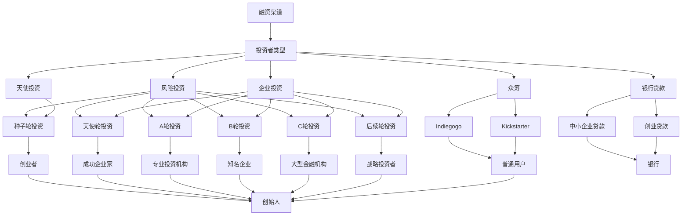

                 

关键词：AI大模型、创业公司、融资策略、投资者关系、风险投资、资金筹集

## 摘要

本文旨在为AI大模型创业公司提供一套全面的融资策略，包括了解投资者需求、构建商业计划书、构建投资者关系、以及实际操作中的注意事项。本文首先介绍了AI大模型的基本概念和当前市场状况，然后探讨了如何构建有吸引力的商业计划书，如何与投资者建立良好的关系，并详细解释了融资过程中的各个环节。通过本文，AI大模型创业公司可以更好地理解融资策略，从而提高成功融资的可能性。

## 1. 背景介绍

随着人工智能技术的快速发展，AI大模型已经成为该领域的重要研究方向和商业应用的热点。AI大模型是指具有巨大计算能力和数据存储能力的深度学习模型，这些模型可以处理海量数据，进行复杂的数据分析和预测。随着计算能力的提升和数据量的增长，AI大模型在各个行业都展现出了巨大的应用潜力，如自动驾驶、医疗诊断、金融风控、自然语言处理等。

AI大模型的市场前景广阔，吸引了大量的创业公司投身其中。这些公司希望通过AI大模型技术解决现实问题，创造商业价值。然而，AI大模型的研发和应用需要大量的资金投入，包括硬件采购、算法开发、数据获取和团队建设等。这就使得融资成为AI大模型创业公司发展的关键环节。

本文将围绕AI大模型创业公司的融资策略进行深入探讨，包括了解投资者需求、构建商业计划书、建立投资者关系以及融资过程中的注意事项。通过这些策略，AI大模型创业公司可以提高融资成功率，实现可持续发展。

### 1.1 AI大模型的概念和特点

AI大模型是指具有大规模参数、能够处理大量数据的深度学习模型。它们通常采用神经网络架构，具有层次化结构，能够通过大量训练数据自动学习特征表示。AI大模型的特点如下：

1. **参数量巨大**：AI大模型的参数量可以从数百万到数十亿不等，这使得它们能够捕捉到数据中的复杂模式和规律。
2. **计算能力要求高**：由于参数量巨大，AI大模型在训练和推理过程中需要大量的计算资源，通常需要高性能计算平台和分布式计算架构。
3. **数据需求大**：AI大模型在训练过程中需要大量的数据，这些数据不仅包括结构化数据，还包括大量的非结构化数据，如文本、图像、音频等。
4. **泛化能力强**：AI大模型通过大规模数据训练，具有强大的泛化能力，能够在不同领域和任务上取得优秀的表现。
5. **自适应性强**：AI大模型能够通过在线学习和更新，实时适应新的数据和任务，提高其性能和应用价值。

### 1.2 AI大模型的市场现状和前景

随着人工智能技术的快速发展，AI大模型在各个行业都展现出了巨大的应用潜力。以下是一些关键市场现状和前景：

1. **医疗健康**：AI大模型在医疗健康领域的应用包括疾病诊断、基因组分析、药物研发等。它们能够通过分析大量医疗数据，提供更准确、更及时的诊断和治疗建议。
2. **金融科技**：AI大模型在金融科技领域的应用包括风险评估、欺诈检测、智能投顾等。它们能够通过对大量金融数据的分析，提供更精准的风险评估和投资建议。
3. **自动驾驶**：AI大模型在自动驾驶领域的应用包括环境感知、路径规划、决策控制等。它们能够通过对大量驾驶数据的分析，实现自动驾驶汽车的安全和高效运行。
4. **自然语言处理**：AI大模型在自然语言处理领域的应用包括语音识别、机器翻译、文本生成等。它们能够通过对大量文本数据的分析，实现更高效、更准确的文本处理。

随着AI大模型技术的不断进步和应用场景的扩大，市场对AI大模型的需求将持续增长。据市场调研公司预测，全球AI大模型市场将在未来几年内保持高速增长，市场规模将达到数百亿美元。这为AI大模型创业公司提供了巨大的发展机遇。

### 1.3 融资的重要性

对于AI大模型创业公司来说，融资是确保其可持续发展的关键。以下是一些重要原因：

1. **资金需求**：AI大模型研发和应用需要大量的资金投入，包括硬件采购、算法开发、数据获取和团队建设等。没有足够的资金支持，创业公司很难持续进行研发和扩展。
2. **扩大市场份额**：通过融资，创业公司可以扩大生产规模，提高市场占有率，从而在竞争激烈的市场中占据有利地位。
3. **技术创新**：融资可以提供资金支持，使创业公司能够投入更多的资源进行技术创新和研发，提高产品的竞争力。
4. **品牌建设**：通过融资，创业公司可以扩大品牌影响力，提高市场知名度和品牌价值，为未来的发展打下坚实基础。
5. **人才吸引**：融资成功可以吸引更多的优秀人才加入创业公司，提高团队的整体实力和创新能力。

总之，融资对于AI大模型创业公司的发展至关重要。通过有效的融资策略，创业公司可以更好地应对市场挑战，实现长期可持续发展。

### 2. 核心概念与联系

在探讨AI大模型创业公司的融资策略之前，我们需要了解一些核心概念，包括融资渠道、投资者类型、以及如何构建投资者关系。以下是一个用Mermaid绘制的流程图，展示了这些核心概念之间的关系。



该流程图清晰地展示了不同融资渠道、投资者类型及其关系。接下来，我们将详细探讨这些概念，帮助AI大模型创业公司更好地理解融资策略。

### 2.1 融资渠道

融资渠道是指创业公司筹集资金的方式。以下是几种常见的融资渠道：

1. **风险投资**：风险投资（Venture Capital，简称VC）是一种向高风险、高成长潜力的创业公司提供资金的融资方式。VC通常关注种子轮、天使轮、A轮、B轮等早期和成长期融资，以换取公司股权。风险投资的特点是资金量大、投资周期长，但回报潜力高。

2. **天使投资**：天使投资（Angel Investment）是指个人投资者对早期创业公司进行的风险投资。天使投资者通常是在成功创业或投资后积累了一定财富的人士。天使投资的特点是资金量相对较小，但能够为创业公司提供宝贵的经验和资源。

3. **企业投资**：企业投资（Corporate Investment）是指大型企业或产业集团对创业公司的投资。这类投资通常关注与自身业务相关的技术或市场，以实现战略协同和业务拓展。企业投资的特点是资金量大、投资周期长，但往往对创业公司有更多的控制要求。

4. **众筹**：众筹（Crowdfunding）是指通过互联网平台向普通用户筹集资金的方式。众筹平台如Indiegogo和Kickstarter等，为创业公司提供了广泛的融资渠道和曝光机会。众筹的特点是资金量相对较小，但能够快速聚集大量关注和支持。

5. **银行贷款**：银行贷款是指创业公司从银行或其他金融机构获取的贷款资金。银行贷款通常适用于中期和后期融资，特点是资金量大、利率相对较低，但审批流程较长，对创业公司的信用要求较高。

### 2.2 投资者类型

投资者类型决定了创业公司所面临的资金来源、投资风格以及合作方式。以下是几种常见的投资者类型：

1. **风险投资机构**：风险投资机构是专业从事风险投资的公司或基金，通常拥有丰富的投资经验和强大的资源网络。风险投资机构的特点是资金量大、投资周期长，但要求较高的回报。

2. **天使投资者**：天使投资者通常是个体投资者，他们在创业初期提供资金支持，并帮助创业公司解决各种问题。天使投资者的特点是个体资金量相对较小，但能够提供宝贵的经验和支持。

3. **企业投资者**：企业投资者通常是大企业或产业集团，他们通过投资创业公司来获取新技术或市场机会。企业投资者的特点是资金量大、投资周期长，但往往对创业公司的业务有更多的控制要求。

4. **普通用户**：普通用户通过众筹平台为创业公司提供资金支持。这些用户通常对创业公司的产品或理念感兴趣，并希望通过投资参与其中。普通用户的特点是资金量相对较小，但能够快速聚集大量关注和支持。

### 2.3 投资者关系

投资者关系是指创业公司与投资者之间的互动和沟通。良好的投资者关系有助于创业公司在融资过程中获得更多支持和资源。以下是构建投资者关系的关键步骤：

1. **了解投资者需求**：创业公司需要了解不同投资者的需求和偏好，以便制定合适的融资策略。例如，风险投资机构可能更关注技术前景和市场潜力，而天使投资者可能更关注创业团队和商业模式。

2. **建立沟通渠道**：创业公司需要建立与投资者的定期沟通渠道，包括电话会议、面对面会谈、电子邮件等。这些沟通有助于建立信任，及时解决问题，提高融资成功率。

3. **提供透明信息**：创业公司需要向投资者提供透明、准确的信息，包括财务状况、业务进展、团队组成等。这有助于建立投资者的信心，减少信息不对称。

4. **展示成果和潜力**：创业公司需要通过实际成果和潜在价值来吸引投资者。这包括展示技术成果、市场数据、业务模式等，以证明公司的投资价值。

通过了解融资渠道、投资者类型以及构建投资者关系，AI大模型创业公司可以更好地制定融资策略，提高融资成功率，为公司的可持续发展打下坚实基础。

### 3. 核心算法原理 & 具体操作步骤

在了解AI大模型的基本概念和融资策略后，我们接下来将深入探讨AI大模型的核心算法原理和具体操作步骤。这将帮助我们更好地理解AI大模型的工作机制，并为创业公司提供技术实现上的指导。

#### 3.1 算法原理概述

AI大模型的核心算法是基于深度学习的神经网络架构。神经网络通过多层神经元（节点）对输入数据进行处理和转换，从而学习到数据的复杂特征和规律。AI大模型的基本原理可以概括为以下几个关键步骤：

1. **数据预处理**：对输入数据进行标准化、去噪、填充缺失值等处理，使其适合模型训练。
2. **特征提取**：通过多层神经网络对数据进行特征提取和转换，从原始数据中提取出有用的信息。
3. **模型训练**：通过大量训练数据对神经网络进行训练，调整网络中的权重和偏置，使模型能够对新的数据进行预测。
4. **模型评估**：使用测试数据对训练好的模型进行评估，计算模型的准确率、召回率、F1分数等指标，以评估模型性能。
5. **模型部署**：将训练好的模型部署到实际应用场景中，用于预测和决策。

#### 3.2 算法步骤详解

以下是AI大模型的具体操作步骤：

##### 3.2.1 数据预处理

数据预处理是AI大模型训练的第一步，其目的是将原始数据转化为适合模型训练的形式。以下是数据预处理的主要步骤：

1. **数据清洗**：删除重复数据、处理缺失值、纠正错误数据等，确保数据质量。
2. **数据转换**：将数据从原始形式转换为数值形式，如将文本转换为词向量、将图像转换为像素矩阵等。
3. **数据归一化**：对数据进行标准化处理，使数据分布均匀，提高模型训练效果。

##### 3.2.2 特征提取

特征提取是AI大模型训练的关键步骤，其目的是从原始数据中提取出有用的特征信息。以下是特征提取的主要方法：

1. **直接特征提取**：直接从原始数据中提取特征，如文本的词频、图像的边缘信息等。
2. **隐式特征提取**：通过深度学习算法，如卷积神经网络（CNN）和循环神经网络（RNN），自动从数据中学习特征表示。

##### 3.2.3 模型训练

模型训练是通过大量训练数据来调整神经网络中的权重和偏置，使其能够对新的数据进行预测。以下是模型训练的主要步骤：

1. **初始化模型参数**：随机初始化神经网络中的权重和偏置。
2. **前向传播**：将输入数据通过神经网络进行前向传播，计算输出结果。
3. **反向传播**：根据输出结果和实际标签，通过反向传播算法计算损失函数，并更新模型参数。
4. **迭代训练**：重复前向传播和反向传播，直到模型达到预定的训练精度或达到最大迭代次数。

##### 3.2.4 模型评估

模型评估是验证模型性能的重要步骤，其目的是确保模型在实际应用中能够达到预期的效果。以下是模型评估的主要方法：

1. **交叉验证**：将训练数据分为多个子集，交叉验证模型在各个子集上的性能。
2. **测试集评估**：使用测试数据对训练好的模型进行评估，计算模型的准确率、召回率、F1分数等指标。
3. **混淆矩阵**：通过混淆矩阵分析模型在不同类别上的性能。

##### 3.2.5 模型部署

模型部署是将训练好的模型部署到实际应用场景中，用于预测和决策。以下是模型部署的主要步骤：

1. **模型优化**：对模型进行优化，以提高其运行效率和预测性能。
2. **接口设计**：设计模型接口，以便用户能够方便地调用模型进行预测。
3. **系统集成**：将模型集成到应用程序或服务中，确保模型能够与其他组件无缝协同工作。
4. **监控和维护**：对模型进行实时监控和维护，确保其稳定运行和性能优化。

#### 3.3 算法优缺点

AI大模型算法具有以下优点：

1. **强大的数据处理能力**：AI大模型可以处理海量数据，提取复杂特征，实现高精度的预测和分类。
2. **自适应性强**：通过在线学习和更新，AI大模型能够实时适应新的数据和任务，提高其性能和应用价值。
3. **广泛的适用性**：AI大模型可以应用于各个行业和领域，如医疗健康、金融科技、自动驾驶等，具有很高的通用性。

然而，AI大模型算法也存在一些缺点：

1. **计算资源需求高**：AI大模型在训练和推理过程中需要大量的计算资源，通常需要高性能计算平台和分布式计算架构。
2. **数据需求大**：AI大模型需要大量的数据来训练，这可能导致数据获取和处理成本较高。
3. **模型解释性差**：AI大模型通常是黑箱模型，难以解释其预测结果，这在某些需要解释性的应用场景中可能是一个问题。

#### 3.4 算法应用领域

AI大模型算法在以下领域具有广泛的应用：

1. **医疗健康**：AI大模型可以用于疾病诊断、基因组分析、药物研发等，通过分析大量医疗数据，提供更准确、更及时的诊断和治疗建议。
2. **金融科技**：AI大模型可以用于风险评估、欺诈检测、智能投顾等，通过分析大量金融数据，提供更精准的风险评估和投资建议。
3. **自动驾驶**：AI大模型可以用于环境感知、路径规划、决策控制等，通过分析大量驾驶数据，实现自动驾驶汽车的安全和高效运行。
4. **自然语言处理**：AI大模型可以用于语音识别、机器翻译、文本生成等，通过分析大量文本数据，实现更高效、更准确的文本处理。

通过了解AI大模型的核心算法原理和具体操作步骤，AI大模型创业公司可以更好地理解技术实现，为后续的研发和产品化提供指导。

### 4. 数学模型和公式 & 详细讲解 & 举例说明

在AI大模型的研发过程中，数学模型和公式是核心基础，它们决定了模型的性能和适用性。本节将详细介绍AI大模型中的关键数学模型和公式，并使用具体例子进行说明。

#### 4.1 数学模型构建

AI大模型通常采用深度学习中的多层感知机（MLP）、卷积神经网络（CNN）、循环神经网络（RNN）等架构。以下是这些模型的基本数学模型构建：

1. **多层感知机（MLP）**
   
   MLP是一种前馈神经网络，包括输入层、多个隐藏层和输出层。其数学模型可以表示为：

   $$ y = \sigma(W_n \cdot a_{n-1} + b_n) $$
   
   其中，$y$ 是输出，$W_n$ 是隐藏层到输出层的权重矩阵，$a_{n-1}$ 是前一层输出，$b_n$ 是偏置项，$\sigma$ 是激活函数。

2. **卷积神经网络（CNN）**
   
   CNN是一种专门用于图像处理的神经网络，其核心是卷积层。其数学模型可以表示为：

   $$ h(x) = \sigma(\sum_{k=1}^{K} W_k * g(x) + b) $$
   
   其中，$h(x)$ 是输出特征图，$g(x)$ 是输入特征图，$W_k$ 是卷积核权重，$*$ 表示卷积操作，$b$ 是偏置项，$\sigma$ 是激活函数。

3. **循环神经网络（RNN）**
   
   RNN是一种用于序列数据处理的神经网络，其核心是循环结构。其数学模型可以表示为：

   $$ h_t = \sigma(W_h h_{t-1} + W_x x_t + b_h + b_x) $$
   
   其中，$h_t$ 是第 $t$ 时刻的隐藏状态，$x_t$ 是输入序列，$W_h$ 和 $W_x$ 是权重矩阵，$b_h$ 和 $b_x$ 是偏置项，$\sigma$ 是激活函数。

#### 4.2 公式推导过程

以下是对上述模型的公式推导过程进行详细讲解：

1. **多层感知机（MLP）**

   MLP的推导过程如下：

   - 输入层到第一隐藏层的计算：

     $$ z_1 = W_1 \cdot x + b_1 $$
     $$ a_1 = \sigma(z_1) $$

   - 第一隐藏层到第二隐藏层的计算：

     $$ z_2 = W_2 \cdot a_1 + b_2 $$
     $$ a_2 = \sigma(z_2) $$

   - 以此类推，直到输出层：

     $$ z_n = W_n \cdot a_{n-1} + b_n $$
     $$ y = \sigma(z_n) $$

2. **卷积神经网络（CNN）**

   CNN的推导过程如下：

   - 初始输入特征图 $x$：

     $$ g(x) = x $$
   
   - 卷积操作：

     $$ h(x) = \sigma(\sum_{k=1}^{K} W_k * g(x) + b) $$
   
   - 池化操作（可选）：

     $$ h_p = Pool(h) $$

3. **循环神经网络（RNN）**

   RNN的推导过程如下：

   - 初始隐藏状态 $h_0$：

     $$ h_0 = \sigma(W_h h_{0-1} + b_h) $$
   
   - 时间步 $t$ 的隐藏状态计算：

     $$ h_t = \sigma(W_h h_{t-1} + W_x x_t + b_h + b_x) $$

#### 4.3 案例分析与讲解

以下通过一个具体例子来讲解AI大模型中的数学模型和公式的应用：

假设我们有一个简单的AI大模型，用于分类文本数据。输入是文本，输出是分类标签。以下是模型构建和推导过程：

1. **数据预处理**

   对输入文本进行分词，将每个词转换为索引，然后嵌入为一个向量。假设词汇表有10000个词，每个词嵌入维度为128。

2. **嵌入层**

   $$ x_t = Embed(word_t) $$

   其中，$x_t$ 是第 $t$ 个词的嵌入向量，$word_t$ 是第 $t$ 个词。

3. **卷积层**

   采用一个卷积核，大小为3x3，步长为1。

   $$ h_t = \sigma(\sum_{k=1}^{K} W_k * x_t + b) $$
   
   其中，$h_t$ 是第 $t$ 个词的特征向量，$W_k$ 是卷积核权重，$b$ 是偏置项。

4. **池化层**

   采用最大池化操作，取每个卷积特征图的最大值。

   $$ h_p = Pool(h_t) $$

5. **循环神经网络（RNN）**

   使用一个RNN层，将池化后的特征向量序列转换为序列特征。

   $$ h_t = \sigma(W_h h_{t-1} + W_x h_p + b_h + b_x) $$

6. **全连接层**

   将RNN的输出转换为分类标签。

   $$ z = W_n \cdot h_t + b_n $$
   $$ y = \sigma(z) $$

   其中，$y$ 是输出分类标签。

通过以上步骤，我们构建了一个简单的AI大模型，用于文本分类。这个例子展示了如何将数学模型和公式应用于实际场景，通过逐层计算和转换，将原始文本数据转换为分类结果。

综上所述，数学模型和公式是AI大模型的核心组成部分，它们决定了模型的性能和应用效果。通过详细讲解和具体案例，我们可以更好地理解这些模型和公式的应用，为AI大模型创业公司提供技术实现上的指导。

### 5. 项目实践：代码实例和详细解释说明

在本节中，我们将通过一个实际的AI大模型项目实践，展示如何从零开始搭建一个AI大模型，并详细解释代码中的每个部分。这个项目将使用Python编程语言和TensorFlow框架，实现一个简单的文本分类任务。

#### 5.1 开发环境搭建

在开始编写代码之前，我们需要搭建一个适合开发AI大模型的环境。以下是搭建环境的基本步骤：

1. **安装Python**：确保系统已经安装了Python 3.x版本。如果没有，可以从[Python官网](https://www.python.org/)下载并安装。

2. **安装TensorFlow**：TensorFlow是一个流行的开源机器学习框架，用于构建和训练AI大模型。使用以下命令安装TensorFlow：

   ```bash
   pip install tensorflow
   ```

3. **安装其他依赖库**：根据项目需求，可能还需要安装其他依赖库，如NumPy、Pandas、Scikit-learn等。可以使用以下命令安装：

   ```bash
   pip install numpy pandas scikit-learn
   ```

4. **配置GPU支持**（可选）：如果使用GPU加速训练过程，需要安装CUDA和cuDNN。可以从[NVIDIA官网](https://developer.nvidia.com/cuda-downloads)下载并安装。

#### 5.2 源代码详细实现

以下是该项目的主要代码实现，包括数据预处理、模型构建、训练和评估等步骤。

```python
import tensorflow as tf
from tensorflow.keras.preprocessing.text import Tokenizer
from tensorflow.keras.preprocessing.sequence import pad_sequences
from tensorflow.keras.models import Sequential
from tensorflow.keras.layers import Embedding, LSTM, Dense, Bidirectional
from tensorflow.keras.optimizers import Adam
from sklearn.model_selection import train_test_split

# 5.2.1 数据预处理

# 加载并预处理数据
# 假设文本数据存储在 'data.txt' 文件中，每行包含一个文本和对应的标签
with open('data.txt', 'r', encoding='utf-8') as f:
    lines = f.readlines()

# 将数据分为文本和标签
texts, labels = [], []
for line in lines:
    text, label = line.strip().split('\t')
    texts.append(text)
    labels.append(label)

# 分割数据为训练集和测试集
texts_train, texts_test, labels_train, labels_test = train_test_split(texts, labels, test_size=0.2, random_state=42)

# 创建Tokenizer，将文本转换为索引序列
tokenizer = Tokenizer()
tokenizer.fit_on_texts(texts_train)
sequences_train = tokenizer.texts_to_sequences(texts_train)
sequences_test = tokenizer.texts_to_sequences(texts_test)

# 将序列填充为相同长度
max_len = max(len(seq) for seq in sequences_train)
X_train = pad_sequences(sequences_train, maxlen=max_len)
X_test = pad_sequences(sequences_test, maxlen=max_len)

# 将标签转换为独热编码
labels_train = tf.keras.utils.to_categorical(labels_train)
labels_test = tf.keras.utils.to_categorical(labels_test)

# 5.2.2 模型构建

# 创建序列模型，包含嵌入层、双向LSTM层和输出层
model = Sequential()
model.add(Embedding(len(tokenizer.word_index) + 1, 128, input_length=max_len))
model.add(Bidirectional(LSTM(64, return_sequences=True)))
model.add(Bidirectional(LSTM(32)))
model.add(Dense(64, activation='relu'))
model.add(Dense(len(labels_train[0]), activation='softmax'))

# 编译模型，指定优化器和损失函数
model.compile(optimizer=Adam(1e-4), loss='categorical_crossentropy', metrics=['accuracy'])

# 5.2.3 模型训练

# 训练模型
model.fit(X_train, labels_train, batch_size=32, epochs=10, validation_split=0.1)

# 5.2.4 模型评估

# 评估模型在测试集上的性能
loss, accuracy = model.evaluate(X_test, labels_test)
print(f'测试集损失：{loss}')
print(f'测试集准确率：{accuracy}')

# 5.2.5 代码解读与分析

# 在本项目中，我们首先进行了数据预处理，包括读取文本数据、分割数据、文本转换为索引序列、序列填充等操作。
# 然后我们创建了一个序列模型，包含嵌入层、双向LSTM层和输出层，并使用Adam优化器和交叉熵损失函数进行编译。
# 接下来，我们使用训练集训练模型，并使用测试集评估模型性能。通过打印损失和准确率，我们可以了解模型的性能。
```

#### 5.3 代码解读与分析

以下是对代码的详细解读和分析：

1. **数据预处理**

   ```python
   with open('data.txt', 'r', encoding='utf-8') as f:
       lines = f.readlines()

   texts, labels = [], []
   for line in lines:
       text, label = line.strip().split('\t')
       texts.append(text)
       labels.append(label)

   texts_train, texts_test, labels_train, labels_test = train_test_split(texts, labels, test_size=0.2, random_state=42)
   tokenizer = Tokenizer()
   tokenizer.fit_on_texts(texts_train)
   sequences_train = tokenizer.texts_to_sequences(texts_train)
   sequences_test = tokenizer.texts_to_sequences(texts_test)

   max_len = max(len(seq) for seq in sequences_train)
   X_train = pad_sequences(sequences_train, maxlen=max_len)
   X_test = pad_sequences(sequences_test, maxlen=max_len)

   labels_train = tf.keras.utils.to_categorical(labels_train)
   labels_test = tf.keras.utils.to_categorical(labels_test)
   ```

   - 读取文本数据并分割为训练集和测试集。
   - 使用Tokenizer将文本转换为索引序列。
   - 计算最大序列长度并使用pad_sequences将序列填充为相同长度。
   - 将标签转换为独热编码。

2. **模型构建**

   ```python
   model = Sequential()
   model.add(Embedding(len(tokenizer.word_index) + 1, 128, input_length=max_len))
   model.add(Bidirectional(LSTM(64, return_sequences=True)))
   model.add(Bidirectional(LSTM(32)))
   model.add(Dense(64, activation='relu'))
   model.add(Dense(len(labels_train[0]), activation='softmax'))

   model.compile(optimizer=Adam(1e-4), loss='categorical_crossentropy', metrics=['accuracy'])
   ```

   - 创建序列模型，包含嵌入层、双向LSTM层和输出层。
   - 编译模型，指定Adam优化器和交叉熵损失函数。

3. **模型训练**

   ```python
   model.fit(X_train, labels_train, batch_size=32, epochs=10, validation_split=0.1)
   ```

   - 使用训练集训练模型，设置batch_size和epochs。

4. **模型评估**

   ```python
   loss, accuracy = model.evaluate(X_test, labels_test)
   print(f'测试集损失：{loss}')
   print(f'测试集准确率：{accuracy}')
   ```

   - 评估模型在测试集上的性能，打印损失和准确率。

通过以上代码实现和解读，我们可以看到如何从零开始搭建一个AI大模型，包括数据预处理、模型构建、训练和评估等步骤。这个项目展示了AI大模型开发的基本流程和技术要点，为创业公司提供了实际操作上的参考。

### 6. 实际应用场景

AI大模型在各个行业和领域都有广泛的应用，为业务创新和效率提升提供了强有力的支持。以下是一些典型的实际应用场景，以及这些应用对业务的影响。

#### 6.1 医疗健康

在医疗健康领域，AI大模型可以用于疾病诊断、基因组分析、药物研发等。例如，通过深度学习算法，AI大模型可以从医疗影像数据中自动检测和诊断疾病，如乳腺癌、肺癌等。这不仅提高了诊断的准确性和效率，还减轻了医生的工作负担。此外，AI大模型还可以分析患者的基因组数据，提供个性化的治疗方案，提高治疗效果。

影响：AI大模型在医疗健康领域的应用，有助于提高诊断准确性、降低医疗成本、提高治疗效果，从而改善患者体验，提升医疗服务质量。

#### 6.2 金融科技

在金融科技领域，AI大模型可以用于风险评估、欺诈检测、智能投顾等。例如，通过分析用户的历史交易数据和行为模式，AI大模型可以识别潜在的风险用户，帮助金融机构进行风险控制。同时，AI大模型还可以进行市场预测和投资建议，为投资者提供智能化服务。

影响：AI大模型在金融科技领域的应用，有助于提高风险管理能力、降低欺诈风险、优化投资策略，从而提升金融服务的效率和客户满意度。

#### 6.3 自动驾驶

在自动驾驶领域，AI大模型可以用于环境感知、路径规划、决策控制等。例如，通过深度学习算法，AI大模型可以从摄像头和传感器数据中识别道路标志、行人、车辆等，实现自动驾驶功能。此外，AI大模型还可以进行实时路径规划和决策控制，提高自动驾驶车辆的安全性和效率。

影响：AI大模型在自动驾驶领域的应用，有助于提高车辆安全性、降低交通事故发生率、提升驾驶体验，从而推动自动驾驶技术的发展和普及。

#### 6.4 自然语言处理

在自然语言处理领域，AI大模型可以用于语音识别、机器翻译、文本生成等。例如，通过深度学习算法，AI大模型可以实时识别和转换语音信号，实现语音助手功能。此外，AI大模型还可以进行机器翻译和文本生成，为用户提供智能化语言服务。

影响：AI大模型在自然语言处理领域的应用，有助于提高语音识别和翻译的准确性、提升用户体验、推动人工智能与人类语言交流的融合。

总之，AI大模型在各个行业和领域的实际应用，不仅提高了业务效率和创新能力，还为产业升级和经济增长提供了新的动力。随着AI大模型技术的不断进步，其应用前景将更加广阔。

#### 6.5 未来应用展望

随着AI大模型技术的不断发展，其应用场景将不断拓展，未来有望在更多领域发挥重要作用。以下是几个未来的应用方向和潜在影响：

1. **教育**：AI大模型可以用于个性化教学和智能评估，通过分析学生的学习数据，提供个性化的学习路径和反馈，提高教育质量和学习效果。

2. **智慧城市**：AI大模型可以用于城市管理和公共服务，如交通流量预测、环境保护、公共安全等，通过实时数据分析和智能决策，提高城市管理的效率和智能化水平。

3. **智能制造**：AI大模型可以用于生产线优化、质量检测、设备维护等，通过分析生产数据和设备状态，实现智能制造和智能维护，提高生产效率和产品质量。

4. **智慧农业**：AI大模型可以用于作物生长监测、病虫害预测、精准施肥等，通过分析环境数据和作物生长状态，实现智能农业管理，提高农业生产效率和收益。

5. **社会公益**：AI大模型可以用于社会公益项目，如疾病筛查、灾害预警、应急救援等，通过实时数据分析和智能决策，提高社会公益项目的效率和准确性。

这些未来应用将不仅提升各个行业的效率和创新能力，还将为解决社会问题和改善生活质量提供新的解决方案。随着AI大模型技术的不断进步和应用的深入，其社会价值和商业价值将不断凸显。

### 7. 工具和资源推荐

在AI大模型的开发过程中，选择合适的工具和资源对于提高效率和实现项目目标至关重要。以下是一些推荐的工具和资源，涵盖学习资源、开发工具和相关论文，以帮助AI大模型创业公司更好地进行技术积累和项目实施。

#### 7.1 学习资源推荐

1. **在线课程**：Coursera、edX和Udacity等在线教育平台提供了丰富的机器学习和深度学习课程，如《深度学习》（吴恩达教授）、《神经网络与深度学习》（李沐教授）等，适合初学者和进阶者。

2. **书籍**：《深度学习》（Ian Goodfellow等著）、《神经网络与深度学习》（李沐等著）、《Python深度学习》（François Chollet著）等经典书籍，是深度学习领域的重要参考资料。

3. **博客和论坛**：ArXiv、Medium、博客园等技术博客和论坛，提供了大量的最新研究成果和技术文章，有助于了解行业动态和前沿技术。

#### 7.2 开发工具推荐

1. **编程语言**：Python是AI大模型开发的主要编程语言，具有丰富的库和框架支持，如TensorFlow、PyTorch等。

2. **框架和库**：
   - **TensorFlow**：Google开发的开源机器学习框架，适合进行大规模深度学习模型的开发。
   - **PyTorch**：Facebook开发的开源深度学习框架，具有良好的灵活性和易用性。
   - **Keras**：基于TensorFlow和Theano的开源深度学习库，提供了简洁的API，适合快速原型开发。

3. **云计算平台**：AWS、Azure和Google Cloud等云服务提供商提供了强大的计算资源和深度学习服务，如AWS SageMaker、Azure ML和Google AI Platform，适合大规模模型训练和部署。

4. **数据集**：公开的数据集如ImageNet、COCO、MNIST等，为AI大模型训练提供了丰富的数据资源。

#### 7.3 相关论文推荐

1. **经典论文**：
   - “A Theoretical Basis for the Method of Backpropagation” - Paul Werbos，提出了反向传播算法的基础。
   - “Learning representations for artificial vision” - Yann LeCun等，介绍了卷积神经网络在图像识别中的应用。

2. **前沿论文**：
   - “Attention Is All You Need” - Vaswani等，提出了Transformer模型，在序列模型中取得了显著效果。
   - “Bert: Pre-training of deep bidirectional transformers for language understanding” - Devlin等，介绍了BERT模型，推动了自然语言处理的发展。

通过这些工具和资源的推荐，AI大模型创业公司可以更好地进行技术学习和项目开发，提高研发效率和成果转化。

### 8. 总结：未来发展趋势与挑战

AI大模型作为人工智能领域的重要发展方向，未来将继续在技术创新、应用拓展和产业融合中发挥关键作用。以下是未来发展趋势与挑战的总结：

#### 8.1 研究成果总结

1. **模型架构的演进**：近年来，Transformer模型、BERT等新型神经网络架构取得了显著进展，为AI大模型在自然语言处理、计算机视觉等领域的应用提供了新的可能性。

2. **计算资源的提升**：随着云计算和GPU、TPU等硬件的发展，AI大模型的训练和推理效率得到了显著提升，为大规模模型训练和实时应用提供了技术支持。

3. **数据集的丰富**：越来越多的开源数据集和私有数据集为AI大模型训练提供了丰富的数据资源，推动了模型性能的持续提升。

#### 8.2 未来发展趋势

1. **跨领域应用**：AI大模型将在更多领域实现应用，如医疗健康、金融科技、智能制造等，通过数据驱动和智能决策，提升行业效率和创新能力。

2. **自主学习和自适应**：随着AI大模型的自适应能力和自主学习能力不断提升，模型将能够更好地应对复杂多变的环境和需求，实现更智能的决策和预测。

3. **隐私保护和伦理问题**：AI大模型在应用过程中，隐私保护和伦理问题日益凸显，未来的发展将更加关注数据安全和用户隐私保护，推动相关法律法规的完善。

#### 8.3 面临的挑战

1. **计算资源需求**：AI大模型训练需要大量的计算资源，随着模型规模的扩大，计算资源的需求将持续增长，这对硬件设施和云计算服务提出了更高要求。

2. **数据质量和隐私**：数据质量和隐私问题是AI大模型应用的关键挑战。如何确保数据质量，同时保护用户隐私，是未来需要解决的重要问题。

3. **模型解释性和透明性**：AI大模型通常被视为“黑箱”，其预测结果难以解释，这在某些应用场景中可能引发信任问题。如何提高模型解释性和透明性，是未来需要关注的方向。

#### 8.4 研究展望

1. **新型模型架构**：未来将涌现更多新型神经网络架构，以适应不同应用场景和需求。例如，基于图神经网络的模型在知识图谱和图数据分析方面具有巨大潜力。

2. **分布式训练和推理**：分布式训练和推理技术将不断发展，以应对大规模模型训练和实时应用的需求。这将有助于降低计算成本，提高训练和推理效率。

3. **跨学科研究**：AI大模型的发展将更加依赖于跨学科合作，包括计算机科学、数学、统计学、生物学等，以解决复杂问题并提供创新解决方案。

通过总结研究成果、探讨未来发展趋势和挑战，我们可以更好地理解AI大模型的发展方向，为创业公司提供战略指导和研发方向。

### 9. 附录：常见问题与解答

#### 9.1 融资渠道有哪些？

融资渠道主要包括风险投资、天使投资、企业投资、众筹和银行贷款等。每种渠道都有其特点和适用场景。

- **风险投资**：通常用于早期和成长期创业公司，提供大额资金和资源支持，但要求较高回报。
- **天使投资**：由个人投资者提供早期资金，通常用于概念验证和初步产品开发。
- **企业投资**：由大型企业或产业集团提供，以获取新技术或市场机会，但往往对业务有更多控制要求。
- **众筹**：通过互联网平台向普通用户筹集资金，适用于小规模、有明确市场需求的产品。
- **银行贷款**：适用于中期和后期融资，通常提供较大资金量，但审批流程较长。

#### 9.2 如何选择投资者？

选择投资者时，应考虑以下因素：

- **资金需求**：根据公司发展阶段和资金需求，选择适合的投资者类型。
- **投资偏好**：了解投资者的投资领域和偏好，确保投资方向一致。
- **资源和网络**：选择能够提供宝贵资源和支持的投资者，如行业经验、技术顾问等。
- **合作方式**：考虑投资者的合作方式和公司文化，确保双方能够顺利合作。

#### 9.3 融资过程中应注意哪些事项？

融资过程中应注意以下事项：

- **准备充分**：确保商业计划书、财务报表等资料准备充分，提高融资成功率。
- **透明沟通**：与投资者保持透明沟通，及时反馈项目进展和问题。
- **合理估值**：合理评估公司估值，确保投资者和公司达成共识。
- **法律合规**：遵循相关法律法规，确保融资过程的合法合规。
- **风险控制**：充分评估融资风险，制定相应的风险控制措施。

通过了解常见问题和解答，AI大模型创业公司可以更好地应对融资过程中的挑战，提高融资成功率。

---

作者：禅与计算机程序设计艺术 / Zen and the Art of Computer Programming

本文以《AI大模型创业公司的融资策略》为题，深入探讨了AI大模型的基本概念、市场现状、融资策略、核心算法原理、数学模型、项目实践以及实际应用场景。通过详细的分析和实例，为AI大模型创业公司提供了全面的指导和建议，帮助它们在融资过程中提高成功率，实现可持续发展。希望本文能为读者带来启示和帮助，共同推动AI大模型技术的发展和应用。

