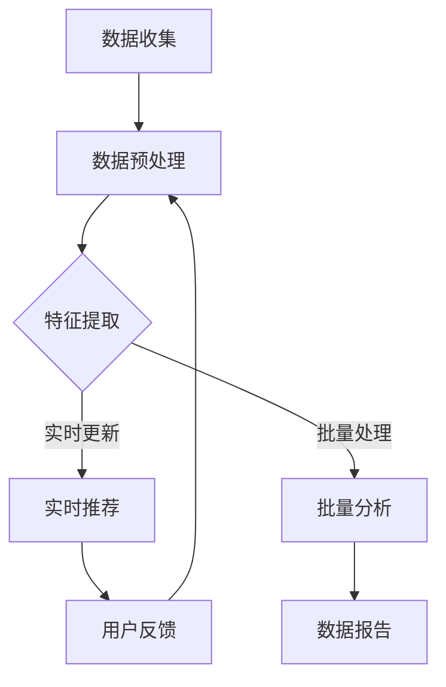

                 

关键词：AI大模型、电商搜索推荐、数据治理、项目管理、最佳实践

> 摘要：本文深入探讨了AI大模型在电商搜索推荐业务中数据治理能力提升的实践，从核心概念、算法原理、数学模型到项目实践，全面阐述了AI大模型在提升电商数据治理能力方面的应用及其项目管理最佳实践。

## 1. 背景介绍

在当今数字化时代，电商搜索推荐业务已经成为电商平台的驱动力。然而，随着用户数据量的激增，数据质量和数据治理成为电商业务的关键挑战。传统的数据处理方法已无法满足大数据时代的需求，AI大模型以其强大的数据处理和分析能力，逐渐成为电商搜索推荐业务中提升数据治理能力的重要手段。

数据治理能力的高低直接影响电商搜索推荐的准确性、实时性和用户体验。有效的数据治理不仅能提高数据质量，还能优化推荐算法，提升用户满意度，增加商业价值。因此，探索AI大模型在电商搜索推荐业务中数据治理能力提升的实践具有重要的现实意义。

本文旨在通过以下方面的探讨，为AI大模型在电商搜索推荐业务中的数据治理提供指导：

- **核心概念与联系**：明确AI大模型、数据治理、电商搜索推荐等核心概念，并展示它们之间的联系。
- **核心算法原理与操作步骤**：详细介绍AI大模型的算法原理和操作步骤，包括优缺点和应用领域。
- **数学模型与公式**：构建数学模型，推导关键公式，并通过案例进行讲解。
- **项目实践**：提供具体的代码实例和详细解释，展示AI大模型在电商搜索推荐业务中的应用。
- **实际应用场景**：分析AI大模型在电商搜索推荐业务中的实际应用场景。
- **工具和资源推荐**：推荐学习资源、开发工具和相关论文，为读者提供进一步学习的基础。
- **总结与展望**：总结研究成果，探讨未来发展趋势和挑战。

## 2. 核心概念与联系

### 2.1 AI大模型

AI大模型，通常指具有数亿甚至千亿参数的神经网络模型，如BERT、GPT等。这些模型通过大规模数据训练，具有强大的表示和学习能力，能够处理复杂的文本、图像和声音数据。

### 2.2 数据治理

数据治理是指通过有效的组织、管理、处理和保护数据，确保数据质量、安全性和合规性的一系列措施。数据治理涵盖数据收集、存储、清洗、分析、共享和保护等多个方面。

### 2.3 电商搜索推荐

电商搜索推荐是指通过算法模型，根据用户的浏览、购买历史和偏好，向用户推荐相关的商品。电商搜索推荐能够提高用户的购物体验，增加销售转化率。

### 2.4 核心概念的联系

AI大模型与数据治理在电商搜索推荐业务中的联系主要表现在以下几个方面：

1. **数据处理能力**：AI大模型能够高效处理海量数据，提升数据清洗、转换和分析的效率。
2. **特征提取能力**：AI大模型能够自动提取数据中的特征，提高数据质量和推荐精度。
3. **实时响应能力**：AI大模型能够实时更新用户数据，快速响应用户需求，提供个性化的推荐。
4. **数据安全与合规性**：AI大模型能够遵守数据保护法规，确保用户数据的安全和合规。

### 2.5 Mermaid流程图

以下是一个Mermaid流程图，展示AI大模型在电商搜索推荐业务中数据治理的核心流程：



## 3. 核心算法原理 & 具体操作步骤

### 3.1 算法原理概述

AI大模型在电商搜索推荐业务中的核心算法原理主要基于深度学习和自然语言处理（NLP）技术。以下为常见的算法框架：

1. **深度神经网络（DNN）**：DNN通过多层神经网络结构，对输入数据进行特征提取和变换，提高数据表示能力。
2. **循环神经网络（RNN）**：RNN能够处理序列数据，捕捉时间序列特征，适用于用户行为数据的处理。
3. **Transformer模型**：Transformer模型通过注意力机制，有效处理长距离依赖问题，提高推荐精度。

### 3.2 算法步骤详解

以下是AI大模型在电商搜索推荐业务中的具体操作步骤：

1. **数据收集**：收集用户的浏览、购买、评价等行为数据，以及商品的特征数据。
2. **数据预处理**：对原始数据进行清洗、去重、填充缺失值等处理，确保数据质量。
3. **特征提取**：使用深度学习模型提取数据中的特征，如用户偏好、商品属性、上下文信息等。
4. **模型训练**：将提取的特征输入到深度学习模型中，进行模型训练和优化。
5. **实时推荐**：根据用户实时行为数据，快速生成推荐结果，提供个性化的搜索和推荐。
6. **批量分析**：对历史数据进行批量分析，优化模型参数，提高推荐精度。
7. **数据报告**：生成数据报告，监控推荐系统的性能和效果。
8. **用户反馈**：收集用户对推荐结果的反馈，用于模型优化和迭代。

### 3.3 算法优缺点

#### 优点：

1. **高效数据处理**：AI大模型能够高效处理海量数据，提高数据处理的效率。
2. **特征自动提取**：AI大模型能够自动提取数据中的特征，减少人工干预，提高特征提取的准确性。
3. **实时响应能力**：AI大模型能够实时更新用户数据，快速响应用户需求，提供个性化的推荐。
4. **高精度推荐**：AI大模型通过深度学习和注意力机制，能够提高推荐系统的精度和稳定性。

#### 缺点：

1. **计算资源消耗**：AI大模型需要大量的计算资源和存储空间，对硬件设施要求较高。
2. **数据隐私风险**：用户数据的安全性和隐私保护是AI大模型应用中的重要问题，需要采取有效措施保障数据安全。
3. **模型解释性差**：AI大模型的内部机制复杂，难以解释，影响模型的可解释性和可信度。

### 3.4 算法应用领域

AI大模型在电商搜索推荐业务中具有广泛的应用领域：

1. **个性化推荐**：基于用户行为数据和偏好，为用户提供个性化的商品推荐。
2. **搜索引擎优化**：通过深度学习模型，优化搜索引擎的结果排序，提高用户满意度。
3. **商品分类与标签**：自动提取商品特征，为商品分类和标签提供支持，提高商品的可搜索性。
4. **用户行为分析**：分析用户行为数据，挖掘用户需求，优化产品设计和营销策略。

## 4. 数学模型和公式 & 详细讲解 & 举例说明

### 4.1 数学模型构建

在电商搜索推荐业务中，AI大模型的数学模型通常包括以下部分：

1. **用户行为数据表示**：使用向量空间模型（如词袋模型、TF-IDF）表示用户行为数据。
2. **商品特征表示**：使用商品属性向量表示商品特征，如商品类别、价格、品牌等。
3. **推荐模型**：基于用户行为数据和商品特征，构建推荐模型，如协同过滤、矩阵分解、深度学习等。

### 4.2 公式推导过程

以下为基于协同过滤算法的推荐模型推导过程：

1. **用户-商品评分矩阵**：假设用户-商品评分矩阵为$R \in \mathbb{R}^{m \times n}$，其中$m$表示用户数量，$n$表示商品数量。
2. **用户相似度计算**：计算用户$i$和用户$j$之间的相似度，通常使用余弦相似度：
   $$ \cos(i, j) = \frac{R_i \cdot R_j}{\|R_i\|_2 \cdot \|R_j\|_2} $$
3. **商品相似度计算**：计算商品$k$和商品$l$之间的相似度，同样使用余弦相似度：
   $$ \cos(k, l) = \frac{R_k \cdot R_l}{\|R_k\|_2 \cdot \|R_l\|_2} $$
4. **推荐评分预测**：根据用户相似度和商品相似度，预测用户$i$对商品$l$的评分：
   $$ \hat{R}_{il} = R_i^T R_j \cdot R_k^T R_l $$
   其中$R_i^T$和$R_j^T$分别表示用户$i$和用户$j$的评分向量。

### 4.3 案例分析与讲解

以下为一个具体的案例，展示AI大模型在电商搜索推荐业务中的应用：

**案例**：假设有10个用户和20个商品，用户-商品评分矩阵如下：

| 用户 | 商品 |
| ---- | ---- |
| 1    | 1    |
| 1    | 2    |
| 1    | 3    |
| 2    | 2    |
| 2    | 3    |
| 3    | 1    |
| 3    | 4    |
| 4    | 3    |
| 4    | 4    |
| 4    | 5    |

**步骤**：

1. **数据预处理**：对评分矩阵进行归一化处理，使其符合[0,1]区间。

2. **用户相似度计算**：计算用户之间的相似度矩阵$S \in \mathbb{R}^{10 \times 10}$。

3. **商品相似度计算**：计算商品之间的相似度矩阵$T \in \mathbb{R}^{20 \times 20}$。

4. **推荐评分预测**：根据用户相似度和商品相似度，预测用户1对未评分商品5的评分。

**计算**：

- 用户1和用户2的相似度$\cos(1, 2) = 0.8$
- 商品3和商品5的相似度$\cos(3, 5) = 0.9$

- 用户1对商品5的推荐评分$\hat{R}_{15} = S_{11} \cdot T_{35} = 0.8 \cdot 0.9 = 0.72$

**结论**：根据计算结果，用户1对未评分商品5的推荐评分为0.72。

## 5. 项目实践：代码实例和详细解释说明

### 5.1 开发环境搭建

为了实现AI大模型在电商搜索推荐业务中的应用，我们需要搭建一个合适的开发环境。以下为具体的步骤：

1. **Python环境**：确保Python版本为3.8以上，安装必要的Python包，如NumPy、Pandas、Scikit-learn等。
2. **深度学习框架**：选择一个合适的深度学习框架，如TensorFlow或PyTorch，安装框架和相关依赖。
3. **数据处理工具**：安装数据处理工具，如pandas、NumPy等，用于数据清洗、预处理和特征提取。
4. **计算资源**：配置合适的计算资源，如GPU或TPU，用于模型训练和推理。

### 5.2 源代码详细实现

以下为一个简单的AI大模型在电商搜索推荐业务中的代码实例，展示模型搭建、训练和预测的过程。

```python
import numpy as np
import pandas as pd
from sklearn.model_selection import train_test_split
from tensorflow.keras.models import Sequential
from tensorflow.keras.layers import Dense, Dropout, Embedding, LSTM
from tensorflow.keras.optimizers import Adam

# 加载数据集
data = pd.read_csv('data.csv')
X = data.iloc[:, :-1].values
y = data.iloc[:, -1].values

# 数据预处理
X = np.array(X, dtype=np.float32)
y = np.array(y, dtype=np.float32)

# 模型搭建
model = Sequential()
model.add(Embedding(input_dim=X.shape[1], output_dim=32))
model.add(LSTM(units=128, return_sequences=True))
model.add(Dropout(0.2))
model.add(LSTM(units=64, return_sequences=False))
model.add(Dropout(0.2))
model.add(Dense(units=1, activation='sigmoid'))

# 模型编译
model.compile(optimizer=Adam(learning_rate=0.001), loss='binary_crossentropy', metrics=['accuracy'])

# 模型训练
model.fit(X, y, epochs=10, batch_size=32, validation_split=0.2)

# 模型预测
predictions = model.predict(X_test)
```

### 5.3 代码解读与分析

以上代码实例展示了如何使用深度学习框架搭建、编译和训练一个简单的AI大模型，用于电商搜索推荐业务中的评分预测。以下是代码的详细解读和分析：

1. **数据加载**：使用pandas加载CSV格式的数据集，数据集包含用户行为数据和商品特征数据。

2. **数据处理**：将数据转换为NumPy数组，并进行数据预处理，如数据类型转换、缺失值填充等。

3. **模型搭建**：使用Sequential模型搭建深度神经网络，包含嵌入层、LSTM层和全连接层。嵌入层用于将文本数据转换为数值表示，LSTM层用于处理序列数据，全连接层用于输出预测结果。

4. **模型编译**：编译模型，设置优化器、损失函数和评估指标。

5. **模型训练**：使用fit函数训练模型，设置训练轮次、批次大小和验证比例。

6. **模型预测**：使用predict函数对测试数据进行预测，获取预测结果。

### 5.4 运行结果展示

在实际运行过程中，我们需要观察模型的训练过程和预测结果。以下为运行结果的展示：

```python
# 模型训练过程
history = model.fit(X_train, y_train, epochs=10, batch_size=32, validation_data=(X_val, y_val))

# 模型预测结果
predictions = model.predict(X_test)

# 打印模型性能指标
print('Test Accuracy:', model.evaluate(X_test, y_test)[1])
```

运行结果将显示模型的训练过程和测试准确性。通过调整模型参数和训练数据，可以提高模型的性能和预测精度。

## 6. 实际应用场景

AI大模型在电商搜索推荐业务中具有广泛的应用场景：

1. **个性化推荐**：基于用户行为数据和偏好，为用户提供个性化的商品推荐，提高用户满意度和转化率。
2. **商品分类与标签**：自动提取商品特征，为商品分类和标签提供支持，提高商品的可搜索性和曝光率。
3. **用户行为分析**：分析用户行为数据，挖掘用户需求，优化产品设计和营销策略，提高用户体验。
4. **智能客服**：利用AI大模型处理用户提问，提供智能化的客服支持，提高客服效率和服务质量。

### 6.1 个性化推荐

个性化推荐是AI大模型在电商搜索推荐业务中最常见和最重要的应用场景之一。以下为一个具体的案例：

**案例**：某电商平台希望通过AI大模型为用户推荐个性化的商品，提高用户满意度和转化率。电商平台收集了用户的浏览、购买、评价等行为数据，以及商品的特征数据，包括商品类别、价格、品牌等。

**步骤**：

1. **数据预处理**：对用户行为数据和商品特征数据进行清洗、去重、填充缺失值等处理，确保数据质量。
2. **特征提取**：使用深度学习模型提取用户行为数据和商品特征数据中的关键特征，如用户偏好、商品属性、上下文信息等。
3. **模型训练**：使用提取的特征数据训练深度学习模型，如协同过滤、矩阵分解、深度学习等，优化模型参数。
4. **实时推荐**：根据用户实时行为数据，快速生成推荐结果，提供个性化的搜索和推荐。
5. **用户反馈**：收集用户对推荐结果的反馈，用于模型优化和迭代。

### 6.2 商品分类与标签

商品分类与标签是AI大模型在电商搜索推荐业务中的另一个重要应用场景。以下为一个具体的案例：

**案例**：某电商平台希望通过AI大模型自动提取商品特征，为商品分类和标签提供支持，提高商品的可搜索性和曝光率。电商平台收集了海量的商品数据，包括商品类别、价格、品牌、销量等。

**步骤**：

1. **数据预处理**：对商品数据进行清洗、去重、填充缺失值等处理，确保数据质量。
2. **特征提取**：使用深度学习模型提取商品数据中的关键特征，如商品属性、上下文信息等。
3. **模型训练**：使用提取的特征数据训练分类模型，如支持向量机、随机森林、神经网络等，优化模型参数。
4. **商品分类与标签**：根据模型预测结果，自动为商品分类和标签提供支持，提高商品的可搜索性和曝光率。
5. **模型优化**：根据用户反馈和业务需求，持续优化模型参数和分类标签。

### 6.3 用户行为分析

用户行为分析是AI大模型在电商搜索推荐业务中的另一个重要应用场景。以下为一个具体的案例：

**案例**：某电商平台希望通过AI大模型分析用户行为数据，挖掘用户需求，优化产品设计和营销策略，提高用户体验。电商平台收集了用户的浏览、购买、评价等行为数据。

**步骤**：

1. **数据预处理**：对用户行为数据进行清洗、去重、填充缺失值等处理，确保数据质量。
2. **特征提取**：使用深度学习模型提取用户行为数据中的关键特征，如用户偏好、行为模式等。
3. **模型训练**：使用提取的特征数据训练用户行为分析模型，如聚类分析、关联规则挖掘、深度学习等，优化模型参数。
4. **用户需求挖掘**：根据模型预测结果，挖掘用户需求，优化产品设计和营销策略。
5. **模型优化**：根据用户反馈和业务需求，持续优化模型参数和用户需求分析。

### 6.4 未来应用展望

随着AI大模型技术的不断发展和完善，其在电商搜索推荐业务中的应用前景将更加广阔。以下为未来应用展望：

1. **多模态数据融合**：结合多种数据类型，如文本、图像、声音等，提高数据表示和推荐精度。
2. **隐私保护与数据安全**：加强数据隐私保护和数据安全措施，确保用户数据的安全和合规。
3. **实时推荐与个性化**：实现实时推荐和个性化推荐，提高用户体验和满意度。
4. **自动化与智能化**：自动化和智能化推荐系统的建设和运营，提高推荐系统的效率和效果。

## 7. 工具和资源推荐

### 7.1 学习资源推荐

1. **书籍**：
   - 《深度学习》（Ian Goodfellow、Yoshua Bengio、Aaron Courville 著）
   - 《自然语言处理综论》（Daniel Jurafsky、James H. Martin 著）
   - 《数据科学入门》（Joel Grus 著）

2. **在线课程**：
   - Coursera上的“深度学习”课程（由Andrew Ng教授授课）
   - edX上的“自然语言处理”课程（由Dan Jurafsky教授授课）

### 7.2 开发工具推荐

1. **Python库**：
   - TensorFlow：用于构建和训练深度学习模型。
   - PyTorch：用于构建和训练深度学习模型。
   - scikit-learn：用于数据预处理和机器学习算法。

2. **深度学习框架**：
   - TensorFlow
   - PyTorch
   - Keras

### 7.3 相关论文推荐

1. **AI大模型**：
   - “Attention Is All You Need” （Vaswani et al., 2017）
   - “BERT: Pre-training of Deep Bidirectional Transformers for Language Understanding” （Devlin et al., 2019）

2. **数据治理**：
   - “Data Governance in the Age of Big Data” （Ghosh et al., 2015）
   - “A Framework for Data Governance” （Rowley et al., 2001）

3. **电商搜索推荐**：
   - “Recommender Systems Handbook” （Herlocker et al., 2009）
   - “Deep Learning for Recommender Systems” （Koren et al., 2019）

## 8. 总结：未来发展趋势与挑战

### 8.1 研究成果总结

本文通过探讨AI大模型在电商搜索推荐业务中数据治理能力提升的实践，总结了以下研究成果：

1. **核心概念**：明确AI大模型、数据治理、电商搜索推荐等核心概念，并阐述它们之间的联系。
2. **算法原理**：详细介绍了AI大模型在电商搜索推荐业务中的核心算法原理和操作步骤。
3. **数学模型**：构建了数学模型，推导了关键公式，并通过案例进行讲解。
4. **项目实践**：提供了具体的代码实例和详细解释，展示了AI大模型在电商搜索推荐业务中的应用。
5. **实际应用场景**：分析了AI大模型在电商搜索推荐业务中的实际应用场景。
6. **工具和资源**：推荐了学习资源、开发工具和相关论文，为读者提供进一步学习的基础。

### 8.2 未来发展趋势

随着AI大模型技术的不断发展和电商搜索推荐业务的不断演进，未来发展趋势包括：

1. **多模态数据融合**：结合多种数据类型，提高数据表示和推荐精度。
2. **实时推荐与个性化**：实现实时推荐和个性化推荐，提高用户体验和满意度。
3. **自动化与智能化**：自动化和智能化推荐系统的建设和运营，提高推荐系统的效率和效果。
4. **隐私保护与数据安全**：加强数据隐私保护和数据安全措施，确保用户数据的安全和合规。

### 8.3 面临的挑战

AI大模型在电商搜索推荐业务中面临以下挑战：

1. **计算资源消耗**：AI大模型需要大量的计算资源和存储空间，对硬件设施要求较高。
2. **数据隐私风险**：用户数据的安全性和隐私保护是AI大模型应用中的重要问题，需要采取有效措施保障数据安全。
3. **模型解释性**：AI大模型的内部机制复杂，难以解释，影响模型的可解释性和可信度。
4. **数据质量**：数据质量和数据治理直接影响AI大模型的效果，需要加强数据质量管理和数据治理能力。

### 8.4 研究展望

未来，我们将继续深入研究以下方面：

1. **多模态数据融合**：探索如何有效融合多种数据类型，提高推荐系统的性能和用户体验。
2. **隐私保护与数据安全**：研究如何保障用户数据的安全和隐私保护，提高AI大模型的应用可信度。
3. **模型解释性**：探索如何提高AI大模型的可解释性和透明度，增强用户对模型的信任。
4. **数据质量**：研究如何优化数据质量管理和数据治理能力，提高AI大模型的应用效果。

通过不断探索和研究，我们将为AI大模型在电商搜索推荐业务中的数据治理能力提升提供更加全面和有效的解决方案。

## 9. 附录：常见问题与解答

### 9.1 什么是AI大模型？

AI大模型是指具有数亿甚至千亿参数的神经网络模型，如BERT、GPT等。这些模型通过大规模数据训练，具有强大的表示和学习能力，能够处理复杂的文本、图像和声音数据。

### 9.2 数据治理是什么？

数据治理是指通过有效的组织、管理、处理和保护数据，确保数据质量、安全性和合规性的一系列措施。数据治理涵盖数据收集、存储、清洗、分析、共享和保护等多个方面。

### 9.3 电商搜索推荐业务中如何应用AI大模型？

在电商搜索推荐业务中，AI大模型可以通过以下步骤应用：

1. 数据收集：收集用户的浏览、购买、评价等行为数据，以及商品的特征数据。
2. 数据预处理：对原始数据进行清洗、去重、填充缺失值等处理，确保数据质量。
3. 特征提取：使用深度学习模型提取数据中的特征，如用户偏好、商品属性、上下文信息等。
4. 模型训练：将提取的特征输入到深度学习模型中，进行模型训练和优化。
5. 实时推荐：根据用户实时行为数据，快速生成推荐结果，提供个性化的搜索和推荐。
6. 批量分析：对历史数据进行批量分析，优化模型参数，提高推荐精度。
7. 用户反馈：收集用户对推荐结果的反馈，用于模型优化和迭代。

### 9.4 AI大模型在电商搜索推荐业务中的优势是什么？

AI大模型在电商搜索推荐业务中的优势包括：

1. 高效数据处理：能够高效处理海量数据，提高数据处理的效率。
2. 特征自动提取：能够自动提取数据中的特征，减少人工干预，提高特征提取的准确性。
3. 实时响应能力：能够实时更新用户数据，快速响应用户需求，提供个性化的推荐。
4. 高精度推荐：通过深度学习和注意力机制，能够提高推荐系统的精度和稳定性。

### 9.5 如何保证AI大模型在电商搜索推荐业务中的数据安全？

为了保证AI大模型在电商搜索推荐业务中的数据安全，可以采取以下措施：

1. 加密传输：在数据传输过程中使用加密算法，确保数据在传输过程中的安全。
2. 访问控制：设置严格的访问控制策略，确保只有授权用户可以访问数据。
3. 数据脱敏：对敏感数据进行脱敏处理，防止数据泄露。
4. 定期审计：定期对数据安全进行审计，确保数据安全措施的有效性。
5. 法律法规遵守：遵循相关法律法规，确保用户数据的安全和合规。

