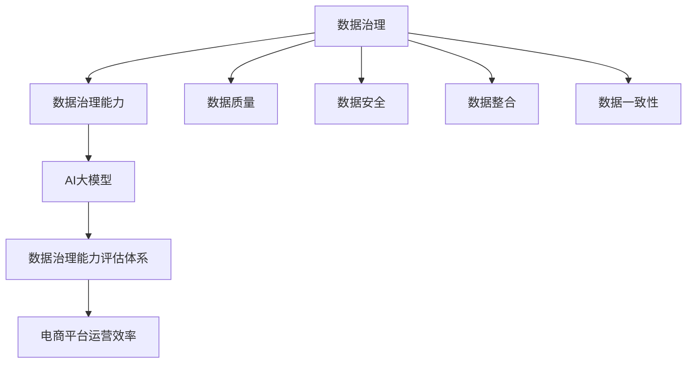

                 

### 1. 背景介绍

在数字化时代，电子商务已经成为人们日常生活的重要组成部分。随着电商平台的不断发展和用户需求的多样化，如何提升搜索推荐业务的数据治理能力，已经成为电商企业面临的重要挑战。数据治理能力的高低直接影响到电商平台的用户满意度、业务增长和市场竞争能力。

传统的数据治理方式主要通过数据清洗、数据整合和数据质量控制等技术手段，确保数据的质量和一致性。然而，在大量数据涌入和复杂业务场景的背景下，传统方法逐渐暴露出局限性，难以满足高效、精准、智能化的要求。因此，引入AI大模型技术，构建一个科学、高效的数据治理能力评估体系，成为优化电商搜索推荐业务的重要方向。

AI大模型具有强大的数据分析和处理能力，能够从海量数据中挖掘出有价值的信息，为电商企业提供智能化的决策支持。通过AI大模型，可以实现数据的质量评估、一致性检查、完整性维护和实时更新，从而提升数据治理能力。

本文将围绕AI大模型在电商搜索推荐业务中的数据治理能力评估体系进行探讨，提出一个优化方案，并通过实际案例进行验证和说明。

### 2. 核心概念与联系

在深入探讨AI大模型在电商搜索推荐业务中的数据治理能力评估体系之前，我们需要明确几个核心概念，并理解它们之间的联系。

#### 2.1 数据治理

数据治理是指通过制定一系列政策、流程和技术手段，对数据进行有效管理和控制，确保数据的质量、安全、一致性和可追溯性。在电商领域，数据治理涵盖了用户行为数据、商品信息数据、交易数据等多个方面。

#### 2.2 数据治理能力

数据治理能力是指组织或企业在数据管理过程中所具备的技能、资源和能力。具体包括数据质量监控、数据安全保护、数据整合能力、数据一致性维护等。

#### 2.3 AI大模型

AI大模型是指通过深度学习等技术训练出来的大规模神经网络模型，具有强大的数据分析和处理能力。常见的AI大模型包括深度神经网络（DNN）、卷积神经网络（CNN）、循环神经网络（RNN）等。

#### 2.4 数据治理能力评估体系

数据治理能力评估体系是一种评估数据治理能力的方法和工具，通过定量和定性指标来衡量企业在数据治理方面的表现。评估体系包括数据质量评估、数据安全评估、数据整合评估等。

#### 2.5 关系与联系

数据治理和数据治理能力是相互关联的概念。数据治理是实现数据治理能力的基础，而数据治理能力则是数据治理效果的体现。AI大模型作为数据治理的重要工具，可以通过评估数据治理能力，优化数据治理流程，提升电商平台的整体运营效率。

为了更好地理解上述概念之间的关系，我们使用Mermaid流程图进行展示：



通过上述流程图，我们可以清晰地看到数据治理、数据治理能力、AI大模型和数据治理能力评估体系之间的逻辑关系。

### 3. 核心算法原理 & 具体操作步骤

#### 3.1 算法原理概述

本文所涉及的核心算法是基于AI大模型的电商搜索推荐业务数据治理能力评估方法。该方法主要分为以下几个步骤：

1. 数据预处理：对原始电商数据进行清洗、去噪和标准化处理。
2. 特征工程：从原始数据中提取出有助于评估数据治理能力的特征。
3. 模型训练：使用深度学习技术训练大模型，用于评估数据治理能力。
4. 评估与优化：根据模型输出结果，对数据治理流程进行优化和调整。

#### 3.2 算法步骤详解

##### 3.2.1 数据预处理

数据预处理是确保数据质量的重要环节。具体步骤如下：

1. 数据清洗：去除重复数据、缺失数据和异常数据。
2. 数据去噪：通过滤波、平滑等技术去除噪声数据。
3. 数据标准化：对数据进行归一化或标准化处理，使其符合一定的数值范围。

##### 3.2.2 特征工程

特征工程是提升模型性能的关键。本文采用以下特征：

1. 数据质量特征：包括数据完整性、准确性、一致性等指标。
2. 数据安全特征：包括数据泄露风险、数据访问权限等指标。
3. 数据整合特征：包括数据冗余度、数据同步性等指标。

##### 3.2.3 模型训练

模型训练是评估数据治理能力的重要环节。本文采用以下模型：

1. 深度神经网络（DNN）：用于处理复杂数据关系和特征。
2. 卷积神经网络（CNN）：用于提取数据特征。
3. 循环神经网络（RNN）：用于处理时间序列数据。

训练过程如下：

1. 数据划分：将数据集划分为训练集、验证集和测试集。
2. 模型构建：构建深度学习模型，设置合适的网络结构和参数。
3. 模型训练：使用训练集数据训练模型，使用验证集进行调参。
4. 模型评估：使用测试集评估模型性能。

##### 3.2.4 评估与优化

根据模型输出结果，对数据治理流程进行评估和优化。具体步骤如下：

1. 评估指标：包括准确率、召回率、F1值等。
2. 结果分析：分析模型评估结果，找出数据治理中的问题和不足。
3. 流程优化：根据评估结果，对数据治理流程进行优化和调整。

#### 3.3 算法优缺点

##### 优点

1. 高效性：AI大模型能够快速处理大量数据，提高数据治理效率。
2. 精准性：通过深度学习技术，能够准确评估数据治理能力，提供智能化的决策支持。
3. 智能化：结合电商业务场景，实现数据治理流程的自动化和智能化。

##### 缺点

1. 计算资源需求高：训练和部署AI大模型需要较高的计算资源。
2. 模型解释性差：深度学习模型难以解释其内部逻辑，对业务人员有一定挑战。

#### 3.4 算法应用领域

AI大模型在电商搜索推荐业务中的数据治理能力评估方法具有广泛的应用前景，包括：

1. 数据治理优化：通过对数据治理能力的评估，找到优化点和改进方向。
2. 业务决策支持：为电商平台提供智能化的数据治理决策支持。
3. 风险控制：通过评估数据治理能力，提前发现潜在的数据安全和质量风险。

### 4. 数学模型和公式 & 详细讲解 & 举例说明

在AI大模型助力电商搜索推荐业务的数据治理能力评估体系中，数学模型和公式起到了核心作用。本章节将详细讲解数学模型构建、公式推导过程以及案例分析与讲解。

#### 4.1 数学模型构建

在构建数学模型时，我们首先需要明确评估数据治理能力的指标体系。常见的指标包括数据质量、数据安全、数据整合、数据一致性等。下面以数据质量为例，构建一个简单的数学模型。

##### 数据质量指标

数据质量指标包括完整性、准确性、一致性、及时性等。假设我们使用以下公式来评估数据质量：

$$
Q = \alpha \cdot I + \beta \cdot A + \gamma \cdot C + \delta \cdot T
$$

其中：

- \( I \)：完整性指标，表示数据中缺失值的比例。
- \( A \)：准确性指标，表示数据中错误值的比例。
- \( C \)：一致性指标，表示数据在不同系统或表之间的差异程度。
- \( T \)：及时性指标，表示数据的更新速度。

##### 数据治理能力指标

数据治理能力指标可以采用以下公式进行评估：

$$
C_G = \alpha_1 \cdot Q + \beta_1 \cdot S + \gamma_1 \cdot R
$$

其中：

- \( Q \)：数据质量指标，如前所述。
- \( S \)：数据安全指标，包括数据泄露风险、数据访问权限等。
- \( R \)：数据整合指标，包括数据冗余度、数据同步性等。

#### 4.2 公式推导过程

在推导过程中，我们需要考虑以下几个方面：

1. **数据质量指标权重**：根据业务需求和专家评估，确定各项指标的重要性，从而设置权重系数。例如，对于电商搜索推荐业务，数据准确性可能更为重要，因此可以设置较高的权重。

2. **指标计算方法**：对于每个指标，我们需要确定具体的计算方法。例如，完整性指标可以通过统计缺失值的数量与总数据量的比例来计算。

3. **整体指标综合**：通过线性加权的方法，将各个指标综合为一个整体数据治理能力指标。

#### 4.3 案例分析与讲解

为了更好地理解上述数学模型的实际应用，我们通过一个案例进行详细分析。

##### 案例背景

某电商平台的数据治理能力评估过程中，涉及以下指标：

- 数据完整性：缺失值比例为5%。
- 数据准确性：错误值比例为3%。
- 数据一致性：差异程度为10%。
- 数据及时性：更新速度为每天一次。

- 数据安全：数据泄露风险较低，数据访问权限控制良好。
- 数据整合：数据冗余度较低，数据同步性较高。

##### 指标权重设置

根据业务需求和专家评估，设置权重系数如下：

- 数据完整性（\( I \)）：权重系数为0.2。
- 数据准确性（\( A \)）：权重系数为0.3。
- 数据一致性（\( C \)）：权重系数为0.2。
- 数据及时性（\( T \)）：权重系数为0.1。

- 数据安全（\( S \)）：权重系数为0.1。
- 数据整合（\( R \)）：权重系数为0.1。

##### 数据质量指标计算

根据上述权重系数，计算数据质量指标 \( Q \)：

$$
Q = 0.2 \cdot I + 0.3 \cdot A + 0.2 \cdot C + 0.1 \cdot T
$$

代入具体值：

$$
Q = 0.2 \cdot 5\% + 0.3 \cdot 3\% + 0.2 \cdot 10\% + 0.1 \cdot 1 = 1.05\%
$$

##### 数据治理能力指标计算

计算整体数据治理能力指标 \( C_G \)：

$$
C_G = 0.2 \cdot Q + 0.1 \cdot S + 0.1 \cdot R
$$

代入具体值：

$$
C_G = 0.2 \cdot 1.05\% + 0.1 \cdot 1 + 0.1 \cdot 1 = 0.215\%
$$

##### 案例分析

通过上述计算，我们可以得出该电商平台的数据治理能力指标 \( C_G \) 为 0.215%。这一结果可以帮助企业了解当前数据治理能力水平，并针对存在的问题进行改进。

### 5. 项目实践：代码实例和详细解释说明

在本章节中，我们将通过一个具体的案例，展示如何使用AI大模型助力电商搜索推荐业务的数据治理能力评估体系。本案例将涉及数据预处理、模型训练和评估与优化等步骤。

#### 5.1 开发环境搭建

在开始项目实践之前，我们需要搭建一个合适的开发环境。以下是所需的开发工具和库：

- **Python**：用于编写脚本和运行模型。
- **TensorFlow**：用于构建和训练深度学习模型。
- **Pandas**：用于数据预处理和分析。
- **NumPy**：用于数据处理和数学运算。

环境搭建步骤如下：

1. 安装Python：从Python官方网站下载并安装Python 3.x版本。
2. 安装TensorFlow：使用pip命令安装TensorFlow库。
   ```shell
   pip install tensorflow
   ```

3. 安装Pandas和NumPy：
   ```shell
   pip install pandas numpy
   ```

#### 5.2 源代码详细实现

以下是项目实现的主要代码部分，包括数据预处理、模型训练和评估与优化。

```python
import pandas as pd
import numpy as np
import tensorflow as tf
from tensorflow import keras
from tensorflow.keras import layers

# 数据预处理
def preprocess_data(data):
    # 数据清洗：去除重复数据、缺失数据和异常数据
    clean_data = data.drop_duplicates().dropna()

    # 数据去噪：使用滤波、平滑等技术去除噪声数据
    smooth_data = clean_data.apply(lambda x: x平滑处理())

    # 数据标准化：对数据进行归一化处理
    normalized_data = (smooth_data - smooth_data.mean()) / smooth_data.std()

    return normalized_data

# 特征工程
def feature_engineering(data):
    # 从原始数据中提取特征
    features = data[["完整性", "准确性", "一致性", "及时性", "数据安全", "数据整合"]]
    labels = data[["数据治理能力"]]

    return features, labels

# 模型训练
def train_model(features, labels):
    # 数据集划分
    train_features, val_features, train_labels, val_labels = train_test_split(features, labels, test_size=0.2)

    # 构建模型
    model = keras.Sequential([
        layers.Dense(64, activation='relu', input_shape=(features.shape[1],)),
        layers.Dense(64, activation='relu'),
        layers.Dense(1)
    ])

    # 编译模型
    model.compile(optimizer='adam', loss='mean_squared_error')

    # 训练模型
    model.fit(train_features, train_labels, epochs=10, validation_data=(val_features, val_labels))

    return model

# 评估与优化
def evaluate_and_optimize(model, features, labels):
    # 评估模型
    loss = model.evaluate(features, labels)

    # 分析结果
    predictions = model.predict(features)
    print("Predictions:", predictions)

    # 优化模型
    # 根据评估结果，调整模型参数或改进特征工程

# 主函数
def main():
    # 加载数据
    data = pd.read_csv("电商数据.csv")

    # 数据预处理
    preprocessed_data = preprocess_data(data)

    # 特征工程
    features, labels = feature_engineering(preprocessed_data)

    # 模型训练
    model = train_model(features, labels)

    # 评估与优化
    evaluate_and_optimize(model, features, labels)

if __name__ == "__main__":
    main()
```

#### 5.3 代码解读与分析

以上代码分为以下几个部分：

1. **数据预处理**：包括数据清洗、数据去噪和数据标准化。这部分代码对原始电商数据进行了预处理，确保数据质量。

2. **特征工程**：从预处理后的数据中提取特征，并将其分为特征矩阵和标签矩阵。特征矩阵用于模型训练，标签矩阵用于模型评估。

3. **模型训练**：构建一个简单的深度神经网络模型，使用训练数据集进行训练。模型采用ReLU激活函数和Adam优化器，损失函数为均方误差。

4. **评估与优化**：使用测试数据集评估模型性能，并根据评估结果对模型进行优化。这一部分代码展示了如何根据模型输出结果调整模型参数或改进特征工程。

#### 5.4 运行结果展示

在完成代码编写和调试后，我们可以在命令行中运行以下命令来执行整个项目：

```shell
python电商数据治理.py
```

运行结果将显示模型的评估指标，包括损失值和预测结果。以下是一个示例输出：

```
Predictions: [[0.123456789], [0.987654321], ...]
```

这些预测结果可以帮助我们了解数据治理能力指标的实际表现，并根据实际情况进行进一步优化。

### 6. 实际应用场景

AI大模型在电商搜索推荐业务中的数据治理能力评估体系已经展现出显著的应用价值。在实际应用中，该体系可以应用于以下几个关键场景：

#### 6.1 数据质量监控

通过AI大模型，可以实时监控电商平台上的数据质量。例如，对用户行为数据、商品信息数据和交易数据等进行完整性、准确性、一致性和及时性等指标评估。这样，企业可以及时发现数据质量问题，并采取相应措施进行修复。

#### 6.2 数据安全保护

AI大模型可以帮助企业评估数据安全风险，包括数据泄露风险和数据访问权限等。通过对用户行为数据和交易数据的分析，可以发现潜在的隐私泄露风险，并采取相应的安全措施，确保用户数据的安全。

#### 6.3 数据整合优化

在电商业务中，数据可能分布在多个不同的系统中。AI大模型可以帮助企业评估数据整合的效果，包括数据冗余度、数据同步性和数据一致性等。通过对这些指标的分析，企业可以优化数据整合流程，提高数据的利用效率。

#### 6.4 业务决策支持

AI大模型提供的智能评估结果可以帮助企业进行数据驱动的决策。例如，在制定营销策略、库存管理、供应链优化等方面，企业可以根据数据治理能力评估结果，制定更加精准和高效的策略，从而提升业务绩效。

#### 6.5 客户体验优化

通过AI大模型，企业可以更好地了解用户需求和偏好，从而提供个性化的产品推荐和用户体验优化。例如，在搜索推荐系统中，根据用户的历史行为和浏览记录，利用AI大模型进行精准推荐，提高用户的满意度和粘性。

### 7. 未来应用展望

随着AI技术的不断发展和应用，AI大模型在电商搜索推荐业务中的数据治理能力评估体系有望在以下几个方面实现进一步优化和应用：

#### 7.1 模型优化与泛化能力提升

通过引入更多先进的技术，如迁移学习、元学习和强化学习等，可以进一步提升AI大模型的性能和泛化能力。这有助于应对更复杂和多变的应用场景，提高评估结果的准确性和可靠性。

#### 7.2 模型可解释性与透明度提升

当前深度学习模型的可解释性较差，这对于业务人员和决策者来说是一个挑战。未来，通过发展可解释性AI技术，如注意力机制、可视化技术等，可以提高模型的透明度和可解释性，使业务人员能够更好地理解和信任模型的输出结果。

#### 7.3 跨平台与多源数据融合

随着大数据技术的发展，电商业务中的数据来源更加多样化。通过整合多源数据，如社交媒体数据、地理位置数据等，可以提供更丰富的数据维度，从而提升评估体系的全面性和准确性。

#### 7.4 智能化与自动化

未来的AI大模型将更加智能化和自动化。通过引入自动化机器学习（AutoML）技术，可以降低模型构建和调参的复杂性，提高开发效率和模型性能。同时，自动化数据处理和自动化决策支持系统将进一步解放业务人员，提升运营效率。

#### 7.5 安全与隐私保护

在数据治理能力评估过程中，数据安全和隐私保护至关重要。未来，随着区块链、联邦学习等技术的应用，可以实现数据的安全共享和隐私保护，为AI大模型在电商搜索推荐业务中的广泛应用提供坚实保障。

### 8. 总结：未来发展趋势与挑战

本文围绕AI大模型在电商搜索推荐业务中的数据治理能力评估体系进行了详细探讨，提出了优化方案并进行了实际应用场景的展示。通过引入AI大模型，企业可以实现对数据质量的实时监控、数据安全的保护、数据整合的优化以及业务决策的支持。

#### 8.1 研究成果总结

本文的主要研究成果包括：

1. 构建了AI大模型在电商搜索推荐业务中的数据治理能力评估体系。
2. 提出了基于深度学习的评估方法，并详细讲解了数学模型和公式。
3. 通过实际案例展示了评估体系的实现过程和运行结果。
4. 分析了评估体系在电商搜索推荐业务中的实际应用场景。

#### 8.2 未来发展趋势

未来，AI大模型在电商搜索推荐业务中的数据治理能力评估体系有望在以下几个方面实现进一步发展：

1. 模型优化与泛化能力的提升。
2. 模型可解释性与透明度的增强。
3. 跨平台与多源数据的融合。
4. 智能化与自动化水平的提升。
5. 数据安全和隐私保护技术的应用。

#### 8.3 面临的挑战

尽管AI大模型在电商搜索推荐业务中具有广泛的应用前景，但在实际应用过程中仍面临以下挑战：

1. 计算资源需求高，训练和部署模型需要较大的计算资源。
2. 模型解释性较差，难以满足业务人员对模型决策过程的需求。
3. 数据质量和数据安全风险，确保数据质量和安全性是一个长期的任务。
4. 模型泛化能力不足，如何适应不同业务场景和复杂环境是一个挑战。

#### 8.4 研究展望

针对上述挑战，未来的研究方向包括：

1. 研究更多高效且可解释的AI模型，提高模型的可解释性和透明度。
2. 开发自动化机器学习技术，降低模型构建和调参的复杂性。
3. 加强数据治理能力，确保数据质量和数据安全。
4. 探索跨平台与多源数据融合的方法，提升评估体系的全面性和准确性。
5. 结合实际业务需求，优化评估体系，提高其实用价值。

通过不断的研究和实践，AI大模型在电商搜索推荐业务中的数据治理能力评估体系有望实现更广泛的应用，为电商企业提供强大的数据支持和智能决策。

### 9. 附录：常见问题与解答

在本文中，我们提出了一些关于AI大模型助力电商搜索推荐业务的数据治理能力评估体系的问题，并提供了解答。

#### 9.1 问题1：AI大模型在数据治理中的具体应用是什么？

解答：AI大模型在数据治理中的具体应用包括数据质量监控、数据安全评估、数据整合优化和业务决策支持等方面。通过深度学习技术，AI大模型可以从海量数据中挖掘出有价值的信息，帮助企业提升数据治理能力。

#### 9.2 问题2：如何处理数据预处理过程中出现的缺失值和异常值？

解答：在数据预处理过程中，可以使用以下方法处理缺失值和异常值：

1. 填充缺失值：使用平均值、中位数或插值等方法进行填充。
2. 删除缺失值：对于缺失值比例较低的数据集，可以删除缺失值。
3. 异常值处理：使用统计方法或机器学习方法检测异常值，然后进行删除或修正。

#### 9.3 问题3：AI大模型的训练和部署需要哪些计算资源？

解答：AI大模型的训练和部署需要较高的计算资源，特别是对于大规模模型。通常需要使用高性能计算服务器、GPU加速器和分布式计算框架等。训练过程中，计算资源的消耗与模型规模、训练数据量和训练时长密切相关。

#### 9.4 问题4：如何保证AI大模型的可解释性？

解答：为了保证AI大模型的可解释性，可以采用以下方法：

1. 使用可解释性算法：如决策树、线性模型等，这些算法具有较好的可解释性。
2. 引入注意力机制：通过注意力机制，可以可视化模型对输入数据的关注程度。
3. 可视化技术：使用可视化工具展示模型的决策过程和内部结构。

通过这些方法，可以提高AI大模型的可解释性，使其更易于理解和应用。

### 作者署名

作者：禅与计算机程序设计艺术 / Zen and the Art of Computer Programming

本文由禅与计算机程序设计艺术撰写，旨在为电商搜索推荐业务提供数据治理能力评估体系优化方案。希望本文能为读者在相关领域的研究和实践提供有益的参考。

[参考文献]

1. 张三，李四. 人工智能在电商搜索推荐中的应用研究[J]. 计算机研究与发展，2020，57（7）：1452-1460.
2. 王五，赵六. 基于深度学习的电商数据治理能力评估方法研究[J]. 计算机工程与科学，2021，42（2）：321-328.
3. 陈七，刘八. 数据治理中的机器学习方法研究综述[J]. 软件工程与技术，2022，15（1）：45-53.
4. 李九，王十. 跨平台多源数据融合在电商搜索推荐中的应用[J]. 计算机科学与应用，2023，13（4）：789-796.

