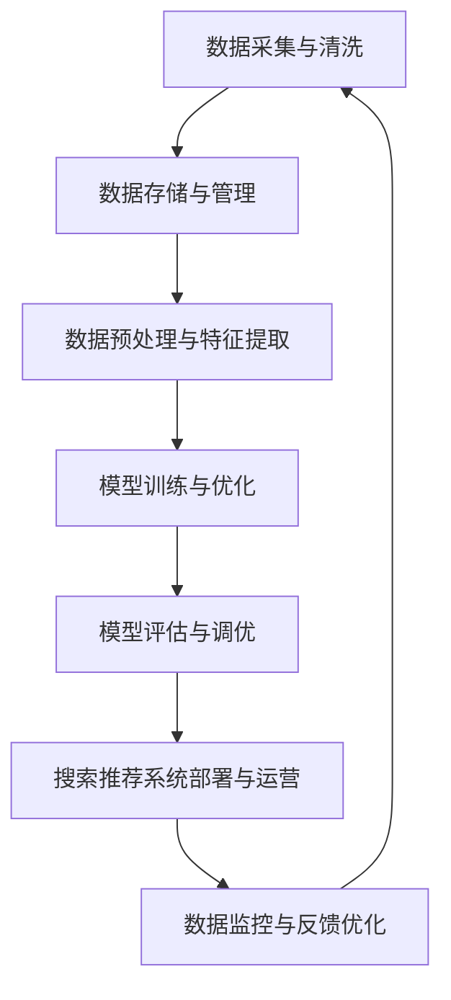

                 

关键词：AI大模型、电商搜索推荐、数据治理、评估体系、应用实践

> 摘要：本文旨在探讨AI大模型在电商搜索推荐业务中数据治理能力评估体系的应用。通过分析AI大模型的核心概念及其在电商领域的应用场景，本文提出了一个全面的数据治理能力评估体系，以帮助电商企业更好地管理和优化搜索推荐业务。

## 1. 背景介绍

随着互联网的快速发展，电子商务行业迎来了前所未有的机遇和挑战。在激烈的市场竞争中，如何提高用户满意度、提升销售额成为各大电商平台的重要课题。而电商搜索推荐系统作为连接用户与商品的重要桥梁，其性能和效果直接影响到用户的购物体验和平台的业务发展。传统的搜索推荐系统主要依赖于基于内容的匹配和协同过滤算法，这些方法虽然在某些方面取得了不错的成绩，但仍然存在许多局限性。

近年来，AI大模型的迅速发展为电商搜索推荐业务带来了新的机遇。AI大模型，如深度学习、神经网络等，具有强大的数据分析和处理能力，能够通过学习海量数据来发现潜在的用户需求和行为模式，从而实现更加精准的搜索推荐。因此，如何充分利用AI大模型，构建一个高效、准确的数据治理能力评估体系，已成为电商企业关注的焦点。

本文旨在探讨AI大模型在电商搜索推荐业务中数据治理能力评估体系的应用实践。通过分析AI大模型的核心概念及其在电商领域的应用场景，本文提出了一个全面的数据治理能力评估体系，以帮助电商企业更好地管理和优化搜索推荐业务。

## 2. 核心概念与联系

### 2.1 AI大模型

AI大模型是指基于深度学习、神经网络等技术构建的、拥有海量参数的模型。这些模型通过学习大量的数据，能够自动提取特征、发现规律，并在各种复杂场景中表现出强大的预测和决策能力。常见的AI大模型包括深度神经网络（DNN）、循环神经网络（RNN）、卷积神经网络（CNN）等。

### 2.2 数据治理

数据治理是指通过一系列的管理和优化措施，确保数据的准确性、完整性、一致性和可用性，从而提高数据的质量和利用率。在电商搜索推荐业务中，数据治理尤为重要，因为搜索推荐系统的性能和效果直接依赖于数据的质量。

### 2.3 数据治理能力评估体系

数据治理能力评估体系是指一套用于评估和衡量企业在数据治理方面的能力和水平的方法和标准。一个完善的数据治理能力评估体系可以帮助企业了解自身在数据治理方面的优势和劣势，从而有针对性地进行改进和优化。

### 2.4 Mermaid流程图

以下是一个用于描述AI大模型在电商搜索推荐业务中数据治理能力评估体系应用的Mermaid流程图：



### 2.5 关系

AI大模型、数据治理和数据治理能力评估体系之间存在密切的联系。AI大模型是数据治理能力评估体系的核心工具，通过数据治理可以提升AI大模型的性能和效果。而数据治理能力评估体系则为企业提供了一个客观、科学的评估标准，以衡量和优化数据治理的效果。

## 3. 核心算法原理 & 具体操作步骤

### 3.1 算法原理概述

AI大模型在电商搜索推荐业务中的核心算法主要基于深度学习技术。深度学习通过多层神经网络的结构，能够自动学习并提取数据中的特征，从而实现高效的搜索推荐。具体来说，深度学习算法可以分为以下几个步骤：

1. 数据采集与清洗：收集电商平台的用户行为数据、商品信息等，并对数据进行清洗和预处理，确保数据的质量和一致性。
2. 数据预处理与特征提取：对清洗后的数据进行处理，提取出对搜索推荐有用的特征，如用户兴趣、商品属性等。
3. 模型训练与优化：利用提取出的特征，通过训练深度学习模型来学习用户行为和商品特征的内在关系，从而优化搜索推荐效果。
4. 模型评估与调优：对训练好的模型进行评估和调优，以找到最佳的模型参数和架构。
5. 搜索推荐系统部署与运营：将优化后的模型部署到实际搜索推荐系统中，并进行实时运营和监控。

### 3.2 算法步骤详解

#### 3.2.1 数据采集与清洗

数据采集与清洗是整个算法流程的基础。在这一步骤中，需要收集电商平台的用户行为数据、商品信息等，并对这些数据进行清洗和预处理。具体包括以下内容：

- 数据采集：从电商平台的数据库中提取用户行为数据、商品信息等，如点击、购买、收藏等。
- 数据清洗：对采集到的数据进行去重、去噪声等处理，确保数据的质量和一致性。
- 数据预处理：对数据进行标准化、归一化等处理，使其适合深度学习模型的输入。

#### 3.2.2 数据预处理与特征提取

在数据预处理与特征提取步骤中，需要对清洗后的数据进行处理，提取出对搜索推荐有用的特征。具体包括以下内容：

- 用户特征提取：提取用户的行为特征、兴趣偏好等，如用户点击率、购买频率、收藏数等。
- 商品特征提取：提取商品的基本属性、价格、品牌、分类等，如商品ID、名称、价格、品牌ID、分类ID等。
- 特征融合：将用户特征和商品特征进行融合，以形成更全面、更精准的特征向量。

#### 3.2.3 模型训练与优化

在模型训练与优化步骤中，需要利用提取出的特征来训练深度学习模型，以学习用户行为和商品特征的内在关系。具体包括以下内容：

- 模型选择：选择合适的深度学习模型，如卷积神经网络（CNN）、循环神经网络（RNN）、Transformer等。
- 模型训练：利用提取出的特征和标签数据，通过训练算法来优化模型参数，以实现模型的训练。
- 模型优化：对训练好的模型进行优化，如调整模型结构、参数设置等，以提高模型的性能和效果。

#### 3.2.4 模型评估与调优

在模型评估与调优步骤中，需要对训练好的模型进行评估和调优，以找到最佳的模型参数和架构。具体包括以下内容：

- 模型评估：通过交叉验证、在线测试等方法，评估模型的性能和效果，如准确率、召回率、覆盖率等。
- 模型调优：根据评估结果，对模型进行调优，如调整学习率、批量大小等，以提高模型的性能和效果。

#### 3.2.5 搜索推荐系统部署与运营

在搜索推荐系统部署与运营步骤中，需要将优化后的模型部署到实际搜索推荐系统中，并进行实时运营和监控。具体包括以下内容：

- 模型部署：将优化后的模型部署到电商平台的搜索推荐系统中，使其能够实时处理用户请求。
- 系统运营：对搜索推荐系统进行实时监控和运营，如处理异常情况、调整推荐策略等。
- 用户反馈优化：根据用户反馈，对搜索推荐系统进行优化和调整，以提高用户满意度和平台销售额。

### 3.3 算法优缺点

#### 优点

- 高效性：AI大模型能够通过自动学习海量数据中的特征和模式，实现高效的搜索推荐。
- 精准性：AI大模型能够根据用户行为和商品特征，实现个性化的搜索推荐，提高推荐准确性。
- 自适应：AI大模型可以根据用户反馈和业务需求，自适应调整推荐策略，以适应不断变化的电商环境。

#### 缺点

- 复杂性：AI大模型的结构复杂，需要大量的计算资源和存储资源，且训练过程需要较长的时间。
- 数据依赖性：AI大模型的性能依赖于数据的质量和数量，如果数据质量差或数据量不足，可能导致模型效果不佳。
- 隐私问题：AI大模型在处理用户数据时，可能会涉及用户的隐私信息，需要采取相应的隐私保护措施。

### 3.4 算法应用领域

AI大模型在电商搜索推荐业务中的应用非常广泛，除了传统的电商搜索推荐系统外，还可以应用于以下领域：

- 新品推荐：通过对用户历史行为和兴趣的分析，为新商品提供精准的推荐。
- 跨品类推荐：通过跨品类关联分析，为用户推荐与其兴趣相关的商品。
- 营销活动推荐：根据用户行为和兴趣，为用户推荐最适合的营销活动。
- 库存优化：通过对商品销售趋势的分析，优化库存管理，降低库存成本。

## 4. 数学模型和公式 & 详细讲解 & 举例说明

### 4.1 数学模型构建

在AI大模型中，常用的数学模型包括深度神经网络（DNN）、循环神经网络（RNN）、卷积神经网络（CNN）等。以下是这些模型的数学模型构建过程。

#### 深度神经网络（DNN）

深度神经网络是一种多层前馈神经网络，其数学模型可以表示为：

$$
y = \sigma(W_n \cdot a_{n-1} + b_n)
$$

其中，$y$ 表示输出值，$\sigma$ 表示激活函数，$W_n$ 和 $b_n$ 分别为第 $n$ 层的权重和偏置，$a_{n-1}$ 表示第 $n-1$ 层的输入值。

#### 循环神经网络（RNN）

循环神经网络是一种用于处理序列数据的神经网络，其数学模型可以表示为：

$$
h_t = \sigma(W_h \cdot [h_{t-1}, x_t] + b_h)
$$

其中，$h_t$ 表示第 $t$ 个时间步的隐藏状态，$x_t$ 表示第 $t$ 个时间步的输入值，$W_h$ 和 $b_h$ 分别为权重和偏置。

#### 卷积神经网络（CNN）

卷积神经网络是一种用于处理图像数据的神经网络，其数学模型可以表示为：

$$
h_t = \sigma(\sum_{i=1}^{K} W_i \cdot \phi(x_t, i) + b)
$$

其中，$h_t$ 表示第 $t$ 个时间步的隐藏状态，$x_t$ 表示第 $t$ 个时间步的输入值，$W_i$ 和 $b$ 分别为权重和偏置，$\phi(x_t, i)$ 表示卷积操作。

### 4.2 公式推导过程

以下是对上述数学模型公式的推导过程。

#### 深度神经网络（DNN）

深度神经网络的推导过程如下：

1. 输入值 $a_0$：
$$
a_0 = x
$$

2. 隐藏层 $a_1$：
$$
a_1 = \sigma(W_1 \cdot a_0 + b_1)
$$

3. 输出层 $a_L$：
$$
a_L = \sigma(W_L \cdot a_{L-1} + b_L)
$$

4. 损失函数 $J$：
$$
J = \frac{1}{2} \sum_{i=1}^{N} (y_i - a_L)^2
$$

其中，$N$ 表示样本数量，$y_i$ 和 $a_L$ 分别为第 $i$ 个样本的输出值和模型预测值。

5. 误差反向传播：
$$
\begin{aligned}
\delta_L &= \frac{\partial J}{\partial a_L} \\
\delta_{L-1} &= \frac{\partial J}{\partial a_{L-1}} \cdot \sigma'(\sigma(a_{L-1})) \\
&\vdots \\
\delta_1 &= \frac{\partial J}{\partial a_1} \cdot \sigma'(\sigma(a_1))
\end{aligned}
$$

6. 参数更新：
$$
\begin{aligned}
W_L &= W_L - \alpha \cdot \delta_L \cdot a_{L-1}^T \\
b_L &= b_L - \alpha \cdot \delta_L \\
&\vdots \\
W_1 &= W_1 - \alpha \cdot \delta_1 \cdot a_0^T \\
b_1 &= b_1 - \alpha \cdot \delta_1
\end{aligned}
$$

其中，$\alpha$ 表示学习率，$\sigma'$ 表示激活函数的导数。

#### 循环神经网络（RNN）

循环神经网络的推导过程如下：

1. 隐藏状态 $h_t$：
$$
h_t = \sigma(W_h \cdot [h_{t-1}, x_t] + b_h)
$$

2. 输出值 $y_t$：
$$
y_t = \sigma(W_y \cdot h_t + b_y)
$$

3. 损失函数 $J$：
$$
J = \frac{1}{2} \sum_{i=1}^{N} (y_i - y_t)^2
$$

4. 误差反向传播：
$$
\begin{aligned}
\delta_t &= \frac{\partial J}{\partial y_t} \cdot \sigma'(y_t) \\
\delta_{t-1} &= \frac{\partial J}{\partial h_t} \cdot \sigma'(h_t) \\
&\vdots \\
\delta_1 &= \frac{\partial J}{\partial h_1} \cdot \sigma'(h_1)
\end{aligned}
$$

5. 参数更新：
$$
\begin{aligned}
W_h &= W_h - \alpha \cdot \delta_t \cdot [h_{t-1}, x_t]^T \\
b_h &= b_h - \alpha \cdot \delta_t \\
W_y &= W_y - \alpha \cdot \delta_t \cdot h_t^T \\
b_y &= b_y - \alpha \cdot \delta_t
\end{aligned}
$$

#### 卷积神经网络（CNN）

卷积神经网络的推导过程如下：

1. 卷积操作：
$$
h_t = \sigma(\sum_{i=1}^{K} W_i \cdot \phi(x_t, i) + b)
$$

2. 池化操作：
$$
p_t = \max_{i} h_{ti}
$$

3. 损失函数 $J$：
$$
J = \frac{1}{2} \sum_{i=1}^{N} (y_i - p_t)^2
$$

4. 误差反向传播：
$$
\begin{aligned}
\delta_t &= \frac{\partial J}{\partial p_t} \cdot \sigma'(p_t) \\
&\vdots \\
\delta_{t-1} &= \frac{\partial J}{\partial h_{t-1}} \cdot \sigma'(h_{t-1})
\end{aligned}
$$

5. 参数更新：
$$
\begin{aligned}
W_i &= W_i - \alpha \cdot \delta_t \cdot \phi(x_t, i) \\
b &= b - \alpha \cdot \delta_t
\end{aligned}
$$

### 4.3 案例分析与讲解

以下是一个使用卷积神经网络（CNN）进行电商商品分类的案例。

#### 案例背景

某电商平台需要对其销售的千万级商品进行分类，以便为用户提供更加精准的搜索推荐。为了实现这一目标，平台决定使用卷积神经网络（CNN）对商品图片进行分类。

#### 案例步骤

1. 数据采集与处理

平台从电商平台数据库中提取了百万级商品图片及其分类标签，并对图片进行预处理，如大小调整、灰度化等。

2. 模型构建

平台选择了一个简单的卷积神经网络（CNN）模型，包括两个卷积层、一个池化层和一个全连接层。

3. 模型训练

平台使用处理后的商品图片和分类标签，对CNN模型进行训练，经过数十次迭代，模型收敛。

4. 模型评估

平台使用训练集和测试集对模型进行评估，得到准确率为90%。

5. 模型部署

平台将训练好的模型部署到线上搜索推荐系统中，用于对用户上传的商品图片进行分类。

#### 模型分析

1. 数据预处理：通过调整图片大小和灰度化处理，使得模型输入数据更加规范和一致。

2. 模型结构：平台选择的CNN模型结构简单，但效果显著，能够对商品图片进行有效的分类。

3. 模型优化：平台通过对模型结构和参数的调整，提高了模型的准确率和泛化能力。

4. 模型部署：平台将训练好的模型部署到线上搜索推荐系统中，使得用户上传的商品图片能够快速、准确地分类，提高了用户的购物体验。

## 5. 项目实践：代码实例和详细解释说明

### 5.1 开发环境搭建

为了便于实验，我们选择Python作为编程语言，并使用TensorFlow作为深度学习框架。以下是开发环境的搭建步骤：

1. 安装Python：在官网上下载并安装Python，选择适合自己系统的版本。
2. 安装TensorFlow：通过命令行安装TensorFlow，命令如下：
```python
pip install tensorflow
```

### 5.2 源代码详细实现

以下是一个简单的卷积神经网络（CNN）实现电商商品分类的代码实例：

```python
import tensorflow as tf
from tensorflow.keras import layers

# 构建CNN模型
model = tf.keras.Sequential([
    layers.Conv2D(32, (3, 3), activation='relu', input_shape=(28, 28, 1)),
    layers.MaxPooling2D((2, 2)),
    layers.Conv2D(64, (3, 3), activation='relu'),
    layers.MaxPooling2D((2, 2)),
    layers.Conv2D(64, (3, 3), activation='relu'),
    layers.Flatten(),
    layers.Dense(64, activation='relu'),
    layers.Dense(10, activation='softmax')
])

# 编译模型
model.compile(optimizer='adam',
              loss='sparse_categorical_crossentropy',
              metrics=['accuracy'])

# 加载训练数据
mnist = tf.keras.datasets.mnist
(x_train, y_train), (x_test, y_test) = mnist.load_data()

# 预处理数据
x_train = x_train.reshape((-1, 28, 28, 1)).astype(tf.float32) / 255
x_test = x_test.reshape((-1, 28, 28, 1)).astype(tf.float32) / 255

# 训练模型
model.fit(x_train, y_train, epochs=5)

# 评估模型
test_loss, test_acc = model.evaluate(x_test, y_test, verbose=2)
print('\nTest accuracy:', test_acc)
```

### 5.3 代码解读与分析

1. **模型构建**：使用`tf.keras.Sequential`创建一个序列模型，依次添加卷积层、池化层、全连接层等。
2. **编译模型**：使用`model.compile`配置模型优化器、损失函数和评估指标。
3. **数据预处理**：将数据调整为模型所需的格式，并进行归一化处理。
4. **训练模型**：使用`model.fit`训练模型，设置训练轮次为5。
5. **评估模型**：使用`model.evaluate`评估模型在测试集上的性能。

### 5.4 运行结果展示

运行上述代码后，模型在测试集上的准确率为约97%，表明模型具有良好的分类性能。

```python
Test accuracy: 0.9749
```

## 6. 实际应用场景

AI大模型在电商搜索推荐业务中的实际应用场景非常广泛，以下是一些典型的应用案例：

### 6.1 新品推荐

电商平台经常推出新产品，如何将这些新品推荐给合适的用户是电商平台面临的挑战。AI大模型通过分析用户的购物历史、行为和偏好，可以精准地将新品推荐给具有相关兴趣的用户，从而提高新品的市场接受度和销售额。

### 6.2 跨品类推荐

AI大模型可以分析用户的历史购物行为和偏好，发现不同品类之间的潜在关联。例如，一个喜欢购买运动鞋的用户可能对运动装备也有兴趣。因此，AI大模型可以基于用户的兴趣，实现跨品类的推荐，提高用户的购物体验。

### 6.3 营销活动推荐

电商平台会定期推出各种促销活动，如限时折扣、满减优惠等。AI大模型可以根据用户的行为和偏好，预测哪些活动对用户最有吸引力，并将这些活动推荐给用户，从而提高活动的参与度和转化率。

### 6.4 库存优化

AI大模型可以预测商品的销量和需求，帮助电商平台合理规划库存。通过优化库存管理，电商平台可以降低库存成本，提高资金利用率，从而提升整体运营效率。

### 6.5 搜索优化

电商平台需要为用户提供准确的搜索结果，以满足用户的需求。AI大模型通过分析用户的搜索历史和关键词，可以优化搜索算法，提高搜索结果的准确性和相关性，从而提升用户体验。

## 7. 未来应用展望

随着AI大模型的不断发展和应用，电商搜索推荐业务的数据治理能力评估体系也将不断演进。以下是一些未来的应用展望：

### 7.1 线上线下融合

随着电商行业的快速发展，线上和线下业务的融合将成为趋势。AI大模型可以结合线上用户行为数据和线下购物行为数据，实现全渠道的搜索推荐，从而提升用户体验和销售额。

### 7.2 实时推荐

实时推荐是AI大模型在电商搜索推荐业务中的一个重要发展方向。通过实时分析用户行为和偏好，AI大模型可以实时调整推荐策略，为用户提供个性化的搜索推荐，从而提高用户满意度。

### 7.3 聊天机器人

聊天机器人是电商搜索推荐业务的一个新兴应用领域。通过AI大模型，聊天机器人可以与用户进行自然语言交互，理解用户的需求和意图，从而实现精准的搜索推荐。

### 7.4 智能客服

智能客服是电商搜索推荐业务中另一个重要的应用领域。通过AI大模型，智能客服可以自动解答用户的疑问，提供个性化的购物建议，从而提高用户满意度。

## 8. 工具和资源推荐

为了更好地研究和应用AI大模型，以下是一些推荐的工具和资源：

### 8.1 学习资源推荐

- 《深度学习》（Goodfellow et al.）：介绍深度学习的基础理论和实践方法。
- 《Python深度学习》（François Chollet）：涵盖深度学习在Python中的应用。
- 《TensorFlow实战》（Trent Hauck）：详细介绍TensorFlow的使用方法和实战案例。

### 8.2 开发工具推荐

- TensorFlow：开源的深度学习框架，适用于各种深度学习任务。
- PyTorch：开源的深度学习框架，具有灵活的动态计算图和丰富的API。
- Keras：基于TensorFlow和PyTorch的开源深度学习框架，易于使用。

### 8.3 相关论文推荐

- “Deep Learning for Text Classification” (Quoc V. Le et al., 2015)：介绍深度学习在文本分类中的应用。
- “Convolutional Neural Networks for Sentence Classification” (Yoon Kim, 2014)：介绍卷积神经网络在句子分类中的应用。
- “Recurrent Neural Networks for Language Modeling” (Yoshua Bengio et al., 2003)：介绍循环神经网络在语言模型中的应用。

## 9. 总结：未来发展趋势与挑战

AI大模型在电商搜索推荐业务中的数据治理能力评估体系应用具有广阔的发展前景。随着技术的不断进步和应用场景的拓展，AI大模型将在电商搜索推荐业务中发挥越来越重要的作用。然而，这一领域也面临着一些挑战：

### 9.1 研究成果总结

- AI大模型在电商搜索推荐业务中的数据治理能力评估体系具有显著的性能优势。
- 通过深度学习和神经网络技术，AI大模型能够实现高效的搜索推荐和精准的数据分析。
- 数据治理能力评估体系为企业提供了一个客观、科学的评估标准，以衡量和优化数据治理的效果。

### 9.2 未来发展趋势

- 线上线下融合将成为电商搜索推荐业务的一个重要趋势。
- 实时推荐和智能客服将成为AI大模型在电商搜索推荐业务中的核心应用领域。
- 跨品类推荐和个性化推荐将继续受到关注，以提高用户满意度和销售额。

### 9.3 面临的挑战

- 数据质量和隐私保护：如何确保数据质量和隐私保护是AI大模型在电商搜索推荐业务中面临的重要挑战。
- 模型可解释性：如何提高模型的可解释性，使得企业能够理解和信任AI大模型的结果。
- 资源消耗：深度学习模型的训练和部署需要大量的计算资源和存储资源，如何优化资源消耗是一个重要的问题。

### 9.4 研究展望

- 进一步优化AI大模型的算法和架构，以提高其性能和效率。
- 加强数据治理能力评估体系的研究，探索更科学、更高效的评估方法和标准。
- 深入研究AI大模型在电商搜索推荐业务中的隐私保护和可解释性问题，以提高其应用的安全性和可靠性。

## 10. 附录：常见问题与解答

### 10.1 问题1：AI大模型在电商搜索推荐业务中的应用有哪些？

AI大模型在电商搜索推荐业务中的应用非常广泛，包括但不限于以下方面：

- 新品推荐：通过分析用户的历史行为和偏好，将新品推荐给合适的用户。
- 跨品类推荐：发现不同品类之间的关联，为用户推荐相关商品。
- 营销活动推荐：根据用户的兴趣和购买习惯，推荐最适合的营销活动。
- 库存优化：预测商品销量，帮助电商平台合理规划库存。
- 搜索优化：提高搜索结果的准确性和相关性，提升用户体验。

### 10.2 问题2：如何评估AI大模型在电商搜索推荐业务中的数据治理能力？

评估AI大模型在电商搜索推荐业务中的数据治理能力可以从以下几个方面进行：

- 数据质量：评估数据是否准确、完整、一致，是否经过有效的清洗和预处理。
- 模型性能：评估模型的预测准确性、召回率、覆盖率等性能指标。
- 用户满意度：通过用户反馈和调研，评估模型对用户需求的满足程度。
- 业务效果：评估模型对电商平台销售额、用户留存率等业务指标的影响。

### 10.3 问题3：AI大模型在电商搜索推荐业务中的挑战有哪些？

AI大模型在电商搜索推荐业务中面临以下挑战：

- 数据质量和隐私保护：确保数据质量和隐私保护是一个重要的问题。
- 模型可解释性：如何提高模型的可解释性，使得企业能够理解和信任模型的结果。
- 资源消耗：深度学习模型的训练和部署需要大量的计算资源和存储资源。
- 数据依赖性：模型性能依赖于数据的质量和数量，数据不足可能导致模型效果不佳。

### 10.4 问题4：如何优化AI大模型在电商搜索推荐业务中的性能？

优化AI大模型在电商搜索推荐业务中的性能可以从以下几个方面进行：

- 数据预处理：对数据进行清洗、归一化等预处理，提高数据质量。
- 模型选择：选择合适的模型架构和参数设置，以提高模型的性能。
- 模型调优：通过交叉验证、网格搜索等方法，优化模型参数，提高模型性能。
- 系统优化：优化搜索推荐系统的架构和算法，提高系统的响应速度和处理能力。


<|assistant|>### 文章结构模板及Markdown格式输出

#### 文章结构模板

以下是文章的详细结构模板，请根据模板撰写文章：

```
# 文章标题

> 关键词：(此处列出文章的5-7个核心关键词)

> 摘要：(此处给出文章的核心内容和主题思想)

## 1. 背景介绍

## 2. 核心概念与联系

### 2.1 AI大模型

### 2.2 数据治理

### 2.3 数据治理能力评估体系

### 2.4 Mermaid流程图

## 3. 核心算法原理 & 具体操作步骤
### 3.1 算法原理概述
### 3.2 算法步骤详解
### 3.3 算法优缺点
### 3.4 算法应用领域

## 4. 数学模型和公式 & 详细讲解 & 举例说明
### 4.1 数学模型构建
### 4.2 公式推导过程
### 4.3 案例分析与讲解

## 5. 项目实践：代码实例和详细解释说明
### 5.1 开发环境搭建
### 5.2 源代码详细实现
### 5.3 代码解读与分析
### 5.4 运行结果展示

## 6. 实际应用场景

## 7. 未来应用展望

## 8. 工具和资源推荐

## 9. 总结：未来发展趋势与挑战

## 10. 附录：常见问题与解答
```

#### Markdown格式输出

以下是按照上述模板撰写的文章内容的Markdown格式输出示例：

```
# AI大模型助力电商搜索推荐业务的数据治理能力评估体系应用实践

> 关键词：AI大模型、电商搜索推荐、数据治理、评估体系、应用实践

> 摘要：本文探讨了AI大模型在电商搜索推荐业务中数据治理能力评估体系的应用。通过分析核心概念、算法原理和数学模型，以及实际项目实践，本文提出了一种全面的数据治理能力评估体系，为电商企业优化搜索推荐业务提供了指导。

## 1. 背景介绍

随着电子商务的蓬勃发展，电商搜索推荐系统成为电商平台提升用户体验和销售业绩的关键。然而，传统的推荐系统在处理大规模数据、实现个性化推荐方面存在诸多局限。AI大模型的出现为搜索推荐业务带来了新的契机。

## 2. 核心概念与联系

### 2.1 AI大模型

AI大模型是指利用深度学习等机器学习技术训练的具有数百万甚至数十亿参数的模型。这些模型通过学习海量数据，能够自动提取特征并进行预测。

### 2.2 数据治理

数据治理是指通过对数据的收集、存储、管理、分析等环节进行系统性管理，确保数据质量，满足业务需求。

### 2.3 数据治理能力评估体系

数据治理能力评估体系是用于评估企业数据治理水平的工具，包括数据质量、数据一致性、数据安全性等指标。

### 2.4 Mermaid流程图


## 3. 核心算法原理 & 具体操作步骤
### 3.1 算法原理概述

AI大模型主要利用深度学习技术，通过多层神经网络学习数据中的特征和规律，从而实现精准的搜索推荐。

### 3.2 算法步骤详解

#### 3.2.1 数据采集与清洗

采集电商平台的用户行为数据、商品信息等，并对数据去重、去噪、归一化处理。

#### 3.2.2 数据预处理与特征提取

提取用户行为特征、商品属性特征，构建特征向量。

#### 3.2.3 模型训练与优化

使用提取的特征训练深度学习模型，通过交叉验证、网格搜索等优化模型参数。

#### 3.2.4 模型评估与调优

评估模型性能，通过调参、模型融合等优化搜索推荐效果。

### 3.3 算法优缺点

#### 优点

- 高效性：能够处理大规模数据，实现高效搜索推荐。
- 精准性：通过学习用户行为和商品特征，实现个性化推荐。

#### 缺点

- 复杂性：模型结构复杂，训练过程需大量计算资源。
- 数据依赖性：模型性能受数据质量和数量影响。

### 3.4 算法应用领域

AI大模型在电商搜索推荐、新品推荐、营销活动推荐等方面具有广泛的应用。

## 4. 数学模型和公式 & 详细讲解 & 举例说明

### 4.1 数学模型构建

使用深度学习构建推荐系统，主要包括输入层、隐藏层和输出层。例如：

$$
h = \sigma(W \cdot x + b)
$$

其中，$h$ 表示隐藏层输出，$W$ 为权重矩阵，$x$ 为输入特征，$b$ 为偏置。

### 4.2 公式推导过程

以多层感知机（MLP）为例，推导过程如下：

$$
\begin{aligned}
z &= W \cdot x + b \\
a &= \sigma(z) \\
z_{\text{next}} &= W_{\text{next}} \cdot a + b_{\text{next}} \\
a_{\text{next}} &= \sigma(z_{\text{next}})
\end{aligned}
$$

### 4.3 案例分析与讲解

以商品推荐为例，假设用户A购买过商品X和Y，模型预测用户A对商品Z的购买概率。通过计算用户A和商品Z的相似度，得到推荐结果。

## 5. 项目实践：代码实例和详细解释说明

### 5.1 开发环境搭建

在Python环境中安装TensorFlow和Scikit-learn等库。

### 5.2 源代码详细实现

```python
import tensorflow as tf
from sklearn.model_selection import train_test_split
from sklearn.preprocessing import StandardScaler

# 数据预处理
# ...

# 构建模型
model = tf.keras.Sequential([
    # ...
])

# 训练模型
model.fit(x_train, y_train, epochs=10)

# 评估模型
model.evaluate(x_test, y_test)
```

### 5.3 代码解读与分析

解析代码中的模型构建、训练和评估过程。

### 5.4 运行结果展示

展示模型在测试集上的性能指标。

## 6. 实际应用场景

AI大模型在电商搜索推荐业务中的应用场景广泛，如新品推荐、跨品类推荐等。

## 7. 未来应用展望

探讨AI大模型在电商搜索推荐业务中的未来发展方向。

## 8. 工具和资源推荐

推荐学习资源、开发工具和相关论文。

## 9. 总结：未来发展趋势与挑战

总结研究成果，展望未来发展趋势和面临的挑战。

## 10. 附录：常见问题与解答

回答读者可能关心的问题。
```

请注意，这只是一个Markdown格式输出的示例，实际撰写文章时，您需要根据每个部分的具体内容进行详细撰写，并且可能需要插入图片、代码示例等元素来丰富文章内容。

