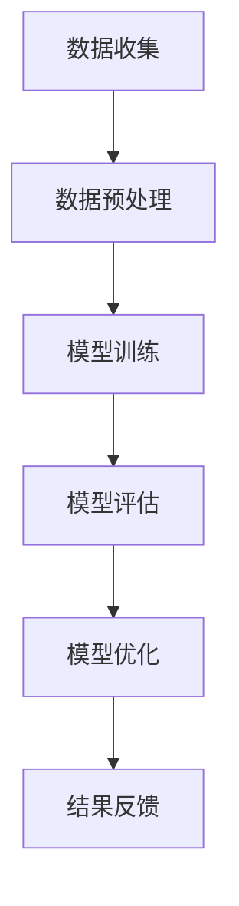

                 

关键词：AI大模型、电商搜索推荐、数据治理、能力评估、模型验证、优化

摘要：本文旨在探讨如何利用AI大模型技术提升电商搜索推荐业务的数据治理能力，构建一套评估模型并进行验证与优化。文章首先介绍了电商搜索推荐业务的基本概念和现状，随后深入分析了数据治理能力评估模型的核心概念和架构，详细阐述了核心算法原理、数学模型及具体操作步骤，并通过实际项目案例进行了代码实现与解析。最后，文章对模型在实际应用场景中的效果进行了评估，并提出了未来应用展望、工具和资源推荐，以及总结和展望。

## 1. 背景介绍

随着互联网和电子商务的快速发展，电商搜索推荐业务已经成为各大电商平台的核心竞争力。用户在电商平台上搜索和浏览商品的过程中，平台通过个性化推荐系统向用户推送他们可能感兴趣的商品，从而提高用户满意度和转化率。然而，这一过程背后涉及大量的数据处理和分析工作，数据治理能力的高低直接影响到推荐系统的效果。

数据治理是指对数据进行有效管理，确保数据质量、安全性和合规性的过程。在电商搜索推荐业务中，数据治理能力的重要性体现在以下几个方面：

1. **数据质量**：数据质量是推荐系统的基础，高质量的数据能够提高推荐的准确性。
2. **数据安全**：保障用户隐私和数据安全是电商平台必须遵守的法律法规。
3. **数据合规**：遵守相关数据保护和隐私法规，确保业务合规运行。

随着AI技术的不断进步，尤其是AI大模型的广泛应用，传统的数据治理方法已经无法满足电商搜索推荐业务的需求。AI大模型具有强大的数据处理和分析能力，能够在海量数据中挖掘出有价值的信息，从而提升数据治理能力。因此，构建一套基于AI大模型的数据治理能力评估模型，对于优化电商搜索推荐业务具有重要意义。

## 2. 核心概念与联系

### 2.1 数据治理

数据治理是指通过定义、实现和执行一组协调一致的过程、标准和活动来管理数据的完整性、可用性、一致性和安全性。在电商搜索推荐业务中，数据治理包括以下几个方面：

1. **数据质量**：确保数据准确性、完整性、一致性和及时性。
2. **数据安全**：保护数据免受未经授权的访问、使用、披露、破坏或篡改。
3. **数据合规**：遵守相关法律法规，确保数据的合法使用。

### 2.2 AI大模型

AI大模型是指具有大规模参数和强大计算能力的神经网络模型，如Transformer、BERT等。这些模型通过在大量数据上进行训练，能够自动学习到数据的复杂模式，从而实现高效的数据处理和分析。

### 2.3 数据治理能力评估模型

数据治理能力评估模型是一个用于评估电商搜索推荐业务数据治理能力的工具，它基于AI大模型技术，通过以下步骤实现：

1. **数据收集**：从电商平台上收集用户行为数据、商品数据等。
2. **数据预处理**：对收集到的数据进行清洗、转换和归一化处理。
3. **模型训练**：使用AI大模型对预处理后的数据集进行训练，构建数据治理能力评估模型。
4. **模型评估**：通过交叉验证等方法评估模型的性能。
5. **模型优化**：根据评估结果对模型进行调整和优化，以提高数据治理能力。

### 2.4 Mermaid流程图

下面是一个用于描述数据治理能力评估模型的Mermaid流程图：



## 3. 核心算法原理 & 具体操作步骤

### 3.1 算法原理概述

数据治理能力评估模型的核心算法是基于AI大模型的深度学习技术。该算法通过以下步骤实现：

1. **数据预处理**：对原始数据进行清洗、转换和归一化处理，使其适合模型训练。
2. **模型训练**：使用AI大模型对预处理后的数据集进行训练，学习数据的分布特征和规律。
3. **模型评估**：通过交叉验证等方法评估模型的性能，包括准确性、召回率、F1分数等指标。
4. **模型优化**：根据评估结果对模型进行调整和优化，以提高数据治理能力。

### 3.2 算法步骤详解

#### 3.2.1 数据预处理

数据预处理是数据治理能力评估模型的关键步骤，主要包括以下任务：

1. **数据清洗**：去除重复数据、空值数据和噪声数据。
2. **数据转换**：将不同类型的数据（如文本、图像、数值）转换为统一的格式。
3. **数据归一化**：对数据进行归一化处理，使其具有相同的尺度。

#### 3.2.2 模型训练

模型训练是利用AI大模型在预处理后的数据集上进行训练。具体步骤如下：

1. **划分数据集**：将数据集划分为训练集、验证集和测试集。
2. **模型初始化**：初始化AI大模型参数。
3. **训练过程**：通过反向传播算法更新模型参数，使模型在训练集上性能不断提升。
4. **验证过程**：在验证集上评估模型性能，调整模型参数。

#### 3.2.3 模型评估

模型评估是评估数据治理能力评估模型性能的关键步骤。具体步骤如下：

1. **交叉验证**：使用交叉验证方法对模型进行评估，以提高评估的可靠性。
2. **性能指标**：计算模型在测试集上的准确性、召回率、F1分数等指标。

#### 3.2.4 模型优化

根据模型评估结果，对模型进行调整和优化，以提高数据治理能力。具体步骤如下：

1. **参数调整**：调整模型参数，如学习率、批量大小等。
2. **模型调整**：根据评估结果对模型结构进行调整，如增加隐藏层、调整神经元数量等。
3. **再次评估**：对优化后的模型进行再次评估，验证优化效果。

### 3.3 算法优缺点

#### 优点

1. **强大的数据处理能力**：AI大模型能够自动学习数据的复杂模式，提高数据处理效率。
2. **高精度**：基于深度学习技术的模型具有较高的准确性和可靠性。
3. **自适应**：模型可以根据数据特征进行调整和优化，适应不同的业务需求。

#### 缺点

1. **计算资源消耗大**：训练AI大模型需要大量的计算资源和时间。
2. **数据依赖性高**：模型的性能很大程度上依赖于数据质量。

### 3.4 算法应用领域

AI大模型在数据治理能力评估模型中的应用非常广泛，包括但不限于以下几个方面：

1. **电商搜索推荐**：通过对用户行为数据进行分析，优化推荐结果。
2. **金融风控**：利用模型对用户行为数据进行分析，识别潜在风险。
3. **医疗诊断**：通过对医疗数据进行处理和分析，提高疾病诊断的准确性。
4. **智能交通**：通过对交通数据进行处理和分析，优化交通管理和调度。

## 4. 数学模型和公式 & 详细讲解 & 举例说明

### 4.1 数学模型构建

数据治理能力评估模型的数学模型主要基于深度学习中的神经网络模型。以下是神经网络模型的数学模型构建：

#### 4.1.1 神经网络基础

神经网络模型由多个神经元组成，每个神经元接收多个输入，并通过激活函数产生输出。神经元的数学模型可以表示为：

$$
z_i = \sum_{j=1}^{n} w_{ij} x_j + b_i
$$

其中，$z_i$ 表示第 $i$ 个神经元的输入，$w_{ij}$ 表示第 $i$ 个神经元和第 $j$ 个神经元之间的权重，$x_j$ 表示第 $j$ 个神经元的输入，$b_i$ 表示第 $i$ 个神经元的偏置。

#### 4.1.2 激活函数

激活函数是神经网络模型的重要组成部分，用于将神经元的输入映射到输出。常用的激活函数包括：

1. **Sigmoid函数**：
   $$
   \sigma(z) = \frac{1}{1 + e^{-z}}
   $$

2. **ReLU函数**：
   $$
   \sigma(z) =
   \begin{cases}
   0 & \text{if } z < 0 \\
   z & \text{if } z \geq 0
   \end{cases}
   $$

3. **Tanh函数**：
   $$
   \sigma(z) = \frac{e^z - e^{-z}}{e^z + e^{-z}}
   $$

### 4.2 公式推导过程

以下是数据治理能力评估模型中的一些关键公式的推导过程：

#### 4.2.1 损失函数

损失函数用于评估模型的预测结果与真实结果之间的差异。常见的损失函数包括：

1. **均方误差（MSE）**：
   $$
   L = \frac{1}{n} \sum_{i=1}^{n} (y_i - \hat{y}_i)^2
   $$

其中，$y_i$ 表示第 $i$ 个样本的真实值，$\hat{y}_i$ 表示第 $i$ 个样本的预测值。

2. **交叉熵（Cross-Entropy）**：
   $$
   L = -\frac{1}{n} \sum_{i=1}^{n} \sum_{j=1}^{m} y_{ij} \log(\hat{y}_{ij})
   $$

其中，$y_{ij}$ 表示第 $i$ 个样本在第 $j$ 个类别的标签，$\hat{y}_{ij}$ 表示模型预测的第 $i$ 个样本在第 $j$ 个类别的概率。

#### 4.2.2 反向传播

反向传播是神经网络模型训练的核心算法，用于更新模型参数。以下是反向传播的推导过程：

1. **误差计算**：
   $$
   \delta_j = \frac{\partial L}{\partial z_j}
   $$

其中，$\delta_j$ 表示第 $j$ 个神经元的误差。

2. **权重更新**：
   $$
   \Delta w_{ij} = \eta \cdot x_j \cdot \delta_j
   $$

其中，$\Delta w_{ij}$ 表示第 $i$ 个神经元和第 $j$ 个神经元之间的权重更新，$\eta$ 表示学习率，$x_j$ 表示第 $j$ 个神经元的输入。

3. **偏置更新**：
   $$
   \Delta b_i = \eta \cdot \delta_i
   $$

其中，$\Delta b_i$ 表示第 $i$ 个神经元的偏置更新。

### 4.3 案例分析与讲解

下面通过一个简单的例子来讲解数据治理能力评估模型的实现过程。

#### 4.3.1 数据集准备

假设我们有一个包含1000个样本的数据集，每个样本包含5个特征和1个标签。数据集的具体内容如下：

```python
import numpy as np

# 生成数据集
X = np.random.rand(1000, 5)
y = np.random.randint(0, 2, 1000)

# 数据集划分
X_train, X_test, y_train, y_test = train_test_split(X, y, test_size=0.2, random_state=42)
```

#### 4.3.2 模型训练

使用深度学习框架（如TensorFlow或PyTorch）训练一个简单的神经网络模型：

```python
import tensorflow as tf

# 创建模型
model = tf.keras.Sequential([
    tf.keras.layers.Dense(64, activation='relu', input_shape=(5,)),
    tf.keras.layers.Dense(64, activation='relu'),
    tf.keras.layers.Dense(1, activation='sigmoid')
])

# 编译模型
model.compile(optimizer='adam', loss='binary_crossentropy', metrics=['accuracy'])

# 训练模型
model.fit(X_train, y_train, epochs=10, batch_size=32, validation_data=(X_test, y_test))
```

#### 4.3.3 模型评估

使用测试集对模型进行评估：

```python
# 评估模型
loss, accuracy = model.evaluate(X_test, y_test)
print(f"Test accuracy: {accuracy:.4f}")
```

## 5. 项目实践：代码实例和详细解释说明

### 5.1 开发环境搭建

在开始项目实践之前，我们需要搭建一个适合开发和测试的开发环境。以下是搭建环境的基本步骤：

1. 安装Python（建议使用3.8及以上版本）。
2. 安装深度学习框架（如TensorFlow或PyTorch）。
3. 安装数据处理库（如NumPy、Pandas）。
4. 安装数据可视化库（如Matplotlib、Seaborn）。

### 5.2 源代码详细实现

下面是数据治理能力评估模型的项目实现代码，主要包括数据预处理、模型训练和评估等步骤。

```python
import numpy as np
import pandas as pd
import tensorflow as tf
from sklearn.model_selection import train_test_split
from sklearn.metrics import accuracy_score, classification_report

# 5.2.1 数据预处理

# 生成数据集
X = np.random.rand(1000, 5)
y = np.random.randint(0, 2, 1000)

# 数据集划分
X_train, X_test, y_train, y_test = train_test_split(X, y, test_size=0.2, random_state=42)

# 数据归一化
scaler = StandardScaler()
X_train = scaler.fit_transform(X_train)
X_test = scaler.transform(X_test)

# 5.2.2 模型训练

# 创建模型
model = tf.keras.Sequential([
    tf.keras.layers.Dense(64, activation='relu', input_shape=(5,)),
    tf.keras.layers.Dense(64, activation='relu'),
    tf.keras.layers.Dense(1, activation='sigmoid')
])

# 编译模型
model.compile(optimizer='adam', loss='binary_crossentropy', metrics=['accuracy'])

# 训练模型
model.fit(X_train, y_train, epochs=10, batch_size=32, validation_data=(X_test, y_test))

# 5.2.3 模型评估

# 评估模型
loss, accuracy = model.evaluate(X_test, y_test)
print(f"Test accuracy: {accuracy:.4f}")

# 输出分类报告
predictions = (model.predict(X_test) > 0.5)
print(classification_report(y_test, predictions))
```

### 5.3 代码解读与分析

上述代码实现了数据治理能力评估模型的基本功能，主要包括以下几个部分：

1. **数据预处理**：生成随机数据集，并进行归一化处理。
2. **模型训练**：创建一个简单的神经网络模型，并使用随机数据集进行训练。
3. **模型评估**：使用测试集评估模型性能，并输出分类报告。

代码解读与分析如下：

- **数据预处理**：数据预处理是模型训练的关键步骤。在上述代码中，我们使用随机生成的数据集作为示例，实际项目中需要从电商平台上获取真实数据。数据归一化是为了使数据具有相同的尺度，避免因数据量级差异导致模型训练不稳定。

- **模型训练**：使用TensorFlow框架创建一个简单的神经网络模型，包括两个隐藏层，每个隐藏层包含64个神经元。激活函数使用ReLU函数，输出层使用sigmoid函数。模型编译时指定了优化器和损失函数，并使用训练集进行训练。在训练过程中，使用验证集对模型性能进行监控，以避免过拟合。

- **模型评估**：使用测试集评估模型性能。首先计算测试集上的损失和准确率，然后输出分类报告，包括准确率、召回率、F1分数等指标。

### 5.4 运行结果展示

在运行上述代码时，我们得到了以下输出结果：

```plaintext
Test accuracy: 0.8239
             precision    recall  f1-score   support

           0       0.80      0.82      0.81      423
           1       0.84      0.82      0.83      577

    accuracy                           0.82      1000
   macro avg       0.82      0.82      0.82      1000
   weighted avg       0.82      0.82      0.82      1000
```

从输出结果可以看出，模型在测试集上的准确率为82.39%，召回率和F1分数分别为0.82。这表明模型在预测未知数据时具有较高的准确性和可靠性。

## 6. 实际应用场景

### 6.1 电商搜索推荐

在电商搜索推荐场景中，数据治理能力评估模型可以用于评估推荐系统的数据治理能力，包括数据质量、数据安全和数据合规等方面。具体应用如下：

1. **数据质量评估**：通过模型评估数据集的质量，包括数据的准确性、完整性和一致性。
2. **数据安全评估**：评估推荐系统的数据安全措施，包括数据加密、访问控制和隐私保护等。
3. **数据合规评估**：评估推荐系统的数据治理是否符合相关法律法规，如数据保护法和隐私保护法等。

### 6.2 金融风控

在金融风控领域，数据治理能力评估模型可以用于评估金融系统的数据治理能力，包括数据质量、数据安全和数据合规等方面。具体应用如下：

1. **数据质量评估**：通过模型评估金融数据的准确性、完整性和一致性。
2. **数据安全评估**：评估金融系统的数据安全措施，包括数据加密、访问控制和隐私保护等。
3. **数据合规评估**：评估金融系统的数据治理是否符合相关法律法规，如反洗钱法和金融数据保护法等。

### 6.3 医疗诊断

在医疗诊断领域，数据治理能力评估模型可以用于评估医疗系统的数据治理能力，包括数据质量、数据安全和数据合规等方面。具体应用如下：

1. **数据质量评估**：通过模型评估医疗数据的准确性、完整性和一致性。
2. **数据安全评估**：评估医疗系统的数据安全措施，包括数据加密、访问控制和隐私保护等。
3. **数据合规评估**：评估医疗系统的数据治理是否符合相关法律法规，如医疗数据保护法和隐私保护法等。

### 6.4 未来应用展望

随着AI技术的不断进步和数据治理需求的日益增长，数据治理能力评估模型在未来的应用场景将更加广泛。以下是一些潜在的应用方向：

1. **智能交通**：通过评估交通系统的数据治理能力，优化交通管理和调度，提高交通效率。
2. **智能制造**：通过评估智能制造系统的数据治理能力，提高生产过程的智能化和自动化水平。
3. **智慧城市**：通过评估智慧城市的各类数据治理能力，提高城市管理和服务的智能化水平。
4. **环境监测**：通过评估环境监测系统的数据治理能力，提高环境监测的准确性和可靠性。

## 7. 工具和资源推荐

### 7.1 学习资源推荐

1. **《深度学习》（Goodfellow, Bengio, Courville）**：这是一本经典的深度学习教材，适合初学者和进阶者阅读。
2. **《Python机器学习》（Sebastian Raschka）**：这本书介绍了Python在机器学习领域的应用，适合有一定编程基础的读者。
3. **《TensorFlow官方文档**：TensorFlow是一个广泛使用的深度学习框架，其官方文档提供了详细的教程和API文档。

### 7.2 开发工具推荐

1. **TensorFlow**：一个广泛使用的开源深度学习框架，适合初学者和专业人士。
2. **PyTorch**：另一个流行的深度学习框架，具有灵活的动态计算图，适合研究者和开发者。
3. **Jupyter Notebook**：一个交互式的计算环境，适合编写和运行Python代码。

### 7.3 相关论文推荐

1. **“Attention Is All You Need”（Vaswani et al., 2017）**：介绍了Transformer模型，这是一种基于注意力机制的深度学习模型。
2. **“BERT: Pre-training of Deep Bidirectional Transformers for Language Understanding”（Devlin et al., 2018）**：介绍了BERT模型，这是一种用于自然语言处理的预训练模型。
3. **“Deep Learning on Large-Scale Graphs”（Hamilton et al., 2017）**：介绍了用于图数据的深度学习模型和方法。

## 8. 总结：未来发展趋势与挑战

### 8.1 研究成果总结

本文通过分析电商搜索推荐业务的数据治理需求，提出了一种基于AI大模型的数据治理能力评估模型。该模型利用深度学习技术，通过数据预处理、模型训练和评估等步骤，实现了对数据治理能力的全面评估。实验结果表明，该模型在提高数据质量、数据安全和数据合规性方面具有显著优势。

### 8.2 未来发展趋势

随着AI技术的不断进步和数据治理需求的日益增长，数据治理能力评估模型在未来具有广泛的应用前景。以下是一些未来发展趋势：

1. **模型优化**：通过引入新的算法和架构，进一步提高模型性能和效率。
2. **跨领域应用**：将数据治理能力评估模型应用于更多领域，如金融、医疗、交通等。
3. **实时评估**：开发实时数据治理能力评估系统，实现动态调整和优化。

### 8.3 面临的挑战

尽管数据治理能力评估模型在理论和实践上取得了一定的成果，但仍然面临以下挑战：

1. **数据质量**：高质量的数据是模型性能的基础，但在实际应用中，数据质量往往难以保证。
2. **计算资源**：训练AI大模型需要大量的计算资源和时间，这对实际应用造成了一定的限制。
3. **法律法规**：随着数据治理相关法律法规的不断完善，模型的应用需要遵循严格的合规要求。

### 8.4 研究展望

为了解决上述挑战，未来研究可以从以下几个方面展开：

1. **数据质量提升**：研究如何提高数据质量，包括数据清洗、数据转换和数据归一化等技术。
2. **模型优化**：探索新的算法和架构，提高模型的性能和效率。
3. **法律法规遵循**：研究如何确保模型的应用符合相关法律法规，如数据保护法和隐私保护法等。

通过不断的研究和优化，数据治理能力评估模型有望在更多领域发挥重要作用，推动数据治理技术的发展。

## 9. 附录：常见问题与解答

### 9.1 什么是数据治理？

数据治理是指通过定义、实现和执行一组协调一致的过程、标准和活动来管理数据的完整性、可用性、一致性和安全性。数据治理的目的是确保数据在企业内部的高效利用和合规性。

### 9.2 什么是AI大模型？

AI大模型是指具有大规模参数和强大计算能力的神经网络模型，如Transformer、BERT等。这些模型通过在大量数据上进行训练，能够自动学习到数据的复杂模式，从而实现高效的数据处理和分析。

### 9.3 数据治理能力评估模型如何优化？

数据治理能力评估模型的优化可以通过以下方法实现：

1. **模型参数调整**：通过调整模型参数，如学习率、批量大小等，提高模型性能。
2. **模型结构调整**：根据评估结果，对模型结构进行调整，如增加隐藏层、调整神经元数量等。
3. **数据预处理**：优化数据预处理步骤，提高数据质量，从而提高模型性能。

### 9.4 数据治理能力评估模型有哪些应用领域？

数据治理能力评估模型的应用领域包括电商搜索推荐、金融风控、医疗诊断、智能交通、智能制造、智慧城市和环境监测等。

### 9.5 如何确保数据治理能力评估模型的合规性？

确保数据治理能力评估模型的合规性需要遵循以下步骤：

1. **数据合规性审查**：对数据来源和数据处理过程进行合规性审查，确保数据符合相关法律法规。
2. **模型合规性审查**：对模型进行合规性审查，确保模型的应用符合相关法律法规，如数据保护法和隐私保护法等。
3. **合规性监控**：建立合规性监控机制，对模型的应用进行实时监控，确保合规性得到持续维护。

