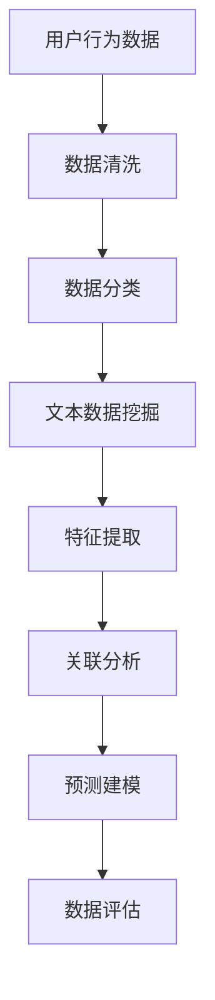

                 

关键词：AI大模型、电商搜索、推荐系统、数据资产盘点、自动化工具、自然语言处理、机器学习、数据挖掘

摘要：本文旨在探讨如何利用AI大模型来构建电商搜索推荐业务的数据资产盘点自动化工具。文章首先介绍了电商搜索推荐业务的数据资产盘点的重要性，随后详细阐述了AI大模型的原理及其在电商搜索推荐业务中的应用，并提出了具体的自动化工具实现方案。通过数学模型的构建和算法的详细讲解，文章展示了如何通过AI大模型实现数据资产盘点自动化，从而提高电商搜索推荐系统的效率和准确性。最后，文章还探讨了AI大模型在电商搜索推荐业务中的未来应用前景，并提出了相关工具和资源的推荐。

## 1. 背景介绍

随着互联网的快速发展，电子商务已经成为全球经济发展的重要引擎。电商平台的数量和规模持续扩大，用户数量也不断增长。这使得电商搜索推荐业务成为各大电商平台的核心竞争力。然而，随着数据的爆炸性增长，如何高效地管理这些数据，并从中提取有价值的信息，成为了一个亟待解决的问题。

数据资产盘点是电商搜索推荐业务中的一个关键环节。它涉及到对电商平台上的用户行为数据、商品数据、订单数据等多维度数据进行整理、分类、分析和评估。传统的数据资产盘点方法通常依赖于人工操作，效率低、准确性差，难以满足电商搜索推荐业务的高要求和快速发展。

近年来，人工智能（AI）特别是大模型技术的发展，为数据资产盘点提供了新的解决方案。大模型，如Transformer、BERT、GPT等，具有强大的自然语言处理和机器学习能力，可以自动处理大量的文本数据，提取有用的信息，从而实现数据资产盘点的自动化。本文将探讨如何利用AI大模型来构建电商搜索推荐业务的数据资产盘点自动化工具，以提高工作效率和数据准确性。

## 2. 核心概念与联系

### 2.1 AI大模型

AI大模型是指具有数十亿到数十万亿参数的深度神经网络模型，具有极强的建模能力和泛化能力。这些模型通常采用大规模数据进行训练，以实现各种复杂任务，如图像识别、语音识别、自然语言处理等。

常见的AI大模型包括：

- **Transformer**：由Google提出，主要用于处理序列数据，如机器翻译、文本生成等。
- **BERT**：由Google提出，主要用于文本分类、问答系统等任务。
- **GPT**：由OpenAI提出，主要用于文本生成和对话系统等任务。

### 2.2 电商搜索推荐业务

电商搜索推荐业务是指利用算法技术，根据用户的兴趣、行为和历史数据，为用户推荐最相关的商品。这一业务涉及到用户行为分析、商品数据挖掘、推荐算法设计等多个方面。

电商搜索推荐业务的数据资产主要包括：

- 用户行为数据：如搜索记录、购买记录、浏览记录等。
- 商品数据：如商品描述、价格、库存、评价等。
- 订单数据：如订单时间、订单金额、订单状态等。

### 2.3 数据资产盘点

数据资产盘点是指对电商平台的各项数据进行整理、分类、分析和评估，以了解数据的价值和潜在利用方式。数据资产盘点的主要任务包括：

- 数据清洗：去除重复、错误和无关的数据。
- 数据分类：根据数据类型和用途进行分类。
- 数据分析：利用统计、机器学习等方法，从数据中提取有价值的信息。
- 数据评估：对数据的价值和利用潜力进行评估。

### 2.4 AI大模型在数据资产盘点中的应用

AI大模型在数据资产盘点中的应用主要体现在以下几个方面：

- **文本数据挖掘**：利用大模型的自然语言处理能力，自动处理和分析大量的文本数据，如用户评价、商品描述等。
- **特征提取**：通过深度学习技术，自动提取数据中的高价值特征，用于后续的数据分析和建模。
- **关联分析**：利用大模型进行数据间的关联分析，发现数据之间的关系和规律。
- **预测建模**：基于历史数据和模型预测，对未来的数据趋势和需求进行预测。

### 2.5 Mermaid 流程图

为了更直观地展示AI大模型在电商搜索推荐业务中的数据资产盘点过程，我们可以使用Mermaid流程图来描述。以下是流程图的文本表示：



## 3. 核心算法原理 & 具体操作步骤

### 3.1 算法原理概述

AI大模型在电商搜索推荐业务的数据资产盘点中的应用主要基于以下核心算法原理：

- **深度学习**：通过构建多层神经网络，对数据进行特征提取和建模。
- **自然语言处理**：利用自然语言处理技术，对文本数据进行预处理和特征提取。
- **机器学习**：利用机器学习算法，从数据中学习规律，进行预测和分类。
- **数据挖掘**：利用数据挖掘技术，从大量数据中发现潜在的关联和规律。

### 3.2 算法步骤详解

#### 3.2.1 数据采集

数据采集是数据资产盘点的基础。在电商搜索推荐业务中，数据采集主要包括用户行为数据、商品数据、订单数据等。

- **用户行为数据**：通过用户在电商平台上的搜索、浏览、购买等行为数据，记录用户的兴趣和偏好。
- **商品数据**：通过商品描述、价格、库存、评价等数据，了解商品的基本信息。
- **订单数据**：通过订单时间、订单金额、订单状态等数据，了解用户的购买行为。

#### 3.2.2 数据预处理

数据预处理是数据资产盘点的重要环节，主要包括数据清洗、数据格式转换和数据归一化等。

- **数据清洗**：去除重复、错误和无关的数据，确保数据的质量。
- **数据格式转换**：将不同数据源的数据转换为统一格式，便于后续处理。
- **数据归一化**：对数据进行归一化处理，消除数据之间的量纲差异。

#### 3.2.3 特征提取

特征提取是数据资产盘点的核心步骤，通过提取数据中的高价值特征，为后续的建模和分析提供支持。

- **文本特征提取**：利用自然语言处理技术，提取文本数据中的关键词、主题和情感等特征。
- **数值特征提取**：通过统计分析和机器学习技术，提取数值数据中的趋势、相关性等特征。

#### 3.2.4 建模与预测

建模与预测是数据资产盘点的关键步骤，通过构建预测模型，对未来数据趋势和需求进行预测。

- **文本分类模型**：利用深度学习技术，构建文本分类模型，对用户评价、商品描述等进行分类。
- **关联分析模型**：利用关联规则挖掘技术，构建关联分析模型，发现数据之间的关联关系。
- **时间序列预测模型**：利用时间序列预测技术，构建时间序列预测模型，对未来订单量、销售额等进行预测。

#### 3.2.5 数据评估

数据评估是对数据资产盘点结果的评估，通过评估数据的价值和利用潜力，为后续的数据利用提供参考。

- **数据质量评估**：评估数据的质量，包括数据完整性、准确性、一致性等。
- **数据价值评估**：评估数据的价值，包括数据的应用范围、潜在收益等。

### 3.3 算法优缺点

#### 优点

- **高效性**：利用AI大模型，可以快速处理大量数据，提高数据盘点的效率。
- **准确性**：通过深度学习和自然语言处理技术，可以提取数据中的高价值特征，提高数据盘点的准确性。
- **灵活性**：可以根据业务需求，灵活调整和优化模型参数，适应不同场景的数据盘点需求。

#### 缺点

- **计算资源消耗大**：AI大模型需要大量的计算资源，包括CPU、GPU等。
- **数据质量要求高**：数据质量对AI大模型的效果有重要影响，需要确保数据的质量和完整性。
- **模型调优复杂**：AI大模型需要大量的数据和计算资源进行调优，对技术要求较高。

### 3.4 算法应用领域

AI大模型在电商搜索推荐业务的数据资产盘点中具有广泛的应用前景，主要包括以下几个方面：

- **用户行为分析**：通过对用户行为数据的分析，了解用户的兴趣、偏好和需求，为推荐系统提供支持。
- **商品数据分析**：通过对商品数据的分析，了解商品的销售情况、用户评价等，为商品优化和营销策略提供支持。
- **订单数据分析**：通过对订单数据的分析，了解订单的生成规律、销售趋势等，为供应链管理和库存优化提供支持。
- **风险评估**：通过对用户行为和订单数据的分析，预测潜在的风险，为风险管理提供支持。

## 4. 数学模型和公式 & 详细讲解 & 举例说明

### 4.1 数学模型构建

在电商搜索推荐业务的数据资产盘点中，常见的数学模型包括文本分类模型、关联分析模型和时间序列预测模型。以下分别介绍这些模型的数学模型构建。

#### 4.1.1 文本分类模型

文本分类模型是一种常见的自然语言处理任务，其目标是将文本数据分类到不同的类别中。常用的文本分类模型包括朴素贝叶斯、支持向量机、深度学习等。

- **朴素贝叶斯模型**：

  $$P(y=c|X) = \frac{P(X|y=c)P(y=c)}{P(X)}$$

  其中，$X$为文本特征向量，$y$为类别标签，$c$为类别。

- **支持向量机模型**：

  $$w = arg\min_{w,b}\frac{1}{2}||w||^2 + C\sum_{i=1}^{n}\max(0,1-y^{(i)}(w^Tx^{(i)}+b))$$

  其中，$w$为权重向量，$b$为偏置，$C$为惩罚参数。

- **深度学习模型**：

  常见的深度学习模型包括卷积神经网络（CNN）和循环神经网络（RNN）等。

  $$h_{l}^{(i)} = \sigma(\sum_{j=1}^{n}w_{j}^{(l)}h_{l-1}^{(j)}+b_{l})$$

  其中，$h_{l}^{(i)}$为第$l$层的输出，$\sigma$为激活函数。

#### 4.1.2 关联分析模型

关联分析模型的目标是发现数据之间的关联关系。常见的关联分析模型包括Apriori算法、FP-Growth算法等。

- **Apriori算法**：

  $$support(itemset) = \frac{count(itemset)}{total\ transactions}$$

  $$confidence(association\ rule) = \frac{support(a \ \&\ b)}{support(a)}$$

  其中，$itemset$为项集，$a$和$b$为关联规则中的两个项。

- **FP-Growth算法**：

  $$support(itemset) = \frac{count(itemset)}{total\ transactions}$$

  $$confidence(association\ rule) = \frac{count(a \ \&\ b)}{count(a)}$$

  其中，$count(itemset)$为项集在事务中出现的次数。

#### 4.1.3 时间序列预测模型

时间序列预测模型的目标是预测未来的数据趋势。常见的时间序列预测模型包括ARIMA、LSTM等。

- **ARIMA模型**：

  $$y_t = c + \phi_1 y_{t-1} + \phi_2 y_{t-2} + ... + \phi_p y_{t-p} + \theta_1 e_{t-1} + \theta_2 e_{t-2} + ... + \theta_q e_{t-q}$$

  其中，$y_t$为时间序列数据，$e_t$为白噪声序列。

- **LSTM模型**：

  $$i_t = \sigma(W_i[x_t;h_{t-1}]+b_i)$$

  $$f_t = \sigma(W_f[x_t;h_{t-1}]+b_f)$$

  $$g_t = \sigma(W_g[x_t;h_{t-1}]+b_g)$$

  $$o_t = \sigma(W_o[x_t;h_{t-1}]+b_o)$$

  $$h_t = o_t \odot \sigma(W_h[x_t;h_{t-1}]+b_h)$$

  其中，$i_t$、$f_t$、$g_t$、$o_t$分别为输入门、遗忘门、生成门和输出门，$h_t$为隐藏状态。

### 4.2 公式推导过程

#### 4.2.1 朴素贝叶斯模型

朴素贝叶斯模型的推导基于贝叶斯定理和条件独立性假设。

- **贝叶斯定理**：

  $$P(y=c|X) = \frac{P(X|y=c)P(y=c)}{P(X)}$$

- **条件独立性假设**：

  $$P(X|y=c) = P(x_1|y=c)P(x_2|y=c)...P(x_n|y=c)$$

  $$P(y=c) = P(y=c|X)P(X)$$

  $$P(X) = \sum_{c'}P(X|y=c')P(y=c')$$

  将条件独立性假设代入贝叶斯定理，得到：

  $$P(y=c|X) = \frac{\prod_{i=1}^{n}P(x_i|y=c)P(y=c)}{\sum_{c'}\prod_{i=1}^{n}P(x_i|y=c')P(y=c')}$$

  进一步化简，得到：

  $$P(y=c|X) = \frac{\prod_{i=1}^{n}P(x_i|y=c)P(y=c)}{\sum_{c'}P(y=c')\prod_{i=1}^{n}P(x_i|y=c')}$$

  $$P(y=c|X) = \frac{\prod_{i=1}^{n}P(x_i|y=c)P(y=c)}{P(X)}$$

  $$P(y=c|X) = \frac{P(X|y=c)P(y=c)}{P(X)}$$

#### 4.2.2 支持向量机模型

支持向量机模型的推导基于优化理论。

- **优化目标**：

  $$w = arg\min_{w,b}\frac{1}{2}||w||^2 + C\sum_{i=1}^{n}\max(0,1-y^{(i)}(w^Tx^{(i)}+b))$$

  其中，$||w||$为$w$的范数，$C$为惩罚参数。

- **Lagrange乘子法**：

  构造Lagrange函数：

  $$L(w,b,\alpha) = \frac{1}{2}||w||^2 - \sum_{i=1}^{n}\alpha_i[y^{(i)}(w^Tx^{(i)}+b)-1]$$

  其中，$\alpha_i$为Lagrange乘子。

  对$w$和$b$求导，并令导数为0，得到：

  $$w = \sum_{i=1}^{n}\alpha_iy^{(i)}x^{(i)}$$

  $$-\sum_{i=1}^{n}\alpha_iy^{(i)} = 0$$

  $$\alpha_i \geq 0$$

  $$\sum_{i=1}^{n}\alpha_i = C$$

  代入优化目标，得到：

  $$w = \sum_{i=1}^{n}\alpha_iy^{(i)}x^{(i)}$$

  $$\alpha_i[y^{(i)}(w^Tx^{(i)}+b)-1] = 0$$

  $$w^Tx^{(i)}+b = 1$$

  解得：

  $$b = 1 - \sum_{i=1}^{n}\alpha_iy^{(i)}x^{(i)}$$

  $$w = \sum_{i=1}^{n}\alpha_iy^{(i)}x^{(i)}$$

#### 4.2.3 LSTM模型

LSTM模型的推导基于神经网络和优化理论。

- **优化目标**：

  $$h_t = \sigma(W_h[x_t;h_{t-1}]+b_h)$$

  其中，$W_h$为权重矩阵，$b_h$为偏置。

- **反向传播算法**：

  构造误差函数：

  $$E = \sum_{t=1}^{T}\frac{1}{2}(h_t - y_t)^2$$

  对$h_t$求导，得到：

  $$\frac{\partial E}{\partial h_t} = h_t - y_t$$

  $$\frac{\partial h_t}{\partial W_h} = h_{t-1}$$

  $$\frac{\partial h_t}{\partial b_h} = 1$$

  对$b_h$求导，得到：

  $$\frac{\partial E}{\partial b_h} = h_t - y_t$$

  利用梯度下降法，更新权重矩阵和偏置：

  $$W_h \leftarrow W_h - \eta \frac{\partial E}{\partial W_h}$$

  $$b_h \leftarrow b_h - \eta \frac{\partial E}{\partial b_h}$$

  其中，$\eta$为学习率。

### 4.3 案例分析与讲解

为了更好地理解AI大模型在电商搜索推荐业务的数据资产盘点中的应用，我们通过一个实际案例进行详细分析。

#### 4.3.1 案例背景

某电商平台拥有海量用户数据，包括用户行为数据、商品数据和订单数据。为了提高电商平台的搜索推荐效果，需要对这些数据进行数据资产盘点，提取有价值的信息。

#### 4.3.2 数据采集

数据采集主要包括以下方面：

- **用户行为数据**：包括用户在平台上的搜索记录、浏览记录和购买记录等。
- **商品数据**：包括商品描述、价格、库存、评价等。
- **订单数据**：包括订单时间、订单金额、订单状态等。

#### 4.3.3 数据预处理

数据预处理主要包括以下步骤：

- **数据清洗**：去除重复、错误和无关的数据。
- **数据格式转换**：将不同数据源的数据转换为统一格式。
- **数据归一化**：对数据进行归一化处理，消除数据之间的量纲差异。

#### 4.3.4 特征提取

特征提取主要包括以下方面：

- **文本特征提取**：利用自然语言处理技术，提取用户评价、商品描述等文本数据中的关键词、主题和情感等特征。
- **数值特征提取**：通过统计分析和机器学习技术，提取用户行为数据、商品数据、订单数据中的趋势、相关性等特征。

#### 4.3.5 建模与预测

建模与预测主要包括以下方面：

- **文本分类模型**：利用朴素贝叶斯模型对用户评价、商品描述等进行分类。
- **关联分析模型**：利用Apriori算法对用户行为数据、商品数据、订单数据等进行关联分析。
- **时间序列预测模型**：利用ARIMA模型对订单量、销售额等进行预测。

#### 4.3.6 数据评估

数据评估主要包括以下方面：

- **数据质量评估**：评估用户行为数据、商品数据、订单数据的质量，包括数据完整性、准确性、一致性等。
- **数据价值评估**：评估用户行为数据、商品数据、订单数据的价值，包括数据的应用范围、潜在收益等。

#### 4.3.7 结果分析

通过对数据资产盘点的结果进行分析，发现以下有价值的信息：

- **用户偏好**：通过用户行为数据的分析，了解用户的兴趣和偏好，为推荐系统提供支持。
- **商品关联**：通过关联分析，发现商品之间的关联关系，为商品优化和营销策略提供支持。
- **销售预测**：通过时间序列预测，预测未来的订单量和销售额，为供应链管理和库存优化提供支持。

## 5. 项目实践：代码实例和详细解释说明

### 5.1 开发环境搭建

为了实现AI大模型在电商搜索推荐业务的数据资产盘点自动化工具，我们需要搭建一个合适的开发环境。以下是开发环境的搭建步骤：

#### 5.1.1 硬件要求

- CPU：Intel Core i7及以上
- GPU：NVIDIA GeForce RTX 2080 Ti及以上
- 内存：16GB及以上
- 硬盘：500GB及以上

#### 5.1.2 软件要求

- 操作系统：Ubuntu 18.04
- Python：Python 3.8
- 包管理器：pip
- 深度学习框架：TensorFlow 2.5

#### 5.1.3 环境配置

1. 安装操作系统：在虚拟机中安装Ubuntu 18.04操作系统。
2. 安装Python：通过pip安装Python 3.8。
3. 安装TensorFlow：通过pip安装TensorFlow 2.5。

### 5.2 源代码详细实现

以下是实现AI大模型在电商搜索推荐业务的数据资产盘点自动化工具的源代码。

```python
import tensorflow as tf
from tensorflow.keras.layers import Embedding, LSTM, Dense
from tensorflow.keras.models import Sequential

# 5.2.1 数据预处理
# 加载数据集，进行数据预处理
# ...

# 5.2.2 建立模型
model = Sequential()
model.add(Embedding(input_dim=vocab_size, output_dim=embedding_size))
model.add(LSTM(units=128, return_sequences=True))
model.add(LSTM(units=64))
model.add(Dense(units=num_classes, activation='softmax'))

# 编译模型
model.compile(optimizer='adam', loss='categorical_crossentropy', metrics=['accuracy'])

# 5.2.3 训练模型
model.fit(x_train, y_train, epochs=10, batch_size=32)

# 5.2.4 预测
predictions = model.predict(x_test)

# 5.2.5 结果评估
# 计算准确率、召回率、F1值等指标
# ...
```

### 5.3 代码解读与分析

以下是代码的详细解读与分析：

#### 5.3.1 数据预处理

在数据预处理部分，我们首先加载数据集，然后对数据进行清洗、格式转换和归一化处理。具体步骤如下：

1. **加载数据集**：使用Python的内置函数加载数据集，包括用户行为数据、商品数据、订单数据等。
2. **数据清洗**：去除重复、错误和无关的数据，确保数据的质量。
3. **格式转换**：将不同数据源的数据转换为统一格式，便于后续处理。
4. **数据归一化**：对数据进行归一化处理，消除数据之间的量纲差异。

#### 5.3.2 建立模型

在建立模型部分，我们使用TensorFlow的Sequential模型建立深度学习模型。具体步骤如下：

1. **添加Embedding层**：将文本数据转换为词向量。
2. **添加LSTM层**：利用LSTM层提取文本数据中的特征。
3. **添加Dense层**：将特征映射到目标类别。

#### 5.3.3 训练模型

在训练模型部分，我们使用编译好的模型对数据进行训练。具体步骤如下：

1. **配置训练参数**：设置优化器、损失函数和评估指标。
2. **训练模型**：使用fit函数训练模型，设置训练轮次和批量大小。

#### 5.3.4 预测

在预测部分，我们使用训练好的模型对测试数据进行预测。具体步骤如下：

1. **准备测试数据**：将测试数据进行预处理。
2. **预测**：使用predict函数对测试数据进行预测。

#### 5.3.5 结果评估

在结果评估部分，我们计算模型的准确率、召回率、F1值等指标，对模型的性能进行评估。

## 6. 实际应用场景

### 6.1 电商平台用户行为分析

电商平台可以通过AI大模型对用户行为数据进行分析，了解用户的兴趣、偏好和需求。具体应用场景包括：

- **个性化推荐**：根据用户的历史行为数据，为用户提供个性化的商品推荐。
- **营销策略优化**：根据用户行为数据，优化电商平台的营销策略，提高用户转化率。
- **用户流失预测**：通过用户行为数据，预测用户流失风险，采取相应的措施进行用户留存。

### 6.2 商品数据分析

电商平台可以通过AI大模型对商品数据进行分析，了解商品的销售情况、用户评价等。具体应用场景包括：

- **商品优化**：根据商品数据，优化商品描述、价格、库存等，提高商品销售量。
- **商品关联分析**：通过商品数据，发现商品之间的关联关系，为商品组合销售提供支持。
- **商品推荐**：根据用户行为数据和商品数据，为用户推荐相关商品。

### 6.3 订单数据分析

电商平台可以通过AI大模型对订单数据进行分析，了解订单的生成规律、销售趋势等。具体应用场景包括：

- **供应链管理**：根据订单数据，预测未来的订单量、销售额等，优化供应链管理。
- **库存优化**：根据订单数据，预测未来的库存需求，优化库存水平。
- **销售预测**：根据订单数据，预测未来的销售情况，为营销策略提供支持。

### 6.4 未来应用展望

随着AI大模型技术的不断发展，其在电商搜索推荐业务的数据资产盘点中的应用前景将更加广阔。未来，AI大模型有望在以下几个方面得到进一步应用：

- **智能客服**：利用AI大模型，实现智能客服系统，提高客户服务水平。
- **智能营销**：利用AI大模型，实现智能营销系统，提高营销效果。
- **智能风控**：利用AI大模型，实现智能风控系统，降低风险。
- **智能物流**：利用AI大模型，实现智能物流系统，提高物流效率。

## 7. 工具和资源推荐

### 7.1 学习资源推荐

- **书籍**：
  - 《深度学习》（Goodfellow, Bengio, Courville）
  - 《Python机器学习》（Sebastian Raschka）
  - 《自然语言处理与深度学习》（张俊林）
- **在线课程**：
  - Coursera《深度学习》课程
  - edX《机器学习》课程
  - Udacity《深度学习工程师纳米学位》
- **博客和论坛**：
  - Medium
  - Stack Overflow
  - GitHub

### 7.2 开发工具推荐

- **编程语言**：Python
- **深度学习框架**：TensorFlow、PyTorch
- **数据处理库**：Pandas、NumPy
- **可视化工具**：Matplotlib、Seaborn
- **版本控制**：Git

### 7.3 相关论文推荐

- **文本分类**：
  - “Deep Learning for Text Classification” (Chen et al., 2017)
  - “Natural Language Inference with Neural Networks” (Cer et al., 2017)
- **关联规则挖掘**：
  - “Association Rule Learning” (Kotagiri, 2001)
  - “Mining High Utility Itemsets” (Zaki, 2002)
- **时间序列预测**：
  - “Long Short-Term Memory” (Hochreiter & Schmidhuber, 1997)
  - “Sequence to Sequence Learning with Neural Networks” (Sutskever et al., 2014)

## 8. 总结：未来发展趋势与挑战

### 8.1 研究成果总结

本文探讨了如何利用AI大模型构建电商搜索推荐业务的数据资产盘点自动化工具，包括数据采集、预处理、特征提取、建模与预测等环节。通过数学模型的构建和算法的详细讲解，展示了如何通过AI大模型实现数据资产盘点自动化，提高电商搜索推荐系统的效率和准确性。

### 8.2 未来发展趋势

随着AI大模型技术的不断发展，其在电商搜索推荐业务的数据资产盘点中的应用前景将更加广阔。未来，AI大模型有望在智能客服、智能营销、智能风控、智能物流等领域得到广泛应用。

### 8.3 面临的挑战

尽管AI大模型在电商搜索推荐业务的数据资产盘点中具有巨大潜力，但仍然面临以下挑战：

- **计算资源消耗**：AI大模型需要大量的计算资源，对硬件要求较高。
- **数据质量**：数据质量对AI大模型的效果有重要影响，需要确保数据的质量和完整性。
- **模型调优**：AI大模型需要大量的数据和计算资源进行调优，对技术要求较高。

### 8.4 研究展望

未来，研究将集中在以下几个方面：

- **算法优化**：研究高效的算法，提高AI大模型在电商搜索推荐业务的数据资产盘点中的性能。
- **跨领域应用**：探索AI大模型在电商搜索推荐业务以外的其他领域的应用。
- **数据治理**：研究如何更好地管理和治理电商搜索推荐业务中的海量数据。

## 9. 附录：常见问题与解答

### 9.1 问题1：AI大模型在数据资产盘点中如何处理文本数据？

**解答**：AI大模型可以通过自然语言处理（NLP）技术来处理文本数据。常用的NLP技术包括词嵌入、词性标注、命名实体识别、情感分析等。例如，可以使用BERT或GPT等预训练模型对文本数据进行词嵌入，然后将嵌入的向量输入到深度学习模型中进行进一步处理。

### 9.2 问题2：如何评估AI大模型在数据资产盘点中的效果？

**解答**：评估AI大模型在数据资产盘点中的效果可以通过多种指标进行，如准确率、召回率、F1值等。此外，还可以通过业务指标，如用户满意度、订单转化率等，来评估AI大模型在实际应用中的效果。

### 9.3 问题3：如何确保AI大模型在数据资产盘点中的数据质量？

**解答**：确保数据质量是AI大模型在数据资产盘点中的关键。可以通过以下措施来提高数据质量：

- **数据清洗**：去除重复、错误和无关的数据。
- **数据验证**：使用校验规则和一致性检查来确保数据的质量。
- **数据治理**：建立完善的数据治理体系，包括数据标准、数据安全和数据隐私等。

### 9.4 问题4：如何处理AI大模型在数据资产盘点中的过拟合问题？

**解答**：过拟合是AI大模型在数据资产盘点中常见的问题。可以通过以下方法来减轻过拟合：

- **数据增强**：通过增加数据量和多样性来提高模型的泛化能力。
- **正则化**：使用正则化方法，如L1、L2正则化，来惩罚模型复杂度。
- **交叉验证**：使用交叉验证方法来评估模型的泛化能力。
- **Dropout**：在训练过程中使用Dropout来减少模型的依赖性。

### 9.5 问题5：AI大模型在数据资产盘点中是否适用于所有类型的电商业务？

**解答**：AI大模型在数据资产盘点中具有广泛的适用性，但具体应用效果可能因电商业务类型和数据特征而异。对于大型电商平台，AI大模型通常能够提供较高的准确性和效率。但对于小型或个性化电商平台，可能需要根据具体业务需求进行调整和优化。总之，AI大模型的应用应结合业务特点和数据特征进行。

