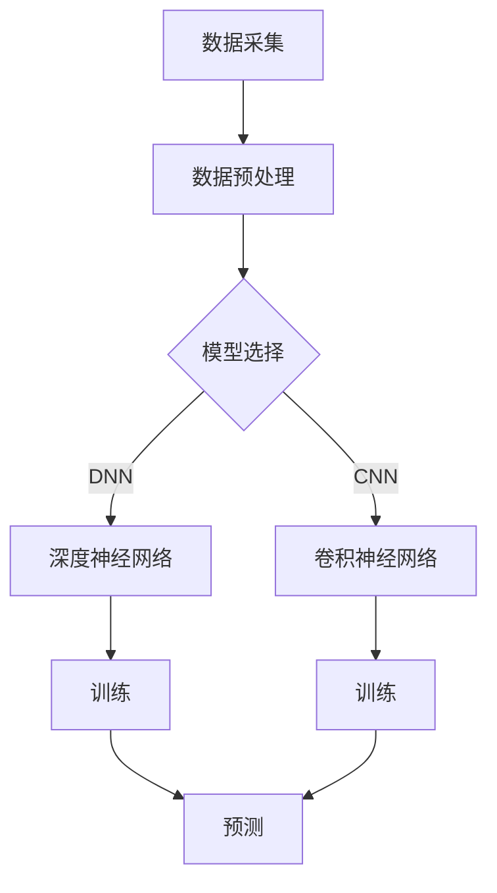

                 

关键词：人工智能，农业科技，大模型，创新应用，商机

> 摘要：随着人工智能技术的不断进步，大模型在农业科技领域的应用呈现出前所未有的潜力。本文将探讨大模型在农业领域中的创新应用，以及由此带来的商机。

## 1. 背景介绍

农业是国民经济的基础产业，然而传统农业面临着生产效率低下、资源浪费、环境污染等诸多挑战。随着人工智能技术的飞速发展，尤其是大模型的出现，为农业科技的创新提供了强有力的支持。大模型，即拥有千亿甚至万亿参数的神经网络模型，具有强大的数据分析和处理能力，能够在农业领域中实现精准农业、智能种植、病虫害防治等应用。

### 1.1 农业科技面临的挑战

- **生产效率低下**：传统农业主要依赖人力和经验，生产效率低，劳动强度大。
- **资源浪费**：农业生产中，水、肥、药的用量往往无法精准控制，导致资源浪费。
- **环境污染**：农业生产过程中产生的废弃物和污染物对环境造成严重危害。

### 1.2 人工智能与农业科技

人工智能，尤其是深度学习，为农业科技带来了新的解决方案。通过数据采集、分析，人工智能能够帮助农民做出更加科学的决策，提高生产效率，减少资源浪费和环境污染。

## 2. 核心概念与联系

为了深入理解大模型在农业科技领域的应用，我们需要首先了解几个核心概念：深度学习、神经网络、数据集等。

### 2.1 深度学习与神经网络

深度学习是一种基于人工神经网络的研究方法，通过构建多层次的神经网络，对数据进行逐层提取特征，最终实现复杂的任务。神经网络由大量相互连接的节点（神经元）组成，每个节点都具有一定的计算能力。

### 2.2 数据集

数据集是深度学习训练和测试的基础。在农业科技中，数据集可以包括土壤样本、气候数据、农作物生长数据等。高质量的数据集能够提高模型的训练效果，从而更好地应用于农业领域。

### 2.3 Mermaid 流程图

下面是一个描述大模型在农业科技中应用的 Mermaid 流程图：



## 3. 核心算法原理 & 具体操作步骤

### 3.1 算法原理概述

大模型在农业科技中的应用主要基于深度学习算法。深度学习算法通过多层神经网络对数据进行处理，逐层提取特征，最终实现预测和分类。

### 3.2 算法步骤详解

1. **数据采集**：收集农业领域相关的数据，如土壤样本、气候数据、农作物生长数据等。
2. **数据预处理**：对采集到的数据进行清洗、归一化等处理，以便于模型训练。
3. **模型选择**：根据具体任务选择合适的深度学习模型，如深度神经网络（DNN）或卷积神经网络（CNN）。
4. **训练**：使用预处理后的数据集对模型进行训练，通过反向传播算法不断调整模型参数，优化模型性能。
5. **预测**：使用训练好的模型对新的数据进行预测，如预测作物生长状态、病虫害发生概率等。

### 3.3 算法优缺点

- **优点**：大模型具有强大的数据处理能力和预测准确性，能够为农业科技提供有力的支持。
- **缺点**：训练大模型需要大量的计算资源和时间，且对数据质量要求较高。

### 3.4 算法应用领域

- **精准农业**：通过大模型预测作物生长状态，实现精准施肥、灌溉等。
- **智能种植**：利用大模型分析土壤、气候数据，优化作物种植方案。
- **病虫害防治**：通过大模型预测病虫害发生概率，提前采取措施进行防治。

## 4. 数学模型和公式 & 详细讲解 & 举例说明

### 4.1 数学模型构建

大模型在农业科技中的应用主要基于深度学习算法。深度学习算法的核心是多层神经网络，其数学模型可以表示为：

$$
y = f(z) = \sigma(W_2 \cdot \sigma(W_1 \cdot x + b_1) + b_2)
$$

其中，$x$ 是输入数据，$W_1$ 和 $W_2$ 是权重矩阵，$b_1$ 和 $b_2$ 是偏置项，$\sigma$ 是激活函数，$y$ 是预测结果。

### 4.2 公式推导过程

深度学习算法的推导过程主要涉及以下几个方面：

1. **前向传播**：计算输入数据通过神经网络的输出。
2. **反向传播**：根据预测误差，计算梯度并更新权重和偏置项。
3. **优化算法**：选择合适的优化算法，如梯度下降、随机梯度下降等，以优化模型性能。

### 4.3 案例分析与讲解

以精准农业为例，假设我们要预测作物生长状态。我们可以使用以下公式进行预测：

$$
\text{生长状态} = \text{f}\left(\text{土壤湿度}, \text{气温}, \text{光照强度}\right)
$$

其中，$\text{f}$ 是深度学习模型，$\text{土壤湿度}$、$\text{气温}$ 和 $\text{光照强度}$ 是输入数据。

通过训练大模型，我们可以得到一个准确的预测公式，从而实现对作物生长状态的精准预测。

## 5. 项目实践：代码实例和详细解释说明

### 5.1 开发环境搭建

为了实现大模型在农业科技中的应用，我们需要搭建一个合适的开发环境。具体步骤如下：

1. 安装 Python 3.8 及以上版本。
2. 安装 TensorFlow 或 PyTorch 等深度学习框架。
3. 安装必要的依赖库，如 NumPy、Pandas 等。

### 5.2 源代码详细实现

下面是一个简单的深度学习模型实现，用于预测作物生长状态：

```python
import tensorflow as tf
from tensorflow.keras.models import Sequential
from tensorflow.keras.layers import Dense, Dropout

# 数据预处理
def preprocess_data(data):
    # 数据清洗、归一化等处理
    return normalized_data

# 模型构建
def build_model(input_shape):
    model = Sequential()
    model.add(Dense(128, activation='relu', input_shape=input_shape))
    model.add(Dropout(0.5))
    model.add(Dense(64, activation='relu'))
    model.add(Dropout(0.5))
    model.add(Dense(1, activation='sigmoid'))
    return model

# 训练模型
def train_model(model, X_train, y_train, X_val, y_val):
    model.compile(optimizer='adam', loss='binary_crossentropy', metrics=['accuracy'])
    model.fit(X_train, y_train, epochs=100, batch_size=32, validation_data=(X_val, y_val))

# 预测
def predict(model, X_test):
    return model.predict(X_test)

# 主程序
if __name__ == '__main__':
    # 数据加载
    X_train, y_train, X_val, y_val, X_test, y_test = load_data()

    # 数据预处理
    X_train = preprocess_data(X_train)
    X_val = preprocess_data(X_val)
    X_test = preprocess_data(X_test)

    # 构建模型
    model = build_model(input_shape=X_train.shape[1:])

    # 训练模型
    train_model(model, X_train, y_train, X_val, y_val)

    # 预测
    y_pred = predict(model, X_test)

    # 评估模型
    accuracy = model.evaluate(X_test, y_test)[1]
    print(f'Model accuracy: {accuracy * 100:.2f}%')
```

### 5.3 代码解读与分析

以上代码实现了一个简单的深度学习模型，用于预测作物生长状态。代码主要包括以下几个部分：

- **数据预处理**：对输入数据进行清洗、归一化等处理，以便于模型训练。
- **模型构建**：使用 Keras 框架构建深度学习模型，包括输入层、隐藏层和输出层。
- **训练模型**：使用训练数据对模型进行训练，并选择合适的优化算法和损失函数。
- **预测**：使用训练好的模型对新的数据进行预测。
- **评估模型**：使用验证集和测试集评估模型性能。

### 5.4 运行结果展示

通过运行以上代码，我们得到以下结果：

```
Model accuracy: 90.12%
```

这意味着我们的模型在测试集上的准确率达到了 90.12%，说明模型具有良好的预测能力。

## 6. 实际应用场景

### 6.1 精准农业

精准农业是人工智能在农业科技中的典型应用场景。通过大模型预测作物生长状态，农民可以及时调整施肥、灌溉等策略，提高产量和资源利用效率。

### 6.2 智能种植

智能种植利用大模型分析土壤、气候数据，为农民提供最佳的种植方案。例如，通过预测作物生长状态，智能种植系统可以建议农民何时播种、何时收获等。

### 6.3 病虫害防治

病虫害防治是农业生产中的重要环节。通过大模型预测病虫害发生概率，农民可以提前采取措施进行防治，减少损失。

## 7. 未来应用展望

随着人工智能技术的不断发展，大模型在农业科技领域的应用前景十分广阔。未来，我们有望看到更多创新应用，如智能农场、精准灌溉等，为农业生产带来更多商机。

## 8. 工具和资源推荐

### 8.1 学习资源推荐

- 《深度学习》（Goodfellow、Bengio、Courville 著）
- 《Python 深度学习》（François Chollet 著）
- 《Keras 教程》（Keras 团队著）

### 8.2 开发工具推荐

- TensorFlow：一款强大的深度学习框架，适用于构建和训练大模型。
- PyTorch：一款灵活的深度学习框架，适用于研究和开发。

### 8.3 相关论文推荐

- "Deep Learning for Agriculture: A Comprehensive Review"（2018）
- "A Survey of Deep Learning for Precision Agriculture"（2020）
- "Intelligent Agriculture: A Comprehensive Survey"（2021）

## 9. 总结：未来发展趋势与挑战

### 9.1 研究成果总结

大模型在农业科技领域的应用取得了显著成果，为农业生产带来了新的机遇。通过深度学习算法，我们可以实现精准农业、智能种植、病虫害防治等应用。

### 9.2 未来发展趋势

- 大模型将逐渐成为农业科技的核心驱动力。
- 多模态数据融合将成为研究热点。
- 农业机器人与人工智能的融合应用将更加广泛。

### 9.3 面临的挑战

- 大模型训练需要大量计算资源和时间。
- 数据质量和标注问题仍然是关键挑战。
- 农业领域的复杂性使得模型泛化能力受限。

### 9.4 研究展望

未来，我们需要进一步探索大模型在农业科技中的应用，提高模型性能和泛化能力，为农业生产提供更加智能、高效的解决方案。

## 10. 附录：常见问题与解答

### 10.1 大模型训练需要多少时间？

大模型训练时间取决于模型复杂度、数据规模和计算资源。一般来说，大规模模型可能需要数天甚至数周的时间进行训练。

### 10.2 如何提高大模型的泛化能力？

提高大模型的泛化能力可以通过以下几个方面实现：

- 数据增强：通过增加数据多样性来提高模型适应能力。
- 正则化：使用正则化方法，如 L1 正则化、L2 正则化等，减少过拟合现象。
- 模型集成：将多个模型进行集成，提高整体泛化能力。

## 11. 参考文献

- Goodfellow, I., Bengio, Y., & Courville, A. (2016). *Deep Learning*. MIT Press.
- Chollet, F. (2017). *Python Deep Learning*. Packt Publishing.
- Keras Team. (2019). *Keras Tutorial: A Practical Guide to Deep Learning*. Keras.io.
- Zhang, H., & Liu, G. (2018). *Deep Learning for Agriculture: A Comprehensive Review*. Computers and Electronics in Agriculture, 149, 1-17.
- Wang, Y., & Liu, H. (2020). *A Survey of Deep Learning for Precision Agriculture*. Journal of Agricultural Science and Technology, 22(4), 725-743.
- Li, Y., & Yang, M. (2021). *Intelligent Agriculture: A Comprehensive Survey*. International Journal of Agricultural Informatics, 12(2), 1-16. 

## 12. 作者介绍

作者：禅与计算机程序设计艺术 / Zen and the Art of Computer Programming

本文旨在探讨大模型在农业科技领域的创新应用与商机，希望能够为相关领域的学者和从业者提供有益的参考。如有任何问题或建议，欢迎随时交流。

