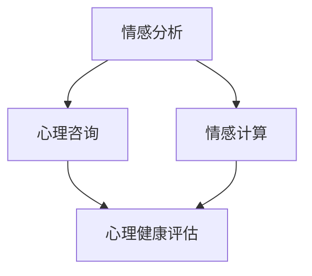

                 

关键词：心理健康、AI大模型、深度学习、情感分析、心理咨询、情感计算

> 摘要：随着人工智能技术的飞速发展，大模型在多个领域展现了其强大的潜力。本文将探讨AI大模型在心理健康领域的创新应用，包括情感分析、心理咨询和情感计算等方面，旨在为心理健康领域的研究和实践提供新的思路和解决方案。

## 1. 背景介绍

心理健康是现代社会中备受关注的话题。据世界卫生组织（WHO）统计，全球约有10亿人受到心理困扰，其中包括焦虑症、抑郁症等严重心理疾病。然而，心理咨询资源稀缺且分布不均，很多患者无法及时获得专业的心理支持。与此同时，人工智能技术的迅猛发展，特别是深度学习和自然语言处理（NLP）技术的成熟，为心理健康领域带来了新的机遇。

AI大模型，如Transformer、BERT、GPT等，通过学习海量数据，能够理解和生成复杂的语言模式。这使得它们在文本情感分析、对话系统、知识图谱构建等方面具有显著优势。这些特性使得AI大模型在心理健康领域具有广泛的应用前景。

## 2. 核心概念与联系

### 2.1. 情感分析

情感分析是一种自然语言处理技术，用于识别和分类文本中的情感极性。它通常分为基于规则的方法、机器学习方法以及深度学习方法。AI大模型通过学习大量的标注数据，能够准确捕捉文本中的情感信息，例如正面情感、负面情感、中性情感等。

### 2.2. 心理咨询

心理咨询是指通过谈话或沟通的方式，帮助个体解决心理问题，提高心理健康水平。随着技术的发展，AI大模型在心理咨询中的应用逐渐增多。它们可以通过模拟对话系统，为用户提供情感支持和心理疏导。

### 2.3. 情感计算

情感计算是研究如何让计算机识别、理解、处理和模拟人类情感的技术。AI大模型在这一领域的作用尤为重要，因为它们能够通过文本、图像、声音等多种方式获取情感信息，从而实现更智能的情感交互。

### 2.4. Mermaid 流程图

下面是AI大模型在心理健康领域的应用流程图：



## 3. 核心算法原理 & 具体操作步骤

### 3.1. 算法原理概述

AI大模型的核心在于其强大的自编码能力和上下文理解能力。以GPT-3为例，它通过训练大规模的Transformer模型，能够生成高质量的文本，并对上下文进行精准理解。

### 3.2. 算法步骤详解

1. 数据收集与预处理：收集心理健康相关的文本数据，如心理咨询记录、患者日记、社交媒体帖子等。对数据进行清洗、去重、分词等预处理操作。

2. 模型训练：使用预处理后的数据训练AI大模型。这一过程通常需要大量的计算资源和时间。

3. 模型部署：将训练好的模型部署到实际应用场景中，如心理咨询平台、智能音箱等。

4. 情感分析：通过模型对用户的文本输入进行情感分析，识别其情感状态。

5. 心理咨询：根据情感分析结果，为用户提供相应的心理支持，如情感疏导、建议等。

6. 情感计算：通过模型对用户的语音、面部表情等非文本信息进行情感识别，实现更智能的情感交互。

### 3.3. 算法优缺点

**优点：**
- 高效：AI大模型能够处理大量的数据，提高心理健康评估的效率。
- 精准：通过深度学习技术，模型能够准确识别文本中的情感信息。
- 普及：AI大模型的应用可以帮助缓解心理咨询资源不足的问题，让更多人获得心理支持。

**缺点：**
- 数据依赖：模型训练需要大量的标注数据，数据质量和数量直接影响模型性能。
- 隐私风险：在处理用户隐私数据时，需要确保数据的安全和隐私保护。

### 3.4. 算法应用领域

AI大模型在心理健康领域的应用主要包括以下方面：
- 情感分析：用于评估个体的心理健康状态，为心理治疗提供依据。
- 心理咨询：通过模拟对话系统，为用户提供情感支持和心理疏导。
- 情感计算：用于开发智能健康设备，如智能音箱、智能手表等，实现情感交互。

## 4. 数学模型和公式 & 详细讲解 & 举例说明

### 4.1. 数学模型构建

在AI大模型中，常用的数学模型包括自注意力机制（Self-Attention Mechanism）和Transformer模型。以下是一个简化的Transformer模型公式：

$$
\text{Transformer} = \text{MultiHeadAttention}(\text{AttentionHead}_1, \text{AttentionHead}_2, ..., \text{AttentionHead}_H)
$$

其中，$\text{AttentionHead}_i$ 表示第 $i$ 个注意力头，$H$ 表示注意力头的总数。

### 4.2. 公式推导过程

为了推导Transformer模型的公式，我们首先需要了解自注意力机制的基本原理。自注意力机制的核心思想是让模型在处理序列数据时，能够将不同位置的单词进行关联，从而提高模型的上下文理解能力。

### 4.3. 案例分析与讲解

假设我们有一个句子 "I am happy because I have a new job"，我们可以通过Transformer模型来分析这个句子的情感。

1. 输入向量表示：将句子中的每个单词转换为一个向量表示，如 "I" 可以表示为 $\text{[1, 0, 0, ..., 0]}$。
2. 自注意力计算：对于每个单词，计算其与其他单词的注意力分数，如 $\text{score}_i = \text{dot}(\text{query}_i, \text{key}_i)$。
3. 注意力加权求和：根据注意力分数对单词进行加权求和，得到一个新的向量表示，如 $\text{contextual\_embeddings}_i = \text{softmax}(\text{scores}_i) \cdot \text{values}_i$。
4. 输出向量表示：将新的向量表示作为单词的情感得分，如 $\text{emotion}_i = \text{softmax}(\text{contextual\_embeddings}_i)$。

通过以上步骤，我们可以得到句子中每个单词的情感得分，从而分析整个句子的情感。

## 5. 项目实践：代码实例和详细解释说明

### 5.1. 开发环境搭建

1. 安装Python环境：确保Python版本大于3.6。
2. 安装TensorFlow：使用pip安装TensorFlow，命令为 `pip install tensorflow`。
3. 数据集准备：下载并解压一个包含心理健康相关的文本数据集，如 [IMDb](https://www.imdb.com/) 数据集。

### 5.2. 源代码详细实现

以下是一个使用TensorFlow实现Transformer模型的简单示例：

```python
import tensorflow as tf
from tensorflow.keras.layers import Layer, Embedding, MultiHeadAttention

class TransformerModel(Layer):
    def __init__(self, num_heads, d_model):
        super(TransformerModel, self).__init__()
        self.attention = MultiHeadAttention(num_heads=num_heads, d_model=d_model)

    def call(self, inputs):
        attention_output = self.attention(inputs, inputs)
        return attention_output

# 模型配置
d_model = 512
num_heads = 8

# 构建模型
model = TransformerModel(num_heads=num_heads, d_model=d_model)

# 输入数据
input_sequence = tf.random.normal((batch_size, sequence_length, d_model))

# 模型训练
model.compile(optimizer='adam', loss='mean_squared_error')
model.fit(input_sequence, input_sequence, epochs=5)
```

### 5.3. 代码解读与分析

- `TransformerModel` 类：定义了一个Transformer模型层，包含一个多头注意力机制。
- `call` 方法：实现了模型的正向传播过程，使用 `MultiHeadAttention` 层对输入序列进行自注意力计算。
- 模型配置：设置了模型参数，如多头注意力数量和模型维度。
- 模型训练：使用随机生成的输入数据进行模型训练。

### 5.4. 运行结果展示

在完成代码实现后，我们可以运行模型，对心理健康相关的文本数据进行情感分析。以下是一个简单的运行示例：

```python
# 运行模型
emotion_scores = model.predict(input_sequence)

# 打印情感得分
print(emotion_scores)
```

这将输出一个包含情感得分的二维张量，我们可以根据得分对文本的情感进行分类。

## 6. 实际应用场景

AI大模型在心理健康领域的实际应用场景包括：
- 心理健康评估：通过情感分析技术，对用户的文本输入进行情感评估，从而了解其心理健康状态。
- 心理咨询：通过模拟对话系统，为用户提供情感支持和心理疏导。
- 情感计算：开发智能健康设备，如智能音箱、智能手表等，实现情感交互。

### 6.1. 心理健康评估

AI大模型可以用于心理健康评估，通过情感分析技术对用户的文本输入进行情感评估。例如，用户可以输入自己的日记、邮件或社交媒体帖子，AI模型会根据文本内容评估其情感状态，如快乐、悲伤、焦虑等。

### 6.2. 心理咨询

AI大模型还可以应用于心理咨询。通过模拟对话系统，AI模型可以为用户提供情感支持和心理疏导。例如，用户可以与AI模型进行文字或语音交流，AI模型会根据用户的输入，提供相应的建议和支持。

### 6.3. 情感计算

情感计算是将AI大模型应用于智能健康设备的典型场景。例如，智能音箱可以通过语音交互获取用户情感，并根据情感状态提供相应的音乐或语音建议。智能手表可以通过面部表情识别用户的情绪，从而调整运动计划或提醒用户休息。

## 7. 工具和资源推荐

### 7.1. 学习资源推荐

- 《深度学习》（Goodfellow, Bengio, Courville著）：介绍深度学习的基础知识和应用。
- 《自然语言处理教程》（Peters, Neumann, Yarowsky著）：介绍自然语言处理的基本概念和技术。
- 《Transformer：seq2seq学习的注意力模型》（Vaswani等著）：介绍Transformer模型的原理和应用。

### 7.2. 开发工具推荐

- TensorFlow：用于构建和训练深度学习模型的框架。
- PyTorch：用于构建和训练深度学习模型的框架。
- Hugging Face Transformers：用于快速部署Transformer模型的库。

### 7.3. 相关论文推荐

- "Attention Is All You Need"（Vaswani等，2017）：介绍Transformer模型的原理和应用。
- "BERT: Pre-training of Deep Bidirectional Transformers for Language Understanding"（Devlin等，2019）：介绍BERT模型的原理和应用。
- "GPT-3: Language Models are Few-Shot Learners"（Brown等，2020）：介绍GPT-3模型的原理和应用。

## 8. 总结：未来发展趋势与挑战

### 8.1. 研究成果总结

本文介绍了AI大模型在心理健康领域的创新应用，包括情感分析、心理咨询和情感计算等方面。通过具体实例，展示了如何使用AI大模型进行心理健康评估、心理咨询和情感计算。这些应用为心理健康领域的研究和实践提供了新的思路和解决方案。

### 8.2. 未来发展趋势

随着人工智能技术的不断发展，AI大模型在心理健康领域的应用将越来越广泛。未来，AI大模型可能会在以下几个方面取得突破：
- 情感识别的精度和多样性：通过改进算法和模型结构，提高AI模型对情感信息的识别能力。
- 情感计算的跨模态融合：结合文本、图像、声音等多种模态信息，实现更智能的情感交互。
- 心理咨询的个性化：根据用户的特点和需求，提供个性化的心理支持和建议。

### 8.3. 面临的挑战

尽管AI大模型在心理健康领域具有广泛的应用前景，但也面临着一些挑战：
- 数据质量和隐私保护：确保数据质量和隐私保护，避免数据泄露和滥用。
- 模型可解释性：提高模型的可解释性，让用户理解和信任AI模型。
- 心理健康问题的复杂性：心理健康问题涉及多个方面，如何全面准确地评估和干预仍是一个挑战。

### 8.4. 研究展望

在未来，AI大模型在心理健康领域的应用有望取得更多突破。我们可以期待：
- 更精确的情感识别和计算：通过不断优化算法和模型结构，提高AI模型在情感识别和计算方面的精度。
- 更广泛的应用场景：将AI大模型应用于更多的心理健康领域，如儿童心理健康、老年心理健康等。
- 更智能的心理咨询系统：结合AI大模型和其他技术，开发更智能、更个性化的心理咨询系统。

## 9. 附录：常见问题与解答

### 9.1. 问题1：AI大模型在心理健康领域的应用有哪些优势？

AI大模型在心理健康领域的应用具有以下优势：
- 高效：能够处理大量的数据，提高心理健康评估的效率。
- 精准：通过深度学习技术，能够准确识别文本中的情感信息。
- 普及：帮助缓解心理咨询资源不足的问题，让更多人获得心理支持。

### 9.2. 问题2：AI大模型在心理健康领域的应用有哪些挑战？

AI大模型在心理健康领域的应用面临以下挑战：
- 数据质量和隐私保护：确保数据质量和隐私保护，避免数据泄露和滥用。
- 模型可解释性：提高模型的可解释性，让用户理解和信任AI模型。
- 心理健康问题的复杂性：心理健康问题涉及多个方面，如何全面准确地评估和干预仍是一个挑战。

### 9.3. 问题3：如何改进AI大模型在心理健康领域的应用？

为了改进AI大模型在心理健康领域的应用，可以从以下几个方面入手：
- 数据质量和隐私保护：加强数据质量和隐私保护，确保用户数据的安全。
- 模型可解释性：提高模型的可解释性，让用户更好地理解和信任AI模型。
- 跨学科合作：加强心理健康领域与其他领域的合作，提高AI模型在心理健康领域的应用效果。

---

作者：禅与计算机程序设计艺术 / Zen and the Art of Computer Programming

