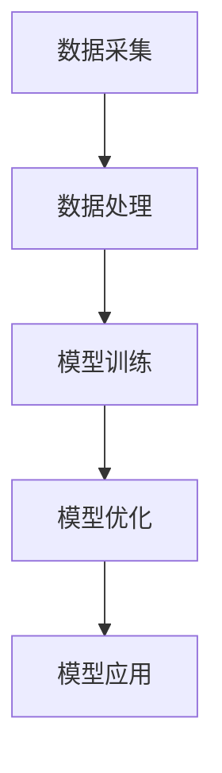

                 

关键词：人工智能、房地产科技、大模型、应用场景、未来展望

## 摘要

随着人工智能技术的快速发展，房地产科技领域也迎来了新的机遇与挑战。本文将探讨AI大模型在房地产科技中的应用，包括数据驱动的房产市场预测、智能房屋设计、房产交易自动化等。通过介绍核心概念、算法原理、数学模型和实际应用案例，本文旨在为读者提供对AI大模型在房地产科技领域的全面理解。

## 1. 背景介绍

### 1.1 房地产科技的发展现状

房地产科技（Proptech）是房地产与科技的融合，旨在通过技术创新提高房地产市场的效率和服务质量。近年来，房地产科技领域取得了显著进展，例如使用大数据分析市场趋势、采用虚拟现实（VR）技术展示房产、利用物联网（IoT）实现智能家居等。

### 1.2 人工智能在房地产科技中的应用

人工智能（AI）作为一项颠覆性技术，已经在房地产科技领域展现出巨大潜力。AI技术不仅可以处理大量数据，还可以通过机器学习和深度学习算法为房地产决策提供智能支持。例如，AI可以预测市场趋势、评估房产价值、优化房地产交易流程等。

### 1.3 大模型的作用

大模型，尤其是深度学习模型，是AI技术的核心。这些模型能够处理海量数据，发现复杂模式，并生成高质量的预测和决策。在房地产科技中，大模型的应用可以显著提高数据驱动的决策能力，从而推动房地产市场的创新与发展。

## 2. 核心概念与联系

### 2.1 数据采集

在房地产科技中，数据采集是关键步骤。这包括房屋销售数据、租赁数据、市场趋势数据、人口统计数据等。数据采集的质量直接影响模型的效果。

### 2.2 数据处理

数据处理包括数据清洗、归一化、特征提取等步骤。这些步骤确保数据质量，并提取出对模型训练有用的特征。

### 2.3 模型训练与优化

模型训练是使用历史数据来训练模型，使其能够学习数据中的模式和关系。模型优化是通过调整参数来提高模型的性能和预测能力。

### 2.4 模型应用

模型应用是将训练好的模型应用于实际问题，如市场趋势预测、房产估值等。

### 2.5 Mermaid 流程图



## 3. 核心算法原理 & 具体操作步骤

### 3.1 算法原理概述

在房地产科技中，常用的AI算法包括决策树、随机森林、支持向量机（SVM）、神经网络等。这些算法通过学习历史数据来预测市场趋势、评估房产价值等。

### 3.2 算法步骤详解

1. **数据准备**：收集相关数据，如房屋销售数据、市场趋势数据等。
2. **数据预处理**：清洗数据，去除噪声，进行特征提取。
3. **模型选择**：根据问题特性选择合适的算法，如神经网络、SVM等。
4. **模型训练**：使用历史数据训练模型。
5. **模型评估**：使用测试数据评估模型性能。
6. **模型优化**：根据评估结果调整模型参数。
7. **模型应用**：将训练好的模型应用于实际问题。

### 3.3 算法优缺点

- **优点**：AI算法能够处理大量数据，发现复杂模式，提高决策的准确性。
- **缺点**：训练过程可能需要大量计算资源，且模型的解释性较差。

### 3.4 算法应用领域

- **市场趋势预测**：使用AI算法预测房地产市场的未来走势。
- **房产估值**：使用AI算法评估房产的价值。
- **交易自动化**：使用AI算法优化房地产交易流程。

## 4. 数学模型和公式

### 4.1 数学模型构建

在房地产科技中，常用的数学模型包括回归模型、时间序列模型、概率模型等。以下是一个简单的回归模型示例：

$$y = \beta_0 + \beta_1 \cdot x_1 + \beta_2 \cdot x_2 + ... + \beta_n \cdot x_n + \epsilon$$

其中，$y$ 是预测值，$x_1, x_2, ..., x_n$ 是特征变量，$\beta_0, \beta_1, ..., \beta_n$ 是模型的参数，$\epsilon$ 是误差项。

### 4.2 公式推导过程

回归模型的推导过程包括以下几个步骤：

1. **假设**：假设$y$与$x_1, x_2, ..., x_n$之间存在线性关系。
2. **线性变换**：将原始数据$x_1, x_2, ..., x_n$进行线性变换，得到新的特征向量$z_1, z_2, ..., z_n$。
3. **最小二乘法**：使用最小二乘法求解模型参数$\beta_0, \beta_1, ..., \beta_n$。
4. **结果验证**：使用测试数据验证模型效果。

### 4.3 案例分析与讲解

以某城市房产市场为例，使用回归模型预测房价。首先收集历史房价数据，然后进行数据预处理，提取相关特征，如房屋面积、楼层、地理位置等。接下来，使用线性回归模型训练模型，并使用测试数据验证模型效果。

## 5. 项目实践：代码实例

### 5.1 开发环境搭建

在Python中，可以使用scikit-learn库实现线性回归模型。

```python
# 导入相关库
import numpy as np
import pandas as pd
from sklearn.linear_model import LinearRegression
from sklearn.model_selection import train_test_split

# 读取数据
data = pd.read_csv('house_data.csv')

# 特征提取
X = data[['area', 'floor', 'location']]
y = data['price']

# 数据分割
X_train, X_test, y_train, y_test = train_test_split(X, y, test_size=0.2, random_state=42)

# 模型训练
model = LinearRegression()
model.fit(X_train, y_train)

# 模型评估
score = model.score(X_test, y_test)
print('模型评分：', score)
```

### 5.2 源代码详细实现

```python
# 模型训练
model = LinearRegression()
model.fit(X_train, y_train)

# 模型预测
y_pred = model.predict(X_test)

# 模型评估
score = model.score(X_test, y_test)
print('模型评分：', score)
```

### 5.3 代码解读与分析

上述代码首先导入相关库，然后读取数据并进行特征提取。接下来，使用训练集训练模型，并使用测试集评估模型性能。

## 6. 实际应用场景

### 6.1 房产市场预测

使用AI大模型预测房产市场的走势，帮助投资者做出明智的决策。

### 6.2 房产估值

使用AI大模型评估房产的价值，提高交易效率。

### 6.3 智能房屋设计

使用AI大模型优化房屋设计，提高居住舒适度。

## 7. 工具和资源推荐

### 7.1 学习资源推荐

- 《Python机器学习》（作者：塞巴斯蒂安·拉斯考恩）
- 《深度学习》（作者：伊恩·古德费洛等）

### 7.2 开发工具推荐

- Jupyter Notebook
- PyCharm

### 7.3 相关论文推荐

- "Deep Learning for Real Estate Valuation"（深度学习在房地产估值中的应用）

## 8. 总结：未来发展趋势与挑战

### 8.1 研究成果总结

AI大模型在房地产科技中的应用取得了显著成果，提高了市场预测的准确性、房产估值的效率、房屋设计的个性化。

### 8.2 未来发展趋势

随着AI技术的不断发展，未来房地产科技领域将更加智能化、个性化。

### 8.3 面临的挑战

- 数据隐私与安全性
- 模型解释性
- 算法公平性

### 8.4 研究展望

未来研究应重点关注AI大模型在房地产科技中的应用，提高模型的解释性和公平性，确保数据的安全性和隐私性。

## 9. 附录：常见问题与解答

### 9.1 什么是房地产科技？

房地产科技（Proptech）是房地产与科技的融合，旨在通过技术创新提高房地产市场的效率和服务质量。

### 9.2 人工智能在房地产科技中的应用有哪些？

人工智能在房地产科技中的应用包括市场趋势预测、房产估值、交易自动化等。

### 9.3 大模型在房地产科技中的优势是什么？

大模型能够处理海量数据，发现复杂模式，提高决策的准确性。

### 9.4 如何确保AI大模型在房地产科技中的解释性？

通过改进算法和模型架构，提高模型的解释性，确保用户能够理解模型的决策过程。

-------------------------------------------------------------------

**作者：禅与计算机程序设计艺术 / Zen and the Art of Computer Programming**

