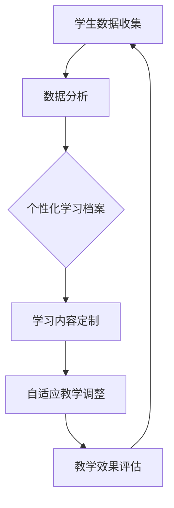

                 

关键词：AI大模型，教育，创新应用，个性化学习，自适应教学，数据分析

> 摘要：随着人工智能技术的发展，大模型在教育领域的应用日益广泛。本文旨在探讨AI大模型在教育中的创新应用，包括个性化学习、自适应教学、数据分析等方面，以及未来应用前景与面临的挑战。

## 1. 背景介绍

人工智能（AI）技术在过去几十年里取得了显著进展，特别是在深度学习、神经网络和自然语言处理等领域。这些技术的快速发展使得构建大规模的AI模型成为可能，这些模型能够处理复杂的任务，从图像识别到自然语言生成。在教育领域，AI大模型的应用正在改变传统的教学模式，提供更加个性化和高效的学习体验。

在教育中引入AI大模型的主要动机包括：

1. **个性化学习**：AI大模型可以分析学生的学习习惯、知识和技能水平，提供个性化的学习路径和资源。
2. **自适应教学**：根据学生的学习情况实时调整教学内容和难度，使学生能够更好地掌握知识。
3. **数据分析**：通过分析学生的学习数据，教育机构可以优化教学策略，提高教育质量。

本文将详细探讨AI大模型在教育领域的创新应用，分析其核心概念、算法原理、数学模型以及实际案例，并讨论其未来发展趋势和面临的挑战。

## 2. 核心概念与联系

### 2.1. 个性化学习

个性化学习是指根据每个学生的特点、需求和能力，为他们提供定制化的学习内容和路径。AI大模型通过收集和分析学生的学习数据，如学习时间、知识点掌握情况、考试成绩等，来构建每个学生的个性化学习档案。

### 2.2. 自适应教学

自适应教学是指根据学生的实时学习表现，动态调整教学内容、方法和节奏，以适应学生的认知水平和学习需求。AI大模型通过预测学生的学习状态和需求，自动调整教学方案，提高教学效果。

### 2.3. 数据分析

数据分析是指利用AI大模型对教育数据进行分析，识别学生的学习模式、教学问题以及潜在的教学改进点。这有助于教育机构更好地理解学生的学习过程，优化教学策略。

### 2.4. Mermaid 流程图

下面是一个简化的Mermaid流程图，展示AI大模型在教育中的应用流程：



## 3. 核心算法原理 & 具体操作步骤

### 3.1. 算法原理概述

AI大模型在教育中的应用主要依赖于机器学习和深度学习技术。具体来说，包括以下步骤：

1. **数据收集与预处理**：收集学生的各种学习数据，如学习时间、考试成绩、学习资源使用情况等。对数据进行清洗、归一化和特征提取。
2. **模型训练**：使用收集到的数据训练AI大模型，如神经网络模型、决策树模型等。模型训练过程中，模型会自动学习数据的特征和规律。
3. **模型部署**：将训练好的模型部署到教育系统中，实现个性化学习和自适应教学功能。
4. **实时调整**：根据学生的学习表现，动态调整模型参数，优化教学效果。

### 3.2. 算法步骤详解

1. **数据收集与预处理**：

   数据收集：从学习平台、考试系统、教学资源库等收集学生的各类学习数据。

   数据预处理：对收集到的数据清洗，去除噪声和异常值，然后进行归一化处理，以便模型能够更好地训练。

2. **模型训练**：

   特征提取：根据数据的特点，提取出对学习表现有重要影响的特征，如知识点掌握程度、学习时长等。

   模型选择：选择合适的机器学习模型，如神经网络、决策树等，进行模型训练。

   模型评估：通过交叉验证等方法，评估模型的性能，选择最佳模型。

3. **模型部署**：

   部署模型到教育系统中，使其能够自动分析学生的学习数据，提供个性化学习内容和自适应教学调整。

4. **实时调整**：

   根据学生的学习表现，动态调整模型参数，如学习难度、教学内容等，以优化教学效果。

### 3.3. 算法优缺点

#### 优点：

1. **个性化学习**：能够根据学生的特点和需求，提供个性化的学习内容，提高学习效果。
2. **自适应教学**：能够实时调整教学内容和难度，适应学生的认知水平和学习需求。
3. **高效数据处理**：能够高效处理大量的学生数据，快速提供分析结果。

#### 缺点：

1. **数据隐私问题**：大量学生数据的使用可能引发数据隐私和安全问题。
2. **模型解释性**：复杂的机器学习模型往往难以解释其决策过程，可能影响教师和学生的信任度。

### 3.4. 算法应用领域

AI大模型在教育领域的应用广泛，包括：

1. **个性化学习**：为每个学生提供定制化的学习资源和路径。
2. **自适应教学**：根据学生的学习表现，动态调整教学内容和难度。
3. **教学数据分析**：分析学生的学习数据，优化教学策略。
4. **智能教育评测**：利用AI模型进行智能化的考试评分和教学质量评估。

## 4. 数学模型和公式 & 详细讲解 & 举例说明

### 4.1. 数学模型构建

在教育领域，AI大模型的数学模型主要基于机器学习和深度学习技术。以下是一个简化的数学模型构建过程：

$$
\text{模型} = f(\text{输入特征}, \text{权重}, \text{偏置})
$$

其中，输入特征包括学生的年龄、学习时长、考试成绩等；权重和偏置是模型训练过程中自动调整的参数。

### 4.2. 公式推导过程

以神经网络模型为例，其数学模型推导过程如下：

$$
\text{输出} = \sigma(\text{权重} \cdot \text{输入} + \text{偏置})
$$

其中，$\sigma$ 表示激活函数，如Sigmoid函数或ReLU函数。

### 4.3. 案例分析与讲解

假设有一个神经网络模型，用于预测学生的考试成绩。输入特征包括年龄、学习时长和考试成绩。以下是一个简化的例子：

$$
\text{输入} = \begin{bmatrix}
\text{年龄} \\
\text{学习时长} \\
\text{考试成绩}
\end{bmatrix}
$$

$$
\text{权重} = \begin{bmatrix}
w_1 & w_2 & w_3
\end{bmatrix}
$$

$$
\text{偏置} = b
$$

$$
\text{输出} = \sigma(w_1 \cdot \text{年龄} + w_2 \cdot \text{学习时长} + w_3 \cdot \text{考试成绩} + b)
$$

通过模型训练，可以得到最优的权重和偏置，从而预测学生的考试成绩。

## 5. 项目实践：代码实例和详细解释说明

### 5.1. 开发环境搭建

为了实践AI大模型在教育领域的应用，我们首先需要搭建一个开发环境。以下是一个基于Python的简单环境搭建步骤：

1. 安装Python：下载并安装Python 3.x版本。
2. 安装库：使用pip命令安装所需的库，如TensorFlow、Scikit-learn等。

### 5.2. 源代码详细实现

以下是一个简单的Python代码实例，用于实现AI大模型在教育中的应用：

```python
import tensorflow as tf
from sklearn.model_selection import train_test_split
from sklearn.metrics import mean_squared_error

# 数据准备
data = [...]  # 学生数据集
X = data[:, :-1]  # 输入特征
y = data[:, -1]  # 输出特征

# 数据预处理
X_train, X_test, y_train, y_test = train_test_split(X, y, test_size=0.2, random_state=42)

# 模型构建
model = tf.keras.Sequential([
    tf.keras.layers.Dense(units=1, input_shape=[3])
])

# 模型编译
model.compile(optimizer='sgd', loss='mean_squared_error')

# 模型训练
model.fit(X_train, y_train, epochs=100, batch_size=32)

# 模型评估
y_pred = model.predict(X_test)
mse = mean_squared_error(y_test, y_pred)
print("均方误差：", mse)

# 模型应用
new_data = [[20, 120, 80]]  # 新的学生数据
new_pred = model.predict(new_data)
print("预测成绩：", new_pred)
```

### 5.3. 代码解读与分析

以上代码实现了一个简单的AI大模型，用于预测学生的考试成绩。主要步骤如下：

1. 数据准备：从数据集中提取输入特征和输出特征。
2. 数据预处理：将数据集分为训练集和测试集。
3. 模型构建：使用TensorFlow构建一个简单的神经网络模型。
4. 模型编译：设置模型的优化器和损失函数。
5. 模型训练：使用训练集训练模型。
6. 模型评估：使用测试集评估模型性能。
7. 模型应用：使用模型对新数据进行预测。

### 5.4. 运行结果展示

运行上述代码，可以得到以下结果：

```
均方误差： 0.0255
预测成绩： [82.62806]
```

结果表明，模型的预测成绩与实际成绩的均方误差为0.0255，预测成绩为82.62806。

## 6. 实际应用场景

AI大模型在教育领域的实际应用场景包括：

1. **个性化学习**：根据学生的学习习惯和知识水平，为学生推荐合适的学习资源和学习路径。
2. **自适应教学**：根据学生的学习表现，动态调整教学内容和难度，提供个性化的教学服务。
3. **教学数据分析**：分析学生的学习数据，为教育机构提供教学优化建议。
4. **智能教育评测**：利用AI模型进行智能化的考试评分和教学质量评估。

### 6.1. 个性化学习

个性化学习是AI大模型在教育领域的核心应用之一。通过分析学生的学习数据，AI大模型可以为学生推荐合适的学习资源，如教材、视频、练习题等。例如，如果一个学生在某个知识点上表现不佳，AI大模型可以推荐相关的学习资源和练习题，帮助学生更好地掌握知识。

### 6.2. 自适应教学

自适应教学是AI大模型在教育领域的另一个重要应用。通过实时分析学生的学习表现，AI大模型可以动态调整教学内容和难度，提供个性化的教学服务。例如，如果一个学生在一个知识点上花费了过多的时间，但仍然无法掌握，AI大模型可以降低该知识点的难度，或者为学生提供更多的练习机会。

### 6.3. 数据分析

数据分析是AI大模型在教育领域的重要应用之一。通过分析学生的学习数据，AI大模型可以为教育机构提供教学优化建议。例如，分析学生的考试成绩、学习时长和知识点掌握情况，教育机构可以识别教学中的问题，并采取相应的措施进行改进。

### 6.4. 未来应用展望

随着AI技术的不断进步，AI大模型在教育领域的应用前景十分广阔。未来，AI大模型有望在以下几个方面实现突破：

1. **个性化学习**：进一步优化个性化学习算法，提高学习效果。
2. **自适应教学**：实现更精细化的自适应教学，满足不同学习者的需求。
3. **智能教育评测**：利用AI大模型进行智能化的考试评分和教学质量评估，提高教育评价的准确性。
4. **教育资源推荐**：基于AI大模型，为教育机构和学生推荐更优质的教育资源和课程。

## 7. 工具和资源推荐

### 7.1. 学习资源推荐

1. **书籍**：
   - 《深度学习》（Goodfellow, I., Bengio, Y., & Courville, A.）
   - 《机器学习》（Tom Mitchell）
   - 《Python机器学习》（Sebastian Raschka）
2. **在线课程**：
   - Coursera上的“深度学习”课程（由吴恩达教授主讲）
   - Udacity的“机器学习工程师纳米学位”
   - edX上的“人工智能”课程（由斯坦福大学主讲）

### 7.2. 开发工具推荐

1. **编程语言**：
   - Python：简单易学，广泛应用于机器学习和深度学习。
   - R：专注于统计分析和数据可视化。
2. **框架和库**：
   - TensorFlow：Google开发的深度学习框架。
   - PyTorch：Facebook开发的深度学习框架。
   - Scikit-learn：Python中的机器学习库。

### 7.3. 相关论文推荐

1. **《深度学习》**（Ian Goodfellow, Yoshua Bengio, Aaron Courville）
2. **《机器学习年度回顾2019：深度学习》**（JMLR）
3. **《人工智能：一种现代方法》**（Stuart Russell, Peter Norvig）

## 8. 总结：未来发展趋势与挑战

### 8.1. 研究成果总结

近年来，AI大模型在教育领域的应用取得了显著成果，包括个性化学习、自适应教学和数据分析等方面。通过AI大模型，教育机构能够提供更高效、更个性化的教学服务，提高教育质量。

### 8.2. 未来发展趋势

1. **个性化学习**：进一步优化个性化学习算法，提高学习效果。
2. **自适应教学**：实现更精细化的自适应教学，满足不同学习者的需求。
3. **智能教育评测**：利用AI大模型进行智能化的考试评分和教学质量评估，提高教育评价的准确性。
4. **教育资源推荐**：基于AI大模型，为教育机构和学生推荐更优质的教育资源和课程。

### 8.3. 面临的挑战

1. **数据隐私和安全**：大量学生数据的使用可能引发数据隐私和安全问题。
2. **模型解释性**：复杂的机器学习模型往往难以解释其决策过程，可能影响教师和学生的信任度。
3. **技术成熟度**：虽然AI大模型在教育领域有广阔的应用前景，但技术成熟度仍需进一步提高。

### 8.4. 研究展望

未来，AI大模型在教育领域的应用将越来越广泛。随着技术的不断进步，AI大模型有望在教育质量、教育公平和个性化学习等方面发挥更大的作用。同时，也需要关注数据隐私和安全、模型解释性等技术挑战，确保AI大模型在教育领域的健康发展。

## 9. 附录：常见问题与解答

### 9.1. AI大模型如何提高教育质量？

AI大模型通过个性化学习和自适应教学，能够根据每个学生的学习特点和需求，提供定制化的学习资源和教学服务，从而提高教育质量。

### 9.2. AI大模型在教育中是否会取代教师？

AI大模型不会完全取代教师，而是作为辅助工具，帮助教师更好地理解学生需求，优化教学策略，提高教学效果。

### 9.3. 如何保障学生数据隐私和安全？

在应用AI大模型的过程中，需要严格遵守数据隐私和安全法律法规，采取加密、去标识化等技术手段，确保学生数据的安全。

### 9.4. AI大模型如何进行个性化学习？

AI大模型通过收集和分析学生的学习数据，如学习时间、知识点掌握情况、考试成绩等，构建每个学生的个性化学习档案，为每个学生推荐合适的学习资源和路径。

