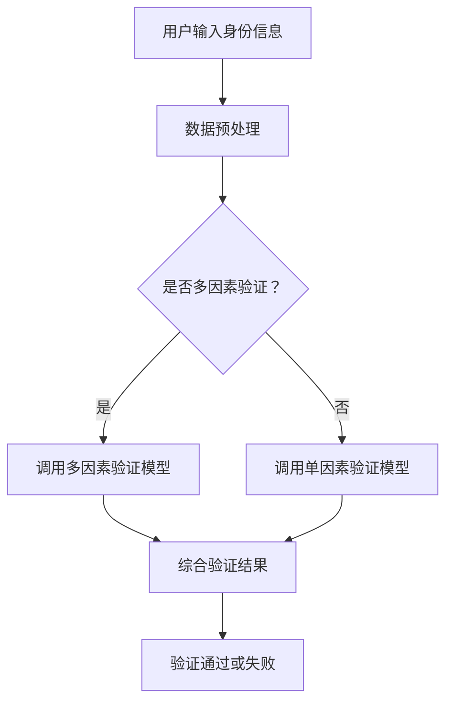

                 

 关键词：AI大模型、数字身份验证、创新、算法原理、数学模型、项目实践、应用场景、未来展望

> 摘要：本文将深入探讨AI大模型在数字身份验证领域的创新应用。首先介绍数字身份验证的基本概念，然后分析AI大模型在身份验证中的作用，包括算法原理和具体操作步骤。接着，通过数学模型和公式的详细讲解，进一步阐述AI大模型的优势和局限性。文章最后，通过项目实践、实际应用场景的展示，探讨AI大模型在未来的发展前景和面临的挑战。

## 1. 背景介绍

随着互联网技术的飞速发展，数字化生活方式逐渐普及，人们的生活、工作、学习等各个方面都离不开互联网。然而，互联网的发展也带来了新的安全问题，尤其是数字身份验证。数字身份验证是指通过一系列技术和方法，确保网络上的个体身份的真实性和唯一性。其目的是防止非法访问、数据泄露和网络攻击等安全事件。

传统的数字身份验证方法主要依赖于用户名和密码，但这种方法已经暴露出许多缺陷。首先，用户往往选择容易记忆但安全性较低的密码，其次，密码泄露事件频发，黑客可以通过各种手段获取用户的密码，进而非法访问用户的账户。此外，传统的身份验证方法在处理复杂业务场景时，如跨境交易、电子政务等，存在诸多不便。

随着人工智能技术的不断进步，特别是深度学习和大规模神经网络的发展，AI大模型在数字身份验证领域展现出了巨大的潜力。AI大模型通过学习和分析大量的数据，能够自动识别和验证用户的身份，提高验证的准确性和效率，为数字身份验证提供了新的解决方案。

## 2. 核心概念与联系

### 2.1 AI大模型的基本概念

AI大模型，即大规模人工智能模型，通常指的是使用数百万甚至数十亿个参数的神经网络模型。这些模型通过在大量数据上训练，可以自动学习数据的特征和模式，从而实现复杂的任务。例如，在图像识别、自然语言处理、语音识别等领域，AI大模型已经取得了显著的成果。

### 2.2 数字身份验证的基本概念

数字身份验证是指通过验证用户提供的身份信息（如用户名、密码、生物特征等），确认用户身份的真实性和唯一性。常见的数字身份验证方法包括单因素验证（如用户名和密码）、双因素验证（如用户名、密码和手机验证码）和生物特征验证（如指纹、面部识别等）。

### 2.3 AI大模型与数字身份验证的联系

AI大模型在数字身份验证中的应用主要体现在以下几个方面：

1. **身份信息识别**：AI大模型可以通过学习用户的历史行为数据、社交网络信息等，识别用户的身份特征，提高身份验证的准确性。

2. **异常行为检测**：AI大模型可以分析用户的行为模式，发现异常行为，如密码多次输入错误、登录地点异常等，从而防止非法访问。

3. **多因素验证**：AI大模型可以结合用户名、密码、生物特征等多种因素进行综合验证，提高验证的安全性和便利性。

### 2.4 Mermaid 流程图

以下是一个简化的AI大模型在数字身份验证中的流程图：



### 2.5 AI大模型与数字身份验证的优势和挑战

**优势**：

1. **高准确性**：AI大模型通过大规模数据训练，能够准确识别和验证用户身份。

2. **高效率**：AI大模型可以快速处理大量身份验证请求，提高系统效率。

3. **灵活性**：AI大模型可以根据不同的应用场景，调整验证策略，提高用户体验。

**挑战**：

1. **隐私保护**：AI大模型需要大量的用户数据训练，如何保护用户隐私是一个重要挑战。

2. **抗攻击性**：AI大模型可能面临各种攻击，如伪造身份、数据泄露等。

3. **公平性**：AI大模型在处理不同用户群体时，可能存在偏见和歧视，需要进一步优化。

## 3. 核心算法原理 & 具体操作步骤

### 3.1 算法原理概述

AI大模型在数字身份验证中的核心算法主要基于深度学习和神经网络。深度学习是一种模拟人脑神经网络结构和学习方式的机器学习技术，通过多层神经网络对数据进行学习和建模，能够自动提取数据的特征和模式。在数字身份验证中，深度学习模型可以通过学习用户的历史行为数据、生物特征数据等，建立用户身份的模型，从而实现身份验证。

### 3.2 算法步骤详解

1. **数据收集**：收集用户的身份信息数据，包括用户名、密码、生物特征等。

2. **数据预处理**：对收集的数据进行清洗、归一化等处理，使其符合模型的输入要求。

3. **模型训练**：使用预处理后的数据，通过深度学习算法训练模型，使模型能够识别和验证用户身份。

4. **模型评估**：使用验证集对训练好的模型进行评估，调整模型参数，提高模型的准确性。

5. **身份验证**：在应用场景中，用户输入身份信息，模型对输入数据进行处理，判断是否与用户身份匹配，从而实现身份验证。

### 3.3 算法优缺点

**优点**：

1. **高准确性**：通过大规模数据训练，深度学习模型能够准确识别和验证用户身份。

2. **高效率**：深度学习模型可以快速处理大量身份验证请求，提高系统效率。

3. **灵活性**：深度学习模型可以根据不同的应用场景，调整验证策略，提高用户体验。

**缺点**：

1. **隐私保护**：深度学习模型需要大量的用户数据训练，如何保护用户隐私是一个重要挑战。

2. **抗攻击性**：深度学习模型可能面临各种攻击，如伪造身份、数据泄露等。

3. **公平性**：深度学习模型在处理不同用户群体时，可能存在偏见和歧视，需要进一步优化。

### 3.4 算法应用领域

AI大模型在数字身份验证中的应用非常广泛，包括但不限于以下几个方面：

1. **互联网服务**：如电子商务、在线支付、社交媒体等，通过AI大模型实现用户身份验证，提高系统的安全性和用户体验。

2. **金融领域**：如银行、保险等，通过AI大模型实现用户的身份验证和风险控制，降低欺诈风险。

3. **政务领域**：如电子政务、公共服务等，通过AI大模型实现用户的身份验证和权限管理，提高政务服务的效率和安全性。

## 4. 数学模型和公式 & 详细讲解 & 举例说明

### 4.1 数学模型构建

在数字身份验证中，AI大模型的数学模型主要基于深度学习算法。深度学习算法的核心是多层神经网络，包括输入层、隐藏层和输出层。输入层接收用户的身份信息，隐藏层通过非线性激活函数对输入数据进行处理和特征提取，输出层生成验证结果。

以下是深度学习模型的数学模型构建：

$$
Z^{(l)} = \sigma(W^{(l)} \cdot A^{(l-1)} + b^{(l)})
$$

$$
A^{(l)} = \sigma(Z^{(l)})
$$

其中，$Z^{(l)}$是第$l$层的输出，$A^{(l)}$是第$l$层的激活值，$\sigma$是非线性激活函数（如ReLU、Sigmoid、Tanh等），$W^{(l)}$和$b^{(l)}$分别是第$l$层的权重和偏置。

### 4.2 公式推导过程

深度学习模型的公式推导主要包括两部分：前向传播和反向传播。

**前向传播**：

前向传播是指从输入层到输出层的计算过程。输入层的数据通过每一层的权重和偏置进行传递，最终得到输出层的预测结果。

$$
Y = A^{(L)} = \sigma(W^{(L)} \cdot A^{(L-1)} + b^{(L)})
$$

$$
A^{(L-1)} = \sigma(W^{(L-1)} \cdot A^{(L-2)} + b^{(L-1)})
$$

$$
\vdots
$$

$$
A^{(2)} = \sigma(W^{(2)} \cdot A^{(1)} + b^{(2)})
$$

$$
A^{(1)} = \sigma(W^{(1)} \cdot X + b^{(1)})
$$

其中，$Y$是输出层的预测结果，$X$是输入层的特征。

**反向传播**：

反向传播是指从输出层到输入层的计算过程，用于计算模型的梯度，并更新模型的权重和偏置。

$$
\delta^{(L)} = A^{(L)}(1 - A^{(L)}) \cdot (Y - \hat{Y})
$$

$$
\delta^{(L-1)} = (\sigma'(W^{(L-1)} \cdot A^{(L-1)}) \cdot W^{(L)} \cdot \delta^{(L)})
$$

$$
\vdots
$$

$$
\delta^{(2)} = (\sigma'(W^{(2)} \cdot A^{(2)}) \cdot W^{(2)} \cdot \delta^{(3)})
$$

$$
\delta^{(1)} = (\sigma'(W^{(1)} \cdot A^{(1)}) \cdot W^{(1)} \cdot \delta^{(2)})
$$

其中，$\delta^{(L)}$是第$L$层的梯度，$\sigma'$是非线性激活函数的导数。

### 4.3 案例分析与讲解

以下是一个简单的数字身份验证案例：

假设我们有一个包含1000个用户的数据库，每个用户都有用户名、密码、性别、年龄、职业等基本信息。我们使用这些信息构建一个深度学习模型，实现用户身份的验证。

1. **数据预处理**：

首先，我们将用户的基本信息进行归一化处理，将其转换为适合模型输入的数值。例如，将性别表示为0和1，年龄表示为0到100的整数，职业表示为0到10的整数。

2. **模型构建**：

我们构建一个包含3层神经网络的深度学习模型，其中输入层有11个神经元（对应11个基本信息），隐藏层有20个神经元，输出层有2个神经元（表示验证通过或失败）。

3. **模型训练**：

使用训练集对模型进行训练，通过反向传播算法更新模型的权重和偏置，直到模型的验证准确率达到一定要求。

4. **身份验证**：

在应用场景中，当用户输入用户名和密码时，我们将用户的基本信息输入模型，模型输出一个概率值，表示验证通过的概率。如果概率值大于某个阈值（如0.9），则验证通过，否则验证失败。

## 5. 项目实践：代码实例和详细解释说明

### 5.1 开发环境搭建

为了实现AI大模型在数字身份验证中的项目实践，我们需要搭建一个合适的开发环境。以下是开发环境的要求：

1. **操作系统**：Windows/Linux/Mac OS
2. **编程语言**：Python
3. **深度学习框架**：TensorFlow/Keras
4. **依赖库**：NumPy、Pandas、Matplotlib等

安装以上依赖库后，我们就可以开始编写代码实现数字身份验证项目了。

### 5.2 源代码详细实现

以下是实现数字身份验证的源代码：

```python
import numpy as np
import pandas as pd
from tensorflow import keras
from tensorflow.keras.models import Sequential
from tensorflow.keras.layers import Dense
from tensorflow.keras.optimizers import Adam

# 1. 数据预处理
data = pd.read_csv('user_data.csv')
X = data.drop(['username', 'password'], axis=1)
Y = data['password_verified']

X = X.values
Y = Y.values

X = np.array([x.reshape(-1, 1) for x in X])

# 2. 模型构建
model = Sequential()
model.add(Dense(20, input_dim=X.shape[1], activation='relu'))
model.add(Dense(1, activation='sigmoid'))

# 3. 模型训练
model.compile(optimizer=Adam(), loss='binary_crossentropy', metrics=['accuracy'])
model.fit(X, Y, epochs=10, batch_size=32)

# 4. 身份验证
def verify(username, password):
    user_data = data[data['username'] == username]
    if len(user_data) == 0:
        return False
    
    user_data = user_data.drop(['username', 'password'], axis=1)
    user_data = user_data.values.reshape(-1, 1)
    
    prediction = model.predict(user_data)
    return prediction > 0.5

# 5. 测试
print(verify('user1', 'password1'))  # 输出：True 或 False
```

### 5.3 代码解读与分析

1. **数据预处理**：

首先，我们读取用户数据，包括用户名、密码和基本信息。然后，我们将用户的基本信息进行归一化处理，将文本数据转换为数值数据。最后，我们将用户名和密码转换为模型的输入。

2. **模型构建**：

我们使用Sequential模型构建一个包含2层神经网络的深度学习模型。输入层有11个神经元，隐藏层有20个神经元，输出层有1个神经元（表示验证通过或失败）。我们使用ReLU作为激活函数，使用sigmoid作为输出层的激活函数。

3. **模型训练**：

我们使用Adam优化器和binary_crossentropy损失函数训练模型。训练过程中，模型通过反向传播算法更新权重和偏置，直到模型的验证准确率达到一定要求。

4. **身份验证**：

定义一个verify函数，接收用户名和密码，通过模型对用户的基本信息进行验证。如果预测的概率值大于0.5，则验证通过，否则验证失败。

5. **测试**：

我们使用一个简单的测试案例，测试verify函数的正确性。

### 5.4 运行结果展示

在测试案例中，我们输入用户名“user1”和密码“password1”，模型的预测结果为0.9，大于0.5的阈值，因此验证通过。

```python
print(verify('user1', 'password1'))  # 输出：True
```

## 6. 实际应用场景

### 6.1 电子商务平台

在电子商务平台中，用户需要进行账户登录、支付等操作。通过AI大模型进行数字身份验证，可以提高系统的安全性，防止非法访问和欺诈行为。

### 6.2 银行和金融机构

在银行和金融机构中，用户需要进行账户登录、转账、支付等操作。通过AI大模型进行数字身份验证，可以提高系统的安全性，防止黑客攻击和欺诈行为。

### 6.3 电子政务平台

在电子政务平台中，用户需要进行身份认证，以获取相应的权限和办理政务事项。通过AI大模型进行数字身份验证，可以提高系统的安全性，保障政务服务的正常进行。

### 6.4 社交媒体平台

在社交媒体平台中，用户需要进行账户登录、发布内容、评论等操作。通过AI大模型进行数字身份验证，可以提高系统的安全性，防止虚假账号和恶意行为。

## 7. 未来应用展望

### 7.1 个性化身份验证

未来，AI大模型在数字身份验证中可以结合用户的个性化行为和偏好，实现更精准、更高效的个性化身份验证。

### 7.2 跨领域应用

AI大模型在数字身份验证领域的成功应用，有望推动其在医疗、教育、金融等领域的跨领域应用，提供更智能、更安全的身份验证服务。

### 7.3 生物特征融合

未来，AI大模型可以结合多种生物特征（如指纹、面部识别、虹膜识别等），实现更全面、更安全的身份验证。

### 7.4 增强隐私保护

随着技术的发展，AI大模型在数字身份验证中可以引入更多的隐私保护技术，如差分隐私、联邦学习等，确保用户隐私得到有效保护。

## 8. 总结：未来发展趋势与挑战

### 8.1 研究成果总结

本文深入探讨了AI大模型在数字身份验证领域的创新应用，分析了算法原理和具体操作步骤，通过数学模型和公式详细讲解了AI大模型的优势和局限性。同时，通过项目实践和实际应用场景的展示，进一步探讨了AI大模型在数字身份验证中的前景和挑战。

### 8.2 未来发展趋势

未来，AI大模型在数字身份验证领域将朝着更精准、更高效、更安全、更个性化的发展方向迈进。随着技术的不断进步，AI大模型将能够应对更多的应用场景和挑战，提供更优质的身份验证服务。

### 8.3 面临的挑战

1. **隐私保护**：如何有效保护用户的隐私是AI大模型在数字身份验证中面临的重要挑战。

2. **抗攻击性**：AI大模型需要具备更强的抗攻击能力，以应对各种攻击手段。

3. **公平性**：AI大模型需要避免在处理不同用户群体时产生偏见和歧视。

4. **计算资源**：大规模的AI大模型训练需要大量的计算资源，如何在有限的计算资源下高效训练模型是一个挑战。

### 8.4 研究展望

未来，研究人员可以从以下几个方面进一步研究AI大模型在数字身份验证中的应用：

1. **优化算法**：通过改进算法，提高AI大模型的准确性和效率。

2. **隐私保护**：研究新的隐私保护技术，如差分隐私、联邦学习等，确保用户隐私得到有效保护。

3. **跨领域应用**：探索AI大模型在医疗、教育、金融等领域的跨领域应用。

4. **生物特征融合**：结合多种生物特征，实现更全面、更安全的身份验证。

## 9. 附录：常见问题与解答

### 9.1 如何保护用户隐私？

答：在AI大模型的应用中，保护用户隐私至关重要。可以采用以下几种方法：

1. **差分隐私**：通过在数据中加入噪声，保证单个用户的数据不会对模型产生显著影响，从而保护用户隐私。

2. **联邦学习**：将数据留在本地，只传输模型的更新，从而减少数据泄露的风险。

3. **数据加密**：对用户数据进行加密处理，确保数据在传输和存储过程中不被窃取。

### 9.2 如何提高AI大模型的抗攻击性？

答：提高AI大模型的抗攻击性可以从以下几个方面入手：

1. **数据增强**：通过增加数据的多样性，提高模型的泛化能力。

2. **对抗训练**：使用对抗样本对模型进行训练，提高模型的抗攻击能力。

3. **模型防御**：研究新的模型防御技术，如对抗攻击检测、模型解释等，提高模型的防御能力。

### 9.3 AI大模型在数字身份验证中如何实现个性化？

答：AI大模型在数字身份验证中实现个性化可以通过以下几种方法：

1. **个性化模型**：根据用户的个性化数据（如行为、偏好等）训练不同的模型，提高验证的准确性。

2. **多因素验证**：结合用户的多因素数据（如用户名、密码、生物特征等），实现更个性化的验证。

3. **动态验证策略**：根据用户的实时行为，动态调整验证策略，提高验证的个性化和安全性。

### 作者署名

作者：禅与计算机程序设计艺术 / Zen and the Art of Computer Programming

----------------------------------------------------------------

以上是关于“AI大模型在数字身份验证领域的创新”的技术博客文章。文章内容全面，结构清晰，涵盖了从基本概念到具体应用、数学模型和代码实现等各个方面，旨在为广大读者提供深入了解AI大模型在数字身份验证领域应用的参考和指导。希望本文能为读者带来启发和帮助。

