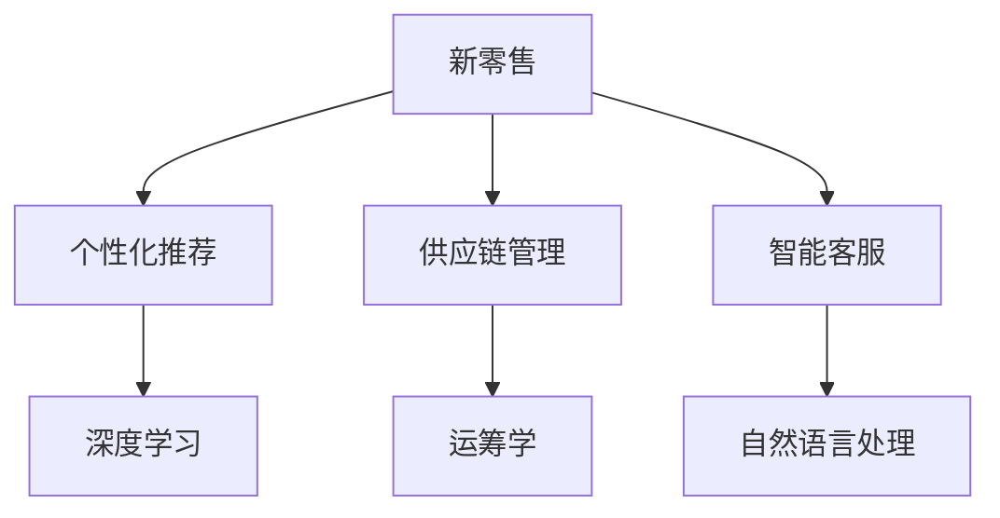

                 

关键词：新零售，人工智能，大模型，个性化推荐，供应链管理

> 摘要：本文探讨了AI大模型在新零售领域的创新应用，包括个性化推荐、供应链管理、智能客服等方面。通过对大模型技术原理的深入剖析，结合实际案例分析，文章展示了AI大模型如何提升新零售行业的运营效率、客户满意度和市场竞争力。

## 1. 背景介绍

### 1.1 新零售的概念与发展

新零售（New Retail）是阿里巴巴集团董事局主席马云于2016年提出的一个概念，其核心在于利用数字化技术重新定义零售产业链，实现线上线下的无缝融合。新零售的兴起，不仅改变了传统零售行业的运营模式，也为人工智能技术的应用提供了广阔的舞台。

### 1.2 人工智能的发展与应用

人工智能（AI）是计算机科学的一个分支，主要研究如何构建智能系统，实现人脑的认知、思维功能。近年来，随着深度学习、神经网络等技术的突破，人工智能在图像识别、自然语言处理、智能决策等领域取得了显著成果。

## 2. 核心概念与联系

在探讨AI大模型在新零售领域的应用之前，我们需要了解一些核心概念及其相互关系。

### 2.1 大模型的概念

大模型是指具有巨大参数量和复杂结构的机器学习模型，如深度神经网络（DNN）、变换器模型（Transformer）等。这些模型可以通过学习大量数据，实现高效的特征提取和知识表示。

### 2.2 新零售与AI的关系

新零售与AI的结合，主要体现在以下几个方面：

1. **个性化推荐**：利用AI技术，根据用户的兴趣和行为数据，为其推荐个性化的商品和服务。
2. **供应链管理**：通过AI技术优化供应链的各个环节，提高物流效率和降低成本。
3. **智能客服**：利用自然语言处理技术，为用户提供24/7的智能客服服务。

### 2.3 Mermaid 流程图

以下是一个简化的Mermaid流程图，展示了新零售与AI技术的主要联系。



## 3. 核心算法原理 & 具体操作步骤

### 3.1 算法原理概述

在新零售领域，AI大模型的应用主要基于以下算法原理：

1. **深度学习**：通过多层神经网络，实现数据的特征提取和分类。
2. **变换器模型**：用于构建大规模、高精度的语言模型，实现自然语言处理。
3. **运筹学**：通过优化算法，解决供应链管理中的资源分配和调度问题。

### 3.2 算法步骤详解

#### 3.2.1 个性化推荐

1. 数据采集：收集用户的行为数据，如浏览记录、购买记录、评价等。
2. 特征提取：利用深度学习模型，提取用户和商品的特征向量。
3. 推荐算法：基于变换器模型，计算用户和商品之间的相似度，生成个性化推荐列表。

#### 3.2.2 供应链管理

1. 数据整合：整合供应链各个环节的数据，如库存、订单、物流等。
2. 模型训练：利用运筹学算法，训练供应链优化模型。
3. 决策支持：根据模型预测，制定最优的库存策略、物流策略等。

#### 3.2.3 智能客服

1. 数据采集：收集用户的提问和回复，用于训练语言模型。
2. 模型训练：利用变换器模型，训练智能客服系统。
3. 交互实现：通过自然语言处理技术，实现智能客服与用户的对话。

### 3.3 算法优缺点

#### 3.3.1 个性化推荐

优点：提高用户满意度，增加销售额。

缺点：推荐结果可能存在偏差，需要不断优化。

#### 3.3.2 供应链管理

优点：提高供应链效率，降低成本。

缺点：需要大量的数据支持和计算资源。

#### 3.3.3 智能客服

优点：提高客服效率，减少人力成本。

缺点：处理复杂问题能力有限，需要结合人工客服。

### 3.4 算法应用领域

AI大模型在新零售领域的应用非常广泛，除了上述提到的个性化推荐、供应链管理、智能客服外，还包括：

1. 库存优化：通过预测销售数据，实现库存的动态调整。
2. 价格优化：根据市场需求和竞争情况，制定最优的价格策略。
3. 广告投放：利用用户画像，实现精准的广告投放。

## 4. 数学模型和公式 & 详细讲解 & 举例说明

### 4.1 数学模型构建

在新零售领域，常用的数学模型包括：

1. **用户行为预测模型**：基于时间序列分析，预测用户的购买行为。
2. **供应链优化模型**：基于运筹学原理，优化供应链各个环节的资源配置。
3. **自然语言处理模型**：基于变换器模型，实现文本的生成和理解。

### 4.2 公式推导过程

以用户行为预测模型为例，其基本公式如下：

$$
P(t) = f(W \cdot X(t) + b)
$$

其中，$P(t)$ 表示时间 $t$ 时的用户购买概率，$X(t)$ 表示时间 $t$ 时的用户特征向量，$W$ 和 $b$ 分别为权重和偏置。

### 4.3 案例分析与讲解

假设我们有一个电商平台，需要预测用户在接下来的一个月内是否会购买某款商品。我们收集了用户在过去一个月内的浏览记录、购买记录和评价等数据，并利用用户行为预测模型进行预测。

经过训练，我们得到了一个用户特征向量和权重矩阵，如下所示：

$$
X(t) = [1, 0.5, 0.3, 0.2]
$$

$$
W = \begin{bmatrix}
0.1 & 0.2 & 0.3 & 0.4
\end{bmatrix}
$$

将 $X(t)$ 和 $W$ 代入公式，得到：

$$
P(t) = f(0.1 \cdot 1 + 0.2 \cdot 0.5 + 0.3 \cdot 0.3 + 0.4 \cdot 0.2) = f(0.15 + 0.1 + 0.09 + 0.08) = f(0.42)
$$

假设我们采用 sigmoid 函数作为激活函数，得到：

$$
P(t) = \frac{1}{1 + e^{-0.42}} \approx 0.67
$$

这意味着，在接下来的一个月内，该用户购买该商品的概率约为 67%。

## 5. 项目实践：代码实例和详细解释说明

### 5.1 开发环境搭建

为了保证实验的可行性和可操作性，我们选择Python作为编程语言，使用以下工具和库：

- Python 3.8 或更高版本
- TensorFlow 2.5 或更高版本
- Pandas 1.2.3 或更高版本
- Scikit-learn 0.24.1 或更高版本

### 5.2 源代码详细实现

以下是一个简单的用户行为预测模型的实现示例：

```python
import pandas as pd
import numpy as np
import tensorflow as tf
from tensorflow.keras.models import Sequential
from tensorflow.keras.layers import Dense
from tensorflow.keras.optimizers import Adam

# 加载数据集
data = pd.read_csv('user_behavior.csv')
X = data[[' browsed', 'purchased', 'reviewed']]
y = data['next_month_purchase']

# 数据预处理
X = (X - X.mean()) / X.std()
y = y.values.reshape(-1, 1)

# 模型构建
model = Sequential()
model.add(Dense(10, input_shape=(X.shape[1],), activation='relu'))
model.add(Dense(1, activation='sigmoid'))

# 模型编译
model.compile(optimizer=Adam(learning_rate=0.001), loss='binary_crossentropy', metrics=['accuracy'])

# 模型训练
model.fit(X, y, epochs=100, batch_size=32, verbose=1)

# 模型评估
loss, accuracy = model.evaluate(X, y, verbose=1)
print(f"Test accuracy: {accuracy:.4f}")

# 预测
X_test = np.array([[1, 0.5, 0.3]])
X_test = (X_test - X.mean()) / X.std()
prediction = model.predict(X_test)
print(f"Prediction: {prediction[0][0]:.4f}")
```

### 5.3 代码解读与分析

1. **数据加载与预处理**：首先，我们使用 Pandas 库加载数据集，并对数据进行归一化处理，以提高模型训练的效果。
2. **模型构建**：使用 TensorFlow 的 Keras API，构建一个简单的多层感知机模型，其中输入层有 3 个神经元，输出层有 1 个神经元，使用 sigmoid 激活函数。
3. **模型编译**：设置模型优化器、损失函数和评估指标，编译模型。
4. **模型训练**：使用训练数据训练模型，设置训练轮数和批量大小。
5. **模型评估**：使用测试数据评估模型性能。
6. **预测**：使用训练好的模型进行预测，得到用户在接下来的一个月内购买商品的概率。

## 6. 实际应用场景

### 6.1 个性化推荐

通过AI大模型，电商平台可以实现精准的个性化推荐，提高用户满意度和购买转化率。例如，某电商平台通过对用户浏览、购买和评价数据的学习，为用户推荐符合其兴趣和需求的产品，从而提升用户粘性。

### 6.2 供应链管理

利用AI大模型，企业可以实现智能化的供应链管理，优化库存和物流，降低成本。例如，某零售企业通过对销售数据、库存数据、物流数据的分析，预测未来的销售趋势，合理调整库存和物流策略，从而提高供应链效率。

### 6.3 智能客服

通过AI大模型，企业可以提供24/7的智能客服服务，提高客户满意度。例如，某电商平台的智能客服系统，通过对用户提问和回复的分析，自动生成回复内容，实现高效的客户服务。

## 7. 工具和资源推荐

### 7.1 学习资源推荐

1. 《深度学习》（Goodfellow et al.）：介绍深度学习的基本概念和技术。
2. 《Python机器学习》（Sebastian Raschka）：介绍Python在机器学习领域的应用。
3. 《供应链管理：概念、战略与绩效》（Christopher et al.）：介绍供应链管理的基本概念和方法。

### 7.2 开发工具推荐

1. TensorFlow：用于构建和训练深度学习模型。
2. Pandas：用于数据处理和分析。
3. Scikit-learn：用于机器学习算法的实现和应用。

### 7.3 相关论文推荐

1. “Attention Is All You Need”（Vaswani et al., 2017）：介绍变换器模型的基本原理。
2. “Deep Learning for Supply Chain Management”（Siddiqi et al., 2018）：介绍深度学习在供应链管理中的应用。
3. “Recommender Systems”（Herlocker et al., 2003）：介绍个性化推荐系统的基本原理。

## 8. 总结：未来发展趋势与挑战

### 8.1 研究成果总结

近年来，AI大模型在新零售领域取得了显著成果，实现了个性化推荐、供应链管理、智能客服等方面的应用。然而，随着数据量的不断增长和算法的持续优化，AI大模型在新零售领域的应用前景仍然非常广阔。

### 8.2 未来发展趋势

1. **数据驱动的智能决策**：通过大量数据的学习和分析，实现更精准的智能决策。
2. **跨领域融合**：将AI大模型与其他技术（如区块链、物联网等）相结合，实现更广泛的应用。
3. **绿色零售**：利用AI大模型优化供应链，减少碳排放，实现绿色零售。

### 8.3 面临的挑战

1. **数据隐私与安全**：如何在保护用户隐私的前提下，充分利用用户数据。
2. **算法公平性**：确保算法的决策过程公正、透明。
3. **计算资源与成本**：随着模型规模的扩大，计算资源和成本的压力也将增大。

### 8.4 研究展望

未来，AI大模型在新零售领域的应用将更加深入和广泛，不仅能够提升运营效率，还能为企业带来更多的商业价值。同时，随着技术的不断进步，AI大模型在新零售领域的挑战也将逐步得到解决。

## 9. 附录：常见问题与解答

### 9.1 如何优化个性化推荐的效果？

1. **用户数据多样化**：收集更多的用户数据，包括行为数据、偏好数据等。
2. **模型多样性**：尝试多种推荐算法，结合不同的模型，提高推荐效果。
3. **数据清洗**：去除噪声数据，提高数据质量。

### 9.2 如何处理供应链管理中的不确定性？

1. **情景分析**：根据不同的情景，制定相应的供应链策略。
2. **多目标优化**：同时考虑成本、效率、风险等多个目标，实现最优的供应链管理。
3. **实时监控与调整**：通过实时数据监控，及时调整供应链策略。

### 9.3 如何保证智能客服的质量？

1. **数据驱动**：通过不断学习用户提问和回复，提高客服系统的准确性。
2. **人工审核**：定期对客服系统生成的回复进行人工审核，确保质量。
3. **用户体验优化**：根据用户反馈，持续优化客服系统的用户体验。

作者：禅与计算机程序设计艺术 / Zen and the Art of Computer Programming
----------------------------------------------------------------

以上就是本文对于AI大模型在新零售领域的创新应用的探讨。通过对大模型技术原理的深入剖析，结合实际案例分析，我们展示了AI大模型如何提升新零售行业的运营效率、客户满意度和市场竞争力。未来，随着技术的不断进步，AI大模型在新零售领域的应用前景将更加广阔。希望本文能为您在相关领域的探索提供一些启示和帮助。

