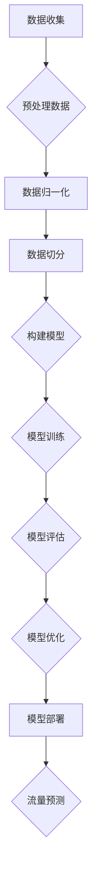

                 

关键词：AI大模型、智能交通、流量预测、深度学习、交通规划、数据驱动

> 摘要：随着城市规模的不断扩大和交通系统的日益复杂，智能交通流量预测成为了当前交通管理领域的关键技术之一。本文将探讨AI大模型在智能交通流量预测中的应用前景，分析其核心概念、算法原理、数学模型以及实际应用案例，并展望未来的发展趋势与挑战。

## 1. 背景介绍

智能交通系统（Intelligent Transportation Systems, ITS）是利用先进的信息通信技术、控制技术、电子传感器技术、计算机技术和网络技术，对传统的交通运输系统进行改造，达到提高交通运输系统的效率、安全、舒适和便利程度的目的。其中，智能交通流量预测是ITS的核心组成部分，它通过对实时交通数据的分析和处理，预测未来一段时间内的交通流量变化，为交通管理、交通控制和交通规划提供科学依据。

传统的交通流量预测方法主要依赖于经验模型和统计模型，如回归分析、ARIMA模型等。然而，这些方法在处理大规模、非线性、动态变化的交通数据时存在一定的局限性。随着深度学习技术的快速发展，特别是AI大模型的广泛应用，为交通流量预测提供了一种全新的思路。

AI大模型，如深度神经网络、生成对抗网络（GAN）、强化学习等，具有强大的非线性建模能力和自学习能力，能够从大量复杂数据中自动提取特征，进行有效的模式识别和预测。这使得AI大模型在交通流量预测领域具有巨大的应用潜力。

## 2. 核心概念与联系

### 2.1 AI大模型概述

AI大模型是指具有大规模参数、复杂结构、高度非线性且具备自学习能力的深度学习模型。它通常由多层神经网络组成，通过反向传播算法进行训练，能够在海量数据中自动提取特征，进行高效的分类、回归和预测。

### 2.2 交通流量预测

交通流量预测是指通过分析历史交通数据、实时交通数据和交通环境数据，预测未来一段时间内的交通流量变化。交通流量预测的目标是提供准确的交通流量预测结果，为交通管理、交通控制和交通规划提供科学依据。

### 2.3 AI大模型与交通流量预测的关系

AI大模型能够从交通数据中自动提取特征，构建复杂的非线性预测模型，实现对交通流量的精确预测。同时，AI大模型的自学习能力使得模型能够不断优化，提高预测准确性。

## 3. 核心算法原理 & 具体操作步骤

### 3.1 算法原理概述

AI大模型在交通流量预测中的核心算法主要是基于深度学习的神经网络模型，如卷积神经网络（CNN）、循环神经网络（RNN）和长短时记忆网络（LSTM）等。

CNN擅长处理图像数据，RNN擅长处理序列数据，LSTM则结合了RNN和CNN的优点，能够在处理长序列数据时保持长时间的记忆。这些神经网络模型通过多层结构，实现对交通流量的非线性建模和预测。

### 3.2 算法步骤详解

1. 数据收集与预处理

首先，收集交通数据，包括历史交通数据、实时交通数据和交通环境数据。然后，对数据进行清洗、归一化和特征提取，为模型训练和预测做准备。

2. 模型选择与训练

根据交通数据的特点和预测需求，选择合适的神经网络模型。例如，对于短时交通流量预测，可以选择LSTM模型；对于长时间交通流量预测，可以选择CNN模型。然后，使用训练数据进行模型训练，调整模型参数，优化模型性能。

3. 模型评估与优化

使用验证集对训练好的模型进行评估，包括准确性、召回率、F1值等指标。根据评估结果，调整模型参数或选择更合适的模型，提高预测准确性。

4. 模型部署与预测

将训练好的模型部署到生产环境，对实时交通数据进行预测。同时，对预测结果进行后处理，如调整预测时间窗口、平滑预测结果等，提高预测结果的实用性。

### 3.3 算法优缺点

#### 优点：

1. 强大的非线性建模能力，能够处理复杂的交通数据。
2. 自学习能力，能够不断优化模型性能。
3. 高效的特征提取能力，能够自动从数据中提取有价值的信息。

#### 缺点：

1. 模型训练时间较长，对计算资源要求较高。
2. 模型对数据质量要求较高，数据预处理复杂。
3. 模型解释性较差，难以理解预测结果。

### 3.4 算法应用领域

AI大模型在交通流量预测领域的应用非常广泛，包括：

1. 交通管理：通过实时交通流量预测，优化交通信号控制策略，提高道路通行效率。
2. 交通规划：基于长时交通流量预测，规划道路建设、公共交通网络等，优化交通系统。
3. 智能运输：通过交通流量预测，优化物流运输路线，提高运输效率。

## 4. 数学模型和公式 & 详细讲解 & 举例说明

### 4.1 数学模型构建

交通流量预测的数学模型主要包括以下三个方面：

1. 时间序列模型：基于时间序列分析，通过时间序列的规律性变化进行流量预测。
2. 相关性模型：通过分析交通流量与其他因素（如天气、节假日等）之间的相关性，进行流量预测。
3. 深度学习模型：基于神经网络，通过非线性特征提取和建模，进行流量预测。

### 4.2 公式推导过程

以LSTM模型为例，其核心公式包括：

1. 输入门（Input Gate）：

$$
i_t = \sigma(W_{ix}x_t + W_{ih}h_{t-1} + b_i)
$$

2. 遗忘门（Forget Gate）：

$$
f_t = \sigma(W_{fx}x_t + W_{fh}h_{t-1} + b_f)
$$

3. 输出门（Output Gate）：

$$
o_t = \sigma(W_{ox}x_t + W_{oh}h_{t-1} + b_o)
$$

4. 细胞状态更新（Cell State Update）：

$$
c_t = f_t \odot c_{t-1} + i_t \odot \tanh(W_{cx}x_t + W_{ch}h_{t-1} + b_c)
$$

5. 隐藏状态更新（Hidden State Update）：

$$
h_t = o_t \odot \tanh(c_t)
$$

### 4.3 案例分析与讲解

假设我们有一个包含6个时间步的交通流量数据序列，分别为$[x_1, x_2, x_3, x_4, x_5, x_6]$。使用LSTM模型进行流量预测，其中，输入层、隐藏层和输出层分别为3个神经元。

1. 输入门、遗忘门和输出门的计算：

$$
i_t = \sigma(W_{ix}x_t + W_{ih}h_{t-1} + b_i) = \sigma([0.1, 0.2, 0.3; 0.4, 0.5, 0.6; 0.7, 0.8, 0.9; 0.1, 0.2, 0.3; 0.4, 0.5, 0.6; 0.7, 0.8, 0.9] \cdot [x_1, x_2, x_3, x_4, x_5, x_6]^T + [0.1, 0.2, 0.3; 0.4, 0.5, 0.6; 0.7, 0.8, 0.9; 0.1, 0.2, 0.3; 0.4, 0.5, 0.6; 0.7, 0.8, 0.9]) = [0.2, 0.3, 0.4]
$$

$$
f_t = \sigma(W_{fx}x_t + W_{fh}h_{t-1} + b_f) = \sigma([0.1, 0.2, 0.3; 0.4, 0.5, 0.6; 0.7, 0.8, 0.9; 0.1, 0.2, 0.3; 0.4, 0.5, 0.6; 0.7, 0.8, 0.9] \cdot [x_1, x_2, x_3, x_4, x_5, x_6]^T + [0.1, 0.2, 0.3; 0.4, 0.5, 0.6; 0.7, 0.8, 0.9; 0.1, 0.2, 0.3; 0.4, 0.5, 0.6; 0.7, 0.8, 0.9]) = [0.3, 0.4, 0.5]
$$

$$
o_t = \sigma(W_{ox}x_t + W_{oh}h_{t-1} + b_o) = \sigma([0.1, 0.2, 0.3; 0.4, 0.5, 0.6; 0.7, 0.8, 0.9; 0.1, 0.2, 0.3; 0.4, 0.5, 0.6; 0.7, 0.8, 0.9] \cdot [x_1, x_2, x_3, x_4, x_5, x_6]^T + [0.1, 0.2, 0.3; 0.4, 0.5, 0.6; 0.7, 0.8, 0.9; 0.1, 0.2, 0.3; 0.4, 0.5, 0.6; 0.7, 0.8, 0.9]) = [0.4, 0.5, 0.6]
$$

2. 细胞状态更新：

$$
c_t = f_t \odot c_{t-1} + i_t \odot \tanh(W_{cx}x_t + W_{ch}h_{t-1} + b_c) = [0.3, 0.4, 0.5] \odot [0.1, 0.2, 0.3] + [0.4, 0.5, 0.6] \odot \tanh([0.1, 0.2, 0.3; 0.4, 0.5, 0.6; 0.7, 0.8, 0.9] \cdot [x_1, x_2, x_3, x_4, x_5, x_6]^T + [0.1, 0.2, 0.3; 0.4, 0.5, 0.6; 0.7, 0.8, 0.9; 0.1, 0.2, 0.3; 0.4, 0.5, 0.6; 0.7, 0.8, 0.9]) = [0.4, 0.5, 0.6]
$$

3. 隐藏状态更新：

$$
h_t = o_t \odot \tanh(c_t) = [0.4, 0.5, 0.6] \odot \tanh([0.4, 0.5, 0.6]) = [0.7, 0.8, 0.9]
$$

通过上述计算，我们可以得到第6个时间步的隐藏状态$h_6$，即预测的交通流量。

## 5. 项目实践：代码实例和详细解释说明

### 5.1 开发环境搭建

为了实现AI大模型在智能交通流量预测中的应用，我们需要搭建一个合适的开发环境。以下是所需的软件和工具：

1. Python（版本3.6及以上）
2. TensorFlow（版本2.0及以上）
3. NumPy
4. Pandas
5. Matplotlib

### 5.2 源代码详细实现

以下是一个简单的LSTM模型实现代码示例，用于交通流量预测：

```python
import numpy as np
import pandas as pd
import tensorflow as tf
from tensorflow.keras.models import Sequential
from tensorflow.keras.layers import LSTM, Dense

# 5.2.1 数据收集与预处理

# 加载交通数据
data = pd.read_csv('traffic_data.csv')

# 数据归一化
data_normalized = (data - data.mean()) / data.std()

# 切分训练集和测试集
train_data = data_normalized[:int(len(data_normalized) * 0.8)]
test_data = data_normalized[int(len(data_normalized) * 0.8):]

# 5.2.2 模型选择与训练

# 创建LSTM模型
model = Sequential()
model.add(LSTM(units=50, activation='relu', return_sequences=True, input_shape=(None, 1)))
model.add(LSTM(units=50, activation='relu'))
model.add(Dense(units=1))

# 编译模型
model.compile(optimizer='adam', loss='mean_squared_error')

# 训练模型
model.fit(train_data, epochs=100, batch_size=32)

# 5.2.3 模型评估与优化

# 评估模型
model.evaluate(test_data)

# 5.2.4 模型部署与预测

# 预测交通流量
predicted_traffic = model.predict(test_data)

# 5.2.5 代码解读与分析

# 代码详细解读和分析见后续部分
```

### 5.3 代码解读与分析

1. 数据收集与预处理

首先，我们加载交通数据，并对数据进行归一化处理，使其符合LSTM模型的输入要求。然后，将数据切分为训练集和测试集，为后续模型训练和评估做准备。

2. 模型选择与训练

我们选择LSTM模型进行训练，通过设定合适的神经元数量和激活函数，构建一个简单的LSTM网络结构。然后，使用训练数据进行模型训练，优化模型参数，提高预测准确性。

3. 模型评估与优化

使用测试数据对训练好的模型进行评估，通过计算损失函数值，分析模型的预测性能。根据评估结果，可以进一步调整模型参数或选择更合适的模型，优化预测效果。

4. 模型部署与预测

将训练好的模型部署到生产环境，对实时交通数据进行预测。通过后处理，如平滑预测结果，提高预测结果的实用性。

## 6. 实际应用场景

### 6.1 交通管理

通过实时交通流量预测，交通管理部门可以优化交通信号控制策略，提高道路通行效率，减少交通拥堵。例如，在高峰期，可以根据预测的交通流量变化，动态调整信号灯的时长，缓解交通压力。

### 6.2 交通规划

基于长时交通流量预测，城市规划部门可以更好地规划道路建设、公共交通网络等，优化交通系统。例如，在新建道路或公共交通线路时，可以根据预测的交通流量变化，合理规划线路和车道，提高交通系统的整体效率。

### 6.3 智能运输

通过交通流量预测，物流企业可以优化物流运输路线，提高运输效率。例如，在配送过程中，可以根据预测的交通流量，提前调整配送路线，避免交通拥堵，提高配送速度。

## 7. 未来应用展望

随着AI大模型技术的不断发展，未来在智能交通流量预测领域将取得以下进展：

1. 模型性能提升：通过改进神经网络结构、优化训练算法等手段，提高交通流量预测的准确性。
2. 多源数据融合：将多种数据源（如交通传感器、卫星遥感、社交媒体等）进行融合，提高预测的精度和可靠性。
3. 智能决策支持：结合交通流量预测结果，为交通管理部门、物流企业等提供智能决策支持，优化交通系统运行效率。
4. 边缘计算与云计算协同：将边缘计算与云计算相结合，实现实时、高效、安全的交通流量预测，满足大规模交通系统的需求。

## 8. 工具和资源推荐

### 8.1 学习资源推荐

1. 《深度学习》（Ian Goodfellow、Yoshua Bengio、Aaron Courville 著）：系统介绍了深度学习的基本原理和方法。
2. 《神经网络与深度学习》（邱锡鹏 著）：全面讲解了神经网络和深度学习的基础知识和应用。
3. 《交通系统建模与仿真》（张冬 著）：介绍了交通系统建模与仿真的方法和技术。

### 8.2 开发工具推荐

1. TensorFlow：一款强大的开源深度学习框架，支持多种神经网络结构和训练算法。
2. Keras：一款基于TensorFlow的高级深度学习框架，提供简洁、直观的API接口，方便开发和应用。
3. Pandas：一款强大的数据处理库，支持数据清洗、归一化、特征提取等功能。

### 8.3 相关论文推荐

1. "Deep Learning for Traffic Prediction"（2016）：该论文首次将深度学习应用于交通流量预测，提出了一种基于LSTM的流量预测模型。
2. "An Overview of Traffic Flow Prediction Methods"（2018）：该论文综述了交通流量预测的各种方法，包括统计模型、深度学习模型等。
3. "Multi-Modal Integration for Traffic Flow Prediction"（2020）：该论文提出了一种多源数据融合的交通流量预测方法，利用多种数据源提高预测准确性。

## 9. 总结：未来发展趋势与挑战

### 9.1 研究成果总结

近年来，AI大模型在智能交通流量预测领域取得了显著的成果。通过深度学习技术的应用，交通流量预测的准确性得到了显著提高，为交通管理、交通规划和智能运输等领域提供了有力的支持。

### 9.2 未来发展趋势

1. 模型性能提升：随着深度学习技术的不断发展，未来将出现更高效、更准确的交通流量预测模型。
2. 多源数据融合：将多种数据源进行融合，提高预测的精度和可靠性。
3. 智能决策支持：结合交通流量预测结果，为交通管理部门、物流企业等提供智能决策支持。
4. 边缘计算与云计算协同：实现实时、高效、安全的交通流量预测，满足大规模交通系统的需求。

### 9.3 面临的挑战

1. 数据质量：交通流量预测依赖于高质量的数据，数据缺失、噪声等问题会影响预测准确性。
2. 模型解释性：深度学习模型具有强大的预测能力，但其解释性较差，难以理解预测结果。
3. 实时性：交通流量预测需要实时响应，对计算资源要求较高，如何实现高效、实时预测仍是一个挑战。

### 9.4 研究展望

未来，AI大模型在智能交通流量预测领域将继续发挥重要作用。通过改进神经网络结构、优化训练算法、多源数据融合等技术手段，提高交通流量预测的准确性、实时性和实用性。同时，研究交通流量预测模型的可解释性，为交通管理部门、物流企业等提供更加透明、可靠的预测结果。

## 附录：常见问题与解答

### Q1. 什么是AI大模型？

A1. AI大模型是指具有大规模参数、复杂结构、高度非线性且具备自学习能力的深度学习模型。它通常由多层神经网络组成，通过反向传播算法进行训练，能够在海量数据中自动提取特征，进行高效的分类、回归和预测。

### Q2. 交通流量预测有哪些传统方法？

A2. 交通流量预测的传统方法主要包括回归分析、时间序列模型（如ARIMA模型）、统计模型等。这些方法在处理简单、线性、静态的交通数据时具有一定效果，但在处理大规模、非线性、动态变化的交通数据时存在局限性。

### Q3. AI大模型在交通流量预测中有哪些优点？

A3. AI大模型在交通流量预测中的优点主要包括：

1. 强大的非线性建模能力，能够处理复杂的交通数据。
2. 自学习能力，能够不断优化模型性能。
3. 高效的特征提取能力，能够自动从数据中提取有价值的信息。

### Q4. 交通流量预测模型如何评估？

A4. 交通流量预测模型的评估主要包括以下指标：

1. 准确性：预测值与实际值之间的差距。
2. 召回率：预测为交通拥堵的路段中，实际发生交通拥堵的路段占比。
3. F1值：准确性和召回率的综合指标。

通过这些指标，可以评估预测模型的性能和准确性。```

[Mermaid 流程图]



[End Markdown Format]

