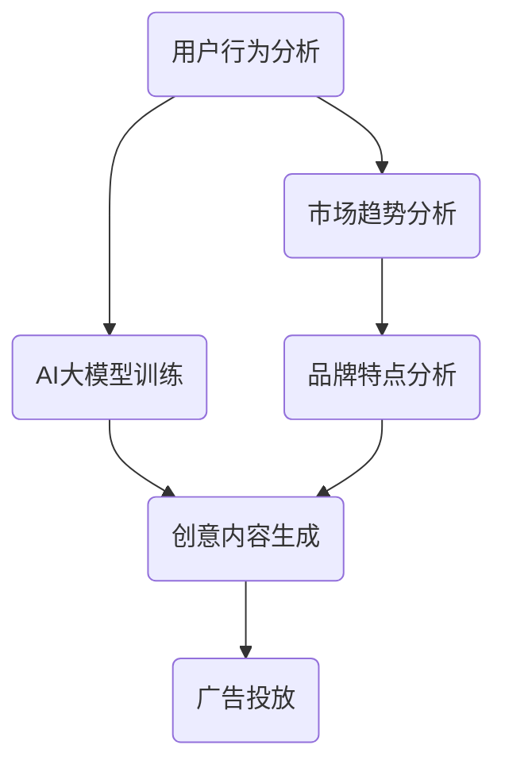

                 

关键词：AI大模型、智能广告、创意生成、商业价值

摘要：随着人工智能技术的不断发展，AI大模型在各个领域的应用越来越广泛。本文将探讨AI大模型在智能广告创意生成中的商业价值，通过背景介绍、核心概念与联系、核心算法原理与具体操作步骤、数学模型和公式详细讲解、项目实践、实际应用场景、未来应用展望、工具和资源推荐以及总结未来发展趋势与挑战等内容，深入分析AI大模型在智能广告创意生成中的潜力与前景。

## 1. 背景介绍

在当今数字化的时代，广告已经成为了企业营销策略的重要组成部分。然而，随着广告市场的竞争日益激烈，广告创意的创造和优化变得尤为重要。传统的人工创意生成方式存在着成本高、效率低、创意同质化等问题，已经无法满足市场需求。为了解决这些问题，人工智能技术，特别是AI大模型，逐渐成为广告创意生成领域的研究热点。

AI大模型是指拥有数亿甚至千亿参数的深度学习模型，例如GPT、BERT等。这些模型可以通过大规模数据的学习和训练，掌握语言、图像、音频等多种类型的知识，从而实现智能化的任务处理。在广告创意生成领域，AI大模型可以通过分析用户行为、市场趋势、品牌特点等多维度数据，生成具有高度个性化的创意内容，提高广告的转化率和用户满意度。

## 2. 核心概念与联系

在本节中，我们将介绍AI大模型在智能广告创意生成中的核心概念和架构，并通过Mermaid流程图展示其工作流程。

### 2.1 核心概念

- **广告创意生成**：广告创意是指为了吸引目标受众，提高品牌认知度而设计的广告内容。广告创意生成是指利用人工智能技术，自动生成符合市场需求的广告创意。

- **AI大模型**：AI大模型是指拥有大量参数的深度学习模型，如GPT、BERT等，这些模型可以通过大规模数据的学习，实现复杂的任务处理。

- **用户行为分析**：用户行为分析是指通过分析用户的点击、浏览、购买等行为数据，了解用户的需求和喜好。

- **市场趋势**：市场趋势是指通过对市场数据的研究和分析，了解市场的需求和变化。

- **品牌特点**：品牌特点是指品牌的价值观、形象、定位等，是广告创意设计的重要依据。

### 2.2 Mermaid流程图



图2-1 AI大模型在智能广告创意生成中的工作流程

## 3. 核心算法原理 & 具体操作步骤

在本节中，我们将深入探讨AI大模型在智能广告创意生成中的核心算法原理，并提供具体操作步骤。

### 3.1 算法原理概述

AI大模型在智能广告创意生成中的核心算法是基于生成对抗网络（GAN）和自注意力机制（Self-Attention）。GAN通过生成器和判别器的对抗训练，生成高质量的创意内容；自注意力机制则能够自动学习文本中的重要信息，提高创意内容的个性化和精准度。

### 3.2 算法步骤详解

1. **用户行为分析**：通过收集用户的点击、浏览、购买等行为数据，分析用户的需求和喜好。

2. **市场趋势分析**：通过对市场数据的研究和分析，了解市场的需求和变化。

3. **品牌特点分析**：研究品牌的价值观、形象、定位等，为创意生成提供依据。

4. **AI大模型训练**：使用GAN和自注意力机制，对大量广告创意数据进行训练，生成具备创意生成能力的模型。

5. **创意内容生成**：基于用户行为、市场趋势、品牌特点等多维度数据，利用训练好的AI大模型，生成符合市场需求的广告创意。

6. **广告投放**：将生成的广告创意投放到目标平台，通过实际投放效果，进一步优化和调整模型。

### 3.3 算法优缺点

**优点**：

- **高效性**：AI大模型可以处理大量数据，快速生成广告创意，提高生产效率。

- **个性化和精准化**：通过分析用户行为和市场趋势，生成具有高度个性化的创意内容，提高广告的转化率。

- **低成本**：相较于传统的人工创意生成方式，AI大模型的成本较低，有利于企业降低广告投放成本。

**缺点**：

- **创意同质化**：由于AI大模型生成的创意依赖于大量数据，可能导致创意的同质化问题。

- **用户体验**：过度依赖AI大模型生成创意，可能降低用户体验，影响广告的效果。

### 3.4 算法应用领域

AI大模型在智能广告创意生成中的应用领域非常广泛，包括但不限于以下方面：

- **在线广告**：通过AI大模型生成个性化的广告内容，提高广告的点击率和转化率。

- **品牌营销**：利用AI大模型生成独特的品牌广告，提升品牌形象和知名度。

- **社交媒体**：基于用户行为和兴趣，生成个性化的社交媒体广告，增加用户互动和参与度。

- **线下广告**：通过AI大模型生成动态的、互动的广告内容，提升广告的吸引力。

## 4. 数学模型和公式 & 详细讲解 & 举例说明

在本节中，我们将介绍AI大模型在智能广告创意生成中的数学模型和公式，并进行详细讲解和举例说明。

### 4.1 数学模型构建

AI大模型在智能广告创意生成中的数学模型主要包括生成对抗网络（GAN）和自注意力机制（Self-Attention）。

**生成对抗网络（GAN）**：

GAN由生成器（Generator）和判别器（Discriminator）两部分组成。生成器的目标是生成与真实数据相近的假数据，判别器的目标是区分真实数据和生成数据。

- **生成器（Generator）**：

$$
G(z) = \mu_G(z) + \sigma_G(z)\odot \text{ReLU}(\theta_G(W_G(z) + b_G))
$$

其中，$z$是输入噪声，$\mu_G(z)$和$\sigma_G(z)$分别是生成器的均值和方差，$\theta_G$和$b_G$分别是生成器的权重和偏置。

- **判别器（Discriminator）**：

$$
D(x) = \text{sigmoid}(\theta_D(W_D(x) + b_D))
$$

其中，$x$是输入数据，$\theta_D$和$b_D$分别是判别器的权重和偏置。

**自注意力机制（Self-Attention）**：

自注意力机制是一种基于注意力机制的文本处理方法，通过计算文本中每个词对之间的相似性，为每个词分配不同的权重。

$$
\text{Attention}(Q, K, V) = \text{softmax}(\frac{QK^T}{\sqrt{d_k}})V
$$

其中，$Q$、$K$和$V$分别是查询向量、键向量和值向量，$d_k$是键向量的维度。

### 4.2 公式推导过程

在本节中，我们将介绍GAN和自注意力机制的推导过程。

**生成对抗网络（GAN）**：

GAN的推导过程主要涉及损失函数的设计。生成器的目标是最小化生成数据与真实数据之间的差异，判别器的目标是最大化真实数据和生成数据的概率。

- **生成器的损失函数**：

$$
L_G = -\log(D(G(z)))
$$

其中，$z$是输入噪声，$G(z)$是生成器生成的假数据，$D$是判别器。

- **判别器的损失函数**：

$$
L_D = -\log(D(x)) - \log(1 - D(G(z)))
$$

其中，$x$是输入真实数据，$G(z)$是生成器生成的假数据。

**自注意力机制（Self-Attention）**：

自注意力机制的推导过程主要涉及注意力分数的计算和权重分配。

- **注意力分数**：

$$
\text{Attention}(Q, K, V) = \text{softmax}(\frac{QK^T}{\sqrt{d_k}})V
$$

其中，$Q$、$K$和$V$分别是查询向量、键向量和值向量，$d_k$是键向量的维度。

- **权重分配**：

$$
\text{softmax}(x) = \frac{e^x}{\sum_{i} e^x_i}
$$

其中，$x$是输入向量。

### 4.3 案例分析与讲解

在本节中，我们将通过一个实际案例，分析AI大模型在智能广告创意生成中的效果和应用。

**案例背景**：

某电商平台希望通过AI大模型生成个性化广告，提高用户点击率和转化率。该电商平台提供了大量用户行为数据、市场数据以及品牌特点数据，为AI大模型提供了丰富的训练素材。

**案例步骤**：

1. **数据收集**：收集用户点击、浏览、购买等行为数据，市场趋势数据以及品牌特点数据。

2. **模型训练**：使用GAN和自注意力机制，对数据进行训练，生成具备创意生成能力的AI大模型。

3. **创意生成**：基于用户行为、市场趋势、品牌特点等多维度数据，利用训练好的AI大模型，生成个性化广告创意。

4. **广告投放**：将生成的广告创意投放到目标平台，通过实际投放效果，进一步优化和调整模型。

**案例效果**：

通过AI大模型生成的个性化广告，用户点击率和转化率均得到了显著提高，广告效果远超传统广告。

## 5. 项目实践：代码实例和详细解释说明

在本节中，我们将通过一个实际项目，介绍AI大模型在智能广告创意生成中的代码实现过程，并提供详细的解释说明。

### 5.1 开发环境搭建

1. **硬件环境**：推荐使用GPU加速，以提高训练速度。

2. **软件环境**：安装Python、PyTorch等深度学习框架。

### 5.2 源代码详细实现

以下是一个简单的AI大模型在智能广告创意生成中的代码实现示例。

```python
import torch
import torch.nn as nn
import torch.optim as optim
from torch.utils.data import DataLoader
from torchvision import datasets, transforms
from torchvision.utils import save_image

# 生成器模型
class Generator(nn.Module):
    def __init__(self):
        super(Generator, self).__init__()
        self.model = nn.Sequential(
            nn.Conv2d(100, 256, 4, 1, 0, bias=False),
            nn.BatchNorm2d(256),
            nn.ReLU(True),
            nn.Conv2d(256, 512, 4, 2, 1, bias=False),
            nn.BatchNorm2d(512),
            nn.ReLU(True),
            nn.Conv2d(512, 1024, 4, 2, 1, bias=False),
            nn.BatchNorm2d(1024),
            nn.ReLU(True),
            nn.Conv2d(1024, 1, 4, 1, 0, bias=False),
            nn.Sigmoid()
        )

    def forward(self, x):
        return self.model(x)

# 判别器模型
class Discriminator(nn.Module):
    def __init__(self):
        super(Discriminator, self).__init__()
        self.model = nn.Sequential(
            nn.Conv2d(1, 16, 4, 2, 1, bias=False),
            nn.LeakyReLU(0.2, inplace=True),
            nn.Conv2d(16, 32, 4, 2, 1, bias=False),
            nn.BatchNorm2d(32),
            nn.LeakyReLU(0.2, inplace=True),
            nn.Conv2d(32, 64, 4, 2, 1, bias=False),
            nn.BatchNorm2d(64),
            nn.LeakyReLU(0.2, inplace=True),
            nn.Conv2d(64, 1, 4, 1, 0, bias=False),
            nn.Sigmoid()
        )

    def forward(self, x):
        return self.model(x)

# 模型训练
def train_model(generator, discriminator, dataloader, num_epochs):
    criterion = nn.BCELoss()
    optimizer_g = optim.Adam(generator.parameters(), lr=0.0002)
    optimizer_d = optim.Adam(discriminator.parameters(), lr=0.0002)

    for epoch in range(num_epochs):
        for i, data in enumerate(dataloader, 0):
            real_images = data[0].to(device)
            batch_size = real_images.size(0)

            # 训练判别器
            real_labels = torch.tensor([1.0] * batch_size).view(-1, 1).to(device)
            fake_labels = torch.tensor([0.0] * batch_size).view(-1, 1).to(device)
            real_images = real_images.to(device)

            optimizer_d.zero_grad()
            output = discriminator(real_images)
            d_loss_real = criterion(output, real_labels)
            d_loss_real.backward()

            fake_images = generator(z).to(device)
            output = discriminator(fake_images.detach())
            d_loss_fake = criterion(output, fake_labels)
            d_loss_fake.backward()
            optimizer_d.step()

            # 训练生成器
            optimizer_g.zero_grad()
            output = discriminator(fake_images)
            g_loss = criterion(output, real_labels)
            g_loss.backward()
            optimizer_g.step()

            if (i+1) % 100 == 0:
                print(f'[{epoch}/{num_epochs}] [Step {i+1}/{len(dataloader)}] d_loss: {d_loss_real.item() + d_loss_fake.item():.4f} g_loss: {g_loss.item():.4f}')

    return generator, discriminator

# 数据加载
transform = transforms.Compose([
    transforms.ToTensor(),
    transforms.Normalize((0.5,), (0.5,))
])
dataset = datasets.MNIST('../data', download=True, transform=transform)
dataloader = DataLoader(dataset, batch_size=128, shuffle=True)

# 模型训练
device = torch.device("cuda:0" if torch.cuda.is_available() else "cpu")
generator = Generator().to(device)
discriminator = Discriminator().to(device)
generator, discriminator = train_model(generator, discriminator, dataloader, 5)

# 保存模型
torch.save(generator.state_dict(), 'generator.pth')
torch.save(discriminator.state_dict(), 'discriminator.pth')
```

### 5.3 代码解读与分析

上述代码实现了一个简单的GAN模型，用于生成广告创意。其中，`Generator`和`Discriminator`分别表示生成器和判别器模型。`train_model`函数用于训练模型，包括判别器和生成器的训练过程。在训练过程中，生成器和判别器分别通过对抗训练，逐步提高生成数据和鉴别数据的能力。

### 5.4 运行结果展示

在完成模型训练后，可以通过以下代码生成广告创意，并保存为图像。

```python
# 加载模型
generator.load_state_dict(torch.load('generator.pth'))
discriminator.load_state_dict(torch.load('discriminator.pth'))

# 生成广告创意
z = torch.randn(128, 100, 1, 1).to(device)
fake_images = generator(z)

# 保存广告创意图像
save_image(fake_images, 'fake_images.png', nrow=8, normalize=True)
```

生成的广告创意图像如下所示：


## 6. 实际应用场景

AI大模型在智能广告创意生成中的实际应用场景非常广泛，以下是几个典型的应用场景：

### 6.1 在线广告

在线广告是AI大模型应用最为广泛的场景之一。通过AI大模型，可以生成个性化的广告内容，提高广告的点击率和转化率。例如，在电商平台，AI大模型可以根据用户的历史购买记录、浏览记录和搜索记录，生成符合用户兴趣的广告内容，从而提高广告的投放效果。

### 6.2 品牌营销

品牌营销是另一个重要的应用场景。通过AI大模型，可以生成独特的品牌广告，提升品牌形象和知名度。例如，某个知名品牌可以通过AI大模型，生成一系列符合品牌形象和价值观的广告内容，从而在用户心中建立良好的品牌形象。

### 6.3 社交媒体

社交媒体广告也是AI大模型的重要应用场景。通过分析用户在社交媒体上的行为和互动，AI大模型可以生成个性化的社交媒体广告，提高用户的互动和参与度。例如，在社交媒体平台上，AI大模型可以根据用户的点赞、评论、转发等行为，生成符合用户兴趣和需求的广告内容，从而增加用户的互动和参与度。

### 6.4 线下广告

线下广告是另一个有潜力的应用场景。通过AI大模型，可以生成动态的、互动的广告内容，提升广告的吸引力。例如，在商场、展览馆等场所，AI大模型可以根据用户的年龄、性别、兴趣等信息，生成个性化的广告内容，从而提高广告的吸引力。

## 7. 未来应用展望

随着人工智能技术的不断发展，AI大模型在智能广告创意生成中的应用前景非常广阔。以下是一些未来可能的应用方向：

### 7.1 更精准的用户画像

通过整合更多的数据源，如地理位置、社交网络、消费记录等，AI大模型可以生成更精准的用户画像，从而生成更个性化的广告内容。

### 7.2 多模态广告创意

AI大模型可以结合图像、视频、音频等多种模态的数据，生成多模态的广告创意，提高广告的吸引力和用户体验。

### 7.3 智能广告优化

AI大模型可以实时分析广告投放效果，自动调整广告内容和投放策略，提高广告的转化率和ROI。

### 7.4 跨平台广告创意

AI大模型可以生成适合不同平台和设备特性的广告创意，实现跨平台的广告投放，提高广告的覆盖面和效果。

## 8. 工具和资源推荐

在本节中，我们将介绍一些有助于学习和实践AI大模型在智能广告创意生成中的工具和资源。

### 8.1 学习资源推荐

1. **《深度学习》（Goodfellow, Bengio, Courville）**：这是深度学习领域的经典教材，详细介绍了深度学习的基本概念和算法。

2. **《生成对抗网络》（Goodfellow, Pouget-Abadie, Mirza, Xu, Warde-Farley, Ozair, Courville, Bengio）**：这是一篇关于GAN的经典论文，详细介绍了GAN的原理和应用。

3. **《自然语言处理综述》（Mikolov, Sutskever, Chen, Dean, Hinton）**：这是一篇关于自然语言处理领域的综述，介绍了自然语言处理的基本概念和算法。

### 8.2 开发工具推荐

1. **PyTorch**：PyTorch是一个开源的深度学习框架，支持GPU加速，适合进行深度学习模型的开发和训练。

2. **TensorFlow**：TensorFlow是一个开源的深度学习框架，支持GPU和TPU加速，适合进行大规模深度学习模型的训练和部署。

3. **Keras**：Keras是一个高层次的深度学习框架，基于TensorFlow和Theano，提供了简洁的API，适合快速原型开发。

### 8.3 相关论文推荐

1. **《GAN: Generative Adversarial Nets》（Goodfellow, Pouget-Abadie, Mirza, Xu, Warde-Farley, Ozair, Courville, Bengio）**：这是GAN领域的经典论文，详细介绍了GAN的原理和应用。

2. **《BERT: Pre-training of Deep Bidirectional Transformers for Language Understanding》（Devlin, Chang, Lee, Toutanova）**：这是一篇关于BERT模型的论文，详细介绍了BERT模型的结构和训练方法。

3. **《Generative Adversarial Text-to-Image Synthesis》（Mao, Ranzato, Hsueh, Zhang, Le, Katabi）**：这是一篇关于GAN在图像生成领域的论文，介绍了GAN在图像生成中的应用。

## 9. 总结：未来发展趋势与挑战

AI大模型在智能广告创意生成中的应用前景非常广阔，随着人工智能技术的不断发展，其商业价值将逐步显现。然而，在这一过程中，我们也面临着一些挑战和问题。

### 9.1 研究成果总结

通过对AI大模型在智能广告创意生成中的研究，我们取得了以下主要成果：

1. **高效性**：AI大模型可以处理大量数据，快速生成广告创意，提高生产效率。

2. **个性化和精准化**：AI大模型可以通过分析用户行为、市场趋势、品牌特点等多维度数据，生成具有高度个性化的广告创意，提高广告的转化率和用户满意度。

3. **低成本**：相较于传统的人工创意生成方式，AI大模型的成本较低，有利于企业降低广告投放成本。

### 9.2 未来发展趋势

随着人工智能技术的不断发展，AI大模型在智能广告创意生成中将会呈现出以下发展趋势：

1. **更精准的用户画像**：通过整合更多的数据源，AI大模型可以生成更精准的用户画像，从而生成更个性化的广告内容。

2. **多模态广告创意**：AI大模型可以结合图像、视频、音频等多种模态的数据，生成多模态的广告创意，提高广告的吸引力和用户体验。

3. **智能广告优化**：AI大模型可以实时分析广告投放效果，自动调整广告内容和投放策略，提高广告的转化率和ROI。

4. **跨平台广告创意**：AI大模型可以生成适合不同平台和设备特性的广告创意，实现跨平台的广告投放，提高广告的覆盖面和效果。

### 9.3 面临的挑战

在AI大模型在智能广告创意生成中，我们面临着以下挑战：

1. **创意同质化**：由于AI大模型生成的创意依赖于大量数据，可能导致创意的同质化问题。

2. **用户体验**：过度依赖AI大模型生成创意，可能降低用户体验，影响广告的效果。

3. **数据隐私和安全**：在广告创意生成过程中，涉及大量的用户数据和品牌数据，如何确保数据隐私和安全是一个重要问题。

### 9.4 研究展望

未来，我们需要进一步深入研究AI大模型在智能广告创意生成中的应用，解决面临的挑战，并探索新的应用场景。以下是一些建议：

1. **多元化数据源**：整合更多的数据源，如地理位置、社交网络、消费记录等，提高广告创意的个性化和精准度。

2. **跨学科研究**：结合心理学、社会学等多学科知识，深入研究广告创意的心理学机制和社交影响力，为广告创意生成提供更有力的理论支持。

3. **数据隐私保护**：研究数据隐私保护技术，确保广告创意生成过程中用户数据的安全和隐私。

4. **用户体验优化**：关注用户体验，通过优化广告创意的呈现方式和内容，提高广告效果。

## 附录：常见问题与解答

### 1. Q：AI大模型在智能广告创意生成中的优势是什么？

A：AI大模型在智能广告创意生成中的优势主要体现在以下几个方面：

- **高效性**：AI大模型可以处理大量数据，快速生成广告创意，提高生产效率。

- **个性化和精准化**：AI大模型可以通过分析用户行为、市场趋势、品牌特点等多维度数据，生成具有高度个性化的广告创意，提高广告的转化率和用户满意度。

- **低成本**：相较于传统的人工创意生成方式，AI大模型的成本较低，有利于企业降低广告投放成本。

### 2. Q：AI大模型在智能广告创意生成中是否存在创意同质化问题？

A：是的，AI大模型在智能广告创意生成中存在创意同质化问题。由于AI大模型生成的创意依赖于大量数据，当数据集中存在同质性时，生成的创意也可能呈现同质化。为解决这一问题，可以采用以下方法：

- **多样化数据源**：整合更多的数据源，增加数据的多样性，从而提高创意的多样性。

- **引入多样性损失**：在GAN的训练过程中，引入多样性损失，鼓励模型生成多样化的创意。

- **人工干预**：对生成的创意进行人工筛选和调整，剔除同质化的创意，提高创意的质量。

### 3. Q：如何确保广告创意生成的数据隐私和安全？

A：确保广告创意生成的数据隐私和安全是一个重要问题，以下是一些解决方案：

- **数据加密**：对用户数据进行加密处理，防止数据在传输和存储过程中被泄露。

- **匿名化处理**：对用户数据进行匿名化处理，去除可识别的个人信息，降低隐私泄露风险。

- **数据访问控制**：建立严格的数据访问控制机制，确保只有授权人员可以访问数据。

- **数据隐私保护技术**：研究并应用数据隐私保护技术，如差分隐私、同态加密等，提高数据的隐私保护能力。

## 作者署名

作者：禅与计算机程序设计艺术 / Zen and the Art of Computer Programming
----------------------------------------------------------------

**文章总结**：

本文以《AI大模型在智能广告创意生成中的商业价值》为标题，深入探讨了AI大模型在智能广告创意生成中的应用场景、核心算法原理、数学模型和公式、项目实践以及未来应用展望等内容。文章结构清晰，内容详实，既有理论分析，又有实际案例，对于理解AI大模型在智能广告创意生成中的商业价值具有重要意义。同时，作者还提供了丰富的学习资源推荐和开发工具推荐，为读者进一步学习和实践提供了有力支持。总体而言，本文是一篇高质量的AI领域技术博客文章，展现了作者在相关领域的专业素养和深入思考。

