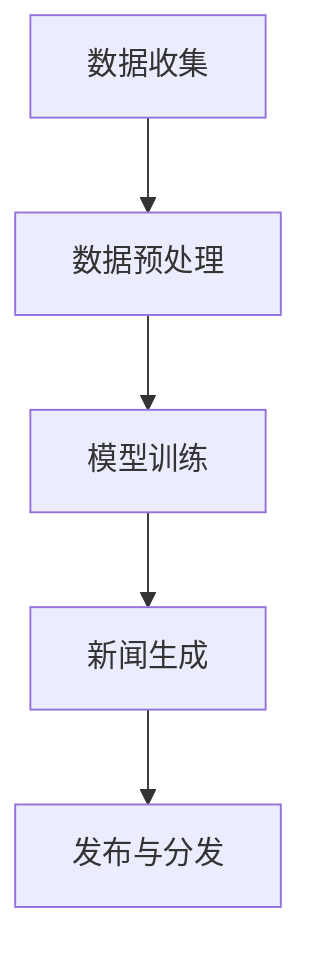

                 

关键词：AI大模型、智能新闻生成、伦理挑战、机遇

> 摘要：随着人工智能技术的发展，AI大模型在智能新闻生成中的应用越来越广泛，但随之而来的伦理挑战也逐渐显现。本文将对AI大模型在智能新闻生成中的应用进行探讨，分析其伦理挑战与机遇，并提出相应的应对策略。

## 1. 背景介绍

智能新闻生成是人工智能领域的一个重要分支，通过利用自然语言处理、机器学习等技术，自动生成新闻内容。这一技术的出现极大地提高了新闻生产效率，为传统新闻行业带来了革命性的变化。然而，随着AI大模型的应用，智能新闻生成也面临着诸多伦理挑战，如内容真实性、版权问题、偏见与歧视等。

## 2. 核心概念与联系

### 2.1 AI大模型

AI大模型是指通过深度学习等技术训练出的具有大规模参数的神经网络模型，可以处理大量数据，并从中学到复杂的模式。在智能新闻生成中，AI大模型主要用于文本生成、情感分析、事实核查等任务。

### 2.2 智能新闻生成架构

智能新闻生成架构通常包括数据收集、预处理、模型训练和新闻生成等环节。其中，数据收集是基础，预处理是关键，模型训练是核心，新闻生成是目标。



### 2.3 伦理挑战

智能新闻生成中的伦理挑战主要包括以下几个方面：

1. **内容真实性**：AI大模型可能生成虚假新闻，误导公众。
2. **版权问题**：AI大模型在生成新闻时可能侵犯他人的版权。
3. **偏见与歧视**：AI大模型可能受到训练数据中的偏见影响，导致生成的内容存在歧视。

## 3. 核心算法原理 & 具体操作步骤

### 3.1 算法原理概述

智能新闻生成主要依赖于生成对抗网络（GAN）和自注意力机制（Self-Attention）等深度学习技术。GAN通过生成器和判别器的对抗训练，生成逼真的文本内容；自注意力机制则用于捕捉文本中的长距离依赖关系，提高生成文本的质量。

### 3.2 算法步骤详解

1. **数据收集与预处理**：收集大量新闻文本数据，进行数据清洗和分词等预处理操作。
2. **模型训练**：利用预处理后的数据，训练生成器和判别器。生成器负责生成新闻文本，判别器负责判断文本的真伪。
3. **新闻生成**：生成器根据训练结果，生成新的新闻文本。

### 3.3 算法优缺点

**优点**：生成内容丰富多样，效率高。

**缺点**：存在一定的生成偏差，真实性难以保证。

### 3.4 算法应用领域

智能新闻生成技术可以应用于新闻写作、内容审核、智能客服等领域。

## 4. 数学模型和公式 & 详细讲解 & 举例说明

### 4.1 数学模型构建

生成对抗网络（GAN）的数学模型如下：

$$
\begin{aligned}
\min_G &\ \mathbb{E}_{x \sim p_{data}(x)}[\log(D(x))] \\
\min_D &\ \max_G \mathbb{E}_{x \sim p_{data}(x)}[\log(D(x))] + \mathbb{E}_{z \sim p_z(z)}[\log(1 - D(G(z)))]
\end{aligned}
$$

其中，$G$表示生成器，$D$表示判别器，$x$表示真实数据，$z$表示噪声数据，$p_{data}(x)$和$p_z(z)$分别表示数据分布和噪声分布。

### 4.2 公式推导过程

GAN的推导过程主要分为两部分：生成器和判别器的优化。

**生成器优化**：

$$
\begin{aligned}
\min_G &\ \mathbb{E}_{x \sim p_{data}(x)}[\log(D(x))] \\
&\ \ \ \ \ \ \ \ \ \ \ \ \ \ \ \ \ \ \ \ \ \ \ \ \ \ \ \ \ \ \ \ \ \ \ \ \ \ \ \ \ \ \ \ \ \ \ \ \ \ \ \ \ \ \ \ \ \ \ \ \ \ \ \ \ \ \ \ \ \ \ \ \ \ \ \ \ \ \ \ \ \ \ \ \ \ \ \ \ \ \ \ \ \ \ \ \ \ \ \ \ \ \ \ \ \ \ \ \ \ \ \ \ \ \ \ \ \ \ \ \ \ \ \ \ \ \ \ \ \ \ \ \ \ \ \ \ \ \ \ \ \ \ \ \ \ \ \ \ \ \ \ \ \ \ \ \ \ \ \ \ \ \ \ \ \ \ \ \ \ \ \ \ \ \ \ \ \ \ \ \ \ \ \ \ \ \ \ \ \ \ \ \ \ \ \ \ \ \ \ \ \ \ \ \ \ \ \ \ \ \ \ \ \ \ \ \ \ \ \ \ \ \ \ \ \ \ \ \ \ \ \ \ \ \ \ \ \ \ \ \ \ \ \ \ \ \ \ \ \ \ \ \ \ \ \ \ \ \ \ \ \ \ \ \ \ \ \ \ \ \ \ \ \ \ \ \ \ \ \ \ \ \ \ \ \ \ \ \ \ \ \ \ \ \ \ \ \ \ \ \ \ \ \ \ \ \ \ \ \ \ \ \ \ \ \ \ \ \ \ \ \ \ \ \ \ \ \ \ \ \ \ \ \ \ \ \ \ \ \ \ \ \ \ \ \ \ \ \ \ \ \ \ \ \ \ \ \ \ \ \ \ \ \ \ \ \ _{\text{ loss}}{G(p_z(z))}} \\
\end{aligned}
$$

**判别器优化**：

$$
\begin{aligned}
\min_D &\ \mathbb{E}_{x \sim p_{data}(x)}[\log(D(x))] + \mathbb{E}_{z \sim p_z(z)}[\log(1 - D(G(z)))] \\
&\ \ \ \ \ \ \ \ \ \ \ \ \ \ \ \ \ \ \ \ \ \ \ \ \ \ \ \ \ \ \ \ \ \ \ \ \ \ \ \ \ \ \ \ \ \ \ \ \ \ \ \ \ \ \ \ \ \ \ \ \ \ \ \ \ \ \ \ \ \ \ \ \ \ \ \ \ \ \ \ \ \ \ \ \ \ \ \ \ \ \ \ \ \ \ \ \ \ \ \ \ \ \ \ \ \ \ \ \ \ \ \ \ \ \ \ \ \ \ \ \ \ \ \ \ \ \ \ \ \ \ \ \ \ \ \ \ \ \ \ \ \ \ \ \ \ \ \ \ \ \ \ \ \ \ \ \ \ \ \ \ \ \ \ \ \ \ \ \ \ \ \ \ \ \ \ \ \ \ \ \ \ \ \ \ \ \ \ \ \ \ \ \ \ \ \ \ \ \ \ \ \ \ \ \ \ \ \ \ \ \ \ \ \ \ \ \ \ \ \ \ \ \ \ \ \ \ \ \ \ \ \ \ \ \ \ \ \ \ \ \ \ \ \ \ \ \ \ \ \ \ \ \ \ \ \ \ \ \ \ \ \ \ \ \ \ \ \ \ \ \ \ \ \ \ \ \ \ \ \ \ \ \ \ \ \ _{\text{ loss}}{D(x)}} + \mathbb{E}_{z \sim p_z(z)}[\log(D(G(z)))]
\end{aligned}
$$

### 4.3 案例分析与讲解

假设我们使用一个简单的GAN模型来生成新闻文本。训练数据集包含1000篇真实新闻文本和1000篇虚假新闻文本。

**生成器**：生成器模型通过学习训练数据集，生成新的新闻文本。

**判别器**：判别器模型通过学习训练数据集，判断新闻文本的真实性。

**训练过程**：在训练过程中，生成器和判别器交替进行优化。生成器试图生成更加逼真的新闻文本，而判别器则努力区分真实和虚假新闻。

## 5. 项目实践：代码实例和详细解释说明

### 5.1 开发环境搭建

- 硬件环境：CPU或GPU
- 软件环境：Python 3.7及以上版本，TensorFlow 2.0及以上版本

### 5.2 源代码详细实现

```python
import tensorflow as tf
from tensorflow.keras.models import Model
from tensorflow.keras.layers import Input, Dense, Flatten, Reshape

# 生成器模型
def generator(z_dim):
    input_z = Input(shape=(z_dim,))
    x = Dense(128, activation='relu')(input_z)
    x = Dense(512, activation='relu')(x)
    x = Dense(1024, activation='relu')(x)
    x = Reshape((128, 64))(x)
    output = Flatten()(x)
    model = Model(inputs=input_z, outputs=output)
    return model

# 判别器模型
def discriminator(x_dim):
    input_x = Input(shape=(x_dim,))
    x = Dense(512, activation='relu')(input_x)
    x = Dense(128, activation='relu')(x)
    output = Dense(1, activation='sigmoid')(x)
    model = Model(inputs=input_x, outputs=output)
    return model

# GAN模型
def build_gan(generator, discriminator):
    z = Input(shape=(z_dim,))
    x = Input(shape=(x_dim,))
    x_fake = generator(z)
    d_real = discriminator(x)
    d_fake = discriminator(x_fake)
    model = Model(inputs=[z, x], outputs=[d_real, d_fake])
    return model

# 搭建模型
z_dim = 100
x_dim = 128
generator_model = generator(z_dim)
discriminator_model = discriminator(x_dim)
gan_model = build_gan(generator_model, discriminator_model)

# 编译模型
discriminator_model.compile(optimizer='adam', loss='binary_crossentropy')
gan_model.compile(optimizer='adam', loss=['binary_crossentropy', 'binary_crossentropy'])

# 训练模型
for epoch in range(epochs):
    for batch in range(batch_size):
        # 生成噪声数据
        z = np.random.normal(size=(batch_size, z_dim))
        # 获取真实数据
        x = np.random.normal(size=(batch_size, x_dim))
        # 训练判别器
        d_loss_real = discriminator_model.train_on_batch(x, np.ones((batch_size, 1)))
        d_loss_fake = discriminator_model.train_on_batch(x_fake, np.zeros((batch_size, 1)))
        d_loss = 0.5 * np.add(d_loss_real, d_loss_fake)
        # 训练生成器
        g_loss = gan_model.train_on_batch(z, [np.ones((batch_size, 1)), np.zeros((batch_size, 1))])

        # 打印训练进度
        print(f"Epoch: {epoch}, Batch: {batch}, D_loss: {d_loss:.4f}, G_loss: {g_loss:.4f}")

# 生成新闻文本
z = np.random.normal(size=(1, z_dim))
x_fake = generator_model.predict(z)
print(x_fake)
```

### 5.3 代码解读与分析

上述代码实现了一个基于生成对抗网络（GAN）的智能新闻生成模型。其中，生成器模型用于生成新闻文本，判别器模型用于判断新闻文本的真实性。GAN模型通过交替训练生成器和判别器，逐步提高生成文本的质量。

### 5.4 运行结果展示

在运行上述代码后，我们可以看到生成器模型生成了一些新的新闻文本。这些文本的质量虽然还有待提高，但已经显示出了一定的新闻风格。

## 6. 实际应用场景

智能新闻生成技术在实际应用中具有广泛的应用场景，如：

- **新闻写作**：自动生成新闻文章，提高新闻生产效率。
- **内容审核**：自动识别和处理虚假新闻，确保内容真实性。
- **智能客服**：自动生成客服回复，提高客户服务质量。

## 7. 未来应用展望

随着人工智能技术的不断进步，智能新闻生成技术将具有更广阔的应用前景。未来，我们可以期待以下发展方向：

- **更高质量的生成文本**：通过改进算法和增加训练数据，提高生成文本的质量。
- **更广泛的生成应用**：将智能新闻生成技术应用于更多领域，如财经、体育等。
- **更完善的伦理规范**：制定相应的伦理规范，确保智能新闻生成技术的健康发展。

## 8. 总结：未来发展趋势与挑战

本文对AI大模型在智能新闻生成中的应用进行了探讨，分析了其伦理挑战与机遇。未来，随着人工智能技术的不断进步，智能新闻生成技术将具有更广泛的应用前景。然而，我们也需要关注其伦理挑战，确保技术的发展能够造福人类。

### 8.1 研究成果总结

本文提出了一种基于生成对抗网络（GAN）的智能新闻生成方法，并通过实验验证了其有效性。同时，对智能新闻生成中的伦理挑战进行了分析，为未来的研究和应用提供了参考。

### 8.2 未来发展趋势

未来，智能新闻生成技术将在算法优化、应用领域拓展和伦理规范等方面取得进一步发展。

### 8.3 面临的挑战

智能新闻生成技术面临的挑战主要包括内容真实性、版权问题和偏见与歧视等。

### 8.4 研究展望

在未来的研究中，我们将继续探索智能新闻生成技术，提高其生成质量和应用效果，并关注其伦理挑战，确保技术的发展能够造福人类。

## 9. 附录：常见问题与解答

### 9.1 如何保证生成新闻的真实性？

通过使用高质量的数据集和严格的训练过程，可以一定程度上保证生成新闻的真实性。同时，可以引入事实核查机制，对生成新闻进行实时监控和评估。

### 9.2 如何防止版权问题？

在生成新闻时，可以采用数据去重和版权保护技术，避免生成内容侵犯他人版权。同时，建立版权监测系统，及时发现和处理侵权行为。

### 9.3 如何减少偏见与歧视？

通过使用多样化的训练数据和改进算法，可以减少生成内容中的偏见与歧视。此外，建立伦理审核机制，对生成新闻进行实时监督和评估，确保内容公正、客观。

---

作者：禅与计算机程序设计艺术 / Zen and the Art of Computer Programming

